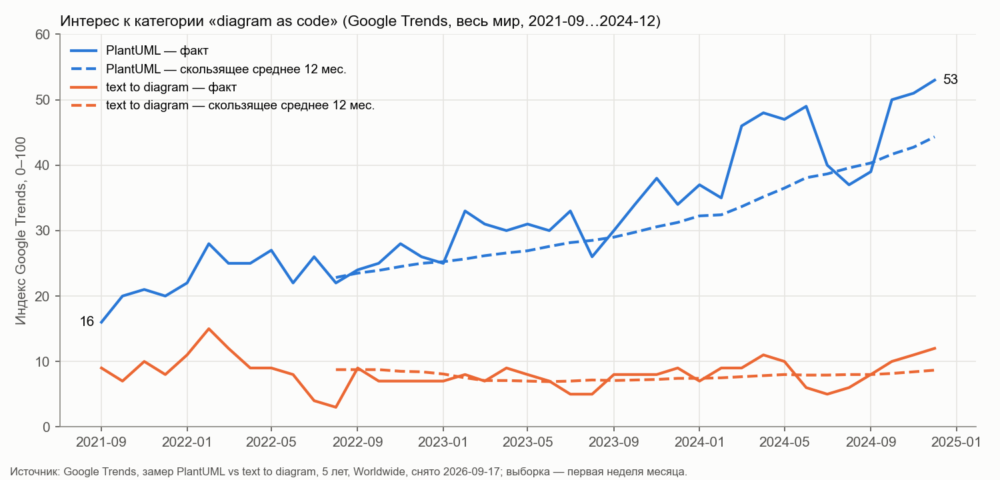
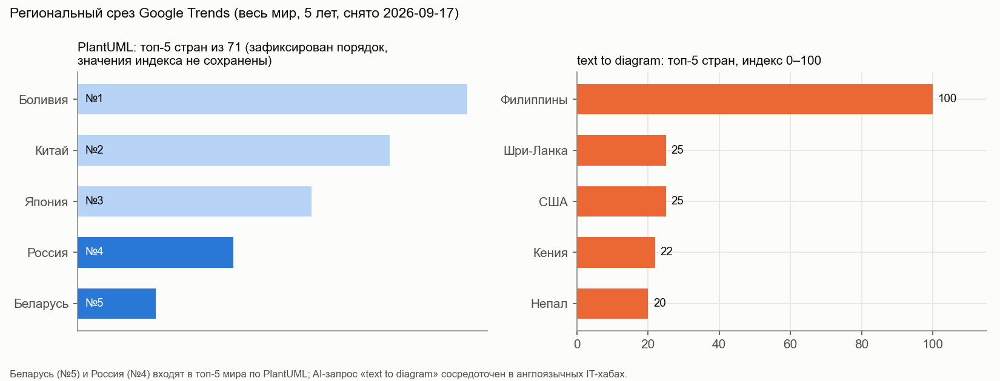
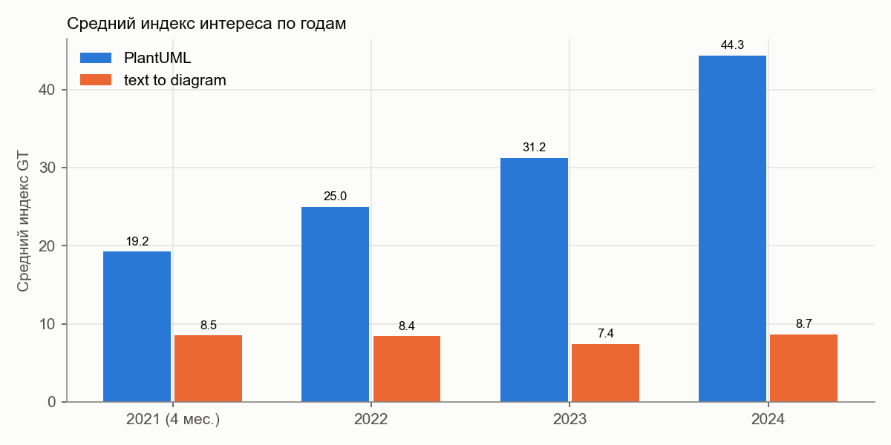
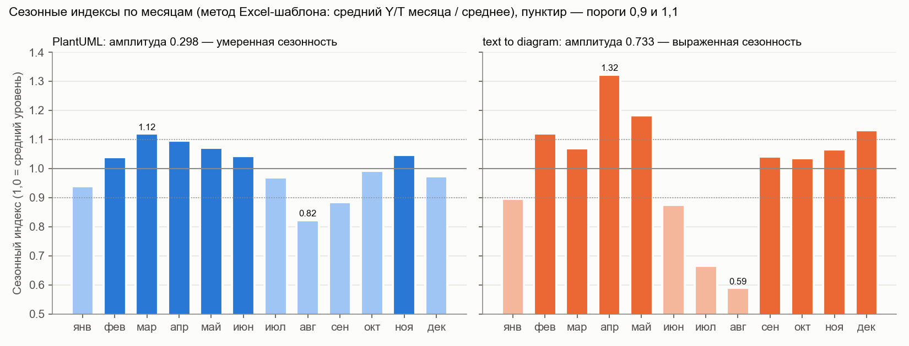
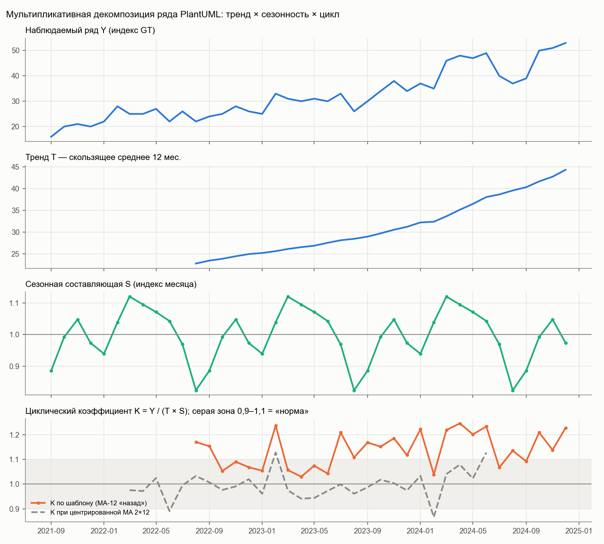

## 1 Цель работы

Цель работы — предварительно проверить бизнес-идею NotaCode по поисковому интересу аудитории. Для этого нужно:

- перевести профессиональную компетенцию в коммерческую бизнес-идею;
- составить семантическое ядро;
- собрать данные Google Trends и Яндекс Вордстат с зафиксированными настройками;
- оценить в Excel-шаблоне уровень интереса, тренд, сезонность и циклические отклонения;
- сравнить сигналы двух сервисов;
- зафиксировать границы рынка (продуктовые, клиентские, географические, канальные, семантические, конкурентные);
- обосновать выбор идеи и территории;
- сформулировать переход к анализу рынка.

Объект анализа — NotaCode, веб-IDE (PWA) класса «diagram as code» для формальных нотаций моделирования. Пользователь описывает диаграмму на собственном DSL. Система выполняет разбор и проверку по правилам нотации, раскладку (elkjs), SVG-отрисовку с кросс-подсветкой «строка ↔ элемент», хранение версий с diff и откатом. Доступен экспорт в SVG, PNG, PlantUML, Mermaid, D2, DOT, BPMN XML, XMI, PNML, draw.io и SQL DDL.

## 2 Ход работы

### 2.1 Исходные данные

Используются только реальные данные замера Google Trends от 17.09.2026 [1] и данные Similarweb [5]. Замер выполнен в прежней версии работы, где продукт назывался DiagramCode; это то же решение, переименованное в NotaCode. Пометкой 🔲 ДОСНЯТЬ отмечены данные, требующие личного снятия: Яндекс Вордстат требует входа в Яндекс ID, нужны выгрузки CSV по Беларуси. Пометкой «(допущение)» отмечены экспертные предположения без измерения. Состав исходных данных приведён в таблице 1.

Таблица 1 – Исходные данные

| Данные | Источник | Дата | Статус |
|---|---|---|---|
| Помесячный ряд Google Trends по запросам PlantUML и text to diagram, 40 месяцев (2021-09…2024-12), весь мир, 5 лет | Google Trends [1], рабочая книга замера | 17.09.2026 | есть |
| Средние индексы за 5 лет по шести терминам (diagram as code, PlantUML, Mermaid.js, UML diagram generator, ERD tool, text to diagram) | Google Trends [1] | 17.09.2026 | есть |
| Регионы (топ-5 стран) и связанные запросы | Google Trends [1] | 17.09.2026 | есть |
| Доля трафика plantuml.com по странам | Similarweb [5] | 17.09.2026 | есть |
| Google Trends по Беларуси (5 лет и 12 месяцев), CSV | Google Trends [1] | — | 🔲 ДОСНЯТЬ |
| Частотность, динамика, регионы и топы Яндекс Вордстат (Беларусь) | Яндекс Вордстат [3] | — | 🔲 ДОСНЯТЬ |
| Концепция, сегменты, тарифы, эпики E1–E9 | Концепция NotaCode [7] | 23.09.2026 | есть |
| Конкуренты и заменители | Анализ рынка и аналогов [8] | 17.09.2026 | есть |
| Excel-шаблон оценки тренда, сезонности и циклов | Методические материалы [6] | — | заполняется VBA-макросом (приложение Г) |

У NotaCode пока нет собственного поискового следа: продукт находится до MVP (спринт S10, 06.12.2026). Поэтому интерес измеряется по категории. Лучший измеримый прокси категории — PlantUML: это лидер ниши «diagram as code» и текстовый DSL для UML. Средний индекс PlantUML — 41, у остальных проверенных терминов — 2–4. По фразе «diagram as code» и нотационным запросам данные Google Trends почти нулевые, и сезонность по ним посчитать нельзя.

### 2.2 Компетенция и бизнес-идея

Декомпозиция идеи выполнена по цепочке «компетенция → функции → бизнес-продукт → потребность клиента → поисковый запрос» (таблица 2).

Таблица 2 – Декомпозиция компетенции в поисковый запрос

| Звено | NotaCode |
|---|---|
| Компетенция | Разработка ПО, инструменты разработчика, формальные нотации моделирования (UML, BPMN, ERD, IDEF, DFD, сети Петри) |
| Функции | Проектирование DSL и парсера, валидация правил нотаций, автораскладка, SVG-рендер, версионирование, экспорт в 11 форматов |
| Бизнес-продукт | Подписка Pro 4 USD/мес или 40 USD/год: больше 5 проектов и 20 версий, расширенный экспорт, AI-ассистент |
| Потребность клиента | Быстро получить корректную по правилам нотации диаграмму, хранить её как текст, видеть ошибки нотации до сдачи или ревью |
| Поисковый запрос | «IDEF0 онлайн», «BPMN редактор», «ER диаграмма онлайн», «UML онлайн», «plantuml аналог», «diagram as code», «text to diagram» |

Паспорт бизнес-гипотезы заполнен до сбора новых данных (таблица 3). Гипотеза о территории зафиксирована заранее, чтобы не подгонять вывод под показатели.

Таблица 3 – Паспорт бизнес-гипотезы

| Поле | Содержание |
|---|---|
| Исполнитель | Хаджинова К. |
| Компетенция-основание | Разработка веб-инструментов моделирования ПО (DSL, валидация нотаций, рендер диаграмм) |
| Бизнес-идея | Веб-IDE NotaCode: пользователь пишет диаграмму строгой нотации как текст; система проверяет её по правилам нотации, раскладывает, отрисовывает и хранит версии |
| Описание продукта | PWA, собственный DSL, 9 семейств нотаций (UML 14 типов, BPMN 2.0, ERD, IDEF0, IDEF1X, IDEF3, DFD, сети Петри, свободная нотация), кросс-подсветка, версии, diff и откат, экспорт, AI-ассистент (в MVP заглушка или BYOK) |
| Целевая аудитория | S-01 студенты технических специальностей (первичный, Free); S-02 бизнес- и системные аналитики (Pro); S-03 архитекторы ПО (Pro); S-04 преподаватели (канал влияния) |
| Проблема клиента | Строгие нотации приходится строить вручную. Графические редакторы не проверяют правила нотации. PlantUML, Mermaid и D2 не поддерживают IDEF0, IDEF1X, IDEF3, DFD и сети Петри. CASE-средства (Ramus, BPwin, Sparx EA) — платные настольные программы без текстового представления и без Git |
| Ценность для клиента | Меньше времени на построение и исправление диаграмм; ошибки нотации видны до сдачи работы; модель хранится как текст с историей версий |
| Гипотеза о территории | Республика Беларусь как ядро (вузы Минска, ИТ-компании), русскоязычный сегмент СНГ как расширение; дистанционная онлайн-модель |
| Причина выбора до анализа | Русскоязычный интерфейс; нотации IDEF и DFD входят в программы вузов РБ и СНГ; доступ к сегменту S-01 через вуз (допущение) |
| Ключевые запросы | diagram as code, PlantUML, text to diagram, IDEF0 онлайн, BPMN редактор, ER диаграмма онлайн, UML онлайн, нарисовать диаграмму онлайн |
| Ожидаемые признаки интереса | Устойчивый или растущий интерес к категории; учебная сезонность; запросы «онлайн», «редактор», «аналог» |
| Период анализа | Google Trends — 5 лет, в Excel — 40 месяцев; Вордстат — не менее 24–36 месяцев (🔲 ДОСНЯТЬ) |
| Дата подготовки вывода | 25.09.2026 |

### 2.3 Проблема аудитории и коммерческое предложение

Клиентские задачи сформулированы словами клиента, а не терминами исполнителя (таблица 4).

Таблица 4 – Клиентские задачи и коммерческое предложение по сегментам

| Сегмент | Клиентская задача | Как ищет решение | Предложение NotaCode |
|---|---|---|---|
| S-01 Студенты | Нарисовать IDEF0, DFD или ER-диаграмму для лабораторной или курсовой, чтобы её не вернули | «IDEF0 онлайн», «нарисовать диаграмму онлайн», «ER диаграмма онлайн бесплатно» | Free: 5 проектов, проверка правил нотации, экспорт SVG и PNG |
| S-02 Аналитики | Быстро собрать BPMN-процесс и поддерживать его в актуальном виде | «BPMN редактор», «bpmn онлайн», «camunda modeler аналог» | Pro: BPMN XML, версии и diff, неограниченные проекты |
| S-03 Архитекторы | Держать UML и ERD рядом с кодом в Git, не рисуя вручную | «diagram as code», «plantuml alternative», «erd tool» | Pro: DSL, экспорт в PlantUML, Mermaid, D2 и SQL DDL, интеграция с GitHub |
| S-04 Преподаватели | Проверять работы студентов по единым правилам нотации | «IDEF0 правила», «ICOM IDEF0» | Канал: бесплатное использование на курсе и рекомендация студентам (допущение) |

### 2.4 Семантическое ядро

#### 2.4.1 Карта поисковых запросов

Запросы распределены по группам формы методики (таблица 5). Полный реестр из 50 запросов на русском и английском языках с кластером, типом намерения, этапом воронки, сегментом и приоритетом приведён в приложении А.

Таблица 5 – Карта поисковых запросов по группам

| Группа | Назначение | Выбранные запросы | Зачем проверяется |
|---|---|---|---|
| Общие тематические | Интерес к категории | diagram as code; диаграммы как код; редактор диаграмм | Ширина категории |
| Синонимы и разговорные | Язык аудитории | нарисовать диаграмму онлайн; сделать схему онлайн; построить диаграмму | Бытовые формулировки студентов |
| Профессиональные | Термины нотаций | IDEF0; BPMN 2.0; ER диаграмма; UML диаграмма классов; DFD; сеть Петри | Спрос по нотациям |
| Проблемные | Боль клиента | как построить IDEF0; ошибки IDEF0; как проверить BPMN; how to version control diagrams | Потребность в валидации и версиях |
| Коммерческие | Выбор инструмента | программа для IDEF0; BPMN редактор; visual paradigm цена; enterprise architect цена | Близость к выбору и покупке |
| Продуктовые | Конкретная функция | IDEF0 онлайн; ER диаграмма онлайн; uml online editor; text to diagram; ai diagram generator | Формулировки под функции NotaCode |
| Сегментные | Тип клиента | диаграмма для курсовой; BPMN для аналитика; UML для архитектора | Сегменты S-01…S-03 |
| Географические | Территория | uml онлайн на русском; редактор диаграмм на русском | Русскоязычный сегмент |
| Бренды и конкуренты | Сложившиеся предложения | PlantUML; Mermaid; draw.io; Lucidchart; D2; Ramus; Camunda Modeler; dbdiagram | Конкуренты и заменители |
| Смежные | Соседние направления | нейросеть для диаграмм; C4 model; structurizr | AI-функция и архитектурные нотации |
| Исключаемые | Не коммерческий спрос | IDEF0 реферат; что такое UML; UML учебник pdf; BPMN вакансии | Очистка от учебного и кадрового интереса |

#### 2.4.2 Очистка ядра

Исключаемые и осторожно интерпретируемые запросы приведены в таблице 6.

Таблица 6 – Исключаемые и осторожно интерпретируемые запросы

| Запросы | Причина ограничения | Как использовать |
|---|---|---|
| IDEF0 реферат; UML курсовая скачать; пример IDEF0 готовый | Ищут готовую работу, а не инструмент | Исключить; возможна тема контента «пример на DSL» |
| что такое UML; нотация BPMN это | Информационный интерес | Учитывать как верх воронки, не как спрос |
| UML учебник pdf; курсы BPMN; обучение бизнес-анализу | Обучающий рынок | Исключить |
| бизнес-аналитик вакансии; системный аналитик Минск зарплата | Кадровый интерес | Исключить |
| visio скачать крякнутый; enterprise architect crack | Пиратство, нет платёжеспособности | Исключить |
| «… бесплатно» (bpmn онлайн бесплатно) | Смешанный интерес; релевантен, так как вход через Free | Отдельная группа — сигнал конверсии в Free |
| mermaid без уточнения | Омоним | Только с «diagram», «js», «chart» |

#### 2.4.3 Коммерческая приоритизация кластеров

Приоритет кластеров определён по ожидаемому интересу, близости к покупке и конкурентности (таблица 7).

Таблица 7 – Коммерческая приоритизация кластеров

| Кластер | Близость к покупке | Конкурентность | Приоритет | Практический вывод |
|---|---|---|---|---|
| К2 IDEF0, IDEF3, DFD | Высокая | Низкая: diagram-as-code-аналогов нет | Очень высокий | Главная точка входа S-01, отличие от PlantUML и Mermaid |
| К3 BPMN | Высокая | Высокая (Camunda, bpmn.io, draw.io) | Высокий | Позиционирование «BPMN как код + BPMN XML» для S-02 |
| К4 ERD | Высокая | Средняя (dbdiagram, draw.io) | Высокий | Экспорт SQL DDL как аргумент |
| К5 UML | Средняя | Высокая (PlantUML, Lucidchart) | Средний | Не главный фронт |
| К6 Аналоги PlantUML и Mermaid | Высокая (стадия сравнения) | Высокая | Высокий | Контент «NotaCode и PlantUML», экспорт в PlantUML и Mermaid |
| К8 AI | Средняя | Растущая (Eraser.io) | Средний | В MVP AI — заглушка; не главное обещание релиза |
| К7 Проблемные | Средняя | — | Средний | Контент «как построить IDEF0 без ошибок» |
| К1 Diagram as code | Низкая | — | Средний | Термин позиционирования, не канал привлечения |

#### 2.4.4 Пакеты для сравнения в Google Trends

По методике в одном сравнении допускается не более пяти запросов одного уровня обобщения (таблица 8).

Таблица 8 – Пакеты запросов для Google Trends

| Пакет | Запросы | Настройки | Цель |
|---|---|---|---|
| П1 Бренды-аналоги | PlantUML; Mermaid (тема); draw.io; Lucidchart; D2 | Беларусь; 5 лет; все категории; веб-поиск | Сравнение брендов одного уровня |
| П2 Нотации (темы) | UML; BPMN; IDEF0; ER-модель; DFD | Беларусь; 5 лет; «Компьютеры и электроника» | Какие нотации ищут чаще |
| П3 Онлайн-инструмент | UML онлайн; BPMN онлайн; IDEF0 онлайн; ER диаграмма онлайн; нарисовать диаграмму онлайн | Беларусь; 5 лет | Коммерческие формулировки на русском |
| П4 AI | text to diagram; ai diagram generator; нейросеть диаграмма | Весь мир и Беларусь; 5 лет | Точка роста AI |
| П5 География | PlantUML по странам: Беларусь, Россия, Казахстан, Польша, Литва | 5 лет | Выбор территории |

Вывод по ядру. Интерес к NotaCode выражается через кластеры IDEF0/DFD, BPMN, ERD и аналоги PlantUML/Mermaid. В ядре есть информационные, проблемные, инструментальные и сравнительные запросы. Значит, аудитория не только изучает нотации, но и ищет инструмент для их построения. Прямых транзакционных запросов (цена, подписка) в нише мало (допущение, 🔲 ДОСНЯТЬ в Вордстате). Коммерческое намерение выражается через «онлайн», «программа для», «аналог». Это соответствует freemium-модели: вход через Free, монетизация через Pro.

### 2.5 Результаты Google Trends

#### 2.5.1 Протокол анализа

Параметры замера и основные наблюдения приведены в таблице 9.

Таблица 9 – Протокол анализа Google Trends

| Поле | Значение |
|---|---|
| Дата анализа | 17.09.2026 (замер), обработка 25.09.2026 |
| Цель | Решить, есть ли растущий интерес к категории «diagram as code», для запуска NotaCode и выбора стартовой географии |
| Термины | Замер 1: diagram as code, PlantUML, Mermaid.js. Замер 2: UML diagram generator, ERD tool, text to diagram. Замер 3: PlantUML, text to diagram |
| Регион | Весь мир. Отклонение от методики для РБ: замер по Беларуси не проводился (🔲 ДОСНЯТЬ) |
| Период | 5 лет; в Excel перенесены 40 месяцев 2021-09…2024-12 (первая неделя каждого месяца) |
| Категория и тип поиска | Все категории; веб-поиск |
| Основные наблюдения | Рост PlantUML; сезонный спад летом и в последнюю неделю декабря; плато нотационных генераторов; Breakout «text to diagram ai»; Беларусь — 5-е место, Россия — 4-е по PlantUML |
| Интерпретация | Категория растёт; спрос смещается к генерации диаграмм по тексту; в русскоязычном регионе есть опора |
| Проверочный источник | Similarweb: у plantuml.com Россия — 1-я страна по трафику (9,07 %) [5] |
| Практическое решение | Тестировать: запуск MVP с узким позиционированием |
| Ограничения | Относительный индекс; мир, а не РБ; для PlantUML записан только порядок стран |

Сводная фиксация данных по шести терминам приведена в таблице Б.1 приложения Б. Динамика PlantUML и text to diagram показана на рисунке 1.

Рисунок 1 – Интерес к PlantUML и text to diagram (Google Trends, весь мир, 2021-09…2024-12) и скользящее среднее за 12 месяцев

#### 2.5.2 Расчётные показатели

Средний индекс за период рассчитывается по формуле

Ȳ = ΣYᵢ / n, (1)

где Yᵢ – индекс Google Trends в месяце i;
n – число месяцев.

Изменение последних трёх месяцев к предыдущим трём рассчитывается по формуле

Δ₃ = (Ȳ₃ посл / Ȳ₃ пред − 1) · 100 %, (2)

где Ȳ₃ посл – средний индекс за октябрь–декабрь 2024 г.;
Ȳ₃ пред – средний индекс за июль–сентябрь 2024 г.

Результаты расчёта приведены в таблице 10.

Таблица 10 – Расчётные показатели Google Trends

| Показатель | PlantUML | text to diagram |
|---|---|---|
| Средний индекс за 40 месяцев, формула (1) | 1284 / 40 = 32,10 | 328 / 40 = 8,20 |
| Максимум | 53 (2024-12) | 15 (2022-02) |
| Минимум | 16 (2021-09) | 3 (2022-08) |
| Изменение 3 мес. к 3 мес., формула (2) | (51,33 / 38,67 − 1) · 100 % = +32,8 % | (11,00 / 6,33 − 1) · 100 % = +73,7 % |
| Доля месяцев роста | 23 / 39 = 59,0 % | 15 / 39 = 38,5 % |
| Уровень по шкале методики для РБ (60–100 высокий; 30–59 средний; 10–29 низкий; 0–9 недостаточный) | средний | недостаточный (за 5 лет — 26, низкий) |

Рост PlantUML на 32,8 % по трём месяцам частично сезонный: июль–сентябрь — сезонный минимум (подраздел 2.9). Поэтому вывод о тренде строится по 12-месячным средним.

#### 2.5.3 Региональный срез и связанные запросы

Топ-5 стран по интересу показаны на рисунке 2 и в таблице 11.

Рисунок 2 – Региональный срез Google Trends (весь мир, 5 лет, снято 17.09.2026)

Таблица 11 – Топ-5 стран по интересу

| Место | PlantUML (из 71 страны с данными) | text to diagram (индекс) |
|---|---|---|
| 1 | Боливия | Филиппины – 100 |
| 2 | Китай | Шри-Ланка – 25 |
| 3 | Япония | США – 25 |
| 4 | Россия | Кения – 22 |
| 5 | Беларусь | Непал – 20 |

Интерес к категории (PlantUML) относительно сконцентрирован в Беларуси и России. AI-запрос «text to diagram» сосредоточен в англоязычных IT-аутсорсинговых хабах. Индекс региона показывает концентрацию интереса, а не объём рынка. Пятое место Беларуси не означает, что это пятый по размеру рынок.

Связанный запрос «text to diagram ai» имеет статус Breakout (рост более 5000 %). Отсюда действие: включить AI-формулировки в посадочную страницу и описание эпика E9 и вести англоязычный контент с первого релиза. У PlantUML для связанных запросов недостаточно данных; замер нужно повторить по Беларуси на 12 месяцах (🔲 ДОСНЯТЬ).

#### 2.5.4 Контроль настроек и балльная оценка направлений

Результаты проверки настроек Google Trends приведены в таблице 12.

Таблица 12 – Чек-лист настройки Google Trends

| Проверка | Результат | Комментарий |
|---|---|---|
| География — Беларусь | Нет | Замер по миру; 🔲 ДОСНЯТЬ по Беларуси |
| Период одинаков для сравниваемых запросов | Да | 5 лет во всех замерах |
| Категория выбрана или сознательно общая | Да | Все категории: запросы технические |
| Тип поиска указан | Да | Веб-поиск |
| Запросы разделены по смысловым группам | Да | Бренды, инструменты, AI |
| Коммерческие, образовательные и информационные не смешаны | Частично | Бренд и категория в замере 1 |
| CSV выгружены и сохранены | Нет | Значения переписаны с графика; 🔲 ДОСНЯТЬ CSV |
| Связанные запросы зафиксированы | Да | text to diagram ai — Breakout |
| Вывод проверен дополнительными источниками | Частично | Similarweb |
| Ограничения указаны | Да | Подраздел 2.15 |

Балльная оценка направлений по пяти критериям (1/3/5 баллов) приведена в таблице Б.2 приложения Б. Направление «diagram as code для UML/ERD» набирает 19 баллов, AI-генерация — 15. Порог методики: 20–25 — приоритет для тестирования; 14–19 — доработать позиционирование; менее 14 — не запускать без подтверждений.

### 2.6 Результаты Яндекс Вордстат

🔲 ДОСНЯТЬ. Вордстат требует входа в Яндекс ID: без него сервис переадресует на страницу авторизации (проверено 23.09.2026). Подготовлены рабочий лист с настройками (таблица 13), список запросов с операторами и формы фиксации (таблицы Б.3 и Б.4 приложения Б). После досбора помесячные значения вносятся на лист «Ввод_NotaCode» Excel-книги и пересчитываются макросом (приложение Г).

Таблица 13 – Рабочий лист Яндекс Вордстат

| Поле | Значение |
|---|---|
| Дата анализа | 🔲 ДОСНЯТЬ |
| Бизнес-гипотеза | Спрос на онлайн-инструмент построения диаграмм строгих нотаций в Беларуси |
| Целевая аудитория | S-01…S-03 |
| Регион | Беларусь, затем Минск, Гомель, Брест, Витебск, Гродно, Могилёв |
| Период | Помесячно, максимально доступный (не менее 36 месяцев) |
| Устройства | Все, затем отдельно десктопы и смартфоны |
| Базовые запросы | idef0; bpmn; er диаграмма; uml; plantuml; диаграмма онлайн; редактор диаграмм; dfd диаграмма; draw io; нарисовать схему |
| Операторы | (idef0\|idef 0\|айдеф) -реферат -скачать -пример; bpmn -вакансия -курсы -обучение; "uml онлайн"; !программа для !idef0; (er\|erd) диаграмма -реферат |
| Главные коммерческие и информационные запросы | 🔲 ДОСНЯТЬ |
| Выявленная сезонность | 🔲 ДОСНЯТЬ (гипотеза: пики в марте–апреле и ноябре, спад в июле–августе, как в Google Trends) |
| Территории с индексом выше 100 % | 🔲 ДОСНЯТЬ (гипотеза: Минск) |
| Ограничения | Только аудитория Яндекса; в Беларуси заметная доля поиска приходится на Google (🔲 ДОСНЯТЬ долю) |

Шаблон вывода (заполнить после досбора): «По данным Яндекс Вордстат, в Беларуси наблюдается [🔲] поисковый интерес к онлайн-инструментам построения диаграмм. Наиболее выражены запросы группы [🔲], что указывает на [инструментальный / учебный] характер интереса. Динамика за [🔲] показывает [🔲]. Повышенный интерес (индекс выше 100 %) выявлен в [🔲]. Для NotaCode это означает целесообразность [🔲]».

### 2.7 Выгруженные данные и журнал выгрузки

Журнал выгрузки приведён в таблице Б.5 приложения Б и продублирован на листе «Журнал_выгрузки» Excel-шаблона: его заполняет макрос, строки Вордстата помечены «[ДОСНЯТЬ]». Файлы выгрузки именуются по схеме методики [6]: GT_дата_территория_период_запрос_карточка.csv и YW_дата_территория_запрос_вкладка.xlsx. Доказательная база раскладывается по папкам: 01_Исходные_данные, 02_Рабочие_таблицы, 03_Диаграммы, 04_Итоговый_вывод, 05_Журнал_выгрузки (🔲 ДОСНЯТЬ).

Первичная обработка ряда выполнена так:

- незавершённый месяц исключён: ряд заканчивается 2024-12, провал августа 2026 г. в расчёт не попал;
- периодичность месячная: взята первая неделя месяца;
- Вордстат нормируется в шаблоне по формуле

F = E / max(E) · 100, (3)

где E – число запросов Вордстата в месяце;
max(E) – максимум ряда.

Сводный индекс шаблона рассчитывается по формуле

G = D · w_GT + F · w_YW, (4)

где D – индекс Google Trends;
w_GT, w_YW – веса источников (по умолчанию 0,5 и 0,5).

Если один из источников пуст, берётся имеющийся. Сейчас Вордстат не внесён, поэтому G = D.

### 2.8 Оценка тренда

Расчёт выполнен на листах «Расчет» и «Оценка_тренда» Excel-шаблона. Шаблон заполнен VBA-макросом. Результат проверен пересчётом книги в Microsoft Excel и совпал с расчётом Python-скрипта (приложение Г).

Относительное изменение среднего уровня рассчитывается по формуле

ΔT = (Ȳ₁₂ посл − Ȳ₁₂ перв) / Ȳ₁₂ перв, (5)

где Ȳ₁₂ перв – средний сводный индекс за первые 12 месяцев ряда;
Ȳ₁₂ посл – средний сводный индекс за последние 12 месяцев.

Классификация: ΔT ≥ +15 % — растущий тренд, ΔT ≤ −15 % — снижающийся, иначе — стабильный. Показатели тренда приведены в таблице 14.

Таблица 14 – Показатели тренда (лист «Оценка_тренда»)

| Показатель | Подстановка | Значение |
|---|---|---|
| Количество наблюдений | — | 40 (требуется не менее 24) |
| Средний индекс за первые 12 месяцев | (16 + 20 + 21 + 20 + 22 + 28 + 25 + 25 + 27 + 22 + 26 + 22) / 12 = 274 / 12 | 22,83 |
| Средний индекс за последние 12 месяцев | (37 + 35 + 46 + 48 + 47 + 49 + 40 + 37 + 39 + 50 + 51 + 53) / 12 = 532 / 12 | 44,33 |
| Абсолютное изменение | 44,33 − 22,83 | +21,50 п. |
| Относительное изменение, формула (5) | 21,50 / 22,83 | +94,2 % |
| Наклон линейного тренда (SLOPE) | МНК по 40 точкам | +0,758 п./мес. (около +9,1 п./год) |
| Классификация | 94,2 % ≥ 15 % | растущий тренд |

Средние по годам показаны на рисунке 3 и в таблице 15.

Рисунок 3 – Средний индекс интереса по годам (для 2021 г. — сентябрь–декабрь)

Таблица 15 – Оценка устойчивой динамики по кластерам

| Кластер | Среднее 2023 г. | Среднее 2024 г. | Изменение, % | Тип динамики |
|---|---|---|---|---|
| Diagram as code (прокси — PlantUML) | 31,25 | 44,33 | +41,9 | Устойчивый рост (2022 → 2023: +25,0 %) |
| AI-генерация (text to diagram) | 7,42 | 8,67 | +16,9 | Стабильный в 2021–2024 гг. (−1,0 % по формуле (5)); сдвиг вверх с середины 2025 г. (по графику замера) |

Рост PlantUML не объясняется одним событием: он виден в каждом году (19,25 → 25,0 → 31,25 → 44,33). Скользящее среднее за 12 месяцев монотонно растёт с 22,8 (2022-08) до 44,3 (2024-12).

Вывод о тренде. Данные Google Trends показывают признаки устойчивого роста поискового интереса к категории «diagram as code». Средний уровень последних 12 месяцев на 94,2 % выше уровня первых 12, скользящее среднее растёт на всём периоде. Это позволяет считать направление NotaCode перспективным для дальнейшего анализа рынка и проверки платёжеспособного спроса. Рост пока подтверждён только по брендовому прокси категории; по русскоязычным коммерческим запросам (IDEF0 онлайн, BPMN редактор) он не проверен (🔲 ДОСНЯТЬ).

### 2.9 Оценка сезонности

Тренд в шаблоне — скользящее среднее за 12 предыдущих месяцев

Tₙ = (Gₙ₋₁₁ + … + Gₙ) / 12. (6)

Сезонный индекс месяца рассчитывается по формуле

Sₘ = avg(Y/T)ₘ / avg(avg(Y/T)₁…avg(Y/T)₁₂), (7)

где avg(Y/T)ₘ – среднее отношение факта к тренду для календарного месяца m по всем годам.

Пример для марта: 2023-03 — 31 / 26,17 = 1,185; 2024-03 — 46 / 33,67 = 1,366. Среднее — 1,276; среднее двенадцати месячных значений — 1,138. Индекс марта равен S₃ = 1,276 / 1,138 = 1,121.

Амплитуда сезонности рассчитывается по формуле

A = max(Sₘ) − min(Sₘ), (8)

Сила сезонности: A ≥ 0,30 — выраженная, A ≥ 0,15 — умеренная, иначе — слабая. Сезонные индексы приведены на рисунке 4 и в таблице 16.

Рисунок 4 – Сезонные индексы по месяцам (метод Excel-шаблона), пороги 0,9 и 1,1

Таблица 16 – Сезонные индексы и решения для бизнеса

| Месяц | Индекс PlantUML | Оценка месяца | Индекс text to diagram | Решение для NotaCode |
|---|---|---|---|---|
| Январь | 0,939 | средний | 0,895 | Подготовка контента к весеннему семестру |
| Февраль | 1,039 | средний | 1,121 | Старт весенней кампании (за месяц до пика) |
| Март | 1,121 | сезонный максимум | 1,070 | Пик: максимум рекламы и контента |
| Апрель | 1,095 | повышенный | 1,323 | Пик AI-запросов, курсовые |
| Май | 1,072 | повышенный | 1,184 | Сдача курсовых, поддержка пользователей |
| Июнь | 1,043 | средний | 0,876 | Снижение бюджета |
| Июль | 0,969 | средний | 0,666 | Низкий сезон: разработка, релизы |
| Август | 0,823 | сезонный минимум | 0,591 | Не тратить рекламный бюджет, готовить осеннюю кампанию |
| Сентябрь | 0,885 | сезонный минимум | 1,041 | Старт осенней кампании |
| Октябрь | 0,992 | средний | 1,036 | Рост |
| Ноябрь | 1,048 | повышенный | 1,067 | Второй пик: курсовые проекты |
| Декабрь | 0,973 | средний, спад в последнюю неделю | 1,131 | Спад перед праздниками |

Для PlantUML A = 1,121 − 0,823 = 0,298 — умеренная сезонность у верхней границы. Для text to diagram A = 1,323 − 0,591 = 0,733 — выраженная.

Повторяемость подтверждена за три года. Провал августа у PlantUML — 22 (2022), 26 (2023) и 37 (2024): каждый раз ниже соседних месяцев. Летний провал text to diagram в июле–августе — 4 и 3 (2022), 5 и 5 (2023), 5 и 6 (2024). Спад в последнюю неделю декабря по недельным данным: 2021 — 9 против 19 в среднем за квартал (−52,6 %), 2022 — 15 против 24 (−37,5 %), 2023 — 20 против 34 (−41,2 %).

Классический индекс Word-методики [6] рассчитывается по формуле

Iₘ = Ȳₘ / Ȳ · 100, (9)

где Ȳₘ – среднее значение месяца m по всем годам;
Ȳ – среднее всех месяцев.

Для PlantUML он даёт максимум в мае (109,0) и минимум в сентябре (84,9). Этот индекс смещён ростом тренда: в осенние месяцы попадают низкие значения 2021 г. Поэтому в выводах используется индекс шаблона, очищенный от тренда.

Вывод о сезонности. Данные показывают сезонность учебного типа: умеренную по PlantUML и выраженную по text to diagram. Наиболее сильные значения приходятся на март–май и ноябрь, снижение — на июль–сентябрь с минимумом в августе. Рисунок совпадает с учебным годом, значит, заметную долю аудитории категории составляют студенты и преподаватели (сегменты S-01 и S-04). Продвижение NotaCode нужно начинать за 1–2 месяца до пиков: в конце января — феврале и в сентябре — октябре. Для MVP (06.12.2026) первая кампания — февраль 2027 г.

### 2.10 Оценка циклических отклонений

Циклический коэффициент рассчитывается по формуле

K = Y / (T · S), (10)

где Y – фактический сводный индекс;
T – тренд по формуле (6);
S – сезонный индекс месяца по формуле (7).

Фаза: K < 0,9 — «ниже тренда», K > 1,1 — «выше тренда», иначе — «норма». Результаты листа «Деловые_циклы» приведены в таблице 17. Помесячный расчёт приведён в приложении В.

Таблица 17 – Циклические отклонения по Excel-шаблону

| Показатель | Значение |
|---|---|
| Последний период | 2024-12 |
| Текущий коэффициент, формула (10) | 53 / (44,33 · 0,973) = 1,228 |
| Текущая фаза | выше тренда |
| Минимальный и максимальный K | 1,030 (2023-04) и 1,246 (2024-04) |
| Амплитуда | 0,216 |
| Фазы за 29 рассчитанных месяцев | выше тренда — 18; норма — 11; ниже тренда — 0 |

Итоговая формулировка панели шаблона: «Интерес аудитории растет; бизнес-идея может быть дополнительно проверена на платежеспособный спрос. Сезонность: умеренная сезонность; максимум интереса — март, минимум — август. Текущая фаза спроса: выше тренда».

У шаблона обнаружен методический изъян. Скользящее среднее по формуле (6) строится по 12 предыдущим месяцам и в растущем ряду отстаёт от факта примерно на полгода. Поэтому K систематически больше единицы: нет ни одного месяца «ниже тренда». Методика требует оценивать цикл по ряду, очищенному от тренда и сезонности [6]. Поэтому выполнен контрольный расчёт с центрированным скользящим средним 2×12:

Tₙᶜ = (avg(Gₙ₋₆…Gₙ₊₅) + avg(Gₙ₋₅…Gₙ₊₆)) / 2. (11)

Сравнение двух вариантов приведено в таблице 18 и на рисунке 5.

Таблица 18 – Сравнение расчёта по шаблону и с центрированным скользящим средним

| Показатель | Шаблон, формула (6) | Поправка, формула (11) |
|---|---|---|
| Сезонный максимум и минимум | март 1,121; август 0,823 | март 1,106; август 0,836 |
| Амплитуда сезонности | 0,298 (умеренная) | 0,269 (умеренная) |
| Диапазон K | 1,030…1,246 | 0,867…1,128 |
| Месяцы «выше тренда» | 18 из 29 | 2 из 28 (2023-02; 2024-06) |
| Месяцы «ниже тренда» | 0 | 2 (2022-06; 2024-02) |
| Последний рассчитанный K | 1,228 (2024-12) | 1,128 (2024-06) |

Рисунок 5 – Мультипликативная декомпозиция ряда PlantUML: тренд, сезонность и циклический коэффициент

Вывод о циклических отклонениях. После сглаживания и исключения сезонности поисковый интерес к категории почти всё время находится в норме: 24 из 28 месяцев в интервале 0,9–1,1. Отклонения единичные и не образуют фаз длиной в несколько кварталов. Признаков циклического спада нет; по растущему скользящему среднему ряд находится в фазе роста. Весной–летом 2024 г. интерес был выше трендово-сезонного уровня (K = 1,08…1,13). Это может указывать на фазу повышенной активности, но проверять это нужно внешними данными: ИТ-вакансиями, бюджетами на инструменты разработки, релизами конкурентов. Поисковые данные деловой цикл не доказывают. Падение PlantUML в начале августа 2026 г. (с 80–100 до 26–32 на графике замера) считается артефактом неполной последней недели и в расчёт не включено.

### 2.11 Сравнение Google Trends и Яндекс Вордстат

Сигналы двух сервисов сопоставлены по критериям методики (таблица 19).

Таблица 19 – Сопоставление источников

| Критерий | Сигнал Google Trends | Сигнал Яндекс Вордстат | Итоговая интерпретация |
|---|---|---|---|
| Наличие интереса | Есть: PlantUML — средний уровень (32–41) | 🔲 ДОСНЯТЬ | Есть (по одному источнику) |
| Устойчивость | Рост +94,2 %, повторяемая учебная сезонность | 🔲 ДОСНЯТЬ | Устойчивый, сезонный |
| Коммерческий характер | Косвенно: бренды и инструменты («generator», «tool») | 🔲 ДОСНЯТЬ | Смешанный: инструментальный и учебный |
| Территориальная выраженность | Беларусь — 5-е место, Россия — 4-е | 🔲 ДОСНЯТЬ (ожидается Минск выше 100 %) | Национальный, дистанционный |
| Специализация | Генерация по тексту растёт; генераторы UML и ERD — плато | 🔲 ДОСНЯТЬ | Первой выводить валидацию IDEF и BPMN как кода; AI — вторым этапом |
| Ограничения | Мир, а не РБ; относительный индекс | Только аудитория Яндекса | Нужен повтор Google Trends по РБ и сбор Вордстата |

Сейчас сигналы дают ситуацию «Google Trends растёт, Вордстат не измерен». По методике окончательный вывод делать нельзя, пока не проверены формулировки, регион и доля Google и Яндекса в Беларуси. Показатели сервисов механически не складываются: в Excel-шаблоне они объединяются только через нормированный сводный индекс по формуле (4), и только после досбора.

### 2.12 Паспорт границ рынка

#### 2.12.1 Продуктовые границы и заменители

Продуктовые границы зафиксированы по методике [6] (таблица 20).

Таблица 20 – Продуктовые границы

| Поле | Заполнение |
|---|---|
| Исходная идея | Веб-IDE для диаграмм строгих нотаций как кода |
| Клиентская задача | Построить корректную по правилам нотации диаграмму и поддерживать её актуальной |
| Основные решения | DSL-редакторы диаграмм с рендером: UML, BPMN, ERD, IDEF0/IDEF1X/IDEF3, DFD, сети Петри; проверка правил нотации |
| Дополнительные | Версии, diff и откат; экспорт и импорт в PlantUML, Mermaid, D2, DOT, BPMN XML, XMI, PNML, draw.io, SQL DDL; интеграции с GitHub и Google Drive |
| Смежные (отдельная проверка) | AI-генерация по тексту; C4 и архитектурные диаграммы; совместное редактирование в реальном времени |
| Исключения | Универсальные доски (Miro, FigJam), редакторы блок-схем без нотаций, BI-графики, корпоративные EA-репозитории (Sparx EA, ARIS) как платформа управления архитектурой |

Заменители разделены на шесть типов (таблица 21).

Таблица 21 – Матрица заменителей

| Тип альтернативы | Признак | Примеры | Источник |
|---|---|---|---|
| Прямой конкурент | Текст → диаграмма, та же аудитория | PlantUML, Mermaid, D2, Eraser.io | [1], [8] |
| Частичный заменитель | Решает часть задачи | Camunda Modeler, bpmn.io, dbdiagram.io, Structurizr, CPN Tools | [8] |
| Внутренний заменитель | Инструмент уже есть в организации или вузе | Visio, Enterprise Architect, Visual Paradigm, Ramus, BPwin | [8] (допущение) |
| Самостоятельное решение | Рисует сам вручную | draw.io, Lucidchart, Word, PowerPoint | [5]: app.diagrams.net — 86,6 % трафика выборки |
| Цифровой сервис | Частичная автоматизация | LLM-чаты, генерирующие код PlantUML или Mermaid | [1]: Breakout «text to diagram ai» |
| Обучающее решение | Покупка знаний вместо инструмента | Курсы бизнес-анализа и UML | Исключено из рынка |

Проверочный вопрос методики: если Pro подорожает с 4 до 8 USD в месяц, что выберет клиент? S-03 перейдёт на бесплатные PlantUML или Mermaid, S-01 — на draw.io, S-02 — на Camunda Modeler. Значит, NotaCode конкурирует за бюджет с сильными бесплатными заменителями. Отсюда цена на уровне 4 USD и вход через Free.

#### 2.12.2 Итоговый паспорт

Паспорт границ рынка по шести видам приведён в таблице 22.

Таблица 22 – Паспорт границ рынка

| Поле паспорта | Что зафиксировано | Источник | Статус |
|---|---|---|---|
| Название рынка | Онлайн-инструменты текстового моделирования диаграмм формальных нотаций, русскоязычный сегмент с ядром в РБ | Подразделы 2.12.1, 2.13 | зафиксировано |
| Клиентская задача | Построить корректную диаграмму нотации и хранить её как текст с версиями | Ядро, концепция [7] | зафиксировано |
| Целевые сегменты | S-01 студенты (Free); S-02 аналитики (Pro); S-03 архитекторы (Pro); S-04 преподаватели (канал) | Концепция [7], сезонность | численность — ЛР2–3 |
| 1 Продуктовые границы | DSL-редакторы с рендером и валидацией 9 семейств нотаций, версии, экспорт | [8], [1] | зафиксировано |
| Исключения | Доски, BI-графики, EA-репозитории, обучение | Критерий «иная задача» | зафиксировано |
| 2 Клиентские границы | B2C (студенты) и B2B-самообслуживание; рынок односторонний, преподаватели — канал влияния, а не вторая сторона платформы | [7] | зафиксировано |
| 3 Географические границы | Ядро — РБ (тест — Минск); расширение — русскоязычное СНГ; англоязычный рынок — после локализации | [1], [5], подраздел 2.13 | 🔲 ДОСНЯТЬ Вордстат по городам |
| 4 Канальные границы | Поиск Google и Яндекс («… онлайн»), GitHub, Telegram-чаты ИТ и вузов, Habr, вузовские курсы (S-04), PWA напрямую | Ядро, [5] | 🔲 ДОСНЯТЬ доли каналов |
| 5 Семантические границы | Кластеры К1–К10; исключены рефераты, вакансии, курсы, пиратство | Подраздел 2.4, приложение А | зафиксировано |
| 6 Конкурентные границы и заменители | Прямые: PlantUML, Mermaid, D2, Eraser.io; косвенные: draw.io, Lucidchart, Camunda, dbdiagram, Ramus, Visio, EA, LLM-чаты | Таблица 21 | зафиксировано |
| Тип спроса | Смешанный: инструментальный и учебный, с долей сравнительного | Классификация ядра | зафиксировано |
| Источники данных | Google Trends, Similarweb, концепция, анализ аналогов | [1], [5], [7], [8] | Вордстат — 🔲 ДОСНЯТЬ |
| Ограничения | Google Trends по миру; нет Вордстата; нет статистики численности сегментов | Подраздел 2.15 | — |

Итоговая формулировка границ рынка. Для целей дальнейшего анализа рынок фиксируется как рынок онлайн-инструментов текстового моделирования диаграмм формальных нотаций (UML, BPMN 2.0, ERD, IDEF0/IDEF1X/IDEF3, DFD, сети Петри). Его потребители — студенты технических специальностей, бизнес- и системные аналитики и архитекторы ПО. Территория — Республика Беларусь с дистанционным обслуживанием русскоязычного сегмента СНГ.

В продуктовые границы включаются DSL-редакторы с рендером, проверкой правил нотации, версионированием и экспортом в стандартные форматы: они решают задачу быстрого построения корректной диаграммы и её поддержки. Из анализа исключаются универсальные доски, BI-графики, корпоративные EA-репозитории и обучающие курсы: они относятся к иной задаче, аудитории или модели потребления.

Основные каналы возникновения и реализации спроса — поисковые системы, профессиональные ИТ-сообщества, GitHub и учебный канал через преподавателей. В качестве заменителей учитываются PlantUML, Mermaid, D2, Eraser.io, draw.io, Lucidchart, специализированные моделлеры и генерация кода диаграмм через LLM. Формулировка задаёт основу для оценки объёма рынка, анализа конкурентной среды, цен и модели монетизации.

Рынок цифровой: первичный контакт формируется через поисковые системы, GitHub, профессиональные сообщества и учебные площадки. Поэтому кроме продукта и территории учитываются цифровые каналы, язык запросов (русский для S-01, смешанный русско-английский для S-03), тип намерения и возможность дистанционного обслуживания.

### 2.13 Обоснование географических границ

Территории оценены по данным двух сервисов и операционной реализуемости (таблица 23).

Таблица 23 – Обоснование географических границ

| Территория | Данные | Реализуемость | Интерпретация | Решение |
|---|---|---|---|---|
| Минск | Google Trends и Вордстат по городам — 🔲 ДОСНЯТЬ | Высокая: личный контакт с вузами, пилот на своём курсе (допущение) | Концентрация вузов и ИТ-компаний | Тестовый рынок (S-01, S-04) |
| Областные центры РБ | 🔲 ДОСНЯТЬ | Дистанционно, через вузы-партнёры | Вузы с ИТ-специальностями (🔲 ДОСНЯТЬ перечень) | Расширение внутри РБ |
| Республика Беларусь | 5-е место в мире по PlantUML [1] | Онлайн-оказание, PWA, русский интерфейс | Подтверждённая относительная концентрация интереса | Основной рынок |
| Россия, Казахстан | Россия — 4-е место по PlantUML [1]; 1-я страна по трафику plantuml.com (9,07 %) [5] | Дистанционно; ограничения — оплата картами, правовая среда (допущение) | Крупный русскоязычный сегмент | Расширение после MVP |
| Англоязычный мир | text to diagram: Филиппины, Шри-Ланка, США, Кения, Непал [1] | Нужна английская локализация, другая конкуренция | Точка роста AI-сегмента | Проверить дополнительно |

Граница рынка — пересечение трёх условий методики. Их выполнение для Беларуси:

1) Подтверждённый поисковый интерес — выполнено по мировому замеру: Беларусь входит в топ-5 по PlantUML при устойчивом росте категории. Нужно подтвердить по РБ (🔲 ДОСНЯТЬ).
2) Наличие коммерческих или продуктовых запросов — ожидаются запросы «онлайн», «программа для», «аналог» (🔲 ДОСНЯТЬ в Вордстате).
3) Способность обслуживать клиентов с приемлемыми затратами — выполнено: PWA, дистанционная модель, русский интерфейс, исполнитель находится в РБ.

Аргументация географии. В качестве первичной границы выбрана Республика Беларусь, поскольку по ней выявлен измеримый относительный интерес к категории. По данным Google Trends (весь мир, 5 лет, 17.09.2026) Беларусь входит в пятёрку из 71 страны по интересу к PlantUML — ближайшему аналогу NotaCode, а Россия занимает четвёртое место [1]. По Similarweb Россия — первая страна по трафику plantuml.com [5].

Коммерческая логика такова: продукт русскоязычный и дистанционный, первичный сегмент S-01 доступен через вузы, где IDEF0, DFD и BPMN входят в учебные программы (допущение). Учебная сезонность подтверждает заметную студенческую долю аудитории.

Ограничение: индекс Google Trends показывает относительную концентрацию, а не объём, и замер выполнен по миру. Дальше нужно оценить численность профильных студентов и ИТ-специалистов РБ, русскоязычные предложения конкурентов и точки входа — вузы и сообщества.

### 2.14 Вывод о наличии поискового интереса и оценочная матрица

Перспективность идеи оценена по шести критериям шаблона аргументации (0–3 балла) [6] (таблица 24).

Таблица 24 – Оценочная матрица перспективности бизнес-идеи

| Критерий | Балл | Обоснование |
|---|---|---|
| Выраженность интереса | 2 | Средний: PlantUML 32–41; нишевые нотационные запросы — 2–4 |
| Динамика | 3 | Рост +94,2 %, наклон +0,758 п./мес., Breakout AI-запроса |
| Коммерческое намерение | 1 | Единичные сигналы («generator», «tool», «аналог»); транзакционные запросы не измерены |
| Географическая ясность | 2 | Есть предпочтительная территория (Беларусь — 5-е место, Россия — 4-е), но без данных по РБ и городам |
| Соответствие компетенции | 3 | Продукт — прямая реализация компетенции; MVP запланирован (эпики E1–E9) |
| Операционная реализуемость | 2 | Реализуемо дистанционно, но с ограничениями: объём DSL на 9 нотаций, срок MVP 06.12.2026 |
| Итого | 13 из 18 | Полоса 10–14: уточнить сегмент, услугу или территорию |

Итоговая аргументация по тезисам приведена в таблице 25.

Таблица 25 – Итоговая аргументация

| Тезис | Доказательство | Ограничение | Следующее действие |
|---|---|---|---|
| Идея имеет признаки интереса | Рост PlantUML +94,2 %; Breakout «text to diagram ai» | Поисковый интерес не равен объёму рынка | Оценить TAM, SAM, SOM |
| Беларусь может быть первичным рынком | 5-е место по PlantUML; дистанционная модель | Замер по миру | Google Trends и Вордстат по РБ и городам |
| Есть отдельные группы потребностей | Кластеры К2–К6, разные сегменты | Намерения не измерены частотностью | Топы Вордстата, сегментация |
| Есть основания для коммерческого предложения | Freemium 0 / 4 USD; бесплатные заменители задают ценовой потолок | Готовность платить не проверена | Опрос сегментов, тест посадочной страницы |

Итоговый вывод по идее и территории. На основании анализа поискового интереса в Google Trends выбрана бизнес-идея NotaCode — онлайн-IDE для построения диаграмм формальных нотаций как кода с проверкой правил нотации. Идея основана на компетенции разработки инструментов моделирования ПО. Она ориентирована на студентов технических специальностей, аналитиков и архитекторов ПО.

Выбор обоснован ростом интереса к ближайшему аналогу PlantUML на 94,2 % и повторяемой учебной сезонностью с пиком в марте и минимумом в августе. Кроме того, связанный запрос «text to diagram ai» имеет статус Breakout. Классические генераторы нотаций остаются на плато, а генерация по тексту растёт. Это говорит о спросе на решения, которые избавляют от ручного построения диаграмм.

Первичная географическая граница — Республика Беларусь: она входит в пятёрку стран по интересу к PlantUML, а обслуживание возможно дистанционно через PWA на русском языке. Идея предварительно обоснована, но с сужением: Вордстат и данные по Беларуси нужно дособрать, коммерческое намерение подтверждено слабо.

Итоговое решение — сузить. Главное обещание MVP — строгие нотации (IDEF0, IDEF3, DFD, BPMN, ERD) как код с проверкой правил. Первичный сегмент — S-01 со входом через Free. AI-генерация переносится на второй этап, прямой конкуренции с PlantUML и Mermaid по UML нужно избегать.

### 2.15 Ограничения анализа

Ограничения анализа:

- Google Trends показывает относительный индекс 0–100, нормированный по выбранным периоду, территории и набору терминов, а не число запросов, пользователей или клиентов [2].
- Ряд Google Trends снят по миру, а не по Беларуси; выводы о Беларуси опираются на региональный рейтинг (🔲 ДОСНЯТЬ).
- Помесячный ряд взят по первой неделе месяца; внутримесячные эффекты (спад последней недели декабря) учитываются отдельно.
- Для PlantUML записан только порядок стран, без значений индекса.
- CSV-исходники Google Trends не сохранены: значения переписаны с графика (🔲 ДОСНЯТЬ).
- Яндекс Вордстат не собран, поэтому сравнение двух источников неполное.
- PlantUML — прокси категории; после запуска NotaCode анализ нужно повторить по бренду.
- Шаблон с трейлинговым скользящим средним завышает циклический коэффициент в растущем ряду.
- Циклические выводы описывают поисковый цикл спроса, а не макроэкономический деловой цикл.

### 2.16 Коммерческий переход к анализу рынка

Первичный анализ поискового интереса показывает, что аудитория интересуется направлением «diagram as code» и инструментами построения диаграмм формальных нотаций. Интерес растёт и имеет учебную сезонность. Регулярные запросы «PlantUML», «text to diagram» и «diagram as code» свидетельствуют о потребности в текстовом построении диаграмм. Однако поискового интереса недостаточно для запуска: он лишь создаёт основание для исследования рынка.

Исследование рынка должно включать:

- оценку численности сегментов S-01…S-03 в Беларуси и СНГ (Белстат, Минобразования, ПВТ) и объёма рынка по трафику конкурентов (ЛР2–3);
- анализ конкурентных сил и барьеров (ЛР4);
- позиционирование против PlantUML, Mermaid, draw.io и Camunda (ЛР5);
- ценностное предложение, модель дохода Free/Pro и план релизов (ЛР6).

Цель — установить, превращается ли интерес в устойчивый платёжеспособный спрос на тариф Pro. Зафиксированные границы позволяют посчитать объём рынка «снизу вверх»: число потенциальных пользователей × доля конверсии Free → Pro × 40 USD в год. Дополнительно нужно оценить конкурентную насыщенность, стоимость привлечения через поиск и сообщества и реалистичную долю нового продукта.

## 3 Ответы на контрольные вопросы

1) Бизнес-идея сформулирована как коммерческое предложение: веб-IDE NotaCode с тарифами Free и Pro (4 USD в месяц) для конкретных сегментов S-01…S-03, а не как компетенция «разработка ПО» (подраздел 2.2).

2) Семантическое ядро составлено: 50 запросов в 10 кластерах, разделённых на информационные, проблемные, инструментальные, транзакционные, региональные и сравнительные (подраздел 2.4, приложение А).

3) Ключевые запросы проверены в Google Trends при единых настройках: весь мир, 5 лет, все категории, веб-поиск. Проверка по Беларуси подготовлена (пакеты П1–П5), но не выполнена (🔲 ДОСНЯТЬ).

4) Сопоставимые запросы в Вордстате не проверены, так как нужен личный вход в Яндекс ID. Список запросов, операторы и формы подготовлены (подраздел 2.6).

5) Настройки зафиксированы в протоколе и журнале выгрузки (таблица 9, таблица Б.5). Ряд сохранён в рабочей книге; CSV нужно скачать повторно (🔲 ДОСНЯТЬ).

6) Построен помесячный ряд из 40 наблюдений, пригодный для оценки тренда и сезонности (не менее 24 и 36 месяцев соответственно).

7) Устойчивый тренд (+94,2 %) отделён от сезонных пиков (март, ноябрь) и разового провала августа 2026 г., который исключён как артефакт неполной недели.

8) Циклические отклонения проверены по формуле (10). Дополнительно выполнена поправка на отставание трейлингового скользящего среднего (таблица 18).

9) Различие соблюдено: Google Trends даёт относительный индекс, Вордстат — частотность аудитории Яндекса, а объём рынка оценивается в ЛР2–3.

10) Географические границы обоснованы данными (Беларусь — 5-е место, Россия — 4-е по PlantUML, трафик plantuml.com) и операционной реализуемостью (подраздел 2.13).

11) Зафиксированы все шесть видов границ: продуктовые, клиентские, географические, канальные, семантические и конкурентные (таблица 22).

12) Паспорт границ пригоден для анализа конкурентов, целевой аудитории и модели дохода: в нём названы сегменты, заменители, каналы и исключения.

13) Анализируемый рынок однозначен и не слишком широк: онлайн-инструменты текстового моделирования формальных нотаций, а не «рынок диаграмм».

14) Клиентские сегменты определены конкретно: студенты технических специальностей, бизнес- и системные аналитики, архитекторы ПО и преподаватели как канал.

15) Заменители учтены по шести типам: прямые конкуренты, частичные, внутренние, самостоятельные решения, цифровые сервисы и обучение (таблица 21).

16) Границы связаны с результатами Google Trends и анализом динамики. Сезонность подтвердила студенческий сегмент, региональный срез — географию. Связь с Вордстатом появится после досбора.

17) Для анализа конкурентов и объёма рынка будут использованы Similarweb (методика оценки объёма по трафику), сайты конкурентов, данные Белстата и ПВТ.

18) Переход к дальнейшему изучению рынка сформулирован без утверждений о гарантированном успехе (подраздел 2.16).

## Выводы

В ходе работы компетенция в разработке инструментов моделирования ПО переведена в коммерческую бизнес-идею NotaCode. Это веб-IDE класса «diagram as code» для формальных нотаций с проверкой правил нотации, версионированием и экспортом в стандартные форматы, распространяемая по freemium-модели (Free / Pro 4 USD в месяц). Паспорт бизнес-гипотезы, включая гипотезу о территории, заполнен до анализа данных. Составлено семантическое ядро из 50 запросов на русском и английском языках в 10 кластерах. Выделены исключаемые запросы (рефераты, вакансии, курсы, пиратство) и пять пакетов для сравнения в Google Trends.

Анализ реального ряда Google Trends за 40 месяцев по PlantUML — ближайшему измеримому аналогу категории — показал устойчивый растущий тренд. Средний индекс последних 12 месяцев (44,33) на 94,2 % выше первых 12 (22,83), наклон линейного тренда +0,758 пункта в месяц, рост наблюдается в каждом году. Сезонность умеренная (амплитуда 0,298) и имеет учебный рисунок: максимум в марте, минимум в августе, спад в последнюю неделю декабря, повторяется три года подряд. У запроса «text to diagram» сезонность выраженная (амплитуда 0,733). Практическое следствие — запускать кампании в феврале и сентябре, первая кампания после MVP — февраль 2027 г.

Шаблон показывает текущую фазу «выше тренда» (K = 1,228). Контрольный расчёт с центрированным скользящим средним показал, что это следствие отставания трейлингового тренда в растущем ряду: после поправки 24 из 28 месяцев находятся в норме, выраженных циклических спадов нет. Связанный запрос «text to diagram ai» имеет статус Breakout, а классические генераторы нотаций остаются на плато. Это указывает на смещение спроса к генерации диаграмм по тексту.

Паспорт границ рынка зафиксирован по шести видам. Рынок определён как рынок онлайн-инструментов текстового моделирования диаграмм формальных нотаций для студентов технических специальностей, аналитиков и архитекторов ПО Республики Беларусь с расширением на русскоязычное СНГ. Выбор Беларуси как основного рынка опирается на её пятое место в мире по интересу к PlantUML, четвёртое место России и дистанционную модель обслуживания. Минск выбран тестовым рынком.

Оценочная матрица дала 13 баллов из 18, поэтому принято решение сузить позиционирование первого релиза. Главное обещание — строгие нотации (IDEF0, IDEF3, DFD, BPMN, ERD) как код с проверкой правил для первичного сегмента студентов; AI-генерация — второй этап. Выводы ограничены тем, что Google Trends показывает относительный интерес по миру, а данные Яндекс Вордстат и Google Trends по Беларуси ещё не собраны (🔲 ДОСНЯТЬ). После досбора нужно уточнить коммерческое намерение и географическую ясность и перейти к оценке объёма рынка, анализу конкурентов и модели дохода.

## Список использованных источников

1. Google Trends [Электронный ресурс]. – Режим доступа: https://trends.google.com/trends/. – Дата доступа: 17.09.2026.
2. Google Trends Help. FAQ about Google Trends data [Электронный ресурс]. – Режим доступа: https://support.google.com/trends/answer/4365533. – Дата доступа: 25.09.2026.
3. Яндекс Вордстат [Электронный ресурс]. – Режим доступа: https://wordstat.yandex.ru/. – Дата доступа: 🔲 ДОСНЯТЬ.
4. Яндекс Справка. Вордстат [Электронный ресурс]. – Режим доступа: https://yandex.ru/support2/wordstat/. – Дата доступа: 🔲 ДОСНЯТЬ.
5. Similarweb. Анализ трафика сайтов plantuml.com, mermaidchart.com, eraser.io, app.diagrams.net [Электронный ресурс]. – Режим доступа: https://www.similarweb.com/. – Дата доступа: 23.09.2026.
6. Методические материалы к лабораторной работе № 1 по дисциплине «Электронный бизнес» : инструкции по Google Trends, Яндекс Вордстат, выгрузке данных, оценке тренда, сезонности и циклов, фиксации границ рынка; Excel-шаблон. – 2026.
7. Концепция проекта NotaCode : рабочий документ, версия 0.1. – 23.09.2026.
8. Анализ рынка и аналогов (diagram-as-code и редакторы диаграмм) : рабочий документ проекта. – 17.09.2026.
9. European Commission. Commission Notice on the definition of the relevant market for the purposes of Union competition law [Электронный ресурс]. – Режим доступа: https://competition-policy.ec.europa.eu/. – Дата доступа: 25.09.2026.
10. U.S. Department of Justice, Federal Trade Commission. Merger Guidelines 2023 [Электронный ресурс]. – Режим доступа: https://www.justice.gov/atr/merger-guidelines. – Дата доступа: 25.09.2026.
11. OECD. Market Definition in Multi-Sided Markets, 2017 [Электронный ресурс]. – Режим доступа: https://www.oecd.org/. – Дата доступа: 25.09.2026.
12. UK Competition and Markets Authority. Digital Markets Competition Regime Guidance [Электронный ресурс]. – Режим доступа: https://www.gov.uk/cma. – Дата доступа: 25.09.2026.

## Приложение А (обязательное) Реестр запросов семантического ядра

Показатели интереса измерены только там, где указано значение Google Trends: средний индекс за 5 лет по миру, замер 17.09.2026 [1]. Остальные значения заполняются после выгрузки по Беларуси и из Вордстата.

Сокращения типа намерения: И – информационное; П – проблемное; У – инструментальное; Т – транзакционное; Р – региональное; С – сравнительное. Этапы воронки: 1 – осознание потребности; 2 – осознание проблемы; 3 – сравнение решений; 4 – выбор инструмента.

Таблица А.1 – Реестр запросов семантического ядра

| № | Кластер | Запрос | Язык | Намерение | Этап | Сегмент | Интерес | Приоритет |
|---|---|---|---|---|---|---|---|---|
| 1 | К1 Diagram as code | diagram as code | en | И/У | 1 | S-03 | GT 3 | Высокий |
| 2 | К1 | диаграммы как код | ru | И | 1 | S-03 | 🔲 | Средний |
| 3 | К1 | текстовое описание диаграммы | ru | У | 3 | S-03 | 🔲 | Средний |
| 4 | К1 | редактор диаграмм онлайн | ru | У | 3 | все | 🔲 | Высокий |
| 5 | К1 | diagram editor online | en | У | 3 | все | 🔲 | Средний |
| 6 | К2 IDEF0, IDEF3, DFD | IDEF0 онлайн | ru | У | 4 | S-01, S-02 | 🔲 | Очень высокий |
| 7 | К2 | IDEF0 диаграмма | ru | И/У | 2 | S-01 | 🔲 | Высокий |
| 8 | К2 | программа для IDEF0 | ru | Т | 4 | S-01, S-02 | 🔲 | Очень высокий |
| 9 | К2 | ramus аналог | ru | С | 3 | S-01 | 🔲 | Высокий |
| 10 | К2 | IDEF3 онлайн | ru | У | 4 | S-01 | 🔲 | Средний |
| 11 | К2 | DFD диаграмма онлайн | ru | У | 4 | S-01, S-02 | 🔲 | Высокий |
| 12 | К2 | idef0 diagram online | en | У | 4 | S-01 | 🔲 | Средний |
| 13 | К3 BPMN | BPMN редактор | ru | У | 4 | S-02 | 🔲 | Очень высокий |
| 14 | К3 | BPMN онлайн | ru | У | 4 | S-02, S-01 | 🔲 | Высокий |
| 15 | К3 | нотация BPMN 2.0 | ru | И | 1 | S-02 | 🔲 | Низкий |
| 16 | К3 | bpmn modeler | en | У | 4 | S-02 | 🔲 | Высокий |
| 17 | К3 | camunda modeler аналог | ru | С | 3 | S-02 | 🔲 | Средний |
| 18 | К3 | bpmn diagram tool | en | У | 3 | S-02 | 🔲 | Средний |
| 19 | К4 ERD, IDEF1X | ER диаграмма онлайн | ru | У | 4 | S-01, S-03 | 🔲 | Очень высокий |
| 20 | К4 | построить ER диаграмму | ru | П | 2 | S-01 | 🔲 | Высокий |
| 21 | К4 | ERD tool | en | У | 3 | S-03 | GT 4 | Средний |
| 22 | К4 | er diagram online | en | У | 4 | S-01, S-03 | 🔲 | Высокий |
| 23 | К4 | dbdiagram аналог | ru | С | 3 | S-03 | 🔲 | Средний |
| 24 | К4 | IDEF1X онлайн | ru | У | 4 | S-01 | 🔲 | Средний |
| 25 | К5 UML | UML онлайн | ru | У | 4 | S-01, S-03 | 🔲 | Очень высокий |
| 26 | К5 | UML диаграмма классов онлайн | ru | У | 4 | S-01 | 🔲 | Высокий |
| 27 | К5 | диаграмма последовательности онлайн | ru | У | 4 | S-01, S-03 | 🔲 | Высокий |
| 28 | К5 | use case диаграмма онлайн | ru | У | 4 | S-01 | 🔲 | Средний |
| 29 | К5 | UML diagram generator | en | У | 3 | S-03 | GT 2 | Средний |
| 30 | К5 | uml online editor | en | У | 4 | S-03 | 🔲 | Средний |
| 31 | К6 Аналоги | PlantUML | en | С | 3 | S-03 | GT 41 | Высокий |
| 32 | К6 | plantuml online | en | У | 4 | S-03 | 🔲 | Высокий |
| 33 | К6 | plantuml аналог / plantuml alternative | ru/en | С | 3 | S-03 | 🔲 | Очень высокий |
| 34 | К6 | mermaid diagram | en | С | 3 | S-03 | GT 2 (Mermaid.js) | Средний |
| 35 | К6 | mermaid alternative | en | С | 3 | S-03 | 🔲 | Высокий |
| 36 | К6 | draw.io аналог | ru | С | 3 | все | 🔲 | Средний |
| 37 | К6 | d2 diagram | en | С | 3 | S-03 | 🔲 | Низкий |
| 38 | К7 Проблемные | нарисовать диаграмму онлайн | ru | П/У | 2 | S-01 | 🔲 | Высокий |
| 39 | К7 | как построить диаграмму IDEF0 | ru | П | 2 | S-01 | 🔲 | Средний |
| 40 | К7 | ошибки в диаграмме IDEF0 | ru | П | 2 | S-01, S-04 | 🔲 | Средний |
| 41 | К7 | how to version control diagrams | en | П | 2 | S-03 | 🔲 | Средний |
| 42 | К7 | диаграмма для курсовой | ru | П | 2 | S-01 | 🔲 | Средний |
| 43 | К8 AI | text to diagram | en | У | 3 | S-03, S-01 | GT 26 | Высокий |
| 44 | К8 | text to diagram ai | en | У | 3 | S-03 | Breakout | Высокий |
| 45 | К8 | ai diagram generator | en | У | 3 | все | 🔲 | Средний |
| 46 | К8 | нейросеть для диаграмм | ru | У | 3 | S-01 | 🔲 | Средний |
| 47 | К9 Коммерческие | программа для диаграмм | ru | Т | 4 | все | 🔲 | Высокий |
| 48 | К9 | visual paradigm цена | ru | Т | 4 | S-02, S-03 | 🔲 | Средний |
| 49 | К9 | enterprise architect цена | ru | Т | 4 | S-03 | 🔲 | Средний |
| 50 | К10 Региональные | uml онлайн на русском | ru | Р | 4 | S-01 | 🔲 | Средний |

## Приложение Б (обязательное) Рабочие таблицы Google Trends, Яндекс Вордстат и журнал выгрузки

Таблица Б.1 – Фиксация данных Google Trends (весь мир, 5 лет, все категории, веб-поиск)

| Запрос | Средний индекс | Пик | Тренд | Сезонность | Связанные запросы | Вывод для NotaCode |
|---|---|---|---|---|---|---|
| PlantUML | 41 за 5 лет; 32,10 за 40 месяцев | 53 (2024-12); в 2026 г. — до 80–100 по графику | Рост +94,2 % | Умеренная | Недостаточно данных | Категория растёт, есть база для входа |
| text to diagram | 26 | 15 (2022-02); с середины 2025 г. — 50–100 | Стабильный в 2021–2024 гг. (−1,0 %), затем сдвиг вверх | Выраженная | text to diagram ai — Breakout | Точка роста — генерация по тексту |
| diagram as code | 3 | 5–11 (конец 2025 — начало 2026) | Медленный рост с уровня около 2 | Не оценивается | — | Термин позиционирования |
| Mermaid.js | 2 | до 6 | Плато | — | — | Нужна тема «Mermaid» (🔲 ДОСНЯТЬ) |
| UML diagram generator | 2 | до 6 | Плато | — | — | Классические генераторы не растут |
| ERD tool | 4 | до 6 | Плато | — | — | То же |

Таблица Б.2 – Балльная оценка направлений (1/3/5 баллов)

| Направление | Интерес | Динамика | Намерение | Компетенция | Реализуемость | Сумма | Решение |
|---|---|---|---|---|---|---|---|
| Diagram as code для UML и ERD | 3 | 5 | 3 | 5 | 3 | 19 | Доработать позиционирование |
| IDEF0, IDEF3, DFD онлайн с валидацией | 🔲 (1–3, допущение) | 🔲 | 5 | 5 | 5 | 17–19 (допущение) | Приоритет тестирования после Вордстата |
| BPMN как код и BPMN XML | 🔲 | 🔲 | 5 | 5 | 3 | 🔲 | Проверить в Вордстате |
| AI-генерация диаграммы по тексту | 3 | 5 | 3 | 3 | 1 | 15 | Доработать; не главное обещание MVP |

Таблица Б.3 – Фиксация данных Яндекс Вордстат (регион — Беларусь)

| № | Запрос | Группа | Вкладка | Число запросов в месяц | Индекс по региону | Динамика | Коммерческий признак | Вывод |
|---|---|---|---|---|---|---|---|---|
| 1 | idef0 -реферат -скачать | К2 | Топы, Динамика, Регионы | 🔲 | 🔲 | 🔲 | частично | 🔲 |
| 2 | idef0 онлайн | К2 | Топы | 🔲 | 🔲 | 🔲 | да | 🔲 |
| 3 | bpmn -вакансия -курсы | К3 | Топы, Динамика | 🔲 | 🔲 | 🔲 | частично | 🔲 |
| 4 | bpmn редактор | К3 | Топы | 🔲 | 🔲 | 🔲 | да | 🔲 |
| 5 | er диаграмма онлайн | К4 | Топы | 🔲 | 🔲 | 🔲 | да | 🔲 |
| 6 | uml онлайн | К5 | Топы, Регионы | 🔲 | 🔲 | 🔲 | да | 🔲 |
| 7 | plantuml | К6 | Динамика, Регионы | 🔲 | 🔲 | 🔲 | частично | 🔲 |
| 8 | нарисовать диаграмму онлайн | К7 | Топы | 🔲 | 🔲 | 🔲 | да | 🔲 |
| 9 | dfd диаграмма | К2 | Топы | 🔲 | 🔲 | 🔲 | частично | 🔲 |
| 10 | (диаграмма\|диаграммы) онлайн -скачать | Кластер для Excel | Динамика помесячно | 🔲 | — | 🔲 | да | 🔲 |

Таблица Б.4 – Оценка запросов Вордстата по пяти критериям (1–5)

| Запрос | Частотность | Коммерческое намерение | Динамика | Регион | Чистота смысла | Средний балл |
|---|---|---|---|---|---|---|
| idef0 онлайн | 🔲 | 4 (допущение) | 🔲 | 🔲 | 5 | 🔲 |
| bpmn редактор | 🔲 | 4 (допущение) | 🔲 | 🔲 | 4 | 🔲 |
| uml онлайн | 🔲 | 3 (допущение) | 🔲 | 🔲 | 4 | 🔲 |

Таблица Б.5 – Журнал выгрузки данных

| № | Дата | Сервис | Запрос или кластер | Территория, период | Настройки и файл | Назначение |
|---|---|---|---|---|---|---|
| 1 | 17.09.2026 | Google Trends | diagram as code, PlantUML, Mermaid.js | Мир, 5 лет | Все категории, веб-поиск; CSV не сохранён; средние 3 / 41 / 2 | Динамика категории |
| 2 | 17.09.2026 | Google Trends | UML diagram generator, ERD tool, text to diagram | Мир, 5 лет | То же; средние 2 / 4 / 26 | Инструментальные запросы |
| 3 | 17.09.2026 | Google Trends | PlantUML, text to diagram | Мир, 5 лет | Время, регионы, связанные запросы; рабочая книга с 40 месяцами | Excel-шаблон, география |
| 4 | 🔲 | Google Trends | Пакеты П1–П5 | Беларусь, 5 лет и 12 месяцев | Время, регионы, связанные запросы и темы; GT_дата_BY_5y_запрос_time.csv | Повтор по РБ |
| 5 | 🔲 | Яндекс Вордстат | Кластер «диаграмма онлайн» | Беларусь, помесячно | Все устройства, «Динамика»; YW_дата_BY_diagram-online_dynamic.xlsx | Сезонность, Excel |
| 6 | 🔲 | Яндекс Вордстат | idef0, bpmn, uml, er диаграмма | Беларусь и города | «Регионы»; YW_дата_BY_запрос_regions.xlsx | География |
| 7 | 🔲 | Яндекс Вордстат | 10 базовых запросов | Беларусь | «Топы запросов»; YW_дата_BY_запрос_top.xlsx | Язык аудитории |

## Приложение В (справочное) Помесячный расчёт тренда, сезонности и циклического коэффициента

Расчёт выполнен по формулам (6), (7) и (10) для ряда PlantUML (Google Trends, весь мир). Тренд и отношение Y/T рассчитываются с 12-го наблюдения.

Таблица В.1 – Помесячный расчёт по Excel-шаблону

| Период | Y | T | Y/T | S | K | Фаза |
|---|---|---|---|---|---|---|
| 2021-09 | 16 | – | – | 0,885 | – | – |
| 2021-10 | 20 | – | – | 0,992 | – | – |
| 2021-11 | 21 | – | – | 1,048 | – | – |
| 2021-12 | 20 | – | – | 0,973 | – | – |
| 2022-01 | 22 | – | – | 0,939 | – | – |
| 2022-02 | 28 | – | – | 1,039 | – | – |
| 2022-03 | 25 | – | – | 1,121 | – | – |
| 2022-04 | 25 | – | – | 1,095 | – | – |
| 2022-05 | 27 | – | – | 1,072 | – | – |
| 2022-06 | 22 | – | – | 1,043 | – | – |
| 2022-07 | 26 | – | – | 0,969 | – | – |
| 2022-08 | 22 | 22,83 | 0,964 | 0,823 | 1,171 | выше тренда |
| 2022-09 | 24 | 23,50 | 1,021 | 0,885 | 1,154 | выше тренда |
| 2022-10 | 25 | 23,92 | 1,045 | 0,992 | 1,053 | норма |
| 2022-11 | 28 | 24,50 | 1,143 | 1,048 | 1,091 | норма |
| 2022-12 | 26 | 25,00 | 1,040 | 0,973 | 1,069 | норма |
| 2023-01 | 25 | 25,25 | 0,990 | 0,939 | 1,054 | норма |
| 2023-02 | 33 | 25,67 | 1,286 | 1,039 | 1,237 | выше тренда |
| 2023-03 | 31 | 26,17 | 1,185 | 1,121 | 1,057 | норма |
| 2023-04 | 30 | 26,58 | 1,129 | 1,095 | 1,030 | норма |
| 2023-05 | 31 | 26,92 | 1,152 | 1,072 | 1,075 | норма |
| 2023-06 | 30 | 27,58 | 1,088 | 1,043 | 1,043 | норма |
| 2023-07 | 33 | 28,17 | 1,172 | 0,969 | 1,209 | выше тренда |
| 2023-08 | 26 | 28,50 | 0,912 | 0,823 | 1,108 | выше тренда |
| 2023-09 | 30 | 29,00 | 1,034 | 0,885 | 1,169 | выше тренда |
| 2023-10 | 34 | 29,75 | 1,143 | 0,992 | 1,152 | выше тренда |
| 2023-11 | 38 | 30,58 | 1,242 | 1,048 | 1,186 | выше тренда |
| 2023-12 | 34 | 31,25 | 1,088 | 0,973 | 1,118 | выше тренда |
| 2024-01 | 37 | 32,25 | 1,147 | 0,939 | 1,222 | выше тренда |
| 2024-02 | 35 | 32,42 | 1,080 | 1,039 | 1,039 | норма |
| 2024-03 | 46 | 33,67 | 1,366 | 1,121 | 1,219 | выше тренда |
| 2024-04 | 48 | 35,17 | 1,365 | 1,095 | 1,246 | выше тренда |
| 2024-05 | 47 | 36,50 | 1,288 | 1,072 | 1,202 | выше тренда |
| 2024-06 | 49 | 38,08 | 1,287 | 1,043 | 1,234 | выше тренда |
| 2024-07 | 40 | 38,67 | 1,034 | 0,969 | 1,067 | норма |
| 2024-08 | 37 | 39,58 | 0,935 | 0,823 | 1,136 | выше тренда |
| 2024-09 | 39 | 40,33 | 0,967 | 0,885 | 1,092 | норма |
| 2024-10 | 50 | 41,67 | 1,200 | 0,992 | 1,209 | выше тренда |
| 2024-11 | 51 | 42,75 | 1,193 | 1,048 | 1,138 | выше тренда |
| 2024-12 | 53 | 44,33 | 1,196 | 0,973 | 1,228 | выше тренда |

## Приложение Г (справочное) Программные средства работы

Excel-шаблон методики заполняется VBA-модулем LR1_NotaCode_Trend.bas. Порядок работы:

1) скопировать шаблон и сохранить копию как книгу с поддержкой макросов;
2) импортировать модуль (Alt+F11, File, Import File);
3) запустить макрос Main.

Макрос выполняет следующее:

- загружает помесячный ряд Google Trends из рабочей книги замера или с листа «Ввод_NotaCode»;
- вносит данные Вордстата после досбора;
- очищает демонстрационные строки и заполняет лист «Ввод_данных»;
- заполняет «Журнал_выгрузки»;
- пересчитывает книгу и строит лист «График_NotaCode» (динамика с трендом, сезонные индексы, циклический коэффициент).

Макрос ApplyCenteredMA заменяет тренд на центрированное скользящее среднее по формуле (11), RestoreTemplateMA возвращает исходные формулы.

Python-скрипт lr1_gt_analysis.py повторяет формулы шаблона. Он строит рисунки 1–5 и сохраняет помесячный расчёт (приложение В). Результаты Excel-шаблона и скрипта совпали.
