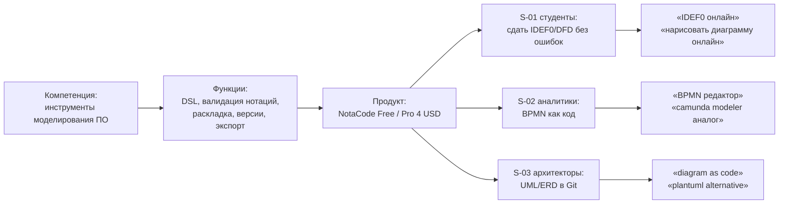
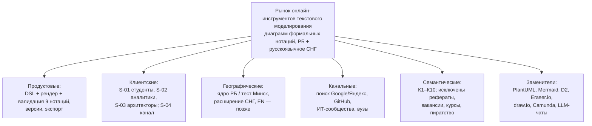

# ЛР1 — список рисунков

## Сгенерировано (Python/lr1_gt_analysis.py, реальные данные GT от 2026-09-17)

| Рисунок в отчёте | Файл | Что показано | Подраздел ОТЧЕТ |
|---|---|---|---|
| 1 | `fig01_gt_dinamika_ma12.png` | Динамика GT для PlantUML и text to diagram (мир, 2021-09…2024-12) + скользящее среднее 12 мес. | 2.5 |
| 2 | `fig04_regionalnyy_srez.png` | Топ-5 стран: PlantUML (порядок, Беларусь №5, Россия №4) и text to diagram (индексы) | 2.5.3 |
| 3 | `fig05_srednie_po_godam.png` | Средний индекс по годам | 2.8 |
| 4 | `fig02_sezonnye_indeksy.png` | Сезонные индексы по месяцам (метод шаблона), пороги 0,9 и 1,1 | 2.9 |
| 5 | `fig03_dekompoziciya.png` | Декомпозиция Y = T × S × K для PlantUML; K по шаблону и при центрированной MA 2×12 | 2.10 |

Номера рисунков внутри PNG не впечатаны: подпись «Рисунок N – …» стоит в ОТЧЕТ.md под рисунком.

Сопутствующие файлы: `lr1_results.csv` — помесячный расчёт (Y, T, Y/T, S, K, фаза); `_python_output.txt` — все показатели.

## Строится макросом в Excel (VBA/LR1_NotaCode_Trend.bas → Main)

| Лист | Содержание |
|---|---|
| «График_NotaCode» | Сводный индекс + тренд MA-12; сезонные индексы; циклический коэффициент; сводка показателей L3:M15 |
| «Панель» | Два встроенных графика шаблона (обновляются сами) |

## Сделать самой — скриншоты (подробности в ИНСТРУКЦИЯ_ДЛЯ_МЕНЯ.md §3)

`scr_01_gt_P1_BY_5y.png`, `scr_02_gt_P1_BY_regions.png`, `scr_03_gt_P3_BY_online.png`, `scr_04_gt_P4_ai_related.png`, `scr_05_gt_P5_world_regions.png`, `scr_06_yw_idef0_top.png`, `scr_07_yw_bpmn_top.png`, `scr_08_yw_uml_regions.png`, `scr_09_yw_cluster_dynamic.png`, `scr_10_yw_devices.png`, `scr_11_excel_panel.png`, `scr_12_excel_charts.png`.

После выгрузки Вордстата желательно (по желанию) добавить рисунок 6: динамика YW-кластера рядом с GT. Для этого нужно перезапустить Python, предварительно вставив ряд, или взять график с листа «График_NotaCode».

## Схемы (по желанию; отрисовать в NotaCode, mermaid.live или draw.io → PNG)

### Схема 1. `sch_01_kompetenciya_zapros.png` — от компетенции к запросу

### Схема 2. `sch_02_pasport_granic.png` — паспорт границ рынка

### Схема 3 (по желанию). `sch_03_sezonnyy_kalendar.png` — календарь кампаний

Можно сделать таблицей в Word на основе ОТЧЕТ п. 2.9. Месяцы запуска: февраль и сентябрь; пики — март–апрель и ноябрь; минимум — август.
