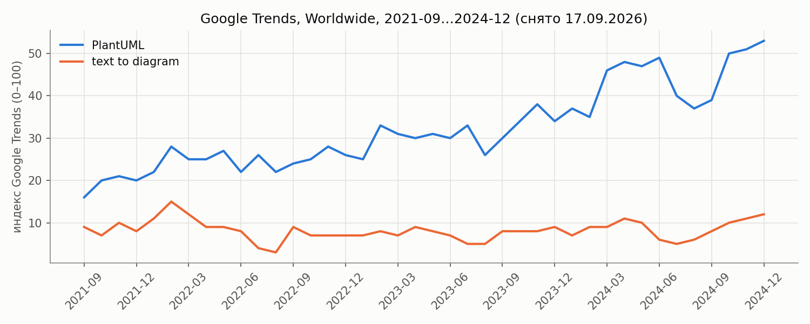
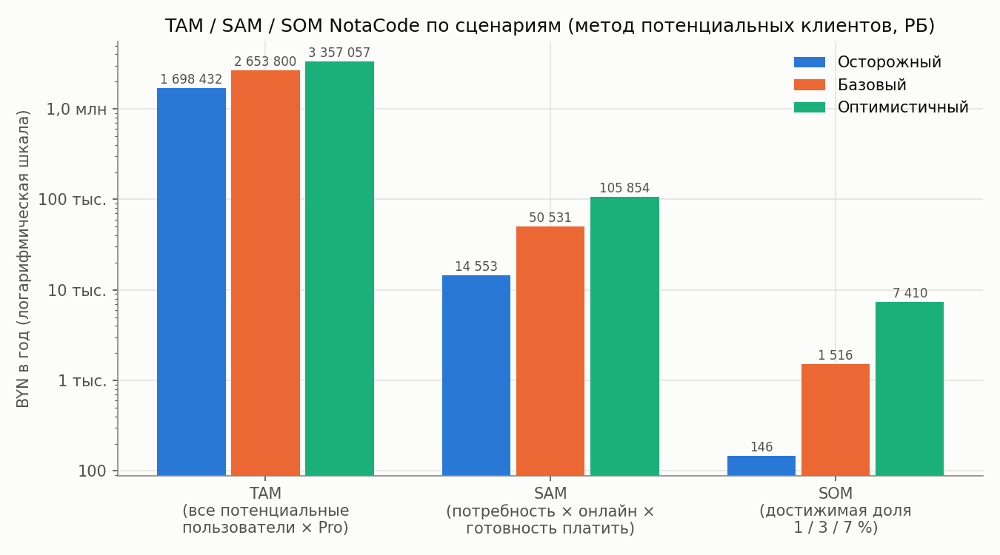
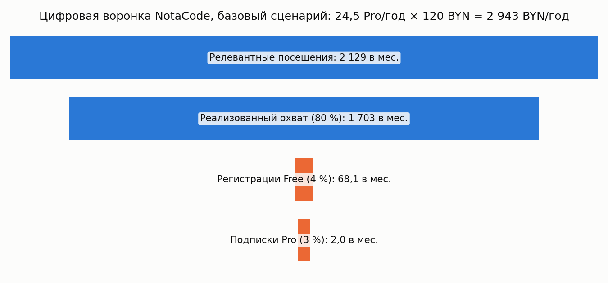
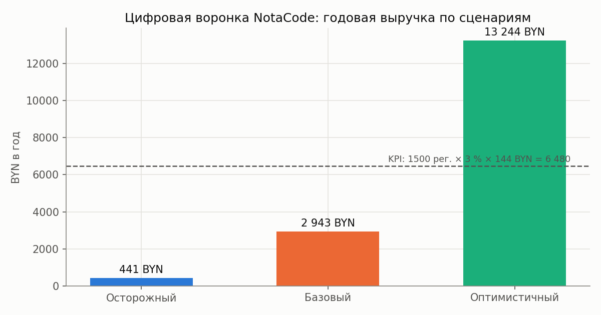
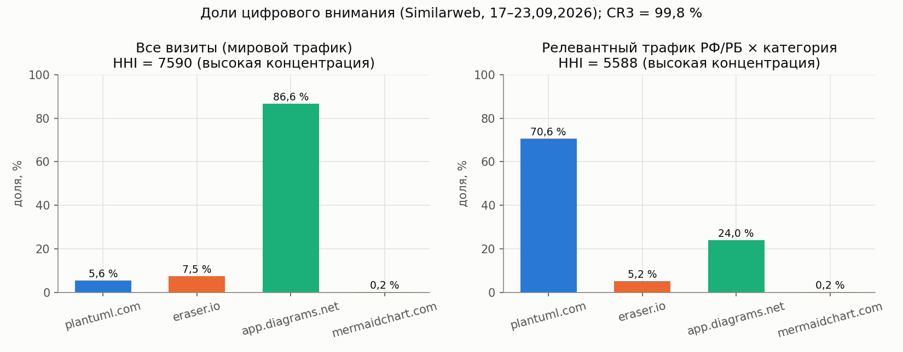
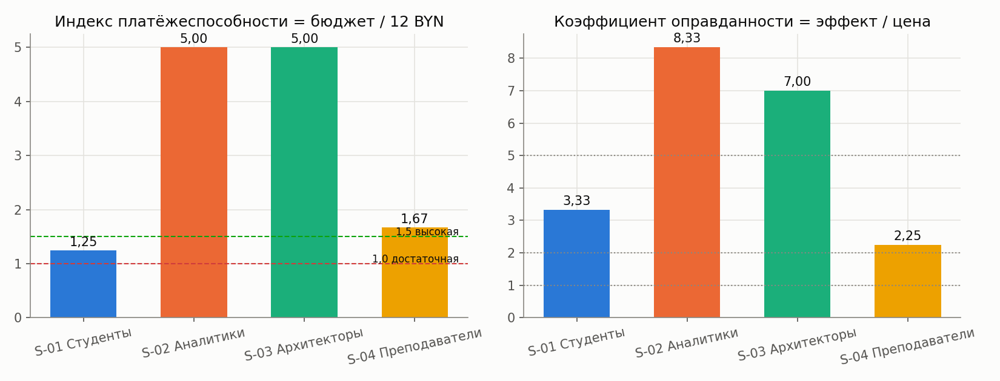
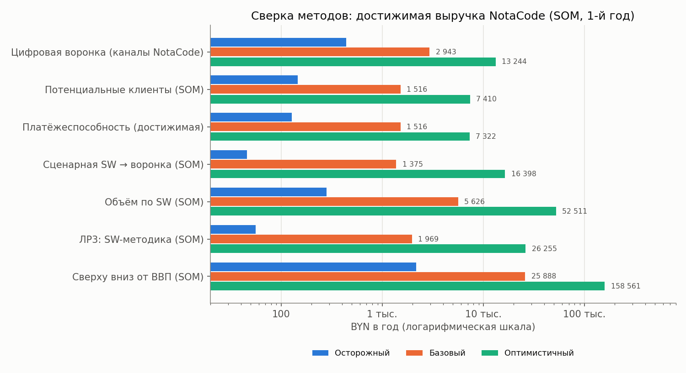
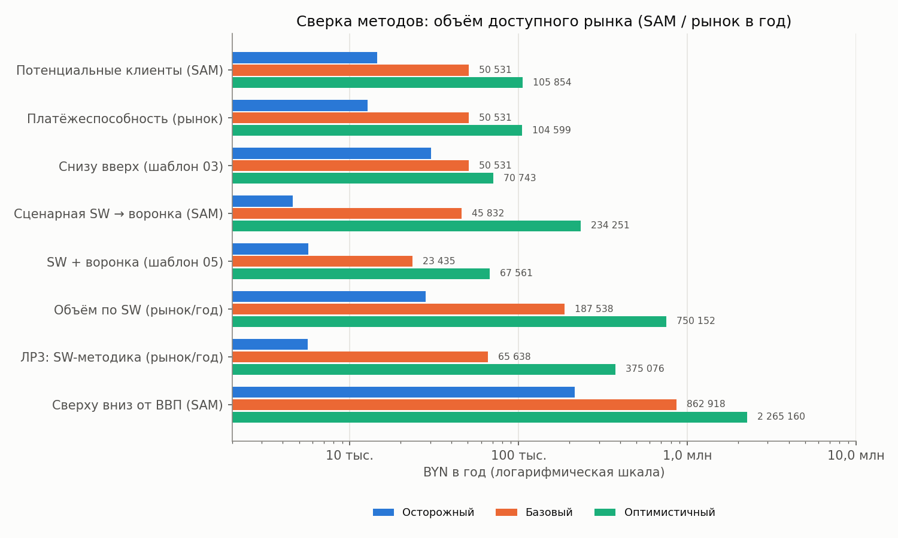
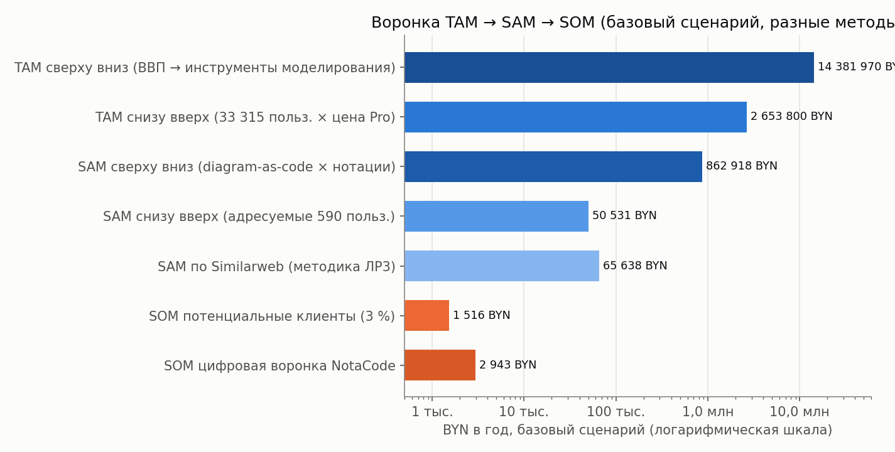

## 1 Цель работы

Получить согласованную оценку объёма рынка для электронного бизнеса NotaCode – web-IDE (PWA) класса «diagram as code» для формальных нотаций моделирования (UML, BPMN 2.0, ERD, IDEF0, IDEF1X, IDEF3, DFD, сети Петри) с моделью freemium (Free / Pro 4 USD в месяц или 40 USD в год). Для этого по единой инструкции применения методик оценки рынка электронного бизнеса [1] требуется:

- зафиксировать продуктовые, клиентские, географические и канальные границы рынка;
- подтвердить цифровой интерес (поисковый спрос, динамика);
- оценить цифровую активность конкурентов по данным Similarweb, в том числе по методикам ЛР3 (цифровой объём, CR3/CR5, HHI) [2], [3];
- рассчитать объём рынка не менее чем двумя независимыми методами («сверху вниз» и «снизу вверх» через потенциальных клиентов) и цифровой воронкой;
- проверить результат тремя сценариями и платёжеспособностью;
- выделить TAM, SAM и SOM и сформулировать итог диапазоном с ограничениями и следующим шагом.

ЛР3 выполняется как часть этой работы: комплект ЛР3 повторяет ЛР2 и добавляет две методики по Similarweb (подтверждено в чате группы).

## 2 Ход работы

### 2.1 Исходные данные и допущения

Объект анализа – NotaCode: собственный DSL, валидация правил нотации (код правила, строка), раскладка elkjs, SVG-холст с кросс-подсветкой «строка ↔ элемент», версии и diff, экспорт в SVG, PNG, PlantUML, Mermaid, D2, DOT, BPMN XML, XMI, PNML, draw.io, SQL DDL, AI-ассистент (в MVP – заглушка или собственный ключ). Сегменты: S-01 студенты технических специальностей (первичный, Free), S-02 бизнес- и системные аналитики (Pro), S-03 архитекторы ПО (Pro), S-04 преподаватели. MVP – к 06.12.2026.

Все расчёты выполнены в BYN. Цена Pro задана в USD, поэтому введён курс-допущение (формула 1).

Цена Pro, BYN = цена, USD × K, K = 3,00 BYN/USD (допущение на 25.09.2026, 🔲 ДОСНЯТЬ: официальный курс НБРБ на дату сдачи, nbrb.by) (1)

Отсюда Pro = 4 × 3,00 = 12 BYN в месяц, годовой тариф 40 × 3,00 = 120 BYN. Годовой чек платящего пользователя принят сценарно: осторожный – 6 месяцев помесячной оплаты (учебный семестр) 6 × 12 = 72 BYN; базовый – годовой тариф 120 BYN; оптимистичный – 12 месяцев помесячно 12 × 12 = 144 BYN.

Реальные данные перенесены из ранее выполненной работы (под прежним именем продукта DiagramCode) с указанием источника и даты снятия (таблица 1). Новые статистические данные не придумывались; всё, чего нет в источниках, помечено как допущение (таблица 2).

Таблица 1 – Реальные исходные данные

| Показатель | Значение | Источник, дата снятия |
|---|---|---|
| ВВП Беларуси, 2024 | 78,59 млрд USD | macrotrends.net [4], 17.09.2026 |
| Доля ИТ-сектора в ВВП (I кв. 2025) | 6,1 % | opencompanyinbelarus.com [5], 17.09.2026 |
| Резиденты Парка высоких технологий | более 1 000 компаний (свыше 40 % с иностранным капиталом) | [5], 17.09.2026 |
| Выпускники ИТ-специальностей с высшим образованием | около 7 000 в год, 21 вуз | belarus.by [6], 17.09.2026 |
| plantuml.com (Similarweb) | ≈ 507 тыс. визитов; Россия – 9,07 % трафика (1-е место) | similarweb.com [7], 17.09.2026 |
| mermaidchart.com (Similarweb) | < 20 тыс. визитов; Вьетнам 44,98 %, Индонезия 26,27 %, США 15,1 % | [7], 17.09.2026 |
| eraser.io (Similarweb) | 678,5 тыс. визитов; Индия 40,81 %, США 8,61 %; Direct 49,05 %; bounce 43,73 %; 3,57 стр./визит; 1 мин 39 с | [7], 23.09.2026 |
| app.diagrams.net (Similarweb) | 7,8 млн визитов; США 10,89 %, Индия 8,29 %; Direct 68,65 %; bounce 55,5 %; 2,98 стр./визит | [7], 23.09.2026 |
| Цены Eraser | Starter 15 USD (год) / 20 USD (мес.), Business 45 / 60 USD за участника в месяц | eraser.io/pricing [8], 17.09.2026 |
| Google Trends, Worldwide, 2021-09…2024-12 | PlantUML 16 → 53 пункта (+231 %); text to diagram 7–12 пунктов | trends.google.com [9], 17.09.2026 |

Таблица 2 – Журнал ключевых допущений

| Допущение | Значение | Обоснование | Надёжность |
|---|---|---|---|
| Курс USD/BYN | 3,00 | ориентир официального курса, проверить на nbrb.by | средняя |
| Число студентов ИТ-специальностей | 7 000 × 4 курса = 28 000 | реальные 7 000 выпускников в год | средняя |
| Аналитики / архитекторы в ПВТ | 2 и 3 на компанию → 2 000 и 3 000 | нет данных о численности по ролям | низкая |
| Преподаватели дисциплин с нотациями | 15 на вуз → 315 | 21 вуз – реальные данные | низкая |
| Конверсия визит → регистрация Free | 2 / 4 / 6 % | ориентиры SaaS-воронки | низкая |
| Конверсия Free → Pro | 2 / 3 / 5 % | KPI-05 NotaCode = 3 %, концепция 3–5 % | средняя |
| Достижимая доля нового бизнеса | 1 / 3 / 7 % | К5 методики потенциальных клиентов [10]: 0,5–1 / 1–3 / 3–7 % | средняя |
| Коэффициент охвата выборки Similarweb | 0,80 / 0,60 / 0,45 | 4 домена, рынок фрагментирован [3] | низкая |
| Коммерчески релевантная доля трафика | 20 / 35 / 50 % | [3], разд. 16 | средняя |
| Доля РФ/РБ у eraser.io, app.diagrams.net, mermaidchart.com | 1 % | страны вне топ-5 (у eraser.io 5-я страна 2,88 %) | низкая |
| Доля категории «формальные нотации» | plantuml 1,0; eraser 0,5; draw.io 0,2; Mermaid Chart 0,7 | профиль продукта | низкая |

### 2.2 Паспорт границ рынка

Первый обязательный этап – фиксация границ рынка [1] (таблица 3).

Таблица 3 – Паспорт границ рынка NotaCode

| Элемент | Заполнение |
|---|---|
| Название рынка | Рынок онлайн-инструментов моделирования в формальных нотациях по принципу «diagram as code» для студентов, преподавателей и ИТ-специалистов русскоязычного сегмента с ядром в Республике Беларусь |
| Продуктовые границы | Подписка Pro на web-IDE с DSL, валидацией нотаций, версиями и экспортом; входят UML, BPMN, ERD, IDEF0/1X/3, DFD, сети Петри |
| Клиентские границы | S-01 студенты технических специальностей; S-02 аналитики; S-03 архитекторы и разработчики; S-04 преподаватели |
| Географические границы | Ядро расчёта – Республика Беларусь; расширение – РФ и страны СНГ (русскоязычный интерфейс) |
| Канальные границы | Поиск (Яндекс, Google), GitHub и Хабр, Telegram-сообщества и вузовские чаты, каталоги инструментов, рекомендации преподавателей |
| Заменители | PlantUML, Mermaid, D2 (бесплатные DSL), draw.io, Lucidchart (GUI), Ramus, BPwin, Sparx EA (CASE), ручное рисование |
| Исключения | Исполняемые BPMN-движки, облачные архитектурные диаграммы C4/сети, обучение нотациям как услуга |
| Единица потенциального клиента | Пользователь (B2C) и специалист-пользователь в организации (B2B) |
| Тип модели | Подписка SaaS (freemium), не платформа сделок – GMV не применяется |

Формулировка рынка: рынок онлайн-сервисов текстового моделирования в строгих нотациях для учебных и профессиональных задач русскоязычной ИТ-аудитории с ядром в Республике Беларусь.

### 2.3 Оценка через поисковый спрос

Семантическое ядро NotaCode разделено по намерениям с весами коммерческой близости по методике [11] (таблица 4). Взвешенный спрос считается по формуле 2.

Взвешенный спрос = частотность × Kрелевантности × Kкоммерческой близости × Kрегиональный (2)

где частотность – показов в месяц по Яндекс Вордстат (регион Беларусь); коэффициенты – экспертные, по таблице методики.

Таблица 4 – Семантическое ядро NotaCode

| № | Запрос | Группа | Намерение | Kрел. | Kкомм. | Индекс GT (Worldwide, 5 лет) |
|---|---|---|---|---|---|---|
| 1 | idef0 онлайн | инструментальная | коммерческое | 1,0 | 0,8 | 🔲 |
| 2 | uml диаграмма онлайн | инструментальная | коммерческое | 0,9 | 0,7 | 🔲 |
| 3 | dfd диаграмма онлайн | инструментальная | коммерческое | 1,0 | 0,7 | 🔲 |
| 4 | bpmn онлайн редактор | инструментальная | коммерческое | 0,8 | 0,7 | 🔲 |
| 5 | er диаграмма онлайн | инструментальная | смешанное | 0,8 | 0,6 | 🔲 |
| 6 | plantuml | брендовая (конкурент) | смешанное | 0,9 | 0,5 | 41 |
| 7 | text to diagram | инструментальная (AI) | смешанное | 0,8 | 0,5 | 26 |
| 8 | diagram as code | общая | информационное | 1,0 | 0,3 | 3 |
| 9 | idef0 пример курсовая | учебная | информационно-проблемное | 0,7 | 0,3 | 🔲 |
| 10 | что такое uml | исключаемая | информационное | 0,4 | 0,1 | 🔲 |

Динамика интереса по реальным данным Google Trends показана на рисунке 1: интерес к категории (PlantUML) вырос с 16 пунктов (сентябрь 2021) до 53 пунктов (декабрь 2024), то есть на (53 − 16) / 16 × 100 ≈ 231 %; в конце декабря ежегодно наблюдается спад на 38–53 % (сезонность), с лета 2025 года резко растёт запрос «text to diagram», а связанный запрос «text to diagram ai» имеет статус Breakout. Беларусь входит в топ-5 стран по интересу к PlantUML [9].



Рисунок 1 – Динамика интереса Google Trends к PlantUML и «text to diagram»

Перевод поискового спроса в выручку выполняется воронкой (формула 3) с параметрами: доля переходов 4 / 6 / 10 %, конверсия в регистрацию 2 / 4 / 6 %, конверсия Free → Pro 2 / 3 / 5 %, годовой чек 72 / 120 / 144 BYN, коэффициент продлений 1 / 1,1 / 1,2.

Выручка, BYN/год = взвешенный спрос × доля переходов × CR_рег × CR_Pro × чек × Kпродл × 12 (3)

Абсолютная частотность есть только в Яндекс Вордстат, который требует входа по Яндекс ID. 🔲 ДОСНЯТЬ: частотность 10 запросов таблицы 4 и помесячная динамика четырёх групп за 12 месяцев (регион Беларусь). Поэтому в этой версии отчёта метод поискового спроса используется качественно: он подтверждает наличие и рост интереса, а денежная оценка будет получена после внесения данных на лист «Ввод_NotaCode» (модуль VBA NC1_PoiskSpros, скрипт nc_model.py, функция search_demand). Google Trends не используется как абсолютный объём [1].

### 2.4 Данные Similarweb по конкурентам

По бесплатному доступу Similarweb зафиксированы 4 домена (таблица 5). Показатель «визиты» – Total Visits за последний месяц окна «последние 3 месяца», география не фильтровалась. Релевантный трафик считается по формуле 4.

Релевантный трафик_i = визиты_i × доля РФ/РБ_i × доля категории_i (4)

Таблица 5 – Конкуренты по данным Similarweb

| Домен | Тип | Визиты/мес. | Доля РФ/РБ | Доля категории | Релевантный трафик | Доля, % |
|---|---|---|---|---|---|---|
| plantuml.com | прямой (DSL) | 507 000 | 0,0907 | 1,0 | 45 985 | 70,6 |
| app.diagrams.net | заменитель (GUI) | 7 800 000 | 0,01 | 0,2 | 15 600 | 24,0 |
| eraser.io | прямой (DSL + AI) | 678 500 | 0,01 | 0,5 | 3 393 | 5,2 |
| mermaidchart.com | прямой (платный Mermaid) | 20 000 | 0,01 | 0,7 | 140 | 0,2 |
| Итого | | 9 005 500 | | | 65 117 | 100 |

Ограничения: трафик plantuml.com – нижняя оценка аудитории PlantUML, так как большинство пользователей рендерят диаграммы локально (плагины IDE, CLI, CI/CD); данные SW модельные; выборка из 4 доменов меньше требуемых 5–15 [12]. 🔲 ДОСНЯТЬ: mermaid.live, dbdiagram.io, lucidchart.com, gleek.io; каналы plantuml.com и mermaidchart.com; доля Беларуси в трафике.

### 2.5 Расчёт «сверху вниз»

Расчёт стартует от внешнего агрегата – оборота ИТ-сектора Беларуси – и сужается коэффициентами (формула 5).

Объём = ВВП × Dит × K × Kдевтулс × Kмодел × Kdac × Kнот (5)

где ВВП = 78,59 млрд USD; Dит = 0,061; K = 3,00 BYN/USD; Kдевтулс – доля расходов ИТ-сектора на инструменты разработки (1,5 / 2 / 2,5 %); Kмодел – доля инструментов моделирования и диаграмм (4 / 5 / 6 %); Kdac – доля web/diagram-as-code сегмента (5 / 10 / 15 %); Kнот – доля нотаций, покрываемых NotaCode (50 / 60 / 70 %).

Оборот ИТ-сектора = 78,59 × 0,061 = 4,794 млрд USD = 14,382 млрд BYN. TAM (рынок инструментов моделирования, базовый) = 14 381 970 000 × 0,02 × 0,05 = 14 381 970 BYN ≈ 4,79 млн USD. SAM = 14 381 970 × 0,10 × 0,60 = 862 918 BYN (таблица 6).

Таблица 6 – Расчёт «сверху вниз», BYN в год

| Показатель | Осторожный | Базовый | Оптимистичный |
|---|---|---|---|
| TAM: инструменты моделирования | 8 629 182 | 14 381 970 | 21 572 955 |
| SAM: diagram-as-code × нотации NotaCode | 215 730 | 862 918 | 2 265 160 |
| SOM: SAM × 1 / 3 / 7 % | 2 157 | 25 888 | 158 561 |

Метод даёт верхний ориентир масштаба; все четыре коэффициента сужения – экспертные и являются главным источником неопределённости.

### 2.6 Расчёт «снизу вверх» через количество потенциальных клиентов

Использован шаблон методики потенциальных клиентов [10] (формулы 6–8).

TAM = Σ (клиенты_i × чек_i × частота_i) (6)

SAM = Σ (клиенты_i × Kграниц_i × Kпотр_i × Kонлайн_i × Kплат_i × чек_i × частота_i) (7)

SOM = SAM × достижимая доля (8)

Таблица 7 – Сегменты NotaCode (базовый сценарий)

| Сегмент | Всего | В границах | Потребность | Онлайн | Готовы платить Pro | Адресуемые | Чек, BYN | SAM, BYN |
|---|---|---|---|---|---|---|---|---|
| S-01 студенты ИТ | 28 000 | 0,7 → 19 600 | 0,8 | 0,9 | 0,03 | 423,4 | 72 | 30 482 |
| S-02 аналитики | 2 000 | 0,8 → 1 600 | 0,6 | 0,9 | 0,10 | 86,4 | 120 | 10 368 |
| S-03 архитекторы | 3 000 | 0,6 → 1 800 | 0,5 | 0,9 | 0,08 | 64,8 | 120 | 7 776 |
| S-04 преподаватели | 315 | 0,8 → 252 | 0,7 | 0,9 | 0,10 | 15,9 | 120 | 1 905 |
| Итого | 33 315 | 23 252 | | | | 590,4 | | 50 531 |

Пример для S-01: 28 000 × 0,7 × 0,8 × 0,9 × 0,03 × 72 = 30 482 BYN. TAM = 28 000 × 72 + 2 000 × 120 + 3 000 × 120 + 315 × 120 = 2 653 800 BYN; SOM = 50 531 × 0,03 = 1 516 BYN (около 13 платящих пользователей). Сценарии получены множителями шаблона (потребность, онлайн-готовность, платёжеспособность, чек, частота: 0,75 / 0,8 / 0,75 / 0,8 / 0,8 и 1,2 / 1,15 / 1,2 / 1,15 / 1,1) и долями 1 / 3 / 7 % (таблица 8, рисунок 2).

Таблица 8 – TAM / SAM / SOM методом потенциальных клиентов, BYN в год

| Сценарий | TAM | SAM | SOM |
|---|---|---|---|
| Осторожный | 1 698 432 | 14 553 | 146 |
| Базовый | 2 653 800 | 50 531 | 1 516 |
| Оптимистичный | 3 357 057 | 105 854 | 7 410 |



Рисунок 2 – TAM, SAM и SOM NotaCode по сценариям

Проверка через Similarweb (лист 05_Similarweb шаблона): годовая «выручка конкурентов» при тех же конверсиях – 17 951 BYN, отношение SOM / SW-ориентир = 1 516 / 17 951 = 8,4 %, то есть SOM не превышает цифровой ориентир и реалистичен.

### 2.7 Цифровая воронка

Для собственных каналов NotaCode составлен план охвата первого года (продукт не запущен, все значения – допущения; таблица 9). Выручка считается по формуле 9.

Выручка = Σ(охват × CTR × Kрел) × Kреализации × CR_рег × CR_Pro × чек × Kпродл × 12 (9)

Таблица 9 – Каналы NotaCode (план, в месяц)

| Канал | Охват | CTR | Посещения | Доля релевантных | Релевантные |
|---|---|---|---|---|---|
| Органический поиск | 30 000 | 0,05 | 1 500 | 0,7 | 1 050 |
| Платный поиск (Директ) | 10 000 | 0,04 | 400 | 0,8 | 320 |
| Соцсети и Telegram | 40 000 | 0,01 | 400 | 0,5 | 200 |
| GitHub, Хабр, каталоги | 5 000 | 0,05 | 250 | 0,7 | 175 |
| Прямой трафик | 300 | 1,00 | 300 | 0,8 | 240 |
| AlternativeTo, Product Hunt | 3 000 | 0,03 | 90 | 0,6 | 54 |
| Рекомендации преподавателей | 2 000 | 0,05 | 100 | 0,9 | 90 |
| Итого | | | 3 040 | | 2 129 |

Базовый сценарий (рисунок 3): 2 129 × 0,8 = 1 703 посещения → × 0,04 = 68,1 регистрации в месяц (817 в год) → × 0,03 = 2,04 подписки Pro в месяц (24,5 в год) → × 120 BYN × 12 = 2 943 BYN в год. Осторожный: 2 129 × 0,6 × 0,02 × 0,02 × 72 × 12 = 441 BYN; оптимистичный: 2 129 × 1,0 × 0,06 × 0,05 × 144 × 1,2 × 12 = 13 244 BYN (рисунок 4).



Рисунок 3 – Цифровая воронка NotaCode, базовый сценарий



Рисунок 4 – Годовая выручка цифровой воронки по сценариям

Проверка надёжности: целевой KPI NotaCode (1 500 регистраций × 3 % = 45 платящих × 12 BYN × 12 = 6 480 BYN) выше базового сценария воронки в 2,2 раза и достигается только в оптимистичном сценарии; расчётный трафик (2 129 визитов) не превышает релевантный трафик конкурентов (65 117), то есть воронка не завышена.

### 2.8 Маркетплейсы и цифровые платформы

Методика маркетплейсов [13] применяется, если рынок выражен через площадки или бизнес является платформой. NotaCode – подписочный SaaS без сделок между сторонами, поэтому GMV и комиссия не рассчитываются (листы 07_Платформа_GMV и 05_Платформа обнулены с пометкой «не применимо»). Каталоги инструментов (AlternativeTo, Product Hunt) и GitHub учтены как канал привлечения в воронке. Товарных маркетплейсов для этого рынка нет; отзывы в каталогах могут использоваться после запуска для проверки через формулу «продажи = отзывы / доля оставляющих отзыв».

### 2.9 Оценка по данным Similarweb (ЛР2 и ЛР3)

#### 2.9.1 Сценарная оценка с Similarweb

По шаблону сценарной оценки [12] релевантный трафик с учётом коммерческой доли 0,35 и качества трафика (0,8 / 0,7) составил 17 682 визита в месяц. Рыночный трафик считается по формуле 10.

Трафик рынка = I × Kохвата неучтённых × Kнадёжности × Kнедоступного спроса, Kохвата = 1 / охват (10)

При Kохвата = 1,25 / 1,67 / 2,22, надёжности 0,75 / 0,9 / 1 и корректировке 0,8 / 1 / 1,15 рыночный трафик – 159 138 / 318 275 / 542 247 визитов в год; SAM (продажи × чек) – 4 583 / 45 832 / 234 251 BYN; SOM – 46 / 1 375 / 16 398 BYN в год.

#### 2.9.2 Объём рынка по шаблону Similarweb

По шаблону «Объём рынка по данным Similarweb» наблюдаемый релевантный трафик равен 65 117 визитам в месяц (после исправления ошибки шаблона, раздел 2.12; с ошибкой было бы 19 133), весь цифровой трафик рынка при охвате 0,6 – 108 529 визитов. Рынок в год – 28 131 / 187 538 / 750 152 BYN, SOM – 281 / 5 626 / 52 511 BYN. Шаблон не содержит множителя коммерческой доли, поэтому это верхняя граница метода.

#### 2.9.3 Методики ЛР3: цифровой объём и концентрация

По методике М2 ЛР3 [3] цифровой объём аудитории рассчитывается формулами 11–13.

V_sample = Σ визиты_i = 9 005 500 визитов в месяц (11)

V_geo = Σ визиты_i × доля РФ/РБ_i = 130 970; с учётом доли категории – 65 117 (12)

V_total = V_geo / Kохвата = 65 117 / 0,6 = 108 529 (13)

где Kохвата – коэффициент охвата выборки: 0,80–0,90 – плотная выборка, 0,60–0,75 – типичная, 0,40–0,55 – фрагментированный рынок, ниже 0,40 – разведочный ориентир. Для NotaCode выбрано 0,80 / 0,60 / 0,45. В методике М2 осторожному сценарию соответствует низкий охват, что при делении увеличивает рынок; в работе принята логика «осторожный – меньший рынок» (как в Excel-шаблоне), противоречие зафиксировано в приложении Б.

Концентрация цифрового внимания оценена по формулам 14–15 [2], [3].

CR3 = d1 + d2 + d3 = 70,6 + 24,0 + 5,2 = 99,8 %; CR5 = 100 % (в выборке 4 домена) (14)

HHI = Σ d_i² = 70,6² + 24,0² + 5,2² + 0,2² ≈ 5 588 (15)

где d_i – доля домена в релевантном трафике, %. HHI выше 2 500, то есть концентрация высокая; по сырому мировому трафику HHI = 7 590 (доминирует draw.io). Вывод: цифровое внимание русскоязычной аудитории сосредоточено у бесплатного PlantUML, вход требует сильного отличия (профили IDEF0/DFD/сети Петри, валидация) и узкой специализации (рисунок 5).



Рисунок 5 – Доли цифрового внимания и индекс HHI по данным Similarweb

Денежная оценка по М2 (коммерческая доля 20 / 35 / 50 %): 108 529 × 0,35 = 37 985 коммерческих визитов → × 0,04 × 0,03 = 45,6 подписки Pro в месяц → × 120 × 12 = 65 638 BYN в год (осторожный 5 626, оптимистичный 375 076); SOM = 56 / 1 969 / 26 255 BYN. Итоговая модель М1 [2]: TAM цифрового внимания = 9 005 500 визитов/мес.; SAM по географии = 130 970; SAM по каналу (без прямого трафика) = 51 002; SOM по трафику = 51 002 × 0,03 = 1 530 визитов/мес.; SOM по выручке = 1 530 × 0,04 × 0,03 × 120 × 12 = 2 644 BYN в год.

### 2.10 Проверка платёжеспособности

Проверка выполнена по методике [14] (таблица 10). Индекс платёжеспособности и коэффициент оправданности покупки рассчитываются по формулам 16–17.

Индекс = доступный бюджет в месяц / цена Pro в месяц (16)

Kоправд = экономия времени в деньгах / цена Pro = часы × ставка × доля экономии / 12 (17)

Таблица 10 – Платёжеспособность и экономическая оправданность

| Сегмент | Бюджет, BYN/мес | Индекс | Статус | Эффект, BYN/мес | Kоправд | ROI за год |
|---|---|---|---|---|---|---|
| S-01 студенты | 15 🔲 | 1,25 | достаточная | 20 ч × 5 × 0,4 = 40 | 3,33 | 2,33 |
| S-02 аналитики | 60 | 5,00 | высокая | 10 ч × 25 × 0,4 = 100 | 8,33 | 7,33 |
| S-03 архитекторы | 60 | 5,00 | высокая | 8 ч × 35 × 0,3 = 84 | 7,00 | 6,00 |
| S-04 преподаватели | 20 | 1,67 | высокая | 6 ч × 15 × 0,3 = 27 | 2,25 | 1,25 |
| Среднее | | 3,23 | достаточная | | | 4,23 |

Средний индекс 3,23 ≥ 1, поэтому автоматический вывод шаблона: «платёжеспособность сегментов в среднем достаточная» (рисунок 6). Для B2B-сегментов Kоправд > 5 (премиальный потенциал), для преподавателей 2–5 (базовый коммерческий сегмент), для студентов – 3,33, но их бюджет пограничный. Ценовой коридор: 12 BYN в месяц в 4,4 раза ниже медианы Eraser Starter (52,5 BYN) и в 15 раз ниже Eraser Business (180 BYN); при этом бесплатные заменители (PlantUML, Mermaid, draw.io) задают нижнюю границу 0 BYN. Валовая маржа при себестоимости 3 BYN на платящего пользователя – (12 − 3) / 12 = 75 %. Платёжеспособный рынок – 12 734 / 50 531 / 104 599 BYN, достижимая выручка – 127 / 1 516 / 7 322 BYN в год.



Рисунок 6 – Индекс платёжеспособности и коэффициент оправданности по сегментам

Бюджеты, часы и ставки – допущения. 🔲 ДОСНЯТЬ: опрос не менее 30 респондентов сегментов S-01…S-04 (бизнес-цель BO-04), стипендия и доходы – по Белстату.

### 2.11 Сценарии и сверка методов

Результаты всех методов сведены на уровне SOM (достижимая выручка первого года) и SAM (таблицы 11, 12; рисунки 7, 8).

Таблица 11 – Сверка методов: SOM, BYN в год

| Метод | Осторожный | Базовый | Оптимистичный |
|---|---|---|---|
| Цифровая воронка (каналы NotaCode) | 441 | 2 943 | 13 244 |
| Потенциальные клиенты | 146 | 1 516 | 7 410 |
| Платёжеспособность | 127 | 1 516 | 7 322 |
| Сценарная Similarweb → воронка | 46 | 1 375 | 16 398 |
| ЛР3: методика Similarweb | 56 | 1 969 | 26 255 |
| Объём по шаблону Similarweb (без коммерческой доли) | 281 | 5 626 | 52 511 |
| Сверху вниз от ВВП | 2 157 | 25 888 | 158 561 |



Рисунок 7 – Сверка методов по достижимой выручке (SOM)

Таблица 12 – Сверка методов: SAM (объём доступного рынка), BYN в год

| Метод | Осторожный | Базовый | Оптимистичный |
|---|---|---|---|
| Потенциальные клиенты | 14 553 | 50 531 | 105 854 |
| Снизу вверх (шаблон, × 0,6 / 1 / 1,4) | 30 319 | 50 531 | 70 743 |
| SW + воронка (шаблон «сверху/снизу») | 5 669 | 23 435 | 67 561 |
| Сценарная Similarweb | 4 583 | 45 832 | 234 251 |
| ЛР3: методика Similarweb | 5 626 | 65 638 | 375 076 |
| Сверху вниз от ВВП | 215 730 | 862 918 | 2 265 160 |



Рисунок 8 – Сверка методов по объёму доступного рынка (SAM)

Согласование по правилам инструкции [1]:

1) «сверху вниз» ≫ «снизу вверх» (862 918 против 50 531, в 17 раз). Причина – не ёмкость, а уровень цены и границы: агрегат включает корпоративные лицензии CASE-средств и GUI-редакторов, а расчёт «снизу вверх» оценивает подписки по 12 BYN; к тому же четыре коэффициента сужения экспертные. Поэтому «сверху вниз» используется как верхний ориентир, а не как прогноз;
2) пять независимых методов (воронка, потенциальные клиенты, платёжеспособность, две SW-модели с коммерческой долей) дают сопоставимый базовый SOM 1,4–2,9 тыс. BYN – оценка устойчива;
3) трафик конкурентов высок, а коммерческий поисковый спрос пока не измерен (Вордстат) – проверить после снятия;
4) воронка даёт малый объём при большом TAM – ограничение в канале и конверсии Free → Pro, а не в ёмкости рынка;
5) разброс сценариев велик (от десятков BYN до 16 тыс. BYN) – нужны реальные конверсии после запуска MVP.

TAM/SAM/SOM по базовому сценарию разными методами сведены на рисунке 9.



Рисунок 9 – Воронка TAM → SAM → SOM, базовый сценарий

### 2.12 Исправление ошибок Excel-шаблонов

При заполнении шаблонов найдены и исправлены ошибки формул (исправления выполняют VBA-модули, приложение А):

1) шаблон цифровой воронки, лист 03_Конкуренты_SW: ячейки C12 и C14 делили на '01_Параметры'!B12 (целевая доля релевантного трафика) вместо '01_Параметры'!B13 (коэффициент покрытия конкурентов). При доле 0,35 выручка сегмента составила бы 321 494 BYN вместо корректных 187 538 BYN (C14 = 9 377 / 0,6 × 12);
2) шаблон «Объём рынка по Similarweb»: '01_Параметры'!B9 и B10 суммировали G5:G24 и H5:H24, пропуская первого конкурента в строке 4. Для NotaCode это дало бы 19 133 вместо 65 117 визитов (потеря plantuml.com – 71 % трафика). Исправлено на G4:G23 и H4:H23;
3) шаблон платёжеспособности, лист 06_Сценарии: ссылка на пустую строку сегмента возвращала 0 вместо пустого значения, из-за чего возникала ошибка #ЗНАЧ! в итогах; столбец A заменён формулой с проверкой пустоты;
4) сценарный шаблон, лист 06_Сверка: «Рекомендуемый диапазон» склеивал числа без округления – заменено на TEXT(…;"0"); демо-значения строк 7–9 заменены результатами методов NotaCode.

### 2.13 Итоговая оценка объёма рынка

Итоговый диапазон сформирован по правилу: нижняя граница – минимум осторожных расчётов, верхняя – максимум проверенных базовых и оптимистичных; «сверху вниз» и шаблон без коммерческой доли используются только как верхние ориентиры (таблица 13).

Таблица 13 – Итоговая оценка рынка NotaCode

| Уровень | Диапазон, BYN в год | ≈ USD в год | Основание |
|---|---|---|---|
| TAM | 2,65–14,38 млн (сценарно 1,70–21,57 млн) | 0,88–4,79 млн | снизу вверх (все пользователи × Pro) – сверху вниз (инструменты моделирования в ИТ-секторе РБ) |
| SAM | базовый 23–66 тыс. (сценарно 4,6–375 тыс.); верхний ориентир 0,86 млн | 7,8–21,9 тыс. | потенциальные клиенты, платёжеспособность, три SW-модели |
| SOM (1-й год) | базовый 1,4–2,9 тыс. (сценарно 0,05–26 тыс.) | 460–980 | воронка, потенциальные клиенты, платёжеспособность, две SW-модели |

Базовый SOM соответствует 12–25 платящим пользователям Pro в год, оптимистичный – до 90–180. Вывод по универсальному шаблону инструкции [1]: в рамках исследования рынок определён как рынок онлайн-сервисов текстового моделирования в строгих нотациях для студентов, преподавателей, аналитиков и архитекторов русскоязычного сегмента с ядром в Республике Беларусь. Анализ поискового спроса показал устойчивый рост интереса к категории (PlantUML +231 % за 2021–2024 годы, Беларусь в топ-5 стран) и структурный рост AI-запросов («text to diagram»); коммерчески значимыми являются запросы «idef0 онлайн», «uml диаграмма онлайн», «dfd диаграмма онлайн»; есть регулярный декабрьский спад. Данные Similarweb указывают на цифровую активность при высокой концентрации (HHI 5 588, лидер – бесплатный PlantUML). Расчёт «сверху вниз» дал верхний ориентир 0,86 млн BYN (SAM), расчёт «снизу вверх» – 50,5 тыс. BYN. Цифровая воронка показала достижимую выручку 0,4–13,2 тыс. BYN в год. Платёжеспособность достаточная (индекс 3,23, ROI > 1 во всех сегментах), цена 12 BYN в 4,4 раза ниже медианы коммерческих аналогов. Поэтому доступный рынок оценивается в 23–66 тыс. BYN в год, а достижимая выручка первого года – 1,4–2,9 тыс. BYN. Расчёт требует проверки через Вордстат, расширенную выборку Similarweb, опрос целевых сегментов и тестовые продажи после выпуска MVP.

## Выводы

В работе выполнена оценка объёма рынка для NotaCode – web-IDE класса «diagram as code» для формальных нотаций – по полному комплексу методик ЛР2 и двум дополнительным методикам ЛР3 по данным Similarweb. Сначала зафиксированы границы рынка: подписка Pro на онлайн-сервис моделирования в строгих нотациях для студентов, преподавателей, аналитиков и архитекторов, ядро – Республика Беларусь, расширение – русскоязычный сегмент РФ и СНГ. Единицей клиента выбран пользователь, модель – подписочный SaaS, поэтому платформенная GMV-модель признана неприменимой. Цена Pro 4 USD в месяц пересчитана в 12 BYN по курсу-допущению 3,00 BYN/USD на 25.09.2026; годовой чек задан сценарно: 72, 120 и 144 BYN.

Объём рынка рассчитан несколькими независимыми методами. Расчёт «сверху вниз» от ВВП Беларуси (78,59 млрд USD) и доли ИТ-сектора (6,1 %) дал TAM рынка инструментов моделирования 14,4 млн BYN и SAM diagram-as-code сегмента 0,86 млн BYN. Расчёт «снизу вверх» через 33 315 потенциальных пользователей (студенты ИТ-специальностей, специалисты ПВТ, преподаватели 21 вуза) дал TAM 2,65 млн BYN, SAM 50,5 тыс. BYN и SOM 1,5 тыс. BYN. Цифровая воронка по плану каналов первого года дала 441 / 2 943 / 13 244 BYN в год. Similarweb-модели (сценарная, шаблон объёма рынка и методика ЛР3 с формулой V_total = V_geo / коэффициент охвата) дали SAM 4,6–375 тыс. BYN в зависимости от сценария. Методика ЛР3 также показала, что цифровое внимание сильно сконцентрировано: CR3 = 99,8 %, HHI = 5 588 при пороге высокой концентрации 2 500, а лидер – бесплатный PlantUML. Это означает, что вход возможен только через дифференциацию – профили IDEF0, IDEF3, DFD и сети Петри, валидацию правил нотации и кросс-подсветку, которых нет у PlantUML и Mermaid.

Сверка методов показала, что пять независимых расчётов дают близкий базовый SOM 1,4–2,9 тыс. BYN в год (12–25 платящих пользователей), а «сверху вниз» превышает «снизу вверх» в 17 раз. По правилам согласования инструкции это объясняется уровнем цены и шириной агрегата (корпоративные лицензии CASE-средств и GUI-редакторов), а не ошибкой; поэтому «сверху вниз» использован как верхний ориентир. Проверка платёжеспособности подтвердила коммерческую реализуемость: средний индекс платёжеспособности 3,23, коэффициент оправданности покупки 2,25–8,33, валовая маржа 75 %. Наиболее платёжеспособны сегменты S-02 и S-03, а массовый сегмент студентов даёт основную аудиторию Free, но пограничный бюджет.

Итог сформулирован диапазоном: TAM 2,65–14,38 млн BYN, SAM 23–66 тыс. BYN, SOM первого года 1,4–2,9 тыс. BYN в год. Важный практический вывод: целевой KPI NotaCode (1 500 регистраций и 45 платящих пользователей, 6 480 BYN в год) выше базовых оценок рынка в 2–4 раза и достижим только в оптимистичном сценарии – при выходе на русскоязычную аудиторию РФ и СНГ и конверсии Free → Pro не ниже 5 %. Дополнительно найдены и исправлены четыре ошибки Excel-шаблонов, две из которых существенно искажали результат (потеря 71 % трафика и завышение выручки сегмента в 1,7 раза). Ограничения работы: не сняты данные Яндекс Вордстат, выборка Similarweb содержит 4 домена вместо 5–15, коэффициенты сужения, конверсии и бюджеты являются допущениями. Следующий шаг – снять Вордстат, расширить выборку Similarweb, провести опрос не менее 30 респондентов и после выпуска MVP (06.12.2026) заменить допущения фактическими конверсиями.

## Список использованных источников

1. Инструкция по применению методик оценки рынка электронного бизнеса [Электронный ресурс] : методические материалы к ЛР2 по дисциплине «Электронный бизнес». – БГУИР, 2026. – Дата доступа: 25.09.2026.
2. Методика оценки объёма рынка электронного бизнеса по данным Similarweb [Электронный ресурс] : методические материалы к ЛР3. – БГУИР, 2026. – Дата доступа: 25.09.2026.
3. Методика оценки рынка электронного бизнеса на основе данных Similarweb [Электронный ресурс] : методические материалы к ЛР3. – БГУИР, 2026. – Дата доступа: 25.09.2026.
4. Belarus GDP 1990–2024 [Электронный ресурс]. – Режим доступа: https://www.macrotrends.net/global-metrics/countries/BLR/belarus/gdp-gross-domestic-product. – Дата доступа: 17.09.2026.
5. Belarus IT Industry in 2026 [Электронный ресурс]. – Режим доступа: https://opencompanyinbelarus.com. – Дата доступа: 17.09.2026.
6. Образование в Беларуси [Электронный ресурс]. – Режим доступа: https://www.belarus.by. – Дата доступа: 17.09.2026.
7. Similarweb. Website Traffic Checker [Электронный ресурс]. – Режим доступа: https://www.similarweb.com/website/. – Дата доступа: 23.09.2026.
8. Eraser. Pricing [Электронный ресурс]. – Режим доступа: https://www.eraser.io/pricing. – Дата доступа: 17.09.2026.
9. Google Trends [Электронный ресурс]. – Режим доступа: https://trends.google.com/. – Дата доступа: 17.09.2026.
10. Оценка объёма рынка через количество потенциальных клиентов для анализа электронного бизнеса (тема1.docx) и Excel-шаблон к ней [Электронный ресурс]. – БГУИР, 2026. – Дата доступа: 25.09.2026.
11. Методика оценки рынка через поисковый спрос и Excel-шаблон к ней [Электронный ресурс]. – БГУИР, 2026. – Дата доступа: 25.09.2026.
12. Методика сценарной оценки рынка с данными Similarweb; методика «сверху вниз» и «снизу вверх» с Similarweb; методика Similarweb при бесплатном доступе [Электронный ресурс]. – БГУИР, 2026. – Дата доступа: 25.09.2026.
13. Методика оценки рынка через маркетплейсы и цифровые платформы [Электронный ресурс]. – БГУИР, 2026. – Дата доступа: 25.09.2026.
14. Методика проверки рынка через платёжеспособность и Excel-шаблон к ней [Электронный ресурс]. – БГУИР, 2026. – Дата доступа: 25.09.2026.
15. Национальный банк Республики Беларусь. Официальные курсы [Электронный ресурс]. – Режим доступа: https://www.nbrb.by/statistics/rates/ratesdaily. – Дата доступа: 25.09.2026.
16. Similarweb Knowledge Center. Similarweb Data Methodology [Электронный ресурс]. – Режим доступа: https://support.similarweb.com/hc/en-us/articles/360001631538-Similarweb-Data-Methodology. – Дата доступа: 25.09.2026.

## Приложение А (обязательное) Программная реализация расчётов

Расчёты выполнены в двух независимых реализациях с одинаковыми входными данными.

Таблица А.1 – VBA-модули (папка VBA)

| Модуль | Шаблон из папки «Материалы» | Что делает |
|---|---|---|
| NC1_PoiskSpros | shablon_excel_ocenka_rynka_cherez_poiskovyy_spros.xlsx | Семантическое ядро, реальные данные Google Trends, лист «Ввод_NotaCode» для Вордстат, сценарии воронки |
| NC2_Voronka | shablon_excel_metodika_ocenki_rynka_cherez_cifrovuyu_voronku.xlsx | План каналов, Similarweb, исправление C12/C14 (B12 → B13), обнуление GMV |
| NC3_PotencKlienty | shablon_excel_..._kolichestvo_potencialnyh_klientov.xlsx | Сегменты S-01…S-04, TAM/SAM/SOM, доли 1/3/7 %, проверка Similarweb |
| NC4_Platezhesposobnost | shablon_excel_metodika_proverki_rynka_cherez_platezhesposobnost.xlsx | Ценовой коридор (Eraser), экономика покупки, индекс, исправление 06_Сценарии |
| NC5_SverkhuSnizu | shablon_excel_metodika_sverhu_vniz_snizu_vverh_similarweb.xlsx | «Сверху вниз» от ВВП, «снизу вверх», SW-воронка, сверка трёх методов |
| NC6_ScenarSW | shablon_excel_scenarnaya_ocenka_rynka_s_similarweb.xlsx | Сценарная SW-оценка, сверка всех методов на листе 06_Сверка |
| NC7_ObemSW | metodika_ocenki_obema_rynka_po_similarweb.xlsx | Исправление B9/B10 (G4:G23), данные SW, лист «NotaCode_ЛР3» (V_total, CR3, CR5, HHI) |

Каждый модуль содержит процедуру Main, работает с активной книгой-копией шаблона, находит листы по префиксу «01_», «02_» и т. д., помечает ячейки «ДОСНЯТЬ» (оранжевая заливка и примечание) и «(допущение)», пересчитывает книгу и создаёт лист «NotaCode_Итог» с диаграммой. Русские строки записаны транслитом и декодируются функцией R(), поэтому макросы работают при любой кодовой странице Windows. Фрагмент исправления ошибки шаблона воронки:

```vba
c.Range("C12").Formula = "=C11/" & Q(p) & "B13"
c.Range("C14").Formula = "=C13/" & Q(p) & "B13*12"
```

Таблица А.2 – Python-скрипты (папка Python)

| Скрипт | Назначение | Результат |
|---|---|---|
| nc_model.py | Единая модель: повторяет формулы всех 7 шаблонов, «сверху вниз» от ВВП, методики ЛР3 | Таблицы в консоли, results_notacode.json |
| 01_tam_sam_som.py | TAM/SAM/SOM по сценариям и воронка TAM → SAM → SOM | Рисунки 2, 9 |
| 02_voronka.py | Цифровая воронка NotaCode | Рисунки 3, 4 |
| 03_sravnenie_metodov.py | Сверка методов, доли и HHI, платёжеспособность, Google Trends | Рисунки 1, 5–8 |

Запуск: `python nc_model.py`, затем `python 01_tam_sam_som.py`, `python 02_voronka.py`, `python 03_sravnenie_metodov.py` (PNG сохраняются в папку «Рисунки»).

## Приложение Б (справочное) Расчёты по методикам ЛР3 и журнал источников

Таблица Б.1 – Цифровой объём по методике М2 ЛР3

| Показатель | Осторожный | Базовый | Оптимистичный |
|---|---|---|---|
| V_sample, визитов/мес. | 9 005 500 | 9 005 500 | 9 005 500 |
| Релевантный V_geo, визитов/мес. | 65 117 | 65 117 | 65 117 |
| Коэффициент охвата | 0,80 | 0,60 | 0,45 |
| V_total, визитов/мес. | 81 397 | 108 529 | 144 705 |
| Коммерческая доля | 20 % | 35 % | 50 % |
| Коммерческие визиты | 16 279 | 37 985 | 72 353 |
| Регистрации Free / мес. | 325,6 | 1 519,4 | 4 341,2 |
| Подписки Pro / мес. | 6,5 | 45,6 | 217,1 |
| Рынок, BYN/год | 5 626 | 65 638 | 375 076 |
| SOM, BYN/год | 56 | 1 969 | 26 255 |

Противоречие шкал: в М2 осторожному сценарию соответствует охват 0,40–0,55 (0,45), оптимистичному – 0,80–0,90 (0,85). Поскольку V_total = V_geo / охват, такая шкала делает осторожный рынок больше оптимистичного по трафику. Excel-шаблон ЛР2 использует обратный порядок (0,8 / 0,7 / 0,55); в работе принято 0,80 / 0,60 / 0,45.

Таблица Б.2 – Журнал источников и выгрузок

| Дата | Источник | Запрос / сайт | Регион | Период | Настройки | Что зафиксировано | Ограничения |
|---|---|---|---|---|---|---|---|
| 17.09.2026 | Google Trends | PlantUML, text to diagram, diagram as code, Mermaid.js, UML diagram generator, ERD tool | Worldwide | 5 лет | все категории, веб-поиск | динамика, регионы, связанные запросы | индекс 0–100 |
| 🔲 | Яндекс Вордстат | 10 запросов таблицы 4 | Беларусь | 12 мес. | все устройства | 🔲 ДОСНЯТЬ | аудитория Яндекса |
| 17.09.2026 | Similarweb | plantuml.com, mermaidchart.com | все страны | последние 3 мес. | бесплатный доступ | визиты, ранг, страны | оценочные данные |
| 23.09.2026 | Similarweb | eraser.io, app.diagrams.net | все страны | последние 3 мес. | бесплатный доступ | визиты, каналы, вовлечённость, страны | оценочные данные |
| 17.09.2026 | eraser.io/pricing | тарифы | – | на дату | – | цены Starter, Business | цены USD |
| 17.09.2026 | macrotrends, opencompanyinbelarus, belarus.by | ВВП, доля ИТ, ПВТ, выпускники | Беларусь | 2024–2025 | – | агрегаты | вторичные источники |
| 🔲 | nbrb.by | курс USD | – | дата сдачи | – | 🔲 ДОСНЯТЬ | в расчёте 3,00 |
