## 1 Цель работы

Получить согласованную оценку объёма рынка электронного бизнеса на примере проекта NotaCode: зафиксировать продуктовые и географические границы, оценить поисковый спрос, цифровую активность конкурентов по данным Similarweb, потенциальную клиентскую базу, цифровую воронку продаж, сценарии и платёжеспособность, затем свести результаты методик в итоговый диапазон с указанием ограничений [1].

Задачи работы: применить девять методик оценки рынка и семь Excel-шаблонов к одному и тому же рынку; каждый расчёт выполнить по Excel-шаблону (основной вариант) и по тексту методики (вариант «по Word»), явно показав расхождения; все допущения вести в журнале; результаты сравнивать только на одном уровне (рынок с рынком, достижимая выручка с достижимой выручкой).

## 2 Ход работы

### 2.1 Границы рынка и постановка расчёта

Объём рынка не рассчитывается до фиксации его границ: без границ трафик конкурентов и поисковые частотности нельзя отнести к конкретному рынку [1]. Границы рынка NotaCode определены в первой лабораторной работе; здесь они переносятся без изменений и дополняются полями, которые требуют методики этой работы (единица клиента, период, устройство, конкурентный набор, источники выгрузки).

NotaCode — веб-IDE для построения и проверки диаграмм формальных нотаций (UML, BPMN, ERD, IDEF0/IDEF1X/IDEF3, DFD, сети Петри) как текста, с версиями, экспортом и проверкой правил нотации. Модель монетизации — freemium: тариф Free и тариф Pro (4 USD в месяц, 40 USD в год — гипотеза проекта, подлежащая проверке опросом); ожидаемая конверсия Free → Pro — 3–5 % [2].

Таблица 1 – Паспорт границ рынка NotaCode (М2 табл. 4, М1 табл. 15, ПК табл. 20)

| Поле паспорта | Значение |
|---|---|
| Название рынка | Рынок веб-инструментов построения и проверки диаграмм формальных нотаций (UML, BPMN, ERD, IDEF, DFD, сети Петри) для студентов технических специальностей, аналитиков и архитекторов ПО в Республике Беларусь |
| Продуктовые границы | Входят: онлайн-редакторы и генераторы диаграмм по текстовому описанию (PlantUML, Mermaid, D2), UML/BPMN-редакторы, универсальные графические редакторы (draw.io, Lucidchart) в части построения нотационных диаграмм. Не входят: универсальные доски для мозгового штурма (Miro, Figma) как самостоятельный рынок |
| Клиентские границы | S-01 студенты технических и экономических специальностей (первичный сегмент, тариф Free); S-02 бизнес- и системные аналитики; S-03 архитекторы ПО и разработчики (тариф Pro); S-04 преподаватели технических дисциплин (канал влияния, Free / Pro) |
| Единица потенциального клиента | Пользователь (физическое лицо) |
| Географические границы | Республика Беларусь; расширение на РФ и СНГ — гипотеза, в итоговый диапазон не включается (решение В-6) |
| Канальные границы | Поисковые системы (Яндекс, Google), сообщества разработчиков, вузовские каналы, каталоги расширений |
| Семантические границы | Ядро: UML, BPMN, PlantUML, IDEF0, DFD, ERD, сети Петри, генерация схем нейросетью; исключены омонимы (mermaid, erd без уточнения, whimsical) и общевизуальные запросы |
| Заменители | Прямые: PlantUML, Mermaid, D2, StarUML, Visual Paradigm; косвенные: Miro, Visio, draw.io, Lucidchart, Excalidraw, bpmn.io, генерация диаграмм нейросетью, ручное построение |
| Исключения | Обучение программированию в целом; корпоративные CASE-платформы уровня предприятия; международный рынок вне русскоязычного сегмента |
| Период, устройство | Вордстат: сентябрь 2025 – август 2026 (динамика), 25.08–23.09.2026 (топы), все устройства; Google Trends: 12 месяцев, веб-поиск; Similarweb: «последние 3 месяца» (август 2026), все типы трафика |
| Конкурентный набор и источники выгрузки | Четыре домена Similarweb (plantuml.com, app.diagrams.net, eraser.io, mermaidchart.com); Вордстат, Google Trends, Белстат, НБРБ, страницы тарифов, VS Code Marketplace, JetBrains Marketplace |
| Ограничения | Выборка Similarweb меньше минимума методик; коммерческие формулировки в Вордстате редки; доли Беларуси в трафике Similarweb в бесплатном доступе не показаны; готовность платить не измерена опросом |

Для выбора последовательности методик использована таблица типов бизнеса инструкции (ИНСТР табл. 13). NotaCode — подписочный сервис для физических лиц, прямо в таблицу он не входит; ближайшая строка — «B2B-сервис» (границы, число потенциальных клиентов, Similarweb конкурентов, воронка, платёжеспособность, сценарии) при единице клиента «пользователь». В воронке применяется модель «Подписка» (платящие пользователи × ежемесячный платёж × срок удержания, ЦВ табл. 8 и СВ табл. 17). Для сегмента студентов возможна альтернативная строка «Онлайн-образование»; в расчётах она не используется. Листы GMV и платформенные расчёты заполняются с пометкой «не применяется», так как NotaCode не является многосторонней платформой.

Таблица 2 – Методики, шаблоны и разделы отчёта

| Методика | Шаблон Excel | Что оценивается | Раздел |
|---|---|---|---|
| Инструкция по применению методик | — | Последовательность, сводная матрица, правила согласования | 2.10 |
| Поисковый спрос (ПС) | ПС-X: 10 листов | Взвешенный поисковый спрос, воронка, сценарии | 2.2 |
| Similarweb при бесплатном доступе (SWБ), объём рынка по Similarweb (М1, М2) | SW-X: 9 листов + 3 листа дополнений | Выборка, доли, CR3/CR5/HHI, каналы, география, запросы, TAM/SAM/SOM цифрового внимания | 2.3 |
| «Сверху вниз» и «снизу вверх» (СВ) | СВ-X: 9 листов | Верхний ориентир, сегментная оценка, Similarweb-воронка | 2.4, 2.5 |
| Потенциальные клиенты (ПК) | ПК-X: 9 листов | TAM, SAM, SOM по сегментам и сценариям | 2.5 |
| Цифровая воронка (ЦВ) | ЦВ-X: 10 листов | Охват, посещения, регистрации, оплаты, выручка; повторы | 2.6 |
| Маркетплейсы и платформы (МП) | нет | Установки, отзывы, рейтинги расширений и плагинов | 2.7 |
| Сценарная оценка с Similarweb (СЦ) | СЦ-X: 9 листов | Трафик рынка, воронка, достижимая выручка | 2.8 |
| Платёжеспособность (ПЛ) | ПЛ-X: 10 листов | Ценовой коридор, бюджет, окупаемость, сценарии | 2.9 |

Таблица 3 – Последовательность применения методик (ИНСТР табл. 2) и разделы отчёта

| Шаг | Методика | Где выполнено | Статус |
|---|---|---|---|
| 1 | Фиксация границ рынка | 2.1 | выполнено (перенос из ЛР1) |
| 2 | Семантическое ядро и поисковый спрос | 2.2.2 | выполнено |
| 3 | Google Trends и Яндекс Вордстат | 2.2.1 | выполнено; Google Trends по Беларуси малоинформативен |
| 4 | Тренд, сезонность, циклы | 2.2.1 | тренд и сезонность по Вордстату за 24 месяца; циклы — не менее 36 месяцев, данных нет |
| 5 | Similarweb и конкуренты | 2.3 | частично: 4 домена, полные данные по одному |
| 6 | «Сверху вниз» | 2.4 | выполнено (Excel и Word) |
| 7 | «Снизу вверх» | 2.5 | выполнено (Excel и Word) |
| 8 | Количество потенциальных клиентов | 2.5 | выполнено |
| 9 | Цифровая воронка | 2.6 | выполнено по единственному измеренному каналу |
| 10 | Маркетплейсы и платформы | 2.7 | выполнено для каталогов расширений; платформенная модель не применима |
| 11 | Сценарная оценка | 2.8 и в каждой методике | выполнено |
| 12 | Проверка платёжеспособности | 2.9 | выполнено |
| 13 | Сводная оценка и вывод | 2.10 | выполнено |

Таблица 4 – Принятые решения по постановке расчёта

| Код | Вопрос | Решение |
|---|---|---|
| В-1 | Состав работы | Одна работа и один отчёт по методикам второй и третьей лабораторных работ (М1 и М2 входят в раздел 2.3) |
| В-2 | Объём | Все девять методик и все семь Excel-шаблонов выполняются полностью |
| В-3 | Тип бизнеса | Подписочный сервис freemium; единица клиента — пользователь; модель «Подписка»; листы GMV — «не применяется» |
| В-4 | Маркетплейсы | Методика МП применяется к каталогам расширений (тип «приложение или сервис») |
| В-5 | Чек Pro | Основной: 40 USD в год; рядом — альтернативный вариант 4 USD × 12 = 48 USD в год (таблица 83) |
| В-6 | География | Основной расчёт — Республика Беларусь; РФ и СНГ — гипотеза вне итогового диапазона |
| В-7 | Выборка Similarweb | Целевой ориентир 10–20 доменов, минимум 5 (М2 §5); при меньшей выборке причина объясняется |
| В-8 | Контрольные вопросы | Ответы на 31 вопрос (М1 §12, ПК §14, СЦ §13) — раздел 3 |
| В-9 | Вордстат | Вкладки «Динамика» и «Топы запросов», регион «Беларусь», единые настройки |
| В-11 | Единицы в ПЛ | Годовой чек в листах 02 и 05 одинаков (40 USD); доли платёжеспособных совпадают |
| В-12 | Курс | Официальный курс НБРБ на 30.09.2026: 1 USD = 3,0285 BYN [3]; одна дата для всех листов |

Таблица 5 – Денежные параметры расчёта

| Параметр | Значение | Источник |
|---|---|---|
| Курс USD/BYN, 30.09.2026 | 3,0285 BYN | НБРБ [3] |
| Цена Pro, помесячная оплата | 4 USD = 12,11 BYN в месяц | Концепция [2] |
| Годовой чек, основной | 40 USD = 121,14 BYN (в месяц 10,10 BYN) | Решение В-5; концепция [2] |
| Годовой чек, альтернативный (4 USD × 12) | 48 USD = 145,37 BYN (в месяц 12,11 BYN) | Показан рядом, таблица 83 |
| Медиана входных платных тарифов конкурентов | 8 USD в месяц (при оплате за год) = 290,74 BYN в год | Страницы тарифов (раздел 2.9) |
| Конверсия Free → Pro | 3 / 4 / 5 % (осторожный / базовый / оптимистичный) | Концепция, допущение Д-09 |

### 2.2 Поисковый спрос

Поисковый спрос показывает цифровой интерес аудитории, но не равен объёму рынка; это один из источников оценки [4]. Расчёт выполнен в Excel-шаблоне ПС-X по порядку «границы – ядро – классификация по намерению – Google Trends – Вордстат – очистка и взвешивание – воронка – сценарии – вывод».

#### 2.2.1 Исходные данные

Вордстат. Данные сняты по региону «Беларусь» (идентификатор 149), все устройства, вкладки «Топы запросов» (25.08.2026–23.09.2026) и «Динамика» (помесячно, сентябрь 2024 – август 2026) [5]. Значения Топов за 30 дней по ядру запросов приведены в таблице 6; ряды динамики ядра — на рисунке 1.

Таблица 6 – Вордстат, Беларусь: «Топы запросов» (окно 25.08–23.09.2026) и сумма «Динамики» за 12 месяцев

| Запрос | Топы 25.08–23.09.2026, запросов за 30 дней | Сумма за сент. 2025 – авг. 2026 | Сумма за сент. 2024 – авг. 2025 | Изменение за год |
|---|---|---|---|---|
| uml | 591 | 12 041 | 21 013 | −42,7 % |
| bpmn | 476 | 8 534 | 15 276 | −44,1 % |
| plantuml | 198 | 4 196 | 4 368 | −3,9 % |
| idef0 | 105 | 3 549 | 5 452 | −34,9 % |
| dfd диаграмма | 28 | 677 | 1 517 | −55,4 % |
| erd диаграмма | 24 | 361 | 637 | −43,3 % |
| сеть петри | 8 | 202 | 404 | −50,0 % |
| mermaid diagram | 19 | 321 | 155 | 107,1 % |
| нейросеть схема | 76 | 1 291 | 1 480 | −12,8 % |
| нейросеть диаграмма | 31 | 484 | 626 | −22,7 % |
| miro | 1 660 | 20 688 | 25 041 | −17,4 % |
| visio | 1 501 | 23 897 | 32 715 | −27,0 % |
| draw io | 1 072 | 14 810 | 18 452 | −19,7 % |
| diagrams.net | 61 | 946 | 936 | 1,1 % |
| excalidraw | 70 | 602 | 663 | −9,2 % |
| visual paradigm | 46 | 810 | 1 139 | −28,9 % |
| lucidchart | 24 | 531 | 1 069 | −50,3 % |
| staruml | 16 | 544 | 887 | −38,7 % |

Омонимы исключены: «mermaid» без уточнения (1 163 запроса — фильм «Русалочка»), «erd» без уточнения (656 — бренд одежды), «whimsical» (59 — английское прилагательное). Сеть Петри, ERD, DFD и «mermaid diagram» имеют единицы и десятки запросов в месяц.

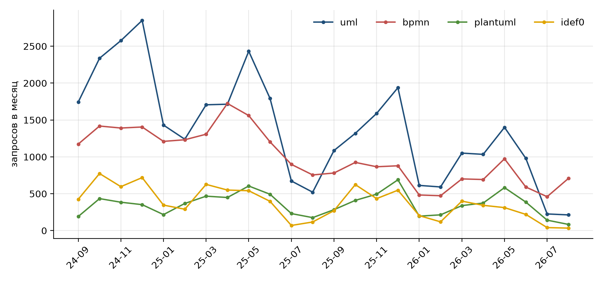

Рисунок 1 – Динамика запросов ядра по данным Вордстата, Беларусь, помесячно

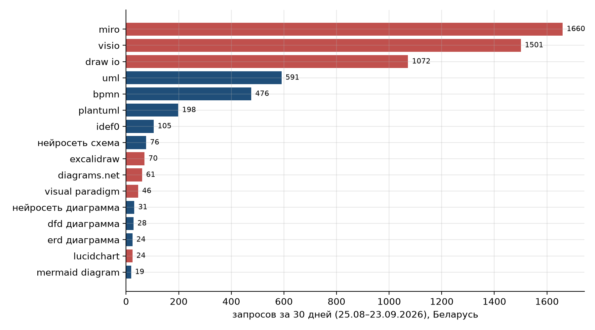

Рисунок 2 – Частотность ядра и заменителей по Вордстату, Беларусь, «Топы» за 30 дней (окно 25.08–23.09.2026)

Визуальные редакторы (miro, visio, draw io) ищут в 1,8–3,5 раза чаще, чем uml и bpmn (Топы за 30 дней: 1 072–1 660 против 476–591); интерес к нотациям и инструментам сезонный (учебный год: спады в июле–августе и январе) и снижается от года к году по большинству запросов (uml −42,7 %, bpmn −44,1 %, idef0 −34,9 %, plantuml −3,9 %); рост показывают только «mermaid diagram» (с низкой базы: 155 → 321 запроса за год) и diagrams.net (+1,1 %). Запросы о генерации схем нейросетью («нейросеть схема», «нейросеть диаграмма») дают измеримый спрос, совпадающий с AI-ассистентом продукта.

Google Trends. Выгрузка четырёх запросов (UML, BPMN, PlantUML, IDEF0) в единой шкале, территория «Беларусь», 12 месяцев, веб-поиск, все категории [6]. Значение 0 означает недостаточный объём поиска в Беларуси, а не отсутствие интереса [7]. Ненулевые значения имеют 19 недель из 53 (36 %); результат показан в таблице 7 и на рисунке 3.

Таблица 7 – Google Trends, Беларусь: месячные индексы (среднее недель)

| Месяц | UML | BPMN | PlantUML | IDEF0 | Среднее (лист 03) |
|---|---|---|---|---|---|
| 09.2025 | 0,00 | 0,00 | 0,00 | 0,00 | 0,00 |
| 10.2025 | 27,75 | 48,00 | 0,00 | 0,00 | 18,94 |
| 11.2025 | 18,20 | 16,40 | 0,00 | 0,00 | 8,65 |
| 12.2025 | 67,00 | 13,00 | 30,50 | 0,00 | 27,62 |
| 01.2026 | 0,00 | 14,25 | 0,00 | 0,00 | 3,56 |
| 02.2026 | 27,00 | 52,00 | 0,00 | 0,00 | 19,75 |
| 03.2026 | 11,40 | 0,00 | 0,00 | 0,00 | 2,85 |
| 04.2026 | 18,75 | 13,50 | 12,25 | 14,25 | 14,69 |
| 05.2026 | 0,00 | 0,00 | 0,00 | 0,00 | 0,00 |
| 06.2026 | 0,00 | 0,00 | 0,00 | 0,00 | 0,00 |
| 07.2026 | 0,00 | 0,00 | 0,00 | 0,00 | 0,00 |
| 08.2026 | 0,00 | 0,00 | 0,00 | 0,00 | 0,00 |

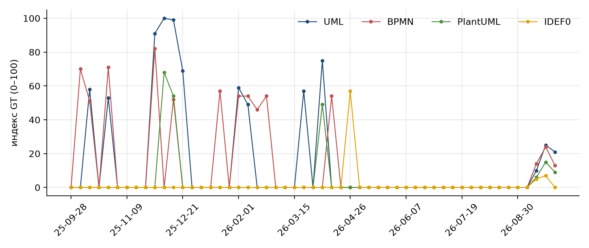

Рисунок 3 – Google Trends, Беларусь: недельные значения индекса за 12 месяцев

Россия и Казахстан (расширение; вне итогового диапазона, решение В-6). Данные перенесены из ЛР1 (п. 2.3.3 и таблица 23 отчёта ЛР1), новые выгрузки не выполнялись. Google Trends: CSV «Динамика популярности» от 30.09.2026, запросы UML и BPMN в одном сравнении, 5 лет, недельное разрешение, все категории, веб-поиск [6]. Последняя неделя (27.09–03.10.2026) неполная и исключена. 12-месячное окно — 52 полные недели 28.09.2025–26.09.2026, вычислено из 5-летнего ряда (отдельная 12-месячная выгрузка по этим странам не делалась); 5-летнее окно — 59 полных месяцев (октябрь 2021 – август 2026, месяц по дате начала недели). Индекс каждого файла нормирован на максимум пары UML–BPMN за 5 лет в данной стране, поэтому значения России и Казахстана между собой, с таблицей 7 (Беларусь, четыре запроса в единой шкале) и с таблицей 8 не сопоставляются: масштаб каждой страны свой.

Таблица 8 – Google Trends, Россия и Казахстан: UML и BPMN (снято 30.09.2026, индексы стран не сопоставимы)

| Страна | Запрос | Недель с данными, 12 мес. | Среднее, 12 мес. | Максимум недели | Месяцев с данными, 5 лет | Среднее, 5 лет | Последние 12 / предыдущие 12 мес. (09.2025–08.2026 / 09.2024–08.2025) | Изменение (порог ±15 %) |
|---|---|---|---|---|---|---|---|---|
| Россия | UML | 52 из 52 | 50,02 | 70 | 59 из 59 | 56,19 | 51,40 / 62,68 | −18,0 % (снижающийся) |
| Россия | BPMN | 52 из 52 | 61,52 | 94 | 59 из 59 | 55,33 | 62,01 / 70,71 | −12,3 % (стабильный) |
| Казахстан | UML | 12 из 52 | 12,87 | 84 | 35 из 59 | 13,94 | 13,07 / 13,18 | −0,9 % (стабильный) |
| Казахстан | BPMN | 17 из 52 | 20,10 | 100 | 37 из 59 | 13,24 | 21,85 / 12,93 | +69,0 % (растущий) |

Значение 0 означает недостаточный объём поиска, а не отсутствие интереса. По России ряды непрерывные (данные в каждой неделе), по Казахстану прерывистые, как по Беларуси; рост BPMN в Казахстане опирается на малые значения (данные в 17 неделях из 52) и требует осторожной интерпретации. Расчёт повторяет скрипт ЛР1 06_gt_ru_kz_mermaid.py, файлы — Материалы_собранные/GT_Россия_Казахстан_из_ЛР1.

Таблица 9 – Вордстат, вкладка «Регионы», bpmn и uml: число запросов (индекс интереса, %), окно 29.08–29.09.2026

| Регион | bpmn | uml |
|---|---|---|
| Беларусь | 422 (71,96) | 560 (133,13) |
| Россия | 31 582 (104,85) | 22 921 (102,19) |
| Казахстан | 358 (83,03) | 309 (95,17) |
| Топы запросов, Беларусь (то же окно) | 473 | 652 |
| Россия к Беларуси, раз | 74,8 | 40,9 |
| Казахстан к Беларуси, раз | 0,85 | 0,55 |

Вкладка «Регионы» показывает мировую разбивку независимо от фильтра региона; окно скользящее (29.08.2026–29.09.2026), данные сняты 30.09.2026 в ЛР1 (таблица 23 отчёта ЛР1, файл Материалы_собранные/Wordstat_Регионы_из_ЛР1). Значения «Регионы» и «Топы» по Беларуси различаются (вероятно, из-за разных наборов словоформ во вкладках); таблица 23 настоящего отчёта (plantuml) относится к другому запросу и окну. Числа запросов России и Казахстана показывают масштаб аудитории, а не платёжеспособный спрос: расчёт объёма по этим странам не выполнялся и в итоговый диапазон не входит.

#### 2.2.2 Семантическое ядро, группы намерений и веса

Запросы классифицированы по намерению; вес коммерческой близости задан внутри диапазонов ПС табл. 9 (информационный 0,10–0,30; проблемный 0,30–0,60; инструментальный 0,50–0,80; коммерческий 0,80–1,00; нерелевантный 0,00). Коэффициент релевантности — в диапазоне 0,70–1,00 (ПС табл. 14). Веса — экспертные, фиксируются в журнале допущений (допущение Д-03).

Таблица 10 – Лист 02_Семантика: семантическое ядро и взвешенный спрос

| № | Запрос | Группа | Намерение | Регион | Частотность, запросов/мес. | Индекс GT | Релевантность | Коммерческая близость | Взвешенный спрос |
|---|---|---|---|---|---|---|---|---|---|
| 1 | uml купить | Коммерческий спрос | коммерческое | РБ | 5 | н/д | 1,00 | 0,90 | 4,5 |
| 2 | visio купить | Коммерческий спрос | коммерческое | РБ | 7 | н/д | 0,70 | 0,85 | 4,2 |
| 3 | uml онлайн | Инструментальный спрос | инструментальное | РБ | 28 | н/д | 1,00 | 0,65 | 18,2 |
| 4 | bpmn онлайн | Инструментальный спрос | инструментальное | РБ | 28 | н/д | 0,90 | 0,65 | 16,4 |
| 5 | plantuml online | Инструментальный спрос | инструментальное | РБ | 14 | н/д | 0,90 | 0,70 | 8,8 |
| 6 | нейросеть схема | Инструментальный спрос | инструментальное (AI) | РБ | 76 | н/д | 0,70 | 0,55 | 29,3 |
| 7 | idef0 как | Проблемный спрос | проблемное | РБ | 11 | н/д | 1,00 | 0,45 | 5,0 |
| 8 | bpmn пример | Проблемный спрос | проблемное | РБ | 10 | н/д | 0,90 | 0,40 | 3,6 |
| 9 | uml | Общий тематический спрос | информационное | РБ | 591 | 14,52 | 1,00 | 0,20 | 118,2 |
| 10 | mermaid | Исключаемый (омоним) | омоним: фильм | РБ | 1 163 | н/д | 0,00 | 0,00 | 0,0 |

Индекс GT «н/д» — недостаточно данных по Беларуси; у «uml» указано среднее недельного ряда UML за 12 месяцев из ЛР1 (28.09.2025–26.09.2026, 52 полные недели, снято 30.09.2026); индекс этого ряда нормирован на максимум самого запроса и со шкалой таблицы 7 (четыре запроса в единой шкале) не сопоставляется. Частотность — «Топы» Вордстата, окно 25.08–23.09.2026. Строка «mermaid» исключена (вес 0,00): в шаблоне исключаемый запрос входит в сумму с ненулевыми весами (особенность П-14), в рабочей копии веса обнулены.

Таблица 11 – Состав групп запросов для листа 04_Wordstat

| Группа | Формулировки Вордстата (суммируются помесячные ряды) | Сумма за 12 мес., запросов | Вес намерения |
|---|---|---|---|
| Коммерческие запросы | visio купить; uml купить; miro подписка; visio лицензия; miro стоимость | 286 | 0,90 |
| Проблемные запросы | idef0 как; bpmn пример; uml пример; idef0 пример; dfd пример | 1 021 | 0,45 |
| Инструментальные запросы | uml онлайн; bpmn онлайн; idef0 онлайн; bpmn скачать; uml скачать; plantuml editor; uml editor; plantuml online; bpmn редактор; uml редактор; idef0 программа; нейросеть схема; нейросеть диаграмма; конструктор диаграмм онлайн; конструктор схем онлайн | 4 948 | 0,65 |
| Локальные запросы | динамика недоступна (ниже порога отображения) | 0 | 0,30 |

Операторы группировки в вкладке «Динамика» не поддерживаются, поэтому групповой ряд получен суммированием рядов отдельных формулировок. Формулировки пересекаются (например, «plantuml online editor» входит в «plantuml online» и «plantuml editor»), поэтому сумма — оценка сверху. Запросы «uml как», «dfd как», «uml минск», «bpmn минск» исключены из сумм: при ненулевых Топах (17, 6, 3, 4) интерфейс возвращает нулевой ряд; ряд «bpmn как» содержит семь нулевых значений подряд и также не используется. Общие информационные запросы (uml, bpmn) в группы не входят; их вклад учтён строкой «uml» листа 02.

Таблица 12 – Лист 04_Wordstat: частотность по группам, коммерческий коэффициент и взвешенная частотность

| Месяц | Коммерческие | Проблемные | Инструментальные | Локальные | Суммарная | Коммерческий коэффициент | Взвешенная |
|---|---|---|---|---|---|---|---|
| 09.2025 | 21 | 119 | 425 | 0 | 565 | 0,617 | 348,7 |
| 10.2025 | 17 | 113 | 562 | 0 | 692 | 0,623 | 431,4 |
| 11.2025 | 15 | 110 | 574 | 0 | 699 | 0,624 | 436,1 |
| 12.2025 | 20 | 158 | 669 | 0 | 847 | 0,619 | 524,0 |
| 01.2026 | 32 | 64 | 238 | 0 | 334 | 0,636 | 212,3 |
| 02.2026 | 12 | 46 | 284 | 0 | 342 | 0,632 | 216,1 |
| 03.2026 | 50 | 105 | 494 | 0 | 649 | 0,637 | 413,4 |
| 04.2026 | 52 | 94 | 541 | 0 | 687 | 0,642 | 440,8 |
| 05.2026 | 23 | 69 | 589 | 0 | 681 | 0,638 | 434,6 |
| 06.2026 | 12 | 66 | 340 | 0 | 418 | 0,626 | 261,5 |
| 07.2026 | 18 | 43 | 125 | 0 | 186 | 0,628 | 116,8 |
| 08.2026 | 14 | 34 | 107 | 0 | 155 | 0,629 | 97,5 |
| Сумма / среднее | 286 | 1 021 | 4 948 | 0 | 6 255 | 0,629 | 327,8 |

Коммерческий коэффициент месяца — средневзвешенный вес намерения по составу месяца (веса таблицы групп).

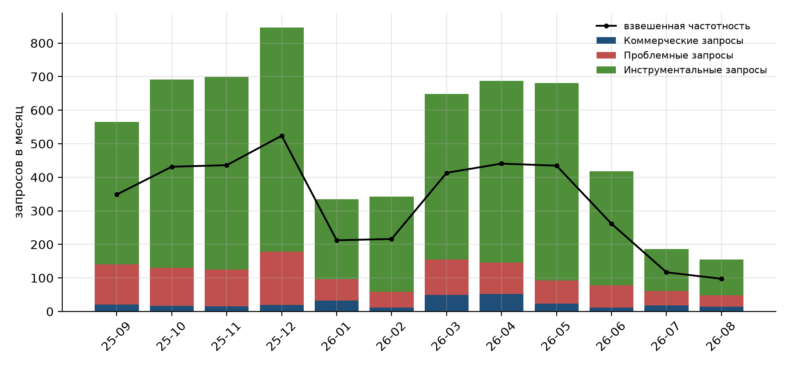

Рисунок 4 – Частотность по группам запросов и взвешенная частотность, Беларусь, помесячно

#### 2.2.3 Нормализация, воронка и сценарии

Таблица 13 – Лист 05_Нормализация: сводный индекс спроса (вес GT 0,4, вес Вордстата 0,6)

| Месяц | Средний GT | Нормированный GT | Взвешенный Вордстат | Нормированный Вордстат | Сводный индекс | Уровень |
|---|---|---|---|---|---|---|
| 09.2025 | 0,00 | 0,0 | 348,7 | 66,6 | 39,9 | низкий |
| 10.2025 | 18,94 | 68,6 | 431,4 | 82,3 | 76,8 | высокий |
| 11.2025 | 8,65 | 31,3 | 436,1 | 83,2 | 62,5 | средний |
| 12.2025 | 27,62 | 100,0 | 524,0 | 100,0 | 100,0 | высокий |
| 01.2026 | 3,56 | 12,9 | 212,3 | 40,5 | 29,5 | низкий |
| 02.2026 | 19,75 | 71,5 | 216,1 | 41,2 | 53,3 | средний |
| 03.2026 | 2,85 | 10,3 | 413,4 | 78,9 | 51,5 | средний |
| 04.2026 | 14,69 | 53,2 | 440,8 | 84,1 | 71,7 | средний |
| 05.2026 | 0,00 | 0,0 | 434,6 | 82,9 | 49,8 | средний |
| 06.2026 | 0,00 | 0,0 | 261,5 | 49,9 | 29,9 | низкий |
| 07.2026 | 0,00 | 0,0 | 116,8 | 22,3 | 13,4 | низкий |
| 08.2026 | 0,00 | 0,0 | 97,5 | 18,6 | 11,2 | низкий |

Средний сводный индекс 49,1; нормированный GT в среднем 29,0, нормированный Вордстат — 62,6. Методика (ПС §3) и инструкция (ИНСТР §14) запрещают механическое сложение Google Trends и Вордстата, поэтому сводный индекс показан как предусмотренный шаблоном, а вывод об интересе делается по каждому источнику отдельно: Вордстат устойчиво показывает спрос с учебной сезонностью, Google Trends по Беларуси почти не даёт данных.

Таблица 14 – Лист 06_Воронка: цифровая воронка поискового канала

| Показатель | Осторожный | Базовый | Оптимистичный |
|---|---|---|---|
| Взвешенный поисковый спрос, запросов/мес. | 327,8 | 327,8 | 327,8 |
| Доля переходов из поиска | 4 % | 8 % | 12 % |
| Посещения, в месяц | 13,11 | 26,22 | 39,33 |
| Конверсия посетитель → заявка (регистрация) | 2 % | 4 % | 7 % |
| Заявки, в месяц | 0,262 | 1,049 | 2,753 |
| Конверсия заявка → оплата Pro | 3 % | 4 % | 5 % |
| Продажи (оплаты Pro), в месяц | 0,0079 | 0,0420 | 0,1377 |
| Средний чек, BYN | 121,14 | 121,14 | 290,74 |
| Коэффициент повторных оплат | 1,0 | 1,2 | 1,5 |
| Выручка, BYN в месяц | 0,95 | 6,10 | 60,03 |
| Выручка, BYN в год | 11,4 | 73,2 | 720,4 |

Доля переходов, конверсия в заявку и коэффициент повторов взяты из шаблона и попадают в шкалу ПС табл. 17 (2–4 / 5–8 / 9–12 %; 1–2 / 3–5 / 6–8 %). Конверсия заявка → оплата — допущение проекта (Free → Pro 3–5 %, допущение Д-09): шкала ПС 10–20 / 25–35 / 40–50 % описывает заявки на услугу и для freemium-продукта неприменима; расчёт по шкале ПС приведён в таблице 15. Чек: 40 USD в год (осторожный и базовый сценарии), медиана входных платных тарифов конкурентов (8 USD в месяц × 12).

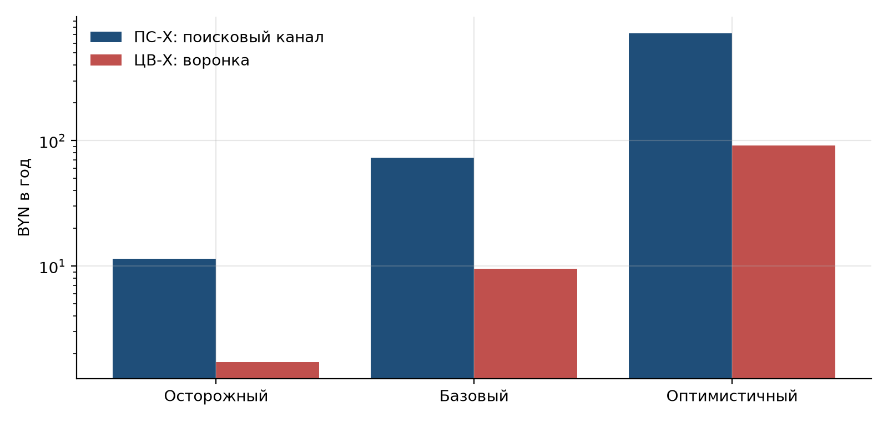

Рисунок 5 – Годовая выручка воронки поискового канала (ПС-X) и воронки ЦВ-X, BYN в год (логарифмическая шкала)

Результат листа 08_Дашборд: средний сводный индекс спроса 49,1 (уровень «средний» по порогам шаблона ≥75 / ≥45), средняя взвешенная частотность 327,8 запросов в месяц, годовая выручка поискового канала 11 — 720 BYN (осторожный – оптимистичный сценарий), базовая — 73,2 BYN. Эти величины малы: при взвешенном спросе около 330 запросов в месяц поиск даёт менее одного платящего пользователя в год. Это нижняя граница, а не оценка рынка: учтены только формулировки, по которым Вордстат показывает динамику, аудитория одной поисковой системы, и не учтены реклама, сообщества и рекомендации.

#### 2.2.4 Расчёт по тексту методики (вариант Word) и расхождения

Таблица 15 – Расхождения шаблона ПС-X и методики ПС (Р-1 … Р-7)

| № | Вопрос | По Excel-шаблону (основной) | По Word (рядом) |
|---|---|---|---|
| Р-1 | Взвешенный спрос строки | F × H × I; сумма по 10 строкам 208,1 | F × H × I × региональный коэффициент (ПС табл. 14: 0,50–1,00); для Беларуси в целом принят 1,00 (допущение Д-04), сумма 208,1; для Минска коэффициент меньше 1 |
| Р-2 | База воронки | среднее 04_Wordstat!H за 12 мес. = 327,8 запросов/мес. | сумма взвешенного спроса по ядру (лист 02) = 208,1 запросов за 30 дней; годовая выручка при тех же параметрах 7,3 / 38,7 / 304,9 BYN |
| Р-3 | Сводный индекс GT + Вордстат | 0,4 × GT + 0,6 × Вордстат, среднее 49,1 | механическое сложение запрещено (ПС §3); по источникам отдельно: нормированный Вордстат 62,6, нормированный GT 29,0 (мало данных) |
| Р-4, Р-5 | Повторные покупки и годовой объём | множитель повторов 1,0 / 1,2 / 1,5; годовая = месячная × 12: 11,4 / 73,2 / 720,4 BYN | без повторов, годовая = сумма 12 месячных значений: 6,4 / 49,6 / 420,2 BYN (при шкале ПС для доли переходов и заявок) |
| Р-6 | Конверсия заявка → оплата | 0,15 / 0,25 / 0,35 в шаблоне (оптимистичное значение ниже диапазона Word 40–50 %) | шкала ПС 10–20 / 25–35 / 40–50 % (середины 15 / 30 / 45 %): годовая выручка 57,2 / 548,9 / 6 483,6 BYN; для NotaCode принята конверсия проекта 3–5 % |
| Р-7, П-14 | Исключаемые запросы | демонстрационная строка входит в сумму с ненулевыми весами | вес 0,00 (ПС табл. 9): в рабочей копии строка «mermaid» обнулена |

Результат по Word показывает, что замена допущений шаблона значениями методики меняет порядок величины лишь при замене конверсии заявка → оплата; базовая оценка поискового канала остаётся в пределах десятков–сотен BYN в год.

#### 2.2.5 Вывод по поисковому спросу

В рамках исследования рынок определён как рынок веб-инструментов построения и проверки диаграмм формальных нотаций для студентов технических специальностей, аналитиков и архитекторов ПО в Республике Беларусь. Поисковый анализ показал интерес аудитории к нотациям и инструментам: uml (591 запрос за 30 дней), bpmn (476), plantuml (198), idef0 (105), а также к визуальным редакторам-заменителям (miro 1 660, visio 1 501, draw io 1 072) и генерации схем нейросетью (107). Коммерчески значимые формулировки редки: 16 запросов за 30 дней со словами «купить», «цена», «подписка», «лицензия» при 170 инструментальных («онлайн», «редактор», «скачать») и 87 проблемных. Динамика — сезонная (учебный год) со снижением от года к году по основным запросам. Расчёт через поисковый канал даёт достижимую выручку порядка 11–720 BYN в год; поисковый спрос подтверждает наличие интереса, но не платёжеспособный спрос. Вывод предварительный и требует проверки прогнозом в рекламных кабинетах (модельная оценка (допущение; причина: табл. 91, п. 5)), опросом (модельная оценка (допущение; причина: табл. 91, п. 4)) и данными конкурентов.

Расширение на Россию и Казахстан (вне итогового диапазона, В-6): по Вордстату, вкладка «Регионы», окно 29.08–29.09.2026, запросов bpmn и uml в России в 74,8 и 40,9 раза больше, чем в Беларуси, в Казахстане — 0,85 и 0,55 белорусского значения (таблица 9). По Google Trends в России данные есть в каждой неделе, за год интерес снизился менее глубоко, чем в Беларуси (UML −18,0 %, BPMN −12,3 %), в Казахстане ряд прерывистый (таблица 8). Индекс Google Trends нормирован в каждой стране отдельно, поэтому страны между собой по нему не сравниваются; масштаб аудитории оценивается только по Вордстату, платёжеспособность в этих странах не оценивалась.

### 2.3 Similarweb: выборка, доли, концентрация, каналы, география

#### 2.3.1 Бесплатный доступ и журнал ручной фиксации

Similarweb — источник оценочных данных, а не измеритель рынка; трафик конкурентов не равен продажам [8, 9]. При бесплатном доступе методика выполняется вручную: открываются карточки сайтов, фиксируются видимые показатели, делаются снимки экрана, записываются дата и период. Массовые выгрузки (Data Exporter, API), глубокая история и детальные разбивки недоступны, поэтому любой количественный вывод даётся диапазоном, а показатель, который не показан, отмечается «нет данных в бесплатном доступе» и не домысливается.

Страница plantuml.com открыта 30.09.2026 (период «август 2026», график «последние 3 месяца», все типы трафика) [10]. На страницах app.diagrams.net, mermaid.live и lucidchart.com бесплатный просмотр закрылся сообщением об исчерпании лимита поисков; ограничение не обходилось, значения по этим доменам в журнале отмечены «доступ закрыт». Имена файлов скриншотов построены по образцу М1 табл. 14 (similarweb_traffic_[домен]_[страна]_[период]).

Таблица 16 – Журнал ручной фиксации Similarweb (SWБ табл. 7), фрагмент

| Дата | Домен | Раздел Similarweb | Показатель | Значение | Комментарий / снимок экрана |
|---|---|---|---|---|---|
| 29.09.2026 | plantuml.com | Overview | Total visits (август 2026) | 507 000 | скриншот similarweb_traffic_plantuml.com_global_last3months_2026-09-30.png |
| 29.09.2026 | plantuml.com | Overview | Global Rank | 93 517 | ранг; Country Rank #24 334 (Россия); Category Rank #692 |
| 29.09.2026 | plantuml.com | Geography | Доля России в трафике | 0,091 | Беларусь в топ-5 стран не показана: нет данных в бесплатном доступе |
| 29.09.2026 | plantuml.com | Marketing Channels | Organic Search | 0,485 | Direct и Referrals — 2-е и 3-е места без долей |
| 29.09.2026 | plantuml.com | Engagement | Bounce rate | 0,455 | Pages/visit 3,18; Avg duration 00:03:16 |
| 29.09.2026 | app.diagrams.net | Overview | Total visits | доступ закрыт | лимит бесплатных просмотров (скриншот ...global_limit_2026-09-30.png); значение 7,8 млн — из выгрузки ЛР1 |
| 29.09.2026 | mermaid.live | Overview | Total visits | доступ закрыт | лимит бесплатных просмотров |
| 29.09.2026 | lucidchart.com | Overview | Total visits | доступ закрыт | лимит бесплатных просмотров; данные lucid.app (13,38 млн визитов за июнь – август 2026, Worldwide) сняты 02.10.2026, ЛР4, приложение Д |

Полный журнал — в приложении В. Период во всех строках — август 2026 (последние 3 месяца); требование М1 «не менее 12 месяцев» при бесплатном доступе выполнить нельзя — это ограничение расчёта, а не выполненное условие.

#### 2.3.2 Конкурентная выборка

Выборка составляет четыре домена, то есть меньше минимума методик (пять по М2 §5; целевой ориентир 10–20 по СВ §3). Причина — закрытие бесплатного просмотра после первых обращений; недостающие домены вынесены в перечень работ для выполнения вручную (приложение Б). Данные по plantuml.com сняты 30.09.2026 (снимок экрана низкого разрешения и текст страницы); визиты app.diagrams.net (7,8 млн) указаны в отчёте ЛР1, а значения eraser.io (678,5 тыс.) и mermaidchart.com («менее 20 тыс.», принята верхняя граница) получены при предварительном замере 17–23.09.2026 и в итоговый отчёт ЛР1 не вошли; повторный замер невозможен (лимит), поэтому эти значения считаются непроверенными, а влияние выборки оценено отдельно (таблица 18). Состав выборки проверен на омонимию: все четыре домена — сайты инструментов диаграмм, омонимичных значений нет.

Таблица 17 – Карточки сайтов выборки (М2 табл. 6, SWБ табл. 6)

| Домен | Название | Тип | Визиты в месяц (весь мир) | Статус данных | Доля релевантного трафика, Д-02 |
|---|---|---|---|---|---|
| plantuml.com | PlantUML | прямой (текстовый DSL) | 507 000 | ФАКТ (Similarweb, авг. 2026, скриншот) | 0,75 |
| app.diagrams.net | draw.io (diagrams.net) | заменитель (визуальный редактор) | 7 800 000 | отчёт ЛР1, без скриншота | 0,35 |
| eraser.io | Eraser | прямой (AI + diagram as code) | 678 500 | предварительный замер 17–23.09.2026, не подтверждён | 0,50 |
| mermaidchart.com | Mermaid Chart | прямой (текстовый DSL) | 20 000 | предварительный замер: «менее 20 тыс.» (верхняя граница), не подтверждён | 0,70 |

Доля релевантного трафика — экспертное допущение в диапазоне СЦ табл. 10 (20–75 %). Дополнительные показатели plantuml.com: глобальный ранг 93 517, ранг в России 24 334, ранг категории 692 (Programming and Developer Software), отказы 45,52 %, страниц за визит 3,18, длительность 3 мин 16 с; Россия 9,07 % трафика, Германия 7,21 %, Китай 6,4 %, Япония 4,61 %, США 4,57 %; Organic Search 48,47 %. Похожие сайты (affinity): app.diagrams.net 100 %, mermaidchart.com 92 %, eraser.io 90 %, drawio-app.com 85 %, sequencediagram.org 80 %, visual-paradigm.com 75 %, mermaid.live 68 %.

Таблица 18 – Чувствительность к составу выборки: четыре домена и два домена, упомянутые в ЛР1

| Показатель | Четыре домена (основной расчёт) | Два домена (plantuml.com, app.diagrams.net) |
|---|---|---|
| Суммарный трафик, визитов в месяц (мир) | 9 005 500 | 8 307 000 |
| Трафик Беларуси по допущению Д-01, визитов в месяц | 17 633 | 16 265 |
| Объём рынка по SW-X, BYN в год (осторожный / базовый / оптимистичный) | 7 690 / 21 971 / 139 815 | 7 093 / 20 267 / 128 970 |
| HHI | 7 590 | 8 854 |

Исключение двух непроверенных значений уменьшает трафик выборки менее чем на 8 %, потому что доминирует app.diagrams.net; выводы о концентрации и объёме не меняются.

Таблица 19 – Типы сайтов выборки (SWБ табл. 5, М1 табл. 16)

| Тип сайта | Представлен в выборке | Не представлен (Similarweb по пяти доменам снят 02.10.2026, ЛР4, приложение Д; остальные типы – модельная оценка (допущение), табл. 91, п. 1) |
|---|---|---|
| Прямые конкурентные продукты | plantuml.com, eraser.io, mermaidchart.com | mermaid.live, creately.com, online.visual-paradigm.com, dbdiagram.io, structurizr.com, kroki.io, gleek.io, sequencediagram.org |
| Заменители (универсальные редакторы) | app.diagrams.net | lucidchart.com, miro.com, excalidraw.com, whimsical.com |
| Специализированные BPMN-инструменты | — | bpmn.io, staruml.io |
| Контентные и справочные сайты | — | mermaid.js.org, учебные сайты по UML/BPMN |

#### 2.3.3 Доли трафика, CR3, CR5 и HHI

Таблица 20 – Доли трафика выборки и слагаемые HHI (М1 ф. 2, М2 §7, §12)

| Домен | Визиты/мес. | Доля по сырым визитам | Слагаемое HHI (сырые) | Доля по визитам с учётом релевантной доли (Д-02) | Слагаемое HHI (с Д-02) |
|---|---|---|---|---|---|
| plantuml.com | 507 000 | 5,63 % | 31,7 | 10,98 % | 120,5 |
| app.diagrams.net | 7 800 000 | 86,61 % | 7 501,9 | 78,82 % | 6 212,9 |
| eraser.io | 678 500 | 7,53 % | 56,8 | 9,80 % | 95,9 |
| mermaidchart.com | 20 000 | 0,22 % | 0,0 | 0,40 % | 0,2 |
| Сумма / HHI | 9 005 500 | 100 % | 7 590 | 100 % | 6 430 |

Доля по сырым визитам — формула М1 и SWБ §7; доля по релевантным визитам — подход М2 §7; подходы дают разные значения (W-6). Географическая доля Беларуси принята одинаковой для всех доменов, поэтому не влияет на доли.

Таблица 21 – CR3, CR5, HHI и уровни концентрации (лист 09_Концентрация)

| Показатель | По сырым визитам | По релевантным визитам (Д-02) |
|---|---|---|
| CR3, % | 99,8 | 99,6 |
| CR5, % (при четырёх доменах CR5 = 100 %) | 100 | 100 |
| HHI = Σ (доля в %)² | 7 590 | 6 430 |
| Уровень по шкале М2 табл. 16 (до 1 500 / 1 500–2 500 / выше 2 500) | высокая | высокая |
| Проверка HHI ≥ CR3² / 3 (порог 3 319) | выполняется | выполняется |

Качественные уровни М1 табл. 10 чисел не содержат; по М1 концентрация также оценивается как высокая. Значения — оценка концентрации цифрового трафика выборки из четырёх доменов, а не выручки и не рыночной власти: доминирует универсальный редактор draw.io (86,6 % визитов). В шаблоне SW-X расчёта CR3/CR5/HHI нет — лист добавлен в рабочей копии (Р-42).

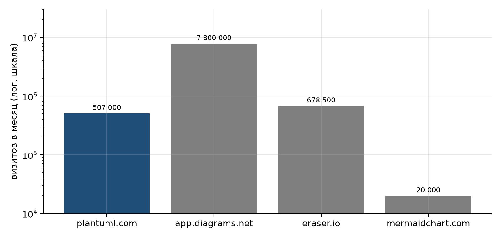

Рисунок 6 – Визиты доменов выборки Similarweb, в месяц (логарифмическая шкала; синий — подтверждено скриншотом)

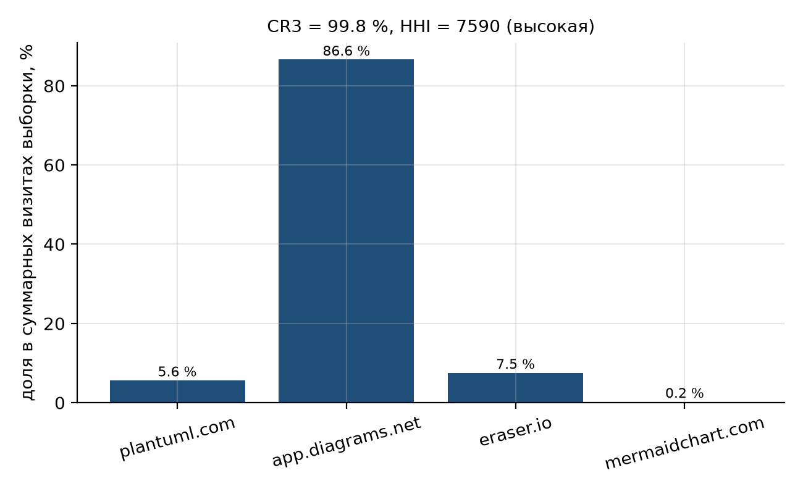

Рисунок 7 – Доли доменов в суммарных визитах выборки

#### 2.3.4 Каналы, география и поисковые запросы

Таблица 22 – Лист 03_Каналы: канальная структура (только показанные значения)

| Канал | Средневзвешенная доля | Трафик рынка, визитов/мес. | Трафик рынка, визитов/год | Приоритет |
|---|---|---|---|---|
| Direct | 0 | 0 | 0 | нет данных |
| Organic search | 0,485 | 12 209 | 146 513 | высокий |
| Referral | 0 | 0 | 0 | нет данных |
| Social | 0 | 0 | 0 | нет данных |
| Paid search | 0 | 0 | 0 | нет данных |
| Display | 0 | 0 | 0 | нет данных |

Бесплатная карточка plantuml.com показывает долю только Organic Search (48,47 %); Direct и Referrals названы вторым и третьим каналами без долей, Social, Paid, Mail и Display доли не показаны. Email/Mail в шаблоне колонки не имеет (Р-43) и фиксируется в журнале. Формула средневзвешенных долей в копии исправлена (П-18): делитель — сумма трафика только по строкам, где доля показана.

Географическая структура. Беларусь в топ-5 стран Similarweb не попадает; доля России у plantuml.com — 9,07 %. Доля Беларуси оценена как допущение Д-01: доля России по Similarweb, умноженная на отношение числа запросов Беларусь/Россия по запросу «plantuml» на вкладке «Регионы» Вордстата (170 / 7 874; скользящее окно 29.08.2026–27.09.2026, снято 30.09.2026), то есть 0,1958 % визитов. Доля Минска — 0,1428 % (Минск даёт 124 из 170 запросов Беларуси). Допущение единое для всех доменов выборки и является главным источником неопределённости: для универсального редактора draw.io реальная доля Беларуси может отличаться. Оговорки к Д-01: (1) доля России 9,07 % в Similarweb относится к desktop-трафику (на странице указано, что Россия — основная страна по desktop-трафику), а в расчёте применена ко всем визитам, включая мобильные; (2) отношение 170 / 7 874 из Вордстата отражает только пользователей Яндекса, а доля Яндекса в поиске в Беларуси и России различается. Направление возможного смещения по имеющимся данным определить нельзя, поэтому оценка Д-01 остаётся допущением с низкой надёжностью (модельная оценка (допущение; причина: доля Беларуси по plantuml.com и другим доменам в Similarweb, табл. 91, п. 1–2)).

Таблица 23 – Вордстат, вкладка «Регионы», запрос «plantuml», окно 29.08.2026–27.09.2026 (снято 30.09.2026)

| Регион | Запросов | Индекс интереса, % |
|---|---|---|
| Россия | 7 874 | 103,04 |
| СНГ (исключая Россию) | 340 | 106,72 |
| Беларусь | 170 | 118,12 |
| Казахстан | 154 | 138,85 |
| Минск и область | 142 | 205,29 |
| Минск | 124 | 255,54 |

Таблица 24 – Лист 04_География: шаблонный расчёт и корректный вариант (П-10)

| Территория | Доля трафика | Шаблон: трафик, мес. (C) | Шаблон: трафик, год (D) | Корректно: трафик до сужения × доля, мес. (I) | Корректно, год (J) |
|---|---|---|---|---|---|
| Республика Беларусь | 0,1958 % | 49,3 | 592 | 25 190 | 302 276 |
| Минск (город) | 0,1428 % | 36,0 | 432 | 18 371 | 220 455 |
| Остальная Беларусь (включая областные центры) | 0,0530 % | 13,4 | 160 | 6 818 | 81 821 |
| Россия (другие русскоязычные рынки) | 9,0700 % | 2 284,7 | 27 416 | 1 166 856 | 14 002 266 |

Шаблон умножает долю территории на B12 — трафик, уже суженный до Беларуси, то есть применяет географию дважды (П-10); корректный вариант умножает на трафик до географического сужения. Россия — гипотеза расширения, в итог не входит (В-6). Приоритет территорий по порогам шаблона (≥ 0,35 / ≥ 0,15) для малых долей всегда «низкий» и в выводах не используется.

Таблица 25 – Лист 05_Запросы: типы намерений и индекс коммерческого интереса (П-11)

| Запрос | Доля среди запросов | Трафик рынка по шаблону, мес. (D) | Тип намерения | Вес | Индекс (G) | Корректно: D × доля Organic (K) | Решение |
|---|---|---|---|---|---|---|---|
| uml купить | 0,0068 | 171 | коммерческий | 1 | 171 | 83 | включить |
| visio купить | 0,0096 | 242 | коммерческий | 1 | 242 | 117 | включить (конкурент) |
| нейросеть схема | 0,104 | 2 615 | инструментальный | 0,700 | 1 830 | 1 267 | включить |
| uml онлайн | 0,038 | 965 | инструментальный | 0,700 | 675 | 468 | включить |
| plantuml online | 0,019 | 481 | инструментальный | 0,700 | 337 | 233 | включить |
| idef0 как | 0,015 | 378 | проблемный | 0,600 | 227 | 183 | включить |
| uml | 0,807 | 20 338 | информационный | 0,100 | 2 034 | 9 858 | исключить (не подтверждает платёжеспособный спрос) |

Доли Similarweb по запросам в бесплатном доступе не показаны (для plantuml.com видны только названия: plantuml, plant uml, plantuml online, plantuml editor, planuml; всего 866 ключевых слов), поэтому доли рассчитаны по частотности Вордстата среди перечисленных запросов. Шаблон умножает долю запроса на весь трафик рынка, а не на его поисковую часть, что вероятно завышает оценку (П-11); в столбце K — вариант с долей Organic. Веса SW-X (проблемный 0,6; информационный 0,1) отличаются от ПС табл. 9 (проблемный 0,30–0,60) — Р-44.

Таблица 26 – Поисковые запросы plantuml.com с оценкой CPC (М1 табл. 19)

| Ключевое слово | Тип | CPC, USD | Комментарий |
|---|---|---|---|
| plantuml | брендовый | 1,24 | Similarweb, desktop, весь мир, 30.09.2026 |
| plant uml | брендовый | 1,46 | — |
| plantuml online | брендовый + инструмент | 1,39 | — |
| plantuml editor | брендовый + инструмент | 1,22 | — |
| planuml | брендовый (опечатка) | 0,53 | — |
| прочие 861 ключевых слов | нет данных в бесплатном доступе | — | Всего 866 ключевых слов; Organic 100 %, Paid 0 % |

Все показанные ключевые слова брендовые, поэтому вывод о небрендовом (категорийном) спросе по Similarweb сделать нельзя; стоимость клика 0,5–1,5 USD указывает на коммерческую ценность запросов для рекламодателей, при этом доля платного трафика у plantuml.com нулевая.

#### 2.3.5 Расчёт объёма по SW-X

Таблица 27 – Лист 01_Параметры: значения до и после исправления формул (П-1)

| Показатель | В шаблоне (суммирование с 5-й строки) | В рабочей копии |
|---|---|---|
| Количество конкурентов в выборке | 4 | 4 |
| Наблюдаемый релевантный трафик, мес. | 16 640,1 | 17 632,8 |
| Наблюдаемый релевантный трафик, год | 199 680,8 | 211 593,2 |
| Оценка всего цифрового трафика рынка, мес. (покрытие 0,7) | 23 771,5 | 25 189,7 |
| Оценка всего цифрового трафика рынка, год | 285 258,2 | 302 276,0 |

В шаблоне B9 = SUM(G5:G24) и B10 = SUM(H5:H24) при данных с 4-й строки: первый конкурент (здесь plantuml.com) теряется. В копии диапазоны исправлены на G4:G23 и H4:H23.

Таблица 28 – Лист 06_Воронка_сценарии: рыночный объём по сценариям

| Сценарий | Покрытие | Трафик рынка, визитов/мес. | CR1 | CR2 | Чек, BYN | Оплат на клиента в год | Заказов/мес. | Выручка/мес., BYN | Выручка/год, BYN |
|---|---|---|---|---|---|---|---|---|---|
| Осторожный | 0,80 | 22 041 | 0,80 % | 3 % | 121,14 | 1 | 5,29 | 641 | 7 690 |
| Базовый | 0,70 | 25 190 | 1,50 % | 4 % | 121,14 | 1 | 15,11 | 1 831 | 21 971 |
| Оптимистичный | 0,55 | 32 060 | 2,50 % | 5 % | 290,74 | 1 | 40,07 | 11 651 | 139 815 |

Покрытие (0,8 / 0,7 / 0,55), CR1 (0,8 / 1,5 / 2,5 %) и достижимая доля — значения шаблона (Р-37, Р-39). CR2 — допущение проекта (Free → Pro 3–5 %); чек — 40 USD в год (осторожный и базовый сценарии) и медиана тарифов конкурентов. Трафик рынка — только географически суженные визиты выборки (Беларусь), без доли релевантного (SW-X её не содержит, Р-38).

Таблица 29 – Достижимая доля нового бизнеса (SOM) по SW-X

| Сценарий | Рыночная выручка/год, BYN | Достижимая доля | Выручка нового бизнеса/год, BYN |
|---|---|---|---|
| Осторожный | 7 690 | 0,5 % | 38,4 |
| Базовый | 21 971 | 1,5 % | 329,6 |
| Оптимистичный | 139 815 | 3,5 % | 4 893,5 |

Итог листа: объём цифрового рынка оценивается от 7 690 до 139 815 BYN в год, достижимая выручка — от 38 до 4 894 BYN в год.

#### 2.3.6 TAM, SAM, SOM цифрового внимания (М1) и вариант по М2

Таблица 30 – Модель М1 табл. 22: TAM / SAM / SOM цифрового внимания (базовый сценарий)

| Элемент | Значение |
|---|---|
| TAM цифрового внимания: суммарный трафик релевантных сайтов категории, визиты/мес. | 9 005 500 |
| Доля страны (Беларусь), допущение Д-01 | 0,1958 % |
| SAM по географии, визиты/мес. = TAM × доля страны | 17 633 |
| Доля релевантных каналов (Organic Search, plantuml.com) | 48,47 % |
| SAM по каналу, визиты/мес. | 8 547 |
| Достижимая доля (базовая, лист 06) | 1,50 % |
| SOM по трафику, визиты/мес. = SAM × достижимая доля | 128,2 |
| CR1 (лист 06, базовый) | 1,50 % |
| CR2 (лист 06, базовый) | 4,00 % |
| Средний чек, BYN (лист 06) | 121,1 |
| Число покупок в год | 1,0 |
| SOM по выручке, BYN/год = SOM по трафику × 12 × CR1 × CR2 × чек × число покупок | 111,8 |
| Проверка конкурентами: средняя выручка конкурента (при параметрах NotaCode), BYN/год | 3 845 |
| Число активных конкурентов в выборке | 4,0 |
| Проверка конкурентами: сумма, BYN/год | 15 379 |

TAM — суммарный трафик четырёх сайтов; SAM по географии — доля Беларуси; SAM по каналу — доля Organic одного домена (остальные доли не показаны); SOM по выручке — трафик × достижимая доля × CR1 × CR2 × чек × 12. Проверка поиском — лист 05_Запросы.

Таблица 31 – Вариант по М2: охват 0,45 / 0,65 / 0,85 и коммерчески релевантная доля 20 / 35 / 50 %

| Показатель | Осторожный | Базовый | Оптимистичный | Комментарий |
|---|---|---|---|---|
| V_sample: визиты выборки, мес. (Σ) | 9 005 500,0 | 9 005 500,0 | 9 005 500,0 | М2 табл. 8 |
| Доля географии (РБ), Д-01 | 0,20 % | 0,20 % | 0,20 % | — |
| V_geo = V_sample × доля географии | 17 632,8 | 17 632,8 | 17 632,8 | — |
| Коэффициент охвата выборки | 45 % | 65 % | 85 % | М2 табл. 21 (шкала табл. 9: 0,40–0,55 / 0,60–0,75 / 0,80–0,90) |
| V_total = V_geo / охват | 39 183,9 | 27 127,3 | 20 744,4 | Осторожный сценарий даёт БОЛЬШЕ трафика (W-15) |
| Коммерчески релевантная доля | 20 % | 35 % | 50 % | М2 табл. 21 |
| Коммерчески релевантные визиты, мес. | 7 836,8 | 9 494,6 | 10 372,2 | — |
| CR1 (визит → заявка) | 0,35 % | 1,00 % | 2,25 % | середины диапазонов М2 табл. 11 |
| CR2 (заявка → оплата Pro) | 3,00 % | 4,00 % | 5,00 % | допущение проекта Free → Pro 3–5 % (шкала М2 5–40 % для freemium неприменима) |
| Средний чек, BYN/год | 121,1 | 121,1 | 290,7 | 40 USD/год (осторожный, базовый); медиана входных тарифов конкурентов |
| Месячный объём, BYN | 99,7 | 460,1 | 3 392,6 | — |
| Годовой объём, BYN (× 12, М2) | 1 196,2 | 5 520,8 | 40 710,8 | М2: × 12 (в SW-X: × 12 × покупок) |
| Достижимая доля (SOM) | 0,50 % | 1,50 % | 3,50 % | как в листе 06 |
| SOM, BYN/год | 6,0 | 82,8 | 1 424,9 | — |

Шкала охвата М2 табл. 9: 0,80–0,90 — почти все заметные конкуренты; 0,60–0,75 — типовая ситуация; 0,40–0,55 — фрагментированный рынок; ниже 0,40 — только разведочный ориентир. В М2 осторожный сценарий даёт больший V_total, чем оптимистичный (W-15); в SW-X покрытие задано в обратном порядке (0,8 / 0,7 / 0,55), поэтому направление влияния противоположно. Собственных значений охвата не вводилось.

Таблица 32 – Расхождения SW-X с методиками М1 и М2 (Р-37 … Р-45)

| № | Вопрос | SW-X (основной) | М1 / М2 (рядом) | Замечание |
|---|---|---|---|---|
| Р-37 | Охват выборки | 0,8 / 0,7 / 0,55 | 0,45 / 0,65 / 0,85; шкала 0,40–0,55 / 0,60–0,75 / 0,80–0,90 | Направление обратное; значения SW-X осторожного сценария выше шкалы М2 |
| Р-38 | Коммерчески релевантная доля | не предусмотрена | 20 / 35 / 50 % | Применена только в варианте М2 |
| Р-39 | CR1 SW-X в шкале М1 / М2 | 0,8 / 1,5 / 2,5 % | М1 0,3–1 / 1–3 / 3–7 %: да, да, нет; М2 0,2–0,5 / 0,5–1,5 / 1,5–3 %: нет, да, да | Осторожное и оптимистичное значения вне шкалы М1; оптимистичное в шкале М2 |
| Р-39 | CR2 проекта (3 / 4 / 5 %) в шкале М1 / М2 | 3 / 4 / 5 % | М1 5–15 / 15–30 / 30–50 %: нет, нет, нет; М2 5–10 / 10–25 / 25–40 %: нет, нет, нет | Проектное допущение лежит ниже шкал методик для услуг: шкалы относятся к заявкам на услугу, не к переходу Free → Pro |
| Р-40 | Годовой объём | месячный × 12 × число покупок (совпадает с М1) | М2: × 12; подписка — клиенты × платёж × длительность | При одной годовой оплате результаты совпадают |
| Р-41 | Период | последние 3 месяца | М1: не менее 12 месяцев (сезонные 24–36) | Ограничение бесплатного доступа; не считается выполненным |
| Р-43 | Email/Mail как канал | колонки нет | М1 табл. 11, 18: фиксировать | Доля не показана в бесплатном доступе |
| Р-45 | База долей | по релевантным визитам (М2) | М1 ф. 2, SWБ §7: по сырым визитам | Показаны оба (таблица 20) |

#### 2.3.7 Вывод по Similarweb (М2 §20)

Таблица 33 – Итоговый вывод по Similarweb (М2 табл. 25)

| Элемент вывода | Формулировка |
|---|---|
| Границы рынка | Рынок определён как веб-инструменты построения и проверки диаграмм формальных нотаций для студентов и специалистов по ПО в Республике Беларусь. |
| Конкурентная база | В выборку включены четыре сайта: два прямых продукта текстовых диаграмм (plantuml.com, mermaidchart.com), AI-сервис diagram as code (eraser.io) и универсальный редактор-заменитель (app.diagrams.net); выборка меньше минимума методики. |
| Цифровой масштаб | Суммарный трафик выборки — 9 005 500 визитов в месяц (август 2026; данные Similarweb оценочные), из которых, по допущению Д-01, 0,20 % (17 633 визитов) приходится на Беларусь. |
| Структура спроса | Для plantuml.com основной канал — органический поиск (48,47 %); по остальным каналам и доменам данные бесплатной карточки недоступны, поэтому вывод о структуре спроса предварительный. |
| Расчётный объём | С учётом охвата, конверсий и среднего чека объём рынка по SW-X — от 7 690 до 139 815 BYN в год (базовый 21 971); по варианту М2 — от 1 196 до 40 711 BYN в год. |
| Ограничения | Оценка предварительная: данные Similarweb модельные и не раскрывают выручку; доля Беларуси — допущение; выборка из четырёх доменов; период три месяца; три из четырёх значений визитов указаны без снимка экрана (app.diagrams.net — по отчёту ЛР1, eraser.io и mermaidchart.com — по предварительному замеру 17–23.09.2026). |
| Следующий шаг | Снять в Similarweb вручную ещё 6–16 доменов с долями стран и каналов, проверить Беларусь в списке стран, сопоставить с рекламными кабинетами и ценами конкурентов. |

### 2.4 Расчёт «сверху вниз»

Исходный показатель выбирается из перечня инструкции (число организаций, объём цифровой рекламы, оборот электронной торговли, число пользователей, отраслевой отчёт) [1]; показатель, не входящий в перечень (например, валовой внутренний продукт), не используется. Для NotaCode исходный показатель — число пользователей: сумма целевых групп по официальной статистике (студенты вузов 229 000 [11], работники организаций цифровой экономики 130 549 [12], профессорско-преподавательский состав 17 100 [11]) — 376 649 человек. Сужение выполняется долями по диапазонам ПК табл. 7.

Таблица 34 – Лист 02_Сверху_вниз (Excel, основной вариант)

| Показатель | Осторожный | Базовый | Оптимистичный |
|---|---|---|---|
| Общий ориентир: число потенциальных организаций/клиентов | 376 649 | 376 649 | 376 649 |
| Доля клиентов в продуктовых границах рынка | 15,00 % | 30,00 % | 50,00 % |
| Доля клиентов в выбранной географии | 1,00 | 1,00 | 1,00 |
| Доля клиентов, доступных через цифровые каналы | 30,00 % | 55,00 % | 80,00 % |
| Доля клиентов с вероятной потребностью | 0,75 % | 3,94 % | 13,00 % |
| Средний годовой чек | 121 | 121 | 121 |
| Расчетное число клиентов рынка | 127 | 2 447 | 19 586 |
| Оценка годового объема рынка | 15 399 | 296 435 | 2 372 618 |

Доля в продуктовых границах — К1 (15 / 30 / 50 %), цифровая доступность — К3 (30 / 55 / 80 %), потребность и готовность платить — К2 × К4 (10 % × 7,5 %; 22,5 % × 17,5 %; 40 % × 32,5 %): середины диапазонов ПК табл. 7. Включение готовности платить делает результат сопоставимым с SAM ПК-X.

Таблица 35 – Вариант по Word: «сверху вниз» от трафика конкурентов (СВ §3, ф. 1–4)

| Показатель | Осторожный (покрытие 0,5) | Базовый (0,7) | Оптимистичный (0,9) |
|---|---|---|---|
| Видимый трафик: сумма визитов выборки, мес. (ф. 1) | 9 005 500 | 9 005 500 | 9 005 500 |
| Доля страны по допущению Д-01 (ф. 2) | 0,196 % | 0,196 % | 0,196 % |
| Коэффициент покрытия (СВ табл. 12, 26) | 0,5 | 0,7 | 0,9 |
| Оценочный трафик рынка, визитов/мес. (ф. 3) | 35 266 | 25 190 | 19 592 |
| Конверсия в покупку (CR1 × CR2 = 2,5 % × 4 %) | 0,1 % | 0,1 % | 0,1 % |
| Объём рынка, BYN/год (ф. 4: трафик × конверсия × чек 121,14 × 12) | 51 265 | 36 618 | 28 480 |

Два определения «сверху вниз»: от числа клиентов по статистике (ИНСТР §7.1, лист 02 шаблона) и от трафика конкурентов (СВ §3) (W-1, Р-31). Во втором случае при росте покрытия оценка убывает (W-15), а в Excel — растёт с ростом сценария; оба значения приведены рядом. Результаты различаются в 8,1 раза: клиентская база по статистике даёт верхний ориентир, трафиковая оценка — нижний.

### 2.5 «Снизу вверх» и оценка через количество потенциальных клиентов

Метод не утверждает точный размер рынка, а формирует диапазон на прозрачных допущениях; каждое число имеет источник или обоснованное допущение [13]. Единица клиента — пользователь. Коэффициенты сужения К1–К5 заданы внутри диапазонов ПК табл. 7 (базовые значения — середины); студенты (тариф Free) получают готовность платить в нижнем диапазоне (К4 = 8,75 %), аналитики и разработчики — среднюю (17,5 %), преподаватели — 10 %. Разбивка студентов по профилям и численность аналитиков и архитекторов отдельно в открытых источниках не найдены (модельная оценка (допущение; причина: Белстат, Министерство образования, табл. 91, п. 6)), поэтому аналитики и архитекторы ПО и разработчики объединены в один сегмент с численностью работников организаций цифровой экономики (130 549; включает нетехнические роли, что учтено К1).

Таблица 36 – Клиентские сегменты и источники численности (ПК табл. 6, 20)

| Сегмент | Численность | Источник численности | Тариф | Надёжность |
|---|---|---|---|---|
| S-01 Студенты технических и экономических специальностей | 229 000 | Белстат, «Образование в Республике Беларусь, 2026», табл. 7.1 (229,0 тыс., 2025/26) | Free (первичный) | Средняя |
| S-02/S-03 Аналитики, архитекторы ПО и разработчики | 130 549 | Белстат, работники организаций цифровой экономики, 2024 (130 549) | Pro | Низкая |
| S-04 Преподаватели технических дисциплин | 17 100 | Белстат, ППС вузов (17,1 тыс., 2025/26); доля технических дисциплин неизвестна | Free / Pro | Низкая |

Строка-гипотеза вне расчёта: расширение на РФ и СНГ (Росстат, национальные статистики) — модельная оценка (допущение; причина: данные Росстата и национальных статистик по численности клиентов (табл. 91, п. 11)), в итоговый диапазон не включается (В-6). Малые и средние предприятия (135 тыс. организаций на 01.01.2026) в расчёте не используются: B2B-сегмента в модели нет.

Таблица 37 – Лист 02_Сегменты: расчёт по сегментам (ПК-X)

| Сегмент | Клиентов всего | К1 доля в границах | Клиентов в границах | К2 потребность | К3 онлайн-доступность | К4 готовность платить | Платящих (адресуемых) | Чек, BYN | SAM, BYN/год | К5 достижимая доля | SOM, BYN/год |
|---|---|---|---|---|---|---|---|---|---|---|---|
| S-01 | 229 000 | 30,0 % | 68 700 | 22,5 % | 55,0 % | 8,75 % | 743,9 | 121,14 | 90 115 | 1,0 % | 901 |
| S-02/S-03 | 130 549 | 30,0 % | 39 165 | 22,5 % | 55,0 % | 17,50 % | 848,2 | 121,14 | 102 746 | 2,0 % | 2 055 |
| S-04 | 17 100 | 20,0 % | 3 420 | 22,5 % | 55,0 % | 10,00 % | 42,3 | 121,14 | 5 127 | 1,0 % | 51 |
| Итого | 376 649 | — | 111 285 | — | — | — | 1 634,4 | — | 197 988 | — | 3 007 |

SAM = платящие × чек × покупок в год (1); SOM = SAM × К5. Термины шаблона TAM / SAM / SOM соответствуют терминам методики: общий потенциальный рынок, доступный рынок, достижимая часть (Р-19). Все К — допущения (журнал допущений, приложение Б).

Таблица 38 – Лист 03_Сценарии (множители шаблона)

| Сценарий | Потребность | Онлайн-готовность | Платёжеспособность | Чек | Частота | Достижимая доля | TAM, BYN | SAM, BYN | SOM, BYN |
|---|---|---|---|---|---|---|---|---|---|
| Осторожный | 0,75 | 0,80 | 0,75 | 0,80 | 0,80 | 0,8 % | 29 201 446 | 57 021 | 456 |
| Базовый | 1,00 | 1,00 | 1,00 | 1,00 | 1,00 | 2,0 % | 45 627 260 | 197 988 | 3 960 |
| Оптимистичный | 1,20 | 1,15 | 1,20 | 1,15 | 1,10 | 4,0 % | 57 718 484 | 414 754 | 16 590 |

В шаблоне два базовых SOM (П-6): по сегментным долям К5 (лист 02) — 3 007 BYN и по единой доле 2 % (лист 03) — 3 960 BYN в год.

Таблица 39 – Лист 04_Расчет: итоговые показатели и контроль качества

| Показатель | Формула / источник | Значение |
|---|---|---|
| TAM по базовому подходу | SUMPRODUCT(потенциальные клиенты × средний чек × частота) | 45 627 260 |
| Клиенты в границах рынка | Сумма клиентов после продуктово-географического сужения | 111 285 |
| Реально адресуемые клиенты | Сумма после учета потребности, онлайн-готовности и платежеспособности | 1 634 |
| SAM | Реально адресуемые клиенты × средний чек × частота | 197 988 |
| SOM | SAM × достижимая доля | 3 007 |
| Доля SOM в SAM | SOM / SAM | 0,0152 |
| Доля реально адресуемых клиентов | реально адресуемые / клиенты в границах | 0,0147 |
| Средний SAM на одного адресуемого клиента | SAM / реально адресуемые клиенты | 121,1 |
| Сравнение SOM и Similarweb-ориентира | SOM / оценочная годовая выручка конкурентов | 0,8716 |

Доля адресуемых клиентов — 1,47 % клиентов в границах; SAM на одного платящего равен годовому чеку. Отношение SOM к годовой выручке четырёх доменов выборки, пересчитанной по параметрам NotaCode (лист 05), — 0,87.

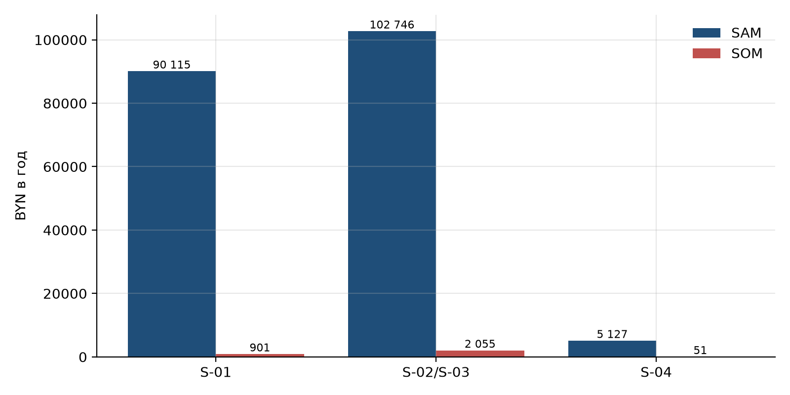

Рисунок 8 – SAM и SOM по сегментам клиентов (ПК-X), BYN в год

Таблица 40 – Лист 05_Similarweb: цифровая проверка (выручка при параметрах NotaCode)

| Сайт | Визиты/мес. | Доля РБ | Визитов из РБ | Релевантные каналы | Коммерческое намерение | Релевантный трафик | CR1 | CR2 | Выручка/год, BYN |
|---|---|---|---|---|---|---|---|---|---|
| PlantUML | 507 000 | 0,196 % | 992,7 | 75 % | 35 % | 260,6 | 2,5 % | 4,0 % | 379 |
| draw.io (diagrams.net) | 7 800 000 | 0,196 % | 15 272,4 | 35 % | 35 % | 1 870,9 | 2,5 % | 4,0 % | 2 720 |
| Eraser | 678 500 | 0,196 % | 1 328,5 | 50 % | 35 % | 232,5 | 2,5 % | 4,0 % | 338 |
| Mermaid Chart | 20 000 | 0,196 % | 39,2 | 70 % | 35 % | 9,6 | 2,5 % | 4,0 % | 14 |
| Итого | 9 005 500 | — | 17 632,8 | — | — | 2 373,5 | — | — | 3 450 |

Конверсии и чек — параметры NotaCode, поэтому значение — выручка, которую получил бы продукт с такой воронкой при этом трафике, а не фактическая выручка конкурентов (бесплатный PlantUML и draw.io выручки с подписки не имеют).

Таблица 41 – Проверка цифровыми данными (ПК табл. 19)

| Проверочный источник | Что проверено | Влияние на расчёт |
|---|---|---|
| Google Trends | Интерес к UML, BPMN, PlantUML, IDEF0 в Беларуси: данные только у 19 недель из 53 | Подтверждает наличие интереса слабо; количественных выводов не даёт |
| Яндекс Вордстат | Частотность коммерческих формулировок: 16 запросов за 30 дней (окно 25.08–23.09.2026) против 170 инструментальных | Ослабляет гипотезу о готовности платить (К4 в нижних диапазонах) |
| Similarweb | Трафик plantuml.com, draw.io и других сайтов; доля Беларуси не показана | Показывает цифровую активность; объём по трафику ниже клиентской оценки |
| Сайты конкурентов | Тарифы 4–20 USD в месяц, бесплатные заменители | Чек 40 USD в год (около 3,3 USD в месяц) лежит у нижней границы тарифов; бесплатные заменители ограничивают готовность платить |
| Пилотное предложение | Не проводилось (продукт не запущен) | модельная оценка (допущение; причина: конверсия Free → Pro при пилоте (табл. 91, п. 12)) |

#### 2.5.1 Расчёт по тексту методики (вариант Word) и попадание значений в шкалы

Таблица 42 – Сценарии по диапазонам К1–К5 (ПК табл. 7; общие доли для всех сегментов)

| Сценарий | К1 | К2 | К3 | К4 | К5 | SAM, BYN/год | SOM, BYN/год | SAM без К1 (базовая формула ПК табл. 3), BYN/год |
|---|---|---|---|---|---|---|---|---|
| Осторожный | 15 % | 10 % | 30 % | 7,5 % | 0,75 % | 15 399 | 115 | 102 661 |
| Базовый | 30 % | 22,5 % | 55 % | 17,5 % | 2 % | 296 435 | 5 929 | 988 115 |
| Оптимистичный | 50 % | 40 % | 80 % | 32,5 % | 5 % | 2 372 618 | 118 631 | 4 745 235 |

Значения — середины диапазонов ПК табл. 7. В методике нумерация К различается: табл. 7 (К1 релевантность … К5 доля) и табл. 21 (К1 потребность, К2 онлайн-доступность, К3 готовность платить) — W-9; в отчёте принята нумерация табл. 7. Формула ПК табл. 3 не содержит К1 (Р-20, W-10); формула B2B табл. 8 (организации × потребность × готовность × годовой чек) для физических лиц не применяется.

Таблица 43 – Попадание значений сценариев ПК-X в диапазоны ПК табл. 7

| Сценарий | Коэффициент | Значение в расчёте | Диапазон методики | Попадает |
|---|---|---|---|---|
| Осторожный | К1 | 29,55 % | 10,0 % – 20,0 % | нет |
| Осторожный | К2 | 16,88 % | 5,0 % – 15,0 % | нет |
| Осторожный | К3 | 44,00 % | 20,0 % – 40,0 % | нет |
| Осторожный | К4 | 8,90 % | 5,0 % – 10,0 % | да |
| Осторожный | К5 | 0,80 % | 0,5 % – 1,0 % | да |
| Базовый | К1 | 29,55 % | 20,0 % – 40,0 % | да |
| Базовый | К2 | 22,50 % | 15,0 % – 30,0 % | да |
| Базовый | К3 | 55,00 % | 40,0 % – 70,0 % | да |
| Базовый | К4 | 11,87 % | 10,0 % – 25,0 % | да |
| Базовый | К5 | 2,00 % | 1,0 % – 3,0 % | да |
| Оптимистичный | К1 | 29,55 % | 40,0 % – 60,0 % | нет |
| Оптимистичный | К2 | 27,00 % | 30,0 % – 50,0 % | нет |
| Оптимистичный | К3 | 63,25 % | 70,0 % – 90,0 % | нет |
| Оптимистичный | К4 | 14,24 % | 25,0 % – 40,0 % | нет |
| Оптимистичный | К5 | 4,00 % | 3,0 % – 7,0 % | да |

Множители сценариев шаблона (0,75 / 0,8 / 0,75 / 0,8 / 0,8 и 1,2 / 1,15 / 1,2 / 1,15 / 1,1) применяются к базовым долям, поэтому осторожные значения К2 и К3 выходят за нижние диапазоны методики, а единая достижимая доля 0,8 / 2 / 4 % попадает в диапазон К5 не во всех сценариях (Р-21). Вывод: сценарии шаблона используются как основные, а диапазоны методики — как контроль.

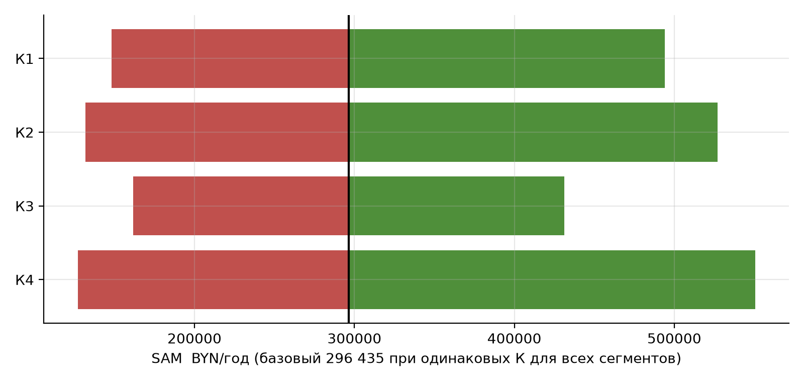

Рисунок 9 – Чувствительность SAM к коэффициентам К1–К4 в диапазонах ПК табл. 7 (зелёный — верхняя граница диапазона, красный — нижняя)

#### 2.5.2 «Снизу вверх» по СВ-X и Similarweb-воронка

Таблица 44 – Лист 03_Снизу_вверх (СВ-X)

| Сегмент | Клиентов в границах | Доля с потребностью и готовностью платить (К2 × К4) | Цифровая доступность (К3) | Покупок в год | Чек, BYN | Годовой объём, BYN | Доля сегмента |
|---|---|---|---|---|---|---|---|
| S-01 Студенты технических и экономических специальностей | 68 700 | 1,97 % | 55 % | 1 | 121,14 | 90 117 | 45,5 % |
| S-02/S-03 Аналитики, архитекторы ПО и разработчики | 39 165 | 3,94 % | 55 % | 1 | 121,14 | 102 747 | 51,9 % |
| S-04 Преподаватели технических дисциплин | 3 420 | 2,25 % | 55 % | 1 | 121,14 | 5 127 | 2,6 % |
| Итого | 111 285 | — | — | — | — | 197 991 | 100 % |

Шаблон не содержит отдельной готовности платить (Р-33), поэтому колонка «доля с потребностью» заполнена произведением К2 × К4. Результат совпадает с SAM ПК-X по построению: обе методики используют одни и те же сегменты и коэффициенты, поэтому согласие этих двух расчётов не является независимой проверкой; независимую проверку дают только расчёты по Similarweb и поисковому спросу (раздел 2.10).

Таблица 45 – Лист 04_Similarweb (СВ-X)

| Домен | Тип | Визиты/мес. | Доля РБ | Доля релевантных каналов | Коммерческая релевантность | Релевантные визиты/мес. | Релевантные визиты/год | Доля |
|---|---|---|---|---|---|---|---|---|
| plantuml.com | Прямой | 507 000 | 0,196 % | 75 % | 35 % | 260,6 | 3 127 | 11,0 % |
| app.diagrams.net | Заменитель | 7 800 000 | 0,196 % | 35 % | 35 % | 1 870,9 | 22 450 | 78,8 % |
| eraser.io | Прямой | 678 500 | 0,196 % | 50 % | 35 % | 232,5 | 2 790 | 9,8 % |
| mermaidchart.com | Прямой | 20 000 | 0,196 % | 70 % | 35 % | 9,6 | 115 | 0,4 % |
| Итого | — | 9 005 500 | — | — | — | 2 373,5 | 28 482 | 100 % |

Таблица 46 – Лист 05_Воронка_SW: воронка на данных Similarweb

| Показатель | Осторожный | Базовый | Оптимистичный |
|---|---|---|---|
| Годовые релевантные визиты конкурентов | 17 089 | 28 482 | 39 875 |
| Корректировка на неполную выборку | 1,15 | 1,15 | 1,15 |
| Скорректированные релевантные визиты | 19 653 | 32 755 | 45 857 |
| Конверсия визита в заявку | 1,75 % | 2,50 % | 3,25 % |
| Оценочное число заявок | 344 | 819 | 1 490 |
| Конверсия заявки в продажу | 3,20 % | 4,00 % | 4,80 % |
| Оценочное число продаж | 11,01 | 33 | 72 |
| Средний годовой чек | 97 | 121 | 145 |
| Коэффициент повторных продаж | 1,08 | 1,20 | 1,32 |
| Оценка годового объема рынка по Similarweb | 1 152 | 4 762 | 13 727 |

Корректировка на неполную выборку 1,15 и множители сценариев (CR1 ×0,7 / ×1 / ×1,3; CR2 и чек ×0,8 / ×1 / ×1,2; повторы ×0,9 / ×1 / ×1,1) скрыты в формулах шаблона (Р-32, Р-36); в методике покрытие задаётся явно: 0,5 / 0,7 / 0,9.

#### 2.5.3 Вариант Word: «снизу вверх» по каналам и подписка

Таблица 47 – Вариант по Word: «снизу вверх» по каналам и для подписного сервиса (СВ табл. 17, 25)

| Формула | Осторожный | Базовый | Оптимистичный |
|---|---|---|---|
| По каналам (ф. 5): посещения РБ × доля Organic 48,47 % × коммерческая доля 20 / 35 / 50 % × CR1 2,5 % × CR2 4 % × чек × 12, BYN/год | 2 485 | 4 348 | 6 212 |
| Подписной сервис (табл. 17): посещения × коммерческая доля × регистрация × оплата (3 / 4 / 5 %) × срок удержания (12 × 1 / 1,2 / 1,5 мес.) × ежемесячный платёж × 12, BYN/год | 3 845 | 10 766 | 24 030 |

В Word три версии формулы «снизу вверх» (W-2, Р-33): клиенты × частота × чек (ПК), трафик × конверсии (СВ), подписка; для NotaCode приведены все три. Канальная оценка использует только показанный канал Organic одного домена и поэтому нижняя.

#### 2.5.4 Итоговые диапазоны СВ-X

Таблица 48 – Лист 06_Сверка (Excel): сопоставление методов на уровне рынка, BYN/год

| Метод | Осторожный | Базовый | Оптимистичный |
|---|---|---|---|
| Сверху вниз | 15 399 | 296 435 | 2 372 618 |
| Снизу вверх | 118 795 | 197 991 | 277 188 |
| Similarweb + воронка | 1 152 | 4 762 | 13 727 |
| Минимум по методам | 1 152 | 4 762 | 13 727 |
| Среднее по методам | 45 115 | 166 396 | 887 844 |
| Максимум по методам | 118 795 | 296 435 | 2 372 618 |

Итог по Excel: нижняя оценка — минимум осторожных сценариев 1 152 BYN, базовая — среднее базовых 166 395 BYN, верхняя — максимум оптимистичных 2 372 618 BYN. Итог по Word (СВ табл. 19): диапазон [минимум осторожных; максимум проверенных базовых и оптимистичных] — от 1 152 до 2 372 618 BYN в год; оба диапазона названы, но расхождение в верхней границе существенно (верхняя граница определяется методом «сверху вниз»).

### 2.6 Цифровая воронка

Воронка не измеряет рынок напрямую, а оценивает достижимый объём по цепочке «охват – посещения – заявки – продажи – чек»; итог — диапазон [14]. Для NotaCode «заявка» — регистрация пользователя (тариф Free), «продажа» — оплата Pro; применяется модель «Подписка» ЦВ табл. 8: платящие пользователи × ежемесячный платёж × срок удержания.

Таблица 49 – Лист 01_Параметры (ЦВ-X): сценарные параметры воронки

| Параметр | Осторожный | Базовый | Оптимистичный | Источник значения |
|---|---|---|---|---|
| Достижимая доля релевантного трафика | 15 % | 25 % | 40 % | значения шаблона (в Word ЦВ отсутствует, Р-10) |
| Конверсия посещение → заявка (регистрация) | 1 % | 2,5 % | 5 % | значения шаблона (пример Word ЦВ табл. 11: 2 / 4 / 6 %) |
| Конверсия заявка → оплата Pro | 3 % | 4 % | 5 % | допущение проекта Free → Pro 3–5 % (пример Word: 20 / 30 / 40 %, шаблон: 15 / 25 / 35 %) |
| Средний чек, BYN за оплату | 121,14 | 121,14 | 290,74 | 40 USD (осторожный и базовый), медиана тарифов конкурентов × 12 |
| Повторных оплат в год (срок удержания) | 1,0 | 1,2 | 1,5 | шкала шаблона (в шаблоне 1 / 2 / 3), допущение |
| Доля релевантного трафика (B12) / коэффициент покрытия (B13) | 0,3846 / 0,65 | — | — | Д-02 / Д-05 |

Значения конверсий шаблона лежат в шкалах Word ЦВ (пример табл. 11) не полностью; шаблон и пример Word различаются (Р-11), поэтому оба служат ориентирами, а значения NotaCode принимаются как допущения проекта.

Таблица 50 – Лист 02_Трафик_охват: каналы привлечения

| Канал | Источник данных | Охват / показы | CTR | Посещения/мес. | Релевантная доля | Релевантные посещения | Качество данных |
|---|---|---|---|---|---|---|---|
| Органический поиск | Яндекс Вордстат (Беларусь), взвешенная частотность ядра, среднее за 12 мес. (см. расчёт ПС) | 327,8 | 0,08 | 26,2 | 100 % | 26,2 | среднее |
| Платный поиск | Google Ads / Яндекс Директ | 0,0 | 0,00 | 0,0 | 0 % | 0,0 | нет данных |
| Социальные сети | Meta Ads / VK / TikTok / статистика страниц | 0,0 | 0,00 | 0,0 | 0 % | 0,0 | нет данных |
| Реферальные площадки | Каталоги / партнеры / платформы | 0,0 | 0,00 | 0,0 | 0 % | 0,0 | нет данных |
| Прямой трафик | Similarweb / Google Analytics | 0,0 | 1,00 | 0,0 | 0 % | 0,0 | нет данных |
| Маркетплейсы услуг | Платформы / каталоги исполнителей | 0,0 | 0,00 | 0,0 | 0 % | 0,0 | нет данных |
| Прочие каналы | Экспертная оценка | 0,0 | 0,00 | 0,0 | 0 % | 0,0 | нет данных |
| Итого | — | — | — | 26,2 | — | 26,2 | — |

Данные есть только по органическому поиску (взвешенная частотность ядра Вордстата × доля переходов 8 %). Платный поиск и социальные сети требуют прогноза в рекламных кабинетах (Яндекс Директ, Google Ads, VK, Meta) — прогноз кабинета недоступен (кабинет Директа пуст), использованы ориентиры CPC и модельная оценка (приложение Е, таблица 97), структура каналов конкурентов – ЛР4, приложение Д; реферальные каналы, прямой трафик и маркетплейсы услуг данных не имеют (продукт не запущен) или неприменимы. Разделение по каналам с собственными конверсиями (ЦВ §8 табл. 7, Р-9) сводится к одному каналу, поэтому вариант Word совпадает с основным при единых конверсиях.

Таблица 51 – Лист 03_Конкуренты_SW: цифровой объём по конкурентам

| Сайт | Тип | Визиты/мес. | Доля РБ (Д-01) | Доля релевантной категории | Релевантные посещения | Конверсия в продажу (CR1 × CR2) | Чек, BYN | Выручка/мес., BYN |
|---|---|---|---|---|---|---|---|---|
| plantuml.com | прямой (текстовый DSL) | 507 000 | 0,196 % | 75 % | 744,5 | 0,10 % | 121,14 | 90,2 |
| app.diagrams.net | заменитель (визуальный редактор) | 7 800 000 | 0,196 % | 35 % | 5 345,3 | 0,10 % | 121,14 | 647,5 |
| eraser.io | прямой (AI + diagram as code) | 678 500 | 0,196 % | 50 % | 664,3 | 0,10 % | 121,14 | 80,5 |
| mermaidchart.com | прямой (текстовый DSL) | 20 000 | 0,196 % | 70 % | 27,4 | 0,10 % | 121,14 | 3,3 |

Таблица 52 – Исправление П-2: деление на коэффициент покрытия

| Показатель | В шаблоне (деление на B12, доля релевантного трафика 0,3846) | В рабочей копии (деление на B13, покрытие 0,65) |
|---|---|---|
| Оценка полного трафика сегмента, визитов/мес. | 17 633 | 10 433 |
| Оценочная выручка сегмента в год, BYN | 25 632 | 15 166 |

Подпись формулы «/ коэффициент покрытия», но в шаблоне делитель — «целевая доля релевантного трафика» B12; в рабочей копии формулы C12 и C14 исправлены на деление на коэффициент покрытия B13 (П-2), оба значения показаны в таблице выше. Выручка сегмента по конкурентному подходу (около 15 166 BYN в год) больше результата воронки поискового канала (9,5 BYN) примерно в 1 592 раз (более трёх порядков), что отражает разницу каналов: конкуренты получают трафик из рекламы, сообщества и прямых заходов, а поиск по ядру запросов Вордстата — малая часть.

Таблица 53 – Лист 04_Воронка: воронка по сценариям

| Показатель | Осторожный | Базовый | Оптимистичный |
|---|---|---|---|
| Релевантные посещения в месяц | 26,22 | 26,22 | 26,22 |
| Достижимая доля трафика | 15,0 % | 25,0 % | 40,0 % |
| Достижимые посещения в месяц | 3,9330 | 6,5550 | 10,49 |
| Конверсия посещение → заявка | 1,0 % | 2,5 % | 5,0 % |
| Заявки в месяц | 0,0393 | 0,1639 | 0,5244 |
| Конверсия заявка → продажа | 3,0 % | 4,0 % | 5,0 % |
| Продажи в месяц | 0,0012 | 0,0066 | 0,0262 |
| Средний чек | 121,14 | 121,14 | 290,74 |
| Выручка в месяц | 0,1429 | 0,7941 | 7,6232 |
| Выручка в год | 1,7152 | 9,5289 | 91,48 |

Таблица 54 – Лист 06_Повторы_LTV: годовая выручка с учётом повторных оплат

| Сценарий | Продаж/мес. | Чек, BYN | Повторов в год | Выручка/год с повторами, BYN | Ценность клиента за год, BYN |
|---|---|---|---|---|---|
| Осторожный | 0,0012 | 121,14 | 1,0 | 1,7 | 121,14 |
| Базовый | 0,0066 | 121,14 | 1,2 | 11,4 | 145,37 |
| Оптимистичный | 0,0262 | 290,74 | 1,5 | 137,2 | 436,11 |

Выручка без повторов (лист 04) и с повторами (лист 06) — две разные величины (Р-12); в выводе названы обе: без повторов 1,7 / 9,5 / 91,5 BYN, с повторами 1,7 / 11,4 / 137,2 BYN в год.

Таблица 55 – Вариант по Word: модель «Подписка» и отказ от долей (Р-9, Р-10)

| Вариант | Осторожный | Базовый | Оптимистичный |
|---|---|---|---|
| Excel: достижимая доля 15 / 25 / 40 %, выручка без повторов, BYN/год | 1,7 | 9,5 | 91,5 |
| Word (Р-10): Visits = Reach × CTR, достижимая доля = 1, BYN/год | 11,4 | 38,1 | 228,7 |
| Word, ЦВ табл. 8: платящие × платёж 10,10 BYN × срок удержания (12 × 1 / 1,2 / 1,5 мес.), BYN/год | 1,7 | 11,4 | 57,2 |

При одном канале вариант Word без долей лишь отменяет сценарное сужение шаблона; подписочная модель даёт тот же порядок величины, что и шаблон с повторами (различие в чеке: в подписочной формуле ежемесячный платёж одинаков во всех сценариях). Листы GMV (ЦВ-X 07) заполнены нулями с пометкой «не применяется — NotaCode не является многосторонней платформой».

Итог воронки ЦВ-X: годовая выручка 1,7 – 91,5 BYN (базовая 9,5 BYN), с повторами в базовом сценарии 11,4 BYN. Малая величина вызвана тем, что единственный измеренный канал — органический поиск по ядру запросов в Вордстате (около 26 посещений в месяц). Вывод: воронка не является ограничением ёмкости рынка; она показывает отсутствие измеренного канала привлечения (правило ИНСТР §11: малый объём при большом рынке указывает на канал, а не на ёмкость).

Таблица 56 – Рабочий паспорт воронки (ЦВ табл. 16)

| Поле | Содержание |
|---|---|
| Название бизнес-идеи | NotaCode — веб-IDE для построения и проверки диаграмм формальных нотаций как текста |
| Зафиксированный рынок | Веб-инструменты диаграмм формальных нотаций; студенты, аналитики, архитекторы ПО, преподаватели; Республика Беларусь |
| Тип бизнес-модели | подписка (freemium Free / Pro) |
| Ключевые каналы | органический поиск (измерен); платный поиск, социальные сети, партнёрства – оценены по приложению Е (таблица 97) и структуре каналов конкурентов (ЛР4, приложение Д); реальные ставки кабинета – модельная оценка (допущение) |
| Основное целевое действие | регистрация (Free) → оплата Pro |
| Период расчёта | год |
| Осторожный сценарий | 1,7 BYN в год |
| Базовый сценарий | 9,5 BYN в год (с повторами 11,4) |
| Оптимистичный сценарий | 91,5 BYN в год |
| Основные ограничения | один измеренный канал; конверсии — допущения; сезонность не учтена в множителе ×12 |
| Следующий шаг | прогноз в рекламных кабинетах, пилотная кампания, уточнение чека опросом |

### 2.7 Маркетплейсы и платформы

NotaCode относится к типу «приложение или сервис» (МП табл. 2): оценка рынка цифровых подписок и приложений строится по установкам, рейтингу, отзывам и платным планам [15]. Открытые данные собраны в каталогах расширений редакторов кода (Visual Studio Marketplace [16], JetBrains Marketplace [17]), каталогах программного обеспечения с отзывами [18] и по косвенным индикаторам (GitHub [19], npm [20]). Все значения получены 30.09.2026; G2 отдал ошибку доступа (403), Chrome Web Store перенаправил на страницу согласия — защита не обходилась, значения отмечены «нет данных».

Таблица 57 – Таблица сбора по площадкам (МП табл. 12)

| Площадка | Категория | География | Единица наблюдения | Предложений | Активных продавцов | Средняя цена | Отзывы / оценки | Оценка заказов | Источник |
|---|---|---|---|---|---|---|---|---|---|
| Visual Studio Marketplace | Расширения для диаграмм (PlantUML, Mermaid, draw.io, BPMN, ERD) | весь мир | установки (20 029 493) | 102 расширений | нет данных | бесплатно (цены в API нет) | 700 оценок | не применима (см. таблицу 60) | [16] |
| JetBrains Marketplace | Плагины для диаграмм (13 плагинов) | весь мир | загрузки (9 267 906) | 13 плагинов | нет данных | FREE / FREEMIUM / PAID; сумма не публикуется | 327 оценок | не применима | [17] |
| Capterra (Lucidchart, Miro, draw.io, Creately, Whimsical, Visual Paradigm) | Редакторы диаграмм и досок | весь мир | отзывы | 6 продуктов | нет данных | от 4 до 20 USD в месяц; draw.io бесплатно | 5 036 отзывов | по отзывам: таблица 61 | [18] |
| Atlassian Marketplace (draw.io Diagrams) | Диаграммы для Confluence и Jira | весь мир | установки (61 555) | 1 продукт | нет данных | платно через Atlassian | 1 205 отзывов, оценка 4,8 | не применима | данные поиска по каталогу |
| G2, Chrome Web Store | — | — | — | — | — | — | нет данных: доступ закрыт (30.09.2026) | — | — |

Таблица 58 – Visual Studio Marketplace: восемь расширений с наибольшим числом установок

| Расширение | Установки | Оценок | Средняя оценка | Оценок на установку |
|---|---|---|---|---|
| Markdown Preview Mermaid Support | 5 342 719 | 60 | 4,62 | 0,0011 % |
| Draw.io Integration | 4 173 397 | 161 | 4,91 | 0,0039 % |
| PlantUML | 3 712 111 | 105 | 4,72 | 0,0028 % |
| Mermaid | 1 103 663 | 40 | 2,88 | 0,0036 % |
| Mermaid Preview | 873 949 | 27 | 2,96 | 0,0031 % |
| Mermaid Markdown Syntax Highlighting | 832 703 | 19 | 4,32 | 0,0023 % |
| Excalidraw | 555 672 | 33 | 4,94 | 0,0059 % |
| PlantUML Previewer | 304 035 | 9 | 2,56 | 0,0030 % |

Оценки оставляют от 0,001 % до 0,006 % установивших.

Таблица 59 – JetBrains Marketplace: плагины с наибольшим числом загрузок

| Плагин | Загрузки | Оценок | Средняя оценка | Цена |
|---|---|---|---|---|
| plantuml4idea | 5 014 362 | 102 | 4,63 | бесплатно |
| Mermaid | 1 662 818 | 65 | 2,96 | бесплатно |
| SequenceDiagram Core | 1 565 628 | 57 | 4,36 | да, freemium (пробный период по purchaseInfo) |
| Diagrams.net Integration | 485 573 | 48 | 4,1 | бесплатно |
| Activiti BPMN visualizer | 192 572 | 11 | 4,17 | бесплатно |
| Flowable BPMN visualizer | 110 007 | 2 | 4,31 | бесплатно |
| Mermaid Chart | 50 284 | 10 | 2,51 | бесплатно |
| Excalidraw Integration | 47 327 | 16 | 3,79 | бесплатно |

Платный плагин Mermaid Studio (14 186 загрузок, пробный период 30 дней) — единственный полностью платный продукт среди найденных плагинов (остальные платные — условно бесплатные с пробным периодом); цена в программном интерфейсе не публикуется (модельная оценка (допущение; причина: цена на странице плагина в plugins.jetbrains.com, табл. 91, п. 9)). По данным каталога категория расширений почти полностью бесплатная, а платные продукты — редкие.

Таблица 60 – Проверка коэффициента отзывов МП (табл. 6, 13)

| Показатель | Значение |
|---|---|
| Коэффициент оставляющих отзыв по МП (осторожный / базовый / оптимистичный) | 10 % / 5 % / 2 % |
| Наблюдаемая доля оценок среди установок, медиана по расширениям VS Code (n = 25) | 0,0059 % |
| Отношение шкалы МП (2 %) к наблюдаемому значению | 337 раз |
| Вывод | Модель «продажи = отзывы / коэффициент отзывов» на расширениях редакторов кода неприменима: установки бесплатны, оценки почти не оставляются. Модель применима к платным продуктам в каталогах ПО с отзывами. |

Таблица 61 – Модель «через отзывы» для платных продуктов каталога Capterra (мир)

| Продукт | Отзывов | Входной тариф, USD/мес. | Клиентов (10 %) | Клиентов (5 %) | Клиентов (2 %) | Объём, млн BYN/год (10 %) | (5 %) | (2 %) |
|---|---|---|---|---|---|---|---|---|
| Lucidchart | 2 264 | 9 | 22 640 | 45 280 | 113 200 | 7,41 | 14,81 | 37,03 |
| Miro | 1 705 | 8 | 17 050 | 34 100 | 85 250 | 4,96 | 9,91 | 24,79 |
| Creately | 216 | 5 | 2 160 | 4 320 | 10 800 | 0,39 | 0,78 | 1,96 |
| Whimsical | 59 | 10 | 590 | 1 180 | 2 950 | 0,21 | 0,43 | 1,07 |
| Visual Paradigm | 19 | 4 | 190 | 380 | 950 | 0,03 | 0,06 | 0,14 |
| Итого | 4 263 | — | — | — | — | 13,00 | 25,99 | 64,98 |

Объём = клиенты × входной годовой тариф (USD × 12 × курс НБРБ). Расчёт — мировой порядок величины для пяти продуктов, к Беларуси не привязан: доля Беларуси в клиентах этих продуктов данными не подтверждена (модельная оценка (допущение; причина: Similarweb, доли стран по доменам пяти продуктов, табл. 91, п. 1)). Осторожный сценарий с коэффициентом отзывов 10 % даёт меньшее число клиентов (W-17). Число отзывов на Capterra снято через обработку страниц каталога и подлежит ручной сверке.

Таблица 62 – Проверка надёжности (МП табл. 15)

| Проверка | Результат |
|---|---|
| Сопоставление с поисковым спросом | Установки и отзывы сопоставимы по рейтингу с частотой запросов Вордстата: PlantUML лидирует среди нотационных инструментов кода (198 запросов в РБ; 3,7 млн установок VS Code и 5,0 млн загрузок JetBrains). |
| Сопоставление с Similarweb | Трафик plantuml.com (507 тыс. визитов в месяц) и установки плагинов одного порядка внимания; прямое сопоставление объёмов невозможно (установки не равны выручке). |
| Сопоставление с ценами конкурентов | Платные планы конкурентов — 4–20 USD в месяц; медиана входных тарифов 8 USD; бесплатные заменители (draw.io, PlantUML, Mermaid) ограничивают готовность платить. |
| «Через отзывы» против «через трафик» | Мировая оценка по отзывам (десятки млн BYN в год) и белорусская оценка по трафику (десятки тыс. BYN в год) различаются на три порядка; различие объясняется географией (мир против Беларуси) и конверсией, а не ошибкой расчёта. |

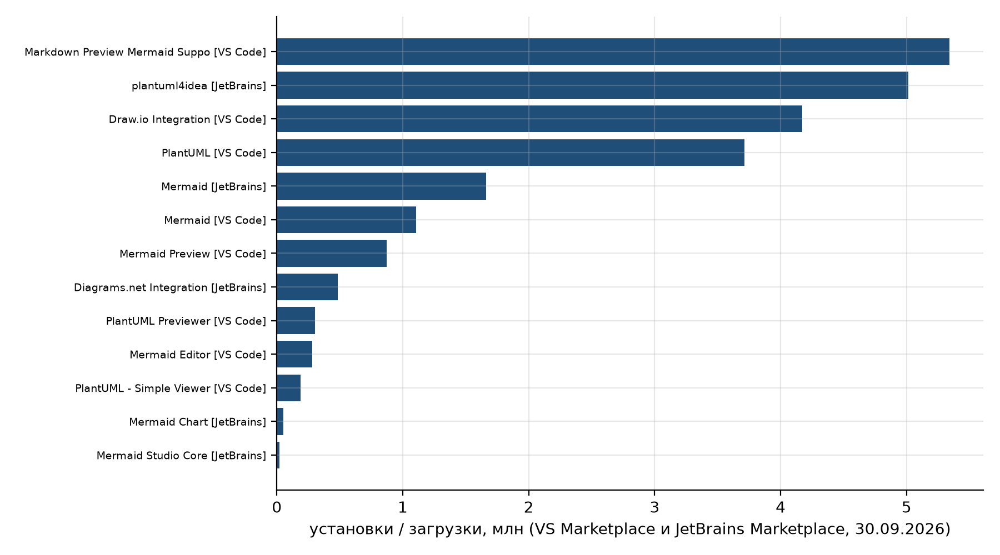

Рисунок 10 – Установки расширений VS Code и загрузки плагинов JetBrains (30.09.2026)

Косвенные индикаторы адопции (не выручка): звёзды GitHub — mermaid 90 483, plantuml 13 344, drawio 8 484, bpmn-js 9 675, excalidraw 133 265; загрузки npm за 30 дней — mermaid 64,3 млн, @excalidraw/excalidraw 2,2 млн, bpmn-js 971 тыс., plantuml-encoder 737 тыс. Итог по МП: категория инструментов «diagram as code» имеет массовую бесплатную адопцию и очень малую долю платных продуктов; платные планы есть у Lucidchart, Miro, Mermaid Chart, Visual Paradigm Online, Eraser, Whimsical и dbdiagram.io. Объём платного рынка по каталогам — порядка десятков млн BYN в год в мировом масштабе; переносить на Беларусь без данных о географии клиентов нельзя.

### 2.8 Сценарная оценка с данными Similarweb

Similarweb — источник оценочных данных, а не измеритель рынка; итог — три сценария [21]. Выборка та же (четыре домена), период «последние 3 месяца» принят за месячное значение.

Таблица 63 – Лист 01_Параметры (СЦ-X): сценарные параметры

| Параметр | Осторожный | Базовый | Оптимистичный |
|---|---|---|---|
| Охват неучтенных конкурентов | 1,100 | 1,350 | 1,800 |
| Коэффициент надежности данных | 0,750 | 0,900 | 1,000 |
| Корректировка на недоступный спрос | 0,800 | 1,000 | 1,150 |
| Конверсия визит → заявка | 0,005 | 0,015 | 0,030 |
| Конверсия заявка → продажа | 0,030 | 0,040 | 0,050 |
| Множитель среднего чека | 0,800 | 1,000 | 1,250 |
| Покупок в год | 1,000 | 1,000 | 1,000 |
| Достижимая доля рынка | 0,005 | 0,015 | 0,040 |

Охват неучтённых конкурентов (1,1 / 1,35 / 1,8), надёжность данных (0,75 / 0,9 / 1) и недоступный спрос (0,8 / 1 / 1,15) — значения шаблона (Р-24). Конверсия в оплату — допущение проекта; чек — множитель 0,8 / 1 / 1,25 к 121,14 BYN. Покупок в год — 1 (годовой тариф; для помесячного Pro — 12 оплат по 10,10 BYN, результат тот же).

Таблица 64 – Лист 02_Similarweb (СЦ-X): релевантный трафик конкурентов

| Домен | Тип | Визиты/мес. | Доля РБ | Доля релевантного | Коэф. качества | Релевантные визиты/мес. | Релевантные визиты/год | Доля |
|---|---|---|---|---|---|---|---|---|
| plantuml.com | прямой (текстовый DSL) | 507 000 | 0,196 % | 75 % | 1,00 | 744,5 | 8 934 | 12,1 % |
| app.diagrams.net | заменитель (визуальный редактор) | 7 800 000 | 0,196 % | 35 % | 0,90 | 4 810,8 | 57 730 | 77,9 % |
| eraser.io | прямой (AI + diagram as code) | 678 500 | 0,196 % | 50 % | 0,90 | 597,8 | 7 174 | 9,7 % |
| mermaidchart.com | прямой (текстовый DSL) | 20 000 | 0,196 % | 70 % | 0,75 | 20,6 | 247 | 0,3 % |
| Итого | — | — | — | — | — | 6 173,7 | 74 085 | 100 % |

Выборка — четыре домена (Word СЦ: 5–15 сайтов, шаблон: «не менее 3–5» — Р-28); при выборке менее пяти вывод предварительный.

Таблица 65 – Лист 03_Сценарии: оценка рыночного трафика

| Сценарий | Охват неучтённых | Надёжность | Недоступный спрос | Релевантный трафик конкурентов/мес. | Трафик рынка/мес. | Трафик рынка/год | Нижняя (−15 %) | Верхняя (+15 %) |
|---|---|---|---|---|---|---|---|---|
| Осторожный | 1,10 | 0,75 | 0,80 | 6 173,7 | 4 074,7 | 48 896 | 41 561 | 56 230 |
| Базовый | 1,35 | 0,90 | 1,00 | 6 173,7 | 7 501,1 | 90 013 | 76 511 | 103 515 |
| Оптимистичный | 1,80 | 1,00 | 1,15 | 6 173,7 | 12 779,6 | 153 355 | 130 352 | 176 359 |

Таблица 66 – Лист 04_Воронка: рыночная и достижимая выручка

| Сценарий | Визитов/год | CR1 | CR2 | Продаж/год | Чек, BYN | Покупок/год | Выручка рынка/год, BYN | Достижимая доля | Достижимая выручка/год, BYN |
|---|---|---|---|---|---|---|---|---|---|
| Осторожный | 48 896 | 0,5 % | 3 % | 7,33 | 96,91 | 1 | 711 | 0,5 % | 3,6 |
| Базовый | 90 013 | 1,5 % | 4 % | 54,01 | 121,14 | 1 | 6 542 | 1,5 % | 98,1 |
| Оптимистичный | 153 355 | 3,0 % | 5 % | 230,03 | 151,43 | 1 | 34 833 | 4,0 % | 1 393,3 |

Платформенный лист СЦ-X 05 не применяется (В-3): NotaCode не является платформой; GMV и выручка платформы в сверку не включаются.

Таблица 67 – Лист 06_Сверка: сопоставление на уровне SOM (достижимая выручка, BYN/год)

| Метод | Осторожный | Базовый | Оптимистичный |
|---|---|---|---|
| Similarweb → цифровая воронка | 4 | 98 | 1 393 |
| Similarweb → платформенная GMV-модель | — | — | — |
| Поисковый спрос | 11 | 73 | 720 |
| Количество потенциальных клиентов | 456 | 3 960 | 16 590 |
| Сверху вниз / снизу вверх | — | — | — |
| Минимум по методам | 4 | 73 | 720 |
| Среднее по методам | 157 | 1 377 | 6 235 |
| Максимум по методам | 456 | 3 960 | 16 590 |
| Рекомендуемый диапазон | 4 – 456 | 73 – 3 960 | 720 – 16 590 |

Исправления шаблона: демонстрационные числа трёх методов заменены собственными результатами того же уровня (П-9): строка ПС-X (выручка поискового канала) и строка ПК-X (SOM); строка платформы исключена; строка «Сверху вниз / снизу вверх» оставлена пустой, так как эти методы дают уровень рынка, а не SOM; текстовая запись диапазона переписана через TEXT() (П-8).

Таблица 68 – Вариант по Word (СЦ §5–6): деление на коэффициент покрытия

| Показатель | Осторожный | Базовый | Оптимистичный |
|---|---|---|---|
| Полный трафик = релевантный / покрытие (40–50 / 55–70 / 75–90 %; середины 45 / 62,5 / 82,5 %), визитов/год | 117 552 | 152 347 | 173 122 |
| CR1 по шкале Word (0,3–0,8 / 1–2,5 / 3–5 %; середины) | 0,55 % | 1,75 % | 4 % |
| Объём рынка, BYN/год (CR2 проекта, чек 121,14 × 1) | 2 350 | 12 919 | 41 944 |
| Достижимая выручка (доли 0,5 / 1,5 / 4 %), BYN/год | 11,7 | 193,8 | 1 677,8 |
| Excel: объём рынка, BYN/год | 711 | 6 542 | 34 833 |
| Excel: достижимая выручка, BYN/год | 3,6 | 98,1 | 1 393,3 |

Направление влияния противоположно: по Word полный трафик убывает от осторожного сценария к оптимистичному (выше покрытие – меньше недоучтённого трафика), по Excel множители охвата (1,1 / 1,35 / 1,8) растут (Р-24). Коэффициенты качества данных и недоступного спроса, а также границы ±15 % существуют только в Excel (Р-25, Р-26) и в варианте Word не применяются. CR2 и частота взяты из проекта (Р-27): для помесячного Pro — 12 оплат в год.

Итог СЦ-X: рынок по трафику Similarweb оценивается в 711 – 34 833 BYN в год (базовый 6 542), достижимая выручка — 3,6 – 1 393 BYN в год (базовая 98). Оценка по методике Word: рынок 2 350 – 41 944 BYN, достижимая выручка 11,7 – 1 678 BYN в год.

### 2.9 Проверка через платёжеспособность

Платёжеспособный спрос возникает при четырёх условиях одновременно: у клиента есть проблема, он признаёт ценность решения, имеет финансовую возможность и ожидает, что эффект оправдает затраты [22]. Интерес, выраженный информационными запросами («скачать», «бесплатно», «пример»), платёжеспособным спросом не считается. По данным Вордстата информационные и инструментальные запросы NotaCode составляют подавляющее большинство; среди 170 инструментальных формулировок преобладают «онлайн» и «скачать», то есть поиск бесплатного инструмента.

Таблица 69 – Лист 02_Сегменты (ПЛ-X): платёжеспособные клиенты и объём

| Сегмент | Клиентов в границах | Доля с потребностью | Доля готовых покупать онлайн | Доля платёжеспособных | Покупок/год | Чек, BYN | Платёжеспособные клиенты | Годовое число покупок | Объём, BYN/год |
|---|---|---|---|---|---|---|---|---|---|
| S-01 | 68 700 | 22,5 % | 55 % | 8,75 % | 1 | 121,14 | 743,9 | 743,9 | 90 115 |
| S-02/S-03 | 39 165 | 22,5 % | 55 % | 17,50 % | 1 | 121,14 | 848,2 | 848,2 | 102 747 |
| S-04 | 3 420 | 22,5 % | 55 % | 10,00 % | 1 | 121,14 | 42,3 | 42,3 | 5 127 |
| Итого | 111 285 | — | — | — | — | — | 1 634,4 | 1 634,4 | 197 989 |

Число клиентов в границах и доли совпадают с ПК-X (К1, К2, К3, К4), поэтому объём ПЛ-X равен SAM ПК-X (197 988 BYN в год). Годовой чек 40 USD в обоих листах 02 и 05 (В-5, В-11, П-4).

Таблица 70 – Лист 03_Ценовой_коридор: платные тарифы конкурентов, BYN в месяц (оплата за год)

| Продукт | Минимальная цена | Медианная цена | Максимальная цена |
|---|---|---|---|
| Miro | 24,23 | 42,40 | 60,57 |
| Lucidchart | 27,26 | 28,77 | 30,29 |
| Mermaid Chart | 30,29 | 45,43 | 60,57 |
| Visual Paradigm Online | 12,11 | 36,34 | 90,86 |
| Creately | 15,14 | 15,14 | 269,54 |
| Eraser | 45,43 | 90,86 | 136,28 |
| Whimsical | 30,29 | 45,43 | 60,57 |
| dbdiagram.io | 24,23 | 24,23 | 24,23 |
| Среднее по продуктам | 26,12 | 41,08 | 91,61 |
| NotaCode Pro (40 USD в год) | — | 10,10 | — |
| draw.io, PlantUML (цена заменителя) | 0 | 0 | 0 |

Тарифы сняты на официальных страницах 30.09.2026 [23, 24, 25, 26, 27, 28, 29, 30]; USD переведены по курсу 3,0285. Microsoft Visio: 5 и 15 USD в месяц за пользователя [31]. Себестоимость у конкурентов не публикуется — валовая маржа «нет данных»; индекс доступности цены в шаблоне всегда равен 1 (П-3) и не используется. Цена NotaCode Pro (10,10 BYN в месяц при годовой оплате) ниже среднего значения медиан коридора (41,08 BYN), но заменители бесплатны.

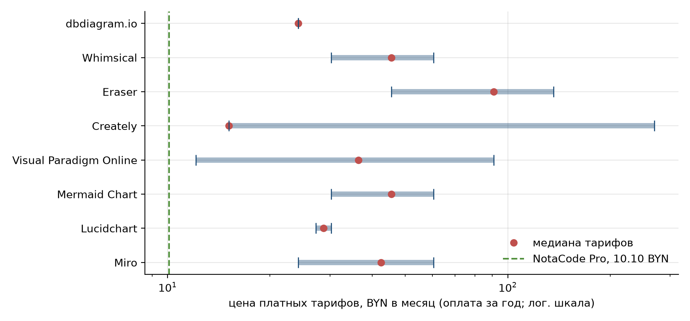

Рисунок 11 – Ценовой коридор платных тарифов конкурентов и цена NotaCode Pro, BYN в месяц

Таблица 71 – Лист 04_Экономика_покупки: экономическая оправданность (ROI за год)

| Сегмент | Доход клиента, BYN/мес. | Доля сэкономленного времени | Эффект, BYN/мес. | Цена, BYN/мес. | Окупаемость, мес. | ROI за год | Статус |
|---|---|---|---|---|---|---|---|
| S-01 | 298,68 | 0,0000 | 0,00 | 10,10 | — | −1,00 | экономически слабо |
| S-02/S-03 | 6 413,00 | 0,0179 | 114,52 | 10,10 | 0,088 | 10,34 | экономически оправдано |
| S-04 | 3 172,00 | 0,0179 | 56,64 | 10,10 | 0,178 | 4,61 | экономически оправдано |

Доход сегмента: стипендия БГУИР для ИКТ-специальностей (229,75–367,60 BYN, середина 298,68; таблица БГУИР [32] с 01.08.2026; прежний диапазон 224,66–342,34 BYN по вторичному источнику [33] заменён, доля цены в стипендии 3,38 % вместо 3,56 %), средняя заработная плата «информация и связь» в июле 2026 года (6 413 BYN; Белстат [34]), средняя заработная плата по республике (3 172,0 BYN [35]) для преподавателей. Эффект — доход × доля сэкономленного времени (3 часа из 168 в месяц; допущение Д-07, модельная оценка (допущение; причина: опрос студентов и преподавателей, табл. 91)); у студента денежного эффекта нет. Маржинальность принята 1,0 (трудовой доход).

Таблица 72 – Лист 05_Платежеспособность: индекс платёжеспособности

| Сегмент | Бюджет, BYN/мес. (5 % дохода) | Цена, BYN/мес. | Индекс (бюджет / цена) | Статус | Доля с бюджетом | Платёжеспособные (лист 05) | Объём листа 05, BYN/год |
|---|---|---|---|---|---|---|---|
| S-01 | 14,93 | 10,10 | 1,48 | достаточная | 8,75 % | 6 011 | 728 203 |
| S-02/S-03 | 320,65 | 10,10 | 31,76 | высокая | 17,50 % | 6 854 | 830 278 |
| S-04 | 158,60 | 10,10 | 15,71 | высокая | 10,00 % | 342 | 41 430 |

Доля дохода на подписки (5 %) — допущение Д-08 (сгенерированный опрос 30 респондентов, ЛР5, приложение В: заявленная готовность платить 70 %, после калибровки 7 % (ЛР7, приложение 10), что не противоречит допущению 5 %; реальный опрос – модельная оценка (допущение)). Лист 05 шаблона считает платёжеспособных как клиенты × доля и игнорирует доли потребности и онлайн-готовности листа 02 (П-4); поэтому объём листа 05 (1 599 911 BYN) несопоставим с листом 02 (197 988 BYN) и в выводах не используется.

Таблица 73 – Чувствительность индекса платёжеспособности к доле дохода на подписки (допущение Д-08)

| Сегмент | 3 % дохода | 5 % дохода | 10 % дохода |
|---|---|---|---|
| S-01 | 0,89 | 1,48 | 2,96 |
| S-02/S-03 | 19,06 | 31,76 | 63,53 |
| S-04 | 9,43 | 15,71 | 31,42 |

Индекс ≥ 1,5 — «высокая», ≥ 1 — «достаточная», ≥ 0,7 — «пограничная», ниже — «низкая». Для студентов при 3 % дохода индекс 0,70 — «пограничная»: платёжеспособность студентов определяется допущением и подлежит проверке опросом.

Таблица 74 – Лист 06_Сценарии: платёжеспособный рынок и достижимая выручка, BYN/год

| Сценарий | Рынок | Достижимая выручка |
|---|---|---|
| Осторожный | 49 893 | 249 |
| Базовый | 197 989 | 2 970 |
| Оптимистичный | 409 837 | 14 344 |

Множители шаблона: потребность 0,7 / 1 / 1,2; платёжеспособность 0,6 / 1 / 1,25; частота 0,75 / 1 / 1,15; чек 0,8 / 1 / 1,2; достижимая доля 0,5 / 1,5 / 3,5 %.

#### 2.9.1 Расчёт по тексту методики (вариант Word)

Таблица 75 – Рабочие таблицы ПЛ §15–§17 и допустимый чек (Р-13 … Р-16)

| Сегмент | Платёжеспособные клиенты, 4 коэффициента | Доля цены в месячном доходе | Коэффициент оправданности (эффект / цена) | Шкала ПЛ табл. 11 | Допустимый чек = min(коридор; бюджет; обоснованная цена), BYN/мес. |
|---|---|---|---|---|---|
| S-01 | 743,9 | 3,38 % | 0,00 | меньше 1: слабо обоснована | 0,00 |
| S-02/S-03 | 848,2 | 0,16 % | 11,34 | больше 5: высокий эффект | 41,08 |
| S-04 | 42,3 | 0,32 % | 5,61 | больше 5: высокий эффект | 41,08 |

Word разделяет финансовую возможность и готовность платить (Р-13): для NotaCode цена 10,10 BYN в месяц (40 USD в год) составляет 3,4 % месячной стипендии и 0,16 % зарплаты специалиста (при 48 USD в год — 4,3 % и 0,19 %), поэтому доступность цены не ограничивает покупку, а ограничением служит готовность платить (К4); произведение четырёх коэффициентов равно результату трёх коэффициентов Excel. Коэффициент оправданности равен ROI + 1 (Р-14): у специалистов 11,34 (более 5 — премиальный тариф возможен), у преподавателей 5,61 (более 5 — высокий эффект), у студентов 0 (эффект неденежный); при 48 USD в год — 9,45 и 4,68 (у преподавателей — диапазон 2–5, разумная покупка). Допустимый чек студента равен нулю, то есть для сегмента S-01 платный тариф не обоснован экономически — это согласуется с тарифом Free для студентов. Для B2C показатели «порог массовости» и «ценовая чувствительность» требуют опроса (сгенерированный опрос 30 респондентов, ЛР5, приложение В: заявленная готовность платить 70 %, после калибровки 7 % (ЛР7, приложение 10), что не противоречит допущению 5 %; реальный опрос – модельная оценка (допущение)).

#### 2.9.2 Цифровая проверка и вывод

Таблица 76 – Лист 07_Similarweb (ПЛ-X): косвенная проверка цифровой активности

| Сайт | Визиты/мес. | Доля РБ | Релевантный трафик (РБ) | Доля поискового трафика | Конверсия H (CR1 × CR2) | Заявок/мес. | Выручка/мес., BYN |
|---|---|---|---|---|---|---|---|
| plantuml.com | 507 000 | 0,196 % | 992,7 | 48,5 % | 0,10 % | 0,99 | 120,3 |
| app.diagrams.net | 7 800 000 | 0,196 % | 15 272,4 | 42,0 % | 0,10 % | 15,27 | 1 850,1 |
| eraser.io | 678 500 | 0,196 % | 1 328,5 | 35,0 % | 0,10 % | 1,33 | 160,9 |
| mermaidchart.com | 20 000 | 0,196 % | 39,2 | нет данных | 0,10 % | 0,04 | 4,7 |

Доля прямого трафика и соцсетей бесплатной карточкой не показана; в шаблоне для оценки использована конверсия в оплату CR1 × CR2 (отдельной конверсии в оплату лист не предусматривает).

Вывод по шаблону ПЛ §18 (осторожный): проверка показывает наличие интереса к направлению, однако платёжеспособность аудитории неоднородна. Специалисты (аналитики, архитекторы и разработчики) имеют бюджет и экономическую мотивацию (индекс платёжеспособности 26,5; коэффициент оправданности 9,5), но их доля в клиентской базе невелика, а готовность платить подтверждена только проектным допущением 3–5 %. Студенты — основной по численности сегмент — имеют ограниченный бюджет и бесплатные заменители (draw.io, PlantUML, Mermaid); экономической обоснованности платного тарифа для них нет. Дальнейший анализ должен сосредоточиться на платёжеспособных профессиональных сегментах, проверке цены опросом и тестировании готовности платить. Автоматический вывод шаблона («платёжеспособность достаточная», средний индекс 16,3) учитывает только бюджет и цену и потому мягче, чем вывод по трём шаблонам методики (Р-17, Р-18).

### 2.10 Сводная матрица, сверка методов и итоговый вывод

#### 2.10.1 Сводная матрица результатов

Таблица 77 – Сводная матрица результатов (ИНСТР табл. 14)

| Блок | Что заполнено | Как используется в итоговом выводе | Раздел |
|---|---|---|---|
| Границы рынка | Продукт, клиент (пользователь), Беларусь, каналы, заменители, исключения | Определяют, к чему относятся расчёты | 2.1 |
| Поисковый интерес | Вордстат: uml 591, bpmn 476, plantuml 198, idef0 105 запросов за 30 дней (Топы, окно 25.08–23.09.2026); 16 коммерческих, 87 проблемных, 170 инструментальных формулировок | Подтверждает цифровое внимание, но преимущественно информационное | 2.2 |
| Динамика | Сезонность (учебный год); снижение за год: uml −42,7 %, bpmn −44,1 %; GT по Беларуси малоинформативен (19 ненулевых недель из 53) | Интерес устойчив по сезонам, но снижается | 2.2 |
| Similarweb | 4 домена; 9,0 млн визитов в месяц; доля РБ — допущение; CR3 99,8 %, HHI 7 590 (6 430 с учётом релевантной доли) | Показывает цифровое поле и его концентрацию у draw.io | 2.3 |
| Расчёт сверху вниз | Excel: 15 399 / 296 435 / 2 372 618 BYN/год; Word от трафика: 51 265 / 36 618 / 28 480 BYN/год | Внешний ориентир (верхний предел) | 2.4 |
| Расчёт снизу вверх | СВ-X и ПК-X: SAM 57 021 / 197 988 / 414 754 BYN/год; платящих около 1 634 | Реалистичная оценка через клиентскую базу | 2.5 |
| Цифровая воронка | Поисковый канал 1,7 / 9,5 / 91,5 BYN/год; Similarweb-воронка СВ-X 1 152 / 4 762 / 13 727 BYN/год | Достижимая выручка измеренных каналов | 2.6, 2.3 |
| Платформенная модель | Не применяется: NotaCode не многосторонняя платформа; МП — каталоги расширений: массовая бесплатная адопция | Контекст платных и бесплатных заменителей | 2.7 |
| Платёжеспособность | Индексы бюджета/цены: студенты 1,48, специалисты 31,8, преподаватели 15,7; ROI специалистов 10,3 | Цена приемлема для специалистов; у студентов готовность платить не подтверждена | 2.9 |
| Сценарии | Осторожный, базовый, оптимистичный во всех методиках | Итог диапазоном | 2.10 |

#### 2.10.2 Сводка по методам

Таблица 78 – Сводка методов на уровне рынка (SAM), BYN в год

| Метод | Осторожный | Базовый | Оптимистичный | Уровень | Вариант |
|---|---|---|---|---|---|
| ПК-X (SAM, TAM/SAM/SOM) | 57 021 | 197 988 | 414 754 | рынок | Excel |
| ПК-X, диапазоны К1–К5 (SAM) | 15 399 | 296 435 | 2 372 618 | рынок | Word |
| ПЛ-X (платёжеспособный рынок) | 49 893 | 197 989 | 409 837 | рынок | Excel |
| СВ-X «сверху вниз» (от клиентов) | 15 399 | 296 435 | 2 372 618 | рынок | Excel |
| СВ «сверху вниз» от трафика, ф. 1–4 | 51 265 | 36 618 | 28 480 | рынок | Word |
| СВ-X «снизу вверх» (сегменты) | 118 793 | 197 989 | 277 185 | рынок | Excel |
| СВ «снизу вверх» по каналам, ф. 5 (только Organic) | 2 485 | 4 348 | 6 212 | рынок (нижняя) | Word |
| СВ табл. 17 (подписка) | 3 845 | 10 766 | 24 030 | рынок | Word |
| СВ-X Similarweb + воронка | 1 152 | 4 762 | 13 727 | рынок | Excel |
| СЦ-X (рынок по Similarweb) | 711 | 6 542 | 34 833 | рынок | Excel |
| СЦ, деление на покрытие | 2 350 | 12 919 | 41 944 | рынок | Word |
| SW-X (рынок) | 7 690 | 21 971 | 139 815 | рынок | Excel |
| SW, вариант М2 | 1 196 | 5 521 | 40 711 | рынок | Word (М2) |

Сравниваются только величины одного уровня (рынок с рынком). Методы клиентской базы (ПК-X, ПЛ-X, СВ-X) построены на одних сегментах и коэффициентах и поэтому согласуются по построению; независимыми от них являются расчёты по трафику Similarweb и поисковому спросу. Строка «ПК-X, диапазоны К1–К5» совпадает со строкой «СВ-X сверху вниз»: это одна и та же формула (общие доли по диапазонам ПК табл. 7), отличие только в заголовке методики.

Таблица 79 – Сводка методов на уровне достижимой выручки (SOM), BYN в год

| Метод | Осторожный | Базовый | Оптимистичный | Уровень | Вариант |
|---|---|---|---|---|---|
| ПС-X (поисковый канал) | 11 | 73 | 720 | SOM | Excel |
| ПС, по Word (сумма 12 месяцев, без повторов) | 6 | 50 | 420 | SOM | Word |
| ЦВ-X (воронка поиска, без повторов) | 2 | 10 | 91 | SOM | Excel |
| ЦВ, модель «Подписка» | 2 | 11 | 57 | SOM | Word |
| СЦ-X (достижимая выручка) | 4 | 98 | 1 393 | SOM | Excel |
| СЦ, деление на покрытие | 12 | 194 | 1 678 | SOM | Word |
| ПК-X (SOM по сценариям) | 456 | 3 960 | 16 590 | SOM | Excel |
| ПК, диапазоны К1–К5 (SOM) | 115 | 5 929 | 118 631 | SOM | Word |
| ПЛ-X (достижимая выручка) | 249 | 2 970 | 14 344 | SOM | Excel |
| SW-X (SOM) | 38 | 330 | 4 894 | SOM | Excel |
| SW, вариант М2 (SOM) | 6 | 83 | 1 425 | SOM | Word (М2) |

Платформенные расчёты (ЦВ-X 07, СЦ-X 05) в сводку не включены: NotaCode не является платформой (В-3). Вариант Word ПК по диапазонам К1–К5 даёт SOM до 118 631 BYN, так как все коэффициенты берутся на верхней границе одновременно; в итоговый диапазон он не входит. Два базовых SOM ПК-X: 3 007 (по долям сегментов) и 3 960 BYN (единая доля 2 %).

Таблица 80 – Диапазоны по классам методов (по Excel и по Word)

| Класс методов | Минимум осторожных | Среднее базовых | Максимум оптимистичных | Правило |
|---|---|---|---|---|
| Клиентская база (ПК-X, ПЛ-X, СВ-X снизу вверх), рынок | 49 893 | 197 989 | 414 754 | MIN / AVERAGE / MAX (Excel, СВ-X 07) |
| Все методы уровня «рынок» (Excel и Word) | 711 | 116 150 | 2 372 618 | MIN / AVERAGE / MAX |
| Трафик Similarweb (СЦ-X, SW-X, СВ-X воронка), рынок | 711 | 11 092 | 139 815 | MIN / AVERAGE / MAX |
| СВ табл. 19: [минимум осторожных; максимум проверенных базовых и оптимистичных] (СВ-X) | 1 152 | — | 2 372 618 | Word |
| Уровень SOM: все методы | 1,7 | 1 075 | 16 590 | MIN / AVERAGE / MAX |

Excel-правило (MIN / среднее / MAX по методам) и Word-правило (СВ табл. 19) названы оба; расчёты, основанные на клиентской базе, и расчёты по трафику различаются на порядок и более (см. правила согласования).

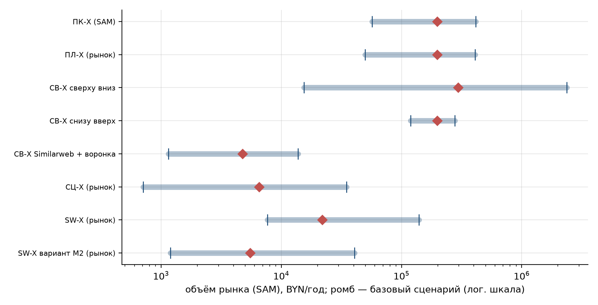

Рисунок 12 – Диапазоны объёма рынка (SAM) по методам: осторожный – оптимистичный, ромб — базовый (BYN в год, логарифмическая шкала)

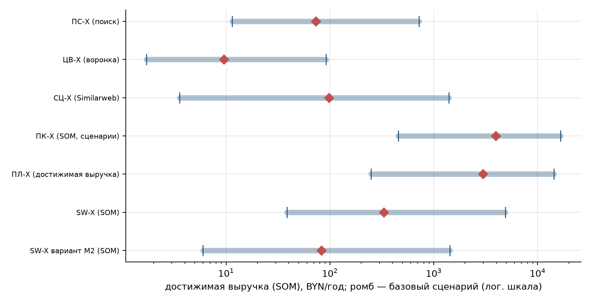

Рисунок 13 – Диапазоны достижимой выручки (SOM) по методам (BYN в год, логарифмическая шкала)

Таблица 81 – Ориентиры достижимой доли нового бизнеса и значения расчёта

| Источник ориентира | Осторожно | Базово | Оптимистично |
|---|---|---|---|
| ПК табл. 7 (К5) | 0,5–1 % | 1–3 % | 3–7 % |
| М1 табл. 13 (доля трафика) | 0,1–0,5 % | 0,5–2 % | 2–5 % |
| ПК-X, лист 03 (значения шаблона) | 0,8 % | 2 % | 4 % |
| ПЛ-X, лист 06 | 0,5 % | 1,5 % | 3,5 % |
| СЦ-X, лист 01 | 0,5 % | 1,5 % | 4 % |
| SW-X, лист 06 | 0,5 % | 1,5 % | 3,5 % |
| Принято в расчётах каждого шаблона | значения шаблона | значения шаблона | значения шаблона |
| ПК-X, сегментные К5 (S-01 / S-02–03 / S-04) | — | 1 % / 2 % / 1 % | — |

Ориентиры различаются (W-7): в ПК — доля рынка нового бизнеса, в М1 — доля трафика. В расчётах принята шкала соответствующего шаблона; осторожное значение ПК-X (0,8 %) находится в диапазоне 0,5–1 %, оптимистичное (4 %) — в диапазоне 3–7 %.

#### 2.10.3 Правила согласования результатов

Таблица 82 – Применение правил согласования ИНСТР §11

| Правило | Проверка | Результат |
|---|---|---|
| «Сверху вниз» значительно больше «снизу вверх» — проверить коэффициенты | Базовый «сверху вниз» 296 435, «снизу вверх» 197 989 BYN (в 1,5 раза) | Значительного превышения нет; различие — общая доля К2 × К4 (17,5 %) против сегментных (К4 студентов 8,75 %). Оптимистичный «сверху вниз» (2,8 млн) существенно выше — оценка верхнего предела |
| Поисковый спрос высокий, платёжеспособность низкая — уточнить цену, сегмент, формат | Поисковый спрос преимущественно информационный («онлайн», «скачать», «бесплатно»); коммерческих 16 запросов за 30 дней | Платёжеспособность подтверждена только у специалистов; студентов целесообразно вести на Free; цену проверить опросом |
| Трафик конкурентов высокий, поисковый спрос низкий — проверить рекламу, соцсети, приложения, прямой трафик | Трафик выборки 9,0 млн визитов в месяц, трафик рынка по РБ около 17 633 визитов; Вордстат — сотни запросов | Аудитория приходит не только через Яндекс: у plantuml.com Organic 48,5 %, остальное — прямой трафик и рефералы; Google и расширения редакторов кода (миллионы установок) поисковым спросом Яндекса не отражены |
| Воронка даёт малый объём при большом рынке — проблема в канале, а не в ёмкости | Воронка поискового канала 9,5 BYN/год при SAM 197 988 BYN | Подтверждается: измерен единственный канал (органический поиск); каналы, требующие рекламных кабинетов, не измерены (модельная оценка (допущение; причина: табл. 91, п. 5)) |
| Сценарии сильно различаются — собрать данные по конверсиям, ценам, конкурентам, сегментам | Отношение оптимистичного к осторожному: ПК-X 7,3×, SW-X 18,2× | Разброс значителен; приоритетные данные — конверсия Free → Pro, доля платящих, срок удержания, доли стран по Similarweb |
| Итог — диапазон, а не одно число | Результат приведён диапазоном с указанием уровня и ограничений | Выполнено |

Клиентские методы и методы по трафику Similarweb различаются примерно в 9 раз (базовые сценарии). Причины: доля Беларуси в визитах (допущение Д-01) и выборка из четырёх доменов занижают трафиковую оценку; ПК-X, напротив, опирается на численность групп и допущенные коэффициенты, не проверенные опросом. Согласовать порядок величины можно только дополнительными данными, поэтому итоговый диапазон приводится шире, чем у отдельных методов.

Таблица 83 – Сопоставление основного чека 40 USD в год с альтернативным 48 USD в год (4 USD × 12)

| Показатель | 40 USD в год (основной) | 48 USD в год (альтернативный) | Отношение 48 / 40 |
|---|---|---|---|
| Годовой чек Pro, BYN | 121,14 | 145,37 | 1,20 |
| Месячный эквивалент, BYN | 10,10 | 12,11 | 1,20 |
| Доля месячной стипендии студента, % | 3,38 | 4,27 | 1,26 |
| Доля месячной зарплаты специалиста, % | 0,157 | 0,189 | 1,20 |
| Индекс платёжеспособности (бюджет / цена): студенты / специалисты / преподаватели | 1,48 / 31,76 / 15,71 | 1,17 / 26,47 / 13,09 | 0,83 |
| Коэффициент оправданности: специалисты / преподаватели | 11,34 / 5,61 | 9,45 / 4,68 | 0,83 |
| ПК-X (SAM), рынок (SAM), базовый сценарий, BYN/год | 197 988 | 237 589 | 1,20 |
| ПЛ-X (рынок), рынок (SAM), базовый сценарий, BYN/год | 197 989 | 237 590 | 1,20 |
| СВ-X сверху вниз, рынок (SAM), базовый сценарий, BYN/год | 296 435 | 355 726 | 1,20 |
| СВ-X снизу вверх, рынок (SAM), базовый сценарий, BYN/год | 197 989 | 237 590 | 1,20 |
| СВ-X Similarweb + воронка, рынок (SAM), базовый сценарий, BYN/год | 4 762 | 6 230 | 1,31 |
| СЦ-X (рынок), рынок (SAM), базовый сценарий, BYN/год | 6 542 | 8 561 | 1,31 |
| SW-X (рынок), рынок (SAM), базовый сценарий, BYN/год | 21 971 | 28 748 | 1,31 |
| SW-X вариант М2 (рынок), рынок (SAM), базовый сценарий, BYN/год | 5 521 | 7 224 | 1,31 |
| ПС-X (поиск), SOM, базовый сценарий, BYN/год | 73 | 88 | 1,20 |
| ЦВ-X (воронка), SOM, базовый сценарий, BYN/год | 10 | 11 | 1,20 |
| СЦ-X (Similarweb), SOM, базовый сценарий, BYN/год | 98 | 128 | 1,31 |
| ПК-X (SOM, сценарии), SOM, базовый сценарий, BYN/год | 3 960 | 4 752 | 1,20 |
| ПЛ-X (достижимая выручка), SOM, базовый сценарий, BYN/год | 2 970 | 3 564 | 1,20 |
| SW-X (SOM), SOM, базовый сценарий, BYN/год | 330 | 431 | 1,31 |
| SW-X вариант М2 (SOM), SOM, базовый сценарий, BYN/год | 83 | 108 | 1,31 |

В третьем столбце — значения прежнего расчёта (чек Pro 145,37 BYN); пересчёт выполнен по тем же формулам и допущениям, меняется только цена Pro. Объёмы рынка и достижимая выручка прямо пропорциональны годовому чеку (отношение 1,2); доли цены в доходе растут, индекс платёжеспособности и коэффициент оправданности падают в той же пропорции. Медиана входных тарифов конкурентов в оптимистичном сценарии от цены Pro не зависит. Вывод о бесплатном тарифе для студентов от выбора чека не меняется.

#### 2.10.4 Итоговый вывод

Итоговая формулировка по универсальному шаблону ИНСТР §12.

В рамках исследования рынок определён как рынок веб-инструментов построения и проверки диаграмм формальных нотаций (UML, BPMN, ERD, IDEF, DFD, сети Петри) для студентов технических специальностей, аналитиков, архитекторов ПО и преподавателей в Республике Беларусь. Первичный анализ поискового спроса показал интерес аудитории к нотациям и инструментам (uml — 591, bpmn — 476, plantuml — 198, idef0 — 105 запросов за 30 дней в Вордстате) и к генерации схем нейросетью (107), при этом коммерчески значимыми являются редкие запросы «купить», «цена», «подписка» (16 за 30 дней). Динамический анализ показал сезонность (учебный год) и снижение интереса за год на 35–55 % по основным нотационным запросам.

Данные Similarweb по четырём конкурентам указывают на цифровую активность в сегменте: 9,0 млн визитов в месяц при высокой концентрации у draw.io (CR3 99,8 %, HHI около 7 600); доля Беларуси в бесплатных данных не показана и принята допущением (0,20 % визитов). Расчёт «сверху вниз» дал ориентировочный верхний предел 15 399 / 296 435 / 2 372 618 BYN в год (осторожный / базовый / оптимистичный), а расчёт «снизу вверх» через потенциальных клиентов и годовой чек 121,14 BYN — более прикладную оценку: доступный рынок (SAM по ПК-X, лист 03_Сценарии) 57 021 / 197 988 / 414 754 BYN в год при платящей базе около 1 634 пользователей.

Проверка через цифровую воронку показала, что измеренный канал (органический поиск по ядру запросов) даёт достижимую выручку 2–91 BYN в год, воронка по трафику Similarweb — до 4 894 BYN в год; достижимая выручка по клиентской базе (SOM по ПК-X, лист 03_Сценарии) — 456–16 590 BYN в год (базовая 3 960 при единой доле достижения 2 %; по долям К5 с разбивкой по сегментам, лист 02_Сегменты, — 3 007). Проверка платежеспособности показала, что цена Pro (10,10 BYN в месяц при годовой оплате 40 USD) составляет 3,4 % стипендии и 0,16 % зарплаты специалиста: для специалистов покупка экономически оправдана (коэффициент оправданности около 11), для студентов платный тариф не обоснован, а бесплатные заменители (draw.io, PlantUML, Mermaid) ограничивают готовность платить. В связи с этим доступный рынок NotaCode в Беларуси может быть оценен в диапазоне 49 893–414 754 BYN в год (примерно 16 475–136 950 USD; базовая оценка 197 988 BYN, около 65 375 USD). Диапазон составной: нижняя граница (49 893) — осторожный сценарий ПЛ-X (лист 06_Сценарии, ячейка C22), верхняя (414 754) — оптимистичный сценарий ПК-X (лист 03_Сценарии); по одному шаблону ПК-X диапазон составляет 57 021–414 754 BYN. Достижимая выручка первого года — 249–16 590 BYN (нижняя граница — осторожный сценарий ПЛ-X, ячейка F22; верхняя — оптимистичный сценарий ПК-X); расчёт требует дальнейшей проверки через анализ конкурентов, опрос потенциальных клиентов, рекламные кабинеты и тестовые продажи.

Таблица 84 – Итоговый вывод по М2 табл. 25 (семь элементов)

| Элемент вывода | Формулировка |
|---|---|
| Границы рынка | Веб-инструменты построения и проверки диаграмм формальных нотаций для студентов, специалистов и преподавателей в Республике Беларусь. |
| Конкурентная база | Четыре домена Similarweb (прямые, заменитель); по типам сайтов выборка неполная; недостающие домены вынесены в перечень работ. |
| Цифровой масштаб | 9,0 млн визитов в месяц по выборке (мир), около 17 633 визитов в месяц по Беларуси после допущения Д-01. |
| Структура спроса | Органический поиск (48,5 % у plantuml.com); спрос Вордстата информационно-инструментальный; коммерческие запросы составляют около 6 % от измеренных формулировок. |
| Расчётный объём | SAM по клиентской базе 49 893–414 754 BYN в год; SAM по трафику Similarweb 7 690–139 815 BYN в год (SW-X); SOM — до 16 590 BYN в год. |
| Ограничения | Допущения К1–К5, Д-01, Д-08, конверсии Free → Pro и срока удержания не подтверждены данными; Similarweb — модельные данные, три значения из четырёх без снимка экрана; рекламные кабинеты и опрос не использованы. |
| Следующий шаг | Опрос ≥ 20–30 респондентов (готовность платить, допустимая цена), прогноз в рекламных кабинетах, добор 6–16 доменов Similarweb, анализ конкурентов и ценовых предложений. |

## 3 Ответы на контрольные вопросы

Перечень контрольных вопросов к защите в материалах дисциплины не задан; ответы даны на вопросы контроля качества, содержащиеся в методиках: М1 §12 (10 вопросов), ПК §14 (11 вопросов) и СЦ §13 (10 вопросов), всего 31. Пересекающиеся вопросы (сценарии, ограничения) получают согласованные ответы со ссылкой на раздел.

### 3.1 Контроль качества оценки по данным Similarweb (М1 §12)

Таблица 85 – Ответы на вопросы М1 §12

| № | Вопрос | Ответ | Раздел |
|---|---|---|---|
| 1 | Совпадает ли список конкурентов с ранее зафиксированными границами рынка? | Частично. Три домена — прямые продукты (plantuml.com, mermaidchart.com, eraser.io), один — заменитель в части нотационных диаграмм (app.diagrams.net); Miro как универсальная доска исключён границами. Выборка неполная: не хватает заменителей, BPMN-инструментов и контентных сайтов. | 2.3.2 |
| 2 | Не включены ли в расчёт сайты, которые обслуживают другую клиентскую задачу? | Нет. Универсальные доски (Miro, Figma) и корпоративные CASE-платформы в выборку не включены; draw.io включён с пониженной релевантной долей (35 %). | 2.3.2 |
| 3 | Одинаковы ли период, страна, устройство и тип трафика для всех конкурентов? | Частично. Для plantuml.com подтверждены период «август 2026», все типы трафика, весь мир. Значения трёх остальных доменов получены без снимка экрана, их период и единицы не подтверждены снимком экрана; единообразие требует повторного замера (модельная оценка (допущение; причина: Similarweb, повторные снимки экрана, табл. 91, п. 2–3)). | 2.3.1 |
| 4 | Разделены ли общий трафик, трафик целевой страны и трафик релевантных каналов? | Да. TAM 9 005 500 визитов в месяц → SAM по географии 17 633 → SAM по каналу Organic около 8 547 визитов в месяц. | 2.3.6 |
| 5 | Не подменяется ли доля трафика долей выручки без дополнительных допущений? | Нет. Доли трафика и HHI названы концентрацией трафика; выручка рассчитывается через конверсии и чек, допущения вынесены в журнал. | 2.3.3 |
| 6 | Проверены ли выбросы, сезонность и разовые всплески? | Частично. Для Вордстата выявлена учебная сезонность и спады в июле–августе; для Google Trends — разовые недели; у plantuml.com снижение на 27,81 % к предыдущему месяцу трактуется как летний спад. Помесячная история Similarweb в бесплатном доступе недоступна. | 2.2, 2.3 |
| 7 | Отделены ли информационные поисковые запросы от коммерческих? | Да. Запросы разделены на коммерческие, проблемные, инструментальные и информационные; коммерческих 16 за 30 дней против 170 инструментальных и 87 проблемных; информационные получают вес 0,1 и исключаются из индекса коммерческого интереса. | 2.2.2, 2.3.4 |
| 8 | Есть ли три сценария расчёта, а не одно точное число? | Да. Осторожный, базовый и оптимистичный сценарии рассчитаны в каждой методике. | 2.2–2.10 |
| 9 | Сопоставлены ли выводы Similarweb с Google Trends, Вордстат, статистикой, ценами конкурентов и рекламными кабинетами? | Частично. Сопоставление с Вордстатом, Google Trends, Белстатом и ценами выполнено; рекламные кабинеты не использованы (модельная оценка (допущение; причина: табл. 91, п. 5)). | 2.10.3 |
| 10 | Указаны ли ограничения Similarweb и уровень надёжности данных по небольшим сайтам? | Да. Данные модельные; бесплатный доступ ограничен лимитом просмотров; значение mermaidchart.com принято как верхняя граница «менее 20 тыс.»; надёжность по небольшим сайтам низкая. | 2.3.1, 2.3.7 |

### 3.2 Контрольный чек-лист потенциальных клиентов (ПК §14)

Таблица 86 – Ответы на вопросы ПК §14

| № | Вопрос | Ответ | Раздел |
|---|---|---|---|
| 1 | Зафиксированы ли продуктовые, клиентские, географические и цифровые границы рынка? | Да, паспорт границ и единица клиента. | 2.1 |
| 2 | Определена ли единица потенциального клиента? | Да: пользователь (физическое лицо). | 2.1 |
| 3 | Есть ли источник исходной численности клиентской базы? | Да: Белстат — студенты вузов 229,0 тыс., работники организаций цифровой экономики 130 549, ППС 17,1 тыс. | 2.5 |
| 4 | Разделена ли клиентская база на сегменты? | Да, на три расчётные строки (S-01; S-02 и S-03 вместе из-за отсутствия разбивки; S-04). | 2.5 |
| 5 | Обоснована ли доля клиентов с потребностью? | Частично. К2 = 22,5 % — допущение в диапазоне ПК табл. 7; подтверждение опросом — модельная оценка (допущение) (табл. 91, п. 4); косвенный признак — поисковый спрос Вордстата. | 2.5 |
| 6 | Учтена ли цифровая доступность клиентов? | Да. К3 = 55 % (диапазон 40–70 %); потолок — 94,3 % населения, пользующегося интернетом. | 2.5 |
| 7 | Отделена ли готовность платить от общего интереса? | Да. К4 задана отдельно (8,75 % / 17,5 % / 10 %), коммерческие запросы выделены в Вордстате. | 2.5, 2.2 |
| 8 | Проверен ли средний чек через конкурентов или пилотные данные? | Да, через тарифы конкурентов (медиана входных тарифов 8 USD в месяц); пилотных данных нет. | 2.9 |
| 9 | Рассчитаны ли осторожный, базовый и оптимистичный сценарии? | Да: листы 03_Сценарии и сценарии по диапазонам К1–К5. | 2.5 |
| 10 | Сопоставлен ли расчёт с поисковым спросом, Similarweb и цифровой воронкой? | Да, раздел сверки; независимые методы дают значения ниже клиентской оценки. | 2.10 |
| 11 | Указаны ли ограничения и источники данных? | Да, журнал допущений и журнал источников. | Приложение Б |

### 3.3 Контрольный чек-лист сценарной оценки (СЦ §13)

Таблица 87 – Ответы на вопросы СЦ §13

| № | Вопрос | Ответ | Раздел |
|---|---|---|---|
| 1 | Зафиксированы ли продуктовые и географические границы рынка? | Да. | 2.1 |
| 2 | Составлен ли список конкурентов, соответствующих этим границам? | Частично: четыре домена из 5–15 по методике. | 2.3.2 |
| 3 | Показаны ли источники каждого значения, взятого из Similarweb? | Да, журнал ручной фиксации; у трёх значений источником служит первая выгрузка без снимка экрана. | 2.3.1, приложение В |
| 4 | Отделён ли общий трафик сайта от релевантного трафика выбранного рынка? | Да: доли релевантного трафика по доменам (Д-02) и коммерческая доля по М2. | 2.3, 2.8 |
| 5 | Учтена ли география трафика, а не только общая посещаемость домена? | Да, доля Беларуси (Д-01), хотя Similarweb её не показывает; допущение помечено. | 2.3.4 |
| 6 | Заданы ли три сценария с разными коэффициентами? | Да: охват, надёжность, недоступный спрос, конверсии, чек, достижимая доля. | 2.8 |
| 7 | Пояснены ли коэффициенты конверсии, среднего чека и частоты покупки? | Да; конверсия в оплату — допущение проекта Free → Pro 3–5 %, чек — тарифы, частота — одна годовая оплата. | 2.8 |
| 8 | Показан ли диапазон, а не одно-единственное число? | Да. | 2.8, 2.10 |
| 9 | Проверены ли результаты через Google Trends, Яндекс Вордстат, рекламные кабинеты или цены конкурентов? | Частично: Вордстат, Google Trends и цены — да; рекламные кабинеты — модельная оценка (допущение) (табл. 91, п. 5). | 2.10.3 |
| 10 | Указаны ли ограничения Similarweb и неполнота бесплатного доступа? | Да. | 2.3.1, 2.8 |

## Выводы

1. Выполнены все девять методик оценки объёма рынка и заполнены все семь Excel-шаблонов; каждый расчёт проведён по Excel-шаблону (основной вариант) и по тексту методики (вариант Word), расхождения названы и показаны в таблицах. Проверка значений независимым пересчётом на Python совпала с Excel по 44 контрольным величинам.

2. Поисковый спрос в Беларуси измерим и сезонен, но преимущественно информационный и инструментальный: коммерческих формулировок 16 за 30 дней против 170 инструментальных и 87 проблемных; интерес к нотациям снизился за год на 35–55 %. Расчёт через поисковый канал даёт достижимую выручку 11–720 BYN в год — нижнюю границу, а не размер рынка.

3. Данные Similarweb при бесплатном доступе получены полностью только для plantuml.com; на остальных страницах доступ закрыт лимитом просмотров. Выборка из четырёх доменов меньше минимума методик; концентрация трафика высокая (CR3 99,8 %, HHI около 7 600) из-за доминирования draw.io; доля Беларуси принята допущением 0,20 %.

4. Доступный рынок NotaCode по клиентской базе (Белстат, коэффициенты ПК табл. 7) оценён в 49 893–414 754 BYN в год (базовая оценка 197 988 BYN, около 65 375 USD) при платящей базе около 1 634 пользователей; диапазон составной: нижняя граница — осторожный сценарий ПЛ-X, верхняя — оптимистичный сценарий ПК-X (по одному шаблону ПК-X — 57 021–414 754 BYN). Достижимая выручка первого года — 249 (осторожный сценарий ПЛ-X)–16 590 (оптимистичный сценарий ПК-X) BYN; базовое значение SOM по ПК-X — 3 960 BYN (единая доля достижения 2 %) и 3 007 BYN (доли К5 по сегментам). Оценки по трафику и поиску ниже: доступный рынок по клиентской базе (базовая оценка) больше выручки воронки поискового канала (9,5 BYN) в 20 777 раз (более четырёх порядков); достижимая выручка по клиентской базе (3 007 BYN) больше выручки воронки поискового канала примерно в 316 раз (2,5 порядка) и SOM по трафику Similarweb (SW-X, базовый сценарий, 329,6 BYN) примерно в 9 раз (около одного порядка); причины названы в разделе 2.10.3.

5. Платёжеспособность подтверждается для специалистов (бюджет в 26 раз превышает цену, окупаемость высокая) и не подтверждается для студентов (бесплатные заменители, нулевой денежный эффект); готовность платить, доля дохода на подписки и срок удержания — допущения, требующие опроса.

6. Исправлены явные поломки шаблонов (П-1 в SW-X, П-2 в ЦВ-X, П-18, П-20, П-21), заполнены сверки на собственных результатах (П-8, П-9); добавлены листы CR3/CR5/HHI, TAM/SAM/SOM по М1 и вариант М2. Для рекламных кабинетов и опроса приняты открытые ориентиры и модельные оценки (приложение Е, таблица 97; опрос сгенерирован в ЛР5); реальные ставки кабинета, реальный опрос и доля Беларуси в Similarweb остаются недоступными (приложение Б).

7. Ориентиры стоимости клика (Директ 30–150 руб.; Google B2B SaaS 0,90–4,80 USD) дают цену платящего клиента 91–182 BYN против выручки первого года 117,63 BYN после комиссии; платный поиск не окупается, расчёт достижимой выручки опирается на органический канал (приложение Е).

## Список использованных источников

1. Инструкция по применению методик оценки рынка электронного бизнеса [Электронный ресурс]. — Методические материалы дисциплины «Электронный бизнес», 2026.
2. Концепция проекта NotaCode: раздел 6 «Модель монетизации», раздел 8 «Допущения» [Электронный ресурс]. — Документация проекта, 2026.
3. Официальные курсы валют, USD [Электронный ресурс]. — Национальный банк Республики Беларусь. — Режим доступа: https://api.nbrb.by/exrates/rates/431. — Дата доступа: 30.09.2026.
4. Методика оценки рынка через поисковый спрос и шаблон Excel [Электронный ресурс]. — Методические материалы дисциплины «Электронный бизнес», 2026.
5. Яндекс Вордстат [Электронный ресурс]. — Яндекс. — Режим доступа: https://wordstat.yandex.ru/. — Дата доступа: 30.09.2026. Регион «Беларусь».
6. Google Trends [Электронный ресурс]. — Google. — Режим доступа: https://trends.google.com/. — Дата доступа: 30.09.2026. Территория «Беларусь».
7. Google Trends Help. FAQ about Google Trends data [Электронный ресурс]. — Режим доступа: https://support.google.com/trends/answer/4365533. — Дата доступа: 30.09.2026.
8. Similarweb Data Methodology [Электронный ресурс]. — Режим доступа: https://support.similarweb.com/hc/en-us/articles/360001631538-Similarweb-Data-Methodology. — Дата доступа: 30.09.2026.
9. Методика оценки рынка: Similarweb при бесплатном доступе [Электронный ресурс]. — Методические материалы дисциплины «Электронный бизнес», 2026.
10. plantuml.com Traffic Analytics, Ranking & Audience [Электронный ресурс]. — Similarweb. — Режим доступа: https://www.similarweb.com/website/plantuml.com/. — Дата доступа: 30.09.2026.
11. Образование в Республике Беларусь, 2026: статистический сборник. — Минск: Национальный статистический комитет Республики Беларусь, 2026. — Табл. 7.1. — Режим доступа: https://www.belstat.gov.by/upload/iblock/6af/m93v33ohm51kl00b333cmrhjbhj42ouo.pdf. — Дата доступа: 30.09.2026.
12. Национальные статистические показатели развития цифровой экономики, 2024 [Электронный ресурс]. — Национальный статистический комитет Республики Беларусь. — Режим доступа: https://www.belstat.gov.by/upload-belstat/upload-belstat-excel/Oficial_statistika/2024/digital_economy-2024.xls. — Дата доступа: 30.09.2026.
13. Методика оценки объёма рынка через количество потенциальных клиентов и шаблон Excel [Электронный ресурс]. — Методические материалы дисциплины «Электронный бизнес», 2026.
14. Методика оценки рынка через цифровую воронку и шаблон Excel [Электронный ресурс]. — Методические материалы дисциплины «Электронный бизнес», 2026.
15. Методика оценки рынка через маркетплейсы и платформы [Электронный ресурс]. — Методические материалы дисциплины «Электронный бизнес», 2026.
16. Visual Studio Marketplace: Extensions [Электронный ресурс]. — Microsoft. — Режим доступа: https://marketplace.visualstudio.com/. — Дата доступа: 30.09.2026. Публичный интерфейс extensionquery.
17. JetBrains Marketplace [Электронный ресурс]. — JetBrains. — Режим доступа: https://plugins.jetbrains.com/. — Дата доступа: 30.09.2026. Публичный интерфейс.
18. Capterra: Lucidchart, Miro, draw.io, Creately, Whimsical, Visual Paradigm — отзывы [Электронный ресурс]. — Режим доступа: https://www.capterra.com/. — Дата доступа: 30.09.2026.
19. GitHub REST API: repositories [Электронный ресурс]. — Режим доступа: https://api.github.com/. — Дата доступа: 30.09.2026.
20. npm downloads API [Электронный ресурс]. — Режим доступа: https://api.npmjs.org/downloads/. — Дата доступа: 30.09.2026.
21. Методика сценарной оценки рынка с данными Similarweb и шаблон Excel [Электронный ресурс]. — Методические материалы дисциплины «Электронный бизнес», 2026.
22. Методика проверки рынка через платёжеспособность и шаблон Excel [Электронный ресурс]. — Методические материалы дисциплины «Электронный бизнес», 2026.
23. Miro Pricing [Электронный ресурс]. — Режим доступа: https://miro.com/pricing/. — Дата доступа: 30.09.2026.
24. Lucidchart Pricing [Электронный ресурс]. — Режим доступа: https://lucid.app/pricing/lucidchart. — Дата доступа: 30.09.2026.
25. Mermaid Chart Pricing [Электронный ресурс]. — Режим доступа: https://mermaid.ai/pricing. — Дата доступа: 30.09.2026.
26. Visual Paradigm Online: Pricing [Электронный ресурс]. — Режим доступа: https://online.visual-paradigm.com/. — Дата доступа: 30.09.2026.
27. Creately Plans [Электронный ресурс]. — Режим доступа: https://creately.com/plans/. — Дата доступа: 30.09.2026.
28. Eraser Pricing [Электронный ресурс]. — Режим доступа: https://www.eraser.io/pricing. — Дата доступа: 30.09.2026.
29. Whimsical Pricing [Электронный ресурс]. — Режим доступа: https://whimsical.com/pricing. — Дата доступа: 30.09.2026.
30. dbdiagram.io Pricing [Электронный ресурс]. — Режим доступа: https://dbdiagram.io/pricing. — Дата доступа: 30.09.2026.
31. Microsoft Visio: планы и цены [Электронный ресурс]. — Microsoft. — Режим доступа: https://www.microsoft.com/ru-ru/microsoft-365/visio/flowchart-software. — Дата доступа: 30.09.2026.
32. Стипендии БГУИР [Электронный ресурс]. — Белорусский государственный университет информатики и радиоэлектроники. — Режим доступа: https://www.bsuir.by/ru/stipendii-bguir. — Дата доступа: 30.09.2026.
33. Сравниваем стипендии в белорусских вузах [Электронный ресурс]. — Teenage.by, 2026. — Режим доступа: https://teenage.by/article/sravnivaem-stipendiju-v-belorusskih-vuzah. — Дата доступа: 30.09.2026.
34. Номинальная начисленная средняя заработная плата работников Республики Беларусь по видам экономической деятельности, июль 2026 г. [Электронный ресурс]. — Национальный статистический комитет Республики Беларусь. — Режим доступа: https://www.belstat.gov.by/upload-belstat/upload-belstat-excel/Oficial_statistika/2026/nach_sr_zarplata-2607.xlsx. — Дата доступа: 30.09.2026.
35. Основные социально-экономические показатели Республики Беларусь, январь–август 2026 г.: экспресс-информация [Электронный ресурс]. — Национальный статистический комитет Республики Беларусь. — Режим доступа: https://www.belstat.gov.by/upload-belstat/upload-belstat-excel/Oficial_statistika/2026/express_info-2608.xlsx. — Дата доступа: 30.09.2026.
36. Базовая величина с 1 января 2026 г. [Электронный ресурс]. — Pravo.by, 2025. — Режим доступа: https://pravo.by/novosti/novosti-pravo-by/2025/november/91047/. — Дата доступа: 30.09.2026.
37. Парк высоких технологий: факты [Электронный ресурс]. — Режим доступа: https://www.park.by/htp/facts/. — Дата доступа: 30.09.2026.
38. Digital 2026: Belarus [Электронный ресурс]. — DataReportal. — Режим доступа: https://datareportal.com/reports/digital-2026-belarus. — Дата доступа: 30.09.2026.
39. Стоимость клика в Яндекс.Директ [Электронный ресурс]. — Режим доступа: https://workspace.ru/blog/vsye-o-stoimosti-klika-v-yandeks-direkt/. — Дата доступа: 02.10.2026.
40. B2B SaaS Google Ads Benchmarks 2026: CPC, CPA vs LinkedIn [Электронный ресурс]. — Режим доступа: https://www.kampaio.com/blog/b2b-saas-google-ads-benchmarks-2026. — Дата доступа: 02.10.2026.

## Приложение А (обязательное) Перечень файлов работы

Таблица 88 – Файлы лабораторной работы

| Файл или папка | Содержание |
|---|---|
| ОТЧЕТ.md, ОТЧЕТ_ЛР2-3_NotaCode.docx | Отчёт (исходный текст и итоговый документ Word по СТП БГУИР) |
| Excel/ПС_поисковый_спрос_NotaCode.xlsx | Рабочая копия шаблона ПС-X: поисковый спрос |
| Excel/ЦВ_цифровая_воронка_NotaCode.xlsx | Рабочая копия ЦВ-X; исправлена ссылка П-2 |
| Excel/ПЛ_платежеспособность_NotaCode.xlsx | Рабочая копия ПЛ-X; исправлены П-20, П-21 |
| Excel/ПК_потенциальные_клиенты_NotaCode.xlsx | Рабочая копия ПК-X: TAM, SAM, SOM |
| Excel/СЦ_сценарная_оценка_Similarweb_NotaCode.xlsx | Рабочая копия СЦ-X; сверка по П-8, П-9 |
| Excel/СВ_сверху_вниз_снизу_вверх_NotaCode.xlsx | Рабочая копия СВ-X |
| Excel/SW_объем_рынка_Similarweb_NotaCode.xlsx | Рабочая копия SW-X; исправлены П-1, П-18; добавлены листы 09_Концентрация, 10_TAM_SAM_SOM_М1, 11_Вариант_М2 |
| Python/inputs.py, assumptions.py | Исходные данные и единый журнал допущений (значения меняются в одном месте) |
| Python/fill_ps.py … fill_sw.py, xl_com.py | Заполнение Excel-копий через Excel COM (сохраняет встроенные диаграммы) |
| Python/calc_all.py | Независимый пересчёт, варианты Word, чувствительность, сверка с Excel (44 проверки) |
| Python/make_figures.py | Построение рисунков отчёта |
| Python/build_report.py, rep_*.py | Сборка текста отчёта: таблицы берут числа из Excel-копий и results.json |
| VBA/VBA_ПС.bas … VBA_SW.bas, VBA_Общий.bas | Макросы проверки, сводки, чувствительности, исправлений и переноса итогов (запускаются вручную) |
| Рисунки/*.png, СПИСОК_РИСУНКОВ.md | Графики отчёта и перечень подписей |
| Скриншоты/ | Снимки экрана Similarweb (plantuml.com, страница с лимитом; имена по образцу М1 табл. 14) и Вордстата (Топы и динамика по ядру запросов, регион «Беларусь») |
| Материалы_собранные/ | Сырьё: Вордстат, Google Trends, Similarweb, маркетплейсы, статистика и цены, курс НБРБ |
| ПЛАН.md, ИНСТРУКЦИЯ_ДЛЯ_МЕНЯ.md, ЧТО_И_КАК_СДЕЛАНО.md, ЧЕКЛИСТ.md | План работ, инструкция по ручным действиям, описание выполненного, чек-лист |

## Приложение Б (обязательное) Журналы допущений и источников, перечень недостающих данных

Таблица 89 – Журнал допущений

| Код | Допущение | Значение | Основание / шкала методики | Надёжность |
|---|---|---|---|---|
| Д-01 | Доля Беларуси в визитах доменов выборки | 0,1958 % (Россия 9,07 % × 170 / 7 874) | Расчёт по двум открытым показателям; в методиках не задана. Оговорки: доля России в Similarweb относится к desktop-трафику, а применена ко всем визитам; отношение запросов Вордстата отражает только пользователей Яндекса | низкая |
| Д-02 | Доля релевантного трафика по доменам | plantuml.com 75 %; app.diagrams.net 35 %; eraser.io 50 %; mermaidchart.com 70 % | Диапазон СЦ табл. 10 (20–75 %) | низкая |
| Д-03 | Веса намерений | коммерческие 0,90; проблемные 0,45; инструментальные 0,65; локальные 0,30 | ПС табл. 9 (внутри диапазонов) | средняя |
| Д-04 | Региональный коэффициент (вариант Word) | 1,00 | ПС табл. 14: 0,50–1,00 | средняя |
| Д-05 | Коэффициент покрытия выборки в ЦВ-X | 0,65 | М2 табл. 21; шкала М2 табл. 9 (0,60–0,75) | низкая |
| Д-06 | К1 релевантность сегмента | S-01 30 %; S-02/03 30 %; S-04 20 % | ПК табл. 7 (20–40 %) | низкая |
| Д-06а | К2 потребность; К3 цифровая доступность | 22,5 %; 55 % | ПК табл. 7 (15–30 %; 40–70 %) | низкая |
| Д-06б | К4 готовность платить | S-01 8,75 %; S-02/03 17,5 %; S-04 10 % | ПК табл. 7 (5–10 %; 10–25 %); проект Free → Pro 3–5 % | низкая |
| Д-06в | К5 достижимая доля (сегменты) | 1 % / 2 % / 1 % | ПК табл. 7 (1–3 %) | низкая |
| Д-07 | Экономия времени при использовании NotaCode | 3 часа в месяц из 168 | Допущение с пометкой; опрос | низкая |
| Д-08 | Доля дохода на подписки и цифровые сервисы | 5 % (чувствительность 3 % и 10 %) | Допущение; опрос | низкая |
| Д-09 | Конверсия регистрация → оплата Pro | 3 / 4 / 5 % | Концепция NotaCode: Free → Pro 3–5 %; шкалы методик для услуг (10–60 %) для freemium неприменимы | низкая |
| Д-10 | Число годовых оплат на платящего | 1,0 / 1,2 / 1,5 | Шкала шаблонов ПС-X и ЦВ-X; данных об удержании нет | низкая |
| Д-11 | Чек: осторожный / базовый / оптимистичный | 121,14 / 121,14 / 290,74 BYN | 40 USD (осторожный, базовый); медиана входных тарифов конкурентов × 12; курс НБРБ 3,0285; вариант 48 USD — таблица 83 | средняя |
| Д-12 | Значения шаблонов (конверсия посетитель → заявка, множители сценариев, достижимые доли) | без изменений | Excel-шаблоны «как есть» (основной вариант) | — |

Все допущения хранятся в одном файле (Python/assumptions.py) и в листах «01_Параметры» Excel-копий; решения В-1 … В-12 (таблица 4) можно изменить и пересчитать отчёт повторным запуском скриптов.

Таблица 90 – Журнал источников данных

| Показатель | Источник | Дата обращения | Статус | Надёжность |
|---|---|---|---|---|
| Студенты вузов РБ, 229,0 тыс. (2025/26) | Белстат, сборник «Образование в Республике Беларусь, 2026», табл. 7.1 [11] | 30.09.2026 | факт | высокая |
| Работники организаций цифровой экономики, 130 549; организаций 8 533 (2024) | Белстат, digital_economy-2024.xls [12] | 30.09.2026 | факт | средняя |
| ППС вузов, 17,1 тыс. | Белстат [11] | 30.09.2026 | факт | средняя |
| Средняя зарплата по РБ, июль 2026: 3 172,0 BYN | Белстат, экспресс-информация [35] | 30.09.2026 | факт | высокая |
| Зарплата «информация и связь», июль 2026: 6 413 BYN | Белстат, таблица по видам экономической деятельности [34] | 30.09.2026 | факт | высокая |
| Стипендия БГУИР (ИКТ), 229,75–367,60 BYN с 01.08.2026 | таблица БГУИР [32]; прежний диапазон 224,66–342,34 BYN – [33] | 30.09.2026 | таблица на сайте университета | высокая |
| Базовая величина 45 BYN с 01.01.2026 | pravo.by [36] | 30.09.2026 | факт | высокая |
| ПВТ: более 1000 резидентов, около 60 тыс. работников | park.by [37] | 30.09.2026 | факт (без даты на странице) | средняя |
| Интернет: 94,3 % населения 6–72 лет; 8,47 млн пользователей (2025) | Белстат; DataReportal [38] | 30.09.2026 | факт | высокая |
| Курс USD/BYN 3,0285 | НБРБ [3] | 30.09.2026 | факт | высокая |
| Частотность и динамика запросов (РБ) | Яндекс Вордстат [5] | 30.09.2026 | факт (модель Яндекса) | средняя |
| Индексы интереса (РБ) | Google Trends [6] | 30.09.2026 | факт (индекс 0–100) | низкая (мало данных) |
| Google Trends (UML, BPMN) и Вордстат «Регионы» (bpmn, uml): Россия и Казахстан | Первая работа (п. 2.3.3, табл. 23) [6, 5] | GT 30.09.2026; Вордстат, окно 29.08–29.09.2026 | факт (перенос из ЛР1, новых выгрузок нет) | средняя; по Казахстану низкая (прерывистый ряд) |
| Посещаемость plantuml.com (507 тыс., август 2026) | Similarweb [10] | 30.09.2026 | оценка; снимок экрана низкого разрешения (шапка страницы, ранги), значения — в тексте страницы | средняя |
| Посещаемость app.diagrams.net, eraser.io, mermaidchart.com | Similarweb: отчёт ЛР1 (app.diagrams.net); предварительный замер (eraser.io, mermaidchart.com) | 17–23.09.2026 | оценка; без снимка экрана | низкая |
| Установки, оценки, загрузки расширений и плагинов | VS Marketplace, JetBrains Marketplace, GitHub, npm [16, 17, 19, 20] | 30.09.2026 | факт | высокая |
| Отзывы продуктов в каталогах | Capterra [18] | 30.09.2026 | факт, подлежит ручной сверке | средняя |
| Тарифы конкурентов | Страницы тарифов [23, 24, 25] | 30.09.2026 | факт (значения Lucidchart и Mermaid Chart сверены с тарифами, считанными со страниц цен в ЛР1 30.09.2026) | средняя |
| Цена Pro 40 USD/год (4 USD/мес. при помесячной оплате; вариант 48 USD/год), конверсия Free → Pro 3–5 % | Концепция NotaCode [2] | — | гипотеза проекта (A-06) | низкая |

Таблица 91 – Перечень данных, принятых моделью (допущения)

| № | Что | Где | Как | Кто |
|---|---|---|---|---|
| 1 | Similarweb по 6–16 дополнительным доменам (mermaid.live, lucidchart.com, miro.com, creately.com, online.visual-paradigm.com, dbdiagram.io, excalidraw.com, whimsical.com, bpmn.io, staruml.io и др.), доли стран (Беларусь, Россия, Казахстан), каналы, вовлечённость | similarweb.com/website/<домен> | вручную в своём браузере после сброса лимита; скриншот высокого разрешения с датой; запись в журнал SWБ табл. 7 | вручную, по странице источника |
| 2 | Повторный снимок plantuml.com в высоком разрешении; значения июня и июля (наведение на график) | similarweb.com/website/plantuml.com/ | скриншот блоков Total Visits, Geography, Marketing Channels | вручную, по странице источника |
| 3 | Подтверждение визитов app.diagrams.net (7,8 млн), eraser.io (678,5 тыс.), mermaidchart.com | Similarweb | скриншот «последние 3 месяца» | вручную, по странице источника |
| 4 | Опрос 20–30 респондентов: готовность платить, допустимая цена, чем строят диаграммы, доля дохода на подписки | Студенты БГУИР, аналитики, разработчики | анкета из 8–10 вопросов | вручную, по итогам опроса |
| 5 | Прогноз показов, кликов и стоимости клика по ядру запросов | Яндекс Директ, Google Ads Keyword Planner, VK, Meta | кабинет рекламодателя (режим прогноза) | вручную, в кабинете рекламодателя |
| 6 | Разбивка студентов по профилям (ИТ, экономика, управление), численность ИТ-преподавателей | Белстат, Министерство образования, edustat.by | запрос в ведомство или сборник по специальностям | открыто |
| 7 | Численность занятых по видам деятельности «информация и связь» (средняя зарплата по видам деятельности получена из таблицы Белстата за июль 2026 г.) | dataportal.belstat.gov.by | выгрузка в браузере | открыто |
| 8 | Точное число резидентов ПВТ на дату | park.by | реестр резидентов | открыто |
| 9 | Цена платного плагина Mermaid Studio и других JetBrains-плагинов; отзывы G2 | plugins.jetbrains.com; g2.com | страница продукта в браузере | открыто |
| 10 | Вордстат «Динамика» по коммерческим и региональным формулировкам при расширении ядра | wordstat.yandex.ru | вкладка «Динамика», регион «Беларусь» | открыто |
| 11 | Необязательно (РФ и Казахстан вне итогового диапазона, В-6): Google Trends по PlantUML и IDEF0, Вордстат «Топы» и «Динамика» по России и Казахстану; в ЛР1 сняты UML и BPMN в Google Trends и вкладка «Регионы» Вордстата (таблицы 8, 9) | trends.google.com; wordstat.yandex.ru | те же настройки, что для Беларуси | открыто |
| 12 | Конверсия Free → Pro при пилоте (допущение A-06: 3–5 %) | пилотные пользователи продукта | запуск пилота и замер доли перешедших на Pro | открыто |
| 13 | Документ-основание размеров стипендий БГУИР (постановление Минобразования № 410); размеры взяты из таблицы на сайте БГУИР с 01.08.2026 | bsuir.by/ru/stipendii-bguir; постановление Минобразования № 410 | сохранить архив страницы или запросить документ в университете | открыто |

## Приложение В (обязательное) Журнал ручной фиксации Similarweb

Таблица 92 – Журнал ручной фиксации Similarweb (SWБ табл. 7)

| Дата | Домен | Период | Страна / география | Показатель | Значение | Комментарий |
|---|---|---|---|---|---|---|
| 30.09.2026 | plantuml.com | August 2026 (Jun-Aug 2026) | Global | Total visits (последний месяц, Aug 2026) | 507K визитов/мес | оценка Similarweb, июнь/июль текстом не показаны |
| 30.09.2026 | plantuml.com | August 2026 (Jun-Aug 2026) | Global | Изменение визитов к прошлому месяцу | -27.81 % | снижение |
| 30.09.2026 | plantuml.com | August 2026 (Jun-Aug 2026) | Global | Global rank | 93517 место | в июне 74,025 (ухудшение) |
| 30.09.2026 | plantuml.com | August 2026 (Jun-Aug 2026) | Russia | Country rank | 24334 место | страна с макс. трафиком |
| 30.09.2026 | plantuml.com | August 2026 (Jun-Aug 2026) | Russia | Category rank | 692 место | Computers Electronics and Technology > Programming and Developer Software |
| 30.09.2026 | plantuml.com | August 2026 (Jun-Aug 2026) | Global | Bounce rate | 45.52 % | — |
| 30.09.2026 | plantuml.com | August 2026 (Jun-Aug 2026) | Global | Pages per visit | 3.18 стр. | — |
| 30.09.2026 | plantuml.com | August 2026 (Jun-Aug 2026) | Global | Avg visit duration | 00:03:16 чч:мм:сс | — |
| 30.09.2026 | plantuml.com | August 2026 (Jun-Aug 2026) | Russia | Доля трафика страны | 9.07 % | 1-е место |
| 30.09.2026 | plantuml.com | August 2026 (Jun-Aug 2026) | Germany | Доля трафика страны | 7.21 % | — |
| 30.09.2026 | plantuml.com | August 2026 (Jun-Aug 2026) | China | Доля трафика страны | 6.4 % | — |
| 30.09.2026 | plantuml.com | August 2026 (Jun-Aug 2026) | Japan | Доля трафика страны | 4.61 % | — |
| 30.09.2026 | plantuml.com | August 2026 (Jun-Aug 2026) | United States | Доля трафика страны | 4.57 % | — |
| 30.09.2026 | plantuml.com | August 2026 (Jun-Aug 2026) | Belarus | Доля трафика страны | нет данных в бесплатном доступе | не в топ-5 (Others 68.15%) |
| 30.09.2026 | plantuml.com | August 2026 (Jun-Aug 2026) | Kazakhstan | Доля трафика страны | нет данных в бесплатном доступе | не в топ-5 |
| 30.09.2026 | plantuml.com | August 2026 (Jun-Aug 2026) | Global | Канал Organic Search | 48.47 % | 1-е место, desktop |
| 30.09.2026 | plantuml.com | August 2026 (Jun-Aug 2026) | Global | Каналы Direct/Referrals | нет данных в бесплатном доступе | Direct 2-е, Referrals 3-е место без долей |
| 30.09.2026 | plantuml.com | August 2026 (Jun-Aug 2026) | Global | Каналы Social/Paid/Mail/Display | нет данных в бесплатном доступе | показаны только топ-3 канала |
| 30.09.2026 | plantuml.com | August 2026 (Jun-Aug 2026) | Global | Top keywords | plantuml, plant uml, plantuml online, plantuml editor, planuml | всего 866 ключей, organic 100%/paid 0% |
| 30.09.2026 | plantuml.com | August 2026 (Jun-Aug 2026) | Global | Similar sites | app.diagrams.net 100%, mermaidchart.com 92%, eraser.io 90%, drawio-app.com 85%, sequencediagram.org 80%, websequencediagrams.com 78%, visual-paradigm.com 75%, mermaid.live 68% | affinity |
| 30.09.2026 | plantuml.com | August 2026 (Jun-Aug 2026) | Global | Demographics | 69.66% male / 30.34% female, 25-34 лет 33.63% | — |
| 30.09.2026 | app.diagrams.net | August 2026 | Global | Все показатели | нет данных в бесплатном доступе | доступ закрыт (лимит бесплатных просмотров/логин) |
| 30.09.2026 | mermaid.live | August 2026 | Global | Все показатели | нет данных в бесплатном доступе | доступ закрыт (лимит бесплатных просмотров/логин) |

Снимок экрана plantuml.com имеет низкое разрешение и содержит шапку страницы, домен, период и ранги; остальные значения зафиксированы текстом страницы. Значения по доменам с закрытым доступом не заполнялись.

## Приложение Г (обязательное) Исправления и особенности шаблонов

Таблица 93 – Исправления рабочих копий и особенности шаблонов

| Код | Шаблон, ячейки | Суть | Действие |
|---|---|---|---|
| П-1 | SW-X, 01_Параметры!B9, B10 | SUM(G5:G24), SUM(H5:H24) при данных с 4-й строки: первый конкурент теряется | Исправлено на G4:G23, H4:H23; значения до и после — таблица 27 |
| П-2 | ЦВ-X, 03_Конкуренты_SW!C12, C14 | Деление на долю релевантного трафика B12 вместо коэффициента покрытия B13 | Исправлено на B13; оба значения — таблица 52 |
| П-3 | ПЛ-X, 03_Ценовой_коридор!H | Индекс доступности цены всегда равен 1 | Описано; в выводах не используется |
| П-4 | ПЛ-X, 02 и 05 | Лист 05 игнорирует доли потребности и онлайн-готовности, единицы чека различаются | Годовой чек одинаков (В-5, В-11); расхождение объёмов описано |
| П-5 | ПЛ-X, 06_Сценарии!A13:A20 | Берутся строки 5–12 листа 02; пустые сегменты отображаются как 0 | Не заполнять лист 02 ниже строки 12 |
| П-6 | ПК-X, 02!O12 и 03!J5 | Два базовых SOM | Названы оба |
| П-7 | ПК-X, ширина столбцов | Число не помещается («#####») | Столбцы расширены при просмотре; на результат не влияет |
| П-8 | СЦ-X, 06_Сверка!B15:D15 | Конкатенация без форматирования | Формула с TEXT() |
| П-9 | СЦ-X, 06_Сверка | Демонстрационные числа и платформенная строка смешивают уровни | Заменены собственными результатами уровня SOM; платформенная строка исключена |
| П-10 | SW-X, 04_География!C | Доля территории умножается на трафик, уже суженный географией | Показан корректный вариант (столбцы I, J) |
| П-11 | SW-X, 05_Запросы!D | Доля запроса умножается на весь трафик рынка | Показан вариант × доля Organic (столбец K) |
| П-12 | SW-X, 06!B22, 07!B7 | Формат «8366 705» | Косметика, не исправлялась |
| П-13 | ПС-X, ЦВ-X, ПЛ-X, СЦ-X, СВ-X | Параметры заданы, но формулами не используются | Описано (особенность шаблона) |
| П-14 | ПС-X, 02_Семантика, строка исключаемого запроса | Исключаемый запрос входит в сумму с ненулевыми весами | Веса обнулены (ПС табл. 9) |
| П-15, П-16, П-17 | Заливки, дублирование пояснений, знак «=» в тексте | Косметика | Не менялись |
| П-18 | SW-X, 02_Конкуренты_SW!M25:R25 | Средневзвешенные доли каналов делятся на сумму трафика всех строк, а показана доля только одного домена | Делитель — сумма трафика строк, где доля показана |
| П-20 | ПЛ-X, 06_Сценарии!A13:A20 | Ссылка на пустую строку листа 02 даёт 0 и ошибку #ЗНАЧ! в сценариях | Условие пустоты исправлено |
| П-21 | ПЛ-X, 03_Ценовой_коридор!E14, F14 | Среднее пустых значений даёт ошибку; валовая маржа при пустой себестоимости равнялась 100 % | IFERROR и «нет данных» |
| Р-42 | SW-X, новые листы | В шаблоне нет CR3, CR5, HHI, TAM/SAM/SOM, варианта М2 | Добавлены листы 09, 10, 11 |

Правка выполнена только в рабочих копиях через Excel COM (встроенные диаграммы сохранены); оригиналы шаблонов не менялись. Повторная проверка пересчёта: ошибок вычисления в копиях нет.

## Приложение Д (обязательное) Контрольные перечни методик

Таблица 94 – Перечень перед завершением оценки (ИНСТР §13) и проверки М2 §18

| Пункт | Статус | Комментарий |
|---|---|---|
| Зафиксированы продуктовые, клиентские, географические и канальные границы | выполнено | таблица 1 |
| Составлено семантическое ядро с разделением по намерению | выполнено | таблицы 10, 11 |
| Проверены Google Trends и Вордстат при единых настройках | выполнено | Беларусь, 12 и 24 месяца; Россия и Казахстан — перенос из ЛР1, таблицы 8, 9 |
| Выгружены или зафиксированы данные и параметры | выполнено | папка сырья; журналы |
| Оценены тренд, сезонность, циклические отклонения | частично | тренд и сезонность по Вордстату (24 месяца); циклы требуют более 36 месяцев |
| Собран список конкурентов и площадок | выполнено | таблицы 17, 57 |
| Проверены данные Similarweb | частично | 4 домена; полные данные только по одному |
| Расчёт минимум двумя методами | выполнено | клиентский и трафиковый методы, поисковый канал |
| Цифровая воронка основного канала | выполнено | поисковый канал, воронка по Similarweb |
| Осторожный, базовый и оптимистичный сценарии | выполнено | все методики |
| Проверена платёжеспособность | выполнено | раздел 2.9 |
| Итог — диапазон с ограничениями | выполнено | раздел 2.10.4 |
| М2 §18: период одинаковый для всех сайтов | частично | август 2026; у трёх доменов не подтверждён снимком |
| М2 §18: сайты относятся к рынку; учтены заменители | выполнено | draw.io — заменитель |
| М2 §18: география не смешана | выполнено | доля Беларуси отдельно (допущение Д-01) |
| М2 §18: брендовый трафик отделён от небрендового | не выполнено | структура запросов Similarweb закрыта; известны только названия ключевых слов plantuml.com (все брендовые) |
| М2 §18: показатели перепроверены другими источниками | частично | без рекламных кабинетов |
| М2 §18: допущения записаны | выполнено | приложение Б |

Таблица 95 – Чек-листы ПС §20, ПЛ §20 и SWБ §15

| Пункт | Статус | Комментарий |
|---|---|---|
| ПС: границы; ядро по намерению; коммерческие и региональные запросы выделены | частично | коммерческие выделены (16 запросов), региональные — почти отсутствуют (7 запросов за 30 дней) |
| ПС: Google Trends при единых настройках; Вордстат по динамике, регионам и топам | частично | регионы Вордстата — по plantuml (Беларусь), по bpmn и uml (Беларусь, Россия, Казахстан; таблица 9) |
| ПС: журнал выгрузок; очистка дублей и омонимов; взвешенный спрос; воронка; три сценария | выполнено | таблицы 10, 14 |
| ПС: учтены сезонность, тренд, разовые всплески; вывод как предварительная оценка | выполнено | раздел 2.2 |
| ПЛ: определён сегмент, который должен платить; собраны цены; оценена финансовая возможность | выполнено | специалисты; таблицы 70, 72 |
| ПЛ: разделены информационный, коммерческий интерес и фактический спрос | выполнено | раздел 2.9 |
| ПЛ: экономическая оправданность; цифровое поведение; сценарии; ограничения; вывод по сегментам | выполнено | таблицы 71, 75 |
| SWБ: границы; список конкурентов и заменителей; дата и период по каждому сайту | выполнено | журнал |
| SWБ: отмечены сайты без данных; показатели не названы выручкой; сценарии; сопоставление; ограничения | выполнено | разделы 2.3, 2.10 |

## Приложение Е (обязательное) Ориентиры стоимости клика

Рекламный кабинет Яндекс Директа не содержит кампаний, а прогноз бюджета недоступен, поэтому реальные ставки по запросам ядра в Беларуси не получены. Использованы открытые обзоры, значения являются оценкой, а не данными кабинета [39], [40].

Таблица 96 – Ориентиры стоимости клика и цена привлечения платящего клиента

| Показатель | Значение | Источник |
|---|---|---|
| Медианный CPC Яндекс Директа, Россия, 2026 | около 25–30 руб.; поиск в среднем 30–150 руб. | [39] |
| CPC Google Ads, B2B SaaS, 2026 | 2,30 USD (диапазон 0,90–4,80 USD) | [40] |
| Цена платящего клиента при конверсии клика в оплату 3 % | 30–160 USD | расчёт по [40] |
| Годовая цена Pro | 40 USD | допущение проекта |

При верхней границе ставки платный поиск привлекает клиента дороже, чем он платит за год, поэтому в расчёте выручки канал поиска учтён как органический, а платная реклама не заложена. Для расчёта достижимой выручки (SOM) значения не используются; они нужны только для оценки допустимой цены привлечения и подлежат замене данными кабинета.

Реальные ставки по запросам ядра не получены, поэтому для планирования принята модельная оценка: ставка выбирается внутри диапазона 0,90–4,80 USD для B2B SaaS [40] с учётом того, что запросы учебные и ставки для них ниже средних по SaaS; CTR объявления принят равным 4 %, конверсия клика в оплату 3 %. Модель служит для оценки порядка величин и заменяется данными прогноза Директа после создания кампании.

Таблица 97 – Модельная оценка стоимости привлечения по запросам (допущения)

| Запрос | Запросов в месяц (Вордстат, сентябрь 2026) | Ставка, USD за клик | Ставка, BYN за клик | Кликов в месяц при CTR 4 % | Бюджет на все клики, BYN в месяц | Цена платящего клиента, BYN |
|---|---|---|---|---|---|---|
| uml | 701 | 1,0 | 3,03 | 28 | 85 | 101 |
| bpmn | 495 | 1,8 | 5,45 | 20 | 108 | 182 |
| idef0 | 115 | 0,9 | 2,73 | 5 | 13 | 91 |
| plantuml | 205 | 1,1 | 3,33 | 8 | 27 | 111 |
| диаграмма онлайн | 301 | 1,3 | 3,94 | 12 | 47 | 131 |

Итого по пяти запросам: около 73 кликов и 280 BYN в месяц, что при конверсии 3 % даёт около 2,2 платящего клиента в месяц. Цена платящего клиента (91–182 BYN) сопоставима с выручкой первого года (117,63 BYN после комиссии), поэтому платный поиск не окупается и допустим только для проверки гипотез небольшим бюджетом.
