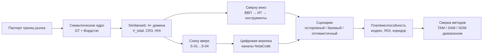

# Список рисунков ЛР2-3 (NotaCode)

## Сгенерированы (Python\*.py)

| № в отчёте | Файл | Что показывает | Скрипт |
|---|---|---|---|
| 1 | fig09_google_trends.png | Google Trends PlantUML и text to diagram, 2021-09…2024-12 | 03_sravnenie_metodov.py |
| 2 | fig01_tam_sam_som_scenarii.png | TAM/SAM/SOM по сценариям (лог. шкала) | 01_tam_sam_som.py |
| 3 | fig03_voronka_bazovyj.png | Цифровая воронка, базовый сценарий | 02_voronka.py |
| 4 | fig04_voronka_scenarii.png | Выручка воронки по сценариям + линия KPI | 02_voronka.py |
| 5 | fig07_similarweb_doli_hhi.png | Доли трафика, HHI, CR3 (ЛР3) | 03_sravnenie_metodov.py |
| 6 | fig08_platezhesposobnost.png | Индекс платёжеспособности и коэффициент оправданности | 03_sravnenie_metodov.py |
| 7 | fig05_sravnenie_som.png | Сверка методов по SOM | 03_sravnenie_metodov.py |
| 8 | fig06_sravnenie_sam.png | Сверка методов по SAM | 03_sravnenie_metodov.py |
| 9 | fig02_tam_sam_som_voronka.png | TAM → SAM → SOM базового сценария разными методами | 01_tam_sam_som.py |

## Сделать самой (скриншоты)

`scr_01…scr_12` – список и содержимое см. `ИНСТРУКЦИЯ_ДЛЯ_МЕНЯ.md`, раздел 2 (Вордстат, Google Trends, Similarweb, eraser.io/pricing, листы Excel после макросов). Нумеровать в отчёте с рисунка 10.

## Схема последовательности методик (по желанию – нарисовать в draw.io / mermaid.live / NotaCode)

