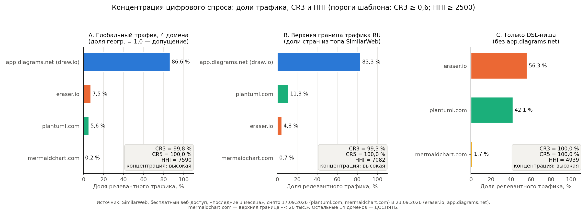
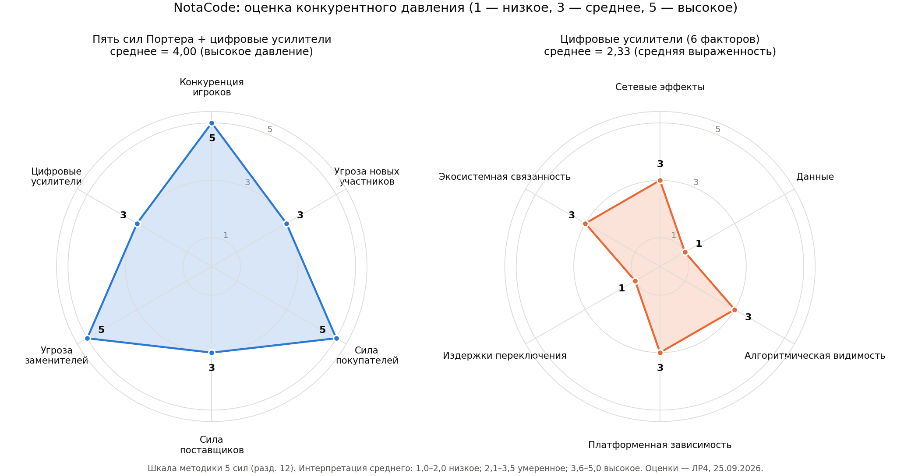
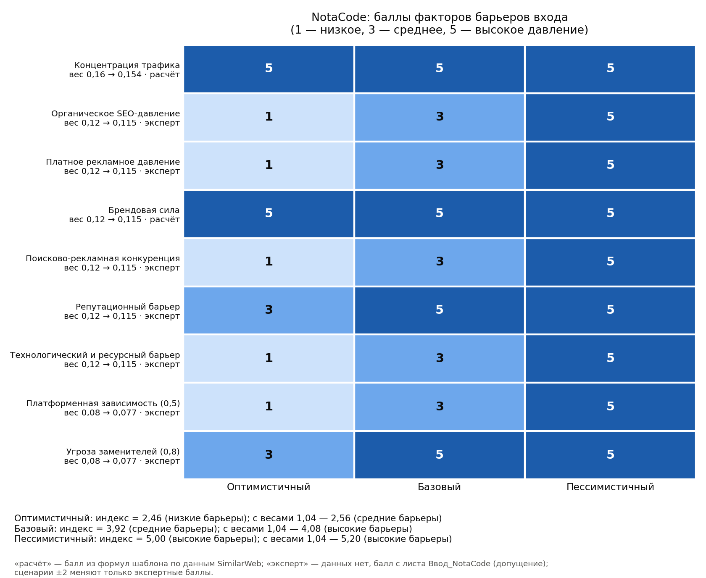

## 1 Цель работы

Цель работы — оценить конкурентную среду рынка, в который входит проект NotaCode, по модели пяти сил Портера с цифровыми факторами [1]. По данным Similarweb и другим источникам нужно получить доказательную оценку уровня конкуренции и барьеров входа [2, 3]. Главный вопрос методики: насколько сложно новому участнику занять заметную позицию в выбранных границах рынка.

NotaCode — Web-IDE (PWA) класса «diagram as code» для формальных нотаций: UML, BPMN 2.0, ERD, IDEF0, IDEF1X, IDEF3, DFD, сети Петри [8]. Продукт работает по модели freemium: Free (5 проектов, 20 версий, экспорт SVG/PNG) и Pro за 4 USD в месяц или 40 USD в год.

## 2 Ход работы

### 2.1 Исходные данные и шкалы оценки

Исходные данные собраны из ранее выполненных работ и открытых источников. Их состав приведён в таблице 1.

Таблица 1 – Исходные данные

| Группа данных | Что использовано | Источник, дата |
|---|---|---|
| Границы рынка | Web-IDE «diagram as code» для формальных нотаций; сегменты S-01…S-04; Беларусь, затем РФ и СНГ | Концепция NotaCode [8], ЛР1 [9] |
| Спрос | Google Trends, мир, 5 лет: PlantUML — средний индекс 41, `text to diagram` — 26, растёт с лета 2025; Беларусь на 5-м, Россия на 4-м месте в мире по интересу к PlantUML | [6], 17.09.2026 |
| Трафик конкурентов | Similarweb, бесплатный веб-доступ, период «последние 3 месяца»: plantuml.com, mermaidchart.com (17.09.2026), eraser.io, app.diagrams.net (23.09.2026) | [5] |
| Конкуренты, цены, модели | Официальные сайты PlantUML, Eraser, D2, Mermaid/MermaidChart | [7] |
| Поставщики, тарифы NotaCode | Free / Pro, BYOK для AI, бесплатные хостинги, платёжный провайдер РБ (риск R-24) | [8] |
| Excel-модель | Шаблон `shablon_excel_ocenka_konkurencii_i_barerov_vhoda_similarweb.xlsx`, заполняется VBA-модулем LR4_NotaCode | [4] |

В работе используются три шкалы, и они не смешиваются:
- в матрице пяти сил — шкала методики 5 сил: 1, 3 или 5 (1 — низкое давление, 3 — среднее, 5 — высокое) [1];
- в Excel-индексе барьеров — баллы шаблона 1/3/5 с весами [4];
- в проверке по 8 критериям методики Similarweb — шкала 1–5, где при неполных данных допускаются промежуточные баллы [3].

Шкала 0–3 из документа об источниках [2] не применяется.

Пометка «(допущение)» означает экспертную оценку без прямых данных. Пометка «🔲 ДОСНЯТЬ» — данные, которые студентке нужно снять самостоятельно.

### 2.2 Описание рынка и его границ

Границы рынка зафиксированы по пяти измерениям методики (таблица 2).

Таблица 2 – Границы рынка NotaCode

| Граница | Значение для NotaCode |
|---|---|
| Продуктовая | Инструменты, в которых диаграмма строгой нотации описывается текстом (DSL) и отрисовывается автоматически. GUI-редакторы и CASE-средства учитываются как заменители |
| Клиентская | S-01 — студенты технических специальностей (первичный сегмент, Free); S-02 — бизнес- и системные аналитики (Pro); S-03 — архитекторы ПО (Pro); S-04 — преподаватели |
| Географическая | Республика Беларусь на старте, затем РФ и СНГ (русскоязычный интерфейс и документация) |
| Канальная | Поиск Google/Яндекс, GitHub, вузовские каналы (кафедры, методички, чаты групп), Telegram и VK-сообщества, PWA в браузере |
| Семантическая | «plantuml онлайн», «uml диаграмма онлайн», «idef0 онлайн», «dfd диаграмма», «bpmn редактор», «er диаграмма онлайн», «сети петри», «diagram as code», «text to diagram» |
| Заменители | draw.io, Visio, Word/PowerPoint, Ramus/BPwin в вузах, LLM (ChatGPT пишет код PlantUML/Mermaid), рисование от руки |

Период анализа Similarweb — «последние 3 месяца» на даты снятия 17.09.2026 и 23.09.2026. Эти параметры внесены в лист 01_Параметры Excel-модели.

### 2.3 Карта игроков рынка

Составлен список из 18 игроков (таблица 3).

Таблица 3 – Игроки рынка и их роль относительно NotaCode

| № | Игрок (домен) | Тип | Роль относительно NotaCode |
|---|---|---|---|
| 1 | app.diagrams.net (draw.io) | GUI-редактор, бесплатный | Заменитель и частичный конкурент, самый массовый редактор диаграмм |
| 2 | eraser.io | Прямой (DSL + AI + канвас) | Ближайший аналог по духу, венчурный SaaS |
| 3 | plantuml.com | Прямой (DSL, open-source) | Стандарт де-факто для UML-as-code |
| 4 | mermaidchart.com | Прямой (DSL, коммерческий) | Платная надстройка над Mermaid |
| 5 | mermaid.live | Прямой (DSL, open-source) | Редактор Mermaid, нативная поддержка в GitHub, GitLab, Notion |
| 6 | d2lang.com | Прямой (DSL) | Современный DSL для архитектурных схем |
| 7 | graphviz.org | Прямой (DSL-движок DOT) | Базовый движок раскладки графов |
| 8 | structurizr.com | Нишевой (C4 DSL) | Архитектура как код, только C4 |
| 9 | gleek.io | Прямой (DSL + AI) | Текст → UML/ERD, freemium |
| 10 | lucidchart.com | GUI SaaS | Частичный конкурент в корпоративном сегменте |
| 11 | miro.com | Платформа-доска | Частичный конкурент, экосистема совместной работы |
| 12 | camunda.com (Modeler) | Нишевой (BPMN) | Исполняемый BPMN |
| 13 | bpmn.io | Нишевой (BPMN, open-source) | Веб-редактор BPMN (bpmn-js) |
| 14 | Ramus (ramussoftware.com) | Нишевой (IDEF0/DFD) | Настольное CASE-средство, распространено в вузах СНГ |
| 15 | Sparx Enterprise Architect | CASE enterprise | UML/BPMN/SysML, платная лицензия |
| 16 | visual-paradigm.com | CASE enterprise | UML/BPMN/ERD, есть онлайн-версия |
| 17 | dbdiagram.io | Нишевой (ERD DSL) | Текст → ER-диаграмма и DDL |
| 18 | kroki.io | Агрегатор-рендер | Единый API к PlantUML, Mermaid, D2, Graphviz; в NotaCode — движок Pro |

Отдельно учтены непрофильные заменители: универсальные LLM-ассистенты, Visio, Word/PowerPoint, рисование от руки. Карточки конкурентов приведены в приложении А.

### 2.4 Таблица пяти сил с цифровой адаптацией

Классическая модель уточнена цифровыми факторами рынка NotaCode (таблица 4).

Таблица 4 – Пять сил Портера с цифровой адаптацией

| Блок | Классическая логика | Цифровое уточнение для NotaCode |
|---|---|---|
| Конкуренция игроков | Соперничество инструментов моделирования | Борьба за поисковую видимость по «uml/idef0/bpmn онлайн», за место в GitHub и IDE-экосистемах, за вузовскую аудиторию |
| Угроза новых участников | Вход новых инструментов | Запуск дешёвый (open-source парсеры, elkjs, LLM API), реальный барьер — доверие, корректность правил нотаций, сообщество |
| Сила покупателей | Давление пользователей на цену | Бесплатные PlantUML, Mermaid, draw.io; сравнение цен мгновенное; данные переносятся текстом |
| Сила поставщиков | Влияние поставщиков ресурсов | Google/Яндекс/GitHub (трафик), LLM-провайдеры, облачные хостинги, платёжный провайдер РБ, лицензии зависимостей (GPL у PlantUML, водяной знак bpmn-js) |
| Угроза заменителей | Иной способ решить задачу | LLM генерирует код диаграммы; draw.io, Ramus, Visio, рисование от руки |
| Цифровые факторы | Не выделяются | Сетевые эффекты стандартов (Mermaid в GitHub), алгоритмическая видимость, экосистемы (Atlassian + draw.io, Microsoft + Visio) |

### 2.5 Оценка конкуренции между существующими игроками

#### 2.5.1 Доли трафика и концентрация

Расчёт выполнен на листе 02_Конкуренты_SW по формулам шаблона [4].

Релевантный трафик игрока:

E_i = V_i · g_i (1)

где V_i – месячные визиты по Similarweb;
g_i – доля целевой географии.

Доля игрока:

s_i = E_i / ΣE (2)

Показатели концентрации:

CR3 = s_1 + s_2 + s_3 (3)

HHI = Σ s_i² · 10 000 (4)

где s_1, s_2, s_3 – три наибольшие доли.

В основном сценарии A берётся глобальный трафик, g_i = 1,0 (допущение). Доля России известна только для plantuml.com — 9,07 % [5]. Результаты расчёта приведены в таблице 5.

Таблица 5 – Доли трафика конкурентов (сценарий A)

| Домен | Визиты за период | Расчёт доли | Доля |
|---|---|---|---|
| app.diagrams.net | 7 800 000 | 7 800 000 / 9 005 500 | 86,61 % |
| eraser.io | 678 500 | 678 500 / 9 005 500 | 7,53 % |
| plantuml.com | 507 000 | 507 000 / 9 005 500 | 5,63 % |
| mermaidchart.com | 20 000 (верхняя граница «< 20 тыс.») | 20 000 / 9 005 500 | 0,22 % |
| Итого | 9 005 500 | – | 100 % |

По формуле (3): CR3 = 86,61 + 7,53 + 5,63 = 99,78 %. Порог шаблона — 60 %.

CR5 = 100 %, так как измерены только 4 домена.

По формуле (4): HHI = (0,8661² + 0,0753² + 0,0563² + 0,0022²) · 10 000 = (0,75019 + 0,00568 + 0,00317 + 0,00000) · 10 000 ≈ 7 590. Порог шаблона — 2 500.

Результат воспроизведён в Excel на копии шаблона: CR3 = 0,9978, HHI = 7 590,4.

#### 2.5.2 Проверка устойчивости вывода

Вывод о концентрации проверен ещё в двух сценариях (таблица 6, рисунок 1).

Таблица 6 – Концентрация трафика по сценариям

| Сценарий | Суть | CR3 | HHI |
|---|---|---|---|
| A | Глобальный трафик 4 доменов | 99,78 % | 7 590 |
| B | Верхняя граница трафика из РФ. plantuml.com — 9,07 % (факт); для app.diagrams.net Россия не в топ-5 стран, значит < 4,35 %; для eraser.io — < 2,88 %; для mermaidchart.com — ≤ 13,65 % | 99,33 % | 7 082 |
| C | Только DSL-ниша, без app.diagrams.net | 100 % | 4 939 |

Рисунок 1 – Доли трафика, CR3 и HHI в трёх сценариях (Similarweb, 17.09.2026 и 23.09.2026)

Во всех сценариях концентрация высокая: CR3 ≥ 99 %, HHI > 4 900. Вывод «лидеры контролируют цифровой спрос» не зависит от допущения о географии.

Ограничение: трафик измерен по 4 доменам из 18. По остальным 14 (d2lang.com, lucidchart.com, miro.com и др.) нужно снять данные — 🔲 ДОСНЯТЬ. Lucidchart и Miro, скорее всего, ещё сильнее увеличат долю GUI-лидеров.

#### 2.5.3 Каналы и брендовая сила

Доля прямых заходов (Direct) по Similarweb: app.diagrams.net — 68,65 %, eraser.io — 49,05 % [5]. Взвешенная доля канала на листе 03_Каналы_трафика считается так:

D = Σ(E_i · d_i) / ΣE (5)

где d_i – доля канала Direct у игрока i.

Подстановка: D = (7 800 000 · 0,6865 + 678 500 · 0,4905) / 9 005 500 = (5 354 700 + 332 804) / 9 005 500 = 0,632.

Это выше порога брендовой силы 0,50, поэтому балл — 5. Значение является нижней границей: брендовый поиск и Direct для plantuml.com и mermaidchart.com не сняты. Доли органики, платного поиска, соцсетей и рефералов — 🔲 ДОСНЯТЬ.

#### 2.5.4 Цены и модели монетизации

Ценовой коридор задают бесплатные продукты [7]:
- PlantUML — open-source без монетизации;
- D2 — open-source, донаты через Hack Club;
- Mermaid — open-source и GitHub Sponsors;
- draw.io — бесплатный;
- Eraser — подписка по местам: Free 0 → Starter 15–20 USD → Business 45–60 USD → Enterprise.

NotaCode Pro за 4 USD в месяц находится в нижней части коридора платных решений.

#### 2.5.5 Вывод по силе

Конкуренция между существующими игроками — высокая (5). На рынке есть бесплатные open-source DSL (PlantUML, Mermaid, D2, Graphviz), массовый GUI-лидер draw.io, венчурный AI-стартап Eraser и корпоративные SaaS (Lucidchart, Miro). У этих игроков есть трафик (CR3 = 99,8 %), бренд (Direct ≥ 63 %) и многолетние сообщества.

### 2.6 Оценка угрозы новых участников

Барьеры входа оценены по перечню методики [1] (таблица 7).

Таблица 7 – Барьеры входа для нового участника

| Барьер входа | Проявление на рынке NotaCode | Уровень |
|---|---|---|
| Трафик и реклама | Англоязычная выдача занята сильными доменами; выдача по «idef0 онлайн», «dfd диаграмма» слабее (🔲 проверить) | средний |
| Доверие | Студентам и преподавателям нужна уверенность, что диаграмма соответствует правилам нотации; у лидеров — годы репутации | высокий |
| Данные и аналитика | Лидеры не получают решающего преимущества от данных, LLM доступны всем | низкий |
| Технологии | Парсер, валидация правил нотаций (ICOM IDEF0, баланс DFD), раскладка, версии, экспорт в 10+ форматов — сложнее простого сайта | средний |
| Платформенные правила | Нет зависимости от маркетплейса; есть ограничения лицензий (GPL PlantUML, водяной знак bpmn-js) | низкий |
| Сетевые эффекты | Mermaid встроен в GitHub/GitLab/Notion, PlantUML — в IDE; это стандарты с эффектом масштаба | средний |
| Open-source и ИИ как ускорители | Позволяют запустить клон за недели | повышает угрозу |

Угроза новых участников — средняя (3). Формальный запуск требует немногого: open-source библиотеки, бесплатные хостинги, LLM API. Но устойчивый поток клиентов зависит от доверия к корректности нотаций, вузовских каналов и сообщества, а на это нужно время.

В старой версии работы стоял балл 5. Он снижен, потому что индекс барьеров входа (подраздел 2.12) равен 3,92 — это верхняя граница «средних барьеров». При таких барьерах угроза входа не может быть высокой.

### 2.7 Оценка силы покупателей

Факторы силы покупателей приведены в таблице 8.

Таблица 8 – Факторы силы покупателей

| Фактор | Для NotaCode | Влияние |
|---|---|---|
| Сравнимость предложений | Тарифы публичны, есть обзоры «PlantUML vs Mermaid vs D2» | усиливает |
| Количество альтернатив | 18 игроков и бесплатные заменители | усиливает |
| Издержки переключения | Текстовые форматы и экспорт в PlantUML/Mermaid/draw.io — потерять почти нечего | усиливает |
| Чувствительность к цене | S-01 — высокая (поэтому Free); S-02/S-03 платят за экономию времени | усиливает |
| Значимость результата | Для S-01 оценка работы зависит от корректности нотации, для S-02 — от качества документации | ослабляет |
| Повторяемость | Диаграммы нужны каждый семестр и в каждом проекте | ослабляет |

Сила покупателей — высокая (5). Клиенты легко сравнивают предложения, у них много бесплатных альтернатив и низкие издержки переключения. Покупатель ослабевает только в узком сценарии: строгие нотации (IDEF0/IDEF3/DFD/сети Петри) с проверкой правил, которую альтернативы не дают.

### 2.8 Оценка силы поставщиков

Поставщики NotaCode и связанные с ними риски приведены в таблице 9.

Таблица 9 – Поставщики и риски зависимости

| Тип поставщика | Для NotaCode | Риск | Смягчение |
|---|---|---|---|
| Трафик | Google, Яндекс, GitHub | Смена алгоритмов, зависимость от выдачи | Вузовские каналы, сообщества |
| Платформы | GitHub, Google Drive (интеграции E7) | Изменение API | Сохранение на устройство и в БД аккаунта |
| Инфраструктура | Netlify/Cloudflare Pages, Render/Fly.io, Neon, Upstash (бесплатные тарифы) | Отмена бесплатных тарифов | Docker, self-hosted |
| AI | Gemini, Groq, OpenRouter, Mistral | Цены и квоты | Заглушка по умолчанию, BYOK, сменный провайдер |
| Платежи | Провайдер, доступный в РБ (риск R-24) | Ограничения международных платежей | Оплата в BYN |
| Лицензии | PlantUML (GPL-3.0), bpmn-js (водяной знак), товарный знак draw.io | Запрет встраивания | Собственный рендер, экспорт вместо встраивания |

Сила поставщиков — средняя (3). NotaCode зависит от поисковиков, GitHub, облачных хостингов, LLM-провайдеров и платёжного провайдера. У каждого из них есть альтернатива без разрушения модели. Наиболее чувствительная точка — приём платежей в РБ.

### 2.9 Оценка угрозы заменителей

Типы заменителей по классификации методики [1] приведены в таблице 10.

Таблица 10 – Заменители NotaCode

| Тип заменителя | Пример | Насколько закрывает задачу |
|---|---|---|
| Прямой | PlantUML, Mermaid, D2, Gleek, Eraser | UML/ER/flowchart — полностью; IDEF/DFD/сети Петри — нет |
| Частичный | draw.io, Lucidchart, Miro, Visio | Любую фигуру, но без проверки правил и без текста |
| Самостоятельное решение | Рисование от руки, Word/PowerPoint | Для отчёта «на глаз» |
| Автоматизированный сервис | Kroki, генераторы по шаблону | Рендер без валидации |
| Искусственный интеллект | ChatGPT/Claude/Gemini пишут код PlantUML/Mermaid | Быстро и бесплатно, но без проверки нотации и версий |
| Обучающий продукт | Методички и курсы по IDEF/BPMN | Учит, но не строит |
| Внутреннее решение | Корпоративные лицензии Sparx EA / Visual Paradigm | Для S-02/S-03 в компаниях |

Угроза заменителей — высокая (5). Клиент может решить ту же задачу через бесплатный draw.io, LLM или привычный Ramus. Наиболее опасны LLM-ассистенты и draw.io: они дают нулевую цену, скорость и доступность. Защитой NotaCode служит валидация правил нотации и AI-ассистент с самопроверкой валидатором.

### 2.10 Оценка дополнительных цифровых факторов

Выраженность шести цифровых факторов оценена по шкале 1/3/5 (таблица 11).

Таблица 11 – Цифровые факторы

| Фактор | Балл | Обоснование |
|---|---|---|
| Сетевые эффекты | 3 | Масштаб помогает лидерам (Mermaid в GitHub/Notion, плагины PlantUML), но для студенческой работы ценность не зависит от числа пользователей |
| Данные | 1 | Данные не дают лидерам устойчивого превосходства, LLM доступны всем |
| Алгоритмическая видимость | 3 | Часть спроса зависит от ранжирования Google/Яндекс и GitHub, но есть вузовские каналы |
| Платформенная зависимость | 3 | GitHub, Google Drive и платёжный провайдер важны, альтернативы есть |
| Издержки переключения | 1 | Текстовые форматы и экспорт, пользователь легко уходит и приходит |
| Экосистемная связанность | 3 | Конкуренция с экосистемами: Atlassian + draw.io, GitHub + Mermaid, Microsoft 365 + Visio, Miro |

Среднее по цифровым факторам:

Ц = Σ b_j / 6 (6)

где b_j – балл j-го цифрового фактора.

Подстановка: Ц = (3 + 1 + 3 + 3 + 1 + 3) / 6 = 14 / 6 = 2,33.

Ближайшее значение шкалы 1/3/5 — 3, оно переносится в сводную матрицу. Радар-диаграммы сил и цифровых факторов показаны на рисунке 2.

Рисунок 2 – Радар-диаграмма пяти сил Портера и цифровых усилителей NotaCode

### 2.11 Сводная матрица баллов и доказательств

Итоговые баллы по всем силам с доказательствами собраны в таблице 12.

Таблица 12 – Сводная матрица пяти сил и цифровых усилителей

| Сила | Оценка | Ключевые доказательства | Источники | Ограничения |
|---|---|---|---|---|
| Конкуренция игроков | 5 | 18 игроков; CR3 = 99,8 %, HHI = 7 590; Direct у лидеров ≥ 63 %; бесплатные open-source лидеры | [5, 7, 9] | Трафик по 4 из 18 доменов, нет выручки |
| Угроза новых участников | 3 | Дешёвый запуск, но доверие к нотациям и каналы требуют времени; индекс барьеров 3,92 | [4, 8] | Нет данных Product Hunt / Crunchbase (🔲 ДОСНЯТЬ) |
| Сила покупателей | 5 | Бесплатные альтернативы, прозрачные цены, нулевое переключение, Free-сегмент студентов | [6, 7] | Нет отзывов G2/Capterra (🔲 ДОСНЯТЬ) |
| Сила поставщиков | 3 | Google/Яндекс/GitHub, LLM (смягчено BYOK), хостинги, платёжный провайдер РБ | [8] | Условия провайдеров могут измениться |
| Угроза заменителей | 5 | draw.io (7,8 млн визитов), LLM, Visio, Ramus, рисование от руки | [5, 7] | Конверсия заменителей не видна |
| Цифровые усилители | 3 | Среднее 6 факторов — 2,33 | Подраздел 2.10 | Экспертные оценки |

Средняя оценка давления:

P = Σ b_k / n (7)

где b_k – балл силы k;
n – число оцениваемых строк матрицы.

Подстановка для шести строк: P = (5 + 3 + 5 + 3 + 5 + 3) / 6 = 24 / 6 = 4,00.

По пяти силам без цифровых усилителей: P = (5 + 3 + 5 + 3 + 5) / 5 = 4,20.

Пороги методики: до 2,0 — низкое давление, 2,1–3,5 — умеренное, 3,6–5,0 — высокое. Значение 4,00 больше 3,5, поэтому давление высокое. Для такого рынка методика рекомендует сильную дифференциацию, бюджет на трафик, доверие, партнёрства или узкую нишу.

Наиболее критичные силы — сила покупателей и угроза заменителей (обе по 5). Итоговая оценка определяется ими, а не числом конкурентов.

Связка «конкуренция × спрос»: по ЛР1 спрос растёт [6]. PlantUML устойчиво растёт 5 лет, `text to diagram` вырос с лета 2025. Рынок попадает в квадрант «высокая конкуренция + высокий спрос»: рынок есть, но вход дорогой, нужны ниша и уникальный канал.

### 2.12 Индекс барьеров входа по Excel-шаблону

#### 2.12.1 Ошибки шаблона и их исправление

При заполнении шаблона найдены семь ошибок (таблица 13).

Таблица 13 – Ошибки Excel-шаблона и исправления

| № | Ошибка | Последствие | Исправление |
|---|---|---|---|
| 1 | 08_Дашборд!A15: строковая константа формулы длиной 265 символов, предел Excel — 255 | Excel не открывает файл (проверено через COM) | Константа разбита на две через «&»; исправленная копия шаблона и та же правка в VBA |
| 2 | 01_Параметры: формулы колонки B сдвинуты на строку (B8 «Дата» = COUNTA, B9 = SUM трафика, B10 пусто) | Неверные параметры | B8 = 25.09.2026, B9 = COUNTA(A4:A33), B10 = SUM(E4:E33) |
| 3 | 07_Барьеры_входа: сумма весов 0,16 + 6 · 0,12 + 2 · 0,08 = 1,04 при подписи «1» | Индекс завышен на 4 %, максимум 5,2; уровень меняется со «средних» на «высокие» | Нормирование w_i / 1,04 |
| 4 | Листы 04/05/06: формулы есть только в строках 4–8, пустая строка даёт индекс 0 и балл 1 | Занижение средних | Формулы протянуты на строки 4–33 с условием «нет данных → пусто» |
| 5 | 05!B38 = AVERAGE(C4:C33+E4:E33+…) — формула массива | Ошибка #ЗНАЧ! | SUM(…)/COUNTA(A4:A33) |
| 6 | 06!B38 складывает две доли (приложение + кабинет) | Может дать больше 100 % | Доля игроков с кабинетом или приложением |
| 7 | 08!D8 — нет интерпретации HHI | – | Добавлена по порогу 01!B13 |

Нормированный вес фактора:

w'_i = w_i / Σw (8)

где w_i – вес шаблона;
Σw = 1,04.

Получаются нормированные веса 0,16 / 1,04 = 0,1538; 0,12 / 1,04 = 0,1154; 0,08 / 1,04 = 0,0769. Их сумма равна 1,00.

#### 2.12.2 Баллы факторов и расчёт индекса

Если данных по фактору нет, балл берётся с листа Ввод_NotaCode (допущение). Колонка J листа 07 показывает источник балла. Когда данные будут досняты, формула сама переключится на расчётный балл. Баллы факторов приведены в таблице 14.

Таблица 14 – Факторы барьеров входа NotaCode

| Фактор | Значение | Балл | Источник балла | Вес норм. | Взвешенный балл |
|---|---|---|---|---|---|
| Концентрация трафика | CR3 99,8 % / HHI 7 590 | 5 | расчёт | 0,1538 | 0,769 |
| Органическое SEO-давление | 🔲 ДОСНЯТЬ | 3 | эксперт | 0,1154 | 0,346 |
| Платное рекламное давление | 🔲 ДОСНЯТЬ | 3 | эксперт | 0,1154 | 0,346 |
| Брендовая сила | ≥ 0,632 | 5 | расчёт (нижняя граница) | 0,1154 | 0,577 |
| Поисково-рекламная конкуренция | 🔲 ДОСНЯТЬ | 3 | эксперт | 0,1154 | 0,346 |
| Репутационный барьер | 🔲 ДОСНЯТЬ | 5 | эксперт | 0,1154 | 0,577 |
| Технологический и ресурсный барьер | цифровая зрелость 50 % | 3 | эксперт | 0,1154 | 0,346 |
| Платформенная зависимость | 0,5 (допущение) | 3 | эксперт | 0,0769 | 0,231 |
| Угроза заменителей | 0,8 (допущение) | 5 | эксперт | 0,0769 | 0,385 |
| Итого | – | – | – | 1,000 | 3,92 |

Индекс барьеров входа:

I = Σ b_i · w'_i (9)

где b_i – балл фактора;
w'_i – нормированный вес по формуле (8).

Подстановка: I = 5 · 0,1538 + (3 + 3 + 5 + 3 + 5 + 3) · 0,1154 + (3 + 5) · 0,0769 = 0,769 + 2,538 + 0,615 = 3,92.

По порогам шаблона (≥ 4 — высокие барьеры, ≥ 2,5 — средние) это средние барьеры у верхней границы. С исходными весами 1,04 получилось бы 4,08, то есть высокие барьеры: ошибка весов меняет вывод. Результат воспроизведён в Excel на исправленной копии шаблона (F13 = 3,92, «средние барьеры»).

#### 2.12.3 Чувствительность индекса к допущениям

Шесть из девяти баллов пока экспертные. Чтобы оценить влияние этих допущений, экспертные баллы сдвинуты на ±2, расчётные оставлены без изменений (рисунок 3):
- оптимистичный сценарий — индекс 2,46 (низкие барьеры);
- пессимистичный сценарий — 5,00 (высокие барьеры).

Поэтому уточнить индекс после досъёма листов 04/05/06 нужно в первую очередь.

Рисунок 3 – Баллы факторов барьеров входа в трёх сценариях и индекс барьеров

#### 2.12.4 Сверка по 8 критериям методики Similarweb

Дополнительно выполнена оценка по 8 критериям методики Similarweb [3] (таблица 15).

Таблица 15 – Оценка по 8 критериям методики Similarweb

| Критерий | Балл | Обоснование |
|---|---|---|
| Количество релевантных конкурентов | 5 | Более 15 активных, есть сильные бренды |
| Концентрация трафика | 5 | Топ-3 = 99,8 % |
| Стоимость входа в каналы | 3 | Смешанная модель: органика, GitHub, вузы и реклама |
| Поисковая конкуренция | 4 (диапазон 3–5) | Англоязычная выдача занята сильными доменами, русская — 🔲 проверить |
| Рекламная конкуренция | 3 | Нет данных рекламных библиотек (🔲 ДОСНЯТЬ) |
| Репутационный барьер | 5 | Многолетние бренды и сообщества |
| Технологический барьер | 4 (диапазон 3–5) | DSL, валидация, раскладка, версии, экспорт |
| Издержки переключения клиента | 2 (диапазон 1–3) | Текстовые форматы |

Среднее: (5 + 5 + 3 + 4 + 3 + 5 + 4 + 2) / 8 = 31 / 8 = 3,88. Это интервал 3,1–4,0, высокий уровень конкуренции.

Три независимые оценки согласуются между собой:
- давление пяти сил — 4,00 (высокое);
- индекс барьеров Excel — 3,92 (средние, у границы высоких);
- 8 критериев Similarweb — 3,88 (высокий уровень).

### 2.13 Итоговый вывод о привлекательности рынка и стратегии входа

Анализ пяти сил Портера с цифровой адаптацией показывает, что конкурентную среду рынка Web-IDE «diagram as code» для формальных нотаций определяют не только прямые конкуренты. На неё также влияют покупатели, поставщики, новые участники, заменители и цифровые факторы.

Наиболее значимые источники давления:
- сила покупателей;
- угроза заменителей;
- концентрация цифрового спроса у лидеров.

Для рынка в целом привлекательность низкая-умеренная. Для узкой ниши она умеренная: строгие методологические нотации с проверкой правил для русскоязычных студентов и преподавателей.

Стратегия входа выбрана по таблице методики «ситуация → стратегия» [3] (таблица 16).

Таблица 16 – Стратегия входа NotaCode

| Ситуация | Стратегия для NotaCode |
|---|---|
| Топ-3 получают почти 100 % трафика | Недообслуженный сегмент (S-01/S-04, строгие нотации) и альтернативный канал: кафедры, методички, чаты групп |
| Высокая сила покупателей | Не конкурировать ценой: Free для студентов, Pro за результат (валидация, версии, экспорт BPMN XML/XMI/PNML, SQL DDL) |
| Высокий репутационный барьер | Пилоты на 1–2 кафедрах, примеры по методичкам вузов РБ, публичные шаблоны, отзывы преподавателей |
| Высокая угроза заменителей (ИИ) | Встроить ИИ: AI-ассистент с самопроверкой валидатором нотации |
| Зависимость от поиска | Русскоязычный контент по запросам «idef0 онлайн», «dfd диаграмма», «сети петри онлайн» (🔲 проверить частотность) |
| Низкие издержки переключения | Импорт из PlantUML/Mermaid/draw.io; удержание через историю версий и проекты в аккаунте |
| Экосистемы конкурентов | Совместимость: экспорт в форматы экосистем, интеграция GitHub/Google Drive |

Дополнительно нужно проверить:
1) трафик и каналы остальных 14 доменов;
2) частотность и CPC русских запросов;
3) отзывы G2/Capterra;
4) условия платёжного провайдера РБ.

## 3 Ответы на контрольные вопросы

1) Адаптированная модель отличается от классической тем, что учитывает борьбу за трафик, данные и алгоритмическую видимость. В неё добавлены цифровые факторы: сетевые эффекты, данные, алгоритмы, платформенная зависимость, издержки переключения и экосистемная связанность.

2) Низкий барьер запуска не означает низкого барьера входа. Сайт или DSL-редактор сделать легко, а получить доверие, отзывы и устойчивый трафик трудно. Для NotaCode это доверие к корректности правил нотаций.

3) Поставщики для интернет-бизнеса: поставщики трафика, платформы продаж, технологическая инфраструктура, платёжная инфраструктура, поставщики данных, профессиональные ресурсы.

4) Типы заменителей: прямой, частичный, самостоятельное решение, автоматизированный сервис, ИИ, обучающий продукт, внутреннее решение. ИИ и обучение закрывают ту же задачу клиента другим способом, поэтому тоже считаются заменителями.

5) Similarweb показывает оценочные визиты, каналы, географию и вовлечённость, но не выручку. Поэтому он даёт только признаки конкуренции, а не прямое её измерение.

6) Доля считается по формуле (2), CR3 — по формуле (3), CR5 — сумма пяти наибольших долей, HHI — по формуле (4). HHI ≥ 2 500 означает высокую концентрацию цифрового спроса.

7) Доля канала переводится в балл так: 5 — если доля не меньше порога; 3 — если не меньше 0,65 порога; иначе 1.

8) Состав индексов:
- поисково-рекламный индекс — CPC, PPC, SEO difficulty, топ-конкуренты и объявления;
- индекс доверия — рейтинги, число отзывов, кейсы, возраст бренда;
- индекс ресурсной силы — финансирование, сотрудники, стек, CRM, приложение, кабинет, объявления, вакансии, патенты.

9) Средняя оценка 2,1–3,5 означает умеренное давление: вход возможен при специализации. Индекс барьеров ≥ 4 означает, что рынок труден для входа и нужны ресурсы или сильное отличие.

10) Одна критичная сила может перевесить сумму остальных. Для NotaCode это бесплатность альтернатив и ИИ-заменители.

11) Если топ-3 получают большую часть трафика, методика рекомендует недообслуженный сегмент, альтернативный канал, партнёрства и контентную специализацию. Если выдача занята агрегаторами и маркетплейсами — использовать платформы как канал, нишевые страницы и брендовые запросы.

12) Три уровня доказательств:
- публичные признаки рынка — не дают выручки;
- оценочные цифровые данные — модельные и неточные для малых сайтов;
- внутренние данные компании — есть только у действующего бизнеса.

## Выводы

В работе проведена оценка конкурентной среды рынка, в который входит NotaCode — Web-IDE класса «diagram as code» для формальных нотаций моделирования. Границы рынка определены по продукту, клиентам, географии, каналам и семантике запросов. Первичный сегмент — студенты технических специальностей Беларуси, вторичные — аналитики и архитекторы ПО, третичный — преподаватели. В карту рынка вошли 18 игроков: прямые DSL-инструменты (PlantUML, Mermaid, D2, Graphviz, Gleek, Eraser), GUI-редакторы (draw.io, Lucidchart, Miro), CASE-средства (Sparx EA, Visual Paradigm, Ramus), нишевые BPMN- и ERD-инструменты и агрегатор Kroki.

Реальные данные Similarweb по четырём доменам показывают крайне высокую концентрацию цифрового спроса: CR3 = 99,78 %, HHI ≈ 7 590 при порогах шаблона 60 % и 2 500. Вывод устойчив к допущению о географии: при верхних границах трафика из РФ CR3 = 99,33 %, HHI = 7 082, а внутри DSL-ниши без draw.io HHI = 4 939. Высокая доля прямых заходов у лидеров (не менее 63 %) говорит о сформированной узнаваемости брендов.

Матрица пяти сил по шкале 1/3/5 выглядит так: конкуренция игроков 5, угроза новых участников 3, сила покупателей 5, сила поставщиков 3, угроза заменителей 5, цифровые усилители 3. Средняя оценка 4,00 превышает порог 3,5 и соответствует высокому давлению. Критичные силы — покупатели и заменители. Бесплатные PlantUML, Mermaid и draw.io, нулевые издержки переключения и генерация кода диаграмм языковыми моделями определяют итог сильнее, чем само число конкурентов.

Индекс барьеров входа по Excel-шаблону равен 3,92, это средние барьеры у верхней границы. В шаблоне найдены и исправлены семь ошибок. Критичных из них две. Строковая константа длиннее 255 символов не позволяла открыть файл в Excel. Сумма весов 1,04 завышала индекс до 4,08 и меняла вывод на «высокие барьеры», поэтому веса нормированы. Шесть из девяти факторов индекса пока оценены экспертно. Анализ чувствительности даёт диапазон 2,46–5,00, так что досъём данных поиска, рекламы, отзывов и технологий приоритетен. Сверка по восьми критериям методики Similarweb (3,88, высокий уровень) согласуется с обеими оценками.

Лобовой вход на рынок в целом малопривлекателен. Умеренно привлекательна ниша строгих методологических нотаций (IDEF0, IDEF3, DFD, сети Петри) с автоматической проверкой правил для русскоязычных студентов и преподавателей. Здесь прямые DSL-конкуренты не работают, а традиционные CASE-средства устарели по UX. Рекомендуемая стратегия:
- вузовские каналы и пилоты на кафедрах;
- бесплатный тариф для студентов и Pro за результат;
- совместимость с форматами лидеров;
- русскоязычный контент по нишевым запросам;
- встроенный AI-ассистент с проверкой сгенерированного кода валидатором нотации.

Выводы носят оценочный характер. Для повышения доказательности нужно снять данные Similarweb по остальным 14 доменам в один день, частотность и стоимость клика русских запросов, отзывы G2/Capterra и данные рекламных библиотек.

## Список использованных источников

1. Методика «Пять сил Портера для электронного бизнеса» [Электронный ресурс] : учеб.-метод. материалы по дисциплине «Электронный бизнес». – Файл metodika_5_sil_portera_elektronnyy_biznes.docx. – Дата доступа: 25.09.2026.
2. Источники данных по пяти силам Портера [Электронный ресурс] : учеб.-метод. материалы. – Файл istochniki_dannyh_po_5_silam_portera_elektronnyy_biznes.docx. – Дата доступа: 25.09.2026.
3. Методика оценки уровня конкуренции и барьеров входа по Similarweb [Электронный ресурс] : учеб.-метод. материалы. – Файл metodika_ocenki_urovnya_konkurencii_i_barerov_vhoda_similarweb.docx. – Дата доступа: 25.09.2026.
4. Excel-шаблон оценки конкуренции и барьеров входа [Электронный ресурс]. – Файл shablon_excel_ocenka_konkurencii_i_barerov_vhoda_similarweb.xlsx. – Дата доступа: 25.09.2026.
5. Similarweb. Website Traffic Analysis [Электронный ресурс]. – Режим доступа: https://www.similarweb.com/website/. – Дата доступа: 17.09.2026, 23.09.2026.
6. Google Trends [Электронный ресурс]. – Режим доступа: https://trends.google.com/. – Дата доступа: 17.09.2026.
7. Официальные сайты PlantUML, Eraser, D2, Mermaid [Электронный ресурс]. – Режим доступа: https://plantuml.com/, https://www.eraser.io/, https://d2lang.com/, https://mermaid.js.org/. – Дата доступа: 23.09.2026.
8. NotaCode. Концепция проекта, BRD, Vision & Scope [Электронный ресурс] : проектная документация. – Дата доступа: 25.09.2026.
9. Хаджинова, К. Лабораторные работы № 1–5 по дисциплине «Электронный бизнес» (версия DiagramCode) [Электронный ресурс]. – Дата доступа: 25.09.2026.

## Приложение А (обязательное) Карточки конкурентов

Поля карточки заданы методикой Similarweb [3]. Технологии проверяются через Wappalyzer/BuiltWith, реклама — через Google Ads Transparency Center и Meta Ad Library. Карточки приведены в таблице А.1.

Таблица А.1 – Карточки конкурентов NotaCode

| Конкурент | Роль | Трафик и динамика | Каналы | География | Репутация | Цены | Технологии / кабинет | Реклама | Вывод по барьеру |
|---|---|---|---|---|---|---|---|---|---|
| app.diagrams.net (draw.io) | Заменитель, GUI | 7,8 млн визитов за 3 мес. (23.09.2026) | Direct 68,65 %, остальное 🔲 ДОСНЯТЬ | США 10,89 %, Индия 8,29 %, Индонезия 6,29 %, Китай 4,62 %, Вьетнам 4,35 % | Массовый бренд, встроен в Confluence и Google Drive | Бесплатно | Без аккаунта; 2,98 стр./визит; отказы 55,5 % | 🔲 ДОСНЯТЬ | Бренд и бесплатность не повторить; обходить за счёт строгости нотаций |
| eraser.io | Прямой | 678,5 тыс.; Global Rank #70 444 | Direct 49,05 %, затем органика | Индия 40,81 %, США 8,61 %, ЮАР 2,88 % | Венчурный SaaS, G2 — 🔲 ДОСНЯТЬ | Free / 15–20 / 45–60 USD / Enterprise | Аккаунт, AI, MCP, git-синхронизация; 3,57 стр./визит, 99 с, отказы 43,73 % | 🔲 ДОСНЯТЬ | Сильный AI и продукт, но нет IDEF/DFD/сетей Петри и русскоязычной аудитории |
| plantuml.com | Прямой | Около 507 тыс.; ранг упал с #74 025 до #93 517; −27,81 % за месяц | 🔲 ДОСНЯТЬ | Россия 9,07 % (топ-1) | С 2009 г., стандарт в IDE/CI | Бесплатно (GPL) | Без аккаунта, локальный рендер | 🔲 ДОСНЯТЬ | Стандарт де-факто; NotaCode экспортирует в PlantUML, а не конкурирует лоб в лоб |
| mermaidchart.com | Прямой | Менее 20 тыс. | 🔲 ДОСНЯТЬ | Вьетнам 44,98 %, Индонезия 26,27 %, США 15,1 % | Бренд Mermaid | 🔲 ДОСНЯТЬ | Аккаунт | 🔲 ДОСНЯТЬ | Русскоязычный сегмент почти не представлен |
| mermaid.live | Прямой | 🔲 ДОСНЯТЬ | 🔲 | 🔲 | Нативно в GitHub/GitLab/Notion | Бесплатно | Без аккаунта | 🔲 | Сетевой эффект стандарта |
| d2lang.com | Прямой | 🔲 ДОСНЯТЬ | Homebrew/Winget, GitHub, Discord | 🔲 | Open-source, Hack Club | Бесплатно | CLI, плагины VS Code/Vim | 🔲 | Качественная раскладка, нет строгих нотаций |
| graphviz.org | Прямой (движок) | 🔲 ДОСНЯТЬ | 🔲 | 🔲 | С 1990-х, стандарт DOT | Бесплатно | Библиотека/CLI | 🔲 | Инфраструктура, а не продукт для студентов |
| structurizr.com | Нишевой | 🔲 ДОСНЯТЬ | 🔲 | 🔲 | Эталон C4 | 🔲 | Аккаунт (облако) | 🔲 | Только C4 |
| gleek.io | Прямой | 🔲 ДОСНЯТЬ | 🔲 | 🔲 | 🔲 | Freemium | Аккаунт, AI | 🔲 | Близкий UX «текст → UML/ERD», нет IDEF/DFD |
| lucidchart.com | Частичный | 🔲 ДОСНЯТЬ | 🔲 | 🔲 | Много отзывов G2/Capterra (🔲 ДОСНЯТЬ) | Freemium / подписка | Аккаунт, мобильное приложение, AI | 🔲 | Корпоративная экосистема и ресурсы |
| miro.com | Частичный, платформа | 🔲 ДОСНЯТЬ | 🔲 | 🔲 | 🔲 | Freemium | Аккаунт, мобильное приложение | 🔲 | Экосистема совместной работы |
| camunda.com (Modeler) | Нишевой BPMN | 🔲 ДОСНЯТЬ | 🔲 | 🔲 | 🔲 | Modeler бесплатен, платформа платная | Аккаунт (SaaS) | 🔲 | Исполняемый BPMN вне охвата NotaCode |
| bpmn.io | Нишевой BPMN | 🔲 ДОСНЯТЬ | 🔲 | 🔲 | Open-source | Бесплатно (водяной знак) | Без аккаунта | 🔲 | Только BPMN |
| Ramus | Нишевой IDEF0/DFD | 🔲 ДОСНЯТЬ | 🔲 | СНГ (вузы) | Вузовская практика | Educational бесплатно | Настольное приложение | 🔲 | Привычка вузов при устаревшем UX — главный заменитель для S-01 |
| Sparx EA | CASE | 🔲 ДОСНЯТЬ | 🔲 | 🔲 | 🔲 | Платная лицензия | Настольное приложение | 🔲 | Корпоративный сегмент S-03 |
| visual-paradigm.com | CASE | 🔲 ДОСНЯТЬ | 🔲 | 🔲 | 🔲 | Community / платно | Аккаунт (онлайн-версия) | 🔲 | Широкий охват нотаций без DSL |
| dbdiagram.io | Нишевой ERD | 🔲 ДОСНЯТЬ | 🔲 | 🔲 | 🔲 | Freemium | Аккаунт | 🔲 | Сильный в ERD → DDL |
| kroki.io | Агрегатор | 🔲 ДОСНЯТЬ | 🔲 | 🔲 | Open-source | Бесплатно | API | 🔲 | Поставщик-движок для NotaCode Pro, не конкурент |

Признаки «аккаунт / приложение» взяты с публичных сайтов, их нужно перепроверить. Доля игроков с аккаунтом или приложением — 9 из 18, то есть 50 %. Это средняя цифровая зрелость.

## Приложение Б (справочное) Журнал источников

Одна строка журнала — один источник, один период и одна аналитическая задача (таблица Б.1). Помимо Similarweb использованы три независимых источника: Google Trends, официальные сайты конкурентов и документация NotaCode.

Таблица Б.1 – Рабочий журнал источников

| Дата | Сила Портера | Аналитический пункт | Источник | Период / география | Показатели | Вывод | Ограничения |
|---|---|---|---|---|---|---|---|
| 17.09.2026 | Конкуренция | Трафик конкурентов | Similarweb (plantuml.com, mermaidchart.com) | 3 мес. / мир | Визиты, Global Rank, топ-страны | PlantUML около 507 тыс., Россия — топ-1 страна; MermaidChart < 20 тыс. | Оценочные данные |
| 23.09.2026 | Конкуренция, заменители | Трафик и каналы | Similarweb (eraser.io, app.diagrams.net) | 3 мес. / мир | Визиты, Direct, стр./визит, отказы | draw.io 7,8 млн (86,6 %), Eraser 678,5 тыс. | Другая дата, чем у первых двух доменов |
| 25.09.2026 | Конкуренция | Концентрация | Расчёт по шаблону | Те же | CR3, CR5, HHI | CR3 = 99,8 %, HHI = 7 590 | 4 из 18 доменов |
| 17.09.2026 | Покупатели, заменители | Спрос и тренды | Google Trends | 5 лет / мир, регионы | Индекс 0–100, регионы | PlantUML в среднем 41; Беларусь #5; `text to diagram` растёт | Относительный индекс |
| 17.09.2026 | Конкуренция, покупатели | Цены и модели | Сайты PlantUML, Eraser, D2, Mermaid | Текущие | Тарифы, модель доходов | Коридор задают бесплатные продукты | Декларации компаний |
| 25.09.2026 | Поставщики | Инфраструктура, платежи, AI, лицензии | Документация NotaCode | РБ | Тарифы, лицензии | Средняя зависимость, альтернативы есть | Внутренние допущения |
| 🔲 ДОСНЯТЬ | Конкуренция | Трафик 14 доменов | Similarweb | 3 мес., одна дата | Визиты, доля RU/BY, каналы | – | – |
| 🔲 ДОСНЯТЬ | Новые участники, поиск | Частотность и CPC | Яндекс Вордстат, Google Keyword Planner | 12 мес. / РБ, РФ | Показы, CPC | – | Нужен Яндекс ID |
| 🔲 ДОСНЯТЬ | Покупатели | Отзывы | G2 / Capterra | Категория Diagramming | Рейтинг, число отзывов | – | Смещение отзывов |
| 🔲 ДОСНЯТЬ | Конкуренция | Реклама | Google Ads Transparency, Meta Ad Library | 12 мес. / РБ, РФ | Число объявлений | – | Нет бюджета |
| 🔲 ДОСНЯТЬ | Новые участники, заменители | Open-source и запуски | GitHub, Product Hunt | 12 мес. | Звёзды, запуски | – | Не равно выручке |

## Приложение В (справочное) Исправления Excel-шаблона и VBA

Для работы с шаблоном подготовлены исправленная копия файла (`Excel/shablon_ocenka_barerov_ISPRAVLEN.xlsx`) и VBA-модуль LR4_NotaCode (макрос Main). Модуль:
- создаёт лист Ввод_NotaCode с экспертными баллами и нормированными весами;
- чинит лист 01_Параметры;
- вносит 18 конкурентов и 10 запросов, помечая недоснятые ячейки оранжевым;
- защищает формулы листов 04–06 от пустых строк;
- переключает баллы листа 07 между расчётными и экспертными;
- добавляет лист 10_Портер_NotaCode с матрицей пяти сил;
- заполняет журнал 09_Источники.

Ключевые формулы модуля проверены в Excel: CR3 = 0,9978; HHI = 7 590,4; сумма весов 1,00; индекс 3,92.
