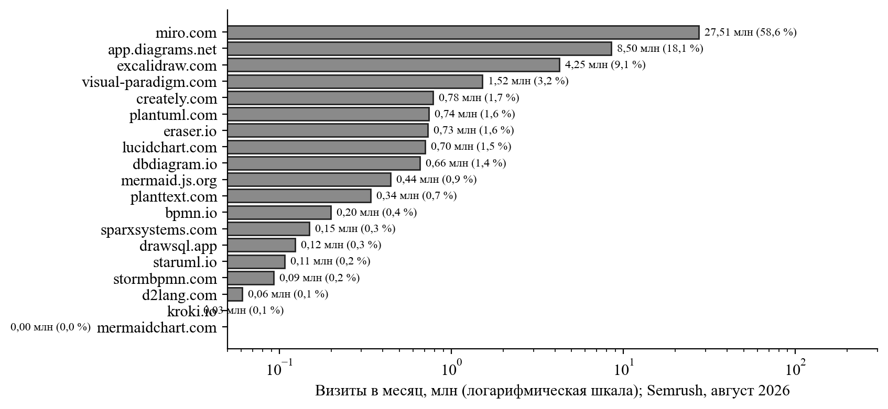

## 1 Цель работы

Оценить конкурентную среду рынка проекта NotaCode адаптированной моделью пяти сил Портера с цифровыми факторами и получить доказательную оценку уровня конкуренции и барьеров входа по данным Similarweb и альтернативных источников [1, 2, 3]. Главный вопрос оценки: насколько сложно новому участнику занять заметную позицию в выбранных границах рынка [3].

Задачи работы: описать границы рынка и конкурентную группу; рассчитать доли трафика, показатели концентрации CR3, CR5 и HHI; оценить каждую из пяти сил и цифровые факторы по шкалам методик; заполнить Excel-шаблон оценки конкуренции и барьеров входа [4]; сопоставить расчёт по шаблону (основной вариант) с расчётом по тексту методик (вариант Word); сформулировать вывод о привлекательности рынка и условиях входа.

Проект: NotaCode – веб-IDE (PWA) «диаграммы как код» для UML, BPMN 2.0, ERD, IDEF0/IDEF1X/IDEF3, DFD и сетей Петри; тарифная модель freemium – Free и Pro за 4 USD в месяц (40 USD в год) [5]. Продукт находится до выпуска минимальной версии (MVP), поэтому собственных данных о конверсии, стоимости привлечения и удержании нет; это ограничение учитывается в каждом разделе оценки.

## 2 Ход работы

### 2.1 Границы рынка и исходные данные

Методика пяти сил применяется после фиксации границ рынка и оценки спроса (ЛР1), а также объёма рынка (ЛР2-3), но до окончательного вывода о привлекательности рынка и стратегии входа [1, 3]. Границы рынка определяют, какие игроки попадают в конкурентную группу и какая география учитывается при расчёте релевантного трафика.

Таблица 1 – Паспорт границ рынка NotaCode

| Поле | Значение |
|---|---|
| Название рынка | Рынок веб-инструментов построения и проверки диаграмм формальных нотаций (UML, BPMN, ERD, IDEF, DFD) для студентов и специалистов по разработке ПО в Беларуси с расширением на русскоязычный сегмент СНГ (ЛР1, табл. 45) [7] |
| Продуктовые границы | Входят: онлайн-редакторы и генераторы диаграмм по текстовому описанию (PlantUML, Mermaid, D2), UML/BPMN-редакторы, универсальные графические редакторы (draw.io, Lucidchart) в части построения нотационных диаграмм. Не входят: универсальные доски для мозгового штурма (Miro, Figma) как самостоятельный рынок, корпоративные CASE-платформы уровня предприятия, курсы программирования общего профиля (ЛР1, табл. 43, шаги 3 и 11) [7] |
| Клиентские границы | Студенты технических специальностей (тариф Free; 229,0 тыс. студентов учреждений высшего образования Беларуси, 2025/26 учебный год), аналитики и архитекторы ПО (Pro), преподаватели как канал влияния. Численность сегментов: S-01 – 229 000, S-02/S-03 – 130 549, S-04 – 17 100 (ЛР1, табл. 41, 43; ЛР2-3, табл. 36) [7, 8] |
| Географические границы | Республика Беларусь (основная). Российская Федерация и СНГ – отдельная гипотеза расширения, в индекс барьеров не смешивается. Спрос сконцентрирован в Минске: индекс интереса Вордстата 194,99 против 127,61 по стране (ЛР1, табл. 43, шаг 8) [7] |
| Канальные границы | Поисковые системы (Google и Яндекс), сообщества разработчиков, вузовские каналы; интернетом пользуется 94,3 % населения (ЛР1, табл. 41, 43) [7] |
| Объём рынка и уровень спроса | Доступный рынок по клиентской базе (SAM) 49 893 – 414 754 BYN в год, базовая оценка 197 988 BYN (около 65 375 USD по курсу 3,0285 BYN/USD на 30.09.2026), около 1 634 платящих пользователей; достижимая выручка первого года (SOM) 249 – 16 590 BYN. Сводный индекс поискового спроса 49,1 – средний уровень (ЛР2-3, табл. 13, 80, 84); интерес к UML и BPMN за год снизился на 42,7 – 46,7 % (ЛР1, табл. 21, 33) [7, 8] |
| Собственные данные NotaCode | Отсутствуют: продукт до MVP; ограничение учитывается в оценке силы покупателей |

Данные по уровням доказательств делятся на публичные открытые, оценочные цифровые, профессиональные базы, официальную статистику и собственные данные [2]. Для типа бизнеса «SaaS / B2B-сервис» приоритетны G2, Capterra, TrustRadius, Crunchbase, Similarweb, Ahrefs, Semrush, BuiltWith, Wappalyzer и LinkedIn [2]. Все оценки Similarweb являются моделью, а не измерением: они показывают распределение цифровой видимости, а не выручку [3].

### 2.2 Адаптированная модель пяти сил и порядок работы

Классические пять сил сохраняются, но дополняются цифровыми факторами: трафиком, данными, сетевыми эффектами, алгоритмической видимостью, издержками переключения и платформенной зависимостью [1]. Схема модели приведена на рисунке 2.

Рисунок 1 – Адаптированная модель пяти сил Портера с цифровыми факторами

Таблица 2 – Адаптированная модель пяти сил Портера [1, табл. 7]

| Блок анализа | Классическая логика | Цифровое уточнение |
|---|---|---|
| Конкуренция между существующими игроками | Соперничество между компаниями внутри рынка | Борьба за трафик, поисковую видимость, рейтинги, отзывы, данные, скорость сервиса и удержание |
| Угроза новых участников | Вероятность входа новых компаний и снижения прибыльности | Формальный вход дешёвый, но реальный вход ограничен рекламными затратами, доверием, алгоритмами, данными и платформенными правилами |
| Сила покупателей | Способность клиентов давить на цену и условия | Покупатель легко сравнивает предложения, отзывы и цены, но может быть связан подпиской, данными, бонусами или интеграциями |
| Сила поставщиков | Способность поставщиков влиять на стоимость и условия работы | Поставщиками становятся рекламные платформы, поисковые системы, маркетплейсы, облака, платёжные сервисы и владельцы данных |
| Угроза заменителей | Риск, что клиент решит задачу другим продуктом | Заменителем может быть самостоятельное решение, автоматизация, платформа, искусственный интеллект, обучение или другой цифровой инструмент |
| Дополнительные цифровые факторы | В классической модели не выделяются отдельно | Сетевые эффекты, данные, алгоритмическая видимость, издержки переключения, экосистемная зависимость |

Порядок работы по методике [1]: зафиксировать рынок; составить список прямых и частичных конкурентов и цифровых альтернатив; оценить каждую силу по единой шкале; собрать подтверждающие данные; отдельно оценить цифровые усилители; свести оценки в матрицу; сформулировать вывод о привлекательности рынка (высокая, умеренная, низкая); определить стратегические последствия. Оценка конкуренции и барьеров входа по Similarweb выполняется по восьми шагам: список из 10–30 конкурентов, проверка доменов, единая таблица показателей, доли трафика, концентрация, канальное давление, географическая релевантность, перевод в баллы [3].

В работе выполняются четыре системы оценки, которые не смешиваются: матрица пяти сил по шкале 1–5 (А) и матрица по шкале 0–3 с доказательствами (Б) оценивают силы; индекс конкурентного давления по восьми критериям (В) и индекс барьеров входа Excel-шаблона (Г) оценивают уровень конкуренции и барьеры входа. Итоговый вывод опирается на все четыре и называет расхождения между ними.

### 2.3 Конкурентная группа, данные Similarweb и расчётные показатели

#### 2.3.1 Конкурентная группа

Список конкурентов формируется из границ рынка и «похожих сайтов» Similarweb; затем каждый домен проверяется, и остаются только релевантные сайты внутри границ рынка [3]. Для выборки нужно не менее 10 строк и не более 30 [3, 4]. Кандидаты для проверки перечислены в таблице 3.

Таблица 3 – Кандидаты в конкурентную группу (до проверки релевантности)

| № | Домен | Группа и роль | Проверка релевантности (главная страница, границы ЛР1), 30.09.2026 |
|---|---|---|---|
| 1 | plantuml.com | Текстовые DSL, прямой | прошёл: основная задача - диаграммы UML из текста |
| 2 | mermaid.js.org | Текстовые DSL, прямой | прошёл: диаграммы из текста и кода |
| 3 | mermaidchart.com | Текстовые DSL, прямой | прошёл: сервис диаграмм на основе Mermaid |
| 4 | d2lang.com | Текстовые DSL, прямой | прошёл: язык диаграмм D2 |
| 5 | kroki.io | Текстовые DSL, прямой | прошёл: отрисовка диаграмм из текста через API |
| 6 | planttext.com | Текстовые DSL, прямой | прошёл: онлайн-редактор PlantUML |
| 7 | staruml.io | UML/BPMN-редактор, прямой | прошёл: программа для моделирования UML |
| 8 | visual-paradigm.com | UML/BPMN-редактор, прямой | прошёл: платформа UML, BPMN, архитектуры |
| 9 | sparxsystems.com | UML/BPMN-редактор, прямой | прошёл: Enterprise Architect (UML, BPMN); главная страница недоступна автоматическим запросам, отнесение по границам ЛР1, табл. 44 |
| 10 | bpmn.io | UML/BPMN-редактор, прямой | прошёл: редактор и библиотека BPMN |
| 11 | camunda.com | UML/BPMN-редактор, прямой (Modeler) | не прошёл: главная страница - платформа оркестрации процессов; трафик домена не отражает редактор Modeler, который учтён как частичный заменитель (ЛР1, табл. 44) |
| 12 | stormbpmn.com | UML/BPMN-редактор, прямой (русскоязычный) | прошёл: редактор BPMN в составе платформы процессного управления |
| 13 | app.diagrams.net | Универсальный редактор, косвенный | прошёл: универсальный редактор диаграмм (косвенный) |
| 14 | lucidchart.com | Универсальный редактор, косвенный | прошёл: универсальный редактор диаграмм (косвенный); главная страница недоступна автоматическим запросам |
| 15 | creately.com | Универсальный редактор, косвенный | прошёл: универсальный редактор диаграмм (косвенный) |
| 16 | miro.com | Универсальный редактор, косвенный | прошёл как косвенный заменитель: универсальная доска (вне продуктовых границ как самостоятельный рынок, ЛР1) |
| 17 | excalidraw.com | Универсальный редактор, косвенный | прошёл как косвенный заменитель: доска со схемами |
| 18 | dbdiagram.io | ERD, прямой | прошёл: схемы баз данных (ERD) |
| 19 | drawsql.app | ERD, прямой | прошёл: схемы баз данных (ERD) |
| 20 | eraser.io | AI-генерация диаграмм | прошёл: генерация технических диаграмм (AI) |
| 21 | microsoft.com/visio | Универсальный редактор, косвенный | не включён в расчёт: домен-раздел, трафик отдельно не виден; 🔲 ДОСНЯТЬ: трафик Visio (платный Similarweb или Semrush, домен microsoft.com) |

Домен раздела microsoft.com/visio не имеет отдельного трафика в публичных данных, поэтому в расчёт не включается и показан отдельной строкой 21 таблицы 3: 🔲 ДОСНЯТЬ: трафик Visio – платный Similarweb или Semrush по домену microsoft.com. Универсальные чат-сервисы с AI в конкурентную группу не входят (вне продуктовых границ), но учитываются в силе заменителей. Названия mermaid, d2, erd, whimsical, miro и visio совпадают со словами обычного языка, поэтому для каждого бренда проверяются выдача и связанные запросы до использования брендовых частотностей (в таблице 8 для d2lang и mermaidchart значение 0, запрос «kroki» возможно омонимичен).

Проверка релевантности по «похожим сайтам» Similarweb не выполнена: доступ закрыт (раздел 2.3.2). Вместо неё применено правило: кандидат проходит, если на 30.09.2026 сайт доступен и его основная задача – построение диаграмм в продуктовых границах ЛР1 (универсальные редакторы – как косвенные заменители), а домен платформы, где редактор является лишь частью продукта, не проходит (допущение Р-11, Приложение Б). Из 20 кандидатов прошли проверку 19; не прошёл camunda.com. Карточки составлены на 19 доменов.

#### 2.3.2 Показатели Similarweb

Фиксируются посещаемость и динамика, вовлечённость, география, каналы, поисковые запросы, рефералы, социальный трафик и похожие сайты [3]. Все снимки делаются одной датой и за один период, чтобы данные были сопоставимы [3]. Бесплатный доступ Similarweb показывает ограниченное число стран, поэтому доля Беларуси в трафике может быть недоступна; в этом случае значение не подставляется, а отмечается «недоступно в бесплатном доступе».

Таблица 4 – Данные Similarweb по конкурентам

| Показатель | Значение |
|---|---|
| Дата снимка и период | Единый снимок Similarweb на группу не получен: 30.09.2026 страницы plantuml.com и miro.com вернули ответ 403 («Request blocked») при трёх обращениях, обход не выполнялся (скриншот «Скриншоты/similarweb_plantuml.com_otkaz_dostupa_403_2026-09-30.jpg»). Справочно: Similarweb в ЛР2-3 – август 2026, последние 3 месяца, 4 домена, значения сняты в разные даты; Semrush – август 2026, страницы обновлены 17.09.2026 [8, 9] |
| Визиты, динамика, каналы, вовлечённость по каждому домену | 🔲 ДОСНЯТЬ: similarweb.com/website/<домен>, последние 3 месяца, один день для всех 19 доменов – визиты, динамика, каналы, длительность, страниц за визит, отказы; выполняется вручную в сессии пользователя. Значения ЛР2-3 (plantuml.com – 507 000 визитов; app.diagrams.net – 7,8 млн по ЛР1; eraser.io – 678,5 тыс. и mermaidchart.com – менее 20 тыс. по предварительному замеру 17–23.09.2026) сняты в разные даты и в расчёт не включены |
| Доля целевой географии (Беларусь) | Недоступно в бесплатном доступе: Similarweb показывает пять стран, Беларусь среди них у plantuml.com не показана (ЛР2-3, табл. 17). В Excel по всем доменам отмечено «🔲 недоступно в бесплатном доступе», релевантный трафик E = 0. Допущение ЛР2-3 о доле Беларуси (Д-01, 0,1958 %) в ЛР4 не применяется |
| Брендовый поиск, paid social | Недоступно в бесплатном доступе; 🔲 ДОСНЯТЬ: платный Similarweb или Semrush/Ahrefs |

Справочный источник для сырых визитов – публичные страницы Semrush Website Overview (август 2026, все устройства, весь мир). В публичном индексе оказались 9 из 22 проверенных адресов (таблица 5); для draw.io и diagrams.net страницы отдельные, во избежание двойного счёта продукта в расчёте используется diagrams.net. Значения Semrush и Similarweb – разные оценочные модели и не смешиваются: для diagrams.net (Semrush 8,11 млн) и eraser.io (691 130) они близки к данным Similarweb из ЛР1 и ЛР2-3 (7,8 млн и 678,5 тыс.), что служит лишь проверкой порядка величин.

Таблица 5 – Визиты доменов с данными Semrush, август 2026

| Домен | Визиты в месяц, август 2026 | Доля в сумме восьми доменов | Authority Score |
|---|---|---|---|
| miro.com | 30 640 000 | 65,1 % | 74 |
| diagrams.net | 8 110 000 | 17,2 % | 61 |
| excalidraw.com | 5 120 000 | 10,9 % | 54 |
| visual-paradigm.com | 1 500 000 | 3,2 % | 60 |
| eraser.io | 691 130 | 1,5 % | 47 |
| creately.com | 683 210 | 1,5 % | 58 |
| planttext.com | 209 920 | 0,4 % | 39 |
| draw.io | 185 840 | не включён (отдельный домен продукта diagrams.net) | 44 |
| bpmn.io | 129 980 | 0,3 % | 39 |
| Домены без страницы в публичном индексе | 13 из 22 проверенных адресов | - | - |

Рисунок 2 – Визиты доменов с данными Semrush, август 2026 (логарифмическая шкала; в скобках доля в сумме восьми доменов)

#### 2.3.3 Формулы расчёта

Доля трафика конкурента в суммарном трафике группы:

s_i = V_i / ΣV_j × 100 % (1)

где V_i – месячные визиты i-го релевантного конкурента (вариант Word) либо релевантный трафик E_i = V_i × g_i, где g_i – доля целевой географии (вариант Excel).

Концентрация по долям крупнейших игроков:

CR3 = s(1) + s(2) + s(3), CR5 = s(1) + … + s(5) (2)

где s(k) – k-я по величине доля.

Оценочный индекс концентрации:

HHI = Σ s_i² (3)

В Excel-шаблоне доли выражены в долях единицы, а сумма квадратов умножается на 10 000 [4]. Пороги шаблона: CR3 – 0,6; CR5 – 0,75; HHI – 2500 [4].

Канальное давление оценивается взвешенной по релевантному трафику долей канала: C = Σ(E_i × d_i) / ΣE_i, где d_i – доля канала у i-го конкурента. Балл канала равен 5, если C не меньше порога D; 3, если C не меньше 0,65 × D; иначе 1 [4].

#### 2.3.4 Концентрация трафика: два варианта расчёта

Таблица 6 – Доли трафика, CR3, CR5 и HHI (О1)

| Показатель | Основной расчёт (Excel: релевантный трафик E = визиты × доля географии) | Сравнительный расчёт (Word: сырые визиты релевантных сайтов) |
|---|---|---|
| Суммарный трафик группы | Не определён: доля Беларуси недоступна, E = 0 по всем доменам | 46 938 036 визитов в месяц по 19 доменам с данными Semrush (август 2026); по остальным 11 доменам данных нет |
| Три крупнейших игрока | Не определяются (E = 0) | miro.com (65,1 %), diagrams.net (17,2 %), excalidraw.com (10,9 %) |
| CR3 | 0 % (артефакт E = 0, не измерение) | 85,8 % |
| CR5 | 0 % (артефакт E = 0) | 90,7 % |
| HHI | 0 (артефакт E = 0) | 3 869 |
| Балл концентрации (лист 07, D4) | Формально 1, так как CR3 = 0 при E = 0; значение не отражает концентрацию | 5: топ-3 контролируют большую часть видимого трафика; те же пороги шаблона (CR3 не ниже 0,6), применённые к сырым визитам, также дают 5 |

Переход от сырых визитов к релевантному трафику в Excel выполнить нельзя: доля Беларуси неизвестна, поэтому E = 0, а нулевые CR3, CR5 и HHI и формальный балл 1 в Excel – результат отсутствия данных, а не признак низкой концентрации. Расхождение между вариантами – 0 % и балл 1 (Excel) против 85,8 % и балл 5 (Word). Без miro.com (универсальная доска вне продуктовых границ ЛР1, табл. 43) по семи доменам: сумма 19 428 036 визитов, CR3 73,4 %, CR5 81,3 %, HHI 2 533, балл 5; вывод о высокой концентрации видимого трафика сохраняется. Справочно, Similarweb в ЛР2-3 (четыре домена, другая дата): CR3 99,8 %, HHI около 7 590 [8]. Оценки неполны: у 11 доменов данных нет, а универсальные сервисы включают трафик, не связанный с нотационными диаграммами. Расчёт выполнен программой (Python, lr4_calc.py) по формулам шаблона; сверка с ячейками Excel – раздел 2.11.4.

#### 2.3.5 Каналы, поиск и вовлечённость

Таблица 7 – Взвешенные доли каналов трафика и баллы (Excel, лист 03; О3–О5, О10)

| Канал | Порог D | Основной расчёт (взвешенная доля C, балл) | Вариант Word |
|---|---|---|---|
| Прямой | 0,30 | 🔲 не рассчитывается: нет данных Similarweb по каналам | доля direct у лидеров (топ-3; рядом топ-5) |
| Органический поиск | 0,45 | 🔲 не рассчитывается (в Excel 0); справочно plantuml.com – 48,47 % (Similarweb, ЛР2-3) | Доля organic у plantuml.com 48,47 % (единственный домен с долями каналов; ЛР2-3); SEO difficulty – 🔲 ДОСНЯТЬ |
| Платный поиск | 0,20 | 🔲 не рассчитывается (в Excel #ДЕЛ/0!); справочно plantuml.com – 0 % платного трафика (ЛР2-3) | 🔲 ДОСНЯТЬ: среднее долей paid search и display (Similarweb); paid social – 🔲 ДОСНЯТЬ: в бесплатном Similarweb недоступен |
| Социальные сети | 0,20 | 🔲 не рассчитывается | 🔲 ДОСНЯТЬ: Similarweb |
| Реферальный | 0,15 | 🔲 не рассчитывается | 🔲 ДОСНЯТЬ: Similarweb |
| Медийная реклама | 0,10 | 🔲 не рассчитывается | 🔲 ДОСНЯТЬ: Similarweb |
| Брендовая сила (Direct + Brand Search) | 0,50 | 🔲 не рассчитывается (брендовый поиск – 🔲 ДОСНЯТЬ) | Direct у лидеров – 🔲 ДОСНЯТЬ; брендовые запросы Вордстата – таблица 8 |

Канал email в шаблоне отсутствует, в методике присутствует [3]; он фиксируется в карточках конкурентов и журнале источников (О10); данных по нему нет (🔲 ДОСНЯТЬ: Similarweb). В качестве лидеров для вариантов Word принимаются три крупнейших по доле релевантного трафика игрока (как в CR3), рядом – пять (как в CR5); в методике лидеры не определены, выбор фиксируется как допущение проекта (Приложение Б). Поскольку релевантный трафик в Excel равен нулю, лидеры по сырым визитам определены по данным Semrush (miro.com, diagrams.net, excalidraw.com).

Частотности запросов ядра и брендов сняты в Яндекс Вордстате по региону «Беларусь» (все устройства) в скользящем окне 29.08.2026–27.09.2026 (дата съёмки 30.09.2026); для сравнения указаны значения ЛР1 (последние 30 дней на 29.09.2026). Различия в единицах объясняются сдвигом окна [7, 12].

Таблица 8 – Частотности запросов ядра и брендов, Вордстат, Беларусь

| Запрос | Запросов за окно 29.08-27.09.2026 | Запросов по ЛР1 (последние 30 дней на 29.09.2026) | Комментарий |
|---|---|---|---|
| uml | 652 | 591 | ядро |
| bpmn | 473 | 476 | ядро |
| plantuml | 200 | 198 | ядро |
| idef0 | 101 | 105 | ядро |
| dfd диаграмма | 28 | 28 | ядро |
| erd диаграмма | 25 | 24 | ядро |
| сеть петри | 16 | 8 | ядро |
| конструктор диаграмм онлайн | 6 | 6 | ядро |
| нейросеть схема | 81 | 76 | ядро |
| нейросеть диаграмма | 28 | 31 | ядро |
| stormbpmn | 2 | - | бренд |
| kroki | 12 | - | бренд; возможная омонимия |
| planttext | 9 | - | бренд |
| camunda modeler | 17 | - | бренд |
| drawsql | 2 | - | бренд |
| eraser io | 2 | - | бренд |
| d2lang | 0 | - | бренд; нет подходящих запросов (окно до 29.09.2026) |
| mermaidchart | 0 | - | бренд; нет подходящих запросов (окно до 29.09.2026) |
| dbdiagram | 2 | - | бренд |
| bpmn io | 37 | - | бренд |

Значения брендов из ЛР1 (окно 29.09.2026): miro – 1660, visio – 1501, draw io – 1072, excalidraw – 70, diagrams.net – 61, visual paradigm – 46, lucidchart – 24, staruml – 16, creately – 4, sparx enterprise architect – 9, mermaid diagram – 19 (очищенный запрос; «mermaid» без уточнения – 1163, преимущественно фильм) [7].

Таблица 9 – Поисково-рекламное давление по запросам ядра (Excel, лист 04)

| Показатель | Значение |
|---|---|
| Запросы и частотности | Таблица 8: uml – 652, bpmn – 473, plantuml – 200, idef0 – 101, нейросеть схема – 81 запрос в месяц и далее по убыванию |
| CPC и конкурентность PPC 0–1 | CPC 1,24 USD по запросу plantuml (Similarweb, весь мир, desktop, 30.09.2026; ЛР2-3, табл. 26), значение не по Беларуси. 🔲 ДОСНЯТЬ: CPC и PPC по Беларуси – Google Ads Keyword Planner или Яндекс Директ (прогноз бюджета), нужен рекламный аккаунт пользователя; валюта USD по курсу НБРБ 3,0285 BYN/USD на 30.09.2026 |
| SEO difficulty 0–100 | 🔲 ДОСНЯТЬ: Ahrefs Keyword Difficulty Checker – форма 30.09.2026 не вернула результата; бесплатные проверки Semrush – нужна регистрация |
| Число сильных страниц в топ-10 выдачи | 🔲 ДОСНЯТЬ: Яндекс показал страницу проверки (капча), Google не проверялся; ручной подсчёт топ-10 (регион выдачи – Беларусь) выполняет пользователь |
| Активные рекламодатели и объявления | 🔲 ДОСНЯТЬ: Google Ads Transparency Center (регион Беларусь), LinkedIn Ad Library – не проверялись |
| Индекс давления и доля высококонкурентных запросов | Не рассчитывается: нет строки с полными данными (Excel, 04!B37 и B38 – #ДЕЛ/0!) |

Индекс давления запроса: K = min(1; среднее[min(CPC/2; 1); PPC; SEO/100; min(топ-конкурентов/10; 1); min(объявлений/50; 1)]); число активных рекламодателей в формулу шаблона не входит [4]. Вовлечённость (страниц за визит, длительность визита) оценивается отдельно: в Excel – средневзвешенная длительность, в варианте Word – сайты, у которых показатели выше среднего по группе.

Таблица 10 – Вовлечённость аудитории конкурентов (О6)

| Показатель | Основной расчёт (Excel) | Вариант Word |
|---|---|---|
| Средняя длительность визита | 🔲 не рассчитывается (E = 0) | 🔲 ДОСНЯТЬ: Similarweb. Справочно plantuml.com: 3 мин 16 с, 3,18 страницы за визит, отказы 45,52 % (Similarweb, ЛР2-3, табл. 17) |

#### 2.3.6 Карточки конкурентов

На каждого конкурента заполняется карточка из десяти полей: название и домен, роль в рынке, трафик и динамика, каналы привлечения, география, репутация, цены, технологии, рекламная активность, вывод по барьеру [3]. Карточки помещены в Приложение В. Карточки позволяют сопоставлять источники и не смешивать факты с предположениями [3].

### 2.4 Конкуренция между существующими игроками

Таблица 11 – Факторы силы «Конкуренция между существующими игроками» [1, табл. 8]

| Что анализировать | Показатели | Факты NotaCode |
|---|---|---|
| Количество конкурентов | Число видимых игроков в поиске, каталогах, маркетплейсах, соцсетях | 19 доменов прошли проверку релевантности (таблица 3); Visio учтён отдельно; заменители – генерация диаграмм нейросетью и ручное построение (ЛР1, табл. 44) |
| Цифровая видимость | Позиции в выдаче, наличие контента, рекламная активность | Semrush (август 2026): miro.com – 30,64 млн визитов, diagrams.net – 8,11 млн, excalidraw.com – 5,12 млн, visual-paradigm.com – 1,5 млн; Authority Score 39–74. 🔲 ДОСНЯТЬ: выдача Google и Яндекса по ядру запросов (капча) |
| Трафик конкурентов | Оценочная посещаемость, динамика, доля прямого и поискового трафика | Сумма восьми доменов 47,1 млн визитов в месяц, CR3 93,2 % (таблица 6); plantuml.com – 507 000 визитов, Organic Search 48,5 % (Similarweb, ЛР2-3); динамика и каналы остальных – 🔲 ДОСНЯТЬ: Similarweb |
| Цены и коммерческие условия | Тарифы, подписки, скидки | Miro 8 и 20 USD, Visio 5 и 15 USD за пользователя в месяц; draw.io и PlantUML бесплатны; Visual Paradigm – подписка 6–89 USD в месяц, бессрочные лицензии 99–1999 USD; Lucidchart 9 и 10 USD; Mermaid Chart 10 и 20 USD (ЛР1, табл. 42) [7]; NotaCode Pro – 4 USD (40 USD в год) |
| Доверие и репутация | Отзывы, рейтинги, кейсы | G2: Miro 4,6 (13 583 отзыва), Lucid 4,5 (8 988), Mermaid 4,8 (16); Trustpilot: Miro 2,1 (155), Lucidchart 1,5 (116), Creately 1,9 (58), Mermaid Chart 3,5 (3), Visual Paradigm 3,5 (2), diagrams.net 3,8 (2), draw.io 3,4 (11), Camunda 3,2 (1); у остальных доменов профиля нет; Capterra – 🔲 ДОСНЯТЬ [10, 11] |
| Удержание клиента | Подписки, личные кабинеты | Бесплатные тарифы и подписки у Miro, Lucid, Mermaid Chart (ЛР1, табл. 42); личные кабинеты и условия подписок остальных – 🔲 ДОСНЯТЬ: публичные условия сайтов |

Таблица 12 – Аналитические пункты и источники данных [2, табл. 4]

| Аналитический пункт | Источники | География | Дата обращения | Период | Ограничения данных |
|---|---|---|---|---|---|
| Карта прямых конкурентов | Поиск Google/Яндекс, Similarweb, каталоги, G2/Capterra, Product Hunt | Беларусь, мир | 30.09.2026 (главные страницы, Semrush); выдача Google и Яндекса – 🔲 ДОСНЯТЬ | август 2026 (Semrush) | оценочные модели, неполное покрытие малых сайтов |
| Доли цифровой видимости | Similarweb, Semrush, Ahrefs | Беларусь (где видно), мир | 30.09.2026 (Semrush, 8 доменов); Similarweb – 🔲 ДОСНЯТЬ (403) | август 2026 | бесплатный доступ ограничен; нет выручки |
| Каналы привлечения | Similarweb, рекламные библиотеки | Беларусь, мир | 🔲 ДОСНЯТЬ: Similarweb (403); plantuml.com – 30.09.2026 (ЛР2-3) | август 2026 (ЛР2-3) | брендовый поиск и paid social недоступны бесплатно |
| SEO-конкуренция | Ahrefs, Semrush, Google, Яндекс, Вордстат | Беларусь | 30.09.2026 (Вордстат); SEO difficulty и выдача – 🔲 ДОСНЯТЬ | 29.08.2026–27.09.2026 | ограниченные бесплатные проверки |
| Платная рекламная активность | Google Ads Transparency Center, LinkedIn Ad Library | Беларусь | 🔲 ДОСНЯТЬ: не проверялась | 🔲 | нет данных о бюджете |
| Продуктовое предложение и цены | Сайты, G2, Capterra | мир | 30.09.2026 (ЛР1, табл. 42; ЛР2-3, табл. 70) | на дату обращения | условия меняются |
| Репутация и доверие | Trustpilot, G2, Capterra, магазины приложений | мир | 30.09.2026 (Trustpilot, G2); Capterra – 🔲 ДОСНЯТЬ | на дату обращения | отзывы могут быть смещены; G2 может быть закрыт антибот-защитой |
| Технологическая зрелость | BuiltWith, Wappalyzer, GitHub | мир | 30.09.2026 (GitHub, главные страницы); BuiltWith, Wappalyzer – 🔲 ДОСНЯТЬ | на дату обращения | видны только внешние технологии |
| Финансовая и инвестиционная сила | Crunchbase, новости | мир | 🔲 ДОСНЯТЬ: Crunchbase (проверка Cloudflare) | 🔲 | часть данных платная |
| Сигналы роста команд | LinkedIn, страницы карьеры, rabota.by | мир, Беларусь | 🔲 ДОСНЯТЬ: LinkedIn (страница входа), rabota.by не проверялся | 🔲 | LinkedIn без входа виден не всегда |

Таблица 13 – Уровни давления силы 1 [1, табл. 9]

| Уровень | Признаки |
|---|---|
| Низкое | Немного конкурентов, слабая цифровая видимость, низкая рекламная активность, мало профессиональных предложений |
| Среднее | Несколько сопоставимых игроков, рынок не занят полностью, видимость распределена между несколькими компаниями |
| Высокое | Много конкурентов, высокая рекламная активность, сильные бренды, насыщенная выдача, трудно выделить предложение |

Вывод по силе (шаблон методики [1, табл. 10]): Конкуренция между существующими игроками оценивается как высокая, поскольку на рынке присутствуют 19 проверенных конкурентов – открытые текстовые инструменты (PlantUML, Mermaid, D2), UML/BPMN-редакторы и универсальные редакторы, которые обладают трафиком (miro.com – 30,64 млн визитов в месяц, 65,1 % визитов восьми доменов с данными), рейтингами (G2: Miro – 13 583 отзыва, Lucid – 8 988), известным брендом и ценовым преимуществом (draw.io, PlantUML бесплатны). Оценка по шкале 1–5 (матрица А): 4; по шкале 0–3 (матрица Б): 3. Оценка опирается на трафик (Semrush), отзывы, тарифы и частотности запросов; данные Similarweb, выдачи и рекламных библиотек отсутствуют (🔲 ДОСНЯТЬ).

### 2.5 Угроза новых участников

Таблица 14 – Барьеры входа [1, табл. 11]

| Барьер входа | Как проявляется | Факты NotaCode |
|---|---|---|
| Трафик и реклама | Нужно покупать или органически формировать поток посетителей | CPC 1,24 USD по запросу plantuml (мир); органика 48,5 % у plantuml.com (Similarweb, ЛР2-3); CPC по Беларуси – 🔲 ДОСНЯТЬ (раздел 2.3.5) |
| Доверие | Клиент не всегда готов покупать у неизвестного поставщика | G2: Miro – 13 583 отзыва, Lucid – 8 988; Trustpilot – раздел 2.4; у большинства открытых инструментов отзывов нет |
| Данные и аналитика | Лидеры лучше понимают аудиторию | 🔲 ДОСНЯТЬ: политики данных и продуктовые страницы лидеров не изучались |
| Технологическая инфраструктура | Нужны сайт, платформа, кабинет, оплата, аналитика, поддержка | Нужны сайт (PWA), кабинет, оплата, аналитика; приём платежей – bePaid (1,2–3,5 %) или Paddle (5 % + 0,50 USD); стек и ресурсы конкурентов (лист 06) – 🔲 ДОСНЯТЬ |
| Платформенные правила | Платформы могут менять условия доступа | У NotaCode PWA с собственным сайтом; правила магазинов расширений и рекламных систем – 🔲 ДОСНЯТЬ |
| Сетевые эффекты | Ценность растёт с числом пользователей | Оценка в разделе 2.9 |

Таблица 15 – Аналитические пункты и источники данных [2, табл. 5]

| Аналитический пункт | Источники | География | Дата обращения | Период | Ограничения данных |
|---|---|---|---|---|---|
| Темп появления новых игроков | Product Hunt, Crunchbase, стартап-медиа | мир | 30.09.2026 (RDAP, даты регистрации доменов); Product Hunt, Crunchbase – 🔲 ДОСНЯТЬ | 2001–2022 гг. регистрации; в 2022 г. – 3 из 19 (mermaidchart.com, d2lang.com, stormbpmn.com) | смещение в сторону стартапов |
| Доступность технологий входа | GitHub, npm, BuiltWith | мир | 30.09.2026 (GitHub API) | на дату: plantuml 13 346 звёзд, mermaid 90 489, d2 25 544, excalidraw 133 301, bpmn-js 9 675, kroki 4 351 | активность репозиториев не равна качеству |
| Стоимость привлечения клиента | Keyword Planner, Яндекс Директ, Similarweb | Беларусь | 🔲 ДОСНЯТЬ: нужен рекламный аккаунт | 🔲 | требуется рекламный аккаунт |
| Необходимость доверия и репутации | G2, Capterra, Trustpilot, кейсы | мир | 30.09.2026 (G2, Trustpilot) | на дату обращения | отзывы могут быть смещены |
| Капитал и финансирование | Crunchbase, новости | мир | 🔲 ДОСНЯТЬ: Crunchbase (проверка Cloudflare) | 🔲 | часть данных платная |
| Регуляторные и договорные барьеры | Условия платёжных сервисов, законодательство о персональных данных | Беларусь | 30.09.2026 (условия bePaid, Paddle, Stripe) | на дату обращения | юридическая оценка не проводится |
| Доступ к платформам | Правила App Store и Google Play, магазины расширений | мир | 🔲 ДОСНЯТЬ: правила магазинов не изучались | 🔲 | условия меняются |
| Доступ к кадрам | rabota.by, зарплатные обзоры | Беларусь | 🔲 ДОСНЯТЬ: rabota.by не проверялся | 🔲 | выборка вакансий неполная |
| Open-source и AI как ускорители входа | GitHub, Hugging Face, Product Hunt | мир | 30.09.2026 (GitHub, Вордстат); Product Hunt – 🔲 ДОСНЯТЬ | на дату; 29.08.2026–27.09.2026 | звёзды не равны числу пользователей |

Таблица 16 – Уровни угрозы новых участников [1, табл. 12]

| Уровень | Признаки |
|---|---|
| Низкая | Вход требует капитала, доверия, лицензий, сложных технологий, уникальных данных или сильной инфраструктуры |
| Средняя | Войти можно, но для видимости нужны инвестиции в рекламу, контент, репутацию и продукт |
| Высокая | Предложение легко копируется, входные затраты низкие, клиенты быстро переключаются, барьеры доверия умеренные |

Вывод по силе (шаблон [1, табл. 13]): Угроза новых участников оценивается как средняя, потому что формальный запуск бизнеса требует небольших ресурсов (открытые технологии: mermaid – 90 489 звёзд, d2 – 25 544, plantuml – 13 346; три из 19 доменов группы зарегистрированы в 2022 г.), а достижение реального потока клиентов зависит от доверия (G2: Miro – 13 583 отзыва), трафика (топ-3 по визитам – 93,2 %) и платёжной инфраструктуры (Stripe недоступен для Беларуси по списку стран). Оценка А (1–5): 3; Б (0–3): 2. Методика требует различать низкие барьеры запуска и низкие барьеры входа: создать сайт легко, но получить доверие, отзывы и трафик сложно [1].

### 2.6 Сила покупателей

Таблица 17 – Факторы силы покупателей [1, табл. 14]

| Фактор | Что проверять | Факты NotaCode |
|---|---|---|
| Сравнимость предложений | Легко ли сравнить цены, тарифы, отзывы и условия | Тарифы опубликованы и сопоставимы: Miro 8 и 20 USD, Visio 5 и 15 USD, Lucidchart 9 и 10 USD, Mermaid Chart 10 и 20 USD; draw.io и PlantUML бесплатны (ЛР1, табл. 42) [7] |
| Количество альтернатив | Сколько поставщиков доступно | 19 доменов группы и Visio; заменители – генерация диаграмм нейросетью и ручное построение |
| Издержки переключения | Теряет ли клиент данные, настройки, интеграции | 🔲 ДОСНЯТЬ: форматы экспорта и импорта конкурентов не собирались |
| Чувствительность к цене | Выбирает минимальную цену или платит за качество | Платные тарифы конкурентов 26,12 – 91,61 BYN в месяц (среднее по продуктам: минимум – максимум), NotaCode Pro – 10,10 BYN в месяц; индекс платёжеспособности: студенты 1,40, аналитики и архитекторы 31,76, преподаватели 15,71 (ЛР2-3, табл. 70, 72) [8]. Коммерческих формулировок 16 за 30 дней против 170 инструментальных и 87 проблемных (ЛР2-3, выводы); «uml купить» – 5 запросов в месяц (ЛР1, табл. 45) |
| Значимость качества и результата | Можно ли измерить эффект | 🔲 ДОСНЯТЬ: опрос студентов (20–30 респондентов), нужна пользовательница |
| Повторяемость покупки | Разовая покупка или подписка | подписка Free/Pro [5] |

Таблица 18 – Аналитические пункты и источники данных [2, табл. 6]

| Аналитический пункт | Источники | География | Дата обращения | Период | Ограничения данных |
|---|---|---|---|---|---|
| Доступность альтернатив | G2, Capterra, Product Hunt | мир | 30.09.2026 (Вордстат, GitHub); G2 alternatives, Product Hunt – 🔲 ДОСНЯТЬ | 29.08.2026–27.09.2026 | списки зависят от категории площадки |
| Прозрачность цен | Сайты, G2, Capterra | мир | 30.09.2026 (ЛР1, табл. 42) | на дату обращения | цены меняются |
| Отзывы и качество опыта | Trustpilot, G2, форумы | мир | 30.09.2026 (Trustpilot, G2) | на дату обращения | отзывы могут быть смещены |
| Покупательское намерение | Google Trends, Вордстат | Беларусь | 29–30.09.2026 (Вордстат, Google Trends; ЛР1) | 09.2024–08.2026; 29.08.2026–27.09.2026 | коммерческие формулировки единичны (ЛР1, ЛР2-3); намерение покупки прямо не измеряется |
| Концентрация клиентов | Белстат, реестры | Беларусь | 30.09.2026 (ЛР1, табл. 41; ЛР2-3, табл. 36) | 2024; 2025/26 уч. год | слабая детализация по узким нишам |
| Платёжеспособность | Белстат, сайты конкурентов | Беларусь | 30.09.2026 (ЛР2-3, табл. 72) | на дату расчёта ЛР2-3 | нет данных по узким цифровым сегментам |
| Издержки переключения | Отзывы, документация, API | мир | 🔲 ДОСНЯТЬ: документация и API не изучались | 🔲 | данные из открытых отзывов |
| Поведение на сайте и конверсии | Собственная аналитика | – | нет данных | – | продукт до MVP, собственных данных нет |
| Профессиональные сообщества | Reddit, Stack Overflow, Habr, Telegram | мир | 🔲 ДОСНЯТЬ; опрос студентов – 🔲 нужна пользовательница | 🔲 | смещённая выборка |

Таблица 19 – Уровни силы покупателей [1, табл. 15]

| Уровень | Признаки |
|---|---|
| Низкое | Мало альтернатив, высокая доверительная составляющая, сложное переключение, высокая ценность результата |
| Среднее | Клиент сравнивает, но учитывает качество, кейсы, надёжность и долгосрочный эффект |
| Высокое | Много однотипных предложений, прозрачные цены, низкие издержки переключения, высокая чувствительность к цене |

Вывод по силе (шаблон [1, табл. 16]): Сила покупателей оценивается как высокая, поскольку потенциальные клиенты могут легко сравнивать предложения (цены и бесплатные тарифы опубликованы), имеют много альтернатив (19 доменов, draw.io бесплатен) и, по имеющимся признакам, невысокие издержки переключения (данные об экспорте – 🔲 ДОСНЯТЬ). Смягчают давление рассредоточенность клиентов (229 тыс. студентов, 130,5 тыс. работников цифровой экономики) и высокая платёжеспособность специалистов; у студентов бюджет близок к цене (индекс 1,40), а бесплатные заменители снижают готовность платить. Оценка А: 4; Б: 3.

### 2.7 Сила поставщиков

Таблица 20 – Типы поставщиков [1, табл. 17]

| Тип поставщика | Риск для бизнеса | Факты NotaCode |
|---|---|---|
| Поставщики трафика (поисковые системы, рекламные платформы, соцсети) | Рост стоимости привлечения, изменение алгоритмов, зависимость от одного канала | Органика 48,5 % трафика у plantuml.com (Similarweb, ЛР2-3); по остальным доменам – 🔲 ДОСНЯТЬ: Similarweb (лист 03) |
| Платформы продаж (магазины расширений, агрегаторы) | Комиссии, ранжирование, модерация | У NotaCode PWA с собственным сайтом; условия магазинов расширений и каталогов – 🔲 ДОСНЯТЬ |
| Технологическая инфраструктура (хостинг, облака, аналитика) | Рост затрат, техническая зависимость | 🔲 ДОСНЯТЬ: официальные прайсы облачных провайдеров не собирались |
| Платёжная инфраструктура | Комиссии, ограничения платежей | bePaid (30.09.2026): карты без сайта 2,5 % (зачисление в BYN) и 3,5 % (в валюте); карты с сайтом – белорусские 2,4 %, иностранные 2,9 % (BYN) или 3,5 % (в валюте); ЕРИП и E-POS – 1,2 %; подключение бесплатно, абонентской платы нет [15]. Paddle: 5 % + 0,50 USD за транзакцию [16]. Stripe: Беларусь в списке стран страницы global не найдена [17]; доступность Paddle для Беларуси по тексту страницы стран не подтверждена – 🔲 ДОСНЯТЬ: проверить по официальным условиям |
| Поставщики данных и AI-сервисов | Ограничение доступа к данным, изменение правил | 🔲 ДОСНЯТЬ: условия AI-API не собирались |
| Профессиональные ресурсы | Дефицит компетенций, высокая стоимость | 🔲 ДОСНЯТЬ: rabota.by, зарплатные обзоры не проверялись |

Таблица 21 – Аналитические пункты и источники данных [2, табл. 7]

| Аналитический пункт | Источники | География | Дата обращения | Период | Ограничения данных |
|---|---|---|---|---|---|
| Поставщики цифровой инфраструктуры | BuiltWith, Wappalyzer, страницы статуса | мир | 🔲 ДОСНЯТЬ: BuiltWith, Wappalyzer не использовались | 🔲 | только видимые технологии |
| Поставщики трафика | Similarweb, Semrush | Беларусь, мир | Similarweb – 🔲 ДОСНЯТЬ (403); plantuml.com – ЛР2-3, 30.09.2026 | август 2026 | оценочная модель |
| Рекламные платформы | Google Ads Transparency Center, LinkedIn Ad Library | Беларусь | 🔲 ДОСНЯТЬ: не проверялись | 🔲 | нет данных о ставках |
| Платёжные и финансовые посредники | Сайты Stripe, Paddle, bePaid | Беларусь | 30.09.2026 (bePaid, Paddle, Stripe) | на дату обращения | доступность в РБ проверяется по официальным условиям |
| Платформы продаж | Магазины приложений и расширений | мир | 🔲 ДОСНЯТЬ: магазины приложений и расширений не проверялись | 🔲 | условия меняются |
| Поставщики данных | Similarweb, G2, госстатистика | мир | 🔲 ДОСНЯТЬ: платный доступ | 🔲 | платный доступ |
| Поставщики труда и компетенций | rabota.by, зарплатные обзоры | Беларусь | 🔲 ДОСНЯТЬ: rabota.by не проверялся | 🔲 | выборка вакансий неполная |
| Поставщики ассортимента и логистики | – | – | не применимо | – | для SaaS фактор не выражен: по шкале [2] балл 0 |
| Технологический lock-in | Документация API, BuiltWith, GitHub | мир | 🔲 ДОСНЯТЬ: документация API не изучалась | 🔲 | данные о договорах недоступны |

Таблица 22 – Уровни силы поставщиков [1, табл. 18]

| Уровень | Признаки |
|---|---|
| Низкое | Несколько альтернативных поставщиков, каналы диверсифицированы, смена сервиса не критична |
| Среднее | Зависимость от отдельных сервисов, но замена возможна без разрушения бизнес-модели |
| Высокое | Ключевой трафик, продажи, платежи или данные контролирует одна платформа или малое число поставщиков |

Вывод по силе (шаблон [1, табл. 19]): Сила поставщиков оценивается как средняя, поскольку бизнес зависит от поисковых систем (органика 48,5 % у plantuml.com) и платёжной инфраструктуры (Stripe недоступен для Беларуси по списку стран; внутренний эквайринг bePaid 1,2–3,5 %; Paddle 5 % + 0,50 USD), которые контролируют трафик и платежи; облако, AI-API и кадры не оценены (🔲 ДОСНЯТЬ). Оценка А: 3; Б: 2. Значение платформенной зависимости для листа 07 (ячейка C11, шкала 0–1) равно 0,33 (допущение Р-2): среднее по трём типам поставщиков с подтверждёнными данными – трафик 0,5, платформы продаж 0, платёжная инфраструктура 0,5.

### 2.8 Угроза заменителей

Таблица 23 – Типы заменителей [1, табл. 20]

| Тип заменителя | Пример для NotaCode | Факты NotaCode |
|---|---|---|
| Прямой заменитель | Другой онлайн-редактор диаграмм | PlantUML – 200 запросов в месяц (29.08–27.09.2026), mermaid diagram – 19, StarUML – 16, Visual Paradigm – 46, Sparx Enterprise Architect – 9 (ЛР1, табл. 44); открытый код: plantuml 13 346 звёзд, mermaid 90 489, d2 25 544 (GitHub, 30.09.2026) [7, 13] |
| Частичный заменитель | Универсальные редакторы и whiteboard-сервисы | bpmn.io – 37 запросов «bpmn io» в месяц, Camunda Modeler – 17 (29.08–27.09.2026); bpmn-js – 9 675 звёзд (ЛР1, табл. 44) |
| Самостоятельное решение | Ручное рисование, шаблоны, инструкции | 🔲 ДОСНЯТЬ: опрос студентов (чем строят диаграммы), обучающие материалы и шаблоны |
| Автоматизированный сервис | Генераторы диаграмм по тексту | Генераторы диаграмм по тексту: PlantUML, Mermaid, D2, Kroki (12 запросов в месяц), PlantText (9) (ЛР1, табл. 44; Вордстат, 29.08–27.09.2026) |
| Искусственный интеллект | Генерация диаграмм нейросетью | «нейросеть схема» – 81 и «нейросеть диаграмма» – 28 запросов в месяц (сумма 109; по ЛР1 на 29.09.2026 – 107); по запросу «нейросеть схема» рост с 17 запросов в 2022 г. до 1537 в 2025 г., за последний год −12,8 % (ЛР1, п. 2.4.1, табл. 21); Eraser – 691 130 визитов в месяц (Semrush) |
| Обучающий продукт | Курсы, вузовские методички | «uml курс» – 0, «bpmn курсы» – 17 запросов в месяц (ЛР1, табл. 19, 44) |
| Внутреннее решение | Штатные инструменты предприятия | 🔲 ДОСНЯТЬ: интервью или опрос (штатный аналитик рисует диаграммы в имеющемся инструменте, ЛР1, табл. 44) |

Для NotaCode обязательно учитывается матрица заменителей ЛР1: бесплатные open-source инструменты, AI-генерация диаграмм, ручное рисование, вузовские методички [1, 7].

Таблица 24 – Аналитические пункты и источники данных [2, табл. 8]

| Аналитический пункт | Источники | География | Дата обращения | Период | Ограничения данных |
|---|---|---|---|---|---|
| Прямые и частичные заменители | G2/Capterra alternatives, выдача, Similarweb | мир | 30.09.2026 (Вордстат, GitHub); G2/Capterra alternatives – 🔲 ДОСНЯТЬ | 29.08.2026–27.09.2026 | зависит от классификации площадки |
| Самостоятельное решение | YouTube, блоги, форумы, шаблоны | мир | 🔲 ДОСНЯТЬ: опрос студентов | 🔲 | трудно измерить готовность платить |
| Автоматизация и AI | Product Hunt, GitHub, каталоги AI | мир | 30.09.2026 (Вордстат, Semrush); Product Hunt – 🔲 ДОСНЯТЬ | 29.08.2026–27.09.2026; август 2026 | реальная конверсия заменителей не видна |
| Open-source альтернативы | GitHub, npm, Stack Overflow | мир | 30.09.2026 (GitHub API) | на дату обращения | звёзды не равны числу пользователей |
| Встроенные функции платформ | Нативные инструменты сервисов | мир | 🔲 ДОСНЯТЬ: не изучались | 🔲 | список неполон |
| Офлайн и человеческие заменители | Фриланс-биржи, консультанты | Беларусь | 🔲 ДОСНЯТЬ: не изучались | 🔲 | слабая применимость к SaaS |
| Новые категории и пограничные рынки | Product Hunt, Crunchbase | мир | 🔲 ДОСНЯТЬ: Product Hunt, Crunchbase | 🔲 | смещение в сторону стартапов |
| Ценовая привлекательность заменителей | Сайты заменителей, G2 | мир | 30.09.2026 (ЛР1, табл. 42) | на дату обращения | цены меняются |

Таблица 25 – Уровни угрозы заменителей [1, табл. 21]

| Уровень | Признаки |
|---|---|
| Низкий | Задача сложна, требует экспертизы, доверия, ответственности, индивидуального сопровождения |
| Средний | Есть частичные заменители, но они не полностью закрывают потребность |
| Высокий | Клиент быстро и дёшево решает задачу через сервис, платформу, обучение, AI или сам |

Вывод по силе (шаблон [1, табл. 22]): Угроза заменителей оценивается как высокая, поскольку клиент может решить ту же задачу через бесплатный редактор draw.io, открытые текстовые инструменты (PlantUML, Mermaid, D2), универсальные сервисы (Miro, Visio) и генерацию диаграмм нейросетью. Наиболее опасными заменителями являются draw.io и открытые текстовые инструменты, так как они предлагают нулевую цену и привычный интерфейс: спрос на Miro, Visio и draw.io (4233 запроса в месяц по ЛР1) в 1,8 – 3,5 раза выше спроса на uml и bpmn. Оценка А: 5; Б: 3. Значение для листа 07 (ячейка C12, шкала 0–1) равно 0,6 (допущение Р-2): среднее по пяти типам заменителей с данными – прямой 1, частичный 0,5, цифровой сервис 1, генерация нейросетью 0,5, обучающее решение 0; внутреннее и самостоятельное решение не оценены (🔲).

### 2.9 Дополнительные цифровые факторы

Таблица 26 – Цифровые факторы и шкала выраженности [1, табл. 23–24]

| Фактор | Что проверить | Низкая | Средняя | Высокая | Оценка NotaCode |
|---|---|---|---|---|---|
| Сетевые эффекты | Преимущество крупных игроков за счёт масштаба | Масштаб почти не влияет | Масштаб помогает, но не блокирует вход | Лидеры значительно сильнее за счёт масштаба | Средняя: у Miro и Lucid ценность растёт с числом участников совместной работы, у текстовых инструментов масштаб помогает через сообщества (mermaid – 90 489 звёзд); данных о реальном влиянии нет |
| Данные | Уникальные данные лидеров | Не дают существенного преимущества | Помогают улучшать продажи и удержание | Устойчивое превосходство лидеров | Низкая – средняя: публичных признаков преимущества данных у лидеров не выявлено; политики данных не изучались – 🔲 ДОСНЯТЬ |
| Алгоритмическая видимость | Зависимость от поисковиков и платформ | Трафик распределён по каналам | Часть спроса зависит от ранжирования | Доступ к клиенту почти полностью зависит от алгоритмов | Средняя: органика 48,5 % у plantuml.com (Similarweb, ЛР2-3); по остальным доменам – 🔲 ДОСНЯТЬ |
| Платформенная зависимость | Доля трафика через одну платформу | Бизнес работает автономно | Платформы важны, но есть альтернативы | Платформа контролирует продажи и контакт с клиентом | Низкая – средняя: C11 = 0,33 (раздел 2.7) |
| Издержки переключения | Что теряет клиент при переходе | Клиент легко меняет поставщика | Возможно, но неудобно | Клиент привязан данными и интеграциями | 🔲 ДОСНЯТЬ: форматы экспорта не собирались; бесплатные тарифы Miro, Lucid, Mermaid Chart и бесплатный draw.io снижают издержки |
| Экосистемная связанность | Конкурирует ли бизнес с экосистемой | – | – | – | Miro – приложения и интеграции, Visio – экосистема Microsoft; анализ экосистем – 🔲 ДОСНЯТЬ |

Для каждого фактора указывается, что измерять, по каким источникам и какой управленческий вывод следует [2, табл. 9]. Факторы «сетевые эффекты», «данные» и «алгоритмическая видимость» оцениваются по публичным признакам; данных об их реальном влиянии на NotaCode нет (продукт до MVP), что фиксируется как ограничение.

### 2.10 Сводные матрицы пяти сил

#### 2.10.1 Матрица А: шкала 1–5

Таблица 27 – Матрица пяти сил по шкале 1–5 [1, табл. 25]

| Сила | Ключевые вопросы | Оценка 1–5 | Доказательства |
|---|---|---|---|
| Конкуренция игроков | Сколько конкурентов, насколько они видимы, какие у них трафик, цены, отзывы и каналы | 4 | 19 релевантных доменов, сильные бренды, бесплатные и открытые решения (plantuml 13 346 звёзд GitHub, mermaid 90 489, d2 25 544), цены прозрачны (ЛР1, табл. 42) |
| Угроза новых участников | Легко ли войти на рынок и получить клиентов | 3 | Технологии входа открыты (GitHub); 3 из 19 доменов зарегистрированы в 2022 г.; доверие и трафик у лидеров (G2: Miro – 13 583 отзыва) |
| Сила покупателей | Может ли клиент быстро сравнить предложения и переключиться | 4 | Тарифы сравнимы, есть бесплатные тарифы и бесплатный draw.io; коммерческих запросов 16 за 30 дней (ЛР2-3); платёжеспособность студентов на границе (индекс 1,40), у специалистов высокая (31,76) |
| Сила поставщиков | Кто контролирует трафик, данные, платежи, инфраструктуру и платформенный доступ | 3 | Платёжная инфраструктура: Stripe – Беларусь в списке стран не найдена, bePaid 1,2–3,5 %, Paddle 5 % + 0,50 USD; облако, AI-API, кадры – 🔲 ДОСНЯТЬ |
| Угроза заменителей | Какие альтернативы решают ту же задачу | 5 | Бесплатные draw.io и PlantUML, Mermaid; 4233 запроса в месяц на Miro, Visio, draw.io против 652 по uml; генерация нейросетью – 109 запросов в месяц |
| Цифровые усилители | Есть ли сетевые эффекты, данные, алгоритмы, платформенная зависимость | 3 | Органика 48,5 % у plantuml.com (алгоритмическая видимость); сетевые эффекты слабые у текстовых инструментов, выраженные у Miro и Lucid; платформенная зависимость 0,33 |

Шкала: 1 – низкое давление, 3 – среднее, 5 – высокое. Промежуточные значения 2 и 4 методика прямо не описывает; в примере методики встречаются оценки «средняя/высокая» [1], поэтому 4 допускается как «средняя/высокая», а 2 – как «низкая/средняя» с пояснением (допущение Р-7). Итог учитывает не только среднее, но и наиболее критичные силы: высокая зависимость от одной платформы может быть важнее умеренного числа конкурентов [1].

Таблица 28 – Интерпретация средней оценки давления [1, табл. 27]

| Средняя оценка давления | Интерпретация | Управленческий вывод |
|---|---|---|
| 1,0–2,0 | Низкое конкурентное давление | Рынок может быть привлекательным, но нужно проверить размер спроса и платёжеспособность |
| 2,1–3,5 | Умеренное конкурентное давление | Вход возможен при чёткой специализации, выборе сегмента и отличимом коммерческом предложении |
| 3,6–5,0 | Высокое конкурентное давление | Вход требует сильной дифференциации, бюджета на трафик, доверия, партнёрств или узкой ниши |

Средняя оценка округляется до одного знака, так как значения между 2,0 и 2,1 и между 3,5 и 3,6 шкала не покрывает. Основное значение – среднее по шести строкам матрицы; рядом приводится среднее по пяти силам без цифровых усилителей (допущение Р-7).

Таблица 29 – Средняя оценка давления (матрица А)

| Вариант расчёта | Среднее | Интерпретация |
|---|---|---|
| Основной: по шести строкам | 3,7 | Высокое конкурентное давление (3,6–5,0) |
| Сравнительный: по пяти силам без цифровых усилителей | 3,8 | Высокое конкурентное давление (3,6–5,0) |

Рисунок 3 – Оценки сил по шкале 1–5 (матрица А)

Таблица 30 – Сочетание конкуренции и спроса [1, табл. 28]

| Тип результата | Что означает | Что делать дальше |
|---|---|---|
| Высокая конкуренция и высокий спрос | Рынок есть, но вход дорогой | Искать нишу, сегмент, специализированное предложение, уникальный канал привлечения |
| Низкая конкуренция и высокий спрос | Потенциально привлекательная возможность | Проверить скрытые барьеры: платёжеспособность, доверие, регуляторику |
| Высокая конкуренция и низкий спрос | Сложный рынок с риском низкой маржи | Пересмотреть продуктовые границы или искать другую клиентскую задачу |
| Низкая конкуренция и низкий спрос | Слабая рыночная привлекательность | Проверить, не слишком ли узка идея и сформирован ли спрос |

Уровень спроса оценивается как низкий – умеренный: поисковый спрос измерим, но невелик и снижается (ЛР1: снижение интереса к UML и BPMN на 42,7 – 46,7 % за год; ЛР2-3: сводный индекс спроса 49,1 – средний уровень, SAM 49 893 – 414 754 BYN в год). Ближайшая строка таблицы – «Высокая конкуренция и низкий спрос» (сложный рынок с риском низкой маржи; пересмотреть границы или искать другую клиентскую задачу). Отнесение спроса к низкому – вывод данной работы на основании данных ЛР1 и ЛР2-3, а не формулировка этих работ.

#### 2.10.2 Матрица Б: шкала 0–3 с доказательствами

Таблица 31 – Шкала оценки 0–3 [2, табл. 12]

| Балл | Уровень | Критерий |
|---|---|---|
| 0 | Нет данных или фактор не выражен | Источник не найден или показатель не относится к анализируемому рынку |
| 1 | Низкое давление | Небольшое число конкурентов, слабая реклама, мало заменителей, зависимость умеренная |
| 2 | Среднее давление | Несколько сильных игроков, видимая реклама, заметные альтернативы, но рынок не закрыт |
| 3 | Высокое давление | Много конкурентов, дорогой трафик, сильные платформы, низкие издержки переключения, много заменителей |

Таблица 32 – Матрица оценки пяти сил с доказательствами [2, табл. 13]

| Сила | Оценка 0–3 | Ключевые доказательства | Основные источники | Ограничения |
|---|---|---|---|---|
| Конкуренция игроков | 3 (высокий) | 19 конкурентов, трафик miro.com 30,64 млн визитов, G2 13 583 отзыва у Miro, бесплатные draw.io и PlantUML, цены прозрачны | Similarweb, Semrush, G2, Trustpilot, рекламные библиотеки | нет точной выручки; продукт до MVP |
| Угроза новых участников | 2 (средний) | Открытые технологии (GitHub: 90 489, 25 544, 13 346 звёзд), 3 из 19 доменов с 2022 г., барьер доверия у лидеров; Stripe недоступен для Беларуси | Crunchbase, Product Hunt, GitHub, Google Ads | нет данных о локальных микрокомпаниях |
| Сила покупателей | 3 (высокий) | Прозрачные цены и бесплатные тарифы, много заменителей, коммерческих запросов 16 за 30 дней; издержки переключения не измерены | G2, Capterra, Trustpilot, Google Trends, Вордстат, Белстат | отзывы могут быть смещены |
| Сила поставщиков | 2 (средний) | Платёжная инфраструктура ограничена (bePaid 1,2–3,5 %, Paddle 5 % + 0,50 USD), доля органики 48,5 % у plantuml.com; облако, AI-API, кадры не оценены | BuiltWith, Wappalyzer, Similarweb, условия платформ | контракты недоступны |
| Угроза заменителей | 3 (высокий) | Бесплатные открытые инструменты, генерация нейросетью (109 запросов в месяц), спрос на Miro, Visio, draw.io в 1,8 – 3,5 раза выше, чем на uml и bpmn | GitHub, Product Hunt, G2 Alternatives | не видна реальная конверсия заменителей |

Сумма и среднее по шкале 0–3 методикой не заданы и не считаются. Каждой силе присваивается уровень «низкий / средний / высокий» с доказательствами; если признак высокого давления подтверждён несколькими источниками, сила оценивается как высокая [2]. Сильнейшими признаками высокого давления названы: концентрация трафика у нескольких игроков; высокая стоимость рекламного входа; прозрачность цен; много заменителей; зависимость от одной платформы; низкие издержки переключения; финансируемые новые участники [2].

### 2.11 Оценка уровня конкуренции и барьеров входа

#### 2.11.1 Индекс конкурентного давления по восьми критериям (система В)

Каждый критерий оценивается баллами 1, 3 или 5; при неполных данных оценка даётся диапазоном, например 3–4. Индекс – простое среднее по всем критериям; числовых весов методика не задаёт, поэтому взвешивание не выполняется [3].

Таблица 33 – Критерии индекса конкурентного давления [3, табл. 7]

| Критерий | 1 балл | 3 балла | 5 баллов | Оценка NotaCode |
|---|---|---|---|---|
| Количество релевантных конкурентов | До 5 слабых игроков | 6–15 заметных игроков | Более 15 активных игроков, включая сильные бренды | 5: 19 доменов, среди них сильные бренды (Miro, draw.io, Lucid, Visual Paradigm) |
| Концентрация трафика | Лидеров нет | Есть 2–3 заметных лидера | Топ-3 контролируют большую часть видимого трафика | 3–5: топ-3 по сырым визитам 93,2 % (Semrush, 8 доменов), CR3 99,8 % (ЛР2-3, 4 домена); у 11 доменов данных нет |
| Стоимость входа в каналы | Трафик органически или через партнёрства | Нужна смешанная модель | Без платной рекламы и сильного бюджета войти трудно | 3–4: CPC 0,5–1,5 USD по запросам plantuml.com (ЛР2-3), органика 48,5 %; CPC по Беларуси и бюджеты – 🔲 |
| Поисковая конкуренция | Мало сильных страниц в выдаче | Есть устойчивые SEO-игроки | Выдача занята сильными доменами, агрегаторами и маркетплейсами | 3–5: выдача не подсчитана (капча); Authority Score 39–74 у девяти доменов (Semrush) – 🔲 ДОСНЯТЬ |
| Рекламная конкуренция | Мало объявлений | Реклама есть, но не доминирует | Много активных рекламодателей | 1–3: рекламные библиотеки не проверялись; платный трафик plantuml.com 0 % (ЛР2-3) – 🔲 ДОСНЯТЬ |
| Репутационный барьер | Мало отзывов и кейсов | Отдельные сильные отзывы и кейсы | Многочисленные отзывы, рейтинги, публичные кейсы | 3–5: у Miro 13 583 и у Lucid 8 988 отзывов на G2, у большинства доменов отзывов нет; Capterra – 🔲 |
| Технологический барьер | Достаточно простого сайта | Нужны CRM, аналитика, автоматизация | Нужна сложная платформа, приложение, интеграции | 3–5: продукт с проверкой правил нотации требует платформы; у лидеров приложения и интеграции |
| Издержки переключения клиента | Клиент легко меняет поставщика | Переключение возможно, но требует времени | Клиент привязан данными, подпиской, интеграциями | 1–3: бесплатные тарифы и draw.io; форматы экспорта не собирались – 🔲 |

Таблица 34 – Уровни индекса конкурентного давления [3, табл. 8]

| Итоговый балл | Уровень конкуренции | Вывод для барьеров входа |
|---|---|---|
| 1,0–2,0 | Низкий | Вход возможен при ограниченных ресурсах, но нужно проверить размер спроса |
| 2,1–3,0 | Умеренный | Вход через нишевое позиционирование, локальный сегмент или узкое ценностное предложение |
| 3,1–4,0 | Высокий | Потребуются бюджет продвижения, отличимое предложение, доказательства качества и работа с каналами трафика |
| 4,1–5,0 | Очень высокий | Вход рискован без сильного ресурса, партнёрств, технологического преимущества или новой модели доступа к клиенту |

Индекс по восьми критериям (вариант Word): 3,00 – 4,38 (нижняя и верхняя границы диапазона), уровень «умеренный» – «очень высокий». Диапазон широк, потому что по критериям 2–8 данные неполны (Similarweb недоступен, выдача и рекламные библиотеки не проверены, нет отзывов Capterra и форматов экспорта); он сужается после получения этих данных. Нижняя граница – сумма минимальных, верхняя – максимальных баллов, делённая на 8.

#### 2.11.2 Индекс барьеров входа Excel-шаблона (система Г)

Индекс барьеров – сумма произведений баллов 1/3/5 девяти факторов на их веса [4]. Значение «высокие барьеры» присваивается при индексе не ниже 4, «средние» – не ниже 2,5, иначе «низкие». Веса шаблона: 0,16 для концентрации трафика, 0,12 для каждого из шести факторов (органическое SEO-давление, платное рекламное давление, брендовая сила, поисково-рекламная конкуренция, репутационный барьер, технологический барьер), 0,08 для платформенной зависимости и для угрозы заменителей (рисунок 5). Связи листов шаблона показаны на рисунке 4.

Рисунок 4 – Связи листов Excel-шаблона оценки конкуренции и барьеров входа

Рисунок 5 – Веса факторов индекса барьеров входа в шаблоне

Сумма весов шаблона равна 1,04, а в итоговой строке шаблон показывает константу 1 (100 %). Поэтому максимальное значение индекса по шаблону – 5,2, а при одинаковых баллах всех факторов индекс на 4 % выше общего балла. Индекс считается по шаблону как есть, без изменения весов (основной результат). Справочно приводится значение, поделённое на сумму весов; оно не заменяет основной результат и не используется в выводе. Методика разрешает менять веса в зависимости от рынка, но не указывает, какие именно; поэтому веса не менялись. Нулевые значения и формальный балл 1 в строках с пометкой «данных нет» – результат пустых листов 02–03, а не измерение; четыре фактора (платное давление, поисково-рекламная конкуренция, репутационный и технологический барьеры) возвращают #ДЕЛ/0!, поэтому итоговый индекс не определён.

Таблица 35 – Индекс барьеров входа по листу 07

| Фактор | Показатель | Значение | Балл | Вес | Взвешенный балл |
|---|---|---|---|---|---|
| Концентрация трафика | CR3 (и HHI) | 0 % (E = 0, данных нет) | 1 (формально) | 0,16 | 0,16 |
| Органическое SEO-давление | Доля органики | 0 % (данных нет) | 1 (формально) | 0,12 | 0,12 |
| Платное рекламное давление | Среднее доли paid search и индекса 04 | #ДЕЛ/0! (данных нет) | #ДЕЛ/0! | 0,12 | #ДЕЛ/0! |
| Брендовая сила конкурентов | Direct и брендовый поиск | 0 % (данных нет) | 1 (формально) | 0,12 | 0,12 |
| Поисково-рекламная конкуренция | Индекс 04 | #ДЕЛ/0! (данных нет) | #ДЕЛ/0! | 0,12 | #ДЕЛ/0! |
| Репутационный барьер | Индекс доверия 05 | #ДЕЛ/0! (данных нет) | #ДЕЛ/0! | 0,12 | #ДЕЛ/0! |
| Технологический и ресурсный барьер | Индекс ресурсной силы 06 | #ДЕЛ/0! (данных нет) | #ДЕЛ/0! | 0,12 | #ДЕЛ/0! |
| Платформенная зависимость | Ручной ввод 0–1 (допущение Р-2) | 0,33 (допущение Р-2) | 1 | 0,08 | 0,08 |
| Угроза заменителей | Ручной ввод 0–1 (допущение Р-2) | 0,6 (допущение Р-2) | 3 | 0,08 | 0,24 |
| Итого |  |  |  | 1,04 | #ДЕЛ/0! |

Таблица 36 – Индекс барьеров входа: основной и справочный расчёт

| Показатель | Значение |
|---|---|
| Индекс барьеров по шаблону (основной) | Не рассчитывается: #ДЕЛ/0! (нет строк с полными данными на листах 04, 05, 06 и релевантного трафика на листах 02–03) |
| Уровень по шаблону (≥ 4 высокие, ≥ 2,5 средние) | Не определяется |
| Максимум по шаблону (5 × 1,04) | 5,2 |
| Справочно: индекс, поделённый на сумму весов 1,04 | Не рассчитывается |
| Уровень при справочном расчёте | Не определяется |

Дашборд (лист 08) пересчитывается автоматически; при отсутствии данных его показатели (B5, B6, B9–B11) возвращают #ДЕЛ/0!, поэтому скриншот дашборда не сохраняется: 🔲 ДОСНЯТЬ: скриншот листа 08 после заполнения листов 02–06 и повторного запуска Python/03_apply_to_excel.py.

#### 2.11.3 Исправления рабочей копии шаблона

Шаблон открывается в Excel только с восстановлением файла; рабочая копия создана средствами Excel, без пересохранения сторонними библиотеками, чтобы сохранить встроенную диаграмму. Дефекты, найденные при проверке, исправлены только в рабочей копии; значения «до» и «после» получены на демонстрационных данных самого шаблона (8 конкурентов).

Таблица 37 – Исправления рабочей копии шаблона

| № | Ячейка | Дефект | До | После |
|---|---|---|---|---|
| Д1 | Файл | Открывается только с восстановлением | Сообщение о повреждении | Сохранён средствами Excel; диаграмма листа 08 сохранена |
| Д2 | 01 B8–B10 | Формулы сдвинуты на строку: в ячейке даты – число конкурентов (8), в ячейке числа конкурентов – сумма трафика (139 990), ячейка суммарного трафика пуста | B8 = COUNTA(…) = 8; B9 = SUM(…) = 139 990; B10 пусто | B8 – дата заполнения; B9 = COUNTA('02_Конкуренты_SW'!A4:A33) = 8; B10 = SUM('02_Конкуренты_SW'!E4:E33) = 139 990 |
| Д3 | 05 B38 | Формула даёт #ЗНАЧ!, а среднее по массиву делило бы на 30 строк | =AVERAGE(C4:C33+E4:E33+G4:G33+I4:I33) = #ЗНАЧ! | =SUMPRODUCT(C4:C33+E4:E33+G4:G33+I4:I33)/COUNTA(A4:A33) = 163 |
| Д4 | 06 B38 | Складываются две доли (кабинет и приложение); сумма может превысить 1 | =COUNTIF(F,«да»)/COUNTA(A)+COUNTIF(G,«да»)/COUNTA(A) = 80,0 % | =SUMPRODUCT(--(((F4:F33="да")+(G4:G33="да"))>0))/COUNTA(A4:A33) = 60,0 % |
| Д5 | 04, 05, 06 | Формулы индексов и баллов только в строках 4–8 | Строки 4–8 | Формулы протягиваются только на строки с полными данными; на 30.09.2026 таких строк нет, поэтому формулы листов 04–06 не протянуты |
| Д6 | 07 E13 | В итоговой строке весов константа 1, а сумма весов E4:E12 равна 1,04 | 1 (100 %) | =SUM(E4:E12) = 1,04 (только отображение; веса не менялись) |
| Д7 | 01 B12 | Порог CR5 (0,75) не используется в формулах; в 07 B4 написано «CR3 / CR5 / HHI», но CR5 в балл не входит | – | Не исправлялось; CR5 рассчитывается и приводится справочно |
| Д8 | 01 B18 | Порог рекламной активности (30) не используется; на листах 04 и 06 нормировка на 50 | – | Не исправлялось, описано |
| Д9 | 03 E4, E7, E8, E9 | Баллы прямого, социального, реферального и медийного каналов считаются, но в индекс 07 не входят | – | Не исправлялось, баллы приводятся справочно |
| Д10 | 03 D4, D7–D9 | Пороги 0,30 / 0,20 / 0,15 / 0,10 – константы, залитые как формулы | – | Не исправлялось, описано |
| Д11 | 06 D, E | Шкалы «стек 1–5» и «CRM/автоматизация 1–5» не заданы | – | Критерии баллов введены как допущение Р-3; баллы стека и CRM по собранным данным не выставлены (🔲) |
| Д12 | 04 E, 06 B | Валюта CPC и финансирования не указана | – | Принята USD по курсу НБРБ 3,0285 BYN/USD на 30.09.2026 (дата ЛР2-3, Р-4) |
| Д13 | 07 C11, C12 | Значения вводятся вручную без методики расчёта | – | C11 = 0,33, C12 = 0,6 по фактам сбора (Р-2, Приложение Б) |
| Д14 | 00 C5 | Сказано, что 01_Параметры задаёт веса, а веса лежат в 07 E4:E12 | – | Не исправлялось, описано |
| Д15 | 05, 06 | Списки конкурентов не связаны с листом 02 | Разные списки | Один перечень из 19 доменов на листах 02, 05, 06; camunda.com не включён |
| Д16 | 02 B38, B39 | LARGE(…,5) даёт ошибку при менее чем 5 конкурентах | – | Не критично: методика требует 10–30 конкурентов |
| Д17 | 01 C11–C16 | Единица «%», а значения – доли единицы | – | Не исправлялось, описано |
| Д18 | 08 A15 | Итоговая формулировка набрана текстом с числом 3.12 и не пересчитывается | Текст с числом 3.12 | Заменена пометкой; итоговая формулировка формируется после подстановки данных |

Формулы листов 04–06 на пустых строках дают нулевые значения, поэтому до внесения полных данных они не протягиваются; сводные показатели листов 04–06 при отсутствии полных строк возвращают ошибку деления на ноль, что означает «данных нет», и ошибка передаётся на листы 07 и 08. В рабочей копии 42 ячейки с ошибкой деления на ноль (листы 04–08).

#### 2.11.4 Сверка расчётов на Python и Excel

Все показатели шаблона (доли, CR3, CR5, HHI, взвешенные доли каналов, индексы листов 04–06, индекс барьеров) воспроизведены расчётом на Python по тем же формулам и сверены с ячейками Excel. Проверка на демонстрационных данных шаблона (8 конкурентов) показала совпадение всех 14 контролируемых значений с точностью 10⁻⁹, в том числе индекс барьеров 3,12. Проверка конвейера на полном наборе строк (20 конкурентов, 10 запросов, синтетические данные) также показала совпадение всех значений. На собранных данных полных строк нет: Excel возвращает #ДЕЛ/0! на листах 04–08, а программа сообщает об отсутствии полных данных, то есть расхождений нет; сверка значений листов 04–07 повторяется после получения данных Similarweb, CPC, отзывов и финансирования.

Таблица 38 – Сверка Python и Excel на демонстрационных данных шаблона

| Показатель | Excel | Python | Совпадение |
|---|---|---|---|
| CR3 (02!B38) | 59,80 % | 59,80 % | да |
| CR5 (02!B39) | 81,59 % | 81,59 % | да |
| HHI (02!B40) | 1593,5 | 1593,5 | да |
| Средняя длительность визита, с (02!B41) | 142,9 | 142,9 | да |
| Органический поиск (03!C5) | 38,60 % | 38,60 % | да |
| Платный поиск (03!C6) | 15,09 % | 15,09 % | да |
| Брендовая сила (03!C10) | 43,53 % | 43,53 % | да |
| Поисково-рекламный индекс (04!B37) | 66,44 % | 66,44 % | да |
| Доля высококонкурентных запросов (04!B38) | 40,0 % | 40,0 % | да |
| Индекс доверия (05!B37) | 66,33 % | 66,33 % | да |
| Среднее число отзывов (05!B38, после Д3) | 163 | 163 | да |
| Индекс ресурсной силы (06!B37) | 47,67 % | 47,67 % | да |
| Доля с кабинетом или приложением (06!B38, после Д4) | 60,0 % | 60,0 % | да |
| Индекс барьеров входа (07!F13) | 3,12 | 3,12 | да |

#### 2.11.5 Основной расчёт и вариант Word: соответствие

Таблица 39 – Сопоставление основного (Excel) и сравнительного (Word) расчётов

| № | Что | Основной расчёт (Excel) | Сравнительный расчёт (Word) | Результат |
|---|---|---|---|---|
| О1 | Доли, CR3, CR5, HHI | По релевантному трафику (визиты × доля географии) | По сырым визитам релевантных сайтов | Excel: CR3, CR5, HHI = 0 (E = 0); Word: CR3 85,8 %, CR5 90,7 %, HHI 3 869 – таблица 6 |
| О2 | Балл концентрации | Пороги CR3 0,6 / 0,39 или HHI 2500 / 1625 | Качественно: лидеров нет / 2–3 лидера / топ-3 – большая часть | Excel: формально 1 (данных нет); Word: 5 |
| О3 | Платное давление | Среднее доли paid search и индекса 04 | Среднее долей paid search и display | Excel: #ДЕЛ/0!; Word: 🔲 ДОСНЯТЬ (Similarweb); платный трафик plantuml.com 0 % (ЛР2-3) |
| О4 | Органическое давление | Средневзвешенная доля organic по всем | Доля organic у лидеров (топ-3, рядом топ-5) и SEO difficulty | Excel: 0 (данных нет); Word: органика plantuml.com 48,5 %; SEO difficulty 🔲 ДОСНЯТЬ |
| О5 | Брендовая сила | (Direct + Brand Search) средневзвешенно | Direct у лидеров и брендовые запросы | Excel: 0 (данных нет); Word: брендовые запросы – таблица 8 (plantuml 200, bpmn io 37); Direct лидеров 🔲 ДОСНЯТЬ |
| О6 | Вовлечённость | Средневзвешенная длительность | Сайты выше среднего по группе | Excel: не рассчитывается; Word: 🔲 ДОСНЯТЬ (Similarweb) – таблица 10 |
| О7 | Итоговый балл | 9 факторов, веса (сумма 1,04), 3 уровня | 8 критериев, простое среднее, 4 уровня, диапазоны | Excel: индекс не рассчитывается (#ДЕЛ/0!), максимум 5,2; Word: 3,00 – 4,38 («умеренный» – «очень высокий») – таблицы 36 и 33 |
| О8 | Оценка пяти сил | – | Матрица А (1–5) и матрица Б (0–3) | Матрица А: 3,7 (по пяти силам 3,8), «высокое давление»; матрица Б: 3 / 2 / 3 / 2 / 3 |
| О9 | Журнал источников | Лист 09 (7 столбцов) | Журнал методики (8 столбцов) | Приложение А |
| О10 | Каналы | Без email, с брендовым поиском | С email | email – в карточках и журнале |

### 2.12 Итоговый вывод о привлекательности рынка и условиях входа

Универсальная формулировка методики [1]: Адаптированный анализ пяти сил Портера показывает, что конкурентная среда на рынке веб-инструментов построения и проверки диаграмм формальных нотаций в Беларуси определяется не только соперничеством между прямыми конкурентами, но и влиянием покупателей, поставщиков, новых участников, заменителей и цифровых факторов. Наиболее значимыми источниками давления являются угроза заменителей (бесплатные draw.io, PlantUML, Mermaid и генерация диаграмм нейросетью), конкуренция игроков и сила покупателей. Следовательно, привлекательность рынка следует оценивать как низкую при массовом входе и умеренную только для узкой ниши, с учётом невысокого и снижающегося спроса (ЛР1, ЛР2-3), отсутствия данных Similarweb, выдачи, рекламных библиотек, отзывов Capterra, финансирования и опроса клиентов.

Для электронного бизнеса конкуренция проявляется прежде всего в борьбе за цифровую видимость, трафик, доверие, данные, рейтинги и удержание клиента. Поэтому итоговая оценка рынка должна учитывать не только число конкурентов, но и зависимость бизнеса от поисковых систем, рекламных платформ, маркетплейсов, социальных сетей, платёжных сервисов и алгоритмов распределения внимания аудитории [1].

Таблица 40 – Итоги четырёх систем оценки

| Система | Результат | Уровень |
|---|---|---|
| А. Матрица пяти сил 1–5 (среднее по шести строкам) | 3,7 (по пяти силам 3,8) | Высокое конкурентное давление |
| Б. Матрица 0–3 с доказательствами | 3 / 2 / 3 / 2 / 3 (сумма не определяется) | Конкуренция – высокий, новые участники – средний, покупатели – высокий, поставщики – средний, заменители – высокий |
| В. Индекс конкурентного давления (8 критериев) | 3,00 – 4,38 | умеренный – очень высокий |
| Г. Индекс барьеров входа Excel (9 факторов) | Не рассчитывается (#ДЕЛ/0!) | Не определяется |
| Расхождения между системами | Система Г не рассчитана из-за отсутствия данных Similarweb; система В даёт широкий диапазон по той же причине; матрицы А и Б согласованы (высокое давление со стороны заменителей, конкурентов и покупателей) | – |

Стратегические последствия (перевод оценки в стратегию входа [3, табл. 12]): при фрагментированном рынке – узкая ниша и сильное ценностное предложение; при цифровой концентрации – недообслуженный сегмент, альтернативный канал, партнёрства; при высокой доле платной рекламы – проверка экономики привлечения, органический контент; при высоком репутационном барьере – кейсы, гарантии, пилотные проекты; при высокой силе покупателей – конкуренция не только ценой. Для NotaCode оценки А и Б указывают на вход через узкую нишу (проверка правил нотации, студенты и вузы Беларуси) с бесплатным тарифом Free и платным Pro для специалистов, органический поиск и вузовские каналы, приём платежей через белорусский эквайринг; уточнение стратегии требует данных Similarweb, рекламных библиотек и отзывов (🔲 ДОСНЯТЬ).

Ограничения анализа. Показатели Similarweb и аналогичных сервисов – оценочные, они показывают распределение цифровой видимости, а не выручку. Выводы подтверждаются через выдачу, отзывы, рекламные библиотеки, данные конкурентов, платформы и статистику; Similarweb не является единственным основанием вывода, требуются не менее трёх независимых источников помимо него [3]. У NotaCode нет собственных данных (продукт до MVP), поэтому конверсия, стоимость привлечения и удержание оценены по внешним признакам.

## 3 Проверка по критериям методики

Контрольных вопросов к защите в материалах ЛР4 нет; вместо ответов приведена проверка по двум контрольным перечням, которые методики действительно содержат. Статус «да» означает, что пункт выполнен и подтверждён таблицей или разделом отчёта; «частично» – пункт выполнен не по всем доменам или источникам; «нет» – данные получить не удалось (причины указаны в соответствующих разделах).

Таблица 41 – Контрольный лист методики пяти сил [1, §16]

| № | Пункт | Статус | Где в отчёте |
|---|---|---|---|
| 1 | Зафиксированы продуктовые, клиентские, географические и канальные границы рынка | да | таблица 1 |
| 2 | Составлен список прямых конкурентов, частичных конкурентов и заменителей | да | таблица 3, раздел 2.8 |
| 3 | Оценена цифровая видимость конкурентов | частично | раздел 2.4 |
| 4 | Проверены каналы трафика и зависимость от поисковых систем, рекламы и платформ | частично | таблица 7 |
| 5 | Оценена угроза входа новых участников с учётом стоимости привлечения и доверия | частично | раздел 2.5 |
| 6 | Оценена сила покупателей с учётом сравнимости предложений и издержек переключения | частично | раздел 2.6 |
| 7 | Оценена сила поставщиков, включая трафик, данные, платежи и инфраструктуру | частично | раздел 2.7 |
| 8 | Выявлены цифровые заменители, включая автоматизацию, AI и самостоятельные решения | да | раздел 2.8 |
| 9 | Оценены сетевые эффекты, данные, алгоритмическая видимость и платформенная зависимость | частично | раздел 2.9 |
| 10 | Сформулирован итоговый вывод о привлекательности рынка и условиях входа | частично | раздел 2.12 |

Таблица 42 – Чек-лист качества оценки по Similarweb [3, §13]

| № | Пункт | Статус | Где в отчёте |
|---|---|---|---|
| 1 | Зафиксированы продуктовые, географические и клиентские границы рынка | да | таблица 1 |
| 2 | Список конкурентов включает прямых игроков, платформы, агрегаторы и заменители | частично | таблица 3 |
| 3 | Показатели Similarweb собраны по одной дате и сопоставимому периоду | нет | таблица 4 |
| 4 | Исключены нерелевантные глобальные сайты, если они не работают в целевой географии | частично | раздел 2.3.3 |
| 5 | Рассчитаны доли трафика, CR3/CR5 и оценочная концентрация | частично | таблица 6; программа расчёта проверена (таблица 38) |
| 6 | Оценены каналы | нет | таблица 7 |
| 7 | Проверены поисковая выдача и рекламная активность | нет | таблица 9 |
| 8 | Проверены отзывы, рейтинги, кейсы и репутационный барьер | частично | лист 05, таблица 35 |
| 9 | Проверены технологические признаки через BuiltWith, Wappalyzer или аналоги | частично | лист 06, таблица 35 |
| 10 | Использовано не менее трёх независимых источников помимо Similarweb | да | Приложение А |
| 11 | Итоговый вывод содержит не только балл, но и объяснение барьеров входа | частично | раздел 2.12 |

## Выводы

1. Подготовлена методическая и расчётная основа оценки конкуренции и барьеров входа NotaCode: адаптированная модель пяти сил, четыре системы оценки (матрицы А и Б, индекс по восьми критериям, индекс барьеров Excel), карточки конкурентов и журналы источников и допущений.

2. Рабочая копия Excel-шаблона приведена в рабочее состояние: исправлены дефекты Д2–Д6, выявлен и описан дополнительный дефект Д18, остальные особенности шаблона описаны в таблице исправлений. Веса шаблона (сумма 1,04) сохранены без изменений; индекс считается как есть, справочно показывается вариант с делением на сумму весов.

3. Расчёты на Python воспроизводят все формулы шаблона: на демонстрационных данных шаблона все 14 контролируемых значений совпали с Excel, индекс барьеров – 3,12; на собранных данных полных строк нет, индекс барьеров Excel не рассчитывается (#ДЕЛ/0!).

4. Конкурентная группа сформирована из 20 кандидатов; 19 прошли проверку релевантности (не прошёл camunda.com), Visio показан отдельной строкой. Доступ к Similarweb 30.09.2026 закрыт (HTTP 403), поэтому доли трафика, каналы и доля Беларуси по Excel-расчёту не получены; по сырым визитам Semrush (август 2026, 8 доменов) CR3 равен 85,8 %, HHI – 3 869.

5. Оценки сил по матрице А (1–5): конкуренция игроков – 4, новые участники – 3, покупатели – 4, поставщики – 3, заменители – 5, цифровые усилители – 3; среднее 3,7 (по пяти силам 3,8) – высокое конкурентное давление. По матрице Б (0–3): 3 / 2 / 3 / 2 / 3. Индекс по восьми критериям – 3,00 – 4,38 (от «умеренный» до «очень высокий»).

6. Привлекательность рынка оценена как низкая при массовом входе и умеренная для узкой ниши; основные ограничения – отсутствие данных Similarweb, выдачи, рекламных библиотек, отзывов Capterra, финансирования и опроса клиентов (перечень – Приложение Б, таблица 46).

## Список использованных источников

1. Методика анализа пяти сил Портера для электронного бизнеса [Электронный ресурс]. – Методические материалы дисциплины «Электронный бизнес», 2026.
2. Источники данных для анализа пяти сил Портера в электронном бизнесе [Электронный ресурс]. – Методические материалы дисциплины «Электронный бизнес», 2026.
3. Методика оценки уровня конкуренции и барьеров входа по данным Similarweb [Электронный ресурс]. – Методические материалы дисциплины «Электронный бизнес», 2026.
4. Excel-шаблон оценки конкуренции и барьеров входа по данным Similarweb [Электронный ресурс]. – Методические материалы дисциплины «Электронный бизнес», 2026.
5. Концепция проекта NotaCode: раздел 6 «Модель монетизации», раздел 8 «Допущения» [Электронный ресурс]. – Документация проекта, 2026.
6. СТП БГУИР 01–2024. Дипломные проекты (работы): общие требования к оформлению. – Минск : БГУИР, 2024.
7. Отчёт по лабораторной работе № 1 «Анализ поискового спроса и фиксация границ рынка» по дисциплине «Электронный бизнес» [Электронный ресурс]. – Минск : БГУИР, 2026.
8. Отчёт по лабораторной работе № 2–3 «Оценка объёма рынка электронного бизнеса» по дисциплине «Электронный бизнес» [Электронный ресурс]. – Минск : БГУИР, 2026.

9. Semrush. Website Overview [Электронный ресурс]. – URL: https://www.semrush.com/website/ – Дата доступа: 30.09.2026.

10. G2 [Электронный ресурс]. – URL: https://www.g2.com/ – Дата доступа: 30.09.2026.

11. Trustpilot [Электронный ресурс]. – URL: https://www.trustpilot.com/ – Дата доступа: 30.09.2026.

12. Яндекс Вордстат [Электронный ресурс]. – URL: https://wordstat.yandex.ru/ – Дата доступа: 30.09.2026.

13. GitHub REST API [Электронный ресурс]. – URL: https://api.github.com/ – Дата доступа: 30.09.2026.

14. RDAP (rdap.org, rdap.verisign.com) [Электронный ресурс]. – Сведения о регистрации доменов. – Дата доступа: 30.09.2026.

15. bePaid. Интернет-эквайринг [Электронный ресурс]. – URL: https://bepaid.by/ – Дата доступа: 30.09.2026.

16. Paddle. Pricing [Электронный ресурс]. – URL: https://www.paddle.com/pricing – Дата доступа: 30.09.2026.

17. Stripe. Global availability [Электронный ресурс]. – URL: https://stripe.com/global – Дата доступа: 30.09.2026.

## Приложение А (обязательное) Журналы источников

Таблица 43 – Журнал источников по форме методики [2, табл. 15]

| Дата | Источник | Раздел или показатель | Ссылка | Период данных | Что получено | Ограничение | Статус |
|---|---|---|---|---|---|---|---|
| 30.09.2026 | Similarweb | Трафик, каналы, география, вовлечённость | https://www.similarweb.com/ | август 2026 (ЛР2-3) | Доступ закрыт (HTTP 403); значения ЛР2-3 по plantuml.com | оценочная модель, бесплатный доступ ограничен | не получено |
| 30.09.2026 | Semrush | Website Overview: визиты, Authority Score | https://www.semrush.com/website/ | август 2026 | Визиты 9 из 22 адресов | публичный индекс неполон, разделы по странам закрыты | получено частично |
| 30.09.2026 | Яндекс Вордстат | Частотность запросов | https://wordstat.yandex.ru/ | 29.08.2026–27.09.2026 | 20 запросов (ядро и бренды) | только Яндекс | получено |
| 29–30.09.2026 | Google Trends | Динамика интереса | https://trends.google.com/ | 12 мес. и 5 лет (ЛР1) | Данные ЛР1 | относительный индекс 0–100 | получено (ЛР1) |
| 30.09.2026 | Google Ads Transparency Center, LinkedIn Ad Library | Рекламные объявления | https://adstransparency.google.com/, https://www.linkedin.com/ad-library/ | – | Не проверялись | нет данных о бюджете | не получено |
| 30.09.2026 | G2, Capterra, Trustpilot | Рейтинги и отзывы | https://www.g2.com/, https://www.capterra.com/, https://www.trustpilot.com/ | на дату | G2: 3 карточки; Trustpilot: 9 профилей из 23 адресов; Capterra – переход отклонён | отзывы могут быть смещены | получено частично |
| 30.09.2026 | BuiltWith, Wappalyzer | Технологии сайтов | https://builtwith.com/, https://www.wappalyzer.com/ | – | Не использовались | только видимые технологии | не получено |
| 30.09.2026 | Crunchbase, LinkedIn | Финансирование, сотрудники | https://www.crunchbase.com/, https://www.linkedin.com/ | – | Проверка Cloudflare; страница входа | часть данных платная | не получено |
| 30.09.2026 | GitHub | Звёзды, форки, активность | https://github.com/ | на дату | 16 репозиториев | звёзды не равны числу пользователей | получено |
| 30.09.2026 | RDAP | Даты регистрации доменов | https://rdap.org/, https://rdap.verisign.com/ | на дату | 20 доменов | возраст домена не равен возрасту бренда | получено |
| 30.09.2026 | bePaid, Paddle, Stripe | Условия платежей | https://bepaid.by/, https://www.paddle.com/pricing, https://stripe.com/global | на дату | Комиссии и доступность | условия меняются | получено |
| 30.09.2026 | Белстат | Студенты, цифровая экономика | https://www.belstat.gov.by/ | 2024, 2025/26 | Данные ЛР1 | слабая детализация узких сегментов | получено (ЛР1) |
| 30.09.2026 | Сайты конкурентов | Главные страницы, тарифы | адреса из листа 02 | на дату | Заголовки, описания; тарифы из ЛР1 и ЛР2-3 | условия меняются | получено частично |

Журнал Excel-шаблона (лист 09) содержит семь столбцов: источник, URL, что брать, для какой силы или фактора, формат фиксации, дата обращения, ограничения. В рабочей копии заполнены 20 строк: 16 строк шаблона и строки для Вордстата, Google Trends, GitHub и сайтов конкурентов; даты обращения проставлены по факту, неиспользованные источники (BuiltWith, Wappalyzer, Meta Ad Library, Google Ads Transparency Center, LinkedIn Ads Library, TikTok Creative Center, Product Hunt, App Store / Google Play) помечены «не использовался – причина». Решение об использовании Meta Ad Library и TikTok Creative Center зависит от наличия рекламы конкурентов: 🔲 ДОСНЯТЬ при проверке рекламных библиотек.

## Приложение Б (обязательное) Журнал допущений и реестр ожидаемых данных

Таблица 44 – Журнал допущений проекта

| № | Допущение | Обоснование | Влияние на результат | Альтернатива |
|---|---|---|---|---|
| Р-1 | Веса листа 07 не меняются и не нормируются: сумма 1,04, максимум 5,2; в E13 формула суммы вместо константы 1; справочно приводится индекс, поделённый на сумму весов | Расчёт по шаблону как есть; нормировка как основной расчёт не предусмотрена материалами | Индекс на 4 % выше общего балла при равных баллах | Деление на 1,04 как основной расчёт – не принято |
| Р-2 | Значения 07 C11 и C12 (0–1) определяются по матрице заменителей ЛР1 и собранным фактам: C11 = 0,33 (среднее по трём типам поставщиков с данными), C12 = 0,6 (среднее по пяти типам заменителей с данными); оценка типа 0 / 0,5 / 1 | Шаблон требует ручного ввода без методики | Влияют на индекс с суммарным весом 0,16; на 30.09.2026 индекс не рассчитывается | Прокси по доле органики и платного поиска – не принято |
| Р-3 | Шкала 1–5 для стека и CRM: 1 – простой сайт; 3 – CRM, аналитика, автоматизация; 5 – сложная платформа, приложение, интеграции, персонализация; 2 и 4 промежуточные. По собранным данным баллы не выставлены (🔲) | Описание уровней критерия «Технологический барьер» [3, табл. 7] | Индекс ресурсной силы не рассчитывается | Бинарная оценка – не принята |
| Р-4 | CPC и финансирование – в USD по курсу НБРБ 3,0285 BYN/USD на 30.09.2026 (дата ЛР2-3) | Единая валюта и дата с ЛР2-3 | Нормировки 04 K и 06 K рассчитаны на USD | Валюта источника – не принято |
| Р-5 | Целевая география – Беларусь; Similarweb не показывает её в бесплатном доступе, в Excel отметка «🔲 недоступно в бесплатном доступе», релевантный трафик 0 | Границы рынка, честность данных | Excel-расчёт концентрации не выполняется; рядом расчёт по сырым визитам (Semrush) | Подстановка верхней границы – не принято |
| Р-6 | Контрольные вопросы отсутствуют; раздел 3 – проверка по контрольным перечням методик | В материалах вопросов нет | Нет | Самостоятельные вопросы – не принято |
| Р-7 | Средняя матрицы А по шести строкам и рядом по пяти; 2 и 4 допускаются как «низкая/средняя» и «средняя/высокая» | Единая матрица методики и образец методики | Уровень может различаться | Только пять сил – не принято |
| Р-8 | Список типов игроков листа 02 не расширяется; используются «цифровой сервис», «обучающий заменитель», «платформа услуг», «другое» и уточнение в комментарии | Шаблон не меняется без необходимости | Нет | Свои типы – не принято |
| Р-9 | Лидеры для вариантов Word – топ-3 по доле релевантного трафика, рядом топ-5 | Ближайшее определение в методике (CR3, CR5) | Влияет на сравнительные индексы | Все конкуренты – это вариант Excel |
| Р-10 | Вручную пользователем – только новые запросы Вордстата, CPC и конкуренция в рекламе, опрос студентов | Требуется личный аккаунт | Данные CPC могут отсутствовать | Остальное – открытые источники или пометка |
| Р-11 | Проверка релевантности кандидатов по главной странице и границам ЛР1 вместо проверки по «похожим сайтам» Similarweb | Similarweb недоступен (HTTP 403) | 19 из 20 кандидатов проходят; camunda.com исключён | Проверка по Similarweb после доступа |
| Р-12 | Semrush (август 2026) – справочный источник сырых визитов для варианта Word; с Similarweb не смешивается; draw.io не суммируется с diagrams.net | Единственный открытый источник визитов, доступный 30.09.2026 | CR3, CR5, HHI по 8 доменам из 21; 11 доменов без данных | Единый снимок Similarweb |
| Р-13 | Баллы восьми критериев системы В даются диапазонами там, где данные неполны | Правило методики [3]: при неполных данных диапазон | Индекс 3,00 – 4,38 | Точечные баллы после получения данных |
| Р-14 | Оценки матриц А и Б присвоены по собранным доказательствам (строки 'Доказательства' табл. матриц); промежуточные 2 и 4 – по Р-7 | Шкалы методики [1, 2] | Уровни сил могут измениться после добора данных | Оценка после опроса и рекламных библиотек |

Таблица 45 – Реестр данных предыдущих лабораторных работ и их подстановка

| Код | Что нужно | Откуда взято | Куда подставлено | Значение | Статус |
|---|---|---|---|---|---|
| Л1-01 | Название рынка | ЛР1, табл. 45 | Excel 01!B5; раздел 2.1 | Рынок веб-инструментов построения и проверки диаграмм формальных нотаций для студентов и специалистов по разработке ПО в Беларуси с расширением на русскоязычный сегмент СНГ | подставлено |
| Л1-02 | Продуктовые, клиентские, географические, канальные границы | ЛР1, табл. 43, 45 | Раздел 2.1; отбор конкурентов | Включения и исключения перенесены в табл. 1 | подставлено |
| Л1-03 | Концентрация спроса по регионам Беларуси | ЛР1, табл. 43 (шаг 8) | Раздел 2.1 | Минск: индекс 194,99 против 127,61 по стране | подставлено |
| Л1-04 | Матрица заменителей и список игроков | ЛР1, табл. 44 | Разделы 2.8, 2.7; Excel 07!C11, C12 | 6 типов заменителей; C12 = 0,6, C11 = 0,33 (Р-2) | подставлено |
| Л1-05 | Частотности ядра запросов (Вордстат, РБ) | ЛР1, табл. 17, 18; пересняты 30.09.2026 | Excel 04 D; data/q04.csv | uml 652, bpmn 473, plantuml 200, idef0 101, dfd диаграмма 28, erd диаграмма 25, сеть петри 16, конструктор диаграмм онлайн 6, нейросеть схема 81, нейросеть диаграмма 28 (29.08-27.09.2026); значения ЛР1 на 29.09.2026 приведены в разделе 2.3.5 | подставлено |
| Л1-06 | Коммерческое намерение запросов | ЛР1, табл. 43 (шаг 6); ЛР2-3, вывод 2 | Раздел 2.6 | Коммерческие формулировки единичны («uml купить» - 5 запросов в месяц); 16 коммерческих формулировок за 30 дней (ЛР2-3) | подставлено |
| Л1-07 | Динамика спроса (Google Trends и Вордстат) | ЛР1, табл. 21, 33 | Раздел 2.10 | GT: UML -43,8 %, BPMN -46,7 %; Вордстат: -42,7 %, -44,1 % (09.2024-08.2026) | подставлено |
| Л1-08 | Тарифы конкурентов | ЛР1, табл. 42 (30.09.2026) | Разделы 2.4, 2.6, Прил. В | Miro 8/20 USD; Visio 5/15; draw.io бесплатно; Visual Paradigm 6-89 USD в месяц и 99-1999 USD бессрочно; Lucidchart 9 и 10 USD; Mermaid Chart 10/20; PlantUML бесплатно | подставлено |
| Л1-09 | Белстат и DataReportal | ЛР1, табл. 41 | Раздел 2.6 | 229,0 тыс. студентов УВО (2025/26); 8533 организации цифровой экономики (ИКТ 5462, 2024); интернетом пользуется 94,3 % | подставлено |
| Л1-10 | Омонимы брендов | ЛР1, п. 2.4.1 | Раздел 2.3.1; Excel 04 | mermaid (1163, фильм), erd (656, одежда), whimsical (59); учтено при выборе запросов | подставлено |
| Л1-11 | Даты обращения к Вордстату и Google Trends | ЛР1, табл. 46 | Excel 09; Прил. А | Вордстат 29.09.2026 (повторно 30.09.2026), Google Trends 29-30.09.2026 | подставлено |
| Л23-01 | Итоговый диапазон объёма рынка и уровень спроса | ЛР2-3, табл. 80, 84, 13 | Раздел 2.1; раздел 2.10 | SAM 49 893-414 754 BYN в год (базовая 197 988); SOM 249-16 590; сводный индекс спроса 49,1 (средний) | подставлено |
| Л23-02 | Снимок Similarweb: визиты, каналы, география; дата и период | ЛР2-3, табл. 16, 17 | Excel 01!B7; data/sw02.csv | Единый снимок на 19 доменов не получен: Similarweb 403 на 30.09.2026. В ЛР2-3: plantuml.com - 507 000 (авг. 2026), остальные значения снимались в другие даты и в расчёт не включены | 🔲 ДОСНЯТЬ |
| Л23-03 | Доля Беларуси в трафике домена | ЛР2-3, табл. 17, п. 2.3.6 | Excel 02 D (Р-5) | недоступно в бесплатном доступе; в Excel отметка 🔲, трафик 0 | 🔲 ДОСНЯТЬ |
| Л23-04 | Ценовой коридор и платёжеспособность | ЛР2-3, табл. 70, 72 | Раздел 2.6 | Платные тарифы 26,12-91,61 BYN в месяц; индекс платёжеспособности 1,40 / 31,76 / 15,71 | подставлено |
| Л23-05 | Число потенциальных клиентов по сегментам | ЛР2-3, табл. 36 | Раздел 2.6 | S-01 229 000; S-02/S-03 130 549; S-04 17 100 | подставлено |
| Л23-06 | CPC и конверсии, валюта и дата курса | ЛР2-3, табл. 5, 26; assumptions.py | Excel 04 E; Прил. Б | USD; 3,0285 BYN/USD на 30.09.2026; конверсия Free-Pro 3-5 %; CPC plantuml 1,24 USD (мир) | подставлено частично |

Таблица 46 – Данные, собираемые в ЛР4

| Код | Что нужно | Результат | Статус |
|---|---|---|---|
| С-01 | Выдача Google/Яндекс по ядру: сильные страницы в топ-10 | Яндекс показал страницу проверки (капча), Google не проверялся; обход не выполнялся | 🔲 ДОСНЯТЬ |
| С-02 | Рекламные библиотеки: рекламодатели и объявления | Не проверялись (Google Ads Transparency Center, LinkedIn Ad Library, Meta Ad Library) | 🔲 ДОСНЯТЬ |
| С-03 | CPC и конкурентность PPC | Нужен рекламный аккаунт; есть CPC plantuml 1,24 USD (Similarweb, ЛР2-3, мир) | 🔲 ДОСНЯТЬ |
| С-04 | SEO difficulty | Бесплатная проверка Ahrefs не вернула результат | 🔲 ДОСНЯТЬ |
| С-05 | Рейтинг и отзывы G2, Capterra, Trustpilot; кейсы; возраст | Trustpilot: 23 адреса, профили у 9; G2: 3 карточки; Capterra: переход отклонён; возраст домена по RDAP для 20 доменов; кейсы не собирались | подставлено частично |
| С-06 | Финансирование, сотрудники, вакансии, патенты | Crunchbase (проверка Cloudflare) и LinkedIn (вход) недоступны; вакансии и патенты не проверялись | 🔲 ДОСНЯТЬ |
| С-07 | Технологический стек, CRM, приложение, кабинет | BuiltWith и Wappalyzer не использовались; признаки на главных страницах собраны, но недостаточны для баллов 1-5 | 🔲 ДОСНЯТЬ |
| С-08 | Брендовый поиск и paid social | Недоступно в бесплатном доступе; брендовые частотности Вордстата собраны (раздел 2.3.5) | подставлено частично |
| С-09 | Звёзды, форки, активность открытых аналогов | GitHub API, 30.09.2026: 16 репозиториев | подставлено |
| С-10 | Новые запуски и заменители на основе генерации | Product Hunt не проверялся; запросы Вордстата «нейросеть схема», «нейросеть диаграмма» собраны | подставлено частично |
| С-11 | Платёжная инфраструктура | bePaid, Paddle, Stripe - условия со страниц 30.09.2026; облако и AI-API не собирались | подставлено частично |
| С-12 | Зарплаты и доступность разработчиков | rabota.by и зарплатные обзоры не проверялись | 🔲 ДОСНЯТЬ |
| С-13 | Опрос студентов | Нужна пользовательница (20-30 респондентов) | 🔲 ДОСНЯТЬ |
| С-14 | Ручные оценки 07 C11 и C12 | C11 = 0,33, C12 = 0,6 (Р-2, assumptions.py) | подставлено |
| С-15 | Баллы 8 критериев SW, матрицы А и Б | data/word_criteria.csv, matrix_a.csv, matrix_b.csv | подставлено |

## Приложение В (обязательное) Карточки конкурентов

Карточки заполняются по форме методики [3, табл. 11] на 19 доменов, прошедших проверку релевантности. Значения «🔲 ДОСНЯТЬ» означают, что данные не получены (причина указана в ячейке); значения приведены с источником и датой.

Таблица 47 – Карточка конкурента: plantuml.com

| Поле | Значение |
|---|---|
| Название и домен | plantuml.com; тип: Текстовые DSL, прямой |
| Роль в рынке | Текстовые DSL, прямой |
| Трафик и динамика | Similarweb (ЛР2-3, август 2026, последние 3 месяца): 507 000 визитов в месяц; Semrush: домен отсутствует в публичном индексе |
| Каналы привлечения | Organic Search 48,47 %; Direct и Referrals - 2-е и 3-е места без долей; платный трафик 0 % (Similarweb, ЛР2-3, табл. 17, 26); email - 🔲 ДОСНЯТЬ |
| География | Россия 9,07 %, Германия 7,21 %, Китай 6,4 %, Япония 4,61 %, США 4,57 %; Беларусь в топ-5 не показана (ЛР2-3) |
| Репутация | G2: 🔲 карточка не найдена; Trustpilot: профиль не найден; Capterra: 🔲 ДОСНЯТЬ |
| Цены | Бесплатно, открытый код (ЛР1, табл. 42) |
| Технологии | GitHub plantuml/plantuml: 13 346 звёзд, 1 238 форков, обновление 30.09.2026; домен зарегистрирован 28.11.2010 |
| Рекламная активность | plantuml.com: доля платного трафика 0 % (Similarweb, ЛР2-3); рекламные библиотеки 🔲 ДОСНЯТЬ |
| Вывод по барьеру | Барьер привычки и нулевой цены: прямой заменитель с открытым кодом; запросов в Беларуси - 200 в месяц. |

Таблица 48 – Карточка конкурента: mermaid.js.org

| Поле | Значение |
|---|---|
| Название и домен | mermaid.js.org; тип: Текстовые DSL, прямой |
| Роль в рынке | Текстовые DSL, прямой |
| Трафик и динамика | 🔲 ДОСНЯТЬ: Similarweb (доступ закрыт, HTTP 403 30.09.2026); Semrush: домен отсутствует в публичном индексе |
| Каналы привлечения | 🔲 ДОСНЯТЬ: Similarweb (доступ закрыт, HTTP 403 30.09.2026); email - 🔲 ДОСНЯТЬ |
| География | 🔲 недоступно в бесплатном доступе (доля Беларуси) |
| Репутация | G2: 🔲 карточка не найдена; Trustpilot: профиль не найден; Capterra: 🔲 ДОСНЯТЬ |
| Цены | Открытый код; платные тарифы - у Mermaid Chart (см. карточку mermaidchart.com) |
| Технологии | GitHub mermaid-js/mermaid: 90 489 звёзд, 9 317 форков, обновление 30.09.2026; mermaid-live-editor: 6 836 звёзд; возраст - по дате создания репозитория |
| Рекламная активность | 🔲 ДОСНЯТЬ: Google Ads Transparency Center, LinkedIn Ad Library (не проверялись) |
| Вывод по барьеру | Крупнейшее сообщество среди текстовых инструментов группы; платных барьеров нет; запрос «mermaid» в Вордстате омонимичен (фильм), брендовая частотность не используется. |

Таблица 49 – Карточка конкурента: mermaidchart.com

| Поле | Значение |
|---|---|
| Название и домен | mermaidchart.com; тип: Текстовые DSL, прямой |
| Роль в рынке | Текстовые DSL, прямой |
| Трафик и динамика | ЛР2-3: менее 20 тыс. визитов (предварительный замер 17-23.09.2026, не подтверждён); Semrush: домен отсутствует в публичном индексе |
| Каналы привлечения | 🔲 ДОСНЯТЬ: Similarweb (доступ закрыт, HTTP 403 30.09.2026); email - 🔲 ДОСНЯТЬ |
| География | 🔲 недоступно в бесплатном доступе (доля Беларуси) |
| Репутация | G2 4,8 (16; карточка Mermaid); Trustpilot 3,5 (3); Capterra: 🔲 ДОСНЯТЬ |
| Цены | Бесплатный тариф (до 6 диаграмм, 15 AI-кредитов); Plus 10 USD, Premium 20 USD за пользователя в месяц при оплате за год (ЛР1, табл. 42) |
| Технологии | Домен зарегистрирован 14.06.2022 |
| Рекламная активность | 🔲 ДОСНЯТЬ: Google Ads Transparency Center, LinkedIn Ad Library (не проверялись) |
| Вывод по барьеру | Платная надстройка над открытым стандартом; отзывов мало (G2 - 16, Trustpilot - 3): репутационный барьер низкий. |

Таблица 50 – Карточка конкурента: d2lang.com

| Поле | Значение |
|---|---|
| Название и домен | d2lang.com; тип: Текстовые DSL, прямой |
| Роль в рынке | Текстовые DSL, прямой |
| Трафик и динамика | 🔲 ДОСНЯТЬ: Similarweb (доступ закрыт, HTTP 403 30.09.2026); Semrush: домен отсутствует в публичном индексе |
| Каналы привлечения | 🔲 ДОСНЯТЬ: Similarweb (доступ закрыт, HTTP 403 30.09.2026); email - 🔲 ДОСНЯТЬ |
| География | 🔲 недоступно в бесплатном доступе (доля Беларуси) |
| Репутация | G2: 🔲 карточка не найдена; Trustpilot: профиль не найден; Capterra: 🔲 ДОСНЯТЬ |
| Цены | 🔲 ДОСНЯТЬ: страница тарифов не проверялась; репозиторий открыт на GitHub |
| Технологии | GitHub terrastruct/d2 (d2lang/d2): 25 544 звезды, 756 форков, обновление 20.09.2026; домен зарегистрирован 24.10.2022 |
| Рекламная активность | 🔲 ДОСНЯТЬ: Google Ads Transparency Center, LinkedIn Ad Library (не проверялись) |
| Вывод по барьеру | Молодой проект с заметным сообществом (25 544 звезды); в Вордстате запросов по Беларуси нет (0). |

Таблица 51 – Карточка конкурента: kroki.io

| Поле | Значение |
|---|---|
| Название и домен | kroki.io; тип: Текстовые DSL, прямой |
| Роль в рынке | Текстовые DSL, прямой |
| Трафик и динамика | 🔲 ДОСНЯТЬ: Similarweb (доступ закрыт, HTTP 403 30.09.2026); Semrush: домен отсутствует в публичном индексе |
| Каналы привлечения | 🔲 ДОСНЯТЬ: Similarweb (доступ закрыт, HTTP 403 30.09.2026); email - 🔲 ДОСНЯТЬ |
| География | 🔲 недоступно в бесплатном доступе (доля Беларуси) |
| Репутация | G2: 🔲 карточка не найдена; Trustpilot: профиль не найден; Capterra: 🔲 ДОСНЯТЬ |
| Цены | 🔲 ДОСНЯТЬ: страница тарифов не проверялась; репозиторий открыт на GitHub |
| Технологии | GitHub yuzutech/kroki: 4 351 звезда, 319 форков, обновление 28.09.2026; домен зарегистрирован 06.01.2019 |
| Рекламная активность | 🔲 ДОСНЯТЬ: Google Ads Transparency Center, LinkedIn Ad Library (не проверялись) |
| Вывод по барьеру | Сервис отрисовки диаграмм из текста (интеграционный слой); 12 запросов в месяц, слово «kroki» возможно омонимично. |

Таблица 52 – Карточка конкурента: planttext.com

| Поле | Значение |
|---|---|
| Название и домен | planttext.com; тип: Текстовые DSL, прямой |
| Роль в рынке | Текстовые DSL, прямой |
| Трафик и динамика | Semrush: 209 920 визитов в месяц (Semrush Website Overview, август 2026 (обновление 17.09.2026)) |
| Каналы привлечения | 🔲 ДОСНЯТЬ: Similarweb (доступ закрыт, HTTP 403 30.09.2026); email - 🔲 ДОСНЯТЬ |
| География | 🔲 недоступно в бесплатном доступе (доля Беларуси) |
| Репутация | G2: 🔲 карточка не найдена; Trustpilot: профиль не найден; Capterra: 🔲 ДОСНЯТЬ |
| Цены | 🔲 ДОСНЯТЬ: страница тарифов не проверялась |
| Технологии | Домен зарегистрирован 15.12.2013; главная страница: онлайн-редактор PlantUML |
| Рекламная активность | 🔲 ДОСНЯТЬ: Google Ads Transparency Center, LinkedIn Ad Library (не проверялись) |
| Вывод по барьеру | Онлайн-редактор PlantUML с небольшим трафиком; отзывов нет; 9 запросов в месяц. |

Таблица 53 – Карточка конкурента: staruml.io

| Поле | Значение |
|---|---|
| Название и домен | staruml.io; тип: UML/BPMN-редактор, прямой |
| Роль в рынке | UML/BPMN-редактор, прямой |
| Трафик и динамика | 🔲 ДОСНЯТЬ: Similarweb (доступ закрыт, HTTP 403 30.09.2026); Semrush: домен отсутствует в публичном индексе |
| Каналы привлечения | 🔲 ДОСНЯТЬ: Similarweb (доступ закрыт, HTTP 403 30.09.2026); email - 🔲 ДОСНЯТЬ |
| География | 🔲 недоступно в бесплатном доступе (доля Беларуси) |
| Репутация | G2: 🔲 карточка не найдена; Trustpilot: профиль не найден; Capterra: 🔲 ДОСНЯТЬ |
| Цены | 🔲 ДОСНЯТЬ: страница тарифов не проверялась |
| Технологии | Настольная программа; домен зарегистрирован 09.07.2013 |
| Рекламная активность | 🔲 ДОСНЯТЬ: Google Ads Transparency Center, LinkedIn Ad Library (не проверялись) |
| Вывод по барьеру | Настольный UML-редактор; 16 запросов в месяц (ЛР1, окно 29.09.2026); данных о трафике нет. |

Таблица 54 – Карточка конкурента: visual-paradigm.com

| Поле | Значение |
|---|---|
| Название и домен | visual-paradigm.com; тип: UML/BPMN-редактор, прямой |
| Роль в рынке | UML/BPMN-редактор, прямой |
| Трафик и динамика | Semrush: 1 500 000 визитов в месяц (Semrush Website Overview, август 2026 (обновление 17.09.2026)) |
| Каналы привлечения | 🔲 ДОСНЯТЬ: Similarweb (доступ закрыт, HTTP 403 30.09.2026); email - 🔲 ДОСНЯТЬ |
| География | 🔲 недоступно в бесплатном доступе (доля Беларуси) |
| Репутация | G2: 🔲 карточка не найдена; Trustpilot 3,5 (2); Capterra: 🔲 ДОСНЯТЬ |
| Цены | Подписка: Modeler 6, Standard 19, Professional 35, Enterprise 89 USD в месяц; бессрочно 99, 349, 799, 1999 USD (ЛР1, табл. 42) |
| Технологии | Главная страница: платформа для UML, BPMN, Enterprise Architecture и agile с генеративными функциями (AI); домен зарегистрирован 06.06.2001 |
| Рекламная активность | 🔲 ДОСНЯТЬ: Google Ads Transparency Center, LinkedIn Ad Library (не проверялись) |
| Вывод по барьеру | Платформа с долгой историей и высокой ценой бессрочных лицензий; отзывов мало; 46 запросов в месяц (ЛР1). |

Таблица 55 – Карточка конкурента: sparxsystems.com

| Поле | Значение |
|---|---|
| Название и домен | sparxsystems.com; тип: UML/BPMN-редактор, прямой |
| Роль в рынке | UML/BPMN-редактор, прямой |
| Трафик и динамика | 🔲 ДОСНЯТЬ: Similarweb (доступ закрыт, HTTP 403 30.09.2026); Semrush: домен отсутствует в публичном индексе |
| Каналы привлечения | 🔲 ДОСНЯТЬ: Similarweb (доступ закрыт, HTTP 403 30.09.2026); email - 🔲 ДОСНЯТЬ |
| География | 🔲 недоступно в бесплатном доступе (доля Беларуси) |
| Репутация | G2: 🔲 карточка не найдена; Trustpilot: профиль без отзывов; Capterra: 🔲 ДОСНЯТЬ |
| Цены | 🔲 ДОСНЯТЬ: страница лицензий не проверялась |
| Технологии | Enterprise Architect; домен зарегистрирован 04.07.2002; главная страница не отдаётся автоматическим запросам (HTTP 403) |
| Рекламная активность | 🔲 ДОСНЯТЬ: Google Ads Transparency Center, LinkedIn Ad Library (не проверялись) |
| Вывод по барьеру | Профессиональный CASE-инструмент; 9 запросов в месяц (ЛР1); отзывов нет. |

Таблица 56 – Карточка конкурента: bpmn.io

| Поле | Значение |
|---|---|
| Название и домен | bpmn.io; тип: UML/BPMN-редактор, прямой |
| Роль в рынке | UML/BPMN-редактор, прямой |
| Трафик и динамика | Semrush: 129 980 визитов в месяц (Semrush Website Overview, август 2026 (обновление 17.09.2026)) |
| Каналы привлечения | 🔲 ДОСНЯТЬ: Similarweb (доступ закрыт, HTTP 403 30.09.2026); email - 🔲 ДОСНЯТЬ |
| География | 🔲 недоступно в бесплатном доступе (доля Беларуси) |
| Репутация | G2: 🔲 карточка не найдена; Trustpilot: профиль не найден; Capterra: 🔲 ДОСНЯТЬ |
| Цены | 🔲 ДОСНЯТЬ: страница условий не проверялась; репозиторий открыт на GitHub |
| Технологии | GitHub bpmn-io/bpmn-js: 9 675 звёзд, 1 489 форков, обновление 25.09.2026; домен зарегистрирован 13.01.2014 |
| Рекламная активность | 🔲 ДОСНЯТЬ: Google Ads Transparency Center, LinkedIn Ad Library (не проверялись) |
| Вывод по барьеру | Открытый инструментарий BPMN; 37 запросов «bpmn io» в месяц - заметный показатель для узкой ниши BPMN. |

Таблица 57 – Карточка конкурента: stormbpmn.com

| Поле | Значение |
|---|---|
| Название и домен | stormbpmn.com; тип: UML/BPMN-редактор, прямой (русскоязычный) |
| Роль в рынке | UML/BPMN-редактор, прямой (русскоязычный) |
| Трафик и динамика | 🔲 ДОСНЯТЬ: Similarweb (доступ закрыт, HTTP 403 30.09.2026); Semrush: домен отсутствует в публичном индексе |
| Каналы привлечения | 🔲 ДОСНЯТЬ: Similarweb (доступ закрыт, HTTP 403 30.09.2026); email - 🔲 ДОСНЯТЬ |
| География | 🔲 недоступно в бесплатном доступе (доля Беларуси) |
| Репутация | G2: 🔲 карточка не найдена; Trustpilot: профиль не найден; Capterra: 🔲 ДОСНЯТЬ |
| Цены | 🔲 ДОСНЯТЬ: страница тарифов не проверялась |
| Технологии | Главная страница: платформа процессного управления из семи модулей (редактор, реестр, архитектура, оргструктура, опросы, AI, симуляция); домен зарегистрирован 16.03.2022 |
| Рекламная активность | 🔲 ДОСНЯТЬ: Google Ads Transparency Center, LinkedIn Ad Library (не проверялись) |
| Вывод по барьеру | Русскоязычный сервис BPMN внутри платформы; 2 запроса в месяц в Беларуси; данных о трафике нет. |

Таблица 58 – Карточка конкурента: app.diagrams.net

| Поле | Значение |
|---|---|
| Название и домен | app.diagrams.net; тип: Универсальный редактор, косвенный |
| Роль в рынке | Универсальный редактор, косвенный |
| Трафик и динамика | Semrush (diagrams.net): 8 110 000 визитов в месяц (Semrush Website Overview, август 2026 (обновление 17.09.2026)); Similarweb, ЛР1: 7,8 млн (29.09.2026, без снимка экрана) |
| Каналы привлечения | 🔲 ДОСНЯТЬ: Similarweb (доступ закрыт, HTTP 403 30.09.2026); email - 🔲 ДОСНЯТЬ |
| География | 🔲 недоступно в бесплатном доступе (доля Беларуси) |
| Репутация | G2: 🔲 карточка не найдена; Trustpilot (diagrams.net) 3,8 (2); draw.io 3,4 (11); Capterra: 🔲 ДОСНЯТЬ |
| Цены | Полностью бесплатный, открытый код (Apache 2.0) (ЛР1, табл. 42) |
| Технологии | GitHub jgraph/drawio: 8 502 звезды; jgraph/drawio-desktop: 63 351 звезда, обновление 28.09.2026; домен diagrams.net зарегистрирован 17.03.2010 |
| Рекламная активность | 🔲 ДОСНЯТЬ: Google Ads Transparency Center, LinkedIn Ad Library (не проверялись) |
| Вывод по барьеру | Главный бесплатный заменитель: второй по визитам в группе (17,2 %), «draw io» - 1072 запроса в месяц (ЛР1). |

Таблица 59 – Карточка конкурента: lucidchart.com

| Поле | Значение |
|---|---|
| Название и домен | lucidchart.com; тип: Универсальный редактор, косвенный |
| Роль в рынке | Универсальный редактор, косвенный |
| Трафик и динамика | 🔲 ДОСНЯТЬ: Similarweb (доступ закрыт, HTTP 403 30.09.2026); Semrush: домен отсутствует в публичном индексе |
| Каналы привлечения | 🔲 ДОСНЯТЬ: Similarweb (доступ закрыт, HTTP 403 30.09.2026); email - 🔲 ДОСНЯТЬ |
| География | 🔲 недоступно в бесплатном доступе (доля Беларуси) |
| Репутация | G2 4,5 (8 988; карточка Lucid Visual Collaboration Suite); Trustpilot 1,5 (116); Capterra: 🔲 ДОСНЯТЬ |
| Цены | Бесплатный: 3 документа; Individual 9 USD в месяц; Team 10 USD за пользователя в месяц (ЛР1, табл. 42) |
| Технологии | Главная страница не отдаётся автоматическим запросам (HTTP 403); домен зарегистрирован 27.09.2008 |
| Рекламная активность | 🔲 ДОСНЯТЬ: Google Ads Transparency Center, LinkedIn Ad Library (не проверялись) |
| Вывод по барьеру | Сильный бренд на G2 (4,5 при 8 988 отзывах) при низкой оценке Trustpilot (1,5); 24 запроса в месяц (ЛР1). |

Таблица 60 – Карточка конкурента: creately.com

| Поле | Значение |
|---|---|
| Название и домен | creately.com; тип: Универсальный редактор, косвенный |
| Роль в рынке | Универсальный редактор, косвенный |
| Трафик и динамика | Semrush: 683 210 визитов в месяц (Semrush Website Overview, август 2026 (обновление 17.09.2026)) |
| Каналы привлечения | 🔲 ДОСНЯТЬ: Similarweb (доступ закрыт, HTTP 403 30.09.2026); email - 🔲 ДОСНЯТЬ |
| География | 🔲 недоступно в бесплатном доступе (доля Беларуси) |
| Репутация | G2: 🔲 карточка не найдена; Trustpilot 1,9 (58); Capterra: 🔲 ДОСНЯТЬ |
| Цены | Около 5-89 USD в месяц (15,14-269,54 BYN, курс 3,0285; ЛР2-3, табл. 70) |
| Технологии | Главная страница: платформа визуальной коллаборации с AI; домен зарегистрирован 15.07.2008 |
| Рекламная активность | 🔲 ДОСНЯТЬ: Google Ads Transparency Center, LinkedIn Ad Library (не проверялись) |
| Вывод по барьеру | Универсальный редактор среднего масштаба; Trustpilot 1,9 (58 отзывов); 4 запроса в месяц (ЛР1). |

Таблица 61 – Карточка конкурента: miro.com

| Поле | Значение |
|---|---|
| Название и домен | miro.com; тип: Универсальный редактор, косвенный |
| Роль в рынке | Универсальный редактор, косвенный |
| Трафик и динамика | Semrush: 30 640 000 визитов в месяц (Semrush Website Overview, август 2026 (обновление 17.09.2026)) |
| Каналы привлечения | 🔲 ДОСНЯТЬ: Similarweb (доступ закрыт, HTTP 403 30.09.2026); email - 🔲 ДОСНЯТЬ |
| География | 🔲 недоступно в бесплатном доступе (доля Беларуси) |
| Репутация | G2 4,6 (13 583); Trustpilot 2,1 (155 отзывов); Capterra: 🔲 ДОСНЯТЬ |
| Цены | Бесплатный: 3 доски; Starter 8 USD, Business 20 USD за участника в месяц при оплате за год (ЛР1, табл. 42) |
| Технологии | Главная страница: платформа визуальной работы с AI; на главной странице есть ссылки на магазины приложений; домен зарегистрирован 08.09.1995 |
| Рекламная активность | 🔲 ДОСНЯТЬ: Google Ads Transparency Center, LinkedIn Ad Library (не проверялись) |
| Вывод по барьеру | Лидер по визитам (65,1 % визитов восьми доменов с данными), G2 4,6 при 13 583 отзывах; универсальная доска вне продуктовых границ (ЛР1), косвенный заменитель; 1660 запросов в месяц (ЛР1). |

Таблица 62 – Карточка конкурента: excalidraw.com

| Поле | Значение |
|---|---|
| Название и домен | excalidraw.com; тип: Универсальный редактор, косвенный |
| Роль в рынке | Универсальный редактор, косвенный |
| Трафик и динамика | Semrush: 5 120 000 визитов в месяц (Semrush Website Overview, август 2026 (обновление 17.09.2026)) |
| Каналы привлечения | 🔲 ДОСНЯТЬ: Similarweb (доступ закрыт, HTTP 403 30.09.2026); email - 🔲 ДОСНЯТЬ |
| География | 🔲 недоступно в бесплатном доступе (доля Беларуси) |
| Репутация | G2: 🔲 карточка не найдена; Trustpilot: профиль не найден; Capterra: 🔲 ДОСНЯТЬ |
| Цены | 🔲 ДОСНЯТЬ: страница тарифов не проверялась |
| Технологии | GitHub excalidraw/excalidraw: 133 301 звезда, 15 530 форков, обновление 30.09.2026; домен зарегистрирован 03.01.2020 |
| Рекламная активность | 🔲 ДОСНЯТЬ: Google Ads Transparency Center, LinkedIn Ad Library (не проверялись) |
| Вывод по барьеру | Крупнейшее открытое сообщество группы; доска с рукописным стилем - косвенный заменитель; 70 запросов в месяц (ЛР1). |

Таблица 63 – Карточка конкурента: dbdiagram.io

| Поле | Значение |
|---|---|
| Название и домен | dbdiagram.io; тип: ERD, прямой |
| Роль в рынке | ERD, прямой |
| Трафик и динамика | 🔲 ДОСНЯТЬ: Similarweb (доступ закрыт, HTTP 403 30.09.2026); Semrush: домен отсутствует в публичном индексе |
| Каналы привлечения | 🔲 ДОСНЯТЬ: Similarweb (доступ закрыт, HTTP 403 30.09.2026); email - 🔲 ДОСНЯТЬ |
| География | 🔲 недоступно в бесплатном доступе (доля Беларуси) |
| Репутация | G2: 🔲 карточка не найдена; Trustpilot: профиль не найден; Capterra: 🔲 ДОСНЯТЬ |
| Цены | Около 8 USD в месяц (24,23 BYN; ЛР2-3, табл. 70) |
| Технологии | GitHub holistics/dbml: 3 708 звёзд; домен зарегистрирован 08.08.2018 |
| Рекламная активность | 🔲 ДОСНЯТЬ: Google Ads Transparency Center, LinkedIn Ad Library (не проверялись) |
| Вывод по барьеру | Специализированный ERD-инструмент; 2 запроса в месяц в Беларуси. |

Таблица 64 – Карточка конкурента: drawsql.app

| Поле | Значение |
|---|---|
| Название и домен | drawsql.app; тип: ERD, прямой |
| Роль в рынке | ERD, прямой |
| Трафик и динамика | 🔲 ДОСНЯТЬ: Similarweb (доступ закрыт, HTTP 403 30.09.2026); Semrush: домен отсутствует в публичном индексе |
| Каналы привлечения | 🔲 ДОСНЯТЬ: Similarweb (доступ закрыт, HTTP 403 30.09.2026); email - 🔲 ДОСНЯТЬ |
| География | 🔲 недоступно в бесплатном доступе (доля Беларуси) |
| Репутация | G2: 🔲 карточка не найдена; Trustpilot: профиль не найден; Capterra: 🔲 ДОСНЯТЬ |
| Цены | 🔲 ДОСНЯТЬ: страница тарифов не проверялась |
| Технологии | Домен зарегистрирован 13.05.2018; главная страница: схемы БД из SQL |
| Рекламная активность | 🔲 ДОСНЯТЬ: Google Ads Transparency Center, LinkedIn Ad Library (не проверялись) |
| Вывод по барьеру | ERD-инструмент; 2 запроса в месяц в Беларуси; данных о трафике нет. |

Таблица 65 – Карточка конкурента: eraser.io

| Поле | Значение |
|---|---|
| Название и домен | eraser.io; тип: AI-генерация диаграмм |
| Роль в рынке | AI-генерация диаграмм |
| Трафик и динамика | Semrush: 691 130 визитов в месяц (Semrush Website Overview, август 2026 (обновление 17.09.2026)); ЛР2-3: 678,5 тыс. (предварительный замер 17-23.09.2026, не подтверждён) |
| Каналы привлечения | 🔲 ДОСНЯТЬ: Similarweb (доступ закрыт, HTTP 403 30.09.2026); email - 🔲 ДОСНЯТЬ |
| География | 🔲 недоступно в бесплатном доступе (доля Беларуси) |
| Репутация | G2: 🔲 карточка не найдена; Trustpilot: профиль не найден; Capterra: 🔲 ДОСНЯТЬ |
| Цены | Около 15-45 USD в месяц (45,43-136,28 BYN, курс 3,0285; ЛР2-3, табл. 70) |
| Технологии | Главная страница: AI для технических диаграмм; домен зарегистрирован 03.10.2014 |
| Рекламная активность | 🔲 ДОСНЯТЬ: Google Ads Transparency Center, LinkedIn Ad Library (не проверялись) |
| Вывод по барьеру | Ближайший по функции заменитель на основе генерации (AI); трафик сопоставим с Creately; 2 запроса «eraser io» в месяц. |

## Приложение Г (обязательное) Перечень файлов работы

Таблица 66 – Файлы лабораторной работы

| Файл или папка | Содержание |
|---|---|
| ОТЧЕТ_ЛР4_NotaCode.docx | Итоговый документ Word по СТП БГУИР |
| Excel/ocenka_konkurencii_NotaCode.xlsx | Рабочая копия Excel-шаблона с исправлениями Д1–Д6; листы 02–07 заполнены частично |
| Python/lr4_calc.py | Расчёты по формулам шаблона и методик (основной расчёт и вариант Word) |
| Python/03_apply_to_excel.py, 04_verify.py | Перенос данных в Excel и сверка Python и Excel |
| Python/from_prev_labs.py | Реестр данных, ожидаемых из ЛР1 и ЛР2-3 |
| Python/data/ | Входные таблицы CSV |
| Рисунки/ | Рисунки отчёта |
| Python/08_word_variant.py, results_lr4.json | Расчёт варианта Word, матриц и сырых визитов Semrush |
| Python/07_fill_params_sources.py | Название рынка, период, даты обращения в Excel |
| Python/assumptions.py | Единый журнал допущений (сверка с ЛР2-3) |
| Python/cards_data.py | Данные карточек конкурентов |
| Материалы_собранные/ | Исходные выгрузки: Semrush, Вордстат, GitHub, Trustpilot, RDAP, страницы сайтов, журнал закрытых источников |
| Скриншоты/ | Снимки экрана: отказ Similarweb (403), Вордстат |
