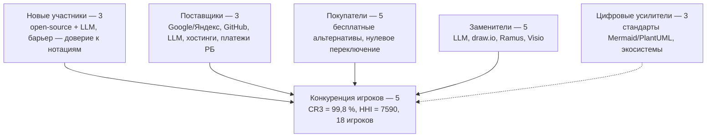

# Список рисунков ЛР4

## Сгенерировано (Python, `python -B <скрипт>` из папки `Python/`)

| Файл | Что показывает | Скрипт |
|---|---|---|
| `fig_01_radar_5_sil.png` | Радар пяти сил и цифровых усилителей (среднее 4,00) и радар 6 цифровых факторов (2,33) | `fig_radar_5_sil.py` |
| `fig_02_cr3_hhi_doli_trafika.png` | Доли трафика, CR3/CR5/HHI в сценариях A, B и C | `fig_cr3_hhi.py` |
| `fig_03_heatmap_barerov.png` | Баллы 9 факторов барьеров в оптимистичном, базовом и пессимистичном сценариях; индекс с весами 1,00 и 1,04 | `fig_heatmap_barerov.py` |

## Сделать самой

- Скриншоты `scr_01…scr_28` — перечень в `../ИНСТРУКЦИЯ_ДЛЯ_МЕНЯ.md`, §3.
- По желанию — `fig_04_skhema_5_sil.png`: схема пяти сил. Нарисовать в draw.io или NotaCode по исходнику ниже (в mermaid.live → Export PNG).

