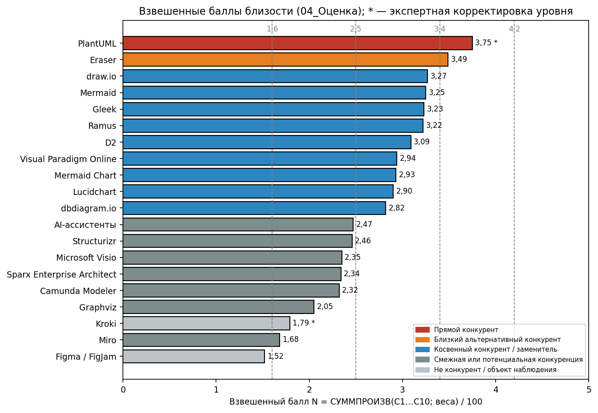
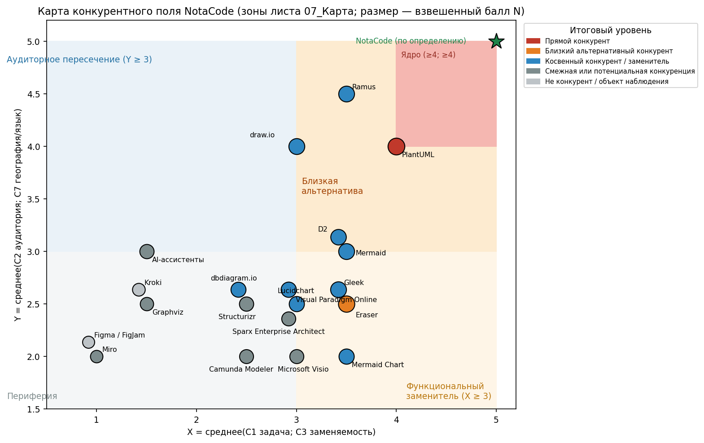
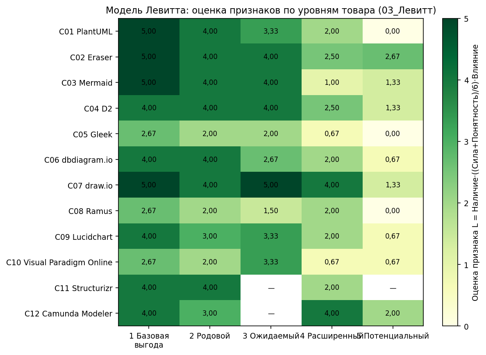
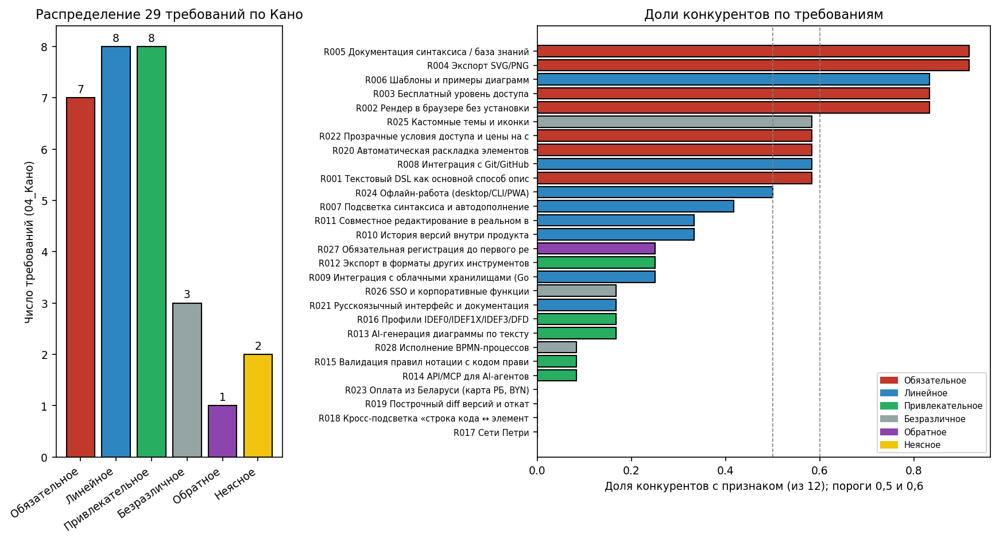
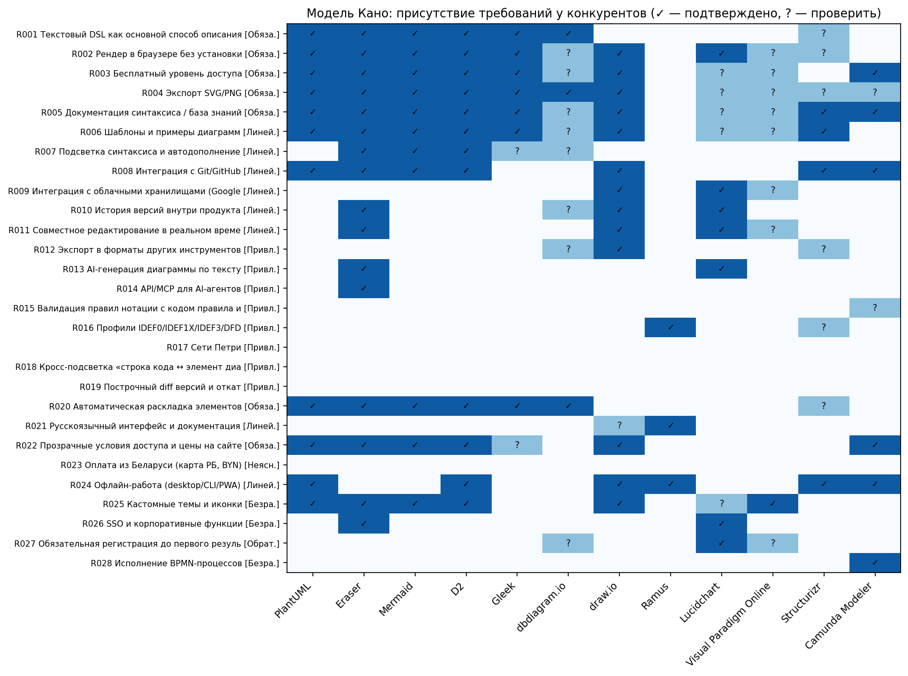
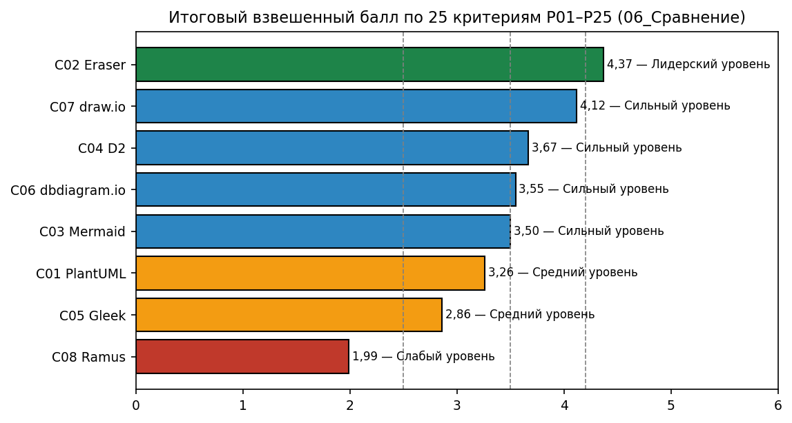
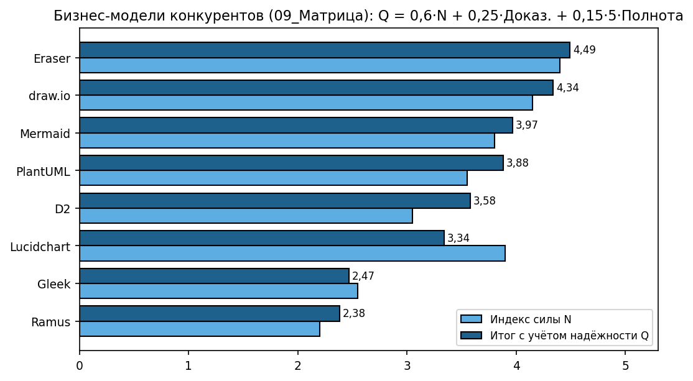

## 1 Цель работы

По открытой информации на сайтах конкурентов проекта NotaCode (web-IDE «diagram as code» для формальных нотаций UML, BPMN 2.0, ERD, IDEF0, IDEF1X, IDEF3, DFD, сетей Петри):

1) составить и классифицировать перечень компаний по уровням конкуренции [1, 4];
2) определить рыночный стандарт цифрового товара, выявить конкурентные преимущества по товару и сформулировать собственный цифровой товар NotaCode с помощью моделей Левитта и Кано [2, 5];
3) реконструировать бизнес-модели конкурентов, выявить рыночный стандарт бизнес-модели, зоны дифференциации и гипотезы для бизнес-модели NotaCode [3, 6].

## 2 Ход работы

### 2.1 Исходные данные и методика

Использованы три методики и три Excel-шаблона кафедры [1–6]. Расчёты выполнены в шаблонах (листы и формулы шаблонов, без изменения весов критериев классификации); для автоматического заполнения написаны три VBA-модуля, для проверки и рисунков – Python-скрипты (см. приложение Е).

Шкалы: классификация – шкала шаблона 0–5 по 10 критериям C1–C10 (а не шкала 0–4 по 8 критериям из методички [1]); преимущества по товару – индекс шаблона 1–5 и, отдельно, сумма 0–35 по 7 критериям методички [2]; бизнес-модель – баллы 1–5 в матрице и доказательность 1–5. Шкалы в одной таблице не смешиваются. Где методика и шаблон расходятся, расчёт выполнен по шаблону Excel, что указано явно: классификация – 10 критериев 0–5 и 5 уровней шаблона вместо 8 критериев 0–4 и 7 уровней методики [1] (определения уровней и правила корректировки – по методике); модели Левитта и Кано описаны только в шаблоне [5]; порог рыночного стандарта бизнес-модели – 70 % шаблона [6] (методика [3] допускает 60–70 %); шкала баллов 09_Матрица в шаблоне не задана – применена 1–5, как у остальных оценок шаблона. Формы из приложений методик, которых нет в шаблонах, заполнены отдельно (приложение Д).

Факты о конкурентах взяты из ранее выполненной работы по тому же продукту под прежним названием DiagramCode (снятие 17.09.2026 и 23.09.2026, в том числе данные SimilarWeb [11]) и из документации проекта [19, 20]. Всё, чего в этих источниках нет, помечено «🔲 проверить на сайте», оценки по таким компаниям имеют низкую уверенность.

При заполнении шаблонов обнаружены и исправлены ошибки формул (таблица 1).

Таблица 1 – Ошибки Excel-шаблонов и их исправление

| Шаблон, лист | Ошибка | Исправление (VBA) |
|---|---|---|
| Классификация, 04_Оценка N4:N103 | СУММПРОИЗВ строки баллов D:M и столбца весов E4:E13 разной ориентации – результат #ЗНАЧ! во всех строках | Явная сумма D·E4 + … + M·E13, деленная на сумму весов |
| Классификация, 06_Сводка B19:F28 | ПОИСКПОЗ по баллу возвращает первую компанию при равных баллах (дубли в топ-10) | АГРЕГАТ(15;6;…) с номером вхождения |
| Классификация, все листы | XLOOKUP есть только в Excel 2021/365 | Замена на ИНДЕКС/ПОИСКПОЗ |
| Левитт–Кано, 06_Сравнение F90:L91 | Формулы всех конкурентов ссылаются на столбец E (у всех балл C01) | Относительные ссылки на свой столбец |
| Бизнес-модель, 09_Матрица строка 2 | Веса не заданы, а ячейки A2:Q2 объединены – деление на 0 | Снятие объединения и ввод весов |
| Бизнес-модель, 10_Стандарт E4:E203 | Делитель '12_Сводка'!B4 – текст «Значение», доля всегда 0 | Делитель '12_Сводка'!B5 (число конкурентов) |

Результаты формул после исправления совпадают с независимым расчётом в Python по всем 20 компаниям, 8 конкурентам и 29 требованиям.

### 2.2 Классификация компаний по уровням конкуренции

#### 2.2.1 Объект анализа

Объект анализа описан по семи параметрам методики [1] (таблица 2).

Таблица 2 – Описание объекта анализа

| Параметр | Значение |
|---|---|
| Название объекта | NotaCode – web-IDE (PWA) «diagram as code» для формальных нотаций |
| Потребительская задача | Быстро построить диаграмму строгой нотации по тексту и получить её без нарушений правил нотации |
| Целевой сегмент | S-01 студенты технических специальностей (первичный, Free); S-02 аналитики и S-03 архитекторы (Pro); S-04 преподаватели |
| Сценарий использования | Лабораторные, курсовые, дипломные работы; проектная документация; модели рядом с требованиями в Git |
| География и язык | Беларусь, РФ и СНГ, русский язык |
| Ценовой диапазон | Free – 0; Pro – 4 USD/мес или 40 USD/год (допущение) [20] |
| Ключевой результат | Корректная диаграмма за минуты: DSL → валидация → раскладка → SVG, версии, экспорт в 11 форматов |

#### 2.2.2 Поиск и очистка списка компаний

Поиск вёлся по семи направлениям методики: по категории («diagram as code», «text to diagram», «UML online»), по задаче («IDEF0 онлайн», «DFD онлайн», «ER диаграмма онлайн», «BPMN редактор»), по результату («диаграмма для курсовой»), по подборкам аналогов, по рекламе и обсуждениям (🔲 ДОСНЯТЬ: выдача и объявления Яндекс/Google), по смежным рынкам (доски, CASE, BPM). Длинный список – 26 позиций; после очистки в реестр листа 01_Компании внесено 20 компаний K001–K020. Исключены дубли (Mermaid Live Editor, app.diagrams.net, DiagramGPT входят в K002, K009, K004), поведенческие альтернативы (Word/PowerPoint, рисование от руки) и прототипы без сервиса (Text2Diagram, AI-Diagram) – таблица В.1 приложения В.

Доказательства внесены в лист 02_Доказательства (32 строки с URL, датой, силой и достоверностью сигнала). Для прямого конкурента PlantUML собрано четыре подтверждения: страница товара [7], данные SimilarWeb о трафике из РФ [11], каналы IDE и GitHub [7], присутствие в тех же поисковых запросах по Google Trends [18].

#### 2.2.3 Оценка по критериям и расчётный уровень

Взвешенный балл листа 04_Оценка рассчитывается по формуле

N = (20·C1 + 15·C2 + 18·C3 + 10·C4 + 8·C5 + 8·C6 + 7·C7 + 7·C8 + 4·C9 + 3·C10) / 100, (1)

где C1…C10 – баллы 0–5 по критериям «задача», «аудитория», «заменяемость», «сценарий», «цена», «каналы», «география», «монетизация», «зрелость», «переключение»; 20…3 – веса листа 03_Критерии.

Для PlantUML (баллы 4, 4, 4, 4, 3, 4, 4, 1, 5, 4): N = (80 + 60 + 72 + 40 + 24 + 32 + 28 + 7 + 20 + 12) / 100 = 375 / 100 = 3,75. Для Eraser (4, 3, 3, 4, 3, 4, 2, 5, 4, 3): N = (80 + 45 + 54 + 40 + 24 + 32 + 14 + 35 + 16 + 9) / 100 = 3,49.

Ограничитель шаблона: при C1 < 3 или C3 < 3 уровни «прямой» и «близкий» невозможны. Пороги: 4,2 – прямой; 3,4 – близкий альтернативный; 2,5 – косвенный/заменитель; 1,6 – смежная или потенциальная конкуренция; ниже – не конкурент. Полная таблица баллов приведена в приложении А (таблица А.1), итоговые баллы – на рисунке 1.

Рисунок 1 – Взвешенные баллы близости компаний к NotaCode (лист 04_Оценка)

Ни одна компания не набрала 4,2: у всех есть хотя бы одно существенное отличие – отсутствие IDEF/DFD и проверки правил нотации, англоязычный рынок или иная монетизация. Сработали ограничители: низкая заменяемость (Structurizr, dbdiagram.io, Camunda Modeler – закрывают одну нотацию) и низкое совпадение задачи (Miro, Graphviz, Kroki, AI-ассистенты, Figma).

#### 2.2.4 Корректировки, спорные случаи и уверенность

Выполнены две экспертные корректировки с письменным обоснованием и ссылками (лист 04_Оценка, столбцы Q, T, U):

- PlantUML: расчётно «близкий альтернативный» (3,75, то есть 75 из 100 – диапазон 65–79 методички) повышен до «прямого конкурента» по правилу методики [1] «постоянно в тех же запросах и каналах»; четыре подтверждения приведены в 2.2.2;
- Kroki: расчётно «смежная конкуренция» (1,79) понижен до «не конкурент / объект наблюдения» – это HTTP-агрегатор рендеринга без собственного пользовательского товара и технологический партнёр NotaCode (эпик E8); агрегаторы по методике исключаются.

Спорные случаи решены по таблице методики: бесплатные open-source продукты (PlantUML, Mermaid, D2, draw.io) оцениваются как конкуренты в бесплатном сегменте, то есть против тарифа Free; зарубежные компании – по доступности языка и оплаты (C7); Mermaid и Mermaid Chart классифицированы как разные товары. Итоговые уровни и уверенность приведены в таблице 3.

Таблица 3 – Итоговая классификация конкурентов NotaCode

| Уровень | Компании (балл N) | Уверенность |
|---|---|---|
| Прямой конкурент | PlantUML (3,75, корректировка) | высокая |
| Близкий альтернативный | Eraser (3,49) | высокая |
| Косвенный / заменитель | draw.io (3,27), Mermaid (3,25), Gleek (3,23), Ramus (3,22), D2 (3,09), Visual Paradigm Online (2,94), Mermaid Chart (2,93), Lucidchart (2,90), dbdiagram.io (2,82) | высокая: draw.io, Mermaid, D2; средняя: Ramus, Mermaid Chart, Lucidchart; низкая: Gleek, VP Online, dbdiagram.io |
| Смежная / потенциальная | AI-ассистенты (2,47), Structurizr (2,46), Visio (2,35), Sparx EA (2,34), Camunda Modeler (2,32), Graphviz (2,05), Miro (1,68) | средняя; Miro – низкая |
| Не конкурент / наблюдение | Kroki (1,79, корректировка), Figma/FigJam (1,52) | высокая / низкая |

Средний взвешенный балл по 20 компаниям – 2,69.

#### 2.2.5 Карта конкурентного поля

Координаты карты листа 07_Карта:

X = (C1 + C3) / 2, Y = (C2 + C7) / 2, (2)

где X – совпадение задачи и заменяемость, Y – совпадение аудитории и рынка. Зоны: ядро (X ≥ 4 и Y ≥ 4), близкая альтернатива (X ≥ 3 и Y ≥ 3), функциональный заменитель (X ≥ 3), аудиторное пересечение (Y ≥ 3), периферия (рисунок 2).

Рисунок 2 – Карта конкурентного поля NotaCode

В ядро попал только PlantUML (X = 4, Y = 4), что подтверждает корректировку. В зону близкой альтернативы попали Ramus (3,5; 4,5), draw.io (3,0; 4,0), D2 и Mermaid – это решения, которые уже выбирает та же русскоязычная аудитория. Eraser, Gleek, Lucidchart, VP Online, Sparx EA, Visio и Mermaid Chart – функциональные заменители (X ≥ 3), но с чужой аудиторией или рынком (Y < 3). AI-ассистенты дают единственное аудиторное пересечение без функциональной замены – типичная будущая угроза.

#### 2.2.6 Вывод по классификации

По результатам анализа сформировано конкурентное поле из 20 компаний. В ядро прямой конкуренции вошёл PlantUML: та же задача «текст → UML», та же русскоязычная аудитория, бесплатный доступ и тот же путь выбора (поиск, IDE, GitHub). Ближняя зона – Eraser, отличающийся ценой (15–20 USD за участника в месяц), англоязычным рынком и отсутствием IDEF/DFD. Косвенные конкуренты и заменители – draw.io (главный заменитель для студентов), Mermaid, Ramus (единственный русскоязычный IDEF-инструмент), Gleek, D2, Visual Paradigm Online, Mermaid Chart, Lucidchart, dbdiagram.io. Потенциальную угрозу создают AI-ассистенты общего назначения, поскольку обладают огромной студенческой аудиторией и технологией генерации кода диаграмм. Для изучения практик выделены Structurizr, Camunda Modeler, Kroki и Figma. Сильнее всего уровни разделили критерии C3 (заменяемость) и C7 (география и язык). Требуют проверки: тарифы Gleek, dbdiagram.io, Lucidchart, VP Online, Mermaid Chart; RU-локализация draw.io; условия Ramus Educational; доступность оплаты из Беларуси.

### 2.3 Анализ цифрового товара конкурентов (модели Левитта и Кано)

#### 2.3.1 Цель и границы анализа

Исследовательский вопрос: какие функции, условия доступа, сервисные элементы и доказательства качества стали стандартом цифрового товара в сегменте «инструменты построения диаграмм строгих нотаций» для русскоязычных студентов и аналитиков и какие свойства NotaCode может использовать как преимущество. Границы: сегмент S-01…S-03; результат – файл диаграммы и история версий; география – Беларусь и СНГ; цена 0–20 USD в месяц; полностью автоматический самообслуживаемый сервис. Рынок разделён на подгруппы DSL-инструментов и графических редакторов, стандарт по способу ввода определяется внутри подгруппы.

#### 2.3.2 Состав выборки и карта страниц

В реестр 01_Конкуренты внесено 12 конкурентов (норма шаблона 5–12): 2 прямых (PlantUML, Eraser – прямой и близкий по части 2.2), 5 косвенных (Mermaid, D2, Gleek, Ramus), 4 заменителя (dbdiagram.io, draw.io, Lucidchart, VP Online) и 2 эталона лучшей практики (Structurizr, Camunda Modeler); из них 1 локальный (Ramus) и 11 международных. Все сайты проходились по единому маршруту: главная, товар/функции, тарифы, демо или редактор, документация, интеграции, правовые документы. В лист 02_Карта_сайтов внесено 34 страницы (норма 30+); 🔲 ДОСНЯТЬ: скриншоты и даты просмотра для страниц с пометкой, список имён файлов – в инструкции.

#### 2.3.3 Карта цифровых товаров

Паспорта цифровых товаров восьми сравниваемых конкурентов приведены в приложении Г (таблица Г.1). Цифровой товар категории – это не сайт, а доступ к рендеру диаграммы: библиотека или сервис «текст → SVG» у DSL-инструментов и web/desktop-редактор у графических. Гибридных товаров (цифровая заявка и ручное исполнение) в выборке нет.

#### 2.3.4 Разбор по модели Левитта

В лист 03_Левитт внесено 57 признаков по всем пяти уровням (норма 40+). Оценка признака

L = ОКРУГЛ(Н · ((С + П) / 6) · В; 2), (3)

где Н – наличие 0/1, С – сила реализации 0–3, П – понятность 0–3, В – влияние на ценность 1–5. Например, признак PlantUML «работа в браузере и локально» (Н = 1, С = 3, П = 2, В = 4): L = 1 · (5 / 6) · 4 = 3,33 – рабочий признак. Итог: 22 сильных, 22 рабочих, 10 слабых признаков, 3 отсутствующих. Средняя оценка по уровням: базовая выгода 4,00; родовой товар 3,33; ожидаемый 3,32; расширенный 2,11; потенциальный 0,97 (рисунок 3).

Рисунок 3 – Оценка признаков конкурентов по уровням товара Левитта

Рынок силён на уровнях 1–3: базовая выгода «получить диаграмму из текста» ясна у всех DSL-инструментов. Расширенный и потенциальный уровни слабы у всех, кроме Eraser (AI, MCP-сервер, SSO) и draw.io (интеграции). Ни у одного конкурента расширенный товар не строится на строгости нотаций – это свободная позиция для NotaCode.

#### 2.3.5 Классификация требований по модели Кано

В лист 04_Кано внесено 29 требований (норма 25+). Доля конкурентов с признаком

Д = К / 12, (4)

где К – число конкурентов реестра с признаком (подтверждённых и вероятных, отмеченных «?»), 12 – число конкурентов реестра. Распределение: обязательных 7, линейных 8, привлекательных 8, безразличных 3, обратных 1, неясных 2 (рисунки 4 и 5, таблица Б.2 приложения Б).

Рисунок 4 – Распределение требований по категориям Кано и доли конкурентов

Рисунок 5 – Присутствие требований Кано у 12 конкурентов

Минимальный рыночный стандарт (обязательное, доля ≥ 0,6): рендер в браузере без установки (0,83), бесплатный уровень (0,83), экспорт SVG/PNG (0,92), документация (0,92). Текстовый DSL, автораскладка и прозрачные условия доступа получили статус «потенциальный обязательный разрыв» (0,58) только потому, что в реестре есть графические редакторы; внутри подгруппы DSL-инструментов они встречаются у всех. Зона дифференциации (привлекательное, доля < 0,5): экспорт в форматы других инструментов (0,25), AI-генерация (0,17), профили IDEF/DFD (0,17), валидация правил нотации (0,08), сети Петри, кросс-подсветка «строка ↔ элемент» и построчный diff (0). Обратное требование – обязательная регистрация до первого результата.

#### 2.3.6 Сравнение конкурентов по 25 критериям

Итоговый балл листа 06_Сравнение

Б = Σ(wᵢ · bᵢ) / Σwᵢ, (5)

где wᵢ – вес критерия P01–P25 (сумма 107), bᵢ – балл 0–5. Для Eraser Б = 468 / 107 = 4,37 (лидерский уровень), для PlantUML Б = 349 / 107 = 3,26 (средний). Результаты – на рисунке 6, матрица баллов – в таблице Б.1 приложения Б.

Рисунок 6 – Итоговый взвешенный балл конкурентов по критериям P01–P25

Лидеры – Eraser (4,37), draw.io (4,12), D2 (3,67). Прямой конкурент PlantUML получил только 3,26: сильный товар и путь к результату (P06, P13, P19 – 5 баллов), но нет тарифов (P09 = 0), измеримой выгоды (P07 = 1) и условий оплаты (P17 = 2). Слабее всего рынок по измеримой выгоде (среднее P07 = 1,75), сравнению тарифов (1,62) и условиям оплаты (2,38).

#### 2.3.7 Рыночный стандарт

Статус листа 07_Стандарт_рынка определён по доле конкурентов (таблица 4).

Таблица 4 – Рыночный стандарт цифрового товара

| Статус | Характеристики (доля конкурентов) | Решение для NotaCode |
|---|---|---|
| Рыночный стандарт | Рендер в браузере (0,83), Free (0,83), экспорт SVG/PNG (0,92), документация (0,92), шаблоны (0,83) | Минимальный состав |
| Формирующаяся норма | DSL (0,58), автораскладка (0,58), прозрачные условия (0,58), Git (0,58), офлайн (0,50) | Стандартный состав |
| Проверить необходимость | История версий (0,33), совместная работа (0,33), русский интерфейс (0,17) | История – включить, совместная работа – после MVP, русский – включить |
| Зона дифференциации | AI (0,17), валидация (0,08), IDEF/DFD (0,17), экспорт в чужие форматы (0,25) | Расширенный состав и позиционирование |
| Низкий приоритет / риск | SSO (0,17); регистрация до результата (0,25) | Не делать; не копировать |

По классам методики [2] (приложение 4): обязательные – бесплатный вход, браузерный рендер, экспорт, документация; распространённые – DSL, Git, автораскладка; усиливающие – AI, история версий; редкие – валидация, IDEF/DFD, diff; декларативных заявлений без подтверждения не найдено; негативная практика – скрытые цены Mermaid Chart и обязательная регистрация (Lucidchart, VP Online – 🔲 проверить). Стандарт не подменён копированием лидера: из признаков одного Eraser в стандарт не вошёл ни один. Матрица рыночного стандарта по форме приложения 4 методики (доля конкурентов, доля лидеров, значимость, доказанность, риск отсутствия, статус) приведена в таблице Д.1 приложения Д.

#### 2.3.8 Конкурентные преимущества конкурентов

Индекс преимущества шаблона

И = 0,25·Р + 0,25·С + 0,30·Ц + 0,20·Д, (6)

где Р – редкость, С – сила, Ц – пользовательская ценность, Д – качество доказательства (1–5). Параллельно по методичке [2] вычислена сумма семи критериев 0–5 (0–35). Для нативного рендера Mermaid в GitHub: И = 0,25·5 + 0,25·5 + 0,30·4 + 0,20·5 = 4,70 (таблица 5).

Таблица 5 – Конкурентные преимущества по товару

| Конкурент | Преимущество | И (1–5) | Сумма 0–35 | Вывод |
|---|---|---|---|---|
| Mermaid | Нативный рендер в GitHub/GitLab/Notion | 4,70 | 30 | Сильное |
| draw.io | Бесплатно, без регистрации и без карты | 4,50 | 30 | Сильное |
| Eraser | AI-генерация и MCP-сервер для агентов | 4,25 | 28 | Сильное |
| draw.io | Интеграции Google/Microsoft/Atlassian/GitHub | 4,00 | 25 | Потенциальное |
| PlantUML | Локальная работа и IDE, «No tracking» | 3,95 | 26 | Потенциальное (по 0–35 – сильное) |
| Structurizr | Одна модель – несколько представлений | 3,50 | 22 | Потенциальное |
| D2 | Три движка раскладки, экспорт в 6 форматов | 3,45 | 23 | Потенциальное |
| Eraser | История версий, градуированная по тарифам | 3,20 | 22 | Слабое |
| Camunda | Исполнимый BPMN XML | 3,20 | 19 | Слабое (для S-01 безразлично) |
| Ramus | IDEF0/DFD на русском в курсах СНГ | 3,10 | 24 | Слабое (мало доказательств) |
| Eraser | Цена 15–20 USD/участник | 2,35 | 13 | Не преимущество |

Оценка по семи критериям методики (приложение 5) – таблица Д.2, чек-лист анализа сайта по всем 12 конкурентам (приложение 7) – таблицы Д.3–Д.4 приложения Д. Рекламных заявлений, выданных за преимущество, не принималось: цифра draw.io «100M+ users» – заявление компании, оно учтено как доказательство доверия низкой силы.

#### 2.3.9 Пробелы рынка и собственный цифровой товар

Пробелы рынка: у конкурентов почти нет измеримой выгоды (P07), нет проверки правил нотации, методологические нотации IDEF/DFD доступны только в устаревшем настольном Ramus, у бесплатных инструментов нет условий оплаты и расширения, русскоязычный интерфейс редок (0,17).

Формула товара (лист 05_Матрица_товара): цифровой товар NotaCode – это web-IDE «diagram as code» для студентов и аналитиков, которая превращает текст в корректную диаграмму строгой нотации (UML, BPMN, ERD, IDEF0/1X/3, DFD, сети Петри) за счёт единого DSL, валидации правил нотации с кодом ошибки и строкой, автораскладки, версий с diff и экспорта в форматы аналогов. Уровни товара приведены в таблице 6.

Таблица 6 – Уровни собственного цифрового товара NotaCode

| Уровень | Состав | Основание |
|---|---|---|
| Минимальный | DSL, 5 нотаций волны 1, валидация, браузерный рендер без регистрации, автораскладка, экспорт SVG/PNG, документация и шаблоны, тариф Free, правовые документы | Рыночный стандарт (доля ≥ 0,6) и главное отличие |
| Стандартный | Подсветка и автодополнение, GitHub и Google Drive, 20 версий в Free, офлайн-черновики PWA, русский интерфейс, прозрачная страница тарифов | Формирующаяся норма (0,35–0,6) |
| Расширенный | Все нотации, сети Петри, кросс-подсветка, diff и откат, экспорт в 11 форматов, AI с самопроверкой валидатором, Pro 4 USD/мес | Зона дифференциации, преимущества Eraser и Mermaid |

#### 2.3.10 Требования к сайту и рекомендации

Требования к сайту NotaCode: первый экран «аудитория – результат – первое действие» с кнопкой открытия редактора без регистрации (как у draw.io); галерея примеров IDEF0/DFD/BPMN с исходным кодом; страница тарифов Free/Pro с лимитами (5 проектов, 20 версий) и способом оплаты из Беларуси; измеримая выгода (замер времени построения против draw.io, цель BO-01 ≥ 40 %); документация по каждой нотации; политика обработки данных. Приоритеты: 1) валидатор и IDEF/DFD; 2) вход без регистрации; 3) экспорт в Mermaid/PlantUML; 4) AI – только после валидатора. Итоговые управленческие выводы внесены в 09_Дашборд.

### 2.4 Анализ бизнес-модели конкурентов

#### 2.4.1 Паспорт исследования и выборка

Цель – выбрать элементы бизнес-модели NotaCode (freemium Free/Pro 4 USD) для запуска MVP к 06.12.2026. Рынок – инструменты построения диаграмм, Беларусь и СНГ, B2C и лёгкий B2B. Единица анализа – конкретное предложение: доступ к редактору и его платные расширения. Период – 17.09–25.09.2026 (🔲 ДОСНЯТЬ: повторный просмотр). Выборка – 8 конкурентов: PlantUML, Eraser (прямые), Mermaid, D2, Gleek, Ramus (косвенные), draw.io, Lucidchart (заменители). В лист 03_Факты_сайта внесено 29 фактов с URL, датой, элементом модели и доказательностью 1–5, включая отрицательные признаки (у PlantUML нет страницы тарифов, у Mermaid Chart цена скрыта до регистрации).

#### 2.4.2 Реконструкция бизнес-моделей

Профили по 12 блокам заполнены в листе 04_Бизнес_модель. Полнота профиля – доля заполненных блоков из 12, средняя доказательность – среднее по фактам конкурента. Пять профилей «готовы к сравнению» (PlantUML, Eraser, Mermaid, D2, draw.io – полнота 0,92–1,00, доказательность 3,75–4,40); Gleek и Ramus – «недостаточно данных» (0,42), Lucidchart – «низкая доказательность» (2,50). Сравнение бизнес-моделей по блокам методики [3] приведено в таблице 7; матрица реконструкции по форме приложения 3 методики (балл 0–3 и уверенность) и пять индексов методики по всем 8 конкурентам выборки – в таблицах Д.5–Д.7 приложения Д (для Gleek, Ramus, Lucidchart большинство блоков – 🔲 ДОСНЯТЬ). Наибольшая консультационная сложность – у Eraser (1,20; Enterprise по запросу), у остальных 0 – самообслуживание; раскрытость модели выше всего у Eraser (2,71).

Таблица 7 – Сравнение бизнес-моделей основных конкурентов

| Критерий | PlantUML | Eraser | Mermaid | draw.io |
|---|---|---|---|---|
| Ценностное обещание | Бесплатно, локально, без слежки | AI + DSL в одном пространстве | Диаграммы в Markdown | Бесплатно и приватно |
| Модель доходов | Нет (open source) | Подписка 15–60 USD/участник | Донаты + SaaS Mermaid Chart | Нет платного тарифа (🔲 плагины) |
| Открытость тарифов | Бесплатно | Да, 4 уровня | Скрыто у Mermaid Chart | Бесплатно |
| Регистрация / пробный доступ | Не нужна | Free-тариф | Не нужна | Не нужна |
| Консультационная продажа | Нет | Enterprise по запросу | Нет | Нет |
| Интеграции и партнёрства | IDE, CI, GitHub | GitHub, Notion, Confluence, VS Code | GitHub, GitLab, Notion | Google, Microsoft, Atlassian, GitHub |
| Защитный механизм | Встроенность в IDE | AI-технология, история | Сетевой эффект платформ | 20 лет истории, интеграции |

Вывод по конкуренту Eraser (по шаблону методики): Eraser строит бизнес-модель вокруг AI-генерации технических диаграмм для команд разработки. Основной товар – SaaS с DSL, канвасом и AI. Монетизация – подписка по местам с лимитом AI-кредитов (3/40/250/без лимита). Путь клиента – регистрация во Free, апгрейд по лимиту, Enterprise через заявку. Сильнейшие элементы – AI и интеграции, подтверждённые тарифами и страницей продукта. Ограничение: не раскрыты число платящих клиентов и финансирование.

Вывод по draw.io: модель построена вокруг бесплатного профессионального редактора для всех сегментов; путь – сразу редактор без регистрации; сильнейшие элементы – нулевой барьер и интеграции; ограничение – источник выручки не раскрыт (🔲 проверить платность приложений Atlassian Marketplace).

#### 2.4.3 Матрица сравнения

Веса блоков в строке 2 листа 09_Матрица в шаблоне не заданы; для задачи «запуск товара» заданы: сегменты 10, ценность 15, товар 15, каналы 10, отношения 5, доходы 15, ресурсы 5, партнёры 5, данные/сеть 5, масштаб 10, защищённость 5 (сумма 100). Наибольший вес получили ценность, товар и доходы – именно они определяют минимальное предложение и путь первой покупки. Баллы – 1–5.

Индекс силы и итог с учётом надёжности

Н = Σ(bⱼ · wⱼ) / Σwⱼ, Q = 0,6·Н + 0,25·Д + 0,15·5·П, (7)

где bⱼ – балл блока, wⱼ – вес, Д – средняя доказательность, П – полнота профиля. Для Eraser Н = 440 / 100 = 4,40, Q = 0,6·4,40 + 0,25·4,40 + 0,15·5·1,00 = 2,64 + 1,10 + 0,75 = 4,49 (рисунок 7, таблица Б.3 приложения Б).

Рисунок 7 – Индекс силы и итог бизнес-модели конкурентов с учётом надёжности

Рейтинг: Eraser 4,49; draw.io 4,34; Mermaid 3,97; PlantUML 3,88; D2 3,58; Lucidchart 3,34; Gleek 2,47; Ramus 2,38. Lucidchart по индексу силы (3,90) выше Mermaid, но опускается из-за низкой доказательности – поправка на надёжность работает как задумано.

#### 2.4.4 Рыночный стандарт бизнес-модели

Доля практики = число конкурентов с признаком / 8; порог стандарта шаблона – 0,7 (методика допускает 0,6–0,7, использован порог шаблона). Результаты – в таблице 8.

Таблица 8 – Рыночный стандарт бизнес-модели

| Статус | Практика (доля) |
|---|---|
| Рыночный стандарт (≥ 0,7) | Бесплатный доступ к основной функции (0,875); самостоятельный старт без продажника (0,875); публичная документация (0,875) |
| Формирующийся стандарт (0,4–0,7) | Интеграции с GitHub/IDE (0,625); первый результат без регистрации (0,5); открытый код (0,5); сообщество как поддержка (0,5) |
| Зона дифференциации (0,2–0,4) | Платная подписка (0,375); AI-генерация (0,25); корпоративные продажи (0,25) |
| Слабый сигнал (< 0,2) | Лимиты тарифа как стимул апгрейда; сетевой эффект платформы-хоста; строгие нотации IDEF/DFD (по 0,125) |

Правило отрицательного признака: 4 из 8 конкурентов не имеют страницы тарифов вовсе – это не «скрытая цена», а некоммерческая модель; скрытую цену показывает только Mermaid Chart.

#### 2.4.5 Преимущества бизнес-моделей и гипотезы

Балл преимущества листа 11_Преимущества

K = 0,3·С + 0,25·Т + 0,25·З + 0,2·Д, (8)

где С – сила, Т – трудность копирования, З – коммерческая значимость, Д – доказательность (1–5). Сильные преимущества: встроенность Mermaid в GitHub/GitLab/Notion (K = 0,3·5 + 0,25·5 + 0,25·3 + 0,2·5 = 4,50), нулевой барьер draw.io (4,30), AI + подписка с лимитом Eraser (4,20); умеренные – экосистема IDE PlantUML (3,50), совместная работа Lucidchart (3,35), раскладка D2 (3,20); слабые – присутствие Ramus в учебных программах (2,80), freemium Gleek (2,25).

Гипотезы для бизнес-модели NotaCode:

1) повторить: Free-тариф с полноценным редактором, самостоятельный старт, документацию, интеграцию с GitHub;
2) улучшить: вход без регистрации до первой диаграммы; лимиты Free (5 проектов, 20 версий) как стимул апгрейда по логике Eraser, но с ценой 4 USD вместо 15–20 USD;
3) не копировать: корпоративные продажи и SSO, исполнение BPMN, венчурную AI-модель с дорогим инференсом;
4) проверить: готовность S-01 и S-02 платить за валидацию и IDEF/DFD (опрос Van Westendorp), платёжный провайдер для Беларуси, экспорт в Mermaid как канал «встраивания» в GitHub.

Вывод имеет среднюю уверенность: сайты не раскрывают конверсию, число платящих пользователей и выручку; нужна проверка через тестовую регистрацию и интервью.

## Выводы

В работе выполнены все три части методики анализа конкурентов по сайтам для проекта NotaCode. Конкурентное поле составлено из 20 компаний, найденных по семи поисковым направлениям; по каждой собраны доказательства с URL и датой, выставлены баллы по десяти критериям шаблона и рассчитан взвешенный балл. Ни одна компания не достигла порога прямой конкуренции 4,2, так как все конкуренты отличаются от NotaCode хотя бы по одному существенному признаку – отсутствию методологических нотаций IDEF/DFD и проверки правил, англоязычному рынку или иной монетизации. С письменным обоснованием и четырьмя подтверждениями к прямым конкурентам отнесён PlantUML, который единственным попал в ядро карты конкурентного поля. Близкий альтернативный конкурент – Eraser, девять компаний – косвенные конкуренты и заменители, главный из которых для студентов – бесплатный draw.io, семь – смежная и потенциальная конкуренция, среди них наиболее опасны AI-ассистенты общего назначения.

Анализ цифрового товара по моделям Левитта и Кано (12 конкурентов, 34 страницы, 57 признаков, 29 требований) показал, что рынок силён на уровнях базовой выгоды, родового и ожидаемого товара и слаб на расширенном и потенциальном уровнях. Минимальный рыночный стандарт – рендер в браузере без установки, бесплатный уровень доступа, экспорт SVG/PNG, документация и шаблоны; текстовый DSL, автораскладка и интеграция с Git являются нормой внутри подгруппы DSL-инструментов. Зоны дифференциации, где признак есть не более чем у трёх из двенадцати конкурентов, – валидация правил нотации, профили IDEF/DFD, сети Петри, кросс-подсветка кода и диаграммы, построчный diff и экспорт в форматы других инструментов. Именно они сформировали расширенный уровень и формулу цифрового товара NotaCode. Лидеры по сравнению 25 критериев – Eraser, draw.io и D2; прямой конкурент PlantUML проигрывает по тарифам, измеримой выгоде и условиям оплаты, а рынок в целом почти не показывает измеримую выгоду – это возможность для NotaCode доказать сокращение времени построения диаграмм.

Реконструкция бизнес-моделей восьми конкурентов показала, что стандарт рынка – бесплатный доступ к основной функции, самостоятельный старт и публичная документация, а преобладающая логика – условно-бесплатная open-source модель без прямой выручки. Платную подписку подтверждает только Eraser с ценой 15–60 USD за участника, поэтому freemium NotaCode с Pro за 4 USD занимает незанятую промежуточную ценовую позицию. Сильнейшие бизнес-модели – Eraser, draw.io и Mermaid; их преимущества опираются на ресурсы, которые трудно повторить (AI-технология, двадцатилетняя база пользователей, встроенность в GitHub), поэтому NotaCode копирует только логику freemium и лимитов, но не цену и не корпоративные продажи.

При заполнении шаблонов найдены и исправлены шесть ошибок формул, в том числе две, из-за которых шаблоны не считали итог вовсе. Ограничения работы: по Gleek, dbdiagram.io, Visual Paradigm Online, Lucidchart и Ramus данные неполные, их оценки предварительные; сайты не раскрывают конверсию и выручку; оценки выставлены одним экспертом. Для повышения уверенности нужно снять тарифы и скриншоты отмеченных страниц, проверить доступность оплаты из Беларуси и провести опрос целевых сегментов.

## Список использованных источников

1. Методика классификации компаний по уровням конкуренции [Электронный ресурс] : методические материалы к ЛР5 по дисциплине «Электронный бизнес». – БГУИР, 2026. – Файл Методика_классификации_компаний_по_уровням_конкуренции.docx.
2. Методика анализа конкурентов по сайтам: цифровой товар [Электронный ресурс] : методические материалы к ЛР5. – БГУИР, 2026. – Файл Методика_анализа_конкурентов_по_сайтам_цифровой_товар.docx.
3. Методика анализа бизнес-модели конкурентов по сайтам [Электронный ресурс] : методические материалы к ЛР5. – БГУИР, 2026. – Файл Методика_анализа_бизнес_модели_конкурентов_по_сайтам.docx.
4. Шаблон классификации компаний по уровням конкуренции [Электронный ресурс] : Excel-шаблон к ЛР5. – БГУИР, 2026.
5. Шаблон анализа конкурентов (Левитт, Кано) [Электронный ресурс] : Excel-шаблон к ЛР5. – БГУИР, 2026.
6. Шаблон анализа бизнес-модели конкурентов [Электронный ресурс] : Excel-шаблон к ЛР5. – БГУИР, 2026.
7. PlantUML [Электронный ресурс]. – Режим доступа: https://plantuml.com. – Дата доступа: 17.09.2026.
8. Mermaid [Электронный ресурс]. – Режим доступа: https://mermaid.js.org. – Дата доступа: 17.09.2026.
9. Eraser – AI for diagrams [Электронный ресурс]. – Режим доступа: https://www.eraser.io. – Дата доступа: 17.09.2026.
10. D2 Documentation FAQ [Электронный ресурс]. – Режим доступа: https://d2lang.com/tour/faq/. – Дата доступа: 23.09.2026.
11. SimilarWeb: plantuml.com, mermaidchart.com, eraser.io, app.diagrams.net [Электронный ресурс]. – Режим доступа: https://www.similarweb.com. – Дата доступа: 17.09.2026, 23.09.2026.
12. draw.io [Электронный ресурс]. – Режим доступа: https://www.drawio.com. – Дата доступа: 23.09.2026.
13. Mermaid Chart [Электронный ресурс]. – Режим доступа: https://www.mermaidchart.com. – Дата доступа: 17.09.2026.
14. Structurizr [Электронный ресурс]. – Режим доступа: https://structurizr.com. – Дата доступа: 17.09.2026.
15. Camunda Modeler [Электронный ресурс]. – Режим доступа: https://camunda.com/download/modeler/. – Дата доступа: 17.09.2026.
16. Lucidchart [Электронный ресурс]. – Режим доступа: https://www.lucidchart.com. – Дата доступа: 🔲 указать.
17. Gleek, dbdiagram.io, Visual Paradigm Online, Ramus [Электронный ресурс]. – Режим доступа: https://www.gleek.io; https://dbdiagram.io; https://online.visual-paradigm.com; 🔲 URL Ramus. – Дата доступа: 🔲 указать.
18. Google Trends: запрос «plantuml» [Электронный ресурс]. – Режим доступа: https://trends.google.com. – Дата доступа: 17.09.2026.
19. Анализ рынка и аналогов DiagramCode : проектная документация. – 2026. – 00-competitive-analysis.md.
20. Концепция проекта NotaCode : проектная документация. – 2026. – 01-project-concept.md.

## Приложение А (обязательное) Оценка компаний по критериям C1–C10

Таблица А.1 – Баллы, взвешенный балл и уровень конкуренции (лист 04_Оценка)

| ID | Компания | C1 | C2 | C3 | C4 | C5 | C6 | C7 | C8 | C9 | C10 | N | Расчётный уровень | Итоговый уровень | Зона карты |
|---|---|---|---|---|---|---|---|---|---|---|---|---|---|---|---|
| K001 | PlantUML | 4 | 4 | 4 | 4 | 3 | 4 | 4 | 1 | 5 | 4 | 3,75 | Близкий | Прямой (корр.) | Ядро |
| K002 | Mermaid | 4 | 3 | 3 | 3 | 3 | 4 | 3 | 1 | 5 | 4 | 3,25 | Косвенный | Косвенный | Близкая альтернатива |
| K003 | Mermaid Chart | 4 | 3 | 3 | 3 | 1 | 3 | 1 | 3 | 3 | 4 | 2,93 | Косвенный | Косвенный | Функц. заменитель |
| K004 | Eraser | 4 | 3 | 3 | 4 | 3 | 4 | 2 | 5 | 4 | 3 | 3,49 | Близкий | Близкий | Функц. заменитель |
| K005 | D2 | 4 | 3 | 3 | 3 | 3 | 3 | 3 | 1 | 3 | 4 | 3,09 | Косвенный | Косвенный | Близкая альтернатива |
| K006 | Gleek | 4 | 3 | 3 | 4 | 3 | 3 | 2 | 4 | 2 | 2 | 3,23 | Косвенный | Косвенный | Функц. заменитель |
| K007 | Structurizr | 3 | 3 | 2 | 3 | 2 | 2 | 2 | 2 | 3 | 1 | 2,46 | Смежная | Смежная | Периферия |
| K008 | dbdiagram.io | 3 | 3 | 2 | 3 | 3 | 3 | 2 | 4 | 3 | 3 | 2,82 | Косвенный | Косвенный | Периферия |
| K009 | draw.io | 3 | 4 | 3 | 3 | 3 | 4 | 4 | 1 | 5 | 4 | 3,27 | Косвенный | Косвенный | Близкая альтернатива |
| K010 | Lucidchart | 3 | 3 | 3 | 3 | 2 | 3 | 2 | 3 | 5 | 2 | 2,90 | Косвенный | Косвенный | Функц. заменитель |
| K011 | Camunda Modeler | 3 | 2 | 2 | 2 | 3 | 2 | 2 | 1 | 4 | 3 | 2,32 | Смежная | Смежная | Периферия |
| K012 | Ramus | 4 | 4 | 3 | 4 | 2 | 2 | 5 | 1 | 2 | 2 | 3,22 | Косвенный | Косвенный | Близкая альтернатива |
| K013 | VP Online | 3 | 3 | 3 | 3 | 3 | 3 | 2 | 3 | 4 | 2 | 2,94 | Косвенный | Косвенный | Функц. заменитель |
| K014 | Miro | 1 | 2 | 1 | 1 | 2 | 2 | 2 | 3 | 5 | 1 | 1,68 | Смежная | Смежная | Периферия |
| K015 | Microsoft Visio | 3 | 2 | 3 | 2 | 1 | 2 | 2 | 1 | 5 | 2 | 2,35 | Смежная | Смежная | Функц. заменитель |
| K016 | Sparx EA | 3 | 2 | 3 | 2 | 1 | 1 | 3 | 1 | 5 | 2 | 2,34 | Смежная | Смежная | Функц. заменитель |
| K017 | Graphviz | 2 | 2 | 1 | 2 | 3 | 2 | 3 | 1 | 5 | 3 | 2,05 | Смежная | Смежная | Периферия |
| K018 | Kroki | 2 | 2 | 1 | 1 | 3 | 1 | 3 | 1 | 3 | 3 | 1,79 | Смежная | Не конкурент (корр.) | Периферия |
| K019 | AI-ассистенты | 2 | 4 | 1 | 2 | 3 | 3 | 2 | 3 | 5 | 2 | 2,47 | Смежная | Смежная | Аудиторное пересечение |
| K020 | Figma / FigJam | 1 | 2 | 1 | 1 | 2 | 0 | 2 | 3 | 5 | 1 | 1,52 | Не конкурент | Не конкурент | Периферия |

## Приложение Б (обязательное) Матрицы анализа цифрового товара и бизнес-модели

Таблица Б.1 – Баллы конкурентов по критериям P01–P25 (лист 06_Сравнение)

| ID | Вес | PlantUML | Eraser | Mermaid | D2 | Gleek | dbdiagram | draw.io | Ramus |
|---|---|---|---|---|---|---|---|---|---|
| P01 | 5 | 4 | 5 | 4 | 5 | 4 | 5 | 5 | 3 |
| P02 | 5 | 4 | 4 | 4 | 4 | 3 | 4 | 4 | 3 |
| P03 | 4 | 4 | 3 | 4 | 4 | 3 | 4 | 4 | 2 |
| P04 | 5 | 3 | 5 | 3 | 4 | 3 | 4 | 4 | 2 |
| P05 | 4 | 4 | 5 | 5 | 5 | 4 | 5 | 5 | 2 |
| P06 | 4 | 5 | 5 | 5 | 5 | 4 | 5 | 5 | 3 |
| P07 | 5 | 1 | 3 | 1 | 2 | 2 | 2 | 2 | 1 |
| P08 | 5 | 3 | 4 | 3 | 4 | 3 | 4 | 4 | 2 |
| P09 | 4 | 0 | 5 | 0 | 0 | 3 | 3 | 1 | 1 |
| P10 | 4 | 2 | 3 | 3 | 2 | 2 | 3 | 4 | 1 |
| P11 | 4 | 3 | 4 | 2 | 2 | 2 | 3 | 5 | 1 |
| P12 | 3 | 2 | 4 | 4 | 3 | 3 | 3 | 4 | 2 |
| P13 | 5 | 5 | 4 | 5 | 5 | 4 | 4 | 5 | 2 |
| P14 | 4 | 3 | 5 | 4 | 4 | 4 | 4 | 4 | 2 |
| P15 | 4 | 3 | 4 | 4 | 4 | 3 | 4 | 4 | 2 |
| P16 | 5 | 4 | 5 | 4 | 4 | 3 | 3 | 5 | 2 |
| P17 | 4 | 2 | 4 | 2 | 2 | 2 | 2 | 4 | 1 |
| P18 | 3 | 3 | 4 | 3 | 4 | 2 | 2 | 3 | 2 |
| P19 | 3 | 5 | 4 | 5 | 5 | 3 | 4 | 4 | 3 |
| P20 | 4 | 4 | 5 | 5 | 4 | 2 | 3 | 5 | 1 |
| P21 | 3 | 3 | 5 | 4 | 3 | 2 | 3 | 3 | 1 |
| P22 | 5 | 3 | 5 | 3 | 4 | 2 | 3 | 3 | 4 |
| P23 | 5 | 3 | 4 | 3 | 4 | 2 | 3 | 5 | 2 |
| P24 | 5 | 4 | 5 | 4 | 4 | 3 | 4 | 5 | 2 |
| P25 | 5 | 4 | 5 | 4 | 4 | 3 | 4 | 5 | 2 |
| Итог | 107 | 3,26 | 4,37 | 3,50 | 3,67 | 2,86 | 3,55 | 4,12 | 1,99 |

Баллы Gleek, dbdiagram.io и Ramus предварительные (🔲 проверить на сайте).

Таблица Б.2 – Требования по модели Кано (лист 04_Кано)

| ID | Требование | Категория | Кол-во из 12 | Доля | Интерпретация шаблона |
|---|---|---|---|---|---|
| R001 | Текстовый DSL | Обязательное | 7 | 0,58 | Потенциальный обязательный разрыв |
| R002 | Рендер в браузере без установки | Обязательное | 10 | 0,83 | Минимальный рыночный стандарт |
| R003 | Бесплатный уровень доступа | Обязательное | 10 | 0,83 | Минимальный рыночный стандарт |
| R004 | Экспорт SVG/PNG | Обязательное | 11 | 0,92 | Минимальный рыночный стандарт |
| R005 | Документация синтаксиса | Обязательное | 11 | 0,92 | Минимальный рыночный стандарт |
| R006 | Шаблоны и примеры | Линейное | 10 | 0,83 | Конкурентная норма |
| R007 | Подсветка и автодополнение | Линейное | 5 | 0,42 | Зона усиления ценности |
| R008 | Интеграция с Git/GitHub | Линейное | 7 | 0,58 | Конкурентная норма |
| R009 | Облачные хранилища | Линейное | 3 | 0,25 | Зона усиления ценности |
| R010 | История версий | Линейное | 4 | 0,33 | Зона усиления ценности |
| R011 | Совместное редактирование | Линейное | 4 | 0,33 | Зона усиления ценности |
| R012 | Экспорт в форматы других инструментов | Привлекательное | 3 | 0,25 | Зона дифференциации |
| R013 | AI-генерация по тексту | Привлекательное | 2 | 0,17 | Зона дифференциации |
| R014 | API/MCP для AI-агентов | Привлекательное | 1 | 0,08 | Зона дифференциации |
| R015 | Валидация правил нотации | Привлекательное | 1 | 0,08 | Зона дифференциации |
| R016 | Профили IDEF0/IDEF1X/IDEF3/DFD | Привлекательное | 2 | 0,17 | Зона дифференциации |
| R017 | Сети Петри | Привлекательное | 0 | 0,00 | Зона дифференциации |
| R018 | Кросс-подсветка «строка ↔ элемент» | Привлекательное | 0 | 0,00 | Зона дифференциации |
| R019 | Построчный diff и откат | Привлекательное | 0 | 0,00 | Зона дифференциации |
| R020 | Автораскладка | Обязательное | 7 | 0,58 | Потенциальный обязательный разрыв |
| R021 | Русский интерфейс | Линейное | 2 | 0,17 | Зона усиления ценности |
| R022 | Прозрачные условия и цены | Обязательное | 7 | 0,58 | Потенциальный обязательный разрыв |
| R023 | Оплата из Беларуси | Неясное | 0 | 0,00 | Требует проверки |
| R024 | Офлайн-работа | Линейное | 6 | 0,50 | Конкурентная норма |
| R025 | Кастомные темы и иконки | Безразличное | 7 | 0,58 | Не делать при дефиците ресурсов |
| R026 | SSO и корпоративные функции | Безразличное | 2 | 0,17 | Не делать при дефиците ресурсов |
| R027 | Регистрация до первого результата | Обратное | 3 | 0,25 | Исключить |
| R028 | Исполнение BPMN | Безразличное | 1 | 0,08 | Не делать при дефиците ресурсов |
| R029 | Мобильный редактор | Неясное | – | – | Требует проверки |

Таблица Б.3 – Матрица бизнес-моделей (лист 09_Матрица, веса строки 2)

| Конкурент | Н | Доказательность | Полнота | Q | Качество профиля |
|---|---|---|---|---|---|
| Eraser | 4,40 | 4,40 | 1,00 | 4,49 | готов к сравнению |
| draw.io | 4,15 | 4,40 | 1,00 | 4,34 | готов к сравнению |
| Mermaid | 3,80 | 3,75 | 1,00 | 3,97 | готов к сравнению |
| PlantUML | 3,55 | 4,00 | 1,00 | 3,88 | готов к сравнению |
| D2 | 3,05 | 4,25 | 0,92 | 3,58 | готов к сравнению |
| Lucidchart | 3,90 | 2,50 | 0,50 | 3,34 | низкая доказательность |
| Gleek | 2,55 | 2,50 | 0,42 | 2,47 | недостаточно данных |
| Ramus | 2,20 | 3,00 | 0,42 | 2,38 | недостаточно данных |

## Приложение В (справочное) Исключённые компании

Таблица В.1 – Компании, исключённые из оценки

| Компания | Почему рассмотрена | Причина исключения | Вернуться позже |
|---|---|---|---|
| MS Word / PowerPoint | Студенты рисуют схемы фигурами | Не специализированы на диаграммах, поведенческая альтернатива | Нет |
| Рисование от руки | Учебная практика | Нет цифрового товара | Нет |
| Mermaid Live Editor | Запрос «mermaid online» | Дубль K002 | Нет |
| app.diagrams.net | SimilarWeb | Дубль K009 | Нет |
| DiagramGPT | Запрос «AI diagram generator» | Дубль K004 | Нет |
| Text2Diagram, AI-Diagram | Таблица инструментов проекта | Прототипы без сервиса и аудитории | Да, при появлении сервиса |

## Приложение Г (справочное) Паспорта цифровых товаров

Таблица Г.1 – Паспорта цифровых товаров основных конкурентов

| Поле | PlantUML | Eraser | Mermaid | draw.io |
|---|---|---|---|---|
| Цифровой товар | DSL-рендерер UML | SaaS diagram as code + AI | JS-библиотека + Live Editor | Графический редактор |
| Аудитория | Разработчики, студенты | Команды разработки | Разработчики, техписатели | Все сегменты |
| Проблема | Ручное рисование UML | Долго рисовать архитектуру | Диаграммы отдельно от документации | Дорогие корпоративные редакторы |
| Обещаемый результат | Диаграмма в документации за минуты | Диаграммы по тексту и AI | Диаграмма живёт в репозитории | Профессиональная схема бесплатно |
| Основные функции | DSL, онлайн-сервер, CLI, плагины IDE | DSL, AI, канвас, заметки | DSL, рендер в Markdown | Фигуры UML/BPMN/AWS, интеграции |
| Модель доступа | Без регистрации | Регистрация, Free | Без регистрации | Без регистрации и карты |
| Тарифы | Бесплатно (GPL-3.0) | 0 / 15–20 / 45–60 USD / по запросу | Бесплатно (MIT), Mermaid Chart – скрыто | Бесплатно (Apache 2.0) |
| Сервис | Документация, сообщество | Поддержка по тарифам | Документация, сообщество | Документация |
| Доказательства | История, «No tracking» | Интеграции, тарифы | Встроенность в GitHub | «100M+ users» (заявление) |
| Слабые стороны | Нет тарифов и выгоды, нет IDEF | Цена, EN-рынок, нет IDEF | Нет BPMN/IDEF | Нет текста и проверки правил |

Паспорта D2, Gleek, dbdiagram.io и Ramus – в листах 01, 03, 05 Excel-файла Левитт–Кано.

## Приложение Д (обязательное) Таблицы по приложениям методик

Таблицы составлены строго по формам приложений 4, 5, 7 методики [2] и приложения 3 и индексов методики [3]; шкалы методик (0–5, 0–35, 0–3) не смешиваются со шкалами шаблонов. Баллы экспертные, по фактам 02_Карта_сайтов и 03_Факты_сайта; «🔲» – проверить на сайте.

Таблица Д.1 – Матрица рыночного стандарта (приложение 4 методики [2])

| Характеристика | Доля конкурентов | Доля лидеров | Значимость 1–5 | Доказанность 1–5 | Риск отсутствия 1–5 | Статус |
|---|---|---|---|---|---|---|
| Текстовый DSL как основной способ описания диаграммы | 0,58 | 0,67 | 5 | 4 | 5 | обязательная |
| Рендер в браузере без установки | 0,83 | 1,00 | 5 | 5 | 5 | обязательная |
| Бесплатный уровень доступа | 0,83 | 1,00 | 5 | 5 | 5 | обязательная |
| Экспорт SVG/PNG | 0,92 | 1,00 | 5 | 5 | 5 | обязательная |
| Документация синтаксиса / база знаний | 0,92 | 1,00 | 4 | 4 | 4 | обязательная |
| Автоматическая раскладка элементов | 0,58 | 0,67 | 4 | 4 | 4 | распространённая |
| Прозрачные условия доступа и цены на сайте | 0,58 | 1,00 | 4 | 4 | 4 | распространённая |
| Шаблоны и примеры диаграмм | 0,83 | 1,00 | 3 | 4 | 3 | распространённая |
| Интеграция с Git/GitHub | 0,58 | 1,00 | 4 | 5 | 3 | распространённая |
| Офлайн-работа (desktop/CLI/PWA) | 0,50 | 0,67 | 3 | 4 | 2 | распространённая |
| История версий внутри продукта | 0,33 | 0,67 | 4 | 3 | 3 | усиливающая |
| Совместное редактирование в реальном времени | 0,33 | 0,67 | 3 | 3 | 2 | усиливающая |
| Русскоязычный интерфейс и документация | 0,17 | 0,33 | 4 | 2 | 3 | усиливающая |
| AI-генерация диаграммы по тексту | 0,17 | 0,33 | 5 | 4 | 2 | усиливающая |
| Валидация правил нотации с кодом правила и строкой | 0,08 | 0,00 | 5 | 1 | 2 | редкая |
| Профили IDEF0/IDEF1X/IDEF3/DFD | 0,17 | 0,00 | 5 | 2 | 3 | редкая |
| Экспорт в форматы других инструментов | 0,25 | 0,33 | 4 | 2 | 2 | редкая |
| SSO и корпоративные функции | 0,17 | 0,33 | 2 | 3 | 1 | редкая |
| Обязательная регистрация до первого результата | 0,25 | 0,00 | 3 | 2 | 1 | негативная практика |

Лидеры – три конкурента с наибольшим баллом 06_Сравнение: Eraser, draw.io, D2. Значимость – вес требования в 04_Кано.

Таблица Д.2 – Карта конкурентных преимуществ (приложение 5 методики [2], критерии 0–5)

| Конкурент | Преимущество | Тип | Ценн. | Отлич. | Доказ. | Связь с рез. | Устойч. | Коммун. | Сегмент | Итог 0–35 | Решение |
|---|---|---|---|---|---|---|---|---|---|---|---|
| Eraser | AI-генерация диаграмм + MCP-сервер для агентов | Интеграционное | 4 | 5 | 4 | 4 | 3 | 5 | 3 | 28 | Сильное преимущество |
| draw.io / diagrams.net | Бесплатно, без регистрации и без карты | Экономическое | 5 | 3 | 5 | 4 | 3 | 5 | 5 | 30 | Сильное преимущество |
| Mermaid | Нативный рендер в GitHub/GitLab/Notion | Сетевой эффект | 4 | 5 | 5 | 4 | 5 | 4 | 3 | 30 | Сильное преимущество |
| PlantUML | Работа локально и в IDE, «No tracking» | Доверительное | 4 | 3 | 5 | 3 | 3 | 4 | 4 | 26 | Сильное преимущество |
| D2 | 3 движка раскладки и экспорт в 6 форматов | Функциональное | 3 | 3 | 4 | 3 | 3 | 4 | 3 | 23 | Потенциальное преимущество |
| draw.io / diagrams.net | Интеграции Google/Microsoft/Atlassian/GitHub как канал | Интеграционное | 4 | 3 | 4 | 3 | 4 | 4 | 3 | 25 | Потенциальное преимущество |
| Ramus | IDEF0/DFD на русском в учебных курсах СНГ | Контентное | 4 | 4 | 2 | 4 | 2 | 3 | 5 | 24 | Потенциальное преимущество |
| Eraser | История версий, градуированная по тарифам (90 дней → безлимит) | Экономическое | 3 | 3 | 4 | 3 | 2 | 4 | 3 | 22 | Потенциальное преимущество |
| Structurizr | Одна модель — несколько представлений (C4) | Функциональное | 3 | 4 | 3 | 3 | 3 | 3 | 3 | 22 | Потенциальное преимущество |
| Camunda Modeler | Исполнимый BPMN XML | Функциональное | 2 | 4 | 3 | 2 | 4 | 3 | 1 | 19 | Потенциальное преимущество |
| Eraser | Цена 15–20 USD/участник/мес | Экономическое | 1 | 1 | 5 | 1 | 1 | 3 | 1 | 13 | Слабое отличие |

Таблица Д.3 – Чек-лист анализа сайта конкурента (приложение 7 методики [2]), конкуренты C01–C06

| № | Вопрос | PlantUML | Eraser | Mermaid | D2 | Gleek | dbdiagram.io |
|---|---|---|---|---|---|---|---|
| 1 | Понятно ли на первом экране, что продаётся, кому и какой результат? | Да | Да | Да | Да | 🔲 | 🔲 |
| 2 | Названа ли целевая аудитория? | Частично | Да | Частично | Частично | 🔲 | 🔲 |
| 3 | Описана ли проблема клиента? | Частично | Да | Частично | Частично | 🔲 | 🔲 |
| 4 | Показан ли измеримый или конкретный результат? | Нет | Частично | Нет | Нет | 🔲 | 🔲 |
| 5 | Перечислены ли основные функции? | Да | Да | Да | Да | Да (kursach.md) | 🔲 |
| 6 | Показаны ли сценарии применения? | Частично | Да | Частично | Частично | 🔲 | 🔲 |
| 7 | Есть ли демонстрация, пробный доступ или пример результата? | Да | Да | Да | Да (playground) | 🔲 | 🔲 |
| 8 | Понятны ли тарифы и ограничения? | Да (бесплатно) | Да | Да (бесплатно) | Да (бесплатно) | Частично (есть Free, цены 🔲) | 🔲 |
| 9 | Есть ли быстрый путь первого действия? | Да | Да | Да | Да | 🔲 | 🔲 |
| 10 | Есть ли база знаний, справка или инструкции? | Да | Да | Да | Да | 🔲 | 🔲 |
| 11 | Указаны ли каналы поддержки? | Частично | Да | Частично | Да (Discord) | 🔲 | 🔲 |
| 12 | Есть ли кейсы, отзывы или подтверждённые результаты? | Нет | Частично | Частично | Нет | 🔲 | 🔲 |
| 13 | Есть ли правовые документы и условия обработки данных? | Частично («No tracking») | 🔲 | 🔲 | 🔲 | 🔲 | 🔲 |
| 14 | Понятны ли условия оплаты, возврата и отмены доступа? | Не требуется | Частично | Не требуется | Не требуется | 🔲 | 🔲 |
| 15 | Есть ли признаки безопасности и надёжности? | Частично | Да (SSO) | Частично | 🔲 | 🔲 | 🔲 |
| 16 | Можно ли выделить доказанное конкурентное преимущество? | Да | Да | Да | Да | 🔲 | 🔲 |

Таблица Д.4 – Чек-лист анализа сайта конкурента (приложение 7 методики [2]), конкуренты C07–C12

| № | Вопрос | draw.io | Ramus | Lucidchart | VP Online | Structurizr | Camunda Modeler |
|---|---|---|---|---|---|---|---|
| 1 | Понятно ли на первом экране, что продаётся, кому и какой результат? | Да | 🔲 | 🔲 | 🔲 | 🔲 | 🔲 |
| 2 | Названа ли целевая аудитория? | Частично | Частично (курсы СНГ) | 🔲 | 🔲 | Частично (архитекторы) | 🔲 |
| 3 | Описана ли проблема клиента? | Да | 🔲 | 🔲 | 🔲 | 🔲 | 🔲 |
| 4 | Показан ли измеримый или конкретный результат? | Частично | 🔲 | 🔲 | 🔲 | 🔲 | 🔲 |
| 5 | Перечислены ли основные функции? | Да | Да (IDEF0/IDEF1X/IDEF3) | Да (совместная работа, AI) | 🔲 | Да (DSL C4, виды) | Да (BPMN XML) |
| 6 | Показаны ли сценарии применения? | Да | 🔲 | 🔲 | 🔲 | 🔲 | 🔲 |
| 7 | Есть ли демонстрация, пробный доступ или пример результата? | Да | 🔲 | 🔲 | 🔲 | 🔲 | Да (загрузка) |
| 8 | Понятны ли тарифы и ограничения? | Да (бесплатно) | 🔲 | 🔲 | 🔲 | 🔲 | 🔲 |
| 9 | Есть ли быстрый путь первого действия? | Да | 🔲 | 🔲 | 🔲 | 🔲 | 🔲 |
| 10 | Есть ли база знаний, справка или инструкции? | Да | 🔲 | 🔲 | 🔲 | 🔲 | 🔲 |
| 11 | Указаны ли каналы поддержки? | Частично | 🔲 | 🔲 | 🔲 | 🔲 | 🔲 |
| 12 | Есть ли кейсы, отзывы или подтверждённые результаты? | Частично («100M+ users») | 🔲 | 🔲 | 🔲 | 🔲 | 🔲 |
| 13 | Есть ли правовые документы и условия обработки данных? | Да (privacy) | 🔲 | 🔲 | 🔲 | 🔲 | 🔲 |
| 14 | Понятны ли условия оплаты, возврата и отмены доступа? | Не требуется | 🔲 | 🔲 | 🔲 | 🔲 | 🔲 |
| 15 | Есть ли признаки безопасности и надёжности? | Да | 🔲 | 🔲 | 🔲 | 🔲 | 🔲 |
| 16 | Можно ли выделить доказанное конкурентное преимущество? | Да | 🔲 | 🔲 | 🔲 | Да (одна модель — много видов) | Да (исполнимый BPMN) |

Таблица Д.5 – Матрица реконструкции бизнес-модели: балл 0–3 / уверенность (приложение 3 методики [3]), PlantUML, Eraser, Mermaid, D2

| Блок | PlantUML | Eraser | Mermaid | D2 |
|---|---|---|---|---|
| Ценностное предложение | 3 / выс. | 3 / выс. | 3 / выс. | 3 / выс. |
| Клиентские сегменты | 1 / выс. | 3 / выс. | 2 / сред. | 2 / сред. |
| Состав цифрового товара | 3 / выс. | 3 / выс. | 3 / выс. | 3 / выс. |
| Каналы привлечения | 2 / выс. | 2 / сред. | 3 / выс. | 3 / выс. |
| Путь конверсии | 3 / сред. | 3 / выс. | 3 / выс. | 2 / выс. |
| Модель доходов | 0 / выс. | 3 / выс. | 1 / выс. | 1 / сред. |
| Отношения и поддержка | 2 / сред. | 2 / выс. | 2 / сред. | 2 / сред. |
| Ключевые ресурсы | 2 / сред. | 2 / сред. | 2 / сред. | 3 / выс. |
| Ключевые процессы | 1 / низ. | 1 / сред. | 1 / низ. | 1 / низ. |
| Партнёрства | 2 / низ. | 3 / выс. | 3 / выс. | 2 / сред. |
| Вероятная структура затрат | 1 / сред. | 1 / низ. | 1 / низ. | 2 / сред. |
| Защитные механизмы | 2 / сред. | 2 / сред. | 3 / выс. | 2 / низ. |

Таблица Д.6 – Матрица реконструкции бизнес-модели: балл 0–3 / уверенность (приложение 3 методики [3]), Gleek, draw.io, Ramus, Lucidchart

| Блок | Gleek | draw.io | Ramus | Lucidchart |
|---|---|---|---|---|
| Ценностное предложение | 🔲 ДОСНЯТЬ | 3 / выс. | 🔲 ДОСНЯТЬ | 1 / низ. |
| Клиентские сегменты | 🔲 ДОСНЯТЬ | 2 / выс. | 1 / низ. | 🔲 ДОСНЯТЬ |
| Состав цифрового товара | 1 / низ. | 3 / выс. | 2 / низ. | 2 / низ. |
| Каналы привлечения | 🔲 ДОСНЯТЬ | 3 / выс. | 🔲 ДОСНЯТЬ | 🔲 ДОСНЯТЬ |
| Путь конверсии | 🔲 ДОСНЯТЬ | 3 / выс. | 🔲 ДОСНЯТЬ | 🔲 ДОСНЯТЬ |
| Модель доходов | 1 / низ. | 0 / выс. | 1 / низ. | 1 / низ. |
| Отношения и поддержка | 🔲 ДОСНЯТЬ | 1 / сред. | 🔲 ДОСНЯТЬ | 🔲 ДОСНЯТЬ |
| Ключевые ресурсы | 🔲 ДОСНЯТЬ | 2 / сред. | 🔲 ДОСНЯТЬ | 🔲 ДОСНЯТЬ |
| Ключевые процессы | 🔲 ДОСНЯТЬ | 1 / низ. | 🔲 ДОСНЯТЬ | 🔲 ДОСНЯТЬ |
| Партнёрства | 🔲 ДОСНЯТЬ | 3 / низ. | 🔲 ДОСНЯТЬ | 🔲 ДОСНЯТЬ |
| Вероятная структура затрат | 🔲 ДОСНЯТЬ | 1 / сред. | 🔲 ДОСНЯТЬ | 🔲 ДОСНЯТЬ |
| Защитные механизмы | 🔲 ДОСНЯТЬ | 3 / выс. | 🔲 ДОСНЯТЬ | 🔲 ДОСНЯТЬ |

Таблица Д.7 – Индексы бизнес-модели методики [3] (средний балл 0–3 по признакам)

| Индекс (признаки) | PlantUML | Eraser | Mermaid | D2 | Gleek | draw.io | Ramus | Lucidchart |
|---|---|---|---|---|---|---|---|---|
| Раскрытость бизнес-модели (ценность, сегменты, товар, каналы, доходы, поддержка, партнёры) | 1,86 | 2,71 | 2,43 | 2,29 | 🔲 ДОСНЯТЬ (известно 2 из 7) | 2,14 | 🔲 ДОСНЯТЬ (известно 3 из 7) | 🔲 ДОСНЯТЬ (известно 3 из 7) |
| Цифровая самостоятельность покупки (регистрация, открытые тарифы, пробный доступ, онбординг) | 1,75 | 2,75 | 2,00 | 2,00 | 🔲 ДОСНЯТЬ (известно 1 из 4) | 2,25 | 🔲 ДОСНЯТЬ | 🔲 ДОСНЯТЬ |
| Консультационная сложность (заявка, демонстрация, внедрение, менеджер, индивидуальная цена) | 0,00 | 1,20 | 0,00 | 0,00 | 🔲 ДОСНЯТЬ | 0,00 | 🔲 ДОСНЯТЬ | 🔲 ДОСНЯТЬ |
| Удержание (регулярная ценность, данные клиента, отчёты, интеграции, обучение, поддержка) | 1,67 | 2,00 | 1,67 | 1,50 | 🔲 ДОСНЯТЬ | 1,50 | 🔲 ДОСНЯТЬ | 🔲 ДОСНЯТЬ |
| Защищённость модели (данные, интеграции, партнёры, сетевые эффекты, доверие, история клиента) | 1,33 | 2,17 | 1,83 | 1,17 | 🔲 ДОСНЯТЬ | 2,17 | 🔲 ДОСНЯТЬ | 🔲 ДОСНЯТЬ |

Обозначение «🔲 ДОСНЯТЬ» / «🔲» – фактов на сайте ещё не собрано (в источниках работы их нет); баллы не додумывались, индекс по конкуренту с неизвестными признаками не рассчитывается.

## Приложение Е (справочное) Программные средства

VBA-модули LR5_1_Klassifikaciya.bas, LR5_2_LevittKano.bas, LR5_3_BiznesModel.bas заполняют копии трёх шаблонов данными NotaCode, исправляют ошибки формул (таблица 1) и строят диаграммы; тексты читаются из UTF-8 файлов VBA/data. Python-скрипты: lr5_data.py – единый источник данных; lr5_calc.py – расчёт по формулам шаблонов; export_vba_data.py – выгрузка данных для VBA; lr5_charts.py – рисунки 1–7; fill_templates_excel.py – заполнение шаблонов через Excel и сверка результатов формул с расчётом Python.
