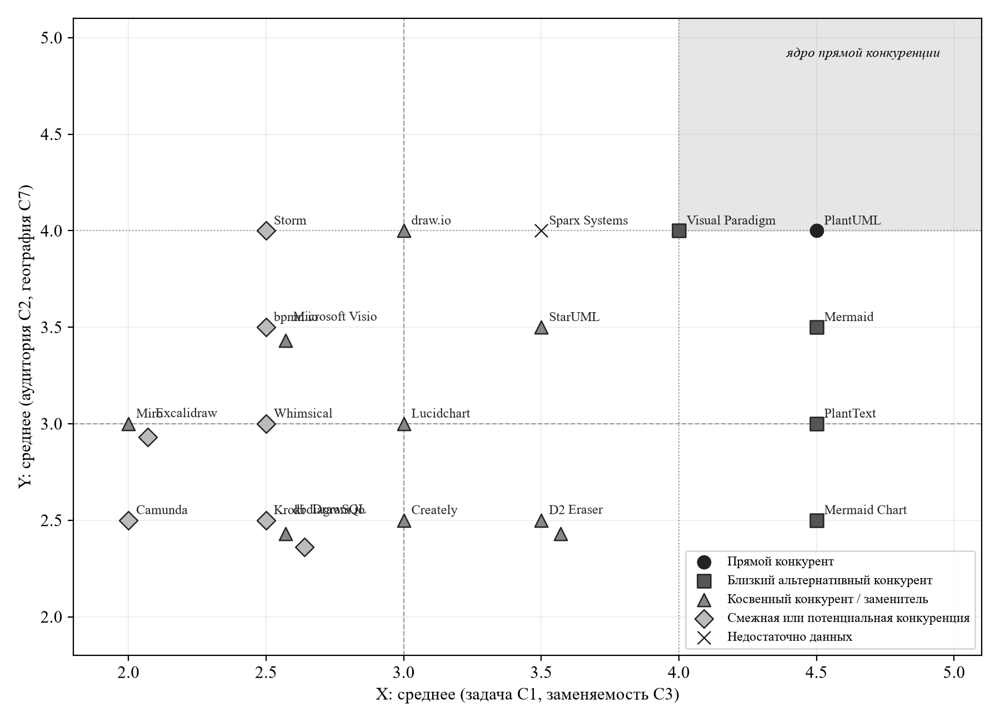
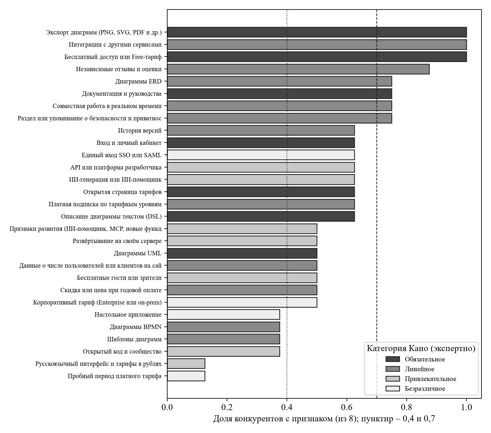
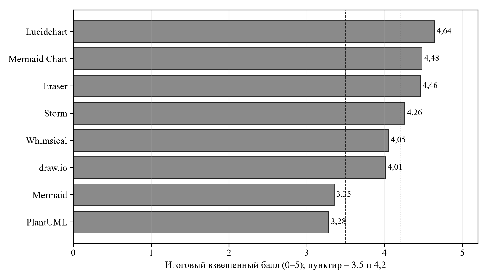

## 1 Цель работы

По открытым данным сайтов и независимых площадок составить и классифицировать конкурентное поле проекта NotaCode по уровням конкуренции, определить рыночный стандарт цифрового товара по моделям Левитта и Кано и реконструировать бизнес-модели конкурентов [1–3].

Задачи работы: описать объект анализа; сформировать реестр компаний и оценить их по десяти критериям шаблона; сформировать выборку конкурентов для анализа цифрового товара и бизнес-модели; разложить признаки товара по уровням Левитта; классифицировать требования по Кано; рассчитать доли конкурентов для рыночного стандарта; восстановить блоки бизнес-модели и практики монетизации; сформулировать выводы для собственного товара и модели.

Проект: NotaCode – веб-IDE «диаграммы как код» для UML, BPMN 2.0, ERD, IDEF0, DFD; тарифная модель freemium – Free и Pro за 40 USD в год (48 USD в год при цене 4 USD в месяц, 4 × 12). Продукт находится до выпуска минимальной версии, собственных данных нет.

Конкурентная группа и данные Similarweb, Вордстат, GitHub, отзывов взяты из ЛР1–ЛР4 (снимок 30.09.2026) [4–8]; страницы конкурентов (главные, тарифы, документация, интеграции, шаблоны, безопасность) просмотрены 01.10.2026 [9].

## 2 Ход работы

### 2.1 Исходные материалы и порядок работы

Работа выполнена по трём методикам и трём Excel-шаблонам [1–3]. Расчёты ведутся в рабочих копиях шаблонов; найденные дефекты шаблонов исправлены и описаны в разделе 2.5.

Таблица 1 – Соответствие частей работы методикам и рабочим книгам

| Часть | Методика | Рабочая книга | Результат |
|---|---|---|---|
| A | Классификация компаний по уровням конкуренции | Excel/klassifikaciya_urovni_konkurencii_NotaCode.xlsx | Реестр из 22 компаний, оценка по критериям C1–C10, уровни, карта близости |
| B | Анализ по сайтам: цифровой товар, модели Левитта и Кано | Excel/analiz_konkurentov_Levitt_Kano_NotaCode.xlsx | Выборка из 8 конкурентов, карта сайтов (40 записей), 153 признаков по Левитту, 33 требований по Кано, рыночный стандарт, сравнение по 25 критериям |
| C | Анализ бизнес-модели конкурентов по сайтам | Excel/analiz_biznes_modeli_konkurentov_NotaCode.xlsx | 145 фактов сайтов, 12 блоков бизнес-модели, монетизация, каналы, стандарт бизнес-модели, рейтинг |

Шкала шаблона классификации отличается от шкалы методики (десять критериев со шкалой 0–5 и пять уровней вместо восьми критериев 0–4 и семи уровней); в работе применена шкала шаблона, определения уровней и правила корректировки взяты из методики [1]. Оценки по шкалам – экспертные; правила начисления записаны в журналах книг. Для частей B и C принято правило: признак засчитывается, если он найден на просмотренных страницах; отсутствие на просмотренных страницах не доказывает отсутствия у продукта, поэтому доли конкурентов могут быть занижены.

### 2.2 Часть A. Классификация компаний по уровням конкуренции

#### 2.2.1 Объект анализа

Таблица 2 – Описание объекта анализа

| Поле | Значение |
|---|---|
| Объект | NotaCode – веб-IDE «диаграммы как код» (UML, BPMN, ERD, IDEF0, DFD) |
| Потребительская задача | Быстро строить и проверять диаграммы формальных нотаций из текстового описания |
| Сегмент | Студенты технических специальностей (Free), аналитики и разработчики ПО (Pro) |
| География и язык | Беларусь; расширение на Россию и СНГ; русский и английский языки |
| Ценовой диапазон | Free; Pro 40 USD в год (48 USD в год при 4 × 12) |
| Ключевой результат | Корректная диаграмма в выбранной нотации, экспортируемая в документ |

#### 2.2.2 Реестр компаний и источники обнаружения

В реестр внесено 22 компаний: 20 кандидатов конкурентной группы ЛР4, Whimsical (ЛР2-3) и Microsoft Visio. Источники обнаружения – таблица кандидатов ЛР4, прямые конкуренты и заменители ЛР1, поисковые запросы Вордстата; для каждой компании на листе «02_Доказательства» записаны URL, факт, сила и достоверность сигнала. Рекламные библиотеки и выдача поиска не проверялись (доступ закрыт).

#### 2.2.3 Оценка по критериям и итоговые уровни

Взвешенный балл – сумма произведений баллов C1–C10 на веса, делённая на сумму весов (шкала 0–5). Баллы – экспертная оценка по данным ЛР1–ЛР4 и страницам конкурентов; правила начисления по каждому критерию записаны на листе «09_Журнал» рабочей книги.

Таблица 3 – Распределение компаний по уровням конкуренции

| Уровень | Компаний | Компании (взвешенный балл) |
|---|---|---|
| Прямой конкурент | 1 | PlantUML (4,1) |
| Близкий альтернативный конкурент | 4 | Mermaid (4,07); PlantText (3,72); Mermaid Chart (3,71); Visual Paradigm (3,63) |
| Косвенный конкурент / заменитель | 9 | draw.io (3,24); Lucidchart (3,13); Creately (2,99); Eraser (2,96); dbdiagram.io (2,9); D2 (2,82); StarUML (2,81); Microsoft Visio (2,65); Miro (2,57) |
| Смежная или потенциальная конкуренция | 7 | bpmn.io (2,44); Whimsical (2,38); Storm (2,26); Kroki (2,07); Excalidraw (1,98); DrawSQL (1,93); Camunda (1,92) |
| Недостаточно данных | 1 | Sparx Systems (1,9) |

Средний взвешенный балл по 22 компаниям – 2,83. Карта конкурентной близости построена на листе «07_Карта» (X – среднее задачи и заменяемости, Y – среднее аудитории и географии), рисунок 1.

Рисунок 1 – Карта конкурентной близости

#### 2.2.4 Ограничения части A

Прямой конкурент требует не менее трёх подтверждений [1]: для PlantUML подтверждены страница товара, задача, пересечение каналов и цена. Главная страница Sparx Systems вернула HTTP 403, поэтому компания остаётся в уровне «Недостаточно данных». Критерий C10 (вероятность переключения) оценён только для инструментов, форматы которых NotaCode планирует импортировать.

### 2.3 Часть B. Анализ цифрового товара по сайтам

#### 2.3.1 Исследовательский вопрос и выборка

Вопрос: какой минимальный состав цифрового товара ожидает рынок диаграмм «как код» и чем может отличаться NotaCode. Выборка – 8 конкурентов из части A (норма методики – 5–12): три текстовых инструмента (PlantUML, Mermaid, Mermaid Chart), редактор процессов Storm, универсальные редакторы (draw.io, Lucidchart, Whimsical) и ИИ-сервис Eraser.

Таблица 4 – Выборка конкурентов и модель монетизации

| ID | Конкурент | Уровень по части A | Тарифы и условия (страницы тарифов, ЛР1, ЛР2-3) |
|---|---|---|---|
| C01 | PlantUML | Прямой конкурент | открытый код, бесплатно (ЛР1, табл. 42) |
| C02 | Mermaid (библиотека) | Близкий альтернативный конкурент | открытый код (MIT); платные планы у Mermaid Chart |
| C03 | Mermaid Chart | Близкий альтернативный конкурент | Basic Free (до 6 диаграмм, 15 ИИ-кредитов); Plus 10 USD (300 кредитов); Premium 20 USD (2 000 кредитов, зрители без оплаты) за пользователя в месяц пр… |
| C04 | Storm (StormBPMN) | Смежная или потенциальная конкуренция | Персональный 0 руб. (до 50 моделей); Команда 1 200 руб. (1 500 руб. помесячно) за пользователя в месяц; Бизнес 4 720 руб. (5 900 руб.); Enterprise на … |
| C05 | draw.io (diagrams.net) | Косвенный конкурент / заменитель | полностью бесплатный, открытый код (Apache 2.0) (ЛР1, табл. 42) |
| C06 | Lucidchart | Косвенный конкурент / заменитель | Free (3 документа, 75 фигур, 100 шаблонов); Individual 9 USD; Team 10 USD за пользователя в месяц при оплате за год; Enterprise по запросу; пробный пе… |
| C07 | Eraser | Косвенный конкурент / заменитель | Free (0 USD; 3 файла, 3 ИИ-диаграммы); Starter 15 USD (20 USD при помесячной оплате); Business 45 USD (60 USD); Enterprise по запросу; цены за участни… |
| C08 | Whimsical | Смежная или потенциальная конкуренция | Free (0 USD; 50 объектов доски и 50 блоков документа в месяц, водяной знак при экспорте); Pro 10 USD, Business 20 USD за редактора в месяц (страница т… |

#### 2.3.2 Карта сайтов

На листе «02_Карта_сайтов» зафиксировано 40 записей: 35 страниц сайтов (главные, тарифы, документация, интеграции, шаблоны, безопасность, блог) и 5 репозиториев GitHub; норма методики – 30 и более страниц выполнена. Страницы получены автоматическим извлечением текста 01.10.2026 (сырые данные – Материалы_собранные/sajty_konkurentov_stranicy_2026-10-01.json); страницы Lucidchart и тарифы Mermaid Chart, недоступные автоматическому запросу, прочитаны во встроенном браузере. Достоверность 5 присвоена страницам, прочитанным целиком (тарифы), и данным GitHub API, 4 – страницам с автоматическим извлечением.

Таблица 5 – Число записей карты сайтов по конкурентам

| Конкурент | Записей | Типы страниц |
|---|---|---|
| PlantUML | 8 | Главная, Документация, Репозиторий GitHub |
| Mermaid (библиотека) | 9 | Главная, Документация, Интеграции, Репозиторий GitHub |
| Mermaid Chart | 3 | Главная, Документация, Тарифы |
| Storm (StormBPMN) | 3 | Блог и обновления, Главная, Тарифы |
| draw.io (diagrams.net) | 4 | Блог и обновления, Главная, Репозиторий GitHub |
| Lucidchart | 2 | Главная, Тарифы |
| Eraser | 5 | Главная, Документация, ИИ-функции, Тарифы |
| Whimsical | 6 | Безопасность, Главная, Документация, ИИ-функции, Тарифы, Шаблоны |

#### 2.3.3 Разбор по модели Левитта

На листе «03_Левитт» внесено 153 признаков с оценкой силы реализации (0–3), понятности (0–3) и влияния на ценность (1–5); норма методики – 40 и более признаков выполнена. Число признаков по уровням приведено в таблице 6. Правила оценок записаны в журнале книги.

Таблица 6 – Число признаков по уровням Левитта

| Уровень | Признаков | Содержание |
|---|---|---|
| 1. Базовая выгода | 8 | Основное обещание главной страницы |
| 2. Родовой товар | 13 | Форма поставки товара и текстовое описание диаграмм |
| 3. Ожидаемый товар | 63 | Тарифы, вход, интеграции, экспорт, документация, UML |
| 4. Расширенный товар | 65 | Отзывы, ИИ, API, открытый код, безопасность, BPMN, ERD |
| 5. Потенциальный товар | 4 | Признаки развития: ИИ-помощник, MCP, новые функции |

#### 2.3.4 Требования по Кано и рыночный стандарт

В «04_Кано» внесено 33 требований: 29 признаков с подтверждённым числом конкурентов и 4 требования NotaCode (полный набор нотаций, IDEF0 и DFD, проверка правил нотации, импорт форматов). Категории Кано присвоены экспертно по распространённости признака и его роли для студентов и аналитиков ПО (Обязательное – 7, Линейное – 11, Безразличное – 4, Привлекательное – 7); опрос по методу Кано не проводился, поэтому классификация предварительная. Статус рыночного стандарта на листе «07_Стандарт_рынка» рассчитан по порогам шаблона (стандарт – 0,6 и более для обязательных и линейных признаков).

Таблица 7 – Признаки товара, доля конкурентов и статус по порогам шаблона

| Признак | Конкурентов из 8 | Доля | Категория Кано (экспертно) | Статус |
|---|---|---|---|---|
| Бесплатный доступ или Free-тариф | 8 | 1,0 | Обязательное | Рыночный стандарт |
| Интеграции с другими сервисами | 8 | 1,0 | Линейное | Рыночный стандарт |
| Экспорт диаграмм (PNG, SVG, PDF и др.) | 8 | 1,0 | Обязательное | Рыночный стандарт |
| Независимые отзывы и оценки | 7 | 0,88 | Линейное | Рыночный стандарт |
| Раздел или упоминание о безопасности и приватности | 6 | 0,75 | Линейное | Рыночный стандарт |
| Совместная работа в реальном времени | 6 | 0,75 | Линейное | Рыночный стандарт |
| Документация и руководства | 6 | 0,75 | Обязательное | Рыночный стандарт |
| Диаграммы ERD | 6 | 0,75 | Линейное | Рыночный стандарт |
| Описание диаграммы текстом (DSL) | 5 | 0,62 | Обязательное | Рыночный стандарт |
| Платная подписка по тарифным уровням | 5 | 0,62 | Линейное | Рыночный стандарт |
| Открытая страница тарифов | 5 | 0,62 | Обязательное | Рыночный стандарт |
| ИИ-генерация или ИИ-помощник | 5 | 0,62 | Привлекательное | Переходит в ожидаемое |
| API или платформа разработчика | 5 | 0,62 | Привлекательное | Переходит в ожидаемое |
| Единый вход SSO или SAML | 5 | 0,62 | Безразличное | Низкий приоритет |
| Вход и личный кабинет | 5 | 0,62 | Обязательное | Рыночный стандарт |
| История версий | 5 | 0,62 | Линейное | Рыночный стандарт |
| Корпоративный тариф (Enterprise или on-prem) | 4 | 0,5 | Безразличное | Низкий приоритет |
| Скидка или цена при годовой оплате | 4 | 0,5 | Линейное | Формирующаяся норма |
| Бесплатные гости или зрители | 4 | 0,5 | Привлекательное | Переходит в ожидаемое |
| Данные о числе пользователей или клиентов на сайте | 4 | 0,5 | Линейное | Формирующаяся норма |
| Диаграммы UML | 4 | 0,5 | Обязательное | Формирующаяся норма |
| Развёртывание на своём сервере | 4 | 0,5 | Привлекательное | Переходит в ожидаемое |
| Признаки развития (ИИ-помощник, MCP, новые функции) | 4 | 0,5 | Привлекательное | Переходит в ожидаемое |
| Открытый код и сообщество | 3 | 0,38 | Привлекательное | Зона дифференциации |
| Шаблоны диаграмм | 3 | 0,38 | Линейное | Формирующаяся норма |
| Диаграммы BPMN | 3 | 0,38 | Линейное | Формирующаяся норма |
| Настольное приложение | 3 | 0,38 | Безразличное | Низкий приоритет |
| Пробный период платного тарифа | 1 | 0,12 | Безразличное | Низкий приоритет |
| Русскоязычный интерфейс и тарифы в рублях | 1 | 0,12 | Привлекательное | Зона дифференциации |

Статусов «Рыночный стандарт» – 13, «Формирующаяся норма» – 5, «Зона дифференциации» – 2, «Переходит в ожидаемое» – 5, «Низкий приоритет» – 4. Нотации IDEF0, DFD и сети Петри на просмотренных страницах 8 конкурентов не найдены (IDEF упомянут в блоге Storm); полный набор UML, BPMN и ERD найден только у Lucidchart – это зона отличия NotaCode. Доли признаков показаны на рисунке 2.

Рисунок 2 – Доля конкурентов с признаком по категориям Кано

#### 2.3.5 Сравнение конкурентов и преимущества

Лист «06_Сравнение» заполнен по 25 критериям методики; критерии, не подтверждённые страницами (демонстрация и контакты Storm, контакты Lucidchart, Eraser и Whimsical, документация Whimsical, дорожная карта draw.io), оставлены пустыми и не входят в знаменатель. Итоговые баллы приведены в таблице 8 и на рисунке 3.

Таблица 8 – Итоговый взвешенный балл конкурентов по 25 критериям

| Конкурент | Балл (0–5) | Интерпретация шаблона |
|---|---|---|
| Lucidchart | 4,64 | Лидерский уровень |
| Mermaid Chart | 4,48 | Лидерский уровень |
| Eraser | 4,46 | Лидерский уровень |
| Storm (StormBPMN) | 4,26 | Лидерский уровень |
| Whimsical | 4,05 | Сильный уровень |
| draw.io (diagrams.net) | 4,01 | Сильный уровень |
| Mermaid (библиотека) | 3,35 | Средний уровень |
| PlantUML | 3,28 | Средний уровень |

Рисунок 3 – Итоговые баллы конкурентов по листу сравнения

На листе «08_Преимущества» зафиксировано 8 преимуществ с индексом 1–5 (редкость 0,25, сила 0,25, ценность 0,30, качество доказательства 0,20): четыре сильных и четыре потенциальных (таблица 9).

Таблица 9 – Конкурентные преимущества по товару

| Конкурент | Преимущество | Индекс | Вывод шаблона |
|---|---|---|---|
| Eraser | ИИ-генерация и diagram-as-code в одном продукте | 4,45 | сильное |
| Storm | Девять модулей и русскоязычный рынок с тарифами в рублях | 4,45 | сильное |
| draw.io | Бесплатное приложение без enterprise-тарифа, privacy-first | 4,30 | сильное |
| Mermaid | Открытая экосистема, сообщество 90 489 звёзд | 4,20 | сильное |
| Lucidchart | Глубина товара и масштаб (шаблоны, SAML, Fortune 500) | 3,95 | потенциальное |
| Mermaid Chart | Прозрачные тарифы и зрители без оплаты | 3,95 | потенциальное |
| PlantUML | Широкий набор UML и запуск на собственном сервере | 3,75 | потенциальное |
| Whimsical | Неограниченные гости и зрители | 3,40 | потенциальное |

#### 2.3.6 Собственный цифровой товар

Лист «05_Матрица_товара» заполнен по 12 блокам определения. Формулировка: цифровой товар NotaCode – это веб-IDE «диаграммы как код» для студентов и аналитиков ПО, который решает задачу построения и проверки диаграмм UML, BPMN, ERD, IDEF0 и DFD по текстовому описанию за счёт онлайн-редактора с экспортом, бесплатного уровня Free и подписки Pro 40 USD в год. Минимальный состав: бесплатный доступ, UML, ERD, экспорт, документация, открытая цена; расширенный – ИИ-помощник, совместная работа, история версий, API. Цена Pro ниже минимальных тарифов конкурентов (от 9 USD в месяц), но её нужно подтвердить опросом потребителей.

### 2.4 Часть C. Анализ бизнес-модели конкурентов

#### 2.4.1 Паспорт исследования

Решение, для которого проводится анализ: выбор модели монетизации и состава бесплатного уровня NotaCode. Единица анализа – предложение конкурента на его сайте; рынок и период сбора – по ЛР4 и страницам 01.10.2026; конкуренты – 8 из таблицы 4.

#### 2.4.2 Факты сайтов и блоки бизнес-модели

На листе «03_Факты_сайта» зафиксировано 145 фактов с доказательностью 1–5 (5 – данные GitHub API и страницы тарифов SaaS-конкурентов; 4 – явное описание на странице; 3 – найдено по ключевым словам или данным Similarweb). Все 12 блоков заполнены для 8 конкурентов (полнота профиля 1,00); блоки деятельности, партнёров, затрат и сетевых эффектов основаны на косвенных признаках и помечены как гипотезы. Средняя доказательность профилей приведена в таблице 10.

Таблица 10 – Доказательность и итог матрицы бизнес-моделей

| Конкурент | Фактов | Средняя доказательность | Индекс силы | Итог с учётом надёжности |
|---|---|---|---|---|
| Lucidchart | 24 | 3,96 | 4,63 | 4,52 |
| Storm (StormBPMN) | 21 | 3,86 | 3,89 | 4,05 |
| Eraser | 22 | 4,0 | 3,76 | 4,01 |
| draw.io (diagrams.net) | 16 | 3,62 | 3,89 | 3,99 |
| Mermaid Chart | 21 | 3,95 | 3,73 | 3,98 |
| Whimsical | 13 | 4,0 | 3,62 | 3,92 |
| Mermaid (библиотека) | 14 | 3,79 | 3,53 | 3,81 |
| PlantUML | 14 | 3,71 | 3,2 | 3,6 |

#### 2.4.3 Монетизация

Преобладает условно-бесплатная модель: Free и подписка за пользователя или редактора в месяц (Mermaid Chart, Storm, Lucidchart, Eraser, Whimsical – 5 из 8); три инструмента бесплатны с открытым кодом (PlantUML, Mermaid, draw.io). Тарифы Storm указаны в рублях, у остальных – в USD (таблица 4). Прозрачность цены (1–5) выше у конкурентов с открытой страницей тарифов; гибкость модели – у Storm (бесплатный старт, тарифы за пользователя, on-prem).

#### 2.4.4 Каналы и воронка

Каналы по Similarweb Pro (июнь – август 2026) приведены для доменов, по которым данные получены (PlantUML: органический поиск 47,25 %, прямые заходы 38,11 %). Типы воронок: контентная (PlantUML, Mermaid), регистрация (Mermaid Chart, Eraser, Whimsical), корпоративные продажи (Storm), пробный доступ (Lucidchart), самостоятельная работа без регистрации (draw.io). Сложность пути клиента минимальна у PlantUML и draw.io (вход без регистрации).

#### 2.4.5 Рыночный стандарт бизнес-модели

Таблица 11 – Практики бизнес-модели и доля конкурентов (порог стандарта шаблона – 70 %)

| Практика | Конкурентов из 8 | Доля | Статус по шаблону |
|---|---|---|---|
| Бесплатный доступ или Free-тариф | 8 | 1,0 | рыночный стандарт |
| Платная подписка по тарифным уровням | 5 | 0,62 | формирующийся стандарт |
| Открытая страница тарифов | 5 | 0,62 | формирующийся стандарт |
| Корпоративный тариф | 4 | 0,5 | формирующийся стандарт |
| Скидка при оплате за год | 4 | 0,5 | формирующийся стандарт |
| Пробный период | 1 | 0,12 | слабый сигнал |
| Бесплатные гости или зрители | 4 | 0,5 | формирующийся стандарт |
| Интеграции | 8 | 1,0 | рыночный стандарт |
| API | 5 | 0,62 | формирующийся стандарт |
| ИИ-функции | 5 | 0,62 | формирующийся стандарт |
| SSO или SAML | 5 | 0,62 | формирующийся стандарт |
| Открытый код и сообщество | 3 | 0,38 | зона дифференциации |
| Независимые отзывы | 7 | 0,88 | рыночный стандарт |
| Данные о числе пользователей на сайте | 4 | 0,5 | формирующийся стандарт |
| Раздел о безопасности и приватности | 6 | 0,75 | рыночный стандарт |
| Документация | 6 | 0,75 | рыночный стандарт |
| Развёртывание на своём сервере | 4 | 0,5 | формирующийся стандарт |
| Вход и личный кабинет | 5 | 0,62 | формирующийся стандарт |
| Русскоязычные тарифы в рублях | 1 | 0,12 | слабый сигнал |

Рыночный стандарт – 5 практик, формирующийся стандарт – 11, зона дифференциации – 1, слабый сигнал – 2. Рейтинг по итогу матрицы с учётом надёжности: Lucidchart (4,52), Storm (4,05), Eraser (4,01), draw.io (3,99), Mermaid Chart (3,98), Whimsical (3,92), Mermaid (3,81), PlantUML (3,6).

#### 2.4.6 Гипотезы для NotaCode

Повторить: бесплатный уровень, открытую страницу тарифов, экспорт, документацию, раздел о безопасности. Улучшить: тарифы Pro (цена ниже минимальных тарифов конкурентов), набор нотаций (IDEF0, DFD, сети Петри). Проверить: ИИ-функции и API как платные возможности Pro, тариф за пользователя для команд. Не копировать: корпоративные тарифы и SSO до появления спроса, русскоязычные тарифы в рублях без анализа рынка РФ. Выводы предварительные: профили основаны на публичных страницах.

### 2.5 Исправления рабочих копий шаблонов

Таблица 12 – Исправленные дефекты шаблонов

| Книга | Лист и ячейки | Дефект | Исправление |
|---|---|---|---|
| A | 04_Оценка, столбец N | SUMPRODUCT получает строку и столбец разных размеров, результат #ЗНАЧ! | Явная сумма произведений баллов на веса |
| A | 06_Сводка, B19:F28 | При равных баллах топ-10 повторяет компанию | Выбор n-го совпадения |
| A | 01, 02, 04 (проверки данных) | Списки ссылаются на другие справочники | Проверки заменены на нужные списки |
| A | XLOOKUP на листах 02, 04, 07 | Функция записана без префикса, название не подтягивается | Формулы введены повторно |
| B | 06_Сравнение, строки 90–91 | Формулы столбцов F–L ссылаются на столбец E, итог одинаков у всех конкурентов | Ссылки заменены на собственные столбцы |
| C | 10_Стандарт, столбец E | Знаменатель – заголовок 12_Сводка!B4, доля везде 0 | Знаменатель заменён на 12_Сводка!B5 |
| B | 06_Сравнение, столбец O (P26-P80) | В пустых строках результат #Н/Д (MAX пустого диапазона = 0) | Формула обёрнута в IFERROR |

Полный перечень – на листах журналов рабочих книг.

## 3 Проверка по критериям методики

Таблица 13 – Контрольный перечень результатов

| № | Пункт | Статус | Где в отчёте |
|---|---|---|---|
| 1 | Описан объект анализа | да | таблица 2 |
| 2 | Составлен реестр компаний с источниками обнаружения | да | раздел 2.2.2 |
| 3 | Оценка по критериям, индекс и уровни | да (оценки экспертные) | таблица 3 |
| 4 | Не менее трёх подтверждений для прямого конкурента | да (PlantUML) | раздел 2.2.4 |
| 5 | Карта конкурентного поля | да | рисунок 1 |
| 6 | Выборка 5–12 конкурентов | да (8) | таблица 4 |
| 7 | 30 и более проверенных страниц | да (40) | раздел 2.3.2 |
| 8 | 40 и более признаков по Левитту | да (153) | раздел 2.3.3 |
| 9 | 25 и более требований по Кано | да (33), категории экспертные | раздел 2.3.4 |
| 10 | Сравнение по 25 критериям | да | раздел 2.3.5 |
| 11 | Блоки бизнес-модели, монетизация, стандарт | да | разделы 2.4.2–2.4.5 |
| 12 | Определение собственного цифрового товара | да | раздел 2.3.6 |

## Выводы

1. Сформировано конкурентное поле из 22 компаний: один прямой конкурент (PlantUML), четыре близких, девять косвенных и заменителей, семь смежных, одна компания с недостаточными данными (Sparx Systems); средний взвешенный балл 2,83.

2. Для анализа цифрового товара и бизнес-модели отобраны 8 конкурентов; просмотрено 40 страниц и репозиториев, подтверждено 153 признаков по Левитту, 33 требований по Кано и 145 фактов сайтов.

3. Рыночный стандарт цифрового товара по порогам шаблона (13 признаков): описание диаграммы текстом, бесплатный доступ, платная подписка и открытая страница тарифов, интеграции, независимые отзывы, раздел о безопасности, вход, совместная работа, экспорт, история версий, документация и ERD; UML (4 из 8), BPMN и шаблоны – формирующаяся норма. ИИ-помощник и API переходят в ожидаемое (по 5 из 8). В зону отличия NotaCode попадают IDEF0, DFD и сети Петри, которые на сайтах конкурентов не найдены.

4. Рыночный стандарт бизнес-модели (порог 70 %): бесплатный доступ, интеграции, независимые отзывы, раздел безопасности, документация; преобладает условно-бесплатная модель с подпиской за пользователя в месяц. Сильнейшая модель – Lucidchart.

5. Для NotaCode предварительно принята модель freemium: Free и Pro 40 USD в год; она соответствует практике Mermaid Chart, Lucidchart и Eraser, а цена Pro ниже минимальных тарифов конкурентов (от 9 USD в месяц).

6. Классификация по Кано и оценки по шкалам экспертные: для окончательных выводов нужны опрос потребителей по методу Кано и проверка работы продуктов (проверка правил нотации, импорт форматов); эти данные перечислены в приложении Б.

7. Данные 02.10.2026 (приложение В): цены и нотации Sparx Systems, 49 отзывов Trustpilot и отзывы SourceForge о PlantUML, реклама в Беларуси, сгенерированный опрос по Кано, где экспорт без оплаты оказался обязательным признаком, а DFD и сети Петри – безразличными; реальный опрос и проверка работы продуктов остаются (приложение Б).

## Список использованных источников

1. Методика классификации компаний по уровням конкуренции: материалы курса «Электронный бизнес». – Файл: Материалы/Методика_классификации_компаний_по_уровням_конкуренции.docx.
2. Методика анализа конкурентов по сайтам (цифровой товар): материалы курса «Электронный бизнес». – Файл: Материалы/Методика_анализа_конкурентов_по_сайтам_цифровой_товар.docx.
3. Методика анализа бизнес-модели конкурентов по сайтам: материалы курса «Электронный бизнес». – Файл: Материалы/Методика_анализа_бизнес_модели_конкурентов_по_сайтам.docx.
4. Хаджинова, К. А. Отчёты по лабораторным работам ЛР1–ЛР4 «Электронный бизнес»: проект NotaCode. – Минск: БГУИР, 2026.
5. Similarweb Pro: обзор доменов, июнь – август 2026 [Электронный ресурс]. – Режим доступа: https://pro.similarweb.com. – Дата доступа: 30.09.2026.
6. GitHub REST API: данные репозиториев [Электронный ресурс]. – Режим доступа: https://api.github.com. – Дата доступа: 30.09.2026.
7. Trustpilot: страницы оценок доменов [Электронный ресурс]. – Режим доступа: https://www.trustpilot.com. – Дата доступа: 30.09.2026.
8. Яндекс Вордстат: статистика запросов [Электронный ресурс]. – Режим доступа: https://wordstat.yandex.ru. – Дата доступа: 30.09.2026.
9. Страницы сайтов конкурентов: plantuml.com, mermaid.js.org, mermaid.ai, mermaidchart.com, stormbpmn.com, drawio.com, lucid.co, lucid.app, eraser.io, whimsical.com [Электронный ресурс]. – Дата доступа: 01.10.2026.
10. Sparx Systems Enterprise Architect: главная страница и цены [Электронный ресурс]. – Режим доступа: https://sparxsystems.com/products/ea/. – Дата доступа: 02.10.2026.
11. Trustpilot: отзывы о Lucid, Miro, Creately, SmartDraw, Visual Paradigm [Электронный ресурс]. – Режим доступа: https://www.trustpilot.com. – Дата доступа: 02.10.2026.
12. Google Ads Transparency Center, регион Беларусь [Электронный ресурс]. – Режим доступа: https://adstransparency.google.com. – Дата доступа: 02.10.2026.
13. SourceForge: отзывы о PlantUML [Электронный ресурс]. – Режим доступа: https://sourceforge.net/projects/plantuml/reviews/. – Дата доступа: 02.10.2026.

## Приложение А (обязательное) Перечень файлов работы

Таблица 14 – Файлы лабораторной работы

| Файл или папка | Содержание |
|---|---|
| Excel/klassifikaciya_urovni_konkurencii_NotaCode.xlsx | Часть A: классификация компаний |
| Excel/analiz_konkurentov_Levitt_Kano_NotaCode.xlsx | Часть B: цифровой товар, Левитт, Кано |
| Excel/analiz_biznes_modeli_konkurentov_NotaCode.xlsx | Часть C: бизнес-модель конкурентов |
| Материалы_собранные/sajty_konkurentov_stranicy_2026-10-01.json | Извлечения со страниц конкурентов (заголовки, метаданные, счётчики признаков) |
| Python/lr5_common.py, lr5_part_a.py, spec_a.py, spec_bc.py, collect_sites.py, figures.py, build_report.py | Подготовка данных, описание заполнения книг, сбор страниц, рисунки, сборка отчёта |
| Excel_COM/fill_workbook.ps1, read_values.ps1 | Заполнение и чтение книг через COM |
| Рисунки/ | Рисунки 1–3 отчёта |

## Приложение Б (обязательное) Данные, не подтверждённые источниками

Таблица 15 – Перечень данных, требующих дополнительного сбора

| № | Что нужно | Почему не получено |
|---|---|---|
| 1 | модельная оценка (допущение; причина: опрос реальных потребителей по методу Кано )| Проведена сгенерированная выборка из 30 респондентов (приложение В, таблица 18); спрос она не доказывает |
| 2 | модельная оценка (допущение; причина: проверка работы продуктов: проверка правил нотации, импорт форматов )| Требует установки и теста редакторов; отзывы SourceForge о PlantUML (таблица 19) подтверждают расхождения со стандартом UML |
| 3 | Главная страница и тарифы Sparx Systems | Получено 02.10.2026 через браузер (приложение В, таблица 16): вопрос закрыт |
| 4 | Similarweb Pro для Whimsical, Eraser и др.; доля Беларуси | Сняты Worldwide-данные и структура каналов для eraser.io, whimsical.com, mermaid.ai, lucid.app, drawio.com, miro.com, smartdraw.com (ЛР4, приложение Д); доля Беларуси недоступна (модельная оценка (допущение) при полном доступе); Visio и DrawSQL не снимались |
| 5 | Рекламные объявления и выдача Яндекса по запросам ядра | Google Ads Transparency по Беларуси получен (таблица 16); LinkedIn Ad Library заменён структурой каналов Similarweb (ЛР4, приложение Д); выдача Яндекса не снималась |
| 6 | Отзывы G2 и Capterra по Storm | G2 и Capterra закрыты проверкой безопасности; заменены Trustpilot (49 записей, таблица 17) и SourceForge (PlantUML, таблица 19); по Storm отзывов нет |
| 7 | модельная оценка (допущение; причина: проверка цены Pro опросом реальных потребителей )| Цена 40 USD в год; в сгенерированном опросе 37 % готовы платить до 3 USD в месяц, 20 % – 3–5 USD, 13 % – более 5 USD; реальный спрос не проверялся |

## Приложение В (обязательное) Данные, собранные 02.10.2026

Данные получены после первой сборки отчёта и дополняют части B и C: цены и нотации Sparx Systems [10], отзывы пользователей [11], рекламная активность в Беларуси [12], сгенерированный опрос Кано.

Таблица 16 – Новые данные о конкурентах

| Показатель | Значение |
|---|---|
| Sparx Systems Enterprise Architect 17.2, цена за лицензию, USD (постоянная / плавающая) | Professional 245 / 320; Corporate 320 / 425; Unified 535 / 699; Ultimate 750 / 965 |
| Sparx, нотации | UML 2.5, SysML, BPMN, ArchiMate, моделирование данных; IDEF0, IDEF1X, IDEF3, DFD и сети Петри не заявлены; текстового ввода диаграмм нет |
| Sparx, доступ | настольное приложение; пробный период 30 дней; бесплатна только версия Lite для чтения |
| Реклама в Беларуси (число объявлений) | lucid.co 28; miro.com 23; smartdraw.com 8; drawio.com, eraser.io, creately.com 0 |

Таблица 17 – Темы жалоб пользователей по отзывам Trustpilot (49 записей, пять продуктов)

| Тема | Число отзывов | Следствие для NotaCode |
|---|---|---|
| Платный экспорт, лимиты бесплатного плана | 18 | Открытый экспорт PNG и SVG в тарифе Free |
| Непрозрачный биллинг, отмена подписки | 9 | Честная отмена и возврат, предупреждение о лимитах |
| Удобство и ошибки | 12 | Простой редактор без навязчивых окон |
| Поддержка | 1 | Канал обратной связи |
| Положительные оценки | 9 | Полезный бесплатный тариф ценится |

Таблица 18 – Сгенерированный опрос по методу Кано (30 респондентов): категория признака по модальному ответу

| Признак | Категория Кано | Число ответов M / O / A / I |
|---|---|---|
| Экспорт PNG и SVG без оплаты | M (обязательный) | 15 / 7 / 4 / 4 |
| Текстовый ввод диаграмм | O (одномерный) | 8 / 13 / 6 / 3 |
| Нотации IDEF0, IDEF1X, IDEF3 | O (одномерный) | 5 / 12 / 11 / 2 |
| Совместное редактирование | A (привлекательный) | 5 / 7 / 11 / 7 |
| Импорт из PlantUML и Mermaid | A (привлекательный) | 2 / 8 / 10 / 10 |
| DFD и сети Петри | I (безразличный) | 0 / 7 / 5 / 18 |

Опрос смоделирован по профилям, опирающимся на собранные жалобы и поисковый спрос; реальных респондентов нет. Из 30 условных респондентов 21 готов платить за Pro (70 %), что завышено относительно целевой конверсии 3 % документации проекта. Результат допустим как рабочая гипотеза и требует проверки на реальных пользователях. Исходные таблицы: Материалы_собранные/opros_kano_sgenerirovan_2026-10-02.md.

Для закрытых сайтов G2 и Capterra (проверка безопасности Cloudflare) источником отзывов о прямом конкуренте выбран SourceForge [13]: у PlantUML рейтинг 4,8 из 5 по 50 оценкам (47 – пять звёзд, одна – две звезды, одна – одна звезда).

Таблица 19 – Темы отзывов о PlantUML на SourceForge

| Тема | Суть | Следствие для NotaCode |
|---|---|---|
| Текст вместо рисования | диаграмма из текста хранится в системе контроля версий, изменения видны построчно | основа предложения подтверждена |
| Простота языка и документация | освоение быстрое, ответы на форуме быстрые | нужны документация и примеры |
| Нет графического интерфейса | нужен jar и текстовый файл, нет подсветки при редактировании | веб-редактор с подсветкой и предпросмотром закрывает пробел |
| Расхождения со стандартом UML | повторный вывод класса выглядит как новый | проверка правил нотации в редакторе |
| Совместимость | сломанные макросы после обновления, сработка антивируса на шаблоне Word | версионирование и стабильный экспорт |

Sparx Systems в классификации части A отнесён к группе «Недостаточно данных» (1,9 балла), так как данные страницы получены позже. По новым данным (таблица 16) продукт поддерживает UML, BPMN и моделирование данных, но не заявляет IDEF0, DFD и текстовый ввод, и ориентировочно относится к косвенным конкурентам; пересчёт листа классификации не выполнялся, итоговые числа таблицы 3 не менялись.
