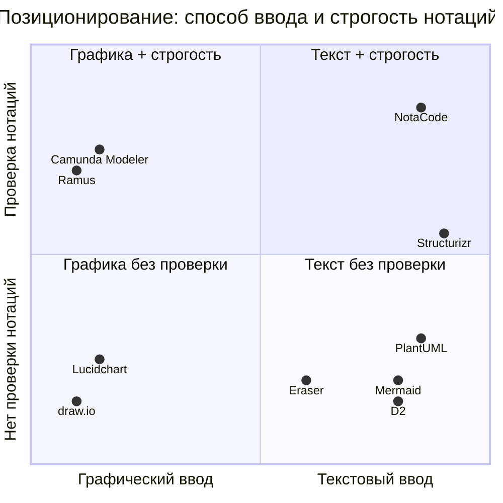

# ЛР5. Список рисунков

## Сгенерировано (`python -B Python/lr5_charts.py`)

| № в отчёте | Файл | Содержание |
|---|---|---|
| 1 | `fig_02_vzveshennye_bally.png` | Взвешенный балл N 20 компаний с порогами 1,6/2,5/3,4/4,2 |
| 2 | `fig_01_karta_konkurentnogo_polya.png` | Карта конкурентного поля: X = ср(C1,C3), Y = ср(C2,C7), зоны 07_Карта |
| 3 | `fig_03_levitt_heatmap.png` | Heatmap Левитта: конкурент × уровень товара |
| 4 | `fig_05_kano_raspredelenie.png` | Распределение требований по Кано и доли конкурентов |
| 5 | `fig_04_kano_heatmap.png` | Heatmap присутствия требований Кано у 12 конкурентов |
| 6 | `fig_06_sravnenie_P01_P25.png` | Итоговый балл 06_Сравнение |
| 7 | `fig_07_biznes_model.png` | Индекс силы и итог бизнес-модели (09_Матрица) |

Диаграммы в самих Excel-файлах строят VBA-модули (карта на 07_Карта, баллы на 04_Оценка, 06_Сравнение, 09_Матрица).

## Сделать самой (скриншоты)

`scr_01` … `scr_41` — список и содержание в `ИНСТРУКЦИЯ_ДЛЯ_МЕНЯ.md`, раздел 3 (выдача поиска, главные и тарифы конкурентов, SimilarWeb, листы Excel после макросов). Снимать Win+Shift+S, PNG, в эту папку. В отчёт вставлять по желанию в приложение, с подписью «Рисунок N – …».

## Необязательная схема: карта позиционирования (можно отрисовать в NotaCode/draw.io)

Координаты — экспертная оценка из концепции NotaCode (01-project-concept.md, раздел 5).
