## 1 Цель работы

Перевести результаты анализа спроса, объёма рынка, конкуренции и конкурентов (ЛР1–ЛР5) в проектное описание цифрового товара NotaCode: сформулировать доказательное ценностное предложение, цифровой товар и единицу монетизации, собрать бизнес-модель по Канвас, описать бизнес-логику и пользовательские сценарии, вывести из них страницы сайта и экраны приложения и разделить разработку на первый рыночный и последующие релизы.

Объект анализа – NotaCode, веб-приложение (PWA) класса «diagram as code» для формальных нотаций: UML, BPMN 2.0, ERD, IDEF0, IDEF1X, IDEF3, DFD, сети Петри. Диаграмма описывается на собственном DSL, система выполняет разбор, проверку правил нотации с кодом правила и номером строки, раскладку elkjs, отрисовку SVG с подсветкой «строка ↔ элемент», хранит версии и экспортирует результат. Модель монетизации – freemium: Free (5 проектов, 20 версий, экспорт SVG/PNG) и Pro 4 USD/мес или 40 USD/год [15].

## 2 Ход работы

### 2.1 Исходные данные и порядок выполнения

Лабораторная работа выполнена по пяти методикам, результат каждой является входом следующей [1–5]: проблема клиента → ценностное предложение → цифровой товар → единица монетизации → Канвас → бизнес-логика → сценарии → страницы и экраны → релизы. Для каждой методики заполнен соответствующий Excel-шаблон; данные внесены VBA-модулями (приложение В), все индексы пересчитаны независимо скриптом Python и сверены со значениями, которые вычислил Excel.

Входные данные:

- ЛР1: Google Trends – индекс PlantUML 16 → 53 с 19.09.2021 по 08.12.2024 (рост ≈231 %), запрос «text to diagram ai» – Breakout [13];
- ЛР2-3: SimilarWeb – plantuml.com ≈507 тыс. визитов, Россия 9,07 % трафика (1-е место); eraser.io 678,5 тыс.; app.diagrams.net 7,8 млн визитов (снято 17.09.2026 и 23.09.2026) [12];
- ЛР4: высокая сила покупателей и поставщиков LLM, барьер доверия против PlantUML;
- ЛР5: прямые конкуренты PlantUML (90,0), Mermaid (90,0), MermaidChart (83,5), Eraser.io (93,0), близкие D2 (79,5) и draw.io (67,5); рыночный стандарт – текстовый DSL, браузерный рендер, интеграция с GitHub [18];
- документы проекта: концепция (проблемы P-01…P-06, сегменты S-01…S-04, тарифы) [15], план Scrumban с эпиками E0–E13, волнами нотаций и спринтами S0–S12, MVP к S10 (06.12.2026) [16], архитектура C4 [17], прототип интерфейса – 17 HTML-мокапов прежней версии продукта (DiagramCode – прежнее имя NotaCode).

Минимальная доказательная база методики 6.1 выполнена частично: конкурентов 9 (норма ≥ 3), страниц сайтов 11 (норма ≥ 10), отзывов 0 из 30. 🔲 ДОСНЯТЬ: 30 отзывов и высказываний пользователей draw.io, Lucidchart, PlantUML, Mermaid, Ramus (G2, Capterra, Reddit, Habr) и опрос 20+ студентов (строки SRC-015, SRC-016 реестра источников, приложение А).

Все критерии, шкалы, веса и формулы взяты без изменений из методик и шаблонов. Там, где методика (docx) и шаблон (xlsx) задают разные формулы (индекс проблемы, индекс сценария, приоритет релиза), решение принимается по формуле Excel-шаблона, а расчёт по методике приводится для сравнения; каждое такое расхождение указано явно.

### 2.2 Ценностное предложение и цифровой товар

#### 2.2.1 Проблемы клиентов и выбор опорной проблемы

Проблемное поле описано восемью проблемами P-001…P-008. Опорная проблема сформулирована по формуле полной проблемы «сегмент + ситуация + затруднение + последствие + неудовлетворённость текущими решениями + критерий успеха»: студент технической специальности (S-01), выполняя лабораторные и курсовые с IDEF0/IDEF3/DFD/ERD/UML, тратит часы на ручное построение и перестройку диаграмм и получает замечания за нарушение правил нотации, потому что графические редакторы (draw.io, Visio) правила не проверяют, а инструменты diagram-as-code (PlantUML, Mermaid, D2) не поддерживают IDEF и DFD; критерий успеха – корректная по правилам диаграмма до сдачи работы.

Приоритет проблем рассчитан по формуле методики

ИПП = Ч·0,20 + П·0,25 + Н·0,20 + Пл·0,15 + ЦР·0,10 + Р·0,10, (1)

где Ч – частота; П – последствие; Н – неудовлетворённость текущими решениями; Пл – платежеспособность; ЦР – цифровая реализуемость; Р – связь с ростом (шкала 1–5).

Для P-001: ИПП = 5·0,20 + 5·0,25 + 5·0,20 + 2·0,15 + 4·0,10 + 4·0,10 = 1,00 + 1,25 + 1,00 + 0,30 + 0,40 + 0,40 = 4,35.

В шаблоне индекс считается иначе (шкала 0–100):

Индекс проблемы = (Ч·0,18 + И·0,22 + С·0,18 + Н·0,20 + Г·0,14 + Д·0,08)·20, (2)

где И – интенсивность; С – срочность; Г – готовность платить; Д – доказательность. Для P-001: (0,90 + 1,10 + 0,90 + 1,00 + 0,28 + 0,32)·20 = 90 – «Критический». Результаты обоих расчётов приведены в таблице 1 и на рисунке 1.

Таблица 1 – Приоритет проблем NotaCode по методике (ИПП) и по шаблону

| ID | Проблема | Ч | П | Н | Пл | ЦР | Р | ИПП | Решение (методика) | Индекс шаблона | Приоритет шаблона |
|---|---|---|---|---|---|---|---|---|---|---|---|
| P-001 | Ручное построение + нет проверки правил (S-01) | 5 | 5 | 5 | 2 | 4 | 4 | 4,35 | Основа после уточнения сегмента | 90 | Критический |
| P-002 | Модели вне Git, рассинхрон (S-02) | 3 | 4 | 4 | 4 | 4 | 3 | 3,7 | Дополнительная ценность | 71 | Высокий |
| P-003 | Нет diff/истории/отката | 3 | 3 | 3 | 4 | 5 | 3 | 3,35 | Дополнительная ценность | 61 | Средний |
| P-004 | CASE платные и устаревшие | 3 | 3 | 4 | 3 | 4 | 3 | 3,3 | Дополнительная ценность | 64 | Средний |
| P-005 | Порог входа в синтаксис | 4 | 3 | 3 | 2 | 5 | 4 | 3,35 | Дополнительная ценность | 64 | Средний |
| P-006 | Нет связи строка ↔ элемент | 4 | 2 | 4 | 2 | 4 | 3 | 3,1 | Дополнительная ценность | 57 | Средний |
| P-007 | Разные инструменты и форматы (S-03) | 3 | 3 | 4 | 4 | 4 | 3 | 3,45 | Дополнительная ценность | 63 | Средний |
| P-008 | Ручная проверка работ (S-04) | 3 | 4 | 4 | 2 | 4 | 4 | 3,5 | Дополнительная ценность | 69 | Высокий |

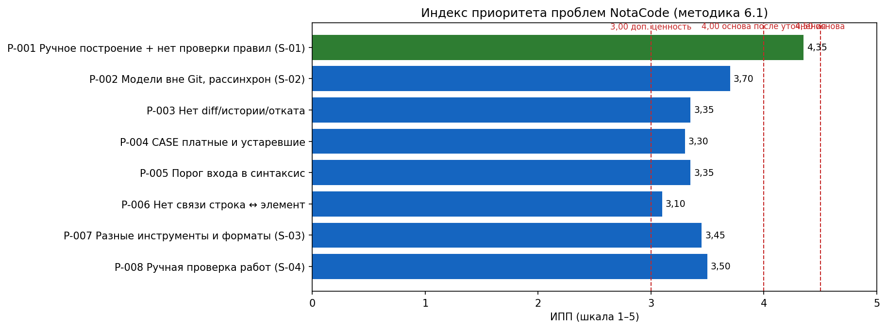

Рисунок 1 – Индекс приоритета проблем NotaCode

Методика и шаблон расходятся по весам и набору критериев; решение принято по шаблону: P-001 имеет максимальный индекс 90 («Критический») и выбрана опорной. Расчёт по методике даёт тот же выбор (ИПП 4,35 – максимум). Значение 4,00–4,49 по методике означает «брать как основу после уточнения сегмента», поэтому сегмент сужен до S-01 – студентов технических специальностей вузов РБ (+РФ/СНГ) в дисциплинах с IDEF/UML/DFD. Главный ограничитель – платежеспособность S-01 (2 балла); платящими сегментами остаются аналитики S-02 и архитекторы S-03 (P-002 – 3,70; P-007 – 3,45). Остальные проблемы (3,0–3,99) используются как дополнительная ценность: история версий, связь строки и элемента, порог входа.

#### 2.2.2 Конкурентные решения и рыночный стандарт

Сила конкурентных решений оценена формулой шаблона (покрытие 0,25; ясность 0,20; полнота 0,20; удобство доступа 0,15; доказательность 0,20; ×20) – приложение А, таблица А.2. По P-001 ни одно решение не достигло уровня «сильное» (≥ 80): PlantUML, Mermaid и Eraser.io – «рыночный стандарт» для UML/ER, но без IDEF/DFD; Ramus проверяет правила IDEF0, но это настольный GUI без текстового описания и Git. Это и есть зона отличия.

Рыночный стандарт сопоставлен с первым релизом NotaCode (таблица 2): из 8 значимых признаков прямых конкурентов в R1 покрыто 7, то есть 87,5 % ≥ 80 % – порог достаточности методики выполнен; нет только совместного редактирования (Won't в MVP [16]).

Таблица 2 – Рыночный стандарт и его покрытие в NotaCode R1

| Признак | У прямых конкурентов | NotaCode R1 |
|---|---|---|
| Текстовый DSL | 4/4 | Да |
| Браузерный рендер без установки | 4/4 | Да |
| Интеграция с GitHub/GitLab | 3/4 | Да (ручной push) |
| Экспорт SVG/PNG | 4/4 | Да |
| Шаблоны/примеры диаграмм | 4/4 | Да |
| Бесплатный доступ | 4/4 | Да (Free) |
| История версий | 2/4 | Да (20 версий Free) |
| AI-генерация по тексту | 2/4 | Частично (заглушка/BYOK) |
| Совместное редактирование | 1/4 | Нет (Won't в MVP) |

#### 2.2.3 Ценностное предложение и его проверка

Черновик «Удобный онлайн-редактор диаграмм как код» не содержит сегмента, проблемы, результата и отличия. Итоговое ЦП (VP-001) по формуле методики:

- краткое ЦП: для студентов технических специальностей цифровой товар NotaCode помогает получить корректную по правилам нотации диаграмму IDEF0/IDEF3/DFD/ERD/UML без ручной перерисовки и замечаний при сдаче, потому что строит диаграмму из текста и до сдачи показывает нарушения правил с номером строки;
- расширенное ЦП: студенты сталкиваются с ручным построением диаграмм строгих нотаций и нарушениями правил при выполнении лабораторных и курсовых работ. В отличие от draw.io (правила не проверяются) и PlantUML/Mermaid/D2 (IDEF и DFD не поддерживаются), NotaCode обеспечивает корректную диаграмму за одну итерацию «код → Run → исправление» за счёт единого DSL, профилей нотаций с валидацией и авто-раскладки, что подтверждается сайтами конкурентов (ЛР5) и прототипом интерфейса;
- конкурентное отличие: товар отличается от PlantUML и draw.io тем, что проверяет правила IDEF0/DFD/ERD/UML и показывает строку нарушения, что позволяет сдать работу без возврата, тогда как стандартные решения либо не знают этих нотаций, либо только рисуют фигуры.

Качество ЦП оценено индексом

ИКЦП = (Ясность + Значимость + Отличимость + Доказуемость + Ограниченность + Монетизационная связность) / 6. (3)

Для VP-001: ИКЦП = (4 + 5 + 4 + 3 + 4 + 3) / 6 = 23 / 6 = 3,83; для черновика – (2 + 3 + 2 + 2 + 1 + 2) / 6 = 2,00 (таблица 3).

Таблица 3 – Индекс качества ценностного предложения

| Формулировка | Ясность | Значимость | Отличимость | Доказуемость | Ограниченность | Монетизационная связность | ИКЦП |
|---|---|---|---|---|---|---|---|
| Черновик v1 «Удобный онлайн-редактор диаграмм как код» | 2 | 3 | 2 | 2 | 1 | 2 | 2 |
| Итоговое ЦП v2 (VP-001) | 4 | 5 | 4 | 3 | 4 | 3 | 3,83 |

ИКЦП 3,83 попадает в интервал 3,0–3,9 – «нужно уточнение». Слабые места: доказуемость (нет отзывов и опроса) и монетизационная связность (опорный сегмент пользуется Free). Эти пункты переведены в гипотезы H-01 и H-02 (приложение А, таблица А.6).

#### 2.2.4 Цифровой товар, уровни предложения и единица монетизации

Цифровой товар описан по восьми слоям методики (приложение А, таблица А.3). Формула товара для NotaCode: корректная диаграмма (результат) + редактор, разбор, валидация, холст, версии, экспорт (функции) + каталог нотаций и шаблоны (данные и контент) + сценарий «шаблон → DSL → Run → Problems → OK → экспорт» + правила доступа Free/Pro + условия качества (ответ Run ≤ 300 мс для 200 узлов [17]) + границы (волна 1, один открытый проект, AI-заглушка). Уровни предложения приведены в таблице 4.

Таблица 4 – Уровни предложения NotaCode

| Уровень | Состав | Монетизация |
|---|---|---|
| Базовый | NotaCode Free: редактор DSL, Run, холст, валидация волны 1, шаблоны, документация, экспорт SVG/PNG, 5 проектов, 20 версий | Бесплатно (freemium) |
| Расширенный | NotaCode Pro: без лимитов проектов, полная история и diff, все форматы экспорта, автосинхронизация GitHub/Drive, Kroki, серверный AI с квотой (после MVP) | 4 USD/мес или 40 USD/год за пользователя (допущение) |
| Предельный | NotaCode для кафедры: наборы шаблонов заданий, групповые лицензии, отчёт о нарушениях правил по группе, нотации волн 2–3 | Индивидуальный договор с вузом (гипотеза) |

Единица монетизации – доступ Pro за период на пользователя. Проверка тремя условиями методики: клиент понимает объект оплаты (снятие видимых лимитов) – да; объект связан с результатом (объём работы и переносимость результата) – да; рост оплаты справедлив при росте ценности – частично (цена фиксирована, рост через годовой и кафедральный тариф). Монетизационный потенциал по шаблону (связь 0,40; простота 0,30; повторяемость 0,30; ×20) для M-001 = (4·0,40 + 5·0,30 + 4·0,30)·20 = 86 – «Готово». Расчётная выручка при допущении 500 активных Free и конверсии 4 %: 15 месячных подписок × 4 USD + 1 годовая × 40 USD = 100 USD в месяц (допущение, проверяется в R1–R2).

#### 2.2.5 Конкурентная состоятельность и связность

Индекс конкурентной состоятельности

ИКСТ = Стандарт·0,20 + Отличие·0,25 + Доказательность·0,20 + Монетизация·0,15 + Снижение риска·0,10 + Защищённость·0,10. (4)

ИКСТ = 4·0,20 + 5·0,25 + 3·0,20 + 3·0,15 + 4·0,10 + 3·0,10 = 0,80 + 1,25 + 0,60 + 0,45 + 0,40 + 0,30 = 3,80 – «уточнить состав или обещание». Пороги достаточности выполнены: стандарт 87,5 % ≥ 80 %, значимых отличий не менее двух (профили IDEF0/IDEF3/DFD и валидация с кодом правила), механизм снижения риска покупки – бесплатный Free без срока и гостевой режим, риска внедрения – экспорт в открытые форматы.

Индекс связности шаблона (проблема 0,30 + ЦП 0,15 + товар 0,20 + монетизация 0,20 + бизнес-модель 0,15) для CHK-001 = 90·0,30 + 90·0,15 + 100·0,20 + 86·0,20 + 100·0,15 = 92,7 ≈ 93 – «проходят проверку»; CHK-002 (аналитики) – 84, CHK-003 (кафедра) – 75. Главный разрыв цепочки: опорный сегмент почти не платит, поэтому путь S-01 → Pro (старшекурсники, дипломники) и спрос S-02 проверяются гипотезами. Паспорт ЦП и цифрового товара, карта доказательств и контрольный лист приведены в приложении А (таблицы А.4–А.7).

### 2.3 Бизнес-модель по Канвас

Банк содержит 22 вывода (лист 01_Данные_анализа, приложение Б); каждый вывод перенесён в Канвас с источником и степенью уверенности. Канвас NotaCode показан на рисунке 2, формулировки блоков по формам записи методики – в таблице 5.

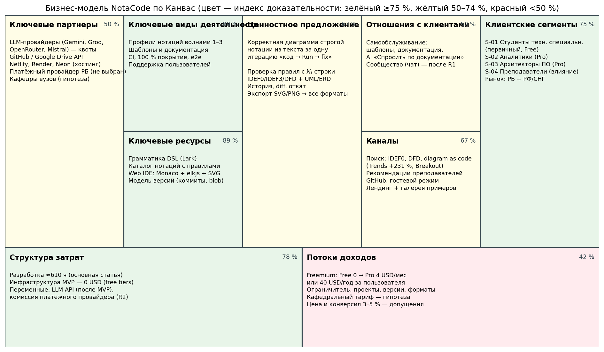

Рисунок 2 – Бизнес-модель NotaCode по Канвас

Таблица 5 – Блоки Канвас NotaCode и статус по правилу шаблона

| Блок | Рабочая формулировка | Дост. | Полн. | Риск | Статус шаблона | Что проверить |
|---|---|---|---|---|---|---|
| Клиентские сегменты | Сегмент: студенты технических специальностей вузов РБ (+РФ/СНГ), которые выполняют лабораторные и курсовые с IDEF0/IDEF3/DFD/ERD/UML и выбирают инструмент по скорости и проверке правил; платящие — аналитики S-02 и архитекторы S-03 | 4 | 4 | 2 | Готово | Опрос 20+ студентов (H-01); интервью 5 аналитиков |
| Ценностное предложение | Для студентов, которые тратят часы на диаграммы строгих нотаций и получают замечания за нарушения правил, NotaCode строит диаграмму из текста и до сдачи показывает нарушения с номером строки, в отличие от draw.io (правила не проверяет) и PlantUML/Mermaid (IDEF/DFD нет) | 4 | 4 | 2 | Готово | Сравнительный тест с draw.io (H-06) |
| Каналы | Основной канал: органический поиск (IDEF0, DFD, «diagram as code») для осведомления; вспомогательный: GitHub и рекомендации преподавателей; доказательство: Google Trends +231 %, дистрибуция конкурентов через GitHub | 4 | 3 | 3 | Проверить | UTM и события аналитики R1 (H-04) |
| Отношения с клиентами | Тип отношений: самообслуживание (шаблоны, документация, AI-режим «Спросить по документации») на этапах активации и использования; сообщество — после R1, потому что DSL требует обучения | 3 | 3 | 3 | Проверить | Доля пользователей, открывших документацию |
| Потоки доходов | Основной поток доходов: подписка Pro за пользователя (4 USD/мес, 40 USD/год); дополнительные: кафедральный тариф (гипотеза); тарифный ограничитель: объём (проекты, версии) и форматы экспорта | 2 | 3 | 4 | Требует доработки | Заявки «Хочу Pro» в R1 (H-02); выбор платёжного провайдера РБ |
| Ключевые ресурсы | Ключевой ресурс: грамматика DSL и каталог профилей нотаций с правилами — нужен для создания и защиты ценности; Web IDE и модель версий — для доставки | 5 | 4 | 2 | Готово | Покрытие правил нотаций тестами |
| Ключевые виды деятельности | Ключевой процесс: разработка профилей нотаций волнами и поддержка шаблонов/документации — обеспечивает корректность диаграмм, связан с ресурсом «каталог нотаций», влияет на ЦП | 5 | 4 | 2 | Готово | Выполнение спринтов S4–S7 (нотации волны 1) |
| Ключевые партнеры | Партнёры: LLM-провайдеры (бесплатные квоты — скорость), GitHub и Google Drive API (интеграция), хостинг Netlify/Render/Neon (экономия), платёжный провайдер РБ (доступ к оплате — не выбран) | 3 | 3 | 4 | Требует доработки | Выбор платёжного провайдера; лимиты бесплатных квот |
| Структура затрат | Ключевая статья затрат: время разработки ≈610 ч (постоянная, разработческая); инфраструктура MVP — 0; переменные — LLM API после MVP; связь с ценностью: затраты на нотации = затраты на отличие | 4 | 4 | 3 | Проверить | Расчёт стоимости инфраструктуры при 1 000 пользователей |

Индекс доказательности блока рассчитан по методике

ИД = Σ баллов утверждений / (3·n) · 100 %, (5)

где балл утверждения: 3 – прямое доказательство, 2 – косвенное доказательство или повторяющийся рыночный сигнал, 1 – экспертная гипотеза, 0 – нет доказательства; n – число утверждений блока. Например, «Потоки доходов»: (3 + 1 + 1 + 0) / 12 · 100 % = 41,7 %. Результаты – таблица 6 и рисунок 3, утверждения по блокам – приложение А, таблица А.8.

Таблица 6 – Индекс доказательности блоков Канваса

| Блок | Утверждений | Сумма баллов | Максимум | Индекс, % | Доказательность |
|---|---|---|---|---|---|
| Клиентские сегменты | 4 | 9 | 12 | 75 | высокая |
| Ценностное предложение | 3 | 6 | 9 | 66,7 | средняя |
| Каналы | 3 | 6 | 9 | 66,7 | средняя |
| Отношения с клиентами | 2 | 3 | 6 | 50 | средняя |
| Потоки доходов | 4 | 5 | 12 | 41,7 | низкая |
| Ключевые ресурсы | 3 | 8 | 9 | 88,9 | высокая |
| Ключевые виды деятельности | 3 | 8 | 9 | 88,9 | высокая |
| Ключевые партнеры | 4 | 6 | 12 | 50 | средняя |
| Структура затрат | 3 | 7 | 9 | 77,8 | высокая |

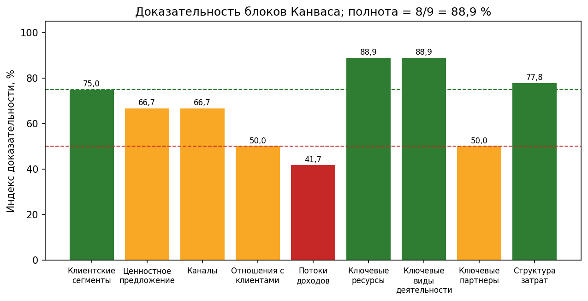

Рисунок 3 – Доказательность блоков Канваса NotaCode

Индекс полноты = число блоков с ИД ≥ 50 % / 9 · 100 % = 8 / 9 · 100 % = 88,9 %. (6)

Полнота выше минимума первичной версии (70 %) и порога стратегического решения (85 %). Единственный блок с низкой доказательностью – «Потоки доходов» (41,7 %): цена 4 USD и конверсия 3–5 % являются гипотезами, а платёжный провайдер для Республики Беларусь не выбран. По правилу методики такой блок нельзя считать окончательным решением, поэтому его проверка получает наивысший приоритет (заявка «Хочу Pro» в первом релизе).

Индекс связности = подтверждённые связи / обязательные связи · 100 % = 8 / 10 · 100 % = 80 %. (7)

Не подтверждены связи «товар ↔ монетизация» (платит не опорный сегмент) и «затраты ↔ доходы» (доход – гипотеза); обе переведены в задачи (приложение А, таблица А.9). По шаблону статусы блоков: «Готово» – 4 (сегменты, ЦП, ресурсы, деятельность), «Проверить» – 3, «Требует доработки» – 2 (доходы, партнёры); дашборд шаблона: полнота 71,1 %, средняя достоверность 75,6 %, контроль риска 44,4 %, доля готовых блоков 44,4 %, доля подтверждённых проверок связности 66,7 %. Готовность модели по правилу дашборда – ниже средней, так как KPI риска и готовых блоков ниже 60 %; это согласуется с низкой доказательностью доходов.

Паспорт бизнес-модели: цифровой товар для студентов технических специальностей, решающий проблему ручного построения диаграмм строгих нотаций через текстовое описание с проверкой правил; сегмент – S-01 с частой проблемой (каждая лабораторная), низкой платежеспособностью и текущим решением draw.io/Ramus; монетизация – подписка Pro за пользователя; каналы – поиск и рекомендации преподавателей (Google Trends +231 %); отношения – самообслуживание; ключевые гипотезы – о сегменте (H-01), цене (H-02), канале (H-04), товарной функции (H-03); следующие проверки – опрос студентов, интервью с аналитиками, тест страницы тарифов, расчёт экономики при 1 000 активных пользователей.

### 2.4 Бизнес-логика и пользовательские сценарии

#### 2.4.1 Бизнес-логика в трёх версиях

Полная версия. Мы работаем со студентами технических специальностей (S-01), которые при выполнении лабораторных и курсовых работ тратят часы на ручное построение диаграмм IDEF0, IDEF3, DFD, ERD и UML и получают замечания за нарушение правил нотации. Для решения предлагается Web-IDE NotaCode, который обеспечивает корректную диаграмму за одну итерацию «код → Run → исправление» за счёт единого DSL, профилей нотаций с валидацией и авто-раскладки. Пользователь получает ценность через сценарии «первая диаграмма из шаблона», «диаграмма IDEF0 с проверкой правил», «сохранение и экспорт», «история и откат». Компания монетизирует ценность через подписку Pro за пользователя (4 USD/мес) при упоре в лимиты Free, прежде всего у аналитиков и архитекторов. Устойчивость обеспечивают каталог нотаций, CI со 100 % покрытием, бесплатные тарифы инфраструктуры и AI-заглушка; результат проверяется метриками активации, доли успешных Run, возврата D7 и заявок Pro.

Краткая версия. NotaCode превращает часы ручной перерисовки диаграмм строгих нотаций в одну проверку правил по тексту и зарабатывает на подписке Pro, когда пользователю не хватает лимитов Free.

Проверочная версия – цепочка на рисунке 4; у каждого элемента указаны источник и доказательность (приложение А, таблица А.10).

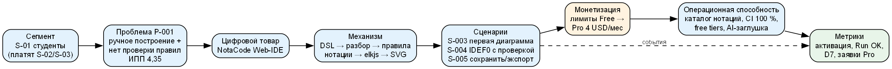

Рисунок 4 – Причинная цепочка бизнес-логики NotaCode

#### 2.4.2 Роли и сценарии

Роли разделены по задачам и правам (приложение А, таблица А.11): посетитель, новый пользователь, активный пользователь (S-01), потенциальный клиент (упор в лимит), платящий клиент (S-02/S-03 – пользователь и покупатель совпадают), партнёр – преподаватель S-04 (влияющее лицо), внутренний администратор (Product Owner).

Описано 13 сценариев, покрывающих все 9 классов методики (таблица 7). Приоритет сценария посчитан двумя способами:

Индекс сценария (шаблон) = Ч·З·В·Д / 20, (8)

где Ч – частота; З – значимость; В – влияние на выручку (1–5); Д – доказательность (1–4);

Индекс сценария (методика) = Ц·0,25 + М·0,20 + Ч·0,15 + Р·0,15 + К·0,10 + Д·0,15 − С·0,10, (9)

где Ц – ценность; М – монетизация; Р – риск отказа; К – конкурентное значение; С – сложность. Для S-004: по шаблону 5·5·3·3 / 20 = 11,25 («Высокий»); по методике 5·0,25 + 3·0,20 + 5·0,15 + 5·0,15 + 5·0,10 + 3·0,15 − 4·0,10 = 3,90.

Таблица 7 – Пользовательские сценарии NotaCode и их приоритет

| ID | Сценарий | Класс | Индекс шаблона | Приоритет | Индекс методики |
|---|---|---|---|---|---|
| S-001 | Найти инструмент для IDEF0/DFD по поисковому запросу | Обнаружение проблемы | 4,8 | Низкий | 2,6 |
| S-002 | Сравнить NotaCode с draw.io/PlantUML и проверить на примере | Сравнение и доверие | 3,6 | Низкий | 3,1 |
| S-003 | Получить первую диаграмму из шаблона без регистрации | Вход и активация | 9 | Высокий | 3,65 |
| S-004 | Построить диаграмму IDEF0 по заданию с проверкой правил | Основной (получение ценности) | 11,25 | Высокий | 3,9 |
| S-005 | Сохранить проект и экспортировать SVG/PNG в отчёт | Основной (получение ценности) | 12 | Высокий | 4,1 |
| S-006 | Вернуться к проекту, сравнить версии и откатиться | Удержание | 5,4 | Средний | 3,25 |
| S-007 | Перейти на Pro после упора в лимит Free | Монетизация | 6 | Средний | 2,85 |
| S-008 | Восстановиться после ошибки DSL или правила нотации | Поддержка и восстановление | 6 | Средний | 3,65 |
| S-009 | Спросить по синтаксису и теории нотации | Поддержка и восстановление | 1,8 | Отложить | 2,3 |
| S-010 | Сгенерировать DSL по текстовому описанию (AI) | Основной (получение ценности) | 2,7 | Низкий | 2,4 |
| S-011 | Опубликовать шаблон и обновить каталог нотаций | Административный | 0,9 | Отложить | 1,75 |
| S-012 | Подготовить пример для группы и поделиться ссылкой | Партнёрский | 0,9 | Отложить | 1,85 |
| S-013 | Получить уведомление о завершении синхронизации и продолжить работу | Удержание | 2,7 | Низкий | 2,4 |

Методика и шаблон расходятся (взвешенная сумма семи критериев против произведения четырёх оценок); приоритет принят по шаблону (8), расчёт (9) приведён для сравнения. Обе формулы выделяют ядро первой версии: S-005, S-004, S-003, S-008 (методика 3,65–4,10; шаблон 6–12). Монетизационный сценарий S-007 имеет средний приоритет из-за низкой доказательности; высокий потенциал при низкой доказательности по методике означает «проверить», поэтому в первом релизе он реализуется в простейшей форме (заявка). Административный S-011 и партнёрский S-012 по обеим формулам откладываются. Карта ключевых сценариев по этапам пути показана на рисунке 5.

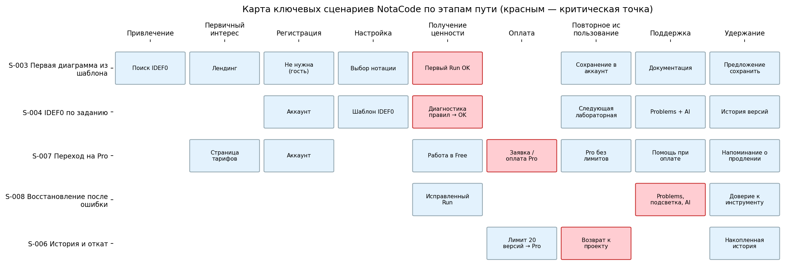

Рисунок 5 – Карта ключевых сценариев NotaCode

Паспорта ключевых сценариев S-003, S-004, S-007, S-008 (14 полей) и детализация шагов S-004 и S-007 приведены в приложении А (таблицы А.12–А.15). Краткое описание S-004: когда активный пользователь выполняет лабораторную по IDEF0 и не уверен в правилах ICOM, он хочет сдать диаграмму без замечаний; NotaCode показывает нарушение с кодом правила и строкой и приводит к корректной диаграмме в PNG; для компании сценарий важен, потому что поддерживает блоки «Ценностное предложение» и «Ключевые ресурсы» и влияет на активацию и удержание.

#### 2.4.3 Функциональные требования, приоритизация и связность

Сценарии переведены в 14 функциональных требований F-001…F-014 со ссылками на бизнес-требования BR и эпики (приложение А, таблица А.16). Индекс требования = (ценность + монетизация)·доказательность / сложность; в MVP («Да») попали 7 требований: F-001 редактор (16), F-003 холст (10,7), F-005 шаблоны и документация (12), F-006 сохранение (16), F-007 экспорт (16), F-009 тарифы и заявка (16), F-011 аналитика (18); кандидаты – F-002 валидация (6,75), F-004 подсветка (6), F-008 история (8).

Здесь выявлено ограничение формул шаблона: валидация правил F-002 – главный носитель отличия – получила только «Кандидат» из-за сложности 4, а на листе «Приоритизация» инициатива «ядро» получила индекс 1,95 («Отложить»). Формулы делят на сложность и не учитывают, что ядро ценности сокращать нельзя; поэтому окончательный состав первой версии определяется расчётом шаблона релизов 6.5 с проверкой шага 4 шаблона «не нарушается ли ценностное предложение» (подраздел 2.6); ядро упрощается по нотациям, а не исключается. На листе «Связность» пройдены все 10 контрольных точек (выводов 10, сильных 8, элементов логики 7, ролей 7, сценариев 13, монетизационных 1, требований 14, MVP 7, инициатив 11) – индекс готовности 100 %, модель готова к ТЗ и прототипу.

### 2.5 Страницы сайта и экраны приложения

Из 13 сценариев выведено 24 интерфейсные единицы: страницы сайта, формы, экраны приложения, общие модули, системное состояние, личный кабинет и платёжный экран (приложение А, таблица А.17). У каждой единицы есть сценарий, роль, задача, источник обоснования и показатель; единиц без сценария нет, покрытие сценариев – 100 % (норма ≥ 90 %). Лендинга, тарифов и модалки лимита в прототипе не было – для них построены вайрфреймы (рисунки 9–11). Это выявило разрыв плана [16]: в бэклоге нет страниц лендинга и тарифов, их предложено добавить (RU-017, RU-018).

Приоритет единицы рассчитан формулой шаблона

Балл = (Ц·0,30 + Б·0,30 + Ч·0,15 + Р·0,15 − С·0,10)·20, (10)

где Ц – ценность для пользователя; Б – влияние на бизнес; Ч – частота; Р – риск без реализации; С – сложность. Для IDE (U-008): (5·0,30 + 5·0,30 + 5·0,15 + 5·0,15 − 5·0,10)·20 = 80 – P1. Класс P1 получили 8 единиц: главная U-001, тарифы U-004, IDE U-008, выбор нотации U-009, Problems U-011, меню сохранения U-013, экспорт U-014, модалка лимита U-019. Они образуют обязательную цепочку методики «обнаружение ценности (U-001) → доверие (гостевой режим U-008) → выбор (U-004) → заявка (U-004, U-019) → первый результат (U-008, U-009) → базовая поддержка (U-011)». Галерея примеров U-003 и документация U-018 получили P2, но входят в R1 как дешёвые элементы доверия и самообслуживания.

Карта навигации содержит 35 переходов шести типов (рисунок 6); ключевые экраны показаны на рисунках 7–12.

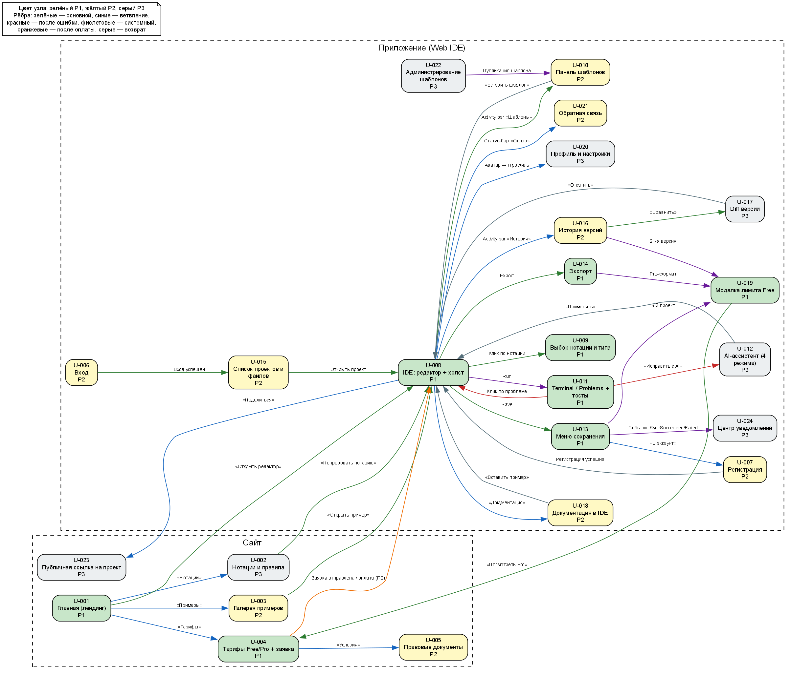

Рисунок 6 – Карта навигации NotaCode

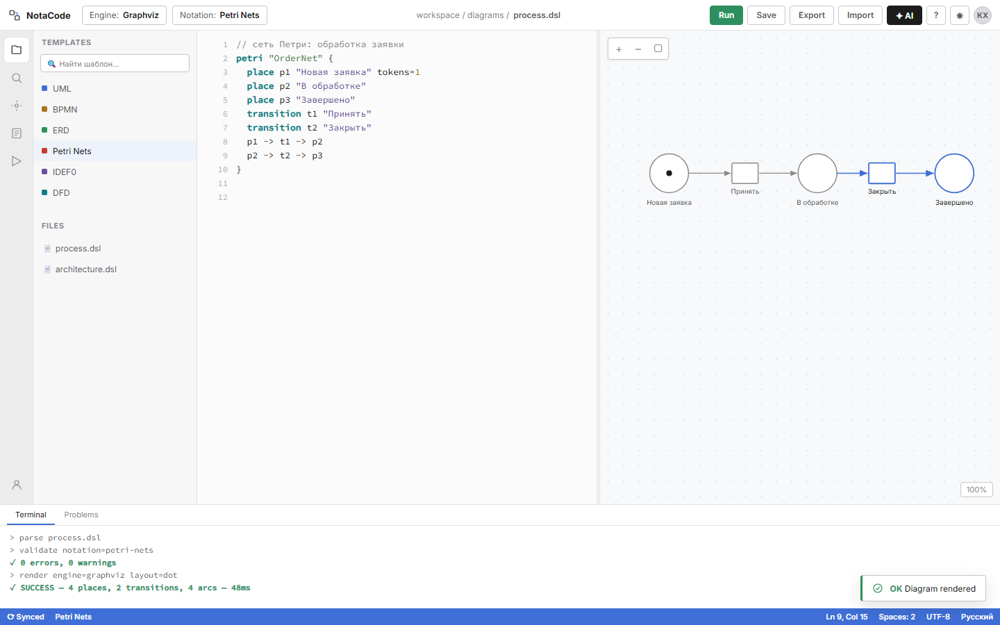

Рисунок 7 – Экран U-008 «IDE: редактор + холст» (мокап прототипа)

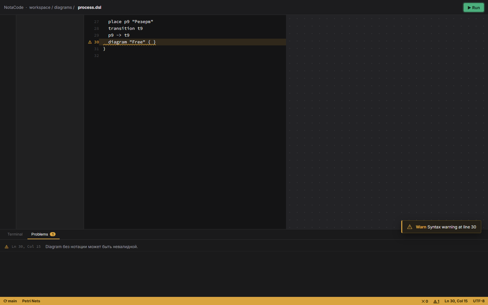

Рисунок 8 – Экран U-011 «Problems» в состоянии ошибки правила нотации

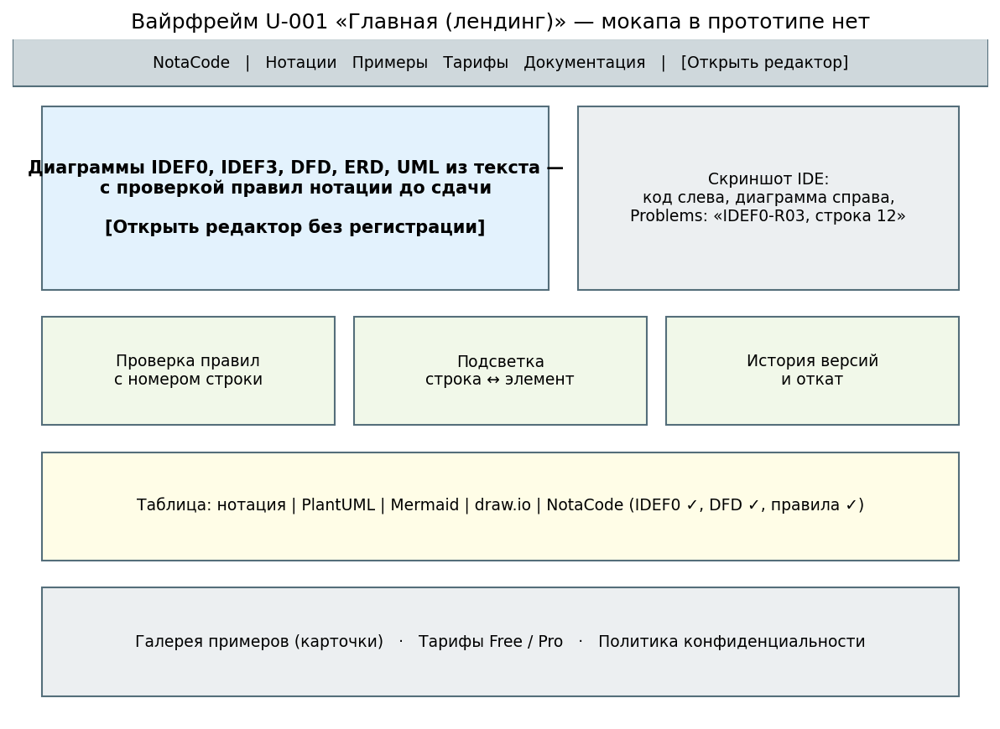

Рисунок 9 – Вайрфрейм страницы U-001 «Главная»

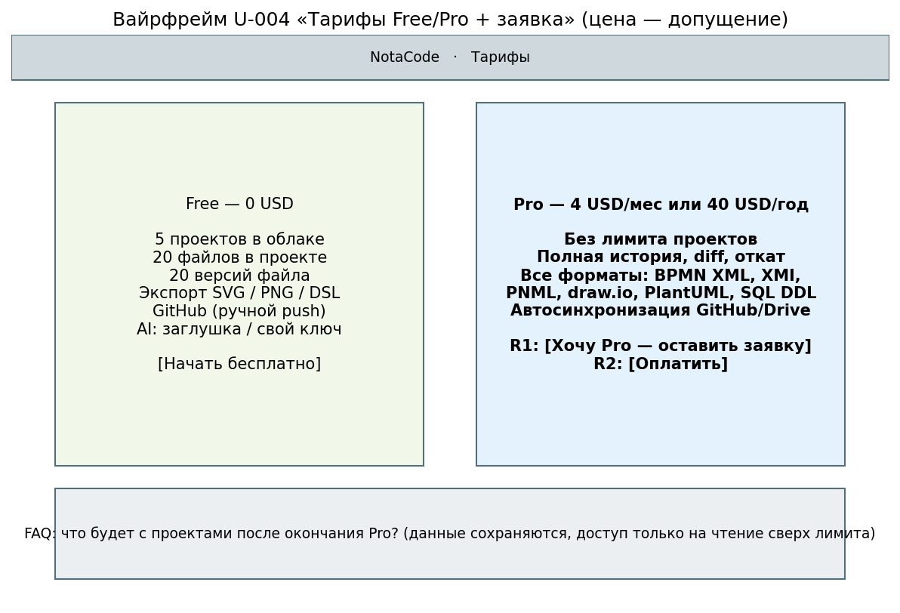

Рисунок 10 – Вайрфрейм страницы U-004 «Тарифы Free/Pro + заявка»

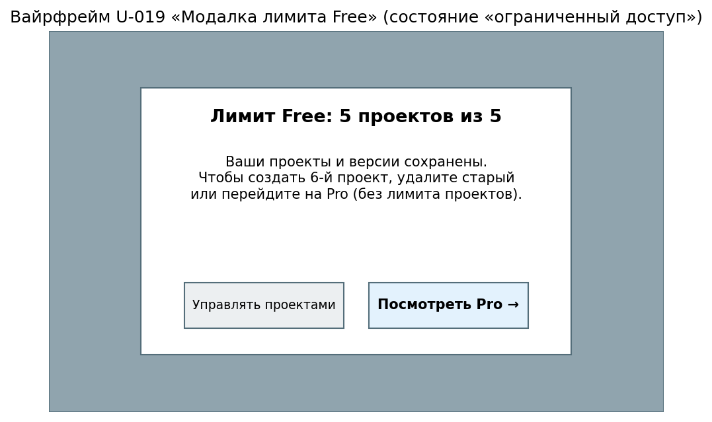

Рисунок 11 – Вайрфрейм U-019 «Модалка лимита Free»

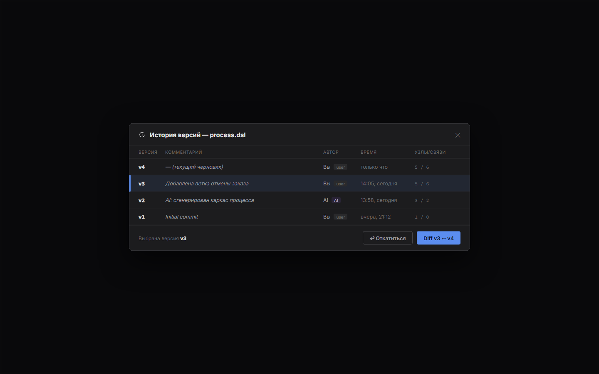

Рисунок 12 – Экран U-016 «История версий» (мокап прототипа)

Состояния описаны для 15 ключевых единиц по восьми типам шаблона (приложение А, таблица А.18). Ошибка описана как состояние сценария по пяти вопросам; например, для U-008 при недоступности Language Service: что произошло – анализ не выполнен; почему это важно – нет диаграммы и диагностики; что сделать – повторить Run; что сохранится – код в редакторе и черновик в IndexedDB; куда обратиться – форма обратной связи U-021. Паспорта 14 ключевых единиц заполнены на 100 % (норма ≥ 85 %, «Готов к прототипу»). Проверка связности шаблона: покрытие 1,0, единиц без сценария 0, полнота паспортов 1,0, переходов 35 при 24 единицах, полнота состояний 1,0, монетизационно связанных единиц 21, доля единиц с источником 1,0 – все проверки «Норма», интегральная готовность 1,0.

### 2.6 Деление разработки на релизы

#### 2.6.1 Индекс релизного приоритета

Составлен реестр 38 единиц разработки RU-001…RU-038 по эпикам E1–E13 плана [16] (функции, страницы, экраны, интеграции, аналитика, контент). Каждая единица оценена по методике

ИРП = (0,20·ЗП + 0,20·СЦ + 0,15·СС + 0,15·МН + 0,10·УД + 0,10·РА + 0,10·ДК) − (0,15·СЛ + 0,10·РЗ), (11)

где ЗП – значимость проблемы; СЦ – связь с ЦП; СС – сценарная центральность; МН – монетизация; УД – удержание; РА – рост аудитории; ДК – доказательность; СЛ – сложность; РЗ – риск (шкала 0–5).

Для редактора DSL (RU-001): ИРП = (0,20·5 + 0,20·5 + 0,15·5 + 0,15·3 + 0,10·4 + 0,10·3 + 0,10·4) − (0,15·3 + 0,10·2) = 4,30 − 0,65 = 3,65 ≥ 3,5 – первый релиз. Для Google Drive (RU-014): (0,60 + 0,60 + 0,30 + 0,30 + 0,30 + 0,20 + 0,30) − (0,45 + 0,30) = 2,60 − 0,75 = 1,85 – последующий релиз. Результаты показаны на рисунке 13, полная таблица баллов – в приложении А, таблица А.19.

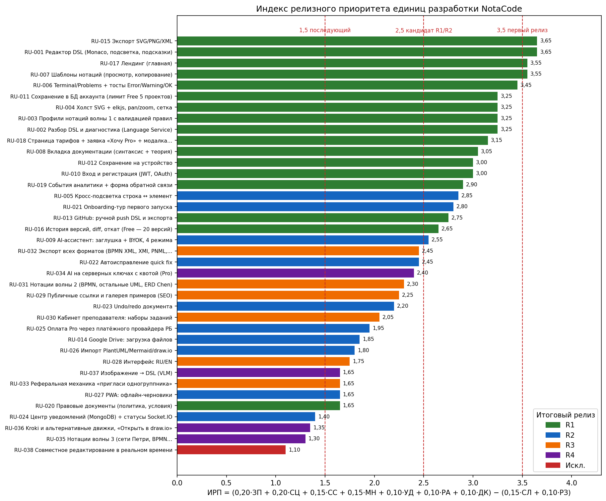

Рисунок 13 – Индекс релизного приоритета единиц разработки NotaCode

Методика и шаблон здесь расходятся сильнее всего: в шаблоне другие критерии (шкала 1–5, «быстрота», «дешевизна», «риск потери ценности при переносе») и два отдельных балла. Решение о релизе принято по шаблону:

Балл первого релиза = G·0,18 + H·0,15 + I·0,12 + J·0,08 + K·0,13 + L·0,10 + M·0,12 + N·0,12 − O·0,07 + P·0,10, (12)

Балл следующих релизов = I·0,16 + J·0,20 + K·0,12 + L·0,10 + (6 − M)·0,08 + (6 − N)·0,08 + O·0,06 + P·0,14 + G·0,06, (13)

где G – связь с ЦП; H – критичность для первого дохода; I – потенциал удержания; J – потенциал роста; K – доказательность; L – рыночный стандарт; M – быстрота; N – дешевизна реализации; O – технический риск; P – риск потери ценности при переносе. Рекомендация шаблона: «Первый релиз», если G ≥ 4, H ≥ 4, K ≥ 3 и P ≥ 4 или балл (12) ≥ 3,7; «Следующий релиз», если балл (13) ≥ 3,6; иначе «Не включать / проверить». Для RU-001: G = 5, H = 4, K = 4, P = 5 – условие выполнено, балл (12) = 4,32.

Шаблон рекомендует первый релиз для 16 единиц, «следующий» – для 1 (волна 2 нотаций), «не включать / проверить» – для 21. ИРП по методике строже: ≥ 3,5 только у 4 единиц, средний ИРП состава R1 = 3,12 (приложение А, таблица А.20 – расхождения методики и шаблона). По шагу 4 шаблона («проверить, не нарушается ли ценностное предложение, монетизация, удержание и рост») к 16 единицам добавлены правовые документы RU-020 – законодательное требование, которое по методике 6.5 включается без обсуждения. Единицы с рекомендацией «не включать / проверить» распределены по релизам 2–4 листа «Следующие_релизы» по бизнес-целям релизов.

Расчёт шаблона разошёлся с планом [16] по трём единицам, отнесённым там к Must MVP: кросс-подсветка RU-005 (балл 3,48 < 3,7), AI-заглушка RU-009 и Google Drive RU-014 (ИРП 1,85). По шаблону они перенесены в R2; для Product Owner это решение о пересмотре MoSCoW плана. В R1 остаются сохранение на устройство и ручной push в GitHub (рыночный стандарт у 3 из 4 прямых конкурентов).

#### 2.6.2 Состав релизов и карта релизов R0–R4

Таблица 8 – Карта релизов NotaCode R0–R4

| Релиз | Цель | Состав | Метрики | Критерий перехода | Даты |
|---|---|---|---|---|---|
| Релиз 0 (подготовительный) | Данные, прототип, правила, аналитика | Требования, архитектура, ADR, мокапы, карта сценариев, walking skeleton, CI, план событий, тексты тарифов и правовых документов | Готовность skeleton, покрытие 100 % | Skeleton web → gateway → language работает | 2026-09-21 – 2026-10-04 |
| Первый релиз (R1, MVP) | Проверить ЦП и готовность к целевому действию | RU-001…RU-004, RU-006…RU-008, RU-010…RU-013, RU-015…RU-020 (17 единиц: 16 по расчёту шаблона + RU-020) | Активация, Run OK, D7, экспорт, заявки Pro | Контрольный лист R1 пройден; H-02 и H-05 измерены | 2026-09-28 – 2026-12-06 |
| Релиз 2 | Удержание, качество, запуск оплаты Pro | RU-005, RU-009, RU-014, RU-021…RU-027 | D7, D30, конверсия в оплату | D7 ≥ 25 %, есть оплаты Pro | 2027-01-11 – 2027-02-28 |
| Релиз 3 | Рост аудитории | RU-028…RU-033 | Новые пользователи по каналам, доля Pro | Подтверждён масштабируемый канал | 2027-03-01 – 2027-05-31 |
| Релиз 4 | Расширение продукта | RU-034…RU-037 | ARPPU, маржа, затраты LLM | Юнит-экономика положительна | 2027-06-01 – 2027-09-30 |

Первый рыночный релиз (R1, MVP к 06.12.2026) включает 17 единиц: ядро ценности (RU-001…RU-004, RU-006…RU-008), доступ и сохранение (RU-010…RU-013, RU-015, RU-016), витрину и монетизацию (RU-017, RU-018), аналитику и правовые документы (RU-019, RU-020). Единица монетизации в R1 реализована как проверяемое целевое действие – заявка «Хочу Pro» при упоре в лимит, потому что платёжный провайдер для РБ не выбран; тем самым монетизация не удалена из первого релиза. R2 содержит 10 единиц (кросс-подсветка, AI-заглушка/BYOK, оплата Pro, onboarding, quick fix, undo/redo, Google Drive, центр уведомлений, импорт, PWA), R3 – 6 (публичные ссылки, кабинет преподавателя, RU/EN, реферальная механика, волна 2 нотаций, Pro-форматы экспорта), R4 – 4 (серверный AI, волна 3, Kroki, изображение → DSL); совместное редактирование исключено (рисунки 14 и 15).

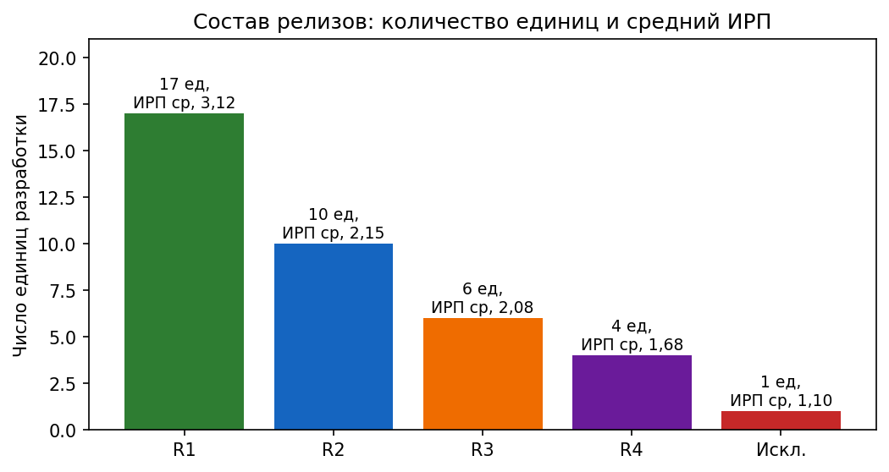

Рисунок 14 – Состав релизов NotaCode

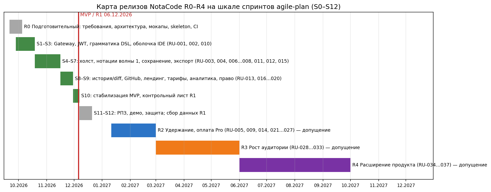

Рисунок 15 – Карта релизов NotaCode R0–R4 на шкале спринтов

Проверка сохранения ЦП (шесть вопросов методики, средняя оценка 4,17 из 5) и контрольный лист первого релиза пройдены: основной сегмент один (S-01), главная проблема одна (P-001), основной сценарий S-004 проходит без разрыва, есть единица товара (Web-IDE Free) и целевое действие (заявка Pro), минимум доверия (гостевой режим, примеры, правовые документы), экраны P1 определены, состояния ошибок описаны, события аналитики и обратная связь включены, механизм возврата – сохранение в аккаунт и история версий; состав R2+ не смешан с R1. Протокол утверждения первого релиза приведён в таблице 9; риски, отложенные возможности с причинами и метрики – в приложении А (таблицы А.21–А.23).

Таблица 9 – Протокол утверждения первого релиза NotaCode

| Поле протокола | Значение |
|---|---|
| Решение | Утверждён по расчёту шаблона; требует решения PO: RU-005, RU-009, RU-014 (Must в agile-plan) перенесены в R2 |
| Состав | 17 единиц: ядро (RU-001…004, RU-006…008), доступ и сохранение (RU-010…013, RU-015, RU-016), витрина и монетизация (RU-017, RU-018), аналитика и право (RU-019, RU-020) |
| Главные исключения | Кросс-подсветка и AI-заглушка (шаблон: «проверить»), Google Drive, оплата Pro (нет провайдера РБ), onboarding-тур, quick fix, серверный AI, волны 2–3, совместная работа — см. карту релизов |
| Критические риски | R-001 срок нотаций волны 1 (индекс 15), R-008 нагрузка лабами (16), R-002 качество сигнала заявок (12) |
| Метрики запуска | Активация ≤ 10 мин, доля Run OK ≤ 3 итераций, D7, экспортов на пользователя, заявки Pro ÷ упоры в лимит |
| Порог продолжения | D7 ≥ 25 % и заявки ≥ 3 % активных Free (допущения, H-02, H-05) |
| Порог пересмотра | Активация < 20 % или D7 < 10 % → пересмотр ЦП/онбординга до R2 |
| Ответственные | Product Owner и разработчик — Хаджинова К.; Review Board — агенты nc-* (agile-plan §2) |

## 3 Ответы на контрольные вопросы

1) Проблема клиента – повторяющееся затруднение сегмента в конкретной ситуации с последствием, а не функция («нужен валидатор»); ЦП – доказательное обещание результата сегменту за счёт механизма с отличием, а не лозунг «удобный редактор».
2) Не менее 3 конкурентов, 30 отзывов или высказываний и 10 страниц сайтов; для NotaCode – 9 конкурентов, 11 страниц, отзывы 🔲 ДОСНЯТЬ.
3) Сегмент + ситуация + затруднение + последствие + неудовлетворённость текущими решениями + критерий успешного результата.
4) По формуле (1); при 4,50–5,00 проблема – основа ЦП, при 4,00–4,49 – основа после уточнения сегмента (P-001 = 4,35).
5) Ясность, значимость, отличимость, доказуемость, ограниченность, монетизационная связность (ИКЦП VP-001 = 3,83).
6) Полезный результат + набор цифровых функций + данные/контент + пользовательский сценарий + правила доступа + условия качества + границы использования.
7) Клиент понимает объект оплаты; объект оплаты связан с полезным результатом; рост оплаты справедлив при росте ценности или использования.
8) Базовый уровень – минимум под основную задачу (Free), расширенный – функции, усиливающие результат (Pro), предельный – максимальный состав для крупных клиентов (кафедра).
9) Стандарт не ниже 80 % значимых признаков прямых конкурентов (NotaCode – 87,5 %), не менее 2 значимых отличий, механизмы снижения риска покупки и внедрения.
10) Подтверждённый вывод + источник + степень уверенности + открытая гипотеза.
11) По формулам (5)–(7); блок пригоден при ИД ≥ 50 %; полнота ≥ 70 % для первичной версии и ≥ 85 % для стратегического решения (NotaCode – 88,9 %); связность – доля подтверждённых связей (80 %).
12) Канвас фиксирует состав модели, бизнес-логика объясняет причинные связи между элементами (рисунок 4).
13) Полная (абзац), краткая (одно предложение), проверочная (цепочка с источниками и доказательностью).
14) Конечный пользователь, покупатель, лицо, принимающее решение, влияющее лицо, администратор, партнёр; в NotaCode студент пользуется Free, платят S-02/S-03, влияет преподаватель – смешение ролей скрыло бы разрыв «товар ↔ монетизация».
15) Обнаружение проблемы, сравнение и доверие, вход и активация, основные сценарии получения ценности, монетизация, удержание, поддержка и восстановление, административные, партнёрские.
16) Название, роль, контекст, триггер, цель, проблема или барьер, предусловия, основные шаги, данные, результат, точка монетизации, метрики, риски, связь с Канвас.
17) Страница – функциональная единица товара; без собственной задачи, сценария и показателя она становится избыточной или дублирует другие.
18) Начальное, пустое, загрузка, ошибка, успех, ограниченный доступ, предупреждение, повторное использование; ошибка описывается по пяти вопросам: что произошло, почему это важно, что можно сделать, что сохранится, куда обратиться.
19) Обнаружение ценности → доверие → выбор → оплата или заявка → первое получение результата → базовая поддержка.
20) Первый релиз должен подтвердить ЦП, запустить монетизацию и измерение поведения; прототип этого не делает, а принцип «что успеем» теряет ядро или монетизацию.
21) По методике – формула (11): ≥ 3,5 – первый релиз, 2,5–3,49 – кандидат в релиз 1 или 2, 1,5–2,49 – последующий релиз, < 1,5 – не включать в ближайший цикл; в шаблоне – формулы (12), (13) и правило рекомендации, по которому принято решение.
22) На доверии, завершённости ключевого сценария, понимании результата, безопасности оплаты, фиксации действий пользователя и возможности получить обратную связь.
23) R0 – подготовка данных, прототипа и правил; R1 – проверка ЦП и готовности к целевому действию; R2 – удержание и качество; R3 – рост аудитории; R4 – расширение продукта; R5 – масштабирование (для NotaCode – за горизонтом плана).

## Выводы

В работе результаты ЛР1–ЛР5 переведены в проектное описание цифрового товара NotaCode по цепочке из пяти методик, и каждое следующее решение опирается на расчёт предыдущего. Опорной выбрана проблема P-001 – ручное построение диаграмм строгих нотаций и отсутствие проверки их правил у студентов технических специальностей. Она получила максимальный приоритет по обеим формулам (ИПП 4,35; индекс шаблона 90), но оценка «основа после уточнения сегмента» потребовала сузить сегмент до S-01. Слабое место проблемы – низкая платежеспособность опорного сегмента. Оно проходит через все последующие расчёты: монетизационная связность ЦП – 3 балла, блок «Потоки доходов» с доказательностью 41,7 %, неподтверждённые связи «товар ↔ монетизация» и «затраты ↔ доходы».

Ценностное предложение VP-001 записано по формуле методики. Его отличие – профили IDEF0/IDEF3/DFD в режиме diagram-as-code и валидация правил с номером строки – подтверждено сайтами четырёх прямых конкурентов. Индексы ИКЦП 3,83 и ИКСТ 3,80 означают «нужно уточнение»: стандарт рынка покрыт на 87,5 % при пороге 80 %, значимых отличий не менее двух, но доказательство ценности отличий для самих пользователей ещё не собрано. Поэтому главная доработка касается не состава товара, а доказательной базы: 30 отзывов и опроса студентов, которые отмечены как недостающие данные.

Бизнес-модель по Канвас собрана с полнотой 88,9 % и связностью 80 %, то есть формально пригодна для стратегического решения, однако решения по доходам остаются гипотезами и первыми проверяются в первом релизе. Бизнес-логика записана в трёх версиях. Тринадцать сценариев покрывают все девять классов методики, все контрольные точки связности пройдены. Из сценариев выведены 24 интерфейсные единицы с покрытием сценариев 100 %, полнотой паспортов и состояний 1,0 и 35 переходами. Восемь единиц класса P1 образуют обязательную цепочку «ценность → доверие → выбор → заявка → первый результат → поддержка». Для лендинга, тарифов и модалки лимита, которых не было в прототипе, построены вайрфреймы; это выявило разрыв плана – в бэклоге отсутствуют витрина и тарифная страница.

Деление на релизы выполнено по формулам шаблона; сравнение с ИРП методики показало, где формулы требуют проверки шагом 4 шаблона. Индексы, в которых сложность стоит в знаменателе или вычитается, занижают ядро ценности: ИРП разбора DSL и профилей нотаций равен 3,25, а инициатива «ядро» на листе приоритизации 6.3 получила решение «Отложить». Шаблон релизов, где учитывается риск потери ценности при переносе, оставляет ядро в первом релизе; оно упрощается по нотациям (одна за спринт S4–S7), а не переносится. Первый релиз из 17 единиц к спринту S10 (06.12.2026), сформированный по расчёту шаблона, сохраняет ядро ЦП, единицу товара, целевое действие вместо оплаты (заявка «Хочу Pro»), минимум доверия и аналитику. Релизы R2–R4 имеют собственные бизнес-цели: удержание и запуск оплаты, рост аудитории, расширение продукта; условия перехода заданы метриками D7 ≥ 25 % и заявками ≥ 3 % активных Free. Найдено расхождение с планом Scrumban: кросс-подсветку, AI-заглушку и интеграцию с Google Drive расчёт шаблона относит к последующим релизам, хотя в плане они Must MVP, – это вынесено на решение Product Owner.

Попутно выявлены и исправлены недочёты шаблонов: двойная проверка данных на столбце доказательности сценариев и расчёт баллов реестра релизов для пустых строк. Ограничения работы: оценки 1–5 экспертные и выставлены одним исследователем; цена Pro, конверсия и объём аудитории – допущения концепции; отзывы и опрос не собраны; даты релизов после MVP – допущение. Проверка этих допущений – задача первого релиза.

## Список использованных источников

1. Методика формулирования ценностного предложения и цифрового товара [Электронный ресурс] : методические указания к ЛР6 по дисциплине «Электронный бизнес». – Минск : БГУИР, 2026. – Дата доступа: 25.09.2026.
2. Методика сборки бизнес-модели по Канвас на основе анализа [Электронный ресурс] : методические указания к ЛР6 по дисциплине «Электронный бизнес». – Минск : БГУИР, 2026. – Дата доступа: 25.09.2026.
3. Методика формулирования бизнес-логики и пользовательских сценариев [Электронный ресурс] : методические указания к ЛР6 по дисциплине «Электронный бизнес». – Минск : БГУИР, 2026. – Дата доступа: 25.09.2026.
4. Методика перехода к страницам и экранам сайта или приложения [Электронный ресурс] : методические указания к ЛР6 по дисциплине «Электронный бизнес». – Минск : БГУИР, 2026. – Дата доступа: 25.09.2026.
5. Методика деления разработки сайта на релизы [Электронный ресурс] : методические указания к ЛР6 по дисциплине «Электронный бизнес». – Минск : БГУИР, 2026. – Дата доступа: 25.09.2026.
6. PlantUML [Электронный ресурс]. – Режим доступа: https://plantuml.com. – Дата доступа: 17.09.2026.
7. Mermaid [Электронный ресурс]. – Режим доступа: https://mermaid.js.org. – Дата доступа: 17.09.2026.
8. Eraser. Pricing [Электронный ресурс]. – Режим доступа: https://www.eraser.io/pricing. – Дата доступа: 17.09.2026.
9. D2 [Электронный ресурс]. – Режим доступа: https://d2lang.com. – Дата доступа: 23.09.2026.
10. draw.io [Электронный ресурс]. – Режим доступа: https://www.drawio.com. – Дата доступа: 23.09.2026.
11. draw.io. Integrations [Электронный ресурс]. – Режим доступа: https://www.drawio.com/integrations. – Дата доступа: 23.09.2026.
12. Similarweb [Электронный ресурс]. – Режим доступа: https://www.similarweb.com. – Дата доступа: 23.09.2026.
13. Google Trends [Электронный ресурс]. – Режим доступа: https://trends.google.com. – Дата доступа: 17.09.2026.
14. Остервальдер, А. Построение бизнес-моделей : настольная книга стратега и новатора / А. Остервальдер, И. Пинье. – М. : Альпина Паблишер, 2011. – 288 с.
15. Хаджинова, К. Концепция проекта NotaCode : рабочий документ проекта, версия 0.1. – Минск, 2026.
16. Хаджинова, К. План работы над NotaCode: Scrum + Kanban (Scrumban) : рабочий документ проекта, версия 0.1. – Минск, 2026.
17. Хаджинова, К. Архитектура NotaCode : рабочий документ проекта, версия 0.1. – Минск, 2026.
18. Хаджинова, К. Анализ конкурентов по сайтам : отчёт по ЛР5 по дисциплине «Электронный бизнес». – Минск : БГУИР, 2026.

## Приложение А (обязательное) Расчётные таблицы ЛР6

Таблица А.1 – Реестр источников (лист «Исходные данные»)

| ID | Дата | Тип | Площадка | Компания | Факт | Дост. |
|---|---|---|---|---|---|---|
| SRC-001 | 2026-09-17 | Сайт конкурента | plantuml.com | PlantUML | Бесплатный open-source DSL; цитата «No server. No tokens. No tracking»; UML, C4 частично; профилей IDEF0/IDEF3/DFD нет | 5 |
| SRC-002 | 2026-09-17 | Описание функций | mermaid.js.org | Mermaid | Типы: flowchart, sequence, class, state, ER, Gantt, pie, git-graph; нативный рендер в GitHub/GitLab/Notion; IDEF нет | 5 |
| SRC-003 | 2026-09-17 | Тарифы | eraser.io/pricing | Eraser.io | Free $0 → Starter $15–20 → Business $45–60 → Enterprise; AI-кредиты 3 → 40 → 250 → ∞ | 5 |
| SRC-004 | 2026-09-17 | Описание функций | eraser.io/ai-diagrams | Eraser.io | Diagram-as-code + AI-генерация + канвас; история версий 90 дней → безлимит по тарифу | 5 |
| SRC-005 | 2026-09-23 | Сайт конкурента | d2lang.com | D2 | «A modern language that turns text to diagrams»; open-source, донаты Hack Club; UML class/sequence | 5 |
| SRC-006 | 2026-09-23 | Сайт конкурента | drawio.com | draw.io | «No account required. No credit card»; open source Apache 2.0; GUI-ввод, проверка правил нотаций не заявлена | 4 |
| SRC-007 | 2026-09-23 | Документация | drawio.com/integrations | draw.io | Интеграции: Google Drive, OneDrive, Confluence/Jira, GitHub, VS Code, Notion | 5 |
| SRC-008 | 2026-09-17 | Сообщество | SimilarWeb | PlantUML | ~507 тыс. визитов за период; Россия — 9,07 % трафика (1-е место среди стран) | 4 |
| SRC-009 | 2026-09-23 | Сообщество | SimilarWeb | Eraser.io / draw.io | eraser.io — 678,5 тыс. визитов; app.diagrams.net — 7,8 млн визитов | 4 |
| SRC-010 | 2026-09-17 | Сообщество | Google Trends | PlantUML | Индекс PlantUML 16 → 53 (19.09.2021 → 08.12.2024), рост ≈231 %; запрос «text to diagram ai» — Breakout | 4 |
| SRC-011 | 2026-09-17 | Описание функций | Обзор аналогов | Ramus / BPwin | IDEF0/IDEF1X/IDEF3 в настольных GUI-средствах; устаревший UX; используются в курсах СНГ | 3 |
| SRC-012 | 2026-09-23 | Документация | Концепция NotaCode | NotaCode | Проблемы P-01…P-06: ручная раскладка, нет IDEF в DaC, правила не проверяются, CASE ограничены, нет связи текст↔изображение, нет истории | 3 |
| SRC-013 | 2026-09-23 | Документация | Пожелания к MVP (WL) | NotaCode | Требования представителя S-01: подсветка код↔элемент, валидация, шаблоны, AI 4 режима, сохранение БД/устройство/Git/Drive | 2 |
| SRC-014 | 2026-09-17 | FAQ | ЛР5: Кано и Левитт | Рынок | Обязательные: DSL, браузерный рендер, GitHub; линейные: история версий; восхищающие: полный охват нотаций, AI | 4 |
| SRC-015 |  | Отзывы | G2 / Capterra / Reddit / Habr | draw.io, Lucidchart, PlantUML, Mermaid, Ramus | 🔲 ДОСНЯТЬ: ≥30 отзывов/высказываний о ручной раскладке, проверке правил, IDEF/DFD |  |
| SRC-016 |  | Отзывы | Опрос студентов (Google Forms) | S-01 | 🔲 ДОСНЯТЬ: опрос 20+ студентов ИИТ/ФКП: сколько времени уходит на диаграммы, были ли замечания по нотации |  |

Таблица А.2 – Сила конкурентных решений

| Компания | Проблема | Как решает | Покр. | Ясн. | Полн. | Дост. | Док. | Индекс силы | Уровень |
|---|---|---|---|---|---|---|---|---|---|
| draw.io | P-001 | Библиотеки фигур UML/IDEF0/BPMN, ручная раскладка; правила нотаций не проверяются | 2 | 4 | 3 | 5 | 4 | 69 | Рыночный стандарт |
| PlantUML | P-001 | UML из текста с авто-раскладкой; IDEF0/IDEF3/DFD не поддерживаются, правила UML не валидируются | 3 | 4 | 3 | 5 | 5 | 78 | Рыночный стандарт |
| Mermaid | P-001 | Flowchart/ER/class из текста в Markdown; нет IDEF/DFD | 2 | 4 | 3 | 5 | 5 | 73 | Рыночный стандарт |
| Eraser.io | P-001 | DaC + AI + канвас; нет IDEF/сетей Петри, правила нотаций не проверяются | 3 | 5 | 4 | 4 | 4 | 79 | Рыночный стандарт |
| D2 | P-001 | Декларативный DSL, 3 движка раскладки; нет структурных нотаций | 2 | 4 | 3 | 4 | 4 | 66 | Рыночный стандарт |
| Ramus Educational | P-001 | IDEF0/IDEF3 с правилами методологии, но GUI-десктоп, без текста и Git | 4 | 3 | 3 | 2 | 3 | 62 | Рыночный стандарт |
| Eraser.io | P-003 | История версий 90 дней → безлимит на платных тарифах | 4 | 4 | 4 | 4 | 5 | 84 | Сильное решение |
| PlantUML | P-003 | История — только через внешний Git-репозиторий пользователя | 3 | 3 | 3 | 5 | 4 | 70 | Рыночный стандарт |
| draw.io | P-003 | Версии через хранилище (Google Drive/Confluence), без построчного diff | 3 | 3 | 3 | 4 | 4 | 67 | Рыночный стандарт |
| Eraser.io | P-005 | AI-генерация диаграммы по описанию снижает порог входа | 4 | 5 | 4 | 4 | 4 | 84 | Сильное решение |
| Mermaid | P-007 | Нативный рендер в GitHub/GitLab/Notion — один формат для документации | 3 | 4 | 3 | 5 | 5 | 78 | Рыночный стандарт |
| draw.io | P-006 | Связи «текст ↔ элемент» нет (ввод графический) | 1 | 2 | 1 | 5 | 3 | 44 | Частичное решение |

Таблица А.3 – Слои цифрового товара NotaCode

| Слой | Содержание NotaCode |
|---|---|
| Ядро результата | Корректная по правилам нотации диаграмма из текста за одну итерацию «код → Run → исправление» |
| Функциональный состав | DSL-редактор (Monaco), Run, холст SVG + elkjs, валидация Error/Warning/OK, quick fix (R2), история/diff/откат, экспорт |
| Данные и аналитика | Текст DSL → AST → модель диаграммы → диагностика с кодом правила и строкой; source map id ↔ строки; статистика узлов/рёбер в коммите |
| Интерфейс и сценарии | Раскладка VS Code + draw.io: activity bar, sidebar шаблонов, редактор, холст, Terminal/Problems, статус-бар; роли гость/пользователь/Pro |
| Контент и методические материалы | Шаблоны по каждой нотации волны 1, вкладка документации (синтаксис + теория нотации), шпаргалка |
| Интеграции и совместимость | Устройство, БД аккаунта, GitHub, Google Drive; экспорт SVG/PNG/XML (MVP), далее PlantUML/Mermaid/D2/DOT/BPMN XML/XMI/PNML/draw.io/SQL DDL |
| Сопровождение и поддержка | Самообслуживание: документация, AI-режим «Спросить по документации», форма обратной связи; сообщество |
| Ограничения и условия | Free: 5 проектов, 20 файлов, 20 версий, экспорт SVG/PNG/DSL; один открытый проект; AI — заглушка/BYOK; лимит DSL 256 КБ |

Таблица А.4 – Единица монетизации, расчётная выручка (допущения) и проверка тремя условиями

| ID | Единица | Периодичность | Цена, USD | Ед./мес | Выручка, USD/мес | Связь | Простота | Повтор. | Потенциал | Статус |
|---|---|---|---|---|---|---|---|---|---|---|
| M-001 | Пользователь | Ежемесячно | 4 | 15 | 60 | 4 | 5 | 4 | 86 | Готово |
| M-002 | Пользователь | Ежегодно | 40 | 1 | 40 | 4 | 4 | 3 | 74 | Нужно дополнить |
| M-003 | Пакет функций | Ежегодно |  |  |  | 3 | 3 | 3 | 60 | Нужно дополнить |

| Условие | Выполнено | Обоснование |
|---|---|---|
| Клиент понимает объект оплаты | Да | Pro = снятие лимитов Free (проекты, версии, форматы) — лимиты видны в интерфейсе в момент упора |
| Объект оплаты связан с полезным результатом | Да | Платят за объём работы (проекты, история) и за переносимость результата (форматы экспорта) |
| Рост оплаты справедлив при росте ценности | Частично | Цена фиксирована за пользователя; рост — через годовой/кафедральный тариф; пакет AI-запросов — гипотеза |

Таблица А.5 – Проверка связности (методика 6.1)

| ID | Проблема | ЦП | Товар | Монет. | БМ | Индекс связности | Решение | Главный разрыв |
|---|---|---|---|---|---|---|---|---|
| CHK-001 | P-001 | VP-001 | PR-001 | M-001 | BM-001 | 93 | Проходят проверку | Сегмент S-01 почти не платит: товар Free, а монетизация — Pro для S-02/S-03 |
| CHK-002 | P-002 | VP-002 | PR-002 | M-001 | BM-001 | 84 | Проходят проверку | Нет подтверждения готовности аналитиков платить 4 USD |
| CHK-003 | P-007 | VP-003 | PR-003 | M-003 | BM-001 | 75 | Проходят проверку | Цена кафедрального тарифа не определена |

Таблица А.6 – Гипотезы для проверки

| ID | Тип | Гипотеза | Как проверить |
|---|---|---|---|
| H-01 | Спрос | ≥ 30 % опрошенных студентов S-01 тратят > 2 ч на диаграммы одной лабораторной и получали замечания по нотации | Опрос 20+ студентов (🔲) |
| H-02 | Цена | ≥ 3 % активных Free-пользователей оставят заявку «Хочу Pro» при цене 4 USD/мес | Страница тарифов + заявка в R1 |
| H-03 | Состав товара | Валидация правил нотации — главная причина выбора NotaCode вместо draw.io (≥ 50 % ответов) | Вопрос в форме обратной связи R1 |
| H-04 | Канал | ≥ 40 % регистраций приходят из поиска по запросам IDEF0/DFD/«diagram as code» | UTM + события аналитики R1 |
| H-05 | Удержание | ≥ 25 % пользователей возвращаются к проекту в течение 7 дней (история версий, сохранение в аккаунт) | Когорты D7 после R1 |
| H-06 | Конкурентное отличие | Диагностика с номером строки сокращает число итераций до корректной диаграммы вдвое по сравнению с draw.io | Юзабилити-тест 5 студентов (🔲) |

Таблица А.7 – Карта доказательств и контрольный лист готовности ЦП

| Утверждение | Источники | Тип основания | Доказательность | Что досдать |
|---|---|---|---|---|
| Опорная проблема P-001 | SRC-001, SRC-002, SRC-005, SRC-006, SRC-011, SRC-012 | Косвенное (сайты конкурентов) + внутреннее | Средняя | SRC-015, SRC-016 (отзывы, опрос) |
| Отличие: IDEF/DFD в DaC | SRC-001, SRC-002, SRC-005, SRC-014 | Прямое | Высокая | — |
| Отличие: проверка правил | SRC-006, SRC-011, SRC-014 | Косвенное | Средняя | Сравнительный тест с draw.io (H-06) |
| Рыночный стандарт | SRC-014, SRC-002, SRC-007 | Повторяющийся сигнал | Высокая | — |
| Модель оплаты (freemium, за место) | SRC-003, SRC-004 | Прямое | Высокая | — |
| Цена 4 USD | Концепция §6 | Экспертная гипотеза | Низкая | H-02 |
| Спрос на «текст → диаграмма» | SRC-008, SRC-009, SRC-010 | Прямое | Высокая | — |

| Пункт контрольного листа | Статус | Комментарий |
|---|---|---|
| Опорная проблема подтверждена наблюдаемыми источниками | ⚠️ | Сайты конкурентов — да; отзывы и опрос — 🔲 |
| Высокий ИПП или обоснованный узкий сегмент | ✅ | ИПП P-001 = 4,35: «основа после уточнения сегмента» — сегмент сужен до S-01 |
| В ЦП есть сегмент, проблема, результат, механизм, отличие, доказательство | ✅ | VP-001 |
| Товар описан как единица ценности с составом и границами | ✅ | 8 слоёв, лимиты Free |
| Выделены признаки рыночного стандарта | ✅ | 9 признаков, покрытие 87,5 % |
| Выделены признаки конкурентного преимущества | ✅ | D-01…D-06 |
| Единица монетизации понятна и связана с результатом | ✅ | 3 условия: да/да/частично |
| Товар согласован с каналом, поддержкой, ресурсами, затратами | ✅ | BM-001, 9/9 блоков |
| Определены показатели проверки спроса, ценности, удержания | ✅ | H-01…H-06 |
| Зафиксированы ограничения и условия применимости | ✅ | Волна 1, AI-заглушка, лимиты Free |

Таблица А.8 – Утверждения блоков Канваса и баллы доказательности

| Блок | Утверждение | Балл | Основание |
|---|---|---|---|
| Клиентские сегменты | Прямые конкуренты — DaC-инструменты, основной контур сравнения | 3 | ЛР5 |
| Клиентские сегменты | Русскоязычная аудитория DaC: Россия 9,07 % трафика plantuml.com | 3 | SimilarWeb |
| Клиентские сегменты | Студенты S-01 массово используют IDEF0/DFD в учебных работах | 2 | Концепция, учебная практика |
| Клиентские сегменты | S-02/S-03 готовы платить 4 USD/мес | 1 | Гипотеза |
| Ценностное предложение | IDEF0/IDEF3/DFD не поддерживаются PlantUML, Mermaid, D2, Eraser.io | 3 | Сайты |
| Ценностное предложение | Графические редакторы не проверяют правила нотации | 2 | Сайт draw.io (косвенно) |
| Ценностное предложение | Проверка правил снижает число возвратов работ | 1 | Гипотеза H-06 |
| Каналы | Поисковый спрос растёт (+231 %, Breakout) | 3 | Google Trends |
| Каналы | GitHub и IDE — канал дистрибуции DaC | 2 | Повторяющийся сигнал ЛР5 |
| Каналы | Преподаватели рекомендуют инструмент студентам | 1 | Гипотеза |
| Отношения с клиентами | Самообслуживание + документация — стандарт у прямых конкурентов | 2 | Повторяющийся сигнал |
| Отношения с клиентами | Сообщество (чат) повышает удержание | 1 | Гипотеза |
| Потоки доходов | Freemium с подпиской за место — модель Eraser.io | 3 | eraser.io/pricing |
| Потоки доходов | Цена Pro 4 USD/мес | 1 | Гипотеза |
| Потоки доходов | Конверсия Free → Pro 3–5 % | 1 | Гипотеза |
| Потоки доходов | Приём платежей в РБ доступен | 0 | Нет доказательства (R-24) |
| Ключевые ресурсы | Каталог нотаций и грамматика спроектированы (плагины OCP) | 3 | Архитектура |
| Ключевые ресурсы | Open-source компоненты Monaco, elkjs доступны | 3 | Лицензии |
| Ключевые ресурсы | Экспертиза правил нотаций у команды | 2 | Косвенно: стандарты IDEF0/BPMN |
| Ключевые виды деятельности | Разработка профилей нотаций волнами запланирована | 3 | agile-plan |
| Ключевые виды деятельности | Поддержка шаблонов и документации | 2 | Косвенно: BR-10, BR-11 |
| Ключевые виды деятельности | Контроль качества: CI, 100 % покрытие | 3 | agile-plan DoD |
| Ключевые партнеры | Бесплатные квоты LLM достаточны для демо | 2 | Концепция A-04 |
| Ключевые партнеры | GitHub/Google Drive API доступны | 3 | Документация API |
| Ключевые партнеры | Кафедры станут партнёрами-каналами | 1 | Гипотеза |
| Ключевые партнеры | Платёжный провайдер РБ выбран | 0 | Нет (R-24) |
| Структура затрат | Инфраструктура MVP — 0 на бесплатных тарифах | 3 | Концепция C-03 |
| Структура затрат | Трудоёмкость ≈610 ч | 2 | Оценка WBS |
| Структура затрат | LLM API — переменные затраты | 2 | Повторяющийся сигнал ЛР4 |

Таблица А.9 – Проверка связей Канваса (методика) и 12 вопросов шаблона

| Связь | Подтверждена | Комментарий |
|---|---|---|
| Сегмент ↔ проблема | Да | S-01 ↔ P-001 (ИПП 4,35) |
| Проблема ↔ ЦП | Да | VP-001 выведено из P-001 |
| Ценность ↔ товар | Да | Валидация и DSL — ядро PR-001 |
| Товар ↔ монетизация | Нет | S-01 пользуется Free; платят S-02/S-03 — связь косвенная |
| Каналы ↔ сегмент | Да | Поиск + преподаватели = поведение студентов |
| Отношения ↔ сложность товара | Да | DSL требует обучения → шаблоны, документация, AI |
| Ресурсы ↔ преимущества | Да | Каталог правил = отличие D-01, D-02 |
| Процессы ↔ качество поставки | Да | CI, 100 % покрытие, DoD |
| Партнёры ↔ ресурсные ограничения | Да | LLM-квоты, GitHub API закрывают ограничения бюджета 0 |
| Затраты ↔ доходы | Нет | Доход — гипотеза, провайдер оплаты не выбран |

| № | Проверка | Оценка | Результат | Что доработать |
|---|---|---|---|---|
| 1 | P-001 подтверждена сайтами конкурентов, отзывы — 🔲 | 3 | Нужна проверка | Собрать 30 отзывов и опрос |
| 2 | VP-001 выведено из P-001 (максимальный ИПП) | 5 | Подтверждено |  |
| 3 | PR-001: состав, слои, лимиты Free | 5 | Подтверждено |  |
| 4 | Pro 4 USD — за объём и форматы | 4 | Подтверждено | Проверить цену (H-02) |
| 5 | Поиск + преподаватели соответствуют поведению студентов | 4 | Подтверждено |  |
| 6 | Самообслуживание соответствует DSL-товару с документацией | 4 | Подтверждено |  |
| 7 | Каталог нотаций и грамматика покрывают волну 1 | 4 | Подтверждено |  |
| 8 | Разработка нотаций волнами = создание ценности | 5 | Подтверждено |  |
| 9 | LLM и платёжный провайдер закрывают реальные ограничения; провайдер не выбран | 3 | Нужна проверка | Выбрать провайдера до R2 |
| 10 | Затраты ≈0 на инфраструктуру, доход — гипотеза | 3 | Нужна проверка | Модель юнит-экономики при 1 000 MAU |
| 11 | IDEF/DFD + валидация — проверяемое отличие (сайты) | 5 | Подтверждено |  |
| 12 | Противоречие: платит не опорный сегмент | 3 | Нужна проверка | Уточнить путь S-01 → Pro |

Таблица А.10 – Элементы бизнес-логики и банк анализа 6.3

| ID | Элемент | Тип | Товар/функция | Механизм | Монетизация | Д | В | Индекс надёжности |
|---|---|---|---|---|---|---|---|---|
| BL-001 | Корректная диаграмма из текста с проверкой правил | Продуктовая | DSL-редактор + валидация профилей нотаций | Код → Run → диагностика с номером строки → исправление | Free (вход в воронку) | 3 | 5 | 0,75 |
| BL-002 | Первая ценность без регистрации | Клиентская | Гостевой режим + шаблоны | Открыть шаблон → Run → увидеть диаграмму | Free | 3 | 4 | 0,6 |
| BL-003 | Упор в лимит Free → Pro | Монетизационная | Лимиты 5 проектов/20 версий/форматы | Лимит → тарифы → заявка/оплата | Подписка Pro 4 USD/мес | 2 | 5 | 0,5 |
| BL-004 | Возврат к проекту через историю | Сервисная | История версий, diff, откат | Открыть проект → версии → diff → откат | Удержание | 3 | 4 | 0,6 |
| BL-005 | Привлечение через поиск и преподавателей | Канальная | Лендинг, галерея примеров | Поиск IDEF0/DFD → лендинг → редактор | — | 2 | 4 | 0,4 |
| BL-006 | Нулевые затраты инфраструктуры в MVP | Инфраструктурная | Free tiers хостинга, AI-заглушка/BYOK | Сервисы на бесплатных тарифах | — | 3 | 3 | 0,45 |
| BL-007 | Измерение поведения с первого дня | Аналитическая | События аналитики + форма обратной связи | Run, экспорт, лимит, заявка → события | — | 3 | 4 | 0,6 |

| ID | Направление | Вывод | Сила | Знач. | Риск | Индекс опоры |
|---|---|---|---|---|---|---|
| A-001 | Анализ конкурентов по сайтам | IDEF0/IDEF3/DFD не поддерживает ни один прямой конкурент | 4 | 5 | 1 | 5 |
| A-002 | Анализ цифрового товара и рыночного стандарта | Графический редактор не проверяет правила нотаций | 3 | 5 | 2 | 3 |
| A-003 | Анализ бизнес-моделей конкурентов | Freemium с подпиской за место и лимитом AI — стандарт монетизации | 4 | 5 | 1 | 5 |
| A-004 | Анализ бизнес-моделей конкурентов | Сильный бесплатный стандарт — Free обязателен | 4 | 4 | 1 | 4 |
| A-005 | Классификация компаний по уровням конкуренции | Прямые: PlantUML, Mermaid, MermaidChart, Eraser.io | 4 | 4 | 2 | 3,2 |
| A-006 | Анализ цифрового товара и рыночного стандарта | Стандарт: DSL, браузерный рендер, GitHub; отличие: полный охват нотаций | 3 | 5 | 2 | 3 |
| A-007 | Анализ проблем клиентов | Опорная P-001, ИПП 4,35 | 3 | 5 | 2 | 3 |
| A-008 | Анализ отзывов | 🔲 ДОСНЯТЬ: подтверждение боли ручной раскладки | 1 | 5 | 3 | 0,75 |
| A-009 | Канвас бизнес-модели | Самый слабый блок — «Потоки доходов» (42 %) | 3 | 5 | 2 | 3 |
| A-010 | Экономика монетизации | Pro 4 USD/мес; конверсия 3–5 % — допущения | 2 | 4 | 3 | 1,2 |

Таблица А.11 – Роли и сегменты

| ID | Роль | Задача | Готовность платить | Частота | Ценность сегмента |
|---|---|---|---|---|---|
| R-001 | Посетитель | Понять, подойдёт ли инструмент для IDEF0/DFD/UML задания | 1 | 3 | 3 |
| R-002 | Новый пользователь | Получить первую корректную диаграмму | 2 | 4 | 8 |
| R-003 | Активный пользователь | Регулярно строить и сдавать диаграммы (S-01) | 2 | 5 | 10 |
| R-004 | Потенциальный клиент | Работать без лимитов Free (S-02/S-03, дипломники) | 4 | 4 | 16 |
| R-005 | Платящий клиент | Вести модели как код с полной историей и экспортом | 5 | 4 | 20 |
| R-006 | Партнер | Преподаватель: готовить примеры и задания (S-04), влияет на выбор студентов | 2 | 3 | 6 |
| R-007 | Внутренний администратор | PO: вести каталог шаблонов, следить за метриками | 1 | 5 | 5 |

Таблица А.12 – Паспорт сценария S-003

| Поле | Значение |
|---|---|
| Название | Получить первую диаграмму из шаблона без регистрации |
| Роль | Новый пользователь (конечный пользователь, S-01) |
| Контекст | Студент впервые открыл NotaCode с лендинга перед лабораторной |
| Триггер | Кнопка «Открыть редактор» на лендинге |
| Цель пользователя | Убедиться за минуты, что инструмент строит нужную нотацию |
| Проблема/барьер | Незнаком синтаксис DSL (P-005), нет желания регистрироваться |
| Предусловия | Гостевой режим; каталог шаблонов волны 1 |
| Основные шаги | 1) Выбор нотации и типа → 2) шаблон из панели → 3) Run → 4) диаграмма + тост OK → 5) наведение: подсветка строк |
| Данные | Ключ нотации, текст шаблона, модель, диагностика |
| Результат | Первая корректная диаграмма ≤ 10 мин |
| Точка монетизации | Косвенная: предложение сохранить в аккаунт → Free-воронка |
| Метрики | Доля гостей с успешным Run; время до первого OK |
| Риски | Ошибка на первом Run отпугнёт → шаблоны проходят валидатор в CI |
| Связь с Канвас | ЦП, Отношения (самообслуживание), Каналы |

Таблица А.13 – Паспорт сценария S-004 и детализация шагов

| Поле | Значение |
|---|---|
| Название | Построить диаграмму IDEF0 по заданию с проверкой правил |
| Роль | Активный пользователь (S-01) |
| Контекст | Лабораторная по моделированию, срок сдачи через 2 дня |
| Триггер | Задание «построить контекстную диаграмму A-0 и декомпозицию A0» |
| Цель пользователя | Сдать диаграмму без замечаний по правилам ICOM |
| Проблема/барьер | Ручная раскладка и незнание правил IDEF0 (P-001) |
| Предусловия | Аккаунт Free; нотация idef0 волны 1 доступна |
| Основные шаги | 1) Шаблон IDEF0 → 2) DSL функций и стрелок ICOM → 3) Run → 4) Problems: IDEF0-R03 «у функции нет выхода», строка 12 → 5) исправление → 6) OK → 7) Save + Export PNG |
| Данные | DSL, диагностика (код правила, уровень, позиция), source map |
| Результат | Корректная диаграмма A-0/A0 в PNG для отчёта |
| Точка монетизации | 6-й проект или 21-я версия → S-007 |
| Метрики | Итераций Run до OK; доля OK ≤ 3 итераций |
| Риски | Ложные срабатывания правил → тесты профилей 100 % |
| Связь с Канвас | ЦП, Ключевые ресурсы (каталог нотаций), Деятельность |

| № | Действие пользователя | Действие системы | Ценность шага | Данные | Риск | Метрика |
|---|---|---|---|---|---|---|
| 1 | Открывает шаблон IDEF0 | Вставляет DSL A-0 | Старт без чистого листа | Шаблон | Шаблон не того уровня | Время до первого Run |
| 2 | Описывает функции и ICOM-стрелки | Подсветка, автодополнение | Меньше синтаксических ошибок | DSL | Опечатки | Ошибок синтаксиса на Run |
| 3 | Нажимает Run | Разбор → валидация → раскладка → SVG | Видит диаграмму | Модель, диагностика | Долгий ответ > 300 мс | Время ответа Run |
| 4 | Читает Problems | Код правила, строка, подсветка элемента | Понимает нарушение | Diagnostic | Непонятный текст | Кликов по Problems |
| 5 | Исправляет и повторяет Run | Тост OK | Корректная диаграмма | Коммит | Цикл без выхода | Итераций до OK |
| 6 | Save + Export PNG | Коммит, файл PNG | Результат в отчёт | PNG | Лимит 5 проектов | Экспортов |

Таблица А.14 – Паспорт сценария S-007 и детализация шагов

| Поле | Значение |
|---|---|
| Название | Перейти на Pro после упора в лимит Free |
| Роль | Потенциальный клиент → платящий клиент (покупатель = пользователь) |
| Контекст | Аналитик/дипломник ведёт 6-й проект или экспортирует BPMN XML |
| Триггер | Сообщение «Лимит Free: 5 проектов» |
| Цель пользователя | Продолжить без потери работы |
| Проблема/барьер | Раздражение от блокировки, неясная цена, оплата из РБ |
| Предусловия | Аккаунт, ≥ 1 проект; R1 — заявка, R2 — провайдер оплаты |
| Основные шаги | 1) Модалка лимита с объяснением → 2) страница тарифов Free/Pro → 3) R1: заявка «Хочу Pro» (email, сегмент); R2: оплата → 4) подтверждение → 5) снятие лимита |
| Данные | Текущее потребление лимитов, выбранный тариф, статус заявки/платежа |
| Результат | Работа без лимитов; для бизнеса — заявка/поток доходов |
| Точка монетизации | Прямая |
| Метрики | Заявки (R1)/оплаты (R2) ÷ упоры в лимит; H-02 ≥ 3 % |
| Риски | Агрессивное сообщение → отток; данные не теряются при отказе |
| Связь с Канвас | Потоки доходов, Отношения |

| № | Действие пользователя | Действие системы | Ценность шага | Данные | Риск | Метрика |
|---|---|---|---|---|---|---|
| 1 | Создаёт 6-й проект | Модалка лимита: что ограничено и почему | Прозрачность | Счётчик лимитов | Раздражение | Показов модалки |
| 2 | Открывает тарифы | Сравнение Free/Pro | Понятен объект оплаты | Тарифы | Непонятна цена | CTR модалка → тарифы |
| 3 | Оставляет заявку (R1) / оплачивает (R2) | Сохраняет заявку / платёж | Целевое действие | Email, сегмент / платёж | Ошибка оплаты | Конверсия в заявку/оплату |
| 4 | Получает подтверждение | Письмо/тост, снятие лимита (R2) | Работа продолжается | Статус подписки | Задержка активации | Время активации |

Таблица А.15 – Паспорт сценария S-008

| Поле | Значение |
|---|---|
| Название | Восстановиться после ошибки DSL или правила нотации |
| Роль | Активный пользователь (любой тариф) |
| Контекст | Пользователь правит код вручную |
| Триггер | Run вернул Error |
| Цель пользователя | Понять и исправить ошибку без изучения грамматики |
| Проблема/барьер | Непонятное сообщение; не видно, где элемент (P-006) |
| Предусловия | Вкладка Problems, source map |
| Основные шаги | 1) Маркер в строке → 2) Problems: код, текст, строка → 3) клик → подсветка элемента → 4) AI «Исправить ошибку» (заглушка/BYOK) или quick fix (R2) → 5) Run → OK |
| Данные | Диагностика, позиция, DSL |
| Результат | Исправленная диаграмма, сохранённое доверие |
| Точка монетизации | Косвенная (удержание) |
| Метрики | Доля ошибок, исправленных за сессию |
| Риски | Неверные подсказки AI → AI-результат проходит валидатор до показа |
| Связь с Канвас | Отношения, Деятельность |

Таблица А.16 – Функциональные требования и приоритизация инициатив

| ID | Требование | Сценарий | Кано | Левитт | Ц | М | С | Д | Индекс | Приоритет | MVP |
|---|---|---|---|---|---|---|---|---|---|---|---|
| F-001 | DSL-редактор с подсветкой и подсказками (Monaco) | S-004 | Базовое требование | Базовый товар | 5 | 3 | 2 | 4 | 16 | Критический | Да |
| F-002 | Разбор DSL и валидация правил нотаций волны 1 (код правила, строка) | S-004 | Восхищающее требование | Расширенный товар | 5 | 4 | 4 | 3 | 6,75 | Средний | Кандидат |
| F-003 | Холст SVG + elkjs, pan/zoom, сетка | S-003 | Базовое требование | Базовый товар | 5 | 3 | 3 | 4 | 10,67 | Высокий | Да |
| F-004 | Кросс-подсветка строка ↔ элемент | S-008 | Восхищающее требование | Расширенный товар | 4 | 2 | 3 | 3 | 6 | Средний | Кандидат |
| F-005 | Шаблоны нотаций и вкладка документации | S-003 | Базовое требование | Ожидаемый товар | 4 | 2 | 2 | 4 | 12 | Высокий | Да |
| F-006 | Сохранение в аккаунт (лимит Free 5 проектов) и на устройство | S-005 | Базовое требование | Ожидаемый товар | 4 | 4 | 2 | 4 | 16 | Критический | Да |
| F-007 | Экспорт SVG/PNG/XML | S-005 | Базовое требование | Базовый товар | 5 | 3 | 2 | 4 | 16 | Критический | Да |
| F-008 | История версий, diff, откат (Free — 20 версий) | S-006 | Линейное требование | Ожидаемый товар | 4 | 4 | 3 | 3 | 8 | Средний | Кандидат |
| F-009 | Страница тарифов + заявка «Хочу Pro» + модалка лимита | S-007 | Линейное требование | Ожидаемый товар | 3 | 5 | 1 | 2 | 16 | Критический | Да |
| F-010 | AI-ассистент: заглушка + BYOK, 4 режима | S-010 | Восхищающее требование | Расширенный товар | 3 | 3 | 3 | 2 | 4 | Низкий | Нет |
| F-011 | События аналитики + форма обратной связи | S-003 | Нейтральный признак | Базовый товар | 3 | 3 | 1 | 3 | 18 | Критический | Да |
| F-012 | Автоисправление quick fix | S-008 | Восхищающее требование | Расширенный товар | 4 | 2 | 4 | 2 | 3 | Низкий | Нет |
| F-013 | Оплата Pro через провайдера РБ | S-007 | Базовое требование | Ожидаемый товар | 2 | 5 | 4 | 2 | 3,5 | Низкий | Нет |
| F-014 | Публичная ссылка на проект | S-012 | Линейное требование | Потенциальный товар | 3 | 2 | 3 | 1 | 1,67 | Отложить | Нет |

| ID | Инициатива | Сценарий | Ц | Б | Д | С | Р | Индекс | Решение |
|---|---|---|---|---|---|---|---|---|---|
| P-001 | Ядро: редактор + разбор + валидация + холст | S-004 | 5 | 5 | 3 | 4 | 3 | 1,95 | Отложить |
| P-002 | Первая диаграмма из шаблона без регистрации | S-003 | 5 | 4 | 3 | 2 | 2 | 4,8 | Включить после проверки |
| P-003 | Сохранение и экспорт SVG/PNG | S-005 | 5 | 4 | 4 | 2 | 1 | 6,5 | Включить в первую версию |
| P-004 | Тарифы + заявка «Хочу Pro» | S-007 | 3 | 5 | 2 | 1 | 2 | 8 | Включить в первую версию |
| P-005 | Аналитика и обратная связь | S-003 | 3 | 4 | 3 | 1 | 1 | 10 | Включить в первую версию |
| P-006 | История, diff, откат | S-006 | 4 | 4 | 3 | 3 | 2 | 2,93 | Проверить дополнительно |
| P-007 | Кросс-подсветка | S-008 | 4 | 3 | 3 | 3 | 2 | 2,67 | Проверить дополнительно |
| P-008 | AI-заглушка/BYOK | S-010 | 3 | 3 | 2 | 3 | 3 | 1,6 | Отложить |
| P-009 | Quick fix | S-008 | 4 | 3 | 2 | 4 | 3 | 1,35 | Исключить |
| P-010 | Оплата Pro | S-007 | 2 | 5 | 2 | 4 | 4 | 0,9 | Исключить |
| P-011 | Публичные ссылки для преподавателей | S-012 | 3 | 3 | 1 | 3 | 3 | 1,4 | Исключить |

Таблица А.17 – Реестр страниц и экранов с приоритетом

| ID | Тип | Название | Сценарий | Роль | Приор. сценария | Ц | Б | Ч | Р | С | Балл | Класс | Полнота | Мокап |
|---|---|---|---|---|---|---|---|---|---|---|---|---|---|---|
| U-001 | Страница сайта | Главная (лендинг) | SC-001 | ROLE-001 | 56 | 5 | 5 | 5 | 5 | 2 | 86 | P1 | 1 | 🔲 wf_landing |
| U-002 | Страница сайта | Нотации и правила | SC-001 | ROLE-001 | 56 | 4 | 3 | 3 | 3 | 2 | 56 | P3 | 1 | — |
| U-003 | Страница сайта | Галерея примеров | SC-002 | ROLE-001 | 49 | 4 | 4 | 3 | 4 | 2 | 65 | P2 | 1 | — |
| U-004 | Страница сайта | Тарифы Free/Pro + заявка | SC-007 | ROLE-004 | 51 | 5 | 5 | 3 | 5 | 2 | 80 | P1 | 1 | 🔲 wf_pricing |
| U-005 | Страница сайта | Правовые документы | SC-007 | ROLE-004 | 51 | 3 | 5 | 2 | 5 | 1 | 67 | P2 | 1 | — |
| U-006 | Форма | Вход | SC-005 | ROLE-003 | 72 | 4 | 4 | 4 | 5 | 2 | 71 | P2 | 1 | mock_04_login |
| U-007 | Форма | Регистрация | SC-005 | ROLE-002 | 72 | 4 | 4 | 2 | 5 | 2 | 65 | P2 | 1 | mock_05_register |
| U-008 | Экран приложения | IDE: редактор + холст | SC-004 | ROLE-003 | 64 | 5 | 5 | 5 | 5 | 5 | 80 | P1 | 1 | mock_02_ide_light |
| U-009 | Общий модуль | Выбор нотации и типа | SC-003 | ROLE-002 | 65 | 5 | 4 | 5 | 5 | 1 | 82 | P1 | 1 | mock_02_ide_light |
| U-010 | Общий модуль | Панель шаблонов | SC-003 | ROLE-002 | 65 | 5 | 4 | 4 | 5 | 1 | 79 | P2 | 1 | mock_13_sidebar_templates |
| U-011 | Системное состояние | Terminal / Problems + тосты | SC-008 | ROLE-003 | 61 | 5 | 5 | 5 | 5 | 2 | 86 | P1 | 1 | mock_06_validation_problems |
| U-012 | Экран приложения | AI-ассистент (4 режима) | SC-010 | ROLE-003 | 36 | 4 | 3 | 3 | 3 | 3 | 54 | P3 | 1 | mock_07_ai_modal |
| U-013 | Общий модуль | Меню сохранения | SC-005 | ROLE-003 | 72 | 5 | 5 | 5 | 5 | 2 | 86 | P1 | 1 | mock_09_save_dropdown |
| U-014 | Экран приложения | Экспорт | SC-005 | ROLE-003 | 72 | 5 | 5 | 4 | 5 | 2 | 83 | P1 | 1 | — |
| U-015 | Личный кабинет | Список проектов и файлов | SC-006 | ROLE-003 | 45 | 5 | 4 | 4 | 4 | 2 | 74 | P2 | 1 | mock_02_ide_light |
| U-016 | Экран приложения | История версий | SC-006 | ROLE-003 | 45 | 4 | 4 | 3 | 3 | 3 | 60 | P2 | 1 | mock_10_version_history |
| U-017 | Экран приложения | Diff версий | SC-006 | ROLE-003 | 45 | 3 | 3 | 2 | 3 | 3 | 45 | P3 | 1 | mock_11_diff |
| U-018 | Экран приложения | Документация в IDE | SC-009 | ROLE-002 | 49 | 5 | 4 | 4 | 5 | 2 | 77 | P2 | 1 | mock_12_documentation |
| U-019 | Платежный экран | Модалка лимита Free | SC-007 | ROLE-004 | 51 | 5 | 5 | 3 | 5 | 1 | 82 | P1 | 1 | 🔲 wf_limit |
| U-020 | Личный кабинет | Профиль и настройки | SC-013 | ROLE-003 | 40 | 3 | 3 | 2 | 3 | 2 | 47 | P3 | 1 | — |
| U-021 | Форма | Обратная связь | SC-003 | ROLE-007 | 65 | 3 | 5 | 2 | 5 | 1 | 67 | P2 | 1 | — |
| U-022 | Экран приложения | Администрирование шаблонов | SC-011 | ROLE-007 | 24 | 2 | 3 | 1 | 2 | 2 | 35 | Не включать | 1 | — |
| U-023 | Страница сайта | Публичная ссылка на проект | SC-012 | ROLE-006 | 20 | 3 | 3 | 2 | 2 | 3 | 42 | P3 | 1 | — |
| U-024 | Общий модуль | Центр уведомлений | SC-013 | ROLE-003 | 40 | 3 | 2 | 3 | 3 | 3 | 42 | P3 | 1 | — |

Таблица А.18 – Матрица состояний, навигация и паспорта экранов

| Unit | Нормальное | Пустое | Загрузка | Ошибка валидации | Ошибка сети | Нет прав | Успех | Сообщение | Полнота |
|---|---|---|---|---|---|---|---|---|---|
| U-001 | Контент ЦП и CTA | Не применимо | Скелетон блоков | Не применимо | «Сайт недоступен, повторите позже» | Не применимо | Переход в редактор | Попробуйте без регистрации | 1 |
| U-004 | Тарифы и форма заявки | Не применимо | Кнопка заблокирована | Подсказка под email | «Заявка не отправлена, данные сохранены» | Не применимо | «Заявка принята, напишем при запуске Pro» | Что даёт Pro и сколько стоит | 1 |
| U-006 | Форма входа | Не применимо | Спиннер на кнопке | «Неверный email или пароль» | «Нет связи с сервером» | Не применимо | Переход к проектам | Забыли пароль? | 1 |
| U-007 | Форма регистрации | Не применимо | Спиннер на кнопке | Подсказка под полем | «Сервер недоступен» | Не применимо | «Аккаунт создан, работа сохранена» | Проверьте поля | 1 |
| U-008 | Редактор + холст | Начальное: «Выберите нотацию и шаблон или начните писать DSL» | Индикатор на холсте (Run) | Маркеры в коде, тост Error | «Language Service недоступен: код сохранён локально» | Гость: «Войдите, чтобы сохранить в аккаунт» | Тост OK, диаграмма | Код правила и строка | 1 |
| U-009 | Список нотаций волны 1 | Не применимо | Не применимо | Не применимо | Кэш каталога | Волна 2: «скоро» | Нотация выбрана | Какие правила проверяются | 1 |
| U-010 | Шаблоны по нотации | «Ничего не найдено» | Скелетон | Не применимо | Кэш шаблонов | Не применимо | Шаблон вставлен | Шаблон нельзя изменить — копируйте | 1 |
| U-011 | Список проблем | «0 ошибок, 0 предупреждений» | «Анализ…» | Ошибки/предупреждения с кодом правила | «Анализ не выполнен» | Не применимо | ✓ SUCCESS | Что нарушено и как исправить | 1 |
| U-012 | Режимы AI | Не применимо | «Генерация…» | «Сгенерированный DSL не прошёл проверку, повтор» | «Провайдер недоступен» | «Заглушка: подключите свой ключ (BYOK)» | Предпросмотр DSL | Применить / Отклонить | 1 |
| U-013 | Места сохранения | Не применимо | Спиннер | Не применимо | «Push не удался, повторим автоматически» | «Подключите GitHub в профиле» | Тост «Сохранено» | Статус push в статус-баре | 1 |
| U-014 | Форматы | Не применимо | Прогресс | Не применимо | «Ошибка конвертации» | Замок на Pro-форматах | Файл скачан | Какой формат для отчёта | 1 |
| U-015 | Проекты | «Проектов пока нет» + «Создать» | Скелетон | Не применимо | «Список не загружен» | Лимит 5/5 | Проект открыт | Сколько осталось в Free | 1 |
| U-016 | Версии | «Версий пока нет» | Скелетон | Не применимо | «История не загружена» | 20/20 — лимит Free | Откат = новая версия | История не теряется | 1 |
| U-018 | Статьи | «Ничего не найдено» | Скелетон | Не применимо | Кэш | Не применимо | Пример вставлен | Синтаксис + теория | 1 |
| U-019 | Лимит и CTA | Не применимо | Не применимо | Не применимо | Не применимо | Лимит достигнут | Заявка отправлена | Данные не потеряны | 1 |

| ID | Откуда | Куда | Событие | Условие | Тип перехода | Риск разрыва |
|---|---|---|---|---|---|---|
| N-001 | U-001 | U-008 | «Открыть редактор» | Гость | Основной | 2 |
| N-002 | U-001 | U-003 | «Примеры» | — | Ветвление | 2 |
| N-003 | U-001 | U-002 | «Нотации» | — | Ветвление | 1 |
| N-004 | U-001 | U-004 | «Тарифы» | — | Ветвление | 2 |
| N-005 | U-002 | U-008 | «Попробовать нотацию» | — | Основной | 2 |
| N-006 | U-003 | U-008 | «Открыть пример» | — | Основной | 2 |
| N-007 | U-008 | U-009 | Клик по нотации | — | Основной | 1 |
| N-008 | U-008 | U-010 | Activity bar «Шаблоны» | — | Основной | 1 |
| N-009 | U-010 | U-008 | «Вставить шаблон» | — | Возврат | 1 |
| N-010 | U-008 | U-011 | Run | Есть диагностика | Системный переход | 2 |
| N-011 | U-011 | U-008 | Клик по проблеме | — | Переход после ошибки | 2 |
| N-012 | U-011 | U-012 | «Исправить с AI» | Ошибка | Переход после ошибки | 3 |
| N-013 | U-012 | U-008 | «Применить» | DSL валиден | Возврат | 2 |
| N-014 | U-008 | U-018 | «Документация» | — | Ветвление | 1 |
| N-015 | U-018 | U-008 | «Вставить пример» | — | Возврат | 1 |
| N-016 | U-008 | U-013 | Save | — | Основной | 2 |
| N-017 | U-013 | U-007 | «В аккаунт» | Гость | Ветвление | 4 |
| N-018 | U-007 | U-008 | Регистрация успешна | — | Возврат | 3 |
| N-019 | U-006 | U-015 | Вход успешен | — | Основной | 2 |
| N-020 | U-013 | U-019 | 6-й проект | Лимит Free | Системный переход | 3 |
| N-021 | U-008 | U-014 | Export | — | Основной | 1 |
| N-022 | U-014 | U-019 | Pro-формат | Free | Системный переход | 3 |
| N-023 | U-019 | U-004 | «Посмотреть Pro» | — | Основной | 3 |
| N-024 | U-004 | U-005 | «Условия» | — | Ветвление | 1 |
| N-025 | U-004 | U-008 | Заявка отправлена / оплата (R2) | — | Переход после оплаты | 2 |
| N-026 | U-015 | U-008 | Открыть проект | — | Основной | 1 |
| N-027 | U-008 | U-016 | Activity bar «История» | Аккаунт | Ветвление | 2 |
| N-028 | U-016 | U-017 | «Сравнить» | ≥ 2 версии | Основной | 2 |
| N-029 | U-017 | U-008 | «Откатить» | — | Возврат | 2 |
| N-030 | U-016 | U-019 | 21-я версия | Free | Системный переход | 3 |
| N-031 | U-008 | U-020 | Аватар → Профиль | Аккаунт | Ветвление | 1 |
| N-032 | U-008 | U-021 | Статус-бар «Отзыв» | — | Ветвление | 1 |
| N-033 | U-013 | U-024 | Событие SyncSucceeded/Failed | R2 | Системный переход | 2 |
| N-034 | U-008 | U-023 | «Поделиться» | R3 | Ветвление | 2 |
| N-035 | U-022 | U-010 | Публикация шаблона | R2 | Системный переход | 2 |

| Unit | Название | Назначение | Действие | Блоки | Метрика | Риск |
|---|---|---|---|---|---|---|
| U-001 | Главная (лендинг) | Показать ЦП и направить в редактор | Открыть редактор | Первый экран, блок «проверка правил», таблица нотаций, CTA | CTR «Открыть редактор» | Непонятное отличие от draw.io |
| U-004 | Тарифы Free/Pro + заявка | Прозрачный выбор тарифа | Оставить заявку «Хочу Pro» | Таблица тарифов, форма заявки, FAQ | Заявки ÷ визиты тарифов | Цена не принята |
| U-006 | Вход | Доступ к проектам аккаунта | Войти email/OAuth | Поля, OAuth GitHub/Google | Успешные входы | Забытый пароль |
| U-007 | Регистрация | Создать аккаунт для сохранения | Создать аккаунт | Поля, согласие, OAuth | Завершённые регистрации | Длинная форма |
| U-008 | IDE: редактор + холст | Главная рабочая область | Run | Activity bar, sidebar, Monaco, SVG-холст, статус-бар | Run OK ≤ 3 итераций | Долгий Run > 300 мс |
| U-010 | Панель шаблонов | Старт без чистого листа | Копировать/вставить | Sidebar, поиск | Вставок шаблонов | Шаблон с ошибкой |
| U-011 | Terminal / Problems + тосты | Обратная связь по правилам | Перейти к строке | Вкладки, список проблем, тосты | Переходов к строке | Непонятный текст правила |
| U-012 | AI-ассистент (4 режима) | Черновик и исправление DSL | Применить/Отклонить | Модалка, вкладки режимов | Принятых предложений | Неверный DSL от AI |
| U-013 | Меню сохранения | Сохранить в аккаунт/устройство/GitHub/Drive | Выбрать место | Dropdown | Успешных сохранений | Потеря данных при сбое sync |
| U-014 | Экспорт | Файл для отчёта | Экспорт | Диалог форматов (Pro-форматы с замком) | Экспортов на пользователя | Pro-замок раздражает |
| U-015 | Список проектов и файлов | Вернуться к работе | Открыть/создать | Sidebar Files, счётчик лимита | Возвратов D7 | Лимит воспринимается как наказание |
| U-016 | История версий | Просмотр и откат | Откатить | Список версий, статистика | Откатов | Лимит 20 версий мал |
| U-018 | Документация в IDE | Синтаксис и теория нотации | Вставить пример | Модалка, поиск | Сессий без обращения в поддержку | Устаревшая документация |
| U-019 | Модалка лимита Free | Объяснить лимит и путь к Pro | Перейти к тарифам | Модалка, CTA | CTR лимит → тарифы | Агрессивный тон |

Таблица А.19 – ИРП единиц разработки и рекомендации шаблона

| ID | Единица | Эпик | MoSCoW | ЗП | СЦ | СС | МН | УД | РА | ДК | СЛ | РЗ | ИРП | Решение по ИРП | Балл R1 (шабл.) | Балл след. (шабл.) | Рекоменд. шаблона | Релиз (итог) | Обоснование |
|---|---|---|---|---|---|---|---|---|---|---|---|---|---|---|---|---|---|---|---|
| RU-001 | Редактор DSL (Monaco, подсветка, подсказки) | E4 | Must | 5 | 5 | 5 | 3 | 4 | 3 | 4 | 3 | 2 | 3,65 | Первый релиз | 4,32 | 3,82 | Первый релиз | R1 | Ядро товара |
| RU-002 | Разбор DSL и диагностика (Language Service) | E2 | Must | 5 | 5 | 5 | 3 | 4 | 3 | 4 | 5 | 3 | 3,25 | Кандидат R1/R2 | 3,77 | 4,2 | Первый релиз | R1 | Ядро; упростить: восстановление после ошибок — базовое |
| RU-003 | Профили нотаций волны 1 с валидацией правил | E3 | Must | 5 | 5 | 5 | 3 | 4 | 4 | 4 | 5 | 4 | 3,25 | Кандидат R1/R2 | 3,48 | 4,16 | Первый релиз | R1 | Отличие D-01/D-02; упростить: по одной нотации за спринт S4–S7 |
| RU-004 | Холст SVG + elkjs, pan/zoom, сетка | E5 | Must | 5 | 5 | 5 | 2 | 4 | 3 | 4 | 4 | 3 | 3,25 | Кандидат R1/R2 | 3,86 | 4,04 | Первый релиз | R1 | Без холста нет результата |
| RU-005 | Кросс-подсветка строка ↔ элемент | E5 | Must | 4 | 4 | 4 | 2 | 3 | 3 | 4 | 3 | 2 | 2,85 | Кандидат R1/R2 | 3,32 | 3,16 | Не включать / проверить | R2 | Шаблон: «Не включать / проверить» (балл R1 3,48 < 3,7) → R2; в agile-plan Must — пересмотр PO |
| RU-006 | Terminal/Problems + тосты Error/Warning/OK | E4 | Must | 4 | 5 | 5 | 2 | 4 | 2 | 4 | 2 | 1 | 3,45 | Кандидат R1/R2 | 4,3 | 3,3 | Первый релиз | R1 | Носитель ценности «проверка правил» |
| RU-007 | Шаблоны нотаций (просмотр, копирование) | E4 | Must | 4 | 4 | 4 | 2 | 4 | 4 | 5 | 1 | 1 | 3,55 | Первый релиз | 4,65 | 3,56 | Первый релиз | R1 | Первая ценность без обучения |
| RU-008 | Вкладка документации (синтаксис + теория) | E4 | Must | 4 | 4 | 3 | 2 | 4 | 3 | 4 | 2 | 1 | 3,05 | Кандидат R1/R2 | 4,05 | 3,4 | Первый релиз | R1 | Самообслуживание |
| RU-009 | AI-ассистент: заглушка + BYOK, 4 режима | E9 | Must | 3 | 4 | 3 | 3 | 3 | 4 | 3 | 3 | 3 | 2,55 | Кандидат R1/R2 | 3,1 | 3,12 | Не включать / проверить | R2 | Шаблон: «Не включать / проверить» → R2; в agile-plan Must (заглушка) — пересмотр PO |
| RU-010 | Вход и регистрация (JWT, OAuth) | E1 | Should | 3 | 3 | 4 | 4 | 4 | 2 | 5 | 2 | 2 | 3 | Кандидат R1/R2 | 4,15 | 3,32 | Первый релиз | R1 | Нужен для сохранения в БД (Must) и лимитов Free |
| RU-011 | Сохранение в БД аккаунта (лимит Free 5 проектов) | E7 | Must | 4 | 4 | 4 | 4 | 5 | 2 | 4 | 3 | 2 | 3,25 | Кандидат R1/R2 | 4,23 | 3,62 | Первый релиз | R1 | Удержание + тарифный ограничитель |
| RU-012 | Сохранение на устройство | E7 | Must | 4 | 4 | 4 | 1 | 3 | 1 | 5 | 1 | 1 | 3 | Кандидат R1/R2 | 4,14 | 2,8 | Первый релиз | R1 | Работа гостя без аккаунта |
| RU-013 | GitHub: ручной push DSL и экспорта | E7 | Must | 3 | 4 | 3 | 3 | 4 | 3 | 5 | 3 | 3 | 2,75 | Кандидат R1/R2 | 3,85 | 3,66 | Первый релиз | R1 | Рыночный стандарт (3/4 прямых) |
| RU-014 | Google Drive: загрузка файлов | E7 | Must | 3 | 3 | 2 | 2 | 3 | 2 | 3 | 3 | 3 | 1,85 | Последующий релиз | 2,76 | 2,66 | Не включать / проверить | R2 | ИРП 1,85 → рекомендация PO перенести из Must в R2 |
| RU-015 | Экспорт SVG/PNG/XML | E8 | Must | 5 | 4 | 4 | 3 | 3 | 4 | 5 | 2 | 1 | 3,65 | Первый релиз | 4,54 | 3,7 | Первый релиз | R1 | Результат для отчёта |
| RU-016 | История версий, diff, откат (Free — 20 версий) | E6 | Should | 3 | 4 | 3 | 4 | 5 | 2 | 4 | 4 | 3 | 2,65 | Кандидат R1/R2 | 3,57 | 3,6 | Первый релиз | R1 | По плану S8–S9 входит в MVP; основа Pro |
| RU-017 | Лендинг (главная) | E13 | — | 4 | 5 | 3 | 3 | 1 | 5 | 5 | 1 | 1 | 3,55 | Первый релиз | 4,55 | 3,34 | Первый релиз | R1 | Разрыв плана: нет в agile-plan — добавить в бэклог |
| RU-018 | Страница тарифов + заявка «Хочу Pro» + модалка лимита | E1 | Should | 3 | 4 | 3 | 5 | 2 | 3 | 4 | 1 | 2 | 3,15 | Кандидат R1/R2 | 4,53 | 3,12 | Первый релиз | R1 | Нельзя удалять монетизацию: целевое действие вместо оплаты |
| RU-019 | События аналитики + форма обратной связи | E12 | — | 3 | 3 | 3 | 3 | 4 | 4 | 4 | 2 | 1 | 2,9 | Кандидат R1/R2 | 4 | 3,48 | Первый релиз | R1 | Аналитика включается обязательно (методика 6.5) |
| RU-020 | Правовые документы (политика, условия) | E13 | — | 2 | 1 | 2 | 2 | 1 | 1 | 5 | 1 | 1 | 1,65 | Последующий релиз | 3,61 | 2,44 | Не включать / проверить | R1 | Шаблон: «Не включать»; включено по шагу 4 шаблона и методике 6.5: законодательные требования не переносятся |
| RU-021 | Onboarding-тур первого запуска | E4 | — | 4 | 4 | 3 | 1 | 4 | 3 | 3 | 2 | 1 | 2,8 | Кандидат R1/R2 | 3,62 | 2,94 | Не включать / проверить | R2 | В R1 заменён начальным состоянием + шаблонами |
| RU-022 | Автоисправление quick fix | E3 | Should | 4 | 4 | 3 | 2 | 4 | 3 | 3 | 4 | 3 | 2,45 | Последующий релиз | 2,9 | 3,28 | Не включать / проверить | R2 | Should; после данных об ошибках R1 |
| RU-023 | Undo/redo документа | E6 | Should | 3 | 3 | 3 | 1 | 3 | 1 | 4 | 2 | 1 | 2,2 | Последующий релиз | 3,14 | 2,4 | Не включать / проверить | R2 | В R1 — встроенный undo Monaco |
| RU-024 | Центр уведомлений (MongoDB) + статусы Socket.IO | E10 | Could | 2 | 2 | 2 | 1 | 4 | 1 | 3 | 3 | 2 | 1,4 | Не включать (гипотеза) | 2,44 | 2,4 | Не включать / проверить | R2 | Технически делается в ЛР6–7 ч.2; в продукт — после проверки |
| RU-025 | Оплата Pro через платёжного провайдера РБ | E1 | Should | 3 | 3 | 2 | 5 | 3 | 1 | 3 | 4 | 4 | 1,95 | Последующий релиз | 3,02 | 2,92 | Не включать / проверить | R2 | После выбора провайдера (R-24) и данных заявок R1 |
| RU-026 | Импорт PlantUML/Mermaid/draw.io | E8 | Should | 3 | 3 | 2 | 2 | 2 | 4 | 3 | 4 | 3 | 1,8 | Последующий релиз | 2,46 | 2,96 | Не включать / проверить | R2 | Снижает барьер миграции S-02/S-03 |
| RU-027 | PWA: офлайн-черновики | E11 | Could | 3 | 3 | 2 | 1 | 4 | 2 | 3 | 4 | 3 | 1,65 | Последующий релиз | 2,39 | 2,88 | Не включать / проверить | R2 | Could |
| RU-028 | Интерфейс RU/EN | E4 | Should | 2 | 2 | 2 | 1 | 2 | 4 | 3 | 2 | 1 | 1,75 | Последующий релиз | 2,85 | 2,56 | Не включать / проверить | R3 | Рост за пределы русскоязычного рынка |
| RU-029 | Публичные ссылки и галерея примеров (SEO) | E7 | — | 3 | 3 | 2 | 2 | 3 | 5 | 3 | 3 | 2 | 2,25 | Последующий релиз | 3,07 | 3,2 | Не включать / проверить | R3 | Механизм роста |
| RU-030 | Кабинет преподавателя: наборы заданий | — | — | 3 | 3 | 2 | 3 | 3 | 5 | 2 | 4 | 3 | 2,05 | Последующий релиз | 2,43 | 3,1 | Не включать / проверить | R3 | Канал через кафедры; гипотеза PR-003 |
| RU-031 | Нотации волны 2 (BPMN, остальные UML, ERD Chen) | E3 | Could | 3 | 4 | 3 | 4 | 3 | 4 | 3 | 5 | 4 | 2,3 | Последующий релиз | 2,8 | 3,64 | Следующий релиз | R3 | Сегмент S-02 (BPMN) |
| RU-032 | Экспорт всех форматов (BPMN XML, XMI, PNML, draw.io, PlantUML, Mermaid, D2, DOT, SQL DDL) — Pro | E8 | Should | 3 | 4 | 2 | 5 | 3 | 3 | 3 | 4 | 3 | 2,45 | Последующий релиз | 3,18 | 3,22 | Не включать / проверить | R3 | Ценность Pro-тарифа |
| RU-033 | Реферальная механика «пригласи одногруппника» | — | — | 2 | 2 | 1 | 2 | 2 | 5 | 2 | 2 | 2 | 1,65 | Последующий релиз | 2,43 | 2,36 | Не включать / проверить | R3 | Рост после подтверждения удержания |
| RU-034 | AI на серверных ключах с квотой (Pro) | E9 | Could | 3 | 4 | 3 | 4 | 3 | 3 | 2 | 3 | 4 | 2,4 | Последующий релиз | 2,97 | 2,86 | Не включать / проверить | R4 | Переменные затраты LLM — после понимания экономики |
| RU-035 | Нотации волны 3 (сети Петри, BPMN choreography/conversation) | E3 | Could | 2 | 3 | 2 | 3 | 2 | 3 | 2 | 5 | 4 | 1,3 | Не включать (гипотеза) | 1,84 | 2,76 | Не включать / проверить | R4 | Гипотеза; условие — спрос S-02 |
| RU-036 | Kroki и альтернативные движки, «Открыть в draw.io» | E8 | Could | 2 | 2 | 1 | 3 | 2 | 2 | 3 | 3 | 3 | 1,35 | Не включать (гипотеза) | 2,26 | 2,2 | Не включать / проверить | R4 | Гипотеза |
| RU-037 | Изображение → DSL (VLM) | E9 | Won't | 3 | 3 | 2 | 4 | 2 | 4 | 2 | 5 | 5 | 1,65 | Последующий релиз | 1,9 | 2,88 | Не включать / проверить | R4 | Won't в MVP; после R3 как эксперимент |
| RU-038 | Совместное редактирование в реальном времени | — | Won't | 2 | 2 | 2 | 3 | 3 | 3 | 2 | 5 | 5 | 1,1 | Не включать (гипотеза) | 1,71 | 2,88 | Не включать / проверить | Искл. | Won't; вне ближайшего цикла |

Таблица А.20 – Расхождения ИРП методики и расчёта шаблона по составу R1

| ID | Единица | ИРП | По ИРП | По шаблону | Итог | Почему |
|---|---|---|---|---|---|---|
| RU-002 | Разбор DSL и диагностика (Language Service) | 3,25 | Кандидат R1/R2 | Первый релиз | R1 | Ядро; упростить: восстановление после ошибок — базовое |
| RU-003 | Профили нотаций волны 1 с валидацией правил | 3,25 | Кандидат R1/R2 | Первый релиз | R1 | Отличие D-01/D-02; упростить: по одной нотации за спринт S4–S7 |
| RU-004 | Холст SVG + elkjs, pan/zoom, сетка | 3,25 | Кандидат R1/R2 | Первый релиз | R1 | Без холста нет результата |
| RU-006 | Terminal/Problems + тосты Error/Warning/OK | 3,45 | Кандидат R1/R2 | Первый релиз | R1 | Носитель ценности «проверка правил» |
| RU-008 | Вкладка документации (синтаксис + теория) | 3,05 | Кандидат R1/R2 | Первый релиз | R1 | Самообслуживание |
| RU-010 | Вход и регистрация (JWT, OAuth) | 3 | Кандидат R1/R2 | Первый релиз | R1 | Нужен для сохранения в БД (Must) и лимитов Free |
| RU-011 | Сохранение в БД аккаунта (лимит Free 5 проектов) | 3,25 | Кандидат R1/R2 | Первый релиз | R1 | Удержание + тарифный ограничитель |
| RU-012 | Сохранение на устройство | 3 | Кандидат R1/R2 | Первый релиз | R1 | Работа гостя без аккаунта |
| RU-013 | GitHub: ручной push DSL и экспорта | 2,75 | Кандидат R1/R2 | Первый релиз | R1 | Рыночный стандарт (3/4 прямых) |
| RU-016 | История версий, diff, откат (Free — 20 версий) | 2,65 | Кандидат R1/R2 | Первый релиз | R1 | По плану S8–S9 входит в MVP; основа Pro |
| RU-018 | Страница тарифов + заявка «Хочу Pro» + модалка лимита | 3,15 | Кандидат R1/R2 | Первый релиз | R1 | Нельзя удалять монетизацию: целевое действие вместо оплаты |
| RU-019 | События аналитики + форма обратной связи | 2,9 | Кандидат R1/R2 | Первый релиз | R1 | Аналитика включается обязательно (методика 6.5) |
| RU-020 | Правовые документы (политика, условия) | 1,65 | Последующий релиз | Не включать / проверить | R1 | Шаблон: «Не включать»; включено по шагу 4 шаблона и методике 6.5: законодательные требования не переносятся |

Таблица А.21 – Состав первого релиза

| ID | Единица | Гипотеза | Минимальная реализация | Критерий готовности | Метрика |
|---|---|---|---|---|---|
| FR-001 | Ядро: редактор + разбор + профили волны 1 + холст + Problems (RU-001…004, RU-006) | Студент проходит S-004 до OK без помощи | 7 нотаций волны 1, по одной за спринт; автоисправлений нет | Сценарий S-004 проходит e2e на каждой нотации | Доля Run OK ≤ 3 итераций |
| FR-002 | Шаблоны + документация (RU-007, RU-008) | Шаблон ускоряет первый Run | Один шаблон на тип диаграммы, статьи из каталога | Шаблоны проходят валидатор в CI | Активация ≤ 10 мин |
| FR-003 | Сохранение БД/устройство, GitHub push, экспорт SVG/PNG/XML, история 20 версий (RU-010…016) | Пользователи возвращаются к проекту | Ручной push; Drive — R2 | Сохранение и экспорт без потери данных | Возврат D7, экспортов на пользователя |
| FR-004 | Лендинг + тарифы + заявка «Хочу Pro» + модалка лимита (RU-017, RU-018) | ≥ 3 % Free оставят заявку (H-02) | Статичная страница + форма заявки | Лимит → тарифы → заявка работает | Заявки ÷ упоры в лимит |
| FR-005 | Аналитика + обратная связь + правовые документы (RU-019, RU-020) | События дают решение о R2 | События Run/экспорт/лимит/заявка; форма в статус-баре | События видны в отчёте | Покрытие событиями ключевых шагов 100 % |

Таблица А.22 – Отложенные возможности и условия включения

| ID | Релиз | Единица | Основание переноса | Условие включения | Метрика |
|---|---|---|---|---|---|
| NR-001 | Релиз 2 | Оплата Pro (RU-025) | Нет провайдера РБ; нужны данные заявок R1 | Заявки ≥ 3 % Free; провайдер выбран | Выручка, конверсия |
| NR-002 | Релиз 2 | Кросс-подсветка, AI-заглушка/BYOK, onboarding, quick fix, undo/redo (RU-005, RU-009, RU-021…023) | Нужны данные об ошибках R1 | Топ-10 ошибок R1 известны | Активация, D7 |
| NR-003 | Релиз 2 | Google Drive, центр уведомлений, PWA, импорт (RU-014, RU-024, RU-026, RU-027) | ИРП 1,3–1,85; не обязательны для ядра | Запросы пользователей | Повторное использование |
| NR-004 | Релиз 3 | Публичные ссылки, кабинет преподавателя, RU/EN, реферал (RU-028…030, RU-033) | Рост без удержания теряет аудиторию | D7 ≥ 25 % | Новые пользователи по ссылкам |
| NR-005 | Релиз 3 | Волна 2 нотаций и Pro-форматы экспорта (RU-031, RU-032) | Высокая сложность; для S-02/S-03 | Оплаты Pro идут | ARPPU, доля Pro |
| NR-006 | Релиз 4 | Серверный AI, волна 3, Kroki, изображение → DSL (RU-034…037) | Переменные затраты и сложность | Понятна юнит-экономика | Маржа на Pro |

Таблица А.23 – Риски и проверка сохранения ценности

| ID | Единица | Риск | Тип | В | Вл | Индекс | Митигирующее действие | Релиз |
|---|---|---|---|---|---|---|---|---|
| R-001 | Профили нотаций волны 1 | Не успеть все 7 нотаций к S10 | Срок | 3 | 5 | 15 | Упростить: приоритет UML class, ERD, IDEF0; остальное — по готовности | Первый релиз |
| R-002 | Заявка вместо оплаты | Заявка не отражает реальную готовность платить | Монетизация | 4 | 3 | 12 | Спросить сумму и способ оплаты в форме; оплата в R2 | Первый релиз |
| R-003 | Платёжный провайдер РБ | Нет провайдера для приёма USD/BYN | Монетизация | 3 | 4 | 12 | Выбрать провайдера до R2 (R-24) | Следующий релиз |
| R-004 | Перенос Google Drive | Часть S-01 хранит работы в Drive | Удержание | 2 | 2 | 4 | Экспорт на устройство + ручная загрузка; Drive в R2 | Следующий релиз |
| R-005 | Аналитика | Сбор событий нарушит приватность | Данные | 2 | 4 | 8 | Анонимные события, политика конфиденциальности (RU-020) | Первый релиз |
| R-006 | AI-заглушка | Пользователь разочаруется заглушкой | Ценность | 3 | 2 | 6 | Честная подпись «демо», BYOK | Первый релиз |
| R-007 | Серверный AI | Затраты LLM растут быстрее выручки | Стоимость | 3 | 4 | 12 | Квоты Redis token bucket; только Pro; R4 | Бэклог |
| R-008 | Лабы съедают время продукта | Срыв спринтов продукта | Срок | 4 | 4 | 16 | Лаба = часть продукта; дорожка Expedite (agile-plan §12) | Первый релиз |

| Блок | Вопрос | Оценка | Доказательство | Решение |
|---|---|---|---|---|
| Ценность | Может ли пользователь получить обещанный результат в R1? | 5 | RU-001…006: сценарий S-004 целиком | Оставить в первом релизе |
| Проблема | Закрывает ли R1 опорную проблему P-001? | 4 | Валидация волны 1; отзывы — 🔲 | Подтвердить отзывами и опросом |
| Монетизация | Есть ли единица монетизации или целевое действие? | 4 | Тарифы + заявка «Хочу Pro» + лимиты Free | Включить заявку; оплата — R2 |
| Удержание | Есть ли механизм возврата? | 4 | Сохранение в аккаунт, история 20 версий, GitHub | Оставить |
| Рост | Собираются ли данные для решений? | 4 | События аналитики + обратная связь | Включить минимальную аналитику |
| Экономичность | Не включены ли дорогие функции? | 4 | Серверный AI, волны 2–3, Drive, оплата — перенесены | Перенести тяжёлые функции |

## Приложение Б (справочное) Прочие мокапы прототипа и заполненные шаблоны

Остальные мокапы прототипа (прежняя версия продукта; имя бренда при рендере заменено на NotaCode) сохранены в папке Рисунки: общий вид IDE с зонами интерфейса (mock_01), тёмная тема (mock_03), вход (mock_04), регистрация (mock_05), AI-ассистент и его результат (mock_07, mock_08), меню сохранения (mock_09), diff версий (mock_11), документация (mock_12), панель шаблонов (mock_13), изменение размеров панелей (mock_14), планшетная раскладка (mock_15), изображение → DSL для R4 (mock_16), мудборд дизайн-токенов (mock_17).

Заполненные Excel-книги пяти методик находятся в папке Excel_заполненные (ЛР6_1 … ЛР6_5). 🔲 ДОСНЯТЬ: скриншоты дашбордов пяти книг (Рисунки/scr_01…scr_05) для вставки в отчёт.

## Приложение В (справочное) Программная реализация

VBA-модули LR6_1_CP_Tovar, LR6_2_Canvas, LR6_3_Scenarii, LR6_4_Ekrany, LR6_5_Relizy загружают данные NotaCode из файлов VBA/data/lr6_1.tsv … lr6_5.tsv в копию соответствующего шаблона, не затрагивая ячейки с формулами, пересчитывают книгу и строят диаграмму на дашборде. Модуль 6.3 исправляет наложение двух проверок данных на столбце доказательности сценариев, модуль 6.5 – расчёт баллов первого и следующих релизов для пустых строк реестра.

Python-скрипты: lr6_calc.py – расчёт всех индексов по формулам методик и шаблонов и выгрузка TSV; lr6_charts.py – рисунки (ИПП, Канвас, доказательность, бизнес-логика, карта сценариев, карта навигации через Graphviz, ИРП, карта релизов, вайрфреймы); lr6_mockups.py – рендер мокапов; lr6_fill_excel.py – заполнение копий шаблонов через Excel и сверка значений формул Excel с расчётом Python (расхождений нет).
