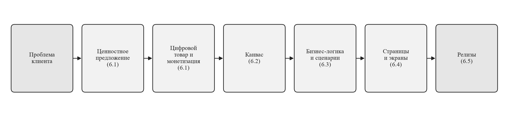
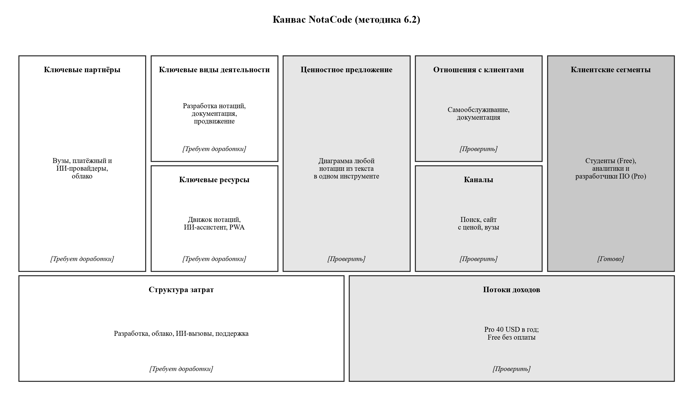
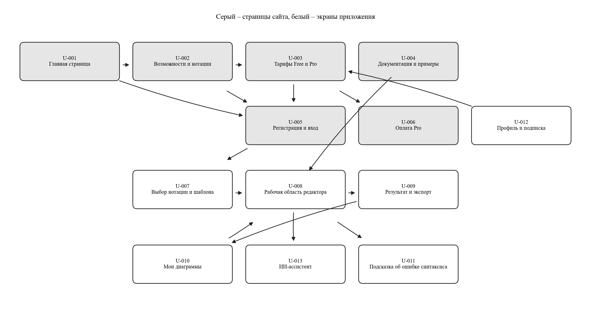
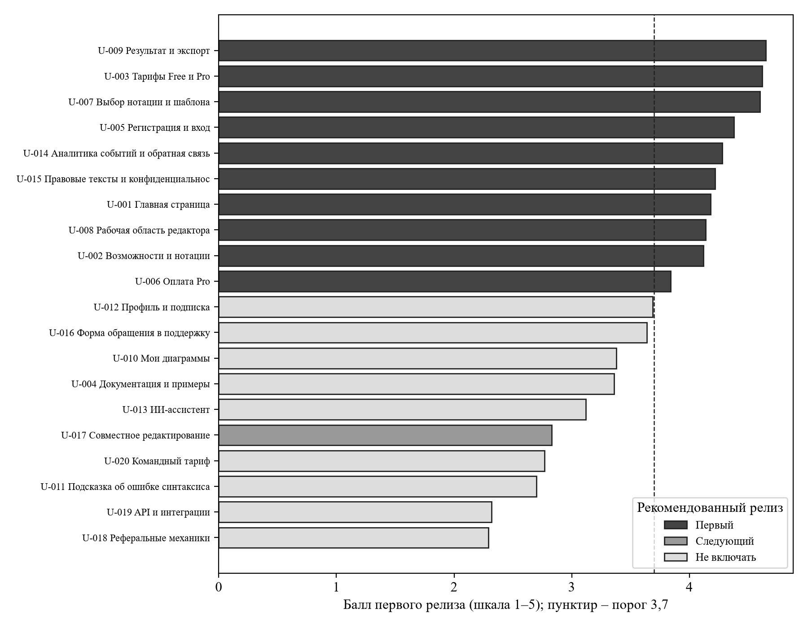

## 1 Цель работы

Перевести результаты анализа рынка, конкурентов и отзывов (ЛР1–ЛР5 [6]) в проектное описание цифрового товара NotaCode: сформулировать ценностное предложение и цифровой товар, собрать бизнес-модель по Канвас, описать бизнес-логику и пользовательские сценарии, определить страницы и экраны, разделить разработку на релизы [1–5].

Сквозная логика работы: проблема клиента – ценностное предложение – цифровой товар – единица монетизации – Канвас – бизнес-логика – сценарии – страницы и экраны – релизы. Результат каждой методики служит входом следующей. Исходные данные – ЛР1–ЛР5 (снимок 30.09–01.10.2026); всё, что подтвердить этими данными нельзя, отмечено «модельная оценка».

Проект: NotaCode – веб-IDE (PWA) «диаграммы как код» для UML, BPMN 2.0, ERD, IDEF0, DFD и сетей Петри; тарифная модель freemium – Free и Pro за 40 USD в год (48 USD в год при цене 4 USD в месяц, 4 × 12). Продукт находится до выпуска минимальной версии.

## 2 Ход работы

### 2.1 Порядок работы и рабочие книги

Рисунок 1 – Цепочка методик ЛР6

Таблица 1 – Методики ЛР6 и рабочие книги

| Методика | Тема | Рабочая книга | Итог |
|---|---|---|---|
| 6.1 | Ценностное предложение и цифровой товар | Excel/6_1_cennostnoe_predlozhenie_NotaCode.xlsx | 19 источников, 6 проблем, ЦП, товар, монетизация |
| 6.2 | Бизнес-модель по Канвас | Excel/6_2_biznes_model_kanvas_NotaCode.xlsx | 24 выводов, 9 блоков Канвас, паспорт |
| 6.3 | Бизнес-логика и сценарии | Excel/6_3_biznes_logika_scenarii_NotaCode.xlsx | 12 сценариев, 13 требований, 10 инициатив |
| 6.4 | Страницы и экраны | Excel/6_4_stranicy_ekrany_NotaCode.xlsx | 13 единиц интерфейса, 15 переходов |
| 6.5 | Деление на релизы | Excel/6_5_relizy_NotaCode.xlsx | 20 единиц, 10 в первом релизе |

Расчёты ведутся по формулам шаблонов; там, где методика (docx) и шаблон расходятся, применён расчёт шаблона, расхождения указаны в разделе 2.8. Оценки по шкалам – экспертные; правила и ограничения записаны на листах «Журнал_6_N» каждой книги.

### 2.2 Методика 6.1. Ценностное предложение и цифровой товар

#### 2.2.1 Доказательная база и проблемы клиентов

Реестр источников содержит 19 записей: Вордстат, Similarweb Pro, опрос 27 студентов (ЛР4), оценки Trustpilot, G2 и Capterra, страницы тарифов и сайтов конкурентов [7], результаты ЛР5 [6]. Норма методики: не менее 3 конкурентов (8), 10 страниц сайтов (8 в реестре и 40 в ЛР5), 30 отзывов или высказываний (49 отзывов Trustpilot, собраны 02.10.2026, приложение В; опрос – 27 высказываний, данные сгенерированы).

Таблица 2 – Проблемы клиентов и индекс проблемы (формула шаблона, 0–100)

| ID | Проблема | Индекс | Приоритет |
|---|---|---|---|
| P-001 | Студент или аналитик, которому нужна диаграмма UML, BPMN или ERD к проекту, тратит время на освоение синтаксиса текстовых языков (PlantUML, Mermaid) и… | 67 | высокий |
| P-002 | Нотации IDEF0, DFD и сети Петри не поддерживаются ни одним из 8 просмотренных конкурентов; полный набор UML, BPMN и ERD есть только у платного Lucidch… | 74 | высокий |
| P-003 | Платные редакторы тарифицируются за пользователя от 9 до 20 USD в месяц (Mermaid Chart, Lucidchart, Eraser, Whimsical); бесплатные тарифы ограничены 3… | 72 | высокий |
| P-004 | Совместная работа и экспорт - ожидаемый минимум: коллаборация важна 26 из 27 опрошенных, экспорт PNG 27 из 27, SVG 18 из 27; эти функции уже есть у бо… | 62 | средний |
| P-005 | Редактор не подсказывает ошибки правил нотации при вводе; данных о реализации у конкурентов нет (модельная оценка (допущение; причина: проверка продуктов)). | 61 | средний |
| P-006 | Русскоязычная среда и оплата в рублях: на русском языке с тарифами в рублях найден только Storm (платформа процессов BPMN). | 60 | средний |

Опорная проблема – P-002: нет единого инструмента для всех нотаций проекта (индекс 74). По формуле docx (ИПП, шкала 1–5) она получает 3,95 – «использовать после уточнения сегмента». Конкурентные решения оценены по 12 парам «конкурент – проблема» (индекс силы решения 70–88: сильное решение или рыночный стандарт).

#### 2.2.2 Ценностное предложение, товар и монетизация

Ценностное предложение VP-001: Для студентов технических специальностей и аналитиков ПО, которым нужны диаграммы UML, BPMN, ERD, IDEF0 и DFD к проектам и учебным работам, NotaCode - веб-IDE «диаграммы как код» - позволяет получить диаграмму в выбранной нотации по текстовому описанию в одном инструменте без установки, в отличие от текстовых языков без визуального редактора и платных редакторов с оплатой за пользователя, потому что поддерживает весь набор нотаций проекта (в том числе IDEF0, DFD и сети Петри, не найденные у 8 конкурентов) и имеет бесплатный уровень Free.

Цифровой товар PR-001 – веб-платформа (PWA): редактор диаграмм «как код» для UML, BPMN 2.0, ERD, IDEF0/IDEF1X/IDEF3, DFD и сетей Петри с ИИ-ассистентом; индекс оформленности 100. Единица монетизации – пользователь Pro (подписка на год, 40 USD); Free – бесплатная зона. Потенциальная годовая выручка (уровень SAM) при 1 634 платящих пользователях (ЛР2-3, ЛР4) – 65 360 USD, достижимая выручка первого года (SOM) – 249–16 590 BYN; монетизационный потенциал M-001 – 86, M-002 – 74. Индекс связности цепочки: 86 (CHK-001) и 83 (CHK-002).

Таблица 3 – Проверочные индексы методики 6.1

| Индекс | Значение | Вывод |
|---|---|---|
| ИПП (docx) опорной проблемы | 3,95 | Использовать после уточнения сегмента |
| ИКЦП (качество ЦП) | 3,83 | Нужно уточнение (порог 4,0) |
| ИКСТ (конкурентная состоятельность) | 3,30 | Уточнить состав и обещание (продукт до MVP) |

### 2.3 Методика 6.2. Бизнес-модель по Канвас

Банк выводов содержит 24 записей из ЛР1–ЛР5 и методики 6.1 (индекс доказательности – среднее достоверности, актуальности и приоритета). Девять блоков Канвас заполнены по форме методики; статусы блоков рассчитаны шаблоном (рисунок 2).

Рисунок 2 – Канвас NotaCode и статусы блоков

Таблица 4 – Блоки Канвас, достоверность и статус

| Блок | Достоверность | Полнота | Риск ошибки | Статус |
|---|---|---|---|---|
| Клиентские сегменты | 4 | 4 | 2 | Готово |
| Ценностное предложение | 4 | 4 | 3 | Проверить |
| Каналы | 4 | 4 | 3 | Проверить |
| Отношения с клиентами | 3 | 4 | 3 | Проверить |
| Потоки доходов | 3 | 4 | 3 | Проверить |
| Ключевые ресурсы | 2 | 3 | 3 | Требует доработки |
| Ключевые виды деятельности | 2 | 3 | 3 | Требует доработки |
| Ключевые партнёры | 2 | 3 | 3 | Требует доработки |
| Структура затрат | 2 | 3 | 4 | Требует доработки |

Показатели дашборда: полнота заполнения 71 % (минимум первичной версии – 70 %, для стратегического решения – 85 %), средняя доказательность 58 %, контроль риска 40 %, доля готовых блоков 11 %, подтверждённых проверок связности 50 % (6 из 12). Блоки ресурсов, деятельности, партнёров и затрат основаны на гипотезах (доказательность 2) и требуют проверки интервью, расчётом экономики и договорённостями; поэтому модель оценена как рабочая, но не готовая к стратегическому решению.

### 2.4 Методика 6.3. Бизнес-логика и пользовательские сценарии

#### 2.4.1 Бизнес-логика

Бизнес-логика записана в трёх версиях (лист «Журнал_6_3»).

Полная версия: Мы работаем со студентами технических специальностей и аналитиками ПО, которые сталкиваются с отсутствием единого инструмента для всех нотаций проекта (UML, BPMN, ERD, IDEF0, DFD, сети Петри) и с высоким порогом освоения текстовых языков. Для решения предлагается NotaCode - веб-IDE «диаграммы как код», которая даёт корректную диаграмму в выбранной нотации из текста за счёт единого редактора, набора нотаций и ИИ-ассистента. Пользователь получает ценность через сценарии построения первой диаграммы, экспорта и построения диаграмм IDEF0 и DFD, а компания монетизирует её через подписку Pro 40 USD в год за пользователя при бесплатном уровне Free. Устойчивость обеспечивают собственный движок нотаций, документация, облачная инфраструктура и ИИ-провайдер (гипотезы), результат проверяется долей пользователей, построивших первую диаграмму, конверсией Free в Pro и удержанием.

Краткая версия: Студенты и аналитики ПО получают диаграмму любой нотации проекта из текста в одном бесплатном инструменте, а компания зарабатывает на подписке Pro за снятие ограничений.

Проверочная версия: Сегмент (студенты, аналитики ПО; A-006) -> проблема P-002 (A-001) -> цифровой товар NotaCode (6.1) -> механизм (единый редактор и набор нотаций; BL-002) -> сценарий S-004, S-005 -> монетизация Pro 40 USD в год (A-003, A-004) -> операционная способность (BL-006, гипотеза) -> метрики (BL-007).

В банк анализа внесено 13 выводов (9 с сильной опорой), описано 7 элементов бизнес-логики (средний индекс надёжности 0,65) и 7 ролей (посетитель, новый, активный пользователь, платящий клиент, администратор клиента, внутренний администратор, партнёр).

#### 2.4.2 Сценарии, требования и приоритеты

Таблица 5 – Пользовательские сценарии и индекс сценария (формула шаблона)

| ID | Сценарий | Роль | Индекс | Приоритет |
|---|---|---|---|---|
| S-001 | Найти инструмент для диаграммы нотации | Посетитель | 7,2 | средний |
| S-002 | Сравнить NotaCode с другими инструментами и увидеть цену | Потенциальный клиент | 9,6 | высокий |
| S-003 | Зарегистрироваться в бесплатном уровне | Новый пользователь | 9,6 | высокий |
| S-004 | Построить первую диаграмму из текста | Новый пользователь | 11,25 | высокий |
| S-005 | Построить диаграмму IDEF0 или DFD | Активный пользователь | 9,0 | высокий |
| S-006 | Экспортировать диаграмму в PNG или SVG | Новый пользователь | 15,0 | критический |
| S-007 | Сохранить диаграмму и вернуться к ней | Активный пользователь | 7,2 | средний |
| S-008 | Оформить подписку Pro | Платящий клиент | 11,25 | высокий |
| S-009 | Исправить ошибку в описании диаграммы | Новый пользователь | 3,2 | низкий |
| S-010 | Найти ответ в документации | Активный пользователь | 2,7 | низкий |
| S-011 | Выдать доступ команде | Администратор клиента | 2,4 | низкий |
| S-012 | Подключить студентов вуза | Партнер | 0,9 | отложить |

Таблица 6 – Функциональные требования и индекс приоритета

| ID | Требование | Категория Кано | Индекс | Приоритет | MVP |
|---|---|---|---|---|---|
| F-001 | Текстовый ввод диаграммы с предпросмотром | Базовое требование | 9,0 | средний | Кандидат |
| F-002 | Нотация UML (классы, последовательности) | Базовое требование | 9,0 | средний | Кандидат |
| F-003 | Нотации ERD, IDEF1X и IDEF3 (волна 1) | Линейное требование | 8,0 | средний | Кандидат |
| F-004 | Нотации IDEF0 и DFD (волна 1) | Привлекательное требование | 6,75 | средний | Кандидат |
| F-005 | Экспорт в PNG и SVG | Базовое требование | 16,0 | критический | Да |
| F-006 | Регистрация и личный кабинет Free | Базовое требование | 12,0 | высокий | Да |
| F-007 | Сохранение диаграмм и история версий | Линейное требование | 7,0 | средний | Кандидат |
| F-008 | Подсказки об ошибках синтаксиса | Привлекательное требование | 3,5 | низкий | Нет |
| F-009 | Страница возможностей и тарифов Free и Pro | Базовое требование | 18,0 | критический | Да |
| F-010 | Оплата подписки Pro | Базовое требование | 10,67 | высокий | Да |
| F-011 | ИИ-ассистент построения диаграммы | Привлекательное требование | 6,0 | средний | Кандидат |
| F-012 | Документация и примеры нотаций | Базовое требование | 12,0 | высокий | Да |
| F-013 | Совместное редактирование и доступ команде | Линейное требование | 4,8 | низкий | Нет |

Контрольный лист связности пройден по 10 точкам из 10 (индекс готовности 100 %). Требований MVP по формуле шаблона – 5; основные нотации волны 1 (UML, ERD, IDEF1X, IDEF3) получают статус «Кандидат» из-за сложности, и решение об их включении принято в методике 6.5 с учётом документации проекта (раздел 2.7). В приоритизации инициатив (10) в первую версию по формуле включены 2 инициативы, ещё 1 – после проверки, 3 требуют дополнительной проверки, 3 отложены и 1 исключена; расчёт индекса приоритета сценария по формуле docx не вёлся.

### 2.5 Методика 6.4. Страницы и экраны

Из сценариев выведено 13 интерфейсных единиц: 6 страниц сайта и 7 экранов приложения; каждый сценарий покрыт хотя бы одной единицей (покрытие 100 %). Карта переходов (15 переходов) показана на рисунке 3.

Рисунок 3 – Карта навигации страниц и экранов

Таблица 7 – Страницы и экраны, приоритет по шаблону 6.4

| ID | Тип | Название | Сценарий | Балл | Класс | Статус |
|---|---|---|---|---|---|---|
| U-001 | Страница сайта | Главная страница | SC-001 | 62 | P2 | Принято |
| U-002 | Страница сайта | Возможности и нотации | SC-002 | 74 | P2 | Принято |
| U-003 | Страница сайта | Тарифы Free и Pro | SC-002 | 80 | P1 | Принято |
| U-004 | Страница сайта | Документация и примеры | SC-010 | 56 | P3 | Принято |
| U-005 | Страница сайта | Регистрация и вход | SC-003 | 71 | P2 | Принято |
| U-006 | Страница сайта | Оплата Pro | SC-008 | 69 | P2 | Требует уточнения |
| U-007 | Экран приложения | Выбор нотации и шаблона | SC-005 | 59 | P3 | Принято |
| U-008 | Экран приложения | Рабочая область редактора | SC-004 | 82 | P1 | Принято |
| U-009 | Экран приложения | Результат и экспорт | SC-006 | 80 | P1 | Принято |
| U-010 | Экран приложения | Мои диаграммы | SC-007 | 57 | P3 | Принято |
| U-011 | Экран приложения | Подсказка об ошибке синтаксиса | SC-009 | 55 | P3 | Гипотеза |
| U-012 | Экран приложения | Профиль и подписка | SC-008 | 56 | P3 | Принято |
| U-013 | Экран приложения | ИИ-ассистент | SC-004 | 58 | P3 | Гипотеза |

Паспорта заполнены для 6 ключевых единиц (тарифы, регистрация, оплата, редактор, экспорт, профиль), карта состояний – для 6 единиц; полнота описаний, паспортов и состояний – 1,00, интегральная готовность – 0,98. По формуле шаблона P1 получают 3 единицы (выбор нотации, редактор, экспорт); тарифы, регистрация и оплата – P2 или P3, но входят в цепочку «обнаружение – выбор – оплата – результат», поэтому включаются в первый выпуск в методике 6.5. Подсказка об ошибках и ИИ-ассистент имеют статус «Гипотеза».

### 2.6 Методика 6.5. Деление на релизы

Каждая из 20 единиц оценена по 10 критериям шаблона; по правилам шаблона в первый релиз рекомендованы 10 единиц, в следующие – 1, остальные отмечены «Не включать / проверить» (рисунок 4).

Рисунок 4 – Балл первого релиза и рекомендованный релиз

Таблица 8 – Единицы разработки и рекомендованный релиз

| ID | Единица | Балл 1-го релиза | Балл следующих | Рекомендация |
|---|---|---|---|---|
| U-001 | Главная страница | 4,18 | 2,98 | Первый |
| U-002 | Возможности и нотации | 4,12 | 3,24 | Первый |
| U-003 | Тарифы Free и Pro | 4,62 | 3,08 | Первый |
| U-004 | Документация и примеры | 3,36 | 3,32 | Не включать |
| U-005 | Регистрация и вход | 4,38 | 3,6 | Первый |
| U-006 | Оплата Pro | 3,84 | 3,42 | Первый |
| U-007 | Выбор нотации и шаблона | 4,6 | 3,28 | Первый |
| U-008 | Рабочая область редактора | 4,14 | 4,46 | Первый |
| U-009 | Результат и экспорт | 4,65 | 3,82 | Первый |
| U-010 | Мои диаграммы | 3,38 | 3,28 | Не включать |
| U-011 | Подсказка об ошибке синтаксиса | 2,7 | 3,22 | Не включать |
| U-012 | Профиль и подписка | 3,69 | 2,84 | Не включать |
| U-013 | ИИ-ассистент (заглушка в MVP) | 3,12 | 3,54 | Не включать |
| U-014 | Аналитика событий и обратная связь | 4,28 | 3,5 | Первый |
| U-015 | Правовые тексты и конфиденциальность | 4,22 | 2,86 | Первый |
| U-016 | Форма обращения в поддержку | 3,64 | 3,12 | Не включать |
| U-017 | Совместное редактирование | 2,83 | 3,92 | Следующий |
| U-018 | Реферальные механики | 2,29 | 2,62 | Не включать |
| U-019 | API и интеграции | 2,32 | 3,38 | Не включать |
| U-020 | Командный тариф | 2,77 | 2,9 | Не включать |

Средний балл первого релиза – 4,30, связь с ценностью – 4,4, технический риск – 1,9 (состав достаточно обоснован); среднее удержание и рост – 3,2. Для единиц, которые формула отнесла к «Не включать», релиз назначен вручную по методике 6.5: подсказки об ошибках, ИИ-ассистент, «Мои диаграммы», профиль и документация – релиз 2 (удержание и качество), нотации BPMN 2.0 – релиз 2, сети Петри и реферальные механики – релиз 3, совместное редактирование, API и командный тариф – релиз 4.

Подготовлено два варианта плана релиза 1.

Таблица 9 – Варианты плана первого релиза

| Вариант | Состав | Исключения | Риск |
|---|---|---|---|
| А «Быстрый выход» | Free и заявка на Pro без онлайн-оплаты: главная, возможности, тарифы, регистрация, выбор нотации, редактор, экспорт, правовые тексты, аналитика, поддержка | Онлайн-оплата, ИИ-ассистент, подсказки, совместная работа | Готовность платить проверяется косвенно |
| Б «С оплатой» | Вариант А и онлайн-оплата Pro (40 USD в год), профиль с подпиской | ИИ-ассистент, подсказки, совместная работа, API | Нужны платёжный провайдер и больший срок |

Рекомендуется вариант Б, если платёжный провайдер будет выбран до релиза 1: один проверяемый способ монетизации – граница экономии, которую методика запрещает сокращать; иначе вариант А как временный. Дорожная карта включает релизы 0–5 (прототип и правовые тексты; проверка ЦП; удержание и качество; рост аудитории; расширение; масштабирование). Реестр рисков содержит 8 записей, наибольшие индексы риска – разбор нотаций и совместное редактирование (по 20), платёжный провайдер (16).

### 2.7 Сверка с проектной документацией NotaCode

Папка NotaCode/docs содержит собственные документы проекта: концепцию, SMART-цели и KPI, BRD, требования, архитектуру и план Scrumban с границами MVP. По ним проверены допущения ЛР6; расхождения устранены в рабочих книгах 6.1–6.5.

Таблица 10 – Сверка допущений ЛР6 с документацией проекта

| Тема | Документация проекта | Было в ЛР6 | Решение |
|---|---|---|---|
| Нотации первого релиза | Волна 1 (MVP): UML (class, use case, activity, sequence, state), ERD, IDEF0, IDEF1X, IDEF3, DFD; BPMN – волна 2; сети Петри – волна 3 | IDEF0 и DFD во втором релизе, BPMN в первом | Нотации волны 1 включены в первый релиз, BPMN – релиз 2, сети Петри – релиз 3 |
| Тарифы | Free: все нотации, до 5 проектов, до 20 файлов, 20 версий, экспорт SVG, PNG, код; Pro: без ограничений, все форматы, полная история, ИИ-квота; 4 USD в месяц или 40 USD в год | «Нотация недоступна в Free» | Ограничитель Free – лимит проектов, версий и форматов экспорта |
| ИИ-ассистент | В MVP – заглушка с четырьмя режимами; провайдеры и квоты – после MVP | ИИ-ассистент во втором релизе | Заглушка в первом релизе, квоты в релизе 2 |
| Проверка правил нотации | Одно из отличий (D-02), эпик E3 | Гипотеза (доказательность 2) | Остаётся гипотезой для рынка (конкуренты не проверялись), но входит в продукт |
| Метрики и допущения | KPI: 1 500 пользователей, активация не менее 60 %, удержание D7 30 % и D30 15 %, конверсия в Pro 3 %, ARPPU 4 USD, отток не более 8 %; бюджет инфраструктуры MVP 0; около 610 ч; MVP до 06.12.2026 | Целевые значения приняты по KPI документации проекта и порогам пилота (таблица 16) | Значения приняты как допущения проекта, помечены в рабочих книгах |

Дополнительно документация проекта указывает аналоги, которых нет в группе ЛР5: Ramus, Sparx EA, Structurizr, Gleek, Text2Diagram; по Sparx EA данные собраны 02.10.2026 (приложение В, таблица 15), по остальным не собирались (модельная оценка (допущение)).

### 2.8 Расхождения методик и шаблонов

Таблица 11 – Расхождения и принятые решения

| Методика | Расхождение | Решение |
|---|---|---|
| 6.1 | Веса индекса проблемы в шаблоне (шкала 0–100) отличаются от формулы ИПП в docx (шкала 1–5) | Применён шаблон; ИПП docx рассчитан отдельно и приведён в таблице 3 |
| 6.1 | Шаблон считает выручку как цену на число единиц и называет её месячной | Число единиц – годовая оценка; выручка читается как годовая (65 360 USD) |
| 6.3 | Индекс сценария: docx – взвешенная сумма из 7 критериев, шаблон – произведение четырёх оценок на 20 | Применён шаблон |
| 6.5 | ИРП docx (0–5, 9 показателей) и два балла шаблона (1–5, 10 критериев) | Применены баллы шаблона |

## 3 Проверка по критериям методик

Таблица 12 – Контрольные листы готовности

| Методика | Пункт | Статус |
|---|---|---|
| 6.1 | Опорная проблема подтверждена источниками; ЦП содержит сегмент, проблему, результат, механизм, отличие, доказательство | да |
| 6.1 | Единица монетизации понятна клиенту и связана с результатом | да (спрос не проверен) |
| 6.1 | Показатели проверки спроса, ценности и удержания определены | частично (целевые значения приняты по KPI документации проекта) |
| 6.2 | Полнота не ниже 70 % для первичной версии | да (71 %) |
| 6.2 | Полнота не ниже 85 % для стратегического решения | нет (гипотезы по блокам 8–11) |
| 6.3 | Есть сценарии первой ценности, регулярного использования, оплаты, поддержки | да |
| 6.3 | Для сценариев определены метрики успеха | частично (метрика названа, целевое значение – по KPI документации и порогам пилота, таблица 16) |
| 6.4 | У каждого сценария есть страница или экран; описаны состояния и ошибки | да (для 6 ключевых единиц) |
| 6.5 | Первый релиз сохраняет ЦП, основной сценарий, единицу монетизации, доверие и аналитику | да |
| 6.5 | Сроки, бюджет и даты релизов определены | частично: MVP до 06.12.2026 по документации; релизы 2 и 3 и бюджет – допущения (таблица 16) |

## Выводы

1. Опорная проблема NotaCode – отсутствие единого инструмента для всех нотаций проекта (индекс проблемы 74); ценностное предложение сформулировано по формуле методики, ИКЦП 3,83 – требуется уточнение на клиентах.

2. Единица монетизации – пользователь Pro (подписка 40 USD в год) при бесплатном уровне Free; потенциал доступного рынка (SAM) 65 360 USD в год при 1 634 платящих пользователях; это верхняя оценка, а не достижимая выручка (достижимая выручка первого года – 249–16 590 BYN по ЛР2-3).

3. Канвас заполнен полностью, полнота 71 %, доказательность 58 %: сегменты подтверждены, блоки ресурсов, деятельности, партнёров и затрат – гипотезы.

4. Бизнес-логика записана в трёх версиях; описаны 12 сценариев и 13 требований; контрольный лист связности пройден (10 из 10).

5. Выведено 13 единиц интерфейса (6 страниц и 7 экранов), покрытие сценариев 100 %.

6. В первый релиз рекомендованы 10 из 20 единиц; подготовлены два варианта плана, рекомендован вариант с онлайн-оплатой Pro. Оценки экспертные; для окончательных решений нужны интервью, проверка спроса и цены, срок и бюджет (приложение Б).

7. Данные 02.10.2026 (49 отзывов, Sparx, сгенерированный опрос, реклама) подтверждают опорную проблему и требование «экспорт PNG и SVG в Free» (приложение В); экономика на пользователя, сроки и пороги пилота приняты допущениями (таблица 16) и подлежат проверке.

## Список использованных источников

1. Методика формулирования ценностного предложения и цифрового товара: материалы курса «Электронный бизнес». – Файл: Материалы/Методика_формулирования_ценностного_предложения_и_цифрового_товара.docx.
2. Методика сборки бизнес-модели по Канвас на основе анализа: материалы курса «Электронный бизнес». – Файл: Материалы/Методика_сборки_бизнес_модели_по_Канвас_на_основе_анализа.docx.
3. Методика формулирования бизнес-логики и пользовательских сценариев: материалы курса «Электронный бизнес». – Файл: Материалы/Методика_формулирования_бизнес_логики_и_пользовательских_сценариев.docx.
4. Методика перехода к страницам и экранам сайта или приложения: материалы курса «Электронный бизнес». – Файл: Материалы/Методика_перехода_к_страницам_и_экранам_сайта_или_приложения.docx.
5. Методика деления разработки сайта на релизы: материалы курса «Электронный бизнес». – Файл: Материалы/Методика_деления_разработки_сайта_на_релизы.docx.
6. Хаджинова, К. А. Отчёты по лабораторным работам ЛР1–ЛР5 «Электронный бизнес»: проект NotaCode. – Минск: БГУИР, 2026.
7. Страницы сайтов конкурентов: mermaid.ai, lucid.app, eraser.io, whimsical.com, stormbpmn.com, drawio.com, plantuml.com [Электронный ресурс]. – Дата доступа: 01.10.2026.

## Приложение А (обязательное) Перечень файлов работы

Таблица 13 – Файлы лабораторной работы

| Файл или папка | Содержание |
|---|---|
| Excel/6_1_cennostnoe_predlozhenie_NotaCode.xlsx | Методика 6.1 |
| Excel/6_2_biznes_model_kanvas_NotaCode.xlsx | Методика 6.2 |
| Excel/6_3_biznes_logika_scenarii_NotaCode.xlsx | Методика 6.3 |
| Excel/6_4_stranicy_ekrany_NotaCode.xlsx | Методика 6.4 |
| Excel/6_5_relizy_NotaCode.xlsx | Методика 6.5 |
| Python/spec_61.py ... spec_65.py, figures.py, build_report.py | Описание заполнения книг, рисунки, сборка отчёта |
| Excel_COM/fill_workbook.ps1 | Заполнение книг через COM |
| Рисунки/ | Рисунки 1–4 |

## Приложение Б (обязательное) Данные, не подтверждённые источниками

Таблица 14 – Перечень данных, требующих дополнительного сбора

| № | Что нужно | Почему не получено |
|---|---|---|
| 1 | Тексты отзывов (G2, Capterra, Trustpilot) | Собраны 49 отзывов Trustpilot по пяти продуктам (приложение В); G2 и Capterra не просматривались |
| 2 | модельная оценка (допущение; причина: интервью и проверка спроса и цены Pro на реальных клиентах )| Продукт до MVP |
| 3 | Договорённости с вузами, платёжным и ИИ-провайдерами | Платёжный провайдер предложен: bePaid (ЛР4, таблица условий платежей; ЛР7, приложение 9); договорённости с вузами и ИИ-провайдером – модельная оценка (допущение), блоки партнёров – гипотезы |
| 4 | Расчёт экономики на пользователя (затраты на ИИ и инфраструктуру) | Рассчитано по допущению (приложение В, таблица 16): ИИ в MVP – заглушка, инфраструктура 0 |
| 5 | Срок, бюджет и даты релизов; целевые значения метрик | Приняты допущения (приложение В, таблица 16) |
| 6 | модельная оценка (допущение; причина: прототип и проверка с пользователями (UX-тест)) | Не проводился |
| 7 | Перечень форматов экспорта и состав MVP-нотаций | По документации проекта: Free – экспорт SVG, PNG и код, Pro – все форматы; в MVP входят нотации волны 1 (UML, ERD, IDEF0, IDEF1X, IDEF3, DFD) |

## Приложение В (обязательное) Данные, собранные 02.10.2026

После основной сборки получены тексты отзывов пользователей (Trustpilot, 49 записей по Lucidchart, Miro, Creately, SmartDraw, Visual Paradigm), цены и состав нотаций Sparx Systems и сгенерированный опрос по методу Кано [7]. Данные не меняют опорную проблему P-002, но подтверждают её и уточняют требования к первому релизу.

Таблица 15 – Новые данные и их влияние на решения ЛР6

| Данные | Результат | Влияние на ЛР6 |
|---|---|---|
| Отзывы Trustpilot, 49 записей | Платный экспорт и лимиты бесплатного плана – 18 жалоб; биллинг и отмена – 9; удобство и ошибки – 12; положительных – 9 | Норма методики 6.1 (не менее 30 высказываний) выполнена; требование «экспорт PNG и SVG в Free» подтверждено; честная отмена и предупреждение о лимитах |
| Sparx Systems Enterprise Architect 17.2 | Цены 245–750 USD за лицензию; IDEF0, IDEF1X, IDEF3, DFD, сети Петри не заявлены; текстового ввода нет | Ещё один конкурент без нотаций волны 1 и без текстового ввода; ценность предложения подтверждена |
| Опрос по методу Кано (30 условных респондентов) | Экспорт без оплаты – обязательный признак; текстовый ввод и IDEF – одномерные; DFD и сети Петри – безразличные | Порядок релизов сохранён; DFD остаётся в первом релизе по документации проекта, сети Петри – в релизе 3 |
| Реклама в Беларуси (Google Ads Transparency) | lucid.co – 28, miro.com – 23, smartdraw.com – 8 объявлений; у открытых инструментов нет | Платная реклама в нише слаба; канал – органический поиск и вузы |

Опрос смоделирован и реальный спрос не подтверждает; результат используется как гипотеза до проверки на пользователях.

Таблица 16 – Расчётные значения экономики на пользователя и сроков (допущения)

| Показатель | Значение | Основание |
|---|---|---|
| Затраты на ИИ в MVP | 0 BYN | ИИ в MVP – заглушка (документация проекта) |
| Затраты на инфраструктуру MVP | 0 BYN | документация проекта |
| Чистая выручка с платящего Pro в год | 117,63 BYN | цена 121,14 BYN, комиссия bePaid 2,9 % |
| Срок MVP | до 06.12.2026 | документация проекта |
| Релиз 2 (BPMN) | до 28.02.2027 | допущение |
| Релиз 3 (сети Петри) | до 30.04.2027 | допущение |
| Пороги пилота за 3 месяца после MVP | 150 регистраций; активация не ниже 60 %; не менее 5 платящих | допущение на основе KPI проекта |

Значения приняты расчётом и допущениями; подробный расчёт экономики и обоснование приведены в итоговом отчёте ЛР7 (приложение 9).
