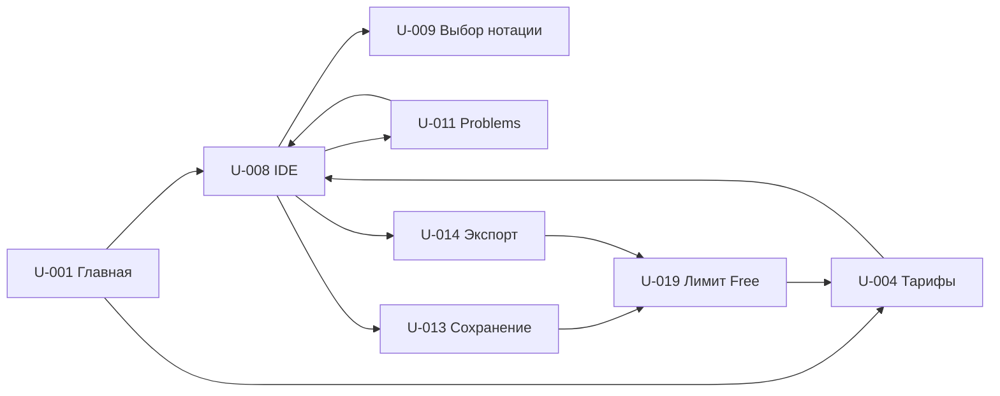
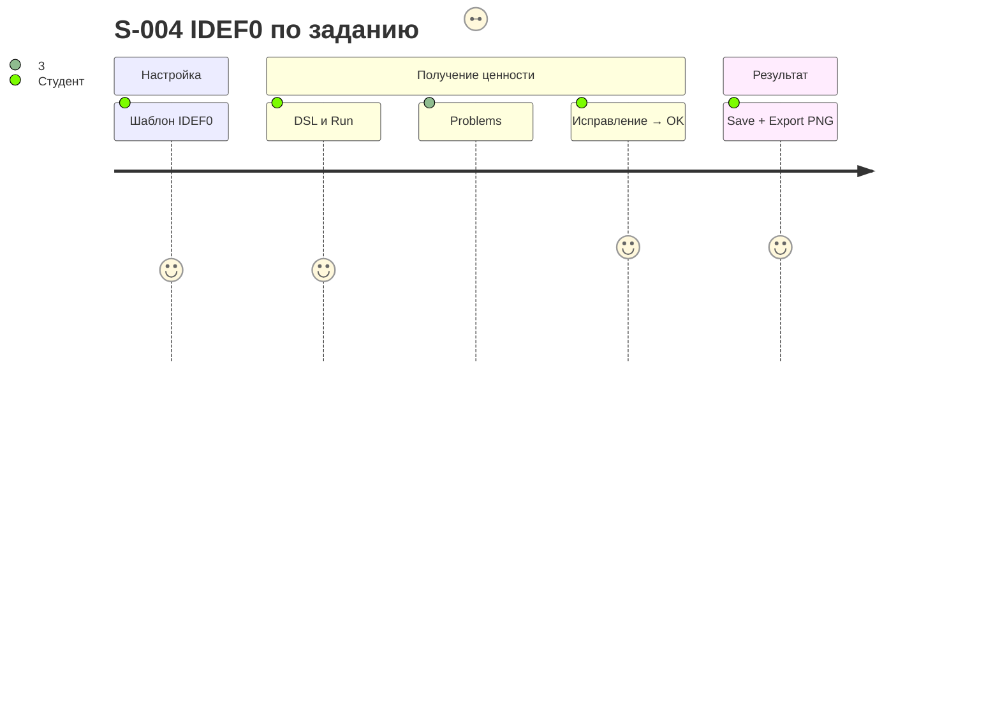

# Список рисунков ЛР6

## В отчёте (номер = номер рисунка в ОТЧЕТ.md)

| № | Файл | Что показано | Чем сделано |
|---|---|---|---|
| 1 | fig_01_ipp.png | ИПП 8 проблем с порогами 3,0/4,0/4,5 | lr6_charts.py |
| 2 | fig_02_canvas.png | Канвас NotaCode, 9 блоков, цвет — доказательность | lr6_charts.py |
| 3 | fig_03_canvas_evidence.png | Индекс доказательности блоков, полнота 8/9 | lr6_charts.py |
| 4 | fig_04_business_logic.png | Причинная цепочка бизнес-логики | lr6_charts.py (Graphviz) |
| 5 | fig_05_scenario_map.png | Карта ключевых сценариев по этапам пути | lr6_charts.py |
| 6 | fig_06_navigation.png | Карта навигации: 24 единицы, 35 переходов, P1/P2/P3 | lr6_charts.py (Graphviz) |
| 7 | mock_02_ide_light.png | U-008 IDE | lr6_mockups.py (мокап прототипа) |
| 8 | mock_06_validation_problems.png | U-011 Problems, ошибка правила | lr6_mockups.py |
| 9 | wf_01_landing.png | Вайрфрейм лендинга U-001 | lr6_charts.py |
| 10 | wf_02_pricing.png | Вайрфрейм тарифов U-004 | lr6_charts.py |
| 11 | wf_03_limit_modal.png | Вайрфрейм модалки лимита U-019 | lr6_charts.py |
| 12 | mock_10_version_history.png | U-016 История версий | lr6_mockups.py |
| 13 | fig_07_irp.png | ИРП 38 единиц с порогами 1,5/2,5/3,5, цвет — релиз | lr6_charts.py |
| 14 | fig_09_release_counts.png | Состав релизов и средний ИРП | lr6_charts.py |
| 15 | fig_08_releases_gantt.png | Карта релизов R0–R4 на шкале спринтов | lr6_charts.py |

## Дополнительно (приложение Б)

mock_01, mock_03…mock_05, mock_07, mock_08, mock_09, mock_11…mock_17 — прочие мокапы прототипа (E:\VisualDSL-Platform\design\mockups; имя DiagramCode при рендере заменено на NotaCode).

## Сделать самой

| Файл | Что | Как |
|---|---|---|
| scr_01_cp_dashboard.png … scr_05_releases_registry.png | Дашборды 5 заполненных книг | Win+Shift+S по листам (список в ИНСТРУКЦИЯ_ДЛЯ_МЕНЯ.md) |
| scr_06_survey.png (опц.) | Сводка опроса студентов | Google Forms → «Ответы» |
| (опц.) замена wf_01/wf_02 | Макеты лендинга и тарифов | Figma или HTML-мокап в стиле design\mockups |

## Исходники схем (для правки, в отчёт не вставляются)

Карта навигации — генерируется из `Python\lr6_d4_screens.py` (UNITS, NAV). Альтернативная запись mermaid (основной путь P1):

Карта сценариев (journey):

