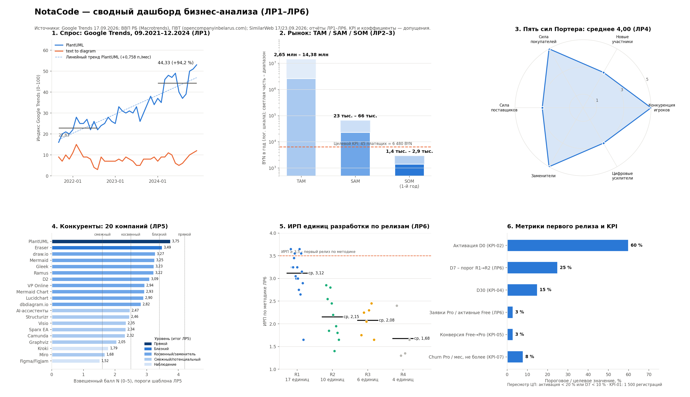
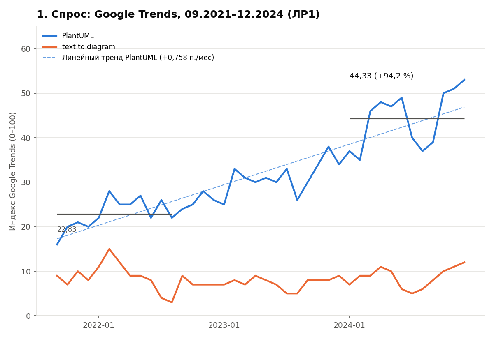
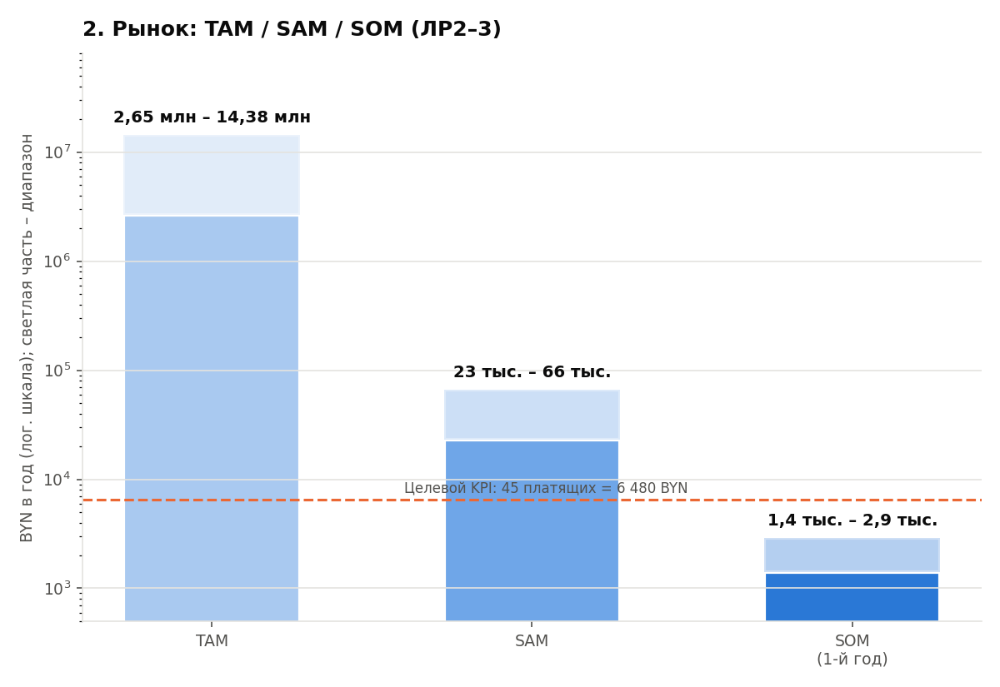
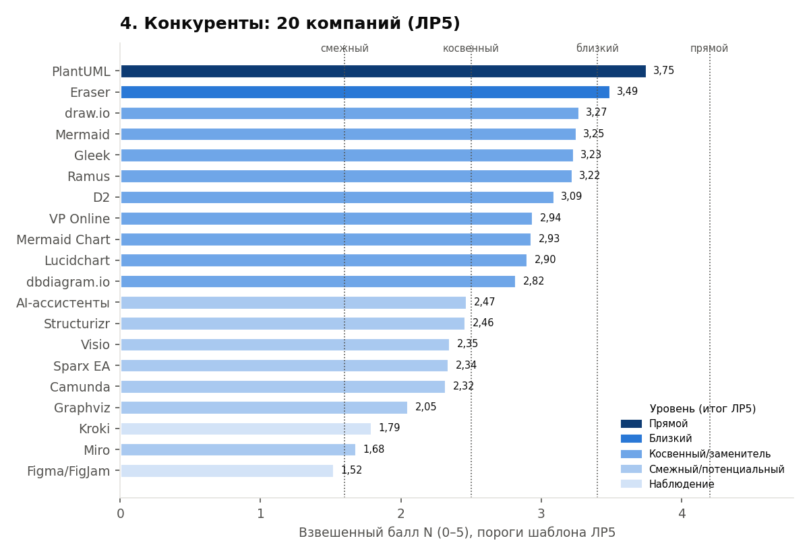
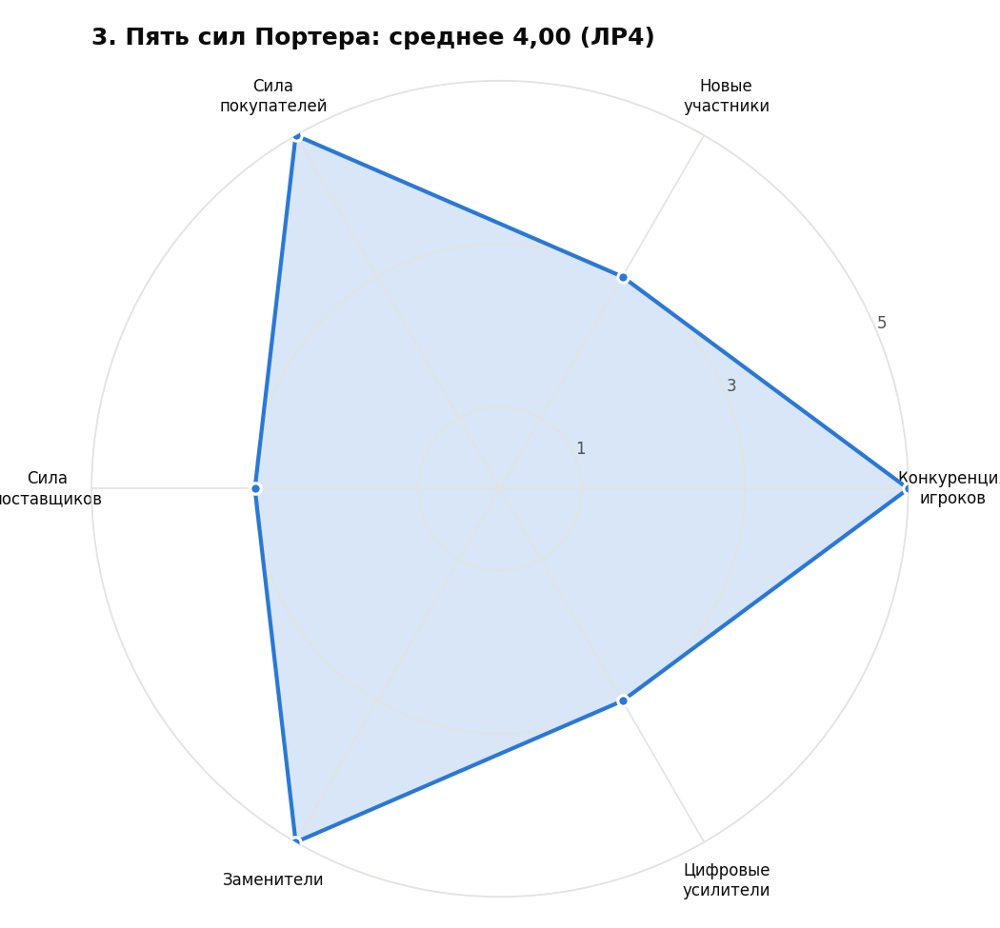
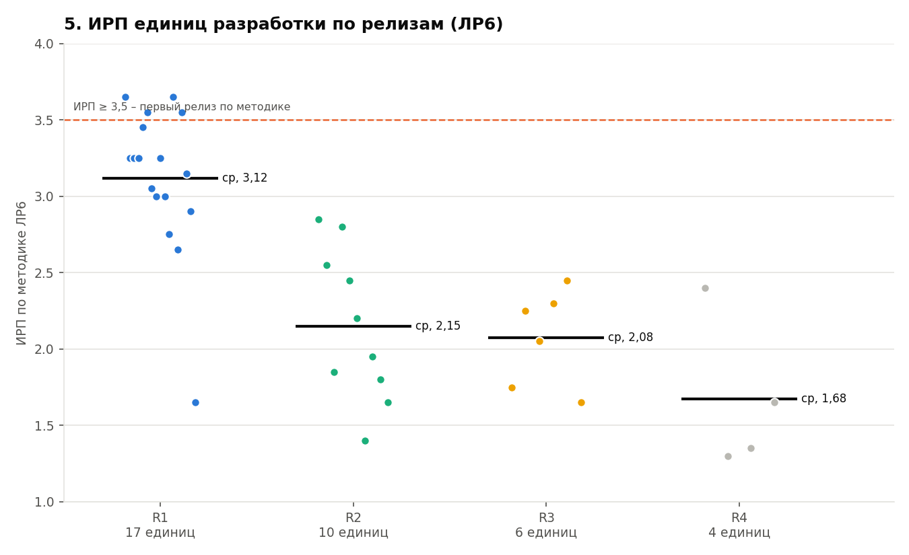
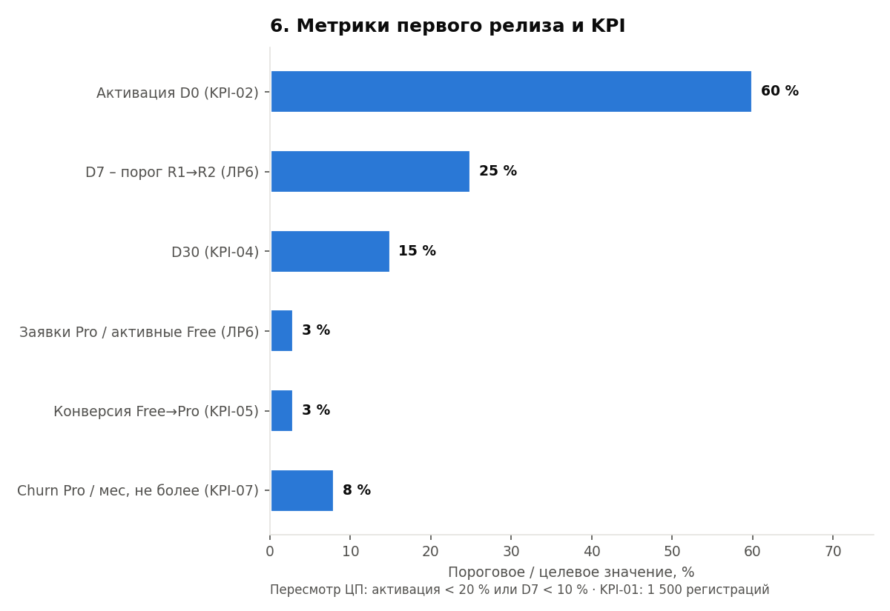

## 1 Цель работы

Свести результаты ЛР1–ЛР6 в единый итоговый отчёт по полному циклу бизнес-анализа цифрового товара NotaCode, обосновать целесообразность старта в выбранных рыночных границах и определить бизнес-модель, цифровой товар, первый релиз и дальнейшее развитие. По материалам отчёта подготовить краткое резюме проекта для владельца и инвестора.

## 2 Ход работы

Отчёт составлен по методике-шаблону итогового отчёта [1]. Каждый подраздел 2.1–2.14 соответствует разделу методики и заканчивается элементом итогового текста по шаблону. Все числовые результаты взяты из отчётов по ЛР1–ЛР6 [19–23]; новых расчётов, кроме предусмотренных методикой ЛР7 оценок по шкалам, в отчёте нет. Первичные данные: Google Trends [2], официальная статистика Республики Беларусь [4–6], Similarweb [7], сайты конкурентов [8–13], документы проекта NotaCode [14–16]. Методологическая основа – модель бизнес-модели по Канвас [17] и модель пяти сил Портера [18].

Источники разделов отчёта приведены в таблице 1.

Таблица 1 – Исходные данные для итогового отчёта

| Работа | Что перенесено в итоговый отчёт | Подразделы |
|---|---|---|
| ЛР1. Спрос и границы рынка | Ряд Google Trends 40 мес., тренд, сезонность, регионы, семантическое ядро (50 запросов, 10 кластеров), матрица перспективности, паспорт границ | 2.3, 2.4 |
| ЛР2–3. Объём рынка | TAM/SAM/SOM пятью методами, цена Pro в BYN, платёжеспособность, концентрация Similarweb | 2.4, 2.13 |
| ЛР4. Пять сил Портера | Матрица сил, цифровые усилители, индекс барьеров входа, CR3/HHI | 2.5, 2.6 |
| ЛР5. Анализ конкурентов | Классификация 20 компаний, Левитт и Кано, рыночный стандарт, бизнес-модели конкурентов | 2.5, 2.7, 2.8 |
| ЛР6. ЦП, Канвас, сценарии, экраны, релизы | Реестр проблем P-001…P-008, VP-001, Канвас, 13 сценариев, 24 интерфейсные единицы, 38 единиц разработки, релизы R0–R4 | 2.7–2.12 |
| Документы проекта | Концепция, SMART-цели и KPI, план Scrumban | 2.2, 2.13 |

Титульный паспорт отчёта заполнен по шаблону методики (таблица 2).

Таблица 2 – Титульный паспорт отчёта

| Параметр | Значение |
|---|---|
| Проект / идея | NotaCode – веб-IDE (PWA) класса «diagram as code» для формальных нотаций: UML, ERD, IDEF0, IDEF1X, IDEF3, DFD, BPMN 2.0, сети Петри, свободная нотация |
| Инициатор / команда | Хаджинова К., студентка ИИТ БГУИР; Product Owner и разработчик |
| Дата подготовки | 26.09.2026 |
| География анализа | Республика Беларусь (ядро), русскоязычный сегмент РФ и СНГ (расширение) |
| Тип цифрового товара | Веб-сервис (PWA) с личным кабинетом, freemium-подписка |
| Цель отчёта | Обосновать целесообразность старта в выбранных рыночных границах, определить бизнес-модель, цифровой товар, первый релиз и последующее развитие |

Структура отчёта соответствует 14 разделам методики (таблица 3).

Таблица 3 – Структура итогового отчёта по методике

| № | Раздел методики | Подраздел отчёта |
|---|---|---|
| 1 | Резюме проекта | 2.1 |
| 2 | Идея и исходная гипотеза | 2.2 |
| 3 | Аргументация спроса: Google Trends и Вордстат | 2.3 |
| 4 | Границы и размер рынка | 2.4 |
| 5 | Конкурентная среда и уровни конкуренции | 2.5 |
| 6 | Барьеры входа и выхода | 2.6 |
| 7 | Проблемы пользователей и рыночные пробелы | 2.7 |
| 8 | Ценностное предложение и цифровой товар | 2.8 |
| 9 | Бизнес-модель по Канвас | 2.9 |
| 10 | Бизнес-логика и пользовательские сценарии | 2.10 |
| 11 | ТЗ: страницы, экраны, функционал, контент | 2.11 |
| 12 | Первый и последующие релизы | 2.12 |
| 13 | Решение о целесообразности старта | 2.13 |
| 14 | Приложения | 2.14, приложения А–Д |

Сводные результаты ЛР1–ЛР6 показаны на рисунке 1.

Рисунок 1 – Сводный дашборд бизнес-анализа NotaCode по результатам ЛР1–ЛР6

### 2.1 Резюме проекта

Подраздел заполнен последним, после подразделов 2.2–2.13, и поставлен в начало хода работы (таблица 4).

Таблица 4 – Резюме проекта

| Блок | Что указать | Источник | Итоговая формулировка |
|---|---|---|---|
| Идея | Цифровой товар и основная проблема | 2.2, 2.8 | Проект представляет собой веб-IDE «diagram as code» с проверкой правил нотаций для студентов технических специальностей, чтобы получать корректные диаграммы IDEF0, IDEF3, DFD, ERD и UML из текста без ручного построения и замечаний за нарушение правил |
| Рыночное основание | Спрос и достаточность рынка | 2.3, 2.4 | Спрос подтверждается ростом индекса Google Trends PlantUML на 94,2 % (средние первых и последних 12 из 40 месяцев) и 5-м местом Беларуси в мире по интересу к нему. Рынок достаточен для проверки: SAM 23–66 тыс. BYN в год, SOM первого года 1,4–2,9 тыс. BYN при нулевых денежных расходах инфраструктуры MVP |
| Ценностное предложение | Ключевая выгода и отличие | 2.5, 2.7, 2.8 | Корректная по правилам нотации диаграмма из текста с указанием строки нарушения. Валидация правил, профили IDEF/DFD, кросс-подсветка и построчный diff есть не более чем у 3 из 12 конкурентов (ЛР5) |
| Бизнес-модель | Кто платит, за что, как часто, канал | 2.9 | Freemium: Free бесплатно, Pro 12 BYN/мес (4 USD, курс-допущение 3,00); годовой чек 72–144 BYN. Каналы – органический поиск, GitHub, рекомендации преподавателей |
| Первый релиз | Минимальный состав | 2.11, 2.12 | R1 (MVP к 06.12.2026) – 17 единиц разработки: ядро ценности (редактор DSL, разбор и диагностика, профили волны 1, холст, Problems, шаблоны, документация), вход, сохранение в БД и на устройство, ручной push в GitHub, экспорт SVG/PNG/XML, история 20 версий, лендинг, тарифы с заявкой «Хочу Pro», аналитика, правовые документы. **Не включает** оплату Pro, кросс-подсветку, AI-заглушку, Google Drive, quick fix, волны 2–3 нотаций, совместную работу |
| Решение | Стартовать / доработать / не стартовать | 2.13 | Рекомендуется **ограниченный старт (пилот)** первого релиза при условиях D7 ≥ 25 % и заявки Pro ≥ 3 % активных Free |

**Элемент итогового текста.** На основе проведённого анализа рекомендуется **стартовать ограниченно** проект NotaCode в границах Республики Беларусь, сегмента студентов технических специальностей (S-01, тариф Free) и платящих сегментов аналитиков и архитекторов (S-02, S-03, Pro). Подтверждены:

- растущий спрос: +94,2 % по Google Trends, Беларусь – 5-е место в мире по интересу к PlantUML;
- критическая опорная проблема P-001: ИПП 4,35, индекс шаблона 90;
- платёжеспособность: средний индекс 3,23, валовая маржа 75 %;
- конкурентный пробел: валидация правил и профили IDEF/DFD у не более чем 3 из 12 конкурентов.

Первый релиз из 17 единиц может быть реализован к 06.12.2026 без утраты ценностного предложения: проверка сохранения ЦП дала 4,17 из 5.

### 2.2 Идея и исходная гипотеза

Идея описана как проверяемая гипотеза (таблица 5).

Таблица 5 – Паспорт идеи

| Элемент | Вопрос | Ответ для NotaCode |
|---|---|---|
| Проблема | Какая трудность есть у клиента? | Студент вручную строит диаграммы строгих нотаций и получает замечания за нарушения правил (ICOM-роли IDEF0, баланс DFD, кардинальности ERD), которые обнаруживаются только на проверке (P-001, ЛР6) |
| Клиент | У кого возникает проблема и кто платит? | S-01 студенты ИТ-специальностей (пользователь, пограничный бюджет); S-02 аналитики, S-03 архитекторы (наиболее платёжеспособны, ЛР2–3); S-04 преподаватели (инициатор и канал) |
| Текущее решение | Как решают сейчас? | draw.io (бесплатный главный заменитель для студентов), PlantUML и Mermaid (нет IDEF/DFD и проверки правил), Ramus, Sparx EA и Visio (десктоп, лицензии), AI-ассистенты общего назначения (ЛР5) |
| Предлагаемое решение | Что меняется? | Текст на одном DSL → разбор → валидация по профилю нотации с кодом правила и строкой → раскладка → SVG → версии → экспорт |
| Единица монетизации | За что брать деньги? | Доступ Pro за период на пользователя: 12 BYN/мес (4 USD), снятие лимитов Free (5 проектов, 20 версий, экспорт только SVG/PNG) |
| Гипотеза старта | Почему можно выйти быстро и недорого? | Инфраструктура MVP на бесплатных тарифах (затраты 0), разработка около 610 ч одним разработчиком, бесплатный вузовский канал, рынок старта ограничен Беларусью |

Пять гипотез методики и статус их проверки по результатам ЛР1–ЛР6 приведены в таблице 6.

Таблица 6 – Проверяемые гипотезы

| Гипотеза | Чем проверяется | Критерий подтверждения | Статус по ЛР1–ЛР6 |
|---|---|---|---|
| Проблемы | Отзывы, запросы, сообщества, опрос | Проблема повторяется в разных источниках | Частично: P-001 – критический приоритет (ИПП 4,35), сайты 4 прямых конкурентов подтверждают отсутствие проверки правил; 30 отзывов и опрос – 🔲 ДОСНЯТЬ |
| Спроса | Google Trends, Вордстат | Устойчивые запросы и ядро | Подтверждена по Google Trends (+94,2 %, 50 запросов в 10 кластерах); Вордстат – 🔲 ДОСНЯТЬ |
| Ценности | Недостатки конкурентов, сравнение функций | Выгода связана с проблемой | Подтверждена частично: ИКЦП 3,83, ИКСТ 3,80 – «нужно уточнение» (ЛР6) |
| Монетизации | Цены конкурентов, платные функции | Есть платный аналог | Подтверждена рынком: Eraser 15–60 USD за участника (ЛР5); связь «товар ↔ монетизация» не подтверждена (ЛР6) |
| Удержания | Регулярность задачи, накопление данных | Задача повторяется | Гипотеза: семестровая регулярность, проекты и версии; проверяется метрикой D7 в R1 |

**Элемент итогового текста.** Идея проекта состоит в создании веб-IDE NotaCode для студентов технических специальностей, которая решает проблему ручного построения диаграмм строгих нотаций и поздно выявленных нарушений правил за счёт текстового DSL с валидацией правил и автоматической раскладкой. Исходная гипотеза предполагает, что клиент готов использовать тариф Free и оплачивать доступ Pro (12 BYN в месяц), поскольку существующие решения либо не поддерживают IDEF/DFD и проверку правил (PlantUML, Mermaid, D2), либо не проверяют правила (draw.io), либо платные и десктопные (Ramus, Sparx EA). Гипотезы спроса и конкурентного пробела подтверждены, гипотезы проблемы, монетизации и удержания требуют проверки в первом релизе.

### 2.3 Аргументация спроса: Google Trends и Вордстат

#### 2.3.1 Источники и ограничения

Источники и ограничения их интерпретации приведены в таблице 7.

Таблица 7 – Источники данных о спросе

| Источник | Что проанализировано в ЛР1 | Ограничение |
|---|---|---|
| Google Trends | 40 месячных точек PlantUML и text to diagram (09.2021–12.2024, снято 17.09.2026), регионы, связанные запросы | Относительный индекс 0–100; замер по миру, данные по регионам Беларуси – 🔲 ДОСНЯТЬ |
| Яндекс Вордстат | Частотность ядра по Беларуси | Требует Яндекс ID – 🔲 ДОСНЯТЬ |
| Поисковая выдача | Типы страниц по кластерам IDEF0/DFD, BPMN, ERD | Персонализирована |
| Сайты конкурентов | Формулировки заголовков и тарифов (ЛР5) | Отражают позиционирование конкурента |

#### 2.3.2 Динамика, сезонность, география

Относительное изменение интереса рассчитано в ЛР1 по формуле шаблона [19]

Δ = (Ȳпосл − Ȳперв) / Ȳперв · 100 % = (44,33 − 22,83) / 22,83 · 100 % = 94,2 %, (1)

где Ȳперв, Ȳпосл – средний индекс Google Trends PlantUML за первые и последние 12 месяцев ряда.

Показатели ЛР1 сведены в таблицу 8.

Таблица 8 – Ключевые показатели Google Trends (ЛР1)

| Показатель | Значение |
|---|---|
| Средний индекс PlantUML за 40 мес. | 32,10 (уровень «средний» по шкале GT-РБ) |
| Средние первых / последних 12 мес. | 22,83 / 44,33 |
| Относительное изменение | +94,2 % (растущий тренд, порог ≥ +15 %) |
| Наклон линейного тренда | +0,758 п./мес (≈ +9,1 п./год) |
| Рост 2024 к 2023 | +41,9 % |
| Доля месяцев роста | 59,0 % (23 из 39) |
| Сезонность | Летний минимум (июль–сентябрь) и спад в конце декабря – учебный цикл |
| text to diagram | Средний индекс 8,20 в 2021–2024, сдвиг вверх с середины 2025; связанный запрос «text to diagram ai» – Breakout |
| Регионы PlantUML | Россия – 4-е, Беларусь – 5-е место из 71 страны; Россия – первая страна по трафику plantuml.com (9,07 %) |

Динамика ряда показана на рисунке 2.

Рисунок 2 – Динамика индекса Google Trends: PlantUML и text to diagram, 09.2021–12.2024

#### 2.3.3 Группы запросов

Семантическое ядро ЛР1 (50 запросов в 10 кластерах) распределено по пяти группам методики ЛР7 (таблица 9).

Таблица 9 – Группы запросов и выводы для первого релиза

| Группа | Примеры запросов | Намерение | Вывод для первого релиза |
|---|---|---|---|
| Проблемные | «как построить IDEF0», «как нарисовать DFD», «ошибки в IDEF0» | Разобраться в правилах нотации | Вкладка документации, шаблоны, диагностика с кодом правила |
| Категорийные | «IDEF0 онлайн», «UML онлайн», «BPMN онлайн», «ER диаграмма онлайн», «diagram as code» | Найти инструмент класса | Название категории на главной странице |
| Коммерческие | «аналог Ramus», «generator», «tool» (единичные сигналы) | Выбрать инструмент | Публичная страница тарифов; транзакционные запросы – 🔲 Вордстат |
| Сравнительные | «PlantUML alternative», «аналог Ramus», «draw.io vs Lucidchart» | Найти замену | Блок отличий от PlantUML и draw.io |
| Брендовые | PlantUML, Mermaid, draw.io, Lucidchart, D2 | Использовать известный бренд | Сравнение без недобросовестных утверждений, импорт/экспорт форматов аналогов в следующих релизах |

#### 2.3.4 Оценка спроса по шкалам 0–3

Оценка по шкалам методики ЛР7 выполнена по данным ЛР1 (таблица 10).

Таблица 10 – Шкалы оценки спроса

| Показатель | Балл | Обоснование по ЛР1 |
|---|---|---|
| Устойчивость интереса | 3 | Рост +94,2 %, наклон +0,758 п./мес |
| Сезонность | 2 | Умеренная: учебный цикл, тренд сохраняется |
| Коммерческая направленность | 1 | Смешанная: единичные коммерческие сигналы (ЛР1, коммерческое намерение – 1) |
| Ширина поискового ядра | 3 | 10 кластеров (более 6 групп) |
| Региональная пригодность | 2 | Беларусь №5 и Россия №4 по PlantUML, но нет данных по регионам РБ |
| Итого | 11 из 15 | Согласуется с матрицей перспективности ЛР1: 13 из 18, решение «сузить» |

Ответы на контрольные вопросы раздела методики приведены в таблице 11.

Таблица 11 – Контрольные вопросы раздела «Спрос»

| Вопрос | Ответ |
|---|---|
| Запросы разделены на 5 групп? | Да (таблица 9) |
| Показана динамика, а не разовое значение? | Да, 40 месяцев (рисунок 2) |
| Есть вывод о достаточности интереса для первого релиза? | Да (таблица 10) |
| Выявлены слова клиента для интерфейса? | Да: «онлайн», «IDEF0/DFD/UML», «аналог», «diagram as code» |
| Отмечены ограничения Google Trends и Вордстат? | Да; Вордстат – 🔲 ДОСНЯТЬ |

**Элемент итогового текста.** Поисковый спрос по теме «diagram as code и строгие нотации моделирования» подтверждает **растущий** интерес в границах Беларуси и русскоязычного СНГ: индекс PlantUML вырос на 94,2 % по средним первых и последних 12 месяцев, Беларусь и Россия входят в пятёрку стран по интересу к нему. Наиболее значимы категорийные и проблемные группы запросов (кластеры IDEF0/DFD, BPMN, ERD, аналоги PlantUML/Mermaid), что указывает на намерение найти онлайн-инструмент и разобраться в правилах нотации. Для первого релиза нужно использовать формулировки «IDEF0/DFD/UML онлайн», «проверка правил нотации», «аналог PlantUML/Ramus» и включить главную страницу с категорией товара, документацию нотаций, блок отличий и страницу тарифов.

### 2.4 Границы и размер рынка

#### 2.4.1 Границы рынка

Границы рынка перенесены из паспорта границ ЛР1 и ЛР2–3 (таблица 12).

Таблица 12 – Границы рынка старта

| Граница | Значение | Риск неправильного определения |
|---|---|---|
| Потребительская задача | Построить корректную диаграмму строгой нотации для учебной или проектной работы | Широкая задача сравняет продукт с draw.io |
| Целевой сегмент | S-01 студенты (Free, основная аудитория); S-02, S-03 (наиболее платёжеспособны); S-04 преподаватели | Опора только на студентов даёт пограничный бюджет |
| География | Ядро – Республика Беларусь; расширение – русскоязычные РФ и СНГ | Перенос глобальных данных завышает рынок |
| Канал доступа | Браузер (PWA), органический поиск, GitHub, рекомендации преподавателей | Платная реклама на старте дорогая |
| Тип решения (заменители) | draw.io, Visio, Ramus, AI-ассистенты, ручное рисование | Игнорирование заменителей завышает рынок |
| Платёжная логика | Подписочный SaaS, единица клиента – пользователь, Pro 12 BYN/мес; GMV-модель неприменима | Без единицы оплаты размер рынка не считается |

#### 2.4.2 Уровни оценки рынка

В ЛР2–3 [20] рынок оценён методами «сверху вниз» от ВВП Беларуси (78,59 млрд USD, доля ИТ 6,1 %) и «снизу вверх» по формулам методики потенциальных клиентов:

TAM = Σ (клиенты_i × чек_i × частота_i), (2)

SAM = Σ (клиенты_i × Kграниц_i × Kпотр_i × Kонлайн_i × Kплат_i × чек_i × частота_i), (3)

SOM = SAM × достижимая доля, (4)

где клиенты_i – число потенциальных пользователей сегмента i (всего 33 315: 28 000 студентов, 2 000 аналитиков, 3 000 архитекторов, 315 преподавателей); K – коэффициенты сужения (допущения ЛР2–3); чек_i – 72 BYN для S-01 и 120 BYN для S-02…S-04.

Итоговые уровни рынка по ЛР2–3 приведены в таблице 13.

Таблица 13 – Уровни оценки рынка (ЛР2–3)

| Уровень | Значение, BYN в год | Основание в ЛР2–3 |
|---|---|---|
| Общий доступный рынок (TAM) | 2,65–14,38 млн (сценарно 1,70–21,57 млн) | Снизу вверх: все пользователи × Pro; сверху вниз: инструменты моделирования в ИТ-секторе РБ. Верхняя граница, не доказательство старта |
| Обслуживаемый рынок (SAM) | 23–66 тыс. (сценарно 4,6–375 тыс.); верхний ориентир «сверху вниз» 0,86 млн | Потенциальные клиенты (50 531), платёжеспособность, три модели Similarweb |
| Достижимая доля (SOM, 1-й год) | 1,4–2,9 тыс. (сценарно 0,05–26 тыс.) | Пять независимых методов; 12–25 платящих пользователей |
| Минимальный жизнеспособный объём | Денежные постоянные расходы MVP – 0 (инфраструктура на бесплатных тарифах, ЛР6); основной ресурс – около 610 ч разработки | По формуле методики «постоянные расходы / валовая маржа» (маржа 75 %, ЛР2–3) денежный порог равен нулю |

Сверка методов по SOM приведена в таблице 14.

Таблица 14 – Сверка методов: SOM, BYN в год (ЛР2–3)

| Метод | Осторожный | Базовый | Оптимистичный |
|---|---|---|---|
| Цифровая воронка | 441 | 2 943 | 13 244 |
| Потенциальные клиенты | 146 | 1 516 | 7 410 |
| Платёжеспособность | 127 | 1 516 | 7 322 |
| Сценарная Similarweb → воронка | 46 | 1 375 | 16 398 |
| ЛР3: методика Similarweb | 56 | 1 969 | 26 255 |
| Сверху вниз от ВВП (ориентир) | 2 157 | 25 888 | 158 561 |

Уровни рынка показаны на рисунке 3.

Рисунок 3 – TAM, SAM и SOM NotaCode по итогам ЛР2–3 (диапазоны, логарифмическая шкала)

Достаточность рынка оценена по расчётной таблице методики (таблица 15).

Таблица 15 – Расчётная таблица достаточности

| Параметр | Значение | Источник | Комментарий |
|---|---|---|---|
| Количество потенциальных клиентов | 33 315 пользователей | ЛР2–3 | S-01 28 000, S-02 2 000, S-03 3 000, S-04 315 |
| Доля достижимых клиентов | 23 252 в границах; 590 адресуемых Pro | ЛР2–3, таблица 7 | Коэффициенты – допущения |
| Ожидаемая конверсия | Free → Pro 3 % (базовый), не ниже 5 % для оптимистичного | ЛР2–3; KPI-05 концепции | Проверяется в R1 заявками |
| Средняя выручка на клиента | 72–144 BYN в год (Pro 12 BYN/мес) | ЛР2–3 | Курс-допущение 3,00 BYN/USD |
| Минимальная выручка для проверки | Денежные расходы MVP – 0 | ЛР6, Канвас; концепция C-03 | Труд разработчика не монетизирован |
| Достаточность рынка | Да для проверки модели; целевой KPI 45 платящих (6 480 BYN) выше базового SOM в 2–4 раза | ЛР2–3 | Достижим только в оптимистичном сценарии (РФ/СНГ, конверсия ≥ 5 %) |

Типы доказательства достаточности приведены в таблице 16.

Таблица 16 – Типы доказательства достаточности

| Тип | Доказательство для NotaCode |
|---|---|
| Количественное | Пять независимых методов дают сопоставимый SOM 1,4–2,9 тыс. BYN при нулевых денежных расходах проверки |
| Канальное | Бесплатный канал к S-01: учебные дисциплины с IDEF0/DFD/BPMN, преподаватели S-04 |
| Конкурентное | Близкую задачу монетизирует Eraser (15–60 USD за участника); индекс платёжеспособности 3,23, коэффициент оправданности покупки 2,25–8,33 |
| Поведенческое | Пользователи уже тратят время на draw.io, установку Ramus/Visio, генерацию кода через AI-ассистенты (ЛР5) |

**Элемент итогового текста.** Рынок старта ограничен Республикой Беларусь и включает студентов технических специальностей, аналитиков, архитекторов и преподавателей – всего 33 315 потенциальных пользователей. Такой выбор снижает стоимость выхода: к первичному сегменту ведёт бесплатный вузовский канал, продукт работает в браузере, инфраструктура MVP бесплатна. Расчёт ЛР2–3 показывает, что при базовой конверсии 3 % обслуживаемого рынка (SAM 23–66 тыс. BYN в год) проект может получить 12–25 платящих пользователей и 1,4–2,9 тыс. BYN в год. Этого достаточно для проверки бизнес-модели в первом релизе. Целевой KPI (45 платящих, 6 480 BYN) достижим только в оптимистичном сценарии – с выходом на РФ и СНГ и конверсией не ниже 5 %.

### 2.5 Конкурентная среда и уровни конкуренции

#### 2.5.1 Классификация по уровням

В ЛР5 [22] 20 компаний оценены по десяти критериям C1–C10 с весами шаблона:

N = (20·C1 + 15·C2 + 18·C3 + 10·C4 + 8·C5 + 8·C6 + 7·C7 + 7·C8 + 4·C9 + 3·C10) / 100, (5)

где C1…C10 – баллы 0–5 по критериям «задача», «аудитория», «заменяемость», «сценарий», «цена», «каналы», «география», «монетизация», «зрелость», «переключение». Пороги: 4,2 – прямой; 3,4 – близкий альтернативный; 2,5 – косвенный/заменитель; 1,6 – смежная или потенциальная конкуренция.

Классификация ЛР5, приведённая к уровням методики ЛР7, дана в таблице 17.

Таблица 17 – Уровни конкуренции (ЛР5)

| Уровень методики ЛР7 | Компании (балл N по ЛР5) | Как использовать |
|---|---|---|
| Прямые конкуренты | PlantUML (3,75, повышен экспертной корректировкой: те же запросы и каналы, единственный в ядре карты X = 4, Y = 4) | Рыночный стандарт и минимальные требования |
| Близкие | Eraser (3,49) | Альтернативные функции: AI, freemium с лимитами |
| Косвенные и заменители | draw.io (3,27), Mermaid (3,25), Gleek (3,23), Ramus (3,22), D2 (3,09), Visual Paradigm Online (2,94), Mermaid Chart (2,93), Lucidchart (2,90), dbdiagram.io (2,82) | Заменяемость; главный заменитель для студентов – бесплатный draw.io |
| Смежные и потенциальные | AI-ассистенты (2,47), Structurizr (2,46), Visio (2,35), Sparx EA (2,34), Camunda Modeler (2,32), Graphviz (2,05), Miro (1,68) | Риск: генерация диаграмм AI-ассистентами без проверки |
| Ориентиры и объекты наблюдения (не входят в долю рынка) | Kroki (1,79, технологический партнёр), Figma/FigJam (1,52) | Источник проектных решений |

Средний взвешенный балл по 20 компаниям – 2,69, ни одна компания не достигла порога 4,2. Баллы компаний показаны на рисунке 4.

Рисунок 4 – Взвешенные баллы близости конкурентов к NotaCode по ЛР5

#### 2.5.2 Матрица конкурентов

Матрица ключевых конкурентов составлена по результатам ЛР5 (таблица 18).

Таблица 18 – Матрица конкурентов

| Компания | Уровень | Сильные стороны | Слабые стороны | Стандарт рынка | Возможность отличия |
|---|---|---|---|---|---|
| PlantUML | Прямой | Бесплатный, та же русскоязычная аудитория, IDE и GitHub | Нет IDEF/DFD и проверки правил; проигрывает по тарифам и измеримой выгоде | Рендер в браузере, бесплатный доступ, документация | Профили IDEF/DFD, валидация, кросс-подсветка |
| Eraser | Близкий | AI-технология, единственная подтверждённая платная подписка 15–60 USD | Англоязычный, дорогой для РБ, нет методологических нотаций | Freemium с лимитами | Цена Pro 4 USD, русский язык, строгие нотации |
| draw.io | Заменитель | Двадцатилетняя база пользователей, бесплатно, интеграции | Нет проверки правил, нет текстового описания | Бесплатный уровень, экспорт SVG/PNG | Текст как источник, валидация, diff |
| Mermaid | Заменитель | Встроенность в GitHub | Мало нотаций, нет валидации | Текстовый DSL | Строгие нотации |
| Ramus | Заменитель | Методологические нотации IDEF | Десктоп, неполные данные о тарифах | Строгость методологии | Та же строгость в браузере и в Git |
| AI-ассистенты | Потенциальный | Генерация по тексту | Нет рендера и проверки правил | – | Самопроверка AI-вывода валидатором (следующие релизы) |

Рыночный стандарт ЛР5: рендер в браузере без установки, бесплатный уровень доступа, экспорт SVG/PNG, документация и шаблоны. Внутри подгруппы DSL-инструментов нормой также являются текстовый DSL, автораскладка и интеграция с Git.

**Элемент итогового текста.** Конкурентная среда включает 1 прямого конкурента (PlantUML), 1 близкого альтернативного (Eraser), 9 косвенных конкурентов и заменителей во главе с draw.io, 7 смежных и потенциальных, среди которых наиболее опасны AI-ассистенты общего назначения. Рыночный стандарт формируют рендер в браузере без установки, бесплатный уровень доступа, экспорт SVG/PNG, документация и шаблоны, поэтому их нужно учесть в первом релизе. Потенциальная зона отличия – валидация правил нотации, профили IDEF/DFD, сети Петри, кросс-подсветка, построчный diff и экспорт в форматы других инструментов. У конкурентов эти признаки встречаются не более чем у 3 из 12, а рынок почти не показывает измеримую выгоду.

### 2.6 Барьеры входа и выхода

По результатам ЛР4 [21] матрица пяти сил по шкале 1/3/5: конкуренция игроков 5, угроза новых участников 3, сила покупателей 5, сила поставщиков 3, угроза заменителей 5, цифровые усилители 3 (среднее шести факторов 2,33). Среднее давление – (5 + 3 + 5 + 3 + 5 + 3) / 6 = 4,00, высокое. Индекс барьеров входа по исправленному шаблону равен 3,92: средние барьеры у верхней границы, порог высоких – 4. Уровень конкуренции по методике Similarweb – 3,88 (высокий). Концентрация цифрового спроса: CR3 = 99,8 %; HHI = 7 590 по ЛР4 и 5 588 по методике ЛР3 в ЛР2–3 при пороге высокой концентрации 2 500 (🔲 СВЕРИТЬ: в ЛР2–3 и ЛР4 разные значения HHI). Радар сил показан на рисунке 5.

Рисунок 5 – Пять сил Портера для рынка NotaCode (ЛР4)

Барьеры входа по типам методики ЛР7 приведены в таблице 19.

Таблица 19 – Барьеры входа

| Тип | Содержание для NotaCode (ЛР4–ЛР6) | Влияние на первый релиз |
|---|---|---|
| Технологический | Собственный DSL, профили нотаций, раскладка; срок нотаций волны 1 – критический риск R-001 (индекс 15) | Волна 1 по одной нотации за спринт S4–S7; кросс-подсветка и AI – в R2 |
| Контентный | Шаблоны и документация по каждой нотации | Ядро контента: шаблоны и вкладка документации, а не полный каталог |
| Доверительный | Репутационный барьер 5 (PlantUML), брендовая сила лидеров 5 | Гостевой режим, примеры, правовые документы, прозрачные лимиты Free |
| Канальный | Органическое и платное давление 3, концентрация трафика 5 | Лендинг под категорийные запросы, вузовский канал |
| Правовой | Персональные данные, лицензии зависимостей | Правовые документы (RU-020) в R1 |
| Операционный | Один разработчик, нагрузка лабораторными (R-008, индекс 16) | Заявки Pro обрабатываются вручную |
| Финансовый | Нет платёжного провайдера РБ в MVP | Заявка «Хочу Pro» вместо оплаты; оплата – R2 (RU-025) |

Барьеры выхода приведены в таблице 20.

Таблица 20 – Барьеры выхода

| Барьер | Признак высокого риска | Оценка NotaCode | Как снизить |
|---|---|---|---|
| Финансовые обязательства | Долгосрочные контракты | Низкий: бесплатная инфраструктура | Не брать платные тарифы до метрик R1 |
| Репутационные | Широкие обещания | Низкий | Статус «бета», явные лимиты Free |
| Техническая зависимость | Код под одну задачу | Низкий–средний | Модули языка и нотаций переиспользуются в курсовой и лабораторных |
| Данные пользователей | Нет экспорта | Средний | Сохранение на устройство, экспорт SVG/PNG/XML, push в GitHub |
| Командная нагрузка | Круглосуточная поддержка | Низкий | Без SLA в R1, форма обратной связи |

Сводная оценка барьеров по шкале методики (1 – благоприятно, 5 – неблагоприятно) выполнена по данным ЛР4 и ЛР6 (таблица 21).

Таблица 21 – Сводная оценка барьеров

| Показатель | Оценка | Аргументация | Решение |
|---|---|---|---|
| Сложность входа | 4 | Давление 4,00, барьеры 3,92 у верхней границы, HHI выше порога 2 500 | Снижать: ниша строгих нотаций, вузовский канал |
| Стоимость входа | 2 | Инфраструктура 0, около 610 ч разработки | Принимать |
| Скорость запуска | 2 | MVP к 06.12.2026, спринты S1–S10 | Принимать |
| Обратимость выхода | 1 | Нет контрактов и денежных обязательств | Принимать |
| Суммарный риск | 3 | Риск в доверии и конверсии, а не в деньгах | Снижать: пилот, заявка вместо оплаты |

**Элемент итогового текста.** Барьеры входа оцениваются как **средние у верхней границы** (индекс 3,92) при высоком конкурентном давлении (4,00): лидеры бесплатны, цифровой спрос сильно сконцентрирован (CR3 = 99,8 %), репутационный барьер максимален. Для быстрого и дешёвого старта первый релиз ограничен 17 единицами ядра, доверия и заявки на Pro. Оплата Pro, кросс-подсветка, AI, Google Drive и волны 2–3 нотаций перенесены в последующие релизы. Барьеры выхода низкие, поэтому решение о старте **обратимое**.

### 2.7 Проблемы пользователей и рыночные пробелы

Источники сигналов о проблемах приведены в таблице 22.

Таблица 22 – Источники сигналов

| Источник | Что найдено в ЛР1–ЛР6 | Статус |
|---|---|---|
| Отзывы на площадках | – | 🔲 ДОСНЯТЬ: 30 отзывов (ЛР6) |
| Сайты конкурентов | 34 страницы 12 конкурентов: нет проверки правил и IDEF/DFD, почти нет измеримой выгоды (ЛР5) | Собрано |
| Поисковые запросы | Проблемные и категорийные кластеры IDEF0/DFD, BPMN, ERD (ЛР1) | Собрано; Вордстат – 🔲 ДОСНЯТЬ |
| Форумы и сообщества | Вопросы о правилах нотаций | 🔲 ДОСНЯТЬ |
| Опрос | Опрос не менее 30 респондентов S-01…S-04 | 🔲 провести |

Реестр проблем ЛР6 с индексом приоритета ИПП и типом проблемы по методике ЛР7 приведён в таблице 23.

Таблица 23 – Реестр проблем (ЛР6)

| ID | Проблема | Сегмент | ИПП | Индекс шаблона | Приоритет | Тип (методика ЛР7) |
|---|---|---|---|---|---|---|
| P-001 | Ручное построение и отсутствие проверки правил | S-01 | 4,35 | 90 | Критический, опорная | Функциональная + доверительная |
| P-002 | Модели вне Git, рассинхрон | S-02 | 3,70 | 71 | Высокий | Организационная |
| P-008 | Ручная проверка работ | S-04 | 3,50 | 69 | Высокий | Организационная |
| P-007 | Разные инструменты и форматы | S-03 | 3,45 | 63 | Средний | Функциональная |
| P-003 | Нет diff, истории, отката | S-02, S-03 | 3,35 | 61 | Средний | Организационная |
| P-005 | Порог входа в синтаксис | S-01 | 3,35 | 64 | Средний | Информационная |
| P-004 | CASE-средства платные и устаревшие | S-01, S-04 | 3,30 | 64 | Средний | Экономическая |
| P-006 | Нет связи строка ↔ элемент | S-01 | 3,10 | 57 | Средний | Информационная |

**Элемент итогового текста.** Ключевой проблемой для сегмента студентов технических специальностей является ручное построение диаграмм строгих нотаций при отсутствии проверки их правил (P-001). Она получила максимальный приоритет по обеим формулам ЛР6 (ИПП 4,35, индекс шаблона 90), повторяется в функциональных матрицах 12 конкурентов (ЛР5) и в проблемных поисковых кластерах (ЛР1). Проявляется через замечания на проверке, перерисовку и использование платных настольных CASE-средств. Проблема имеет функциональный и доверительный характер и ложится в основу ценностного предложения. Слабое место – низкая платёжеспособность опорного сегмента и отсутствие отзывов и опроса.

### 2.8 Ценностное предложение и цифровой товар

Паспорт ценности составлен по VP-001 из ЛР6 (таблица 24).

Таблица 24 – Паспорт ценности

| Элемент ЦП | Значение |
|---|---|
| Целевой клиент | Студент технической специальности (S-01), выполняющий лабораторные и курсовые работы с IDEF0, IDEF3, DFD, ERD, UML |
| Проблема | P-001 – ручное построение и нарушения правил |
| Результат | Корректная по правилам нотации диаграмма, которую можно сдать без замечаний |
| Механизм ценности | Проверка правил IDEF0/DFD/ERD/UML с указанием строки нарушения, автоматическая раскладка |
| Отличие | От PlantUML и draw.io: проверка правил и показ строки нарушения |
| Доказательство | Сайты 4 прямых конкурентов; ИКЦП 3,83 и ИКСТ 3,80 – «нужно уточнение»; покрытие рыночного стандарта в R1 – 87,5 % (7 из 8 признаков) при пороге 80 % |

Уровни цифрового товара по методике ЛР7 заполнены по ЛР5 и ЛР6 (таблица 25).

Таблица 25 – Уровни цифрового товара

| Уровень | NotaCode | Связь с монетизацией |
|---|---|---|
| Ядро пользы | Корректная по правилам нотации диаграмма из текста | За это клиент в итоге платит |
| Базовый товар | NotaCode Free: редактор DSL, Run, холст, валидация волны 1, шаблоны, документация, экспорт SVG/PNG, 5 проектов, 20 версий | Минимально продаваемая единица |
| Ожидаемый товар | Рендер в браузере, бесплатный доступ, экспорт SVG/PNG, документация и шаблоны, интеграция с Git (стандарт ЛР5) | Без этого падает доверие |
| Расширенный товар | NotaCode Pro: без лимитов, полная история и diff, все форматы экспорта, автосинхронизация, серверный AI с квотой | Обосновывает цену Pro |
| Потенциальный товар | NotaCode для кафедры: наборы заданий, групповые лицензии, отчёт о нарушениях по группе, нотации волн 2–3 | Рост после старта |

Единица монетизации выбрана по вариантам методики (таблица 26).

Таблица 26 – Единица монетизации

| Вариант методики | Решение для NotaCode (ЛР6) |
|---|---|
| Подписка | Основная: доступ Pro за период на пользователя, 12 BYN/мес (4 USD) |
| Пакет/тариф | Free и Pro; предельный уровень – кафедральный тариф |
| Оплата за заявку / лид | В R1 целевое действие «Хочу Pro» вместо оплаты (нет провайдера РБ) |
| Разовая покупка, комиссия | Не применяются |

**Элемент итогового текста.** Ценностное предложение проекта: для студентов технических специальностей, которые тратят часы на диаграммы строгих нотаций и получают замечания за нарушения правил, продукт NotaCode (веб-IDE diagram as code) обеспечивает корректную по правилам нотации диаграмму за счёт проверки правил IDEF0/DFD/ERD/UML с указанием строки нарушения. PlantUML и draw.io правила не проверяют. Цифровой товар в первом релизе – NotaCode Free, единица монетизации – доступ Pro за период на пользователя (12 BYN в месяц). В первом релизе монетизация проверяется целевым действием «Хочу Pro».

### 2.9 Бизнес-модель по Канвас

Канвас перенесён из ЛР6 (таблица 27).

Таблица 27 – Канвас бизнес-модели NotaCode (ЛР6)

| Блок | Содержание | Доказательность, % |
|---|---|---|
| Потребительские сегменты | Студенты технических специальностей вузов РБ (+РФ/СНГ); платящие – аналитики, архитекторы | 75 |
| Ценностное предложение | Корректная по правилам нотации диаграмма вместо часов ручной работы и замечаний | 66,7 |
| Каналы | Органический поиск (IDEF0, DFD, diagram as code), GitHub, рекомендации преподавателей | 66,7 |
| Отношения с клиентами | Самообслуживание: шаблоны, документация; обратная связь | 50 |
| Потоки доходов | Подписка Pro (4 USD/мес, 40 USD/год); кафедральный тариф – гипотеза | 41,7 |
| Ключевые ресурсы | Грамматика DSL и каталог профилей нотаций с правилами | 88,9 |
| Ключевые виды деятельности | Разработка профилей нотаций волнами, шаблоны и документация | 88,9 |
| Ключевые партнёры | LLM-провайдеры, GitHub и Google Drive API, хостинг Netlify/Render/Neon | 50 |
| Структура затрат | Время разработки около 610 ч; инфраструктура MVP – 0; переменные – LLM API после MVP | 77,8 |

Индекс полноты Канваса – 8 / 9 · 100 % = 88,9 % (порог стратегического решения 85 %), индекс связности – 8 / 10 · 100 % = 80 %. Проверка связности по методике ЛР7 приведена в таблице 28.

Таблица 28 – Проверка связности

| Связь | Результат (ЛР6) |
|---|---|
| Сегмент ↔ ценность | Подтверждена: ЦП построено на P-001 сегмента S-01 |
| Ценность ↔ товар | Подтверждена: базовый товар Free реализует ядро пользы |
| Товар ↔ доход | Не подтверждена: платит не опорный сегмент; проверка – заявки «Хочу Pro» в R1 |
| Каналы ↔ рынок | Подтверждена: органический поиск и вузы соответствуют поведению S-01 |
| Ресурсы ↔ релиз | Подтверждена: R1 выполним одним разработчиком к S10 |
| Затраты ↔ доход | Не подтверждена: доход – гипотеза; денежные затраты MVP нулевые |

**Элемент итогового текста.** Бизнес-модель проекта основана на обслуживании сегмента студентов технических специальностей через ценностное предложение «корректная по правилам нотации диаграмма из текста». Клиент привлекается через органический поиск, GitHub и рекомендации преподавателей, получает NotaCode Free и оплачивает доступ Pro (12 BYN в месяц). Для первого релиза ключевые ресурсы – грамматика DSL и профили нотаций, основные затраты – около 610 ч разработки при нулевых расходах на инфраструктуру. Модель формально пригодна для стратегического решения (полнота 88,9 %, связность 80 %). Она считается связной при условии подтверждения связей «товар ↔ доход» и «затраты ↔ доход» заявками на Pro в первом релизе.

### 2.10 Бизнес-логика и пользовательские сценарии

Роли перенесены из ЛР6 (таблица 29).

Таблица 29 – Матрица ролей

| Роль | Цель | Основные сценарии | Связь с монетизацией |
|---|---|---|---|
| Посетитель | Понять, подходит ли инструмент | S-001, S-002 | Верх воронки |
| Новый пользователь | Получить первую диаграмму | S-003 | Активация |
| Активный пользователь (S-01) | Сдать работу с корректной диаграммой | S-004, S-005, S-006, S-008, S-009, S-010 | Free; упор в лимит – триггер Pro |
| Потенциальный плательщик | Снять лимиты Free | S-007 | Заявка «Хочу Pro» |
| Преподаватель | Подготовить пример для группы | S-012 | Канал привлечения |
| Администратор | Обновить шаблоны и каталог | S-011 | Операционная поддержка |

Тринадцать сценариев ЛР6 покрывают все девять классов методики (таблица 30).

Таблица 30 – Матрица сценариев (ЛР6)

| ID | Сценарий | Класс | Приоритет | Первый релиз |
|---|---|---|---|---|
| S-001 | Найти инструмент для IDEF0/DFD по поисковому запросу | Обнаружение проблемы | Низкий | Да (лендинг) |
| S-002 | Сравнить с draw.io/PlantUML и проверить на примере | Сравнение и доверие | Низкий | Да (минимум доверия) |
| S-003 | Получить первую диаграмму из шаблона без регистрации | Вход и активация | Высокий | Да |
| S-004 | Построить диаграмму IDEF0 по заданию с проверкой правил | Основной | Высокий | Да |
| S-005 | Сохранить проект и экспортировать SVG/PNG в отчёт | Основной | Высокий | Да |
| S-006 | Вернуться к проекту, сравнить версии и откатиться | Удержание | Средний | Частично (20 версий) |
| S-007 | Перейти на Pro после упора в лимит Free | Монетизация | Средний | Да (заявка «Хочу Pro») |
| S-008 | Восстановиться после ошибки DSL или правила нотации | Поддержка и восстановление | Средний | Да |
| S-009 | Спросить по синтаксису и теории нотации | Поддержка и восстановление | Отложить | Документация – да, AI – R2 |
| S-010 | Сгенерировать DSL по текстовому описанию (AI) | Основной | Низкий | R2 |
| S-011 | Опубликовать шаблон и обновить каталог | Административный | Отложить | Нет |
| S-012 | Подготовить пример для группы | Партнёрский | Отложить | R3 |
| S-013 | Получить уведомление о синхронизации | Удержание | Низкий | R2 |

**Элемент итогового текста.** Ключевые пользовательские сценарии первого релиза – первая диаграмма из шаблона без регистрации (S-003), построение диаграммы IDEF0 с проверкой правил (S-004), сохранение и экспорт (S-005), восстановление после ошибки (S-008) и заявка на Pro при упоре в лимит (S-007). Они обеспечивают получение ценности и проверяют активацию, удержание D7 и готовность платить. Сценарии AI-генерации (S-010), примеров для группы (S-012), уведомлений (S-013) и администрирования шаблонов (S-011) переносятся в последующие релизы: они усиливают удержание и рост, но не критичны для проверки старта.

### 2.11 ТЗ: страницы, экраны, функционал и контент

Из 13 сценариев в ЛР6 выведено 24 интерфейсные единицы; покрытие сценариев – 100 %, 35 переходов навигации. Единицы приоритета P1 образуют цепочку «ценность → доверие → выбор → заявка → первый результат → поддержка» (таблица 31).

Таблица 31 – Интерфейсные единицы приоритета P1 (ЛР6)

| ID | Единица | Тип | Балл | Сценарий |
|---|---|---|---|---|
| U-001 | Главная (лендинг) | Страница сайта | 86 | S-001 |
| U-004 | Тарифы Free/Pro + заявка | Страница сайта | 80 | S-007 |
| U-008 | IDE: редактор + холст | Экран приложения | 80 | S-004 |
| U-009 | Выбор нотации и типа | Общий модуль | 82 | S-003 |
| U-011 | Terminal / Problems + тосты | Системное состояние | 86 | S-008 |
| U-013 | Меню сохранения | Общий модуль | 86 | S-005 |
| U-014 | Экспорт | Экран приложения | 83 | S-005 |
| U-019 | Модалка лимита Free | Платёжный экран | 82 | S-007 |

Интерфейсные единицы методики ЛР7 сопоставлены с единицами ЛР6 (таблица 32).

Таблица 32 – Паспорт интерфейсных единиц первого релиза

| Единица методики | Единица NotaCode (ЛР6) | Релиз |
|---|---|---|
| Главная страница | U-001 Главная (лендинг) | Первый |
| Страница проблемы | U-002 Нотации и правила (P3), U-018 Документация в IDE (P2) | Первый (документация), следующий (страницы нотаций) |
| Каталог / список | U-010 Панель шаблонов, U-009 Выбор нотации | Первый |
| Карточка товара | U-004 Тарифы Free/Pro | Первый |
| Форма заявки / оплаты | U-004 заявка «Хочу Pro», U-019 модалка лимита | Первый (заявка), R2 (оплата) |
| Личный кабинет | U-015 Проекты и файлы, U-016 История версий, U-020 Профиль | Первый частично |
| Административный раздел | U-022 Администрирование шаблонов | Не включать в R1 |

Функции и контент первого релиза по единицам разработки ЛР6 приведены в таблице 33.

Таблица 33 – Функции и контент первого релиза

| Группа | Единицы разработки R1 (ЛР6) | Ценность |
|---|---|---|
| Ядро ценности | RU-001 редактор DSL, RU-002 разбор и диагностика, RU-003 профили волны 1 с валидацией, RU-004 холст, RU-006 Problems и тосты, RU-007 шаблоны, RU-008 документация | Корректная диаграмма |
| Доступ и сохранение | RU-010 вход и регистрация, RU-011 БД (лимит 5 проектов), RU-012 устройство, RU-013 ручной push в GitHub, RU-015 экспорт SVG/PNG/XML, RU-016 история 20 версий | Результат для отчёта, удержание |
| Витрина и монетизация | RU-017 лендинг, RU-018 тарифы + заявка + модалка лимита | Доверие, проверка готовности платить |
| Аналитика и право | RU-019 события аналитики и обратная связь, RU-020 правовые документы | Метрики пилота, доверие |

**Элемент итогового текста.** ТЗ первого релиза включает главную страницу, страницу тарифов с заявкой, IDE с редактором и холстом, выбор нотации, панель Problems, меню сохранения, экспорт и модалку лимита. Функции: редактор, разбор, валидация волны 1, сохранение, экспорт, история 20 версий, заявка на Pro, аналитика. Контент: ценность, шаблоны, документация, тарифы, правовые документы. Всё это напрямую поддерживает сценарии S-003, S-004, S-005, S-007, S-008 и проверяет ценность, спрос и монетизацию. Администрирование шаблонов, страницы нотаций для SEO, публичные ссылки и центр уведомлений переносятся в следующие релизы: они требуют дополнительных ресурсов и усиливают развитие, но не определяют стартовую ценность.

### 2.12 Деление разработки на первый и последующие релизы

В ЛР6 [23] 38 единиц разработки RU-001…RU-038 оценены по индексу релизного приоритета методики ЛР6:

ИРП = (0,20·ЗП + 0,20·СЦ + 0,15·СС + 0,15·МН + 0,10·УД + 0,10·РА + 0,10·ДК) − (0,15·СЛ + 0,10·РЗ), (6)

где ЗП – значимость проблемы; СЦ – связь с ЦП; СС – сценарная центральность; МН – монетизация; УД – удержание; РА – рост аудитории; ДК – доказательность; СЛ – сложность; РЗ – риск (шкала 0–5). Решение о релизе принято по баллам шаблона ЛР6 с учётом риска потери ценности при переносе. Средний ИРП состава R1 – 3,12; ИРП ≥ 3,5 имеют 4 единицы. ИРП по релизам показан на рисунке 6.

Рисунок 6 – Индекс релизного приоритета единиц разработки по релизам (ЛР6)

Оценка ключевых элементов по критериям методики ЛР7 дана по результатам ЛР6 (таблица 34).

Таблица 34 – Оценка ключевых элементов (ЛР6)

| Единица | ИРП | Решение шаблона | Релиз |
|---|---|---|---|
| RU-001 Редактор DSL | 3,65 | Первый релиз | R1 |
| RU-015 Экспорт SVG/PNG/XML | 3,65 | Первый релиз | R1 |
| RU-007 Шаблоны нотаций | 3,55 | Первый релиз | R1 |
| RU-017 Лендинг | 3,55 | Первый релиз | R1 |
| RU-002 Разбор DSL и диагностика | 3,25 | Первый релиз (ядро, риск потери ценности) | R1 |
| RU-003 Профили нотаций волны 1 | 3,25 | Первый релиз (ядро) | R1 |
| RU-018 Тарифы + заявка «Хочу Pro» | 3,15 | Первый релиз | R1 |
| RU-005 Кросс-подсветка | 2,85 | Не включать / проверить | R2 |
| RU-009 AI-заглушка + BYOK | 2,55 | Не включать / проверить | R2 |
| RU-025 Оплата Pro | 1,95 | Последующий релиз | R2 |
| RU-014 Google Drive | 1,85 | Последующий релиз | R2 |
| RU-031 Нотации волны 2 | 2,30 | Следующий | R3 |
| RU-034 AI на серверных ключах | 2,40 | Последующий релиз | R4 |
| RU-038 Совместное редактирование | 1,10 | Не включать (гипотеза) | Вне плана |

План релизов ЛР6 приведён в таблице 35.

Таблица 35 – План релизов (ЛР6)

| Релиз | Сроки | Цель | Состав | Критерий перехода |
|---|---|---|---|---|
| R0 | 21.09–04.10.2026 | Данные, прототип, правила | Требования, архитектура, мокапы, walking skeleton, CI | Skeleton работает |
| R1 (MVP) | 28.09–06.12.2026 | Проверить ЦП и целевое действие | 17 единиц (таблица 33) | D7 ≥ 25 % и заявки ≥ 3 % активных Free |
| R2 | 11.01–28.02.2027 | Удержание, качество, запуск оплаты Pro | 10 единиц: кросс-подсветка, AI-заглушка, Google Drive, onboarding, quick fix, undo/redo, уведомления, оплата Pro, импорт, PWA | D7 ≥ 25 %, есть оплаты Pro |
| R3 | 01.03–31.05.2027 | Рост аудитории | 6 единиц: RU/EN, публичные ссылки и галерея, кабинет преподавателя, нотации волны 2, все форматы экспорта, реферальная механика | Подтверждён масштабируемый канал |
| R4 | 01.06–30.09.2027 | Расширение продукта | 4 единицы: серверный AI, волна 3, Kroki, «изображение → DSL» | Юнит-экономика положительна |

**Элемент итогового текста.** Первый релиз включает 17 единиц: ядро ценности, доступ и сохранение, лендинг и тарифы с заявкой «Хочу Pro», аналитику и правовые документы. Они нужны для проверки ценности, спроса и монетизации и реализуемы с ограниченными затратами к 06.12.2026. Проверка сохранения ЦП по шести вопросам методики дала 4,17 из 5. В следующие релизы переносятся кросс-подсветка, AI, Google Drive, оплата Pro (R2), рост аудитории (R3) и расширение продукта (R4): они усиливают удержание, рост и автоматизацию, но не обязательны для рыночного старта. Расхождение с планом Scrumban (RU-005, RU-009, RU-014 – Must MVP в плане) вынесено на решение Product Owner.

### 2.13 Решение о целесообразности старта

Матрица решения по восьми критериям методики заполнена по результатам ЛР1–ЛР6 (таблица 36).

Таблица 36 – Матрица решения

| Критерий | Порог | Факт по проекту | Вывод |
|---|---|---|---|
| Проблема подтверждена | Повторяется в нескольких независимых источниках | P-001: ИПП 4,35, индекс 90; сайты 12 конкурентов, поисковые кластеры; отзывы и опрос не собраны | Доработать (частично) |
| Спрос подтверждён | Устойчивые или коммерчески значимые запросы | +94,2 %, наклон +0,758 п./мес, Беларусь №5; матрица ЛР1 13/18 | Да |
| Рынок достаточен | Достижимый объём покрывает проверочные расходы | SOM 1,4–2,9 тыс. BYN при нулевых денежных расходах; KPI 6 480 BYN – только в оптимистичном сценарии | Да, с оговоркой |
| Конкурентный пробел найден | Отличие не сводится к копированию | Валидация, IDEF/DFD, кросс-подсветка, diff – не более чем у 3 из 12 конкурентов | Да |
| Ценность сформулирована | Сегмент – проблема – результат – механизм – доказательство | VP-001; ИКЦП 3,83, ИКСТ 3,80 – «нужно уточнение» | Да, с уточнением |
| Единица монетизации определена | Понятно, за что и кто платит | Pro 12 BYN/мес; связь «товар ↔ монетизация» не подтверждена | Доработать (проверка в R1) |
| Первый релиз реалистичен | Дешевле и быстрее полной версии, сохраняет ценность | 17 из 38 единиц, MVP к 06.12.2026, проверка ЦП 4,17 из 5 | Да |
| Барьеры управляемы | Не делают проверку чрезмерно рискованной | Барьеры 3,92 (средние), выход обратимый | Да, при специализации |

По типологии методики решение – **«стартовать ограниченно»**: гипотеза перспективна, но проблема и монетизация проверяются в пилоте. Размер и границы старта приведены в таблице 37.

Таблица 37 – Размер и границы старта

| Параметр | Значение |
|---|---|
| География | Республика Беларусь, русский интерфейс |
| Аудитория | S-01 студенты технических специальностей (первичный); S-02, S-03 – ранние пользователи Pro |
| Категория товара | Веб-IDE diagram as code для строгих нотаций, NotaCode Free + заявка на Pro |
| Канал привлечения | Органический поиск, GitHub, рекомендации преподавателей |
| Предел инвестиций | Инфраструктура – 0 (бесплатные тарифы), около 610 ч разработки до получения метрик R1; платные сервисы не подключаются до выполнения порога продолжения |
| Контрольные метрики | Активация (первая диаграмма ≤ 10 мин), доля Run без ошибки за ≤ 3 итерации, D7, экспорт на пользователя, заявки Pro ÷ упоры в лимит (ЛР6) |
| Порог продолжения | D7 ≥ 25 % и заявки ≥ 3 % активных Free |
| Порог пересмотра | Активация < 20 % или D7 < 10 % – пересмотр ЦП и онбординга до R2 |
| Срок | MVP – 06.12.2026; R2 – с 11.01.2027 |

Целевые показатели показаны на рисунке 7.

Рисунок 7 – Пороги первого релиза (ЛР6) и KPI первого года (концепция NotaCode)

**Элемент итогового текста.** По результатам анализа рекомендуется **стартовать ограниченно** проект NotaCode в границах Республики Беларусь, сегмента студентов технических специальностей с ранними пользователями Pro среди аналитиков и архитекторов, с товаром NotaCode Free и заявкой на Pro, через органический поиск, GitHub и преподавателей. Основания:

1) спрос подтверждён через Google Trends (+94,2 %, Беларусь №5 в мире по PlantUML);
2) рынок достаточен, поскольку пять методов ЛР2–3 дают SOM 1,4–2,9 тыс. BYN при нулевых денежных расходах проверки;
3) проблема P-001 подтверждена приоритетом 4,35 и сайтами 12 конкурентов;
4) ЦП формулируется как «корректная по правилам нотации диаграмма с указанием строки нарушения»;
5) первый релиз из 17 единиц позволяет проверить активацию, D7 и долю заявок на Pro.

Условия старта: MVP к 06.12.2026, инфраструктура без затрат, продолжение при D7 ≥ 25 % и заявках ≥ 3 % активных Free. Риски: срок нотаций волны 1, нагрузка лабораторными, качество сигнала заявок, пограничная платёжеспособность студентов.

### 2.14 Приложения

Приложения 1–5 методики (паспорт итогового отчёта, карта доказательств, контрольный лист полноты, минимальная форма ТЗ первого релиза, заключение отчёта) оформлены в конце отчёта как приложения А–Д.

## 3 Ответы на контрольные вопросы

1) Резюме пишут последним, потому что оно обобщает выводы всех аналитических разделов. Ставят первым, чтобы по нему одному можно было принять первичное управленческое решение (подраздел 2.1).

2) Фиксируются гипотезы проблемы, спроса, ценности, монетизации и удержания. Они проверяются отзывами и опросом, поисковой статистикой, сравнением функций конкурентов, ценами аналогов, регулярностью задачи (таблица 6).

3) Запросы делятся на проблемные, категорийные, коммерческие, сравнительные и брендовые. Проблемные дают страницы правил, категорийные – название товара на главной, коммерческие – тарифы, сравнительные – блок отличий, брендовые – оценку силы конкурентов (таблица 9).

4) Google Trends даёт относительный индекс, а не объём, и последняя неделя ряда неполная. Частотность Вордстат не равна числу покупателей и требует фильтрации и группировки (таблица 7).

5) Спрос оценивается по устойчивости интереса, сезонности, коммерческой направленности, ширине ядра и региональной пригодности. Для NotaCode – 11 из 15 (таблица 10).

6) Общий доступный рынок – верхняя граница (TAM 2,65–14,38 млн BYN). Обслуживаемый рынок – клиенты в границах старта (SAM 23–66 тыс. BYN). Достижимая доля – выручка первого года (SOM 1,4–2,9 тыс. BYN). Минимальный жизнеспособный объём – порог «постоянные расходы / валовая маржа» (таблица 13).

7) Рынок достаточен, если достижимая выручка старта не меньше минимальной выручки для проверки (таблица 15).

8) Уровни: прямые, близкие, косвенные конкуренты, заменители, ориентиры лучшей практики. Веса методики ЛР7: проблема 25 %, аудитория 20 %, товар 20 %, канал 10 %, монетизация 15 %, заменяемость 10 %. В ЛР5 применён десятикритериальный шаблон по формуле (5).

9) Барьеры входа: технологический, контентный, доверительный, канальный, правовой, операционный, финансовый. Барьеры выхода: финансовые, репутационные, технические, данные пользователей, командная нагрузка. Они определяют, что исключается из первого релиза (таблицы 19–21).

10) Проблемы бывают функциональные, информационные, экономические, доверительные, организационные. В ЦП им соответствуют ускорение, ясность, экономия, гарантии, управляемость (таблица 23).

11) Уровни товара: ядро пользы, базовый, ожидаемый, расширенный, потенциальный. Ядро – за что платят, базовый – минимально продаваемая единица, ожидаемый влияет на доверие, расширенный обосновывает цену, потенциальный – рост (таблица 25).

12) Проверяются связи «сегмент – ценность», «ценность – товар», «товар – доход», «каналы – рынок», «ресурсы – релиз», «затраты – доход» (таблица 28).

13) Обязательно входят сценарии получения первой ценности, монетизации и доверия; удержание – частично (таблица 30).

14) В ТЗ первого релиза обычно входят:
- главная страница, каталог и карточка;
- форма заявки или оплаты;
- минимальный административный раздел;
- контент с ценностью, доказательствами, тарифами и частыми вопросами (таблицы 31–33).

15) Решение принимается по восьми критериям: проблема, спрос, рынок, конкурентный пробел, ценность, монетизация, первый релиз, барьеры. Возможны решения «стартовать», «стартовать ограниченно», «доработать», «не стартовать» (таблица 36).

16) Размер и границы старта задаются географией, аудиторией, категорией товара, каналом, пределом инвестиций и контрольными метриками (таблица 37).

17) Краткое резюме содержит девять блоков:
- паспорт и решение;
- идея и рынок;
- конкуренция;
- ЦП и монетизация;
- Канвас;
- релизы и ТЗ;
- показатели и риски;
- формулировка решения;
- краткий вывод.

## Выводы

Результаты ЛР1–ЛР6 сведены в итоговый отчёт по бизнес-анализу NotaCode по 14 разделам методики. Каждый раздел завершается элементом итогового текста. Приложения А–Д содержат паспорт отчёта, карту доказательств, контрольный лист полноты, минимальное ТЗ и заключение. Резюме составлено последним и помещено в начало хода работы. Дополнительно подготовлено краткое резюме проекта по девяти блокам шаблона.

Анализ спроса (ЛР1) подтвердил растущий интерес к категории: индекс Google Trends PlantUML вырос на 94,2 % по средним первых и последних 12 месяцев 40-месячного ряда, наклон тренда +0,758 пункта в месяц. Беларусь занимает 5-е место в мире по интересу к PlantUML. Семантическое ядро содержит 50 запросов в 10 кластерах, матрица перспективности дала 13 из 18 и решение «сузить».

Оценка рынка (ЛР2–3) пятью независимыми методами дала TAM 2,65–14,38 млн BYN, SAM 23–66 тыс. BYN и SOM первого года 1,4–2,9 тыс. BYN, то есть 12–25 платящих пользователей при цене Pro 12 BYN в месяц. Этого достаточно для проверки модели при нулевых денежных расходах на инфраструктуру. Целевой KPI (45 платящих, 6 480 BYN) достижим только в оптимистичном сценарии.

Конкурентное давление высокое (ЛР4): 4,00 по пяти силам, барьеры входа 3,92 – средние у верхней границы, CR3 = 99,8 %. Из 20 компаний (ЛР5) прямым конкурентом признан PlantUML, близким – Eraser, главным заменителем для студентов – draw.io. Зоны дифференциации: валидация правил нотации, профили IDEF/DFD, кросс-подсветка и построчный diff – признаки, которые есть не более чем у 3 из 12 конкурентов.

По результатам ЛР6 опорной выбрана проблема P-001 (ИПП 4,35), ценностное предложение VP-001 получило ИКЦП 3,83. Бизнес-модель по Канвас собрана с полнотой 88,9 % и связностью 80 %. Тринадцать сценариев переведены в 24 интерфейсные единицы, 38 единиц разработки распределены по релизам: R1 – 17, R2 – 10, R3 – 6, R4 – 4.

Шесть из восьми критериев матрицы решения выполнены полностью или с оговоркой, а подтверждение проблемы и монетизации требует доработки. Поэтому принято решение об ограниченном старте (пилоте) в границах Республики Беларусь. Первый релиз из 17 единиц выпускается к 06.12.2026. Переход ко второму релизу возможен при удержании D7 не ниже 25 % и доле заявок на Pro не ниже 3 % активных пользователей Free. До защиты нужно снять данные Вордстат, 30 отзывов и провести опрос не менее 30 респондентов.

## Список использованных источников

1. Методика и шаблон итогового отчёта по бизнес-анализу. Шаблон краткого резюме проекта : материалы к лабораторной работе № 7 по дисциплине «Электронный бизнес». – Минск : БГУИР, 2026.
2. Google Trends [Электронный ресурс]. – Режим доступа: https://trends.google.com. – Дата доступа: 17.09.2026.
3. Яндекс Вордстат [Электронный ресурс]. – Режим доступа: https://wordstat.yandex.ru. – Дата доступа: 25.09.2026.
4. Belarus GDP 1960–2024 // Macrotrends [Электронный ресурс]. – Режим доступа: https://www.macrotrends.net. – Дата доступа: 17.09.2026.
5. Belarus IT Industry in 2026 // Open Company in Belarus [Электронный ресурс]. – Режим доступа: https://opencompanyinbelarus.com. – Дата доступа: 17.09.2026.
6. Образование в Беларуси // Официальный сайт Республики Беларусь [Электронный ресурс]. – Режим доступа: https://www.belarus.by. – Дата доступа: 17.09.2026.
7. Similarweb [Электронный ресурс]. – Режим доступа: https://www.similarweb.com. – Дата доступа: 23.09.2026.
8. Eraser. Pricing [Электронный ресурс]. – Режим доступа: https://www.eraser.io/pricing. – Дата доступа: 17.09.2026.
9. PlantUML [Электронный ресурс]. – Режим доступа: https://plantuml.com. – Дата доступа: 17.09.2026.
10. Mermaid [Электронный ресурс]. – Режим доступа: https://mermaid.js.org. – Дата доступа: 17.09.2026.
11. D2 Declarative Diagramming [Электронный ресурс]. – Режим доступа: https://d2lang.com. – Дата доступа: 23.09.2026.
12. draw.io [Электронный ресурс]. – Режим доступа: https://www.drawio.com. – Дата доступа: 23.09.2026.
13. Lucidchart [Электронный ресурс]. – Режим доступа: https://www.lucidchart.com. – Дата доступа: 23.09.2026.
14. Хаджинова, К. Концепция проекта NotaCode : проектная документация / К. Хаджинова. – Минск, 2026.
15. Хаджинова, К. SMART-цели, KPI и метрики продукта NotaCode : проектная документация / К. Хаджинова. – Минск, 2026.
16. Хаджинова, К. План работы над NotaCode: Scrum + Kanban : проектная документация / К. Хаджинова. – Минск, 2026.
17. Остервальдер, А. Построение бизнес-моделей : настольная книга стратега и новатора / А. Остервальдер, И. Пинье. – М. : Альпина Паблишер, 2011. – 288 с.
18. Портер, М. Конкурентная стратегия : методика анализа отраслей и конкурентов / М. Портер. – М. : Альпина Паблишер, 2011. – 454 с.
19. Хаджинова, К. Анализ спроса и фиксация границ рынка NotaCode : отчёт по лабораторной работе № 1 / К. Хаджинова. – Минск : БГУИР, 2026.
20. Хаджинова, К. Оценка объёма рынка NotaCode : отчёт по лабораторным работам № 2–3 / К. Хаджинова. – Минск : БГУИР, 2026.
21. Хаджинова, К. Пять сил Портера и барьеры входа : отчёт по лабораторной работе № 4 / К. Хаджинова. – Минск : БГУИР, 2026.
22. Хаджинова, К. Анализ конкурентов по сайтам : отчёт по лабораторной работе № 5 / К. Хаджинова. – Минск : БГУИР, 2026.
23. Хаджинова, К. Ценностное предложение, Канвас, сценарии, экраны и релизы NotaCode : отчёт по лабораторной работе № 6 / К. Хаджинова. – Минск : БГУИР, 2026.

## Приложение А (обязательное) Паспорт итогового отчёта

Таблица А.1 – Паспорт итогового отчёта

| Параметр | Значение |
|---|---|
| Название проекта | NotaCode |
| Краткое описание идеи | Веб-IDE (PWA) diagram as code: один DSL для строгих нотаций, валидация правил, раскладка, версии, экспорт |
| Основной сегмент | S-01 студенты технических специальностей; платящие – S-02, S-03 |
| География старта | Республика Беларусь |
| Основная проблема | P-001 – ручное построение диаграмм строгих нотаций и отсутствие проверки правил |
| ЦП | Корректная по правилам нотации диаграмма с указанием строки нарушения |
| Цифровой товар | NotaCode Free (Pro – расширенный уровень) |
| Единица монетизации | Доступ Pro за период на пользователя, 12 BYN/мес |
| Первый релиз | 17 единиц разработки R1 (таблица 33) |
| Контрольные метрики | Активация, Run без ошибки, D7, экспорт, заявки Pro ÷ упоры в лимит |
| Решение | Ограниченный старт (пилот) |

## Приложение Б (обязательное) Карта доказательств по разделам

Таблица Б.1 – Карта доказательств по разделам

| Утверждение | Подраздел | Доказательство | Источник | Сила 1–5 | Ограничения |
|---|---|---|---|---|---|
| Интерес к категории растёт | 2.3 | +94,2 %, наклон +0,758 п./мес | ЛР1, Google Trends | 4 | Относительный индекс, замер по миру |
| Беларусь – рынок с повышенным интересом | 2.3, 2.4 | 5-е место из 71 страны по PlantUML | ЛР1 | 4 | Концентрация, не объём |
| Рынок достаточен для проверки | 2.4 | SOM 1,4–2,9 тыс. BYN пятью методами | ЛР2–3 | 3 | Коэффициенты – допущения |
| Сегменты платёжеспособны | 2.4 | Индекс 3,23, маржа 75 % | ЛР2–3 | 3 | Бюджет S-01 пограничный |
| Конкурентное давление высокое | 2.6 | Пять сил 4,00, барьеры 3,92, CR3 99,8 % | ЛР4 | 3 | HHI различается в ЛР2–3 и ЛР4 |
| Есть конкурентный пробел | 2.5 | Зоны дифференциации – не более 3 из 12 конкурентов | ЛР5 | 4 | Оценки одного эксперта |
| Проблема P-001 критическая | 2.7 | ИПП 4,35, индекс 90 | ЛР6 | 3 | Нет отзывов и опроса |
| ЦП требует уточнения | 2.8 | ИКЦП 3,83, ИКСТ 3,80 | ЛР6 | 3 | Доказуемость 3 |
| Бизнес-модель пригодна для решения | 2.9 | Полнота 88,9 %, связность 80 % | ЛР6 | 3 | Потоки доходов 41,7 % |
| Первый релиз сохраняет ЦП | 2.12 | Проверка 4,17 из 5 | ЛР6 | 3 | Экспертные оценки |

## Приложение В (обязательное) Контрольный лист полноты отчёта

Таблица В.1 – Контрольный лист полноты отчёта

| № | Вопрос | Ответ | Где |
|---|---|---|---|
| 1 | Есть исходная идея и её гипотезы | Да | 2.2 |
| 2 | Спрос подтверждён динамикой и группами запросов | Частично (Вордстат 🔲) | 2.3 |
| 3 | Границы рынка описаны через сегмент, географию, задачу и канал | Да | 2.4.1 |
| 4 | Размер рынка оценён для решения о старте | Да | 2.4.2 |
| 5 | Конкуренты разделены по уровням близости | Да | 2.5 |
| 6 | Рыночный стандарт и пробел сформулированы явно | Да | 2.5 |
| 7 | Барьеры входа и выхода оценены | Да | 2.6 |
| 8 | Проблемы подтверждены несколькими источниками | Частично (отзывы, опрос 🔲) | 2.7 |
| 9 | ЦП связано с доказанной проблемой | Да | 2.8 |
| 10 | Цифровой товар – носитель ценности и единица монетизации | Да | 2.8 |
| 11 | Канвас заполнен и проверен на связность | Да | 2.9 |
| 12 | Сценарии выведены из бизнес-логики | Да | 2.10 |
| 13 | Страницы, функции, контент связаны со сценариями | Да | 2.11 |
| 14 | Первый релиз отделён по понятным критериям | Да | 2.12 |
| 15 | Решение содержит условия, границы и метрики | Да | 2.13 |

## Приложение Г (обязательное) Минимальная форма ТЗ для первого релиза

Таблица Г.1 – Минимальная форма ТЗ для первого релиза

| Раздел ТЗ | Содержание для NotaCode |
|---|---|
| Назначение продукта | Веб-IDE для студентов технических специальностей: корректные диаграммы строгих нотаций из текста с проверкой правил |
| Состав первого релиза | 17 единиц разработки (таблица 33) |
| Пользовательские роли | Посетитель, новый пользователь, активный пользователь, потенциальный плательщик (таблица 29) |
| Сценарии | S-001 → S-003 → S-004 → S-005 → S-007; поддержка S-008 (таблица 30) |
| Страницы и экраны | U-001, U-004, U-008, U-009, U-011, U-013, U-014, U-019 (таблица 31) |
| Контент | Ценность, шаблоны, документация нотаций, тарифы, правовые документы |
| Функциональные требования | Редактор DSL, разбор и диагностика, валидация волны 1, холст, сохранение, экспорт, история 20 версий, заявка Pro, аналитика |
| Нефункциональные требования | Run p95 ≤ 300 мс (200 узлов), Lighthouse ≥ 90, покрытие тестами 100 %, защита от XSS в SVG, светлая и тёмная темы (концепция, QG-01…QG-10) |
| Метрики первого релиза | Активация ≤ 10 мин, Run без ошибки за ≤ 3 итерации, D7, экспорт на пользователя, заявки Pro ÷ упоры в лимит |

## Приложение Д (обязательное) Заключение отчёта

Таблица Д.1 – Заключение отчёта

| Блок | Текст |
|---|---|
| Общее решение | Рекомендуется ограниченный старт (пилот) NotaCode в границах Республики Беларусь, сегмента студентов технических специальностей с ранними пользователями Pro |
| Основание 1: спрос | Индекс Google Trends PlantUML вырос на 94,2 %, Беларусь – 5-е место в мире; интерес растущий и регионально подтверждённый |
| Основание 2: рынок | SOM 1,4–2,9 тыс. BYN в год по пяти методам при SAM 23–66 тыс. BYN и нулевых денежных расходах проверки |
| Основание 3: проблема | P-001 (ИПП 4,35) подтверждена сайтами конкурентов и поисковыми кластерами, имеет функциональный и доверительный характер |
| Основание 4: ценность | Проверка правил нотации с указанием строки нарушения отличает NotaCode от PlantUML и draw.io |
| Основание 5: монетизация | Доступ Pro 12 BYN/мес занимает незанятую ценовую позицию между бесплатными инструментами и Eraser (15–60 USD) |
| Первый релиз | 17 единиц ядра, доступа, витрины и аналитики; без оплаты, кросс-подсветки, AI, Google Drive и волн 2–3 |
| Условия продолжения | D7 ≥ 25 % и заявки ≥ 3 % активных Free; пересмотр при активации < 20 % или D7 < 10 % |
| Риски | Срок нотаций волны 1 (R-001), нагрузка лабораторными (R-008), качество сигнала заявок (R-002), пограничная платёжеспособность S-01. Меры: одна нотация за спринт, дорожка Expedite, модалка лимита, отзывы и опрос |
| Финальный вывод | Запуск условно целесообразен в указанном размере и границах |
