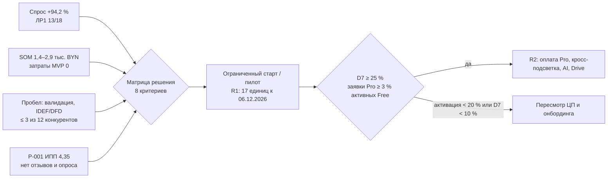

# Список рисунков ЛР7

## Сгенерировано скриптом `Python/dashboard_notacode.py`

| № в отчёте | Файл | Что показано | Где |
|---|---|---|---|
| 1 | `Рис_7_1_Дашборд_NotaCode.png` | Сводный дашборд 2×3 по ЛР1–ЛР6 | Подраздел 2 (начало); резюме, рисунок 1 |
| 2 | `Рис_7_2_Тренд_спроса.png` | Google Trends PlantUML и text to diagram, 40 мес., средние 22,83 → 44,33 (+94,2 %), тренд +0,758 п./мес | 2.3.2 |
| 3 | `Рис_7_3_TAM_SAM_SOM.png` | Диапазоны TAM 2,65–14,38 млн, SAM 23–66 тыс., SOM 1,4–2,9 тыс. BYN; линия KPI 6 480 BYN | 2.4.2 |
| 4 | `Рис_7_4_Карта_конкурентов.png` | Баллы N 20 компаний (ЛР5), цвет — итоговый уровень, пороги 4,2/3,4/2,5/1,6 | 2.5.1 |
| 5 | `Рис_7_5_Радар_Портера.png` | Пять сил и цифровые усилители (1/3/5), среднее 4,00 | 2.6 |
| 6 | `Рис_7_6_ИРП_релизов.png` | ИРП 37 единиц разработки по R1–R4 (17/10/6/4), средние, порог 3,5 | 2.12 |
| 7 | `Рис_7_7_KPI.png` | Пороги R1 (ЛР6) и KPI первого года (концепция) | 2.13 |

Перегенерация: `python -B "E:\ИИТ\ЭлектронныйБизнес\ЛР7_Итоговый_отчет\Python\dashboard_notacode.py"`.

## Сделать самой (скриншоты)

| Файл | Что должно быть видно |
|---|---|
| `scr_01_wordstat_idef0.png` | Вордстат, регион Беларусь, запрос `IDEF0`: «Показов в месяц», похожие запросы |
| `scr_02_wordstat_uml_online.png` | То же для `UML диаграмма онлайн` |
| `scr_03_serp_idef0_online.png` | Топ-10 выдачи по `IDEF0 онлайн` (инкогнито, регион Беларусь) |
| `scr_04_review_g2.png` | Отзыв на G2/Capterra о проверке нотаций, цене или версиях |
| `scr_05_survey_summary.png` | Сводка опроса (≥ 30 ответов) |

## По желанию: логика решения о старте

