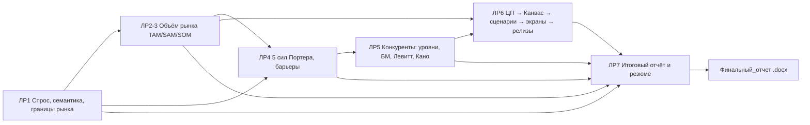

# Структура проекта «Электронный бизнес × NotaCode»

Репозиторий дисциплины «Электронный бизнес» (БГУИР, ИИТ). Объект анализа во всех лабораторных — **NotaCode**, web-IDE «diagram as code» для UML, BPMN, ERD, IDEF0/1X/3, DFD и сетей Петри. Код продукта хранится в отдельных репозиториях (`E:\NotaCode`, `E:\VisualDSL-Platform`). Здесь только бизнес-анализ.

## Дерево

```
ЭлектронныйБизнес/
├── README.md                     — обзор, статус, навигация
├── СТРУКТУРА_ПРОЕКТА.md          — этот файл
├── 00_Теория/
│   ├── Презентации/              — оригинальные презентации лекций (.pptx)
│   ├── Конспекты/                — md-конспекты каждой презентации и справочника
│   ├── Справочник/               — CSS: The Missing Manual (pdf, вспомогательный)
│   ├── Лекции_видео/<дата>/      — записи лекций (bandicam .mp4)
│   └── Лекции_конспекты/         — расшифровки и конспекты видеолекций (md)
├── ЛР1_Спрос_и_границы_рынка/
├── ЛР2-3_Объем_рынка/            — ЛР2 и ЛР3 = одна работа (подтверждено в чате группы)
├── ЛР4_Пять_сил_Портера/
├── ЛР5_Анализ_конкурентов/
├── ЛР6_ЦП_Канвас_сценарии_релизы/
├── ЛР7_Итоговый_отчет/
├── Финальный_отчет/              — единый отчёт по ЛР1–7 (Word + md-исходник + скрипт сборки)
└── _архив_DiagramCode/           — прежняя версия работ под старым названием продукта (DiagramCode)
```

## Одинаковая раскладка каждой папки ЛР

| Файл/папка | Назначение |
|---|---|
| `Материалы/` | оригинальные методички и Excel-шаблоны преподавателя (не редактируются; для ЛР2-3 ещё `Материалы_ЛР3/`) |
| `ЗАДАНИЕ.md` | полное описание задания, собранное из всех методичек архива |
| `ПЛАН.md` | подробный пошаговый план выполнения |
| `ИНСТРУКЦИЯ_ДЛЯ_МЕНЯ.md` | что сделать самой: данные, скриншоты, формулы, запуск VBA/Python, схемы |
| `ОТЧЕТ.md` | выполненная работа по NotaCode (черновик для сдачи) |
| `ЧТО_И_КАК_СДЕЛАНО.md` | кратко и подробно: что сделано, какие решения и почему |
| `ЧЕКЛИСТ.md` | требования методички со статусами ✅ / ⚠️ / 🔲 |
| `VBA/*.bas` | макросы, заполняющие Excel-шаблоны данными NotaCode и исправляющие ошибки формул |
| `Python/*.py` | расчёты и визуализации; сохраняют PNG в `Рисунки/` |
| `Рисунки/` | графики, схемы, скриншоты + `СПИСОК_РИСУНКОВ.md` |

## Как связаны лабораторные



## Git-ветки

| Ветка | Содержимое |
|---|---|
| `main` | общая часть (README, структура, теория) + `Финальный_отчет/` |
| `lab1` | main + `ЛР1_Спрос_и_границы_рынка/` |
| `lab2-3` | main + `ЛР2-3_Объем_рынка/` |
| `lab4` | main + `ЛР4_Пять_сил_Портера/` |
| `lab5` | main + `ЛР5_Анализ_конкурентов/` |
| `lab6` | main + `ЛР6_ЦП_Канвас_сценарии_релизы/` |
| `lab7` | main + `ЛР7_Итоговый_отчет/` |

На локальном диске папки всех ЛР лежат рядом. В `main` они исключены через `.git/info/exclude`, чтобы в `main` на GitHub был только финальный отчёт и общая часть.

## Условные обозначения

- ✅ сделано, ⚠️ частично, 🔲 нужно сделать самой.
- «🔲 ДОСНЯТЬ» — данные, которые можно получить только лично: Яндекс Вордстат требует Яндекс ID, нужны скриншоты с вашего экрана, ФИО преподавателя.
- «(допущение)» — экспертная оценка, которую нужно обосновать или проверить.
